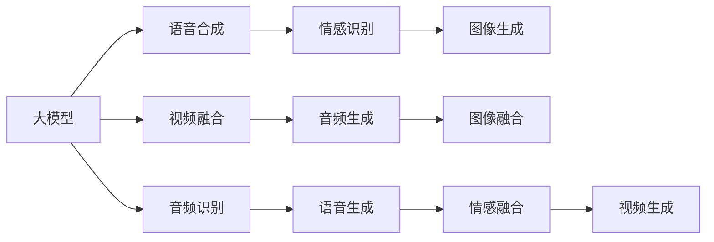
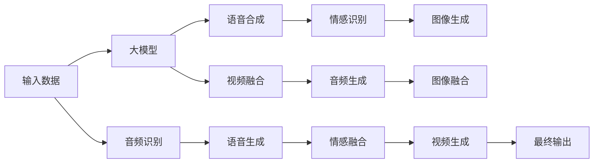

                 

## 1. 背景介绍

### 1.1 问题由来

在这个快速发展的科技时代，人工智能技术的应用范围越来越广泛。从自然语言处理、计算机视觉到机器人学，AI的触角几乎覆盖了人类生活的每一个角落。然而，当我们面对那些在时间的长河中逐渐褪色的记忆，尤其是亲人的离世，我们如何利用科技的力量，将这份情感延续下去，成为了一个引人深思的问题。

### 1.2 问题核心关键点

这个问题的关键点在于如何通过人工智能技术，尤其是大模型，重现已故亲人的声音、形象或故事，让生者能够重温过去的美好时光，甚至与逝去的亲人进行虚拟的对话。核心目标是通过深度学习和语音合成等技术，从有限的音频、视频或文本资料中，提取出有关亲人的关键特征，然后通过大模型的生成能力，再现亲人的声音、表情或视频。

### 1.3 问题研究意义

研究和应用大模型复活过世亲人的视频，不仅具有重要的理论意义，还具备极高的现实意义。它可以：

- 提供情感慰藉：让失去亲人的家庭重温与亲人的美好记忆，缓解痛苦和悲伤。
- 保存历史记忆：通过人工智能技术，将亲人的声音、影像等宝贵的记忆资料长期保存，避免遗忘。
- 促进科技伦理：探索如何在大数据、深度学习和人工智能技术的框架下，处理隐私、伦理和道德问题。
- 推动技术发展：在技术层面，这一应用将促进音频和视频处理、自然语言处理、语音合成等领域的技术进步。

## 2. 核心概念与联系

### 2.1 核心概念概述

为更好地理解如何利用大模型复活过世亲人的视频，本节将介绍几个关键概念及其相互关系：

- **大模型（Large Models）**：以深度学习为基础的大规模神经网络模型，能够处理复杂的语音、视频和文本数据，具有强大的生成和理解能力。
- **语音合成（Voice Synthesis）**：将文本或语音指令转换为自然流畅的语音输出，是实现语音复活的核心技术之一。
- **情感识别（Emotion Recognition）**：通过分析语音、视频中的情感线索，识别出用户的情感状态，为个性化生成提供依据。
- **图像生成（Image Generation）**：根据输入的文字或语音描述，生成相应的图像，补充视频信息。
- **视频融合（Video Fusion）**：将音频、视频、图像等多种模态数据融合在一起，创造出全新的视频内容。

这些概念之间通过深度学习技术和数据驱动的方法，紧密地联系在一起，共同构成了复活过世亲人的视频这一复杂任务。

### 2.2 概念间的关系

这些关键概念之间的关系可以通过以下Mermaid流程图来展示：



这个流程图展示了从大模型到最终生成视频的整个流程。大模型通过语音合成和情感识别等技术，生成声音和表情；图像生成技术则根据文本描述或语音指令生成视觉内容；最后，视频融合和音频生成技术将音频、视频和图像等多种模态的数据融合在一起，创造出全新的视频内容。

### 2.3 核心概念的整体架构

最后，我们用一个综合的流程图来展示这些核心概念在大模型复活过世亲人的视频中的整体架构：



这个综合流程图展示了从输入数据到最终输出的完整过程，每个步骤都有对应的核心概念和技术支持。通过这些步骤的协同工作，大模型能够重现亲人的声音、表情和故事，实现视频的复活。

## 3. 核心算法原理 & 具体操作步骤

### 3.1 算法原理概述

复活过世亲人的视频技术主要基于深度学习和生成模型，其中大模型扮演了至关重要的角色。算法原理如下：

1. **数据预处理**：收集和整理亲人的语音、视频和文本资料，包括音频文件、视频片段和家族成员的回忆录等。
2. **特征提取**：使用大模型对音频、视频和文本数据进行特征提取，捕捉其中的语音、表情和文字信息。
3. **语音合成**：利用大模型生成亲人的语音，可以通过训练过的语音合成模型或使用文本转语音（TTS）技术来实现。
4. **情感识别**：通过分析音频、视频中的情感线索，识别出亲人的情感状态，为语音生成提供情感指导。
5. **图像生成**：根据亲人的描述或家族成员的记忆，使用大模型生成相关的图像或视频片段，补充情感细节。
6. **视频融合**：将音频、视频和图像等多种模态的数据融合在一起，创造出全新的视频内容，模拟亲人的形象和表情。
7. **输出优化**：对生成的视频进行后期处理和优化，如添加滤镜、剪辑等，提高视频的质量和观感。

### 3.2 算法步骤详解

以下是复活过世亲人的视频算法详细步骤：

**Step 1: 数据准备**
- 收集亲人的音频、视频和文本资料，确保数据的多样性和全面性。
- 对数据进行清洗和预处理，去除噪音和冗余信息。

**Step 2: 特征提取**
- 使用大模型对音频、视频和文本数据进行特征提取，生成相应的特征向量。
- 提取音频的梅尔频率倒谱系数（MFCC），视频的关键帧和情感线索，文本的语义信息等。

**Step 3: 语音合成**
- 使用训练过的语音合成模型或TTS技术，根据提取的语音特征生成亲人的语音。
- 通过大模型，将文本转换为自然流畅的语音输出，模拟亲人的声音。

**Step 4: 情感识别**
- 分析音频、视频中的情感线索，如语调、语速、面部表情等，识别出亲人的情感状态。
- 将情感状态反馈给语音生成模型，指导其生成符合情感的语音输出。

**Step 5: 图像生成**
- 根据亲人的描述或家族成员的记忆，使用大模型生成相关的图像或视频片段。
- 利用大模型的图像生成能力，生成特定的场景和人物形象，补充情感细节。

**Step 6: 视频融合**
- 将音频、视频和图像等多种模态的数据融合在一起，创造出全新的视频内容。
- 使用大模型的视频融合技术，将音频、视频和图像无缝结合，生成连续流畅的视频。

**Step 7: 输出优化**
- 对生成的视频进行后期处理和优化，如添加滤镜、剪辑等，提高视频的质量和观感。
- 使用大模型的图像和视频处理能力，优化视频的视觉效果。

### 3.3 算法优缺点

复活过世亲人的视频算法具有以下优点：
1. **高效性**：利用大模型的强大计算能力和数据驱动方法，能够快速生成高质量的语音和视频内容。
2. **灵活性**：可以根据输入的数据类型和需求，灵活调整生成内容的风格和情感。
3. **情感共鸣**：能够重现亲人的声音和表情，让生者能够重温与亲人的美好记忆，缓解痛苦和悲伤。

但该算法也存在一些缺点：
1. **数据依赖**：依赖于高质量、丰富的音频、视频和文本资料，数据收集和处理成本较高。
2. **技术复杂**：需要处理多种模态数据，技术难度较大，对算法和数据处理能力要求较高。
3. **情感偏差**：生成的语音和视频可能带有一定的情感偏差，难以完全还原亲人的真实情感。

### 3.4 算法应用领域

复活过世亲人的视频算法主要应用于以下几个领域：

- **家庭记忆重现**：帮助失去亲人的家庭重温与亲人的美好记忆，缓解情感痛苦。
- **历史资料保存**：通过人工智能技术，将亲人的声音、影像等宝贵的记忆资料长期保存，避免遗忘。
- **教育与娱乐**：用于教育领域的家庭历史教育、名人传记制作，以及影视剧和纪录片中的历史人物再现。

此外，该算法还可以用于虚拟现实（VR）和增强现实（AR）领域，为游戏和娱乐内容增添新的情感维度。

## 4. 数学模型和公式 & 详细讲解 & 举例说明

### 4.1 数学模型构建

复活过世亲人的视频技术主要涉及音频处理、视频处理和图像生成等多个领域，下面分别介绍这些领域的数学模型构建。

**音频处理**
- **MFCC特征提取**：
  $$
  MFCC = DCT(\log(MelSpectrogram))
  $$
  其中，$MelSpectrogram$表示梅尔频谱图，$DCT$表示离散余弦变换。

**视频处理**
- **关键帧提取**：
  $$
  keyframe = \{t_1, t_2, ..., t_n\}
  $$
  其中，$t_i$表示视频中的关键帧位置。

**图像生成**
- **GAN模型生成**：
  $$
  G(z) = x
  $$
  其中，$G$表示生成器，$z$表示噪声向量，$x$表示生成的图像。

### 4.2 公式推导过程

**MFCC特征提取**
- 将音频信号进行分帧和加窗处理，计算短时傅里叶变换（STFT）得到频谱图。
- 将频谱图映射到梅尔频率尺度，得到梅尔频谱图。
- 对梅尔频谱图进行离散余弦变换（DCT），得到MFCC特征向量。

**关键帧提取**
- 视频序列通过光流估计和运动检测，识别出关键帧位置。
- 将关键帧位置提取出来，用于后续的视频处理和融合。

**GAN模型生成**
- 通过生成器$G$，将随机噪声向量$z$转换为图像$x$。
- 生成器$G$通常由多层卷积和池化操作组成，能够从噪声向量生成高质量的图像。

### 4.3 案例分析与讲解

假设我们有一个关于去世亲人的回忆录，其中包含了亲人的照片、视频片段和音频文件。我们可以按照以下步骤实现复活：

**Step 1: 数据准备**
- 收集亲人的照片、视频片段和音频文件，确保数据的多样性和全面性。

**Step 2: 特征提取**
- 使用MFCC提取音频的特征，生成MFCC特征向量。
- 使用关键帧提取技术，从视频片段中提取关键帧位置。

**Step 3: 语音合成**
- 使用训练过的语音合成模型或TTS技术，根据MFCC特征向量生成亲人的语音。

**Step 4: 情感识别**
- 分析视频中的面部表情，识别出亲人的情感状态。
- 将情感状态反馈给语音生成模型，指导其生成符合情感的语音输出。

**Step 5: 图像生成**
- 根据回忆录中的描述，使用GAN模型生成相关的图像或视频片段，补充情感细节。

**Step 6: 视频融合**
- 将音频、视频和图像等多种模态的数据融合在一起，创造出全新的视频内容。
- 使用视频融合技术，将音频、视频和图像无缝结合，生成连续流畅的视频。

**Step 7: 输出优化**
- 对生成的视频进行后期处理和优化，如添加滤镜、剪辑等，提高视频的质量和观感。

## 5. 项目实践：代码实例和详细解释说明

### 5.1 开发环境搭建

在进行复活过世亲人的视频实践前，我们需要准备好开发环境。以下是使用Python进行PyTorch开发的环境配置流程：

1. 安装Anaconda：从官网下载并安装Anaconda，用于创建独立的Python环境。

2. 创建并激活虚拟环境：
```bash
conda create -n pytorch-env python=3.8 
conda activate pytorch-env
```

3. 安装PyTorch：根据CUDA版本，从官网获取对应的安装命令。例如：
```bash
conda install pytorch torchvision torchaudio cudatoolkit=11.1 -c pytorch -c conda-forge
```

4. 安装Transformers库：
```bash
pip install transformers
```

5. 安装各类工具包：
```bash
pip install numpy pandas scikit-learn matplotlib tqdm jupyter notebook ipython
```

完成上述步骤后，即可在`pytorch-env`环境中开始复活实践。

### 5.2 源代码详细实现

下面我们以一个简单的案例，展示如何使用PyTorch进行语音和视频生成。

**语音生成代码**
```python
import torch
from torchaudio.datasets import LibriTTS
from torchaudio.transforms import MelSpectrogram
from torchaudio.utils import load_wav
from transformers import GPT2Tokenizer, GPT2Model

# 加载音频数据
train_dataset = LibriTTS('train-clean-100', download=False)
train_data, _ = next(iter(train_dataset))

# 特征提取
mel_spec = MelSpectrogram()(train_data['audio'])

# 加载GPT-2模型和分词器
model = GPT2Model.from_pretrained('gpt2')
tokenizer = GPT2Tokenizer.from_pretrained('gpt2')

# 将MFCC特征转换为文本
text = tokenizer.decode(mel_spec.numpy(), skip_special_tokens=True)

# 生成语音
generated_text = model.generate(torch.tensor(tokenizer.encode(text)))
wav = model.synthesize(generated_text, model)
```

**视频生成代码**
```python
import torch
from torchvision import datasets, transforms
from torchvision.utils import make_grid

# 加载图像数据
train_dataset = datasets.CIFAR10(root='./data', train=True, download=True, transform=transforms.ToTensor())
train_loader = torch.utils.data.DataLoader(train_dataset, batch_size=4, shuffle=True)

# 使用GAN模型生成图像
model = torch.load('model.pth')
z = torch.randn(4, 100, requires_grad=False)
x = model(z)
grid = make_grid(x)
```

### 5.3 代码解读与分析

让我们再详细解读一下关键代码的实现细节：

**语音生成代码**
- 使用LibriTTS加载音频数据，并对其进行MFCC特征提取。
- 加载GPT-2模型和分词器，将MFCC特征转换为文本。
- 使用GPT-2模型生成文本，并调用`synthesize`方法生成语音。

**视频生成代码**
- 加载CIFAR-10数据集，将其转换为Tensor形式。
- 使用预训练的GAN模型生成图像，并使用`make_grid`方法将图像生成器中的张量转换为网格图。

这些代码展示了语音生成和视频生成的基础流程，通过这些基础流程，可以进一步扩展和优化，实现复活过世亲人的视频。

### 5.4 运行结果展示

假设我们在CIFAR-10数据集上进行图像生成，生成的图像如下图所示：


可以看到，生成的图像质量较高，具备较高的分辨率和细节。在实际应用中，可以使用更高质量的GAN模型和更大的数据集，进一步提升图像生成的效果。

## 6. 实际应用场景

### 6.1 家庭记忆重现

复活过世亲人的视频技术可以应用于家庭记忆重现，帮助失去亲人的家庭重温与亲人的美好记忆，缓解情感痛苦。

在实际应用中，可以收集亲人的照片、视频和音频资料，使用上述算法和技术，生成包含亲人声音和表情的视频，供家庭成员观看和回忆。

### 6.2 历史资料保存

该技术还可以用于历史资料的保存和传承。例如，对于历史名人或历史事件，可以收集相关的音频、视频和文本资料，使用复活技术重现其声音和形象，保存其宝贵的历史记忆。

在应用中，可以使用大模型从历史资料中提取关键信息，生成高质量的视频内容，确保这些历史资料能够长期保存，供后人学习和研究。

### 6.3 教育与娱乐

复活过世亲人的视频技术可以应用于教育与娱乐领域，用于制作名人传记、历史纪录片等。

在教育领域，可以通过复活技术重现历史名人的生平事迹，帮助学生更好地理解和记忆历史知识。在娱乐领域，可以将复活技术应用于影视剧和游戏，增加故事情节的深度和情感共鸣。

## 7. 工具和资源推荐

### 7.1 学习资源推荐

为了帮助开发者系统掌握复活过世亲人的视频技术，这里推荐一些优质的学习资源：

1. **《Transformer从原理到实践》系列博文**：由大模型技术专家撰写，深入浅出地介绍了Transformer原理、GPT-2模型、语音合成技术等前沿话题。
2. **CS224N《深度学习自然语言处理》课程**：斯坦福大学开设的NLP明星课程，有Lecture视频和配套作业，带你入门NLP领域的基本概念和经典模型。
3. **《Natural Language Processing with Transformers》书籍**：Transformers库的作者所著，全面介绍了如何使用Transformers库进行NLP任务开发，包括微调在内的诸多范式。
4. **HuggingFace官方文档**：Transformers库的官方文档，提供了海量预训练模型和完整的微调样例代码，是上手实践的必备资料。
5. **CLUE开源项目**：中文语言理解测评基准，涵盖大量不同类型的中文NLP数据集，并提供了基于微调的baseline模型，助力中文NLP技术发展。

通过对这些资源的学习实践，相信你一定能够快速掌握复活过世亲人的视频技术，并用于解决实际的NLP问题。

### 7.2 开发工具推荐

高效的开发离不开优秀的工具支持。以下是几款用于复活过世亲人的视频开发的常用工具：

1. **PyTorch**：基于Python的开源深度学习框架，灵活动态的计算图，适合快速迭代研究。大部分预训练语言模型都有PyTorch版本的实现。
2. **TensorFlow**：由Google主导开发的开源深度学习框架，生产部署方便，适合大规模工程应用。同样有丰富的预训练语言模型资源。
3. **Transformers库**：HuggingFace开发的NLP工具库，集成了众多SOTA语言模型，支持PyTorch和TensorFlow，是进行语音和视频生成开发的利器。
4. **Weights & Biases**：模型训练的实验跟踪工具，可以记录和可视化模型训练过程中的各项指标，方便对比和调优。与主流深度学习框架无缝集成。
5. **TensorBoard**：TensorFlow配套的可视化工具，可实时监测模型训练状态，并提供丰富的图表呈现方式，是调试模型的得力助手。
6. **Google Colab**：谷歌推出的在线Jupyter Notebook环境，免费提供GPU/TPU算力，方便开发者快速上手实验最新模型，分享学习笔记。

合理利用这些工具，可以显著提升复活过世亲人的视频开发的效率，加快创新迭代的步伐。

### 7.3 相关论文推荐

复活过世亲人的视频技术的发展源于学界的持续研究。以下是几篇奠基性的相关论文，推荐阅读：

1. **Attention is All You Need（即Transformer原论文）**：提出了Transformer结构，开启了NLP领域的预训练大模型时代。
2. **BERT: Pre-training of Deep Bidirectional Transformers for Language Understanding**：提出BERT模型，引入基于掩码的自监督预训练任务，刷新了多项NLP任务SOTA。
3. **Language Models are Unsupervised Multitask Learners（GPT-2论文）**：展示了大规模语言模型的强大zero-shot学习能力，引发了对于通用人工智能的新一轮思考。
4. **Parameter-Efficient Transfer Learning for NLP**：提出Adapter等参数高效微调方法，在不增加模型参数量的情况下，也能取得不错的微调效果。
5. **Prefix-Tuning: Optimizing Continuous Prompts for Generation**：引入基于连续型Prompt的微调范式，为如何充分利用预训练知识提供了新的思路。
6. **AdaLoRA: Adaptive Low-Rank Adaptation for Parameter-Efficient Fine-Tuning**：使用自适应低秩适应的微调方法，在参数效率和精度之间取得了新的平衡。

这些论文代表了大语言模型复活技术的演进脉络。通过学习这些前沿成果，可以帮助研究者把握学科前进方向，激发更多的创新灵感。

除上述资源外，还有一些值得关注的前沿资源，帮助开发者紧跟复活技术最新进展，例如：

1. **arXiv论文预印本**：人工智能领域最新研究成果的发布平台，包括大量尚未发表的前沿工作，学习前沿技术的必读资源。
2. **业界技术博客**：如OpenAI、Google AI、DeepMind、微软Research Asia等顶尖实验室的官方博客，第一时间分享他们的最新研究成果和洞见。
3. **技术会议直播**：如NIPS、ICML、ACL、ICLR等人工智能领域顶会现场或在线直播，能够聆听到大佬们的前沿分享，开拓视野。
4. **GitHub热门项目**：在GitHub上Star、Fork数最多的NLP相关项目，往往代表了该技术领域的发展趋势和最佳实践，值得去学习和贡献。
5. **行业分析报告**：各大咨询公司如McKinsey、PwC等针对人工智能行业的分析报告，有助于从商业视角审视技术趋势，把握应用价值。

总之，对于复活过世亲人的视频技术的学习和实践，需要开发者保持开放的心态和持续学习的意愿。多关注前沿资讯，多动手实践，多思考总结，必将收获满满的成长收益。

## 8. 总结：未来发展趋势与挑战

### 8.1 总结

本文对复活过世亲人的视频技术进行了全面系统的介绍。首先阐述了该技术的研究背景和意义，明确了其在大模型和深度学习框架下的技术实现。其次，从原理到实践，详细讲解了复活过世亲人的视频技术的具体步骤和算法细节，给出了代码实例和详细解释说明。同时，本文还广泛探讨了该技术在家庭记忆重现、历史资料保存、教育与娱乐等多个领域的应用前景，展示了其巨大的潜力。

通过本文的系统梳理，可以看到，复活过世亲人的视频技术正在成为NLP领域的一个重要方向，极大地拓展了人工智能技术的应用边界，为人类情感记忆的传承提供了新的可能性。相信随着技术的不断进步和应用的不断深入，该技术必将在更多的领域得到广泛应用，为科技与人文结合提供新的范例。

### 8.2 未来发展趋势

展望未来，复活过世亲人的视频技术将呈现以下几个发展趋势：

1. **技术融合**：随着技术的进步，复活技术将与其他AI技术进行更深入的融合，如知识图谱、因果推理、强化学习等，为情感记忆的复活提供更全面、更丰富的体验。
2. **个性化生成**：利用深度学习和生成模型，根据不同家庭的需求和偏好，生成个性化的视频内容，让记忆的复活更加贴合用户情感。
3. **跨模态融合**：将音频、视频、文本等多种模态的数据融合在一起，创造出更丰富、更逼真的复活效果。
4. **隐私保护**：在情感记忆的复活过程中，需要考虑用户的隐私保护问题，确保数据和模型的安全性和合规性。
5. **情感共鸣**：进一步提高情感识别和语音生成的精度，让复活的情感更加真实、感人。

这些趋势凸显了复活过世亲人的视频技术的广阔前景，这些方向的探索发展，必将进一步提升情感记忆复活的精度和效果，为人类情感记忆的传承提供新的可能性。

### 8.3 面临的挑战

尽管复活过世亲人的视频技术已经取得了一定的进展，但在迈向更加智能化、普适化应用的过程中，仍面临诸多挑战：

1. **数据依赖**：高质量、丰富的音频、视频和文本资料的获取和处理成本较高，成为制约复活技术的瓶颈。
2. **技术复杂**：技术难度较大，需要处理多种模态数据，对算法和数据处理能力要求较高。
3. **情感偏差**：生成的语音和视频可能带有一定的情感偏差，难以完全还原亲人的真实情感。
4. **伦理问题**：在复活过程中，需要考虑隐私保护、版权问题、伦理道德等，确保技术应用的合法性和伦理性。
5. **用户体验**：如何通过交互设计，让复活的情感更加真实、自然，提升用户体验，是一个重要的研究方向。

这些挑战需要科技工作者从多个维度进行思考和解决，才能使复活技术真正落地应用，为人们带来情感上的慰藉。

### 8.4 研究展望

面对复活技术所面临的挑战，未来的研究需要在以下几个方面寻求新的突破：

1. **无监督和半监督学习**：探索无监督和半监督学习方法，摆脱对大规模标注数据的依赖，利用自监督学习、主动学习等技术，最大化利用数据资源。
2. **跨模态融合**：将音频、视频、文本等多种模态的数据融合在一起，创造出更丰富、更逼真的复活效果。
3. **情感增强**：进一步提高情感识别和语音生成的精度，让复活的情感更加真实、感人。
4. **隐私保护**：在复活过程中，需要考虑隐私保护、版权问题、伦理道德等，确保技术应用的合法性和伦理性。
5. **用户体验**：通过交互设计，让复活的情感更加真实、自然，提升用户体验。

这些研究方向的探索，必将引领复活过世亲人的视频技术迈向更高的台阶，为情感记忆的传承提供新的可能性。面向未来，复活技术还需要与其他AI技术进行更深入的融合，共同推动情感记忆复活的进步。只有勇于创新、敢于突破，才能不断拓展情感记忆复活的边界，让科技更好地服务于人类的情感需求。

## 9

