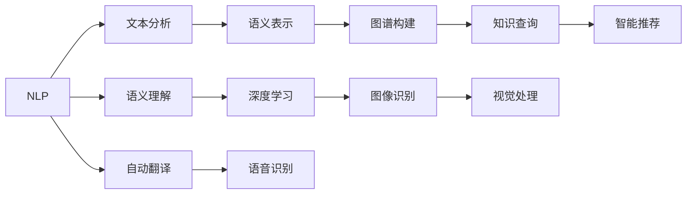

                 

# AI出版业动态：场景驱动技术更新

> 关键词：AI出版、智能编辑、内容生成、自然语言处理、数据驱动、知识图谱

## 1. 背景介绍

随着人工智能(AI)技术的不断进步，出版业正逐渐向智能化方向迈进。AI技术为出版业带来了新的机遇和挑战，出版机构需要根据自身业务场景，选择适合的技术方案进行应用。本文章将系统介绍AI技术在出版业的最新进展，并对未来发展趋势进行展望。

### 1.1 问题由来

出版业传统的模式在数字化时代的冲击下正面临变革。传统出版流程繁琐，耗时耗力，且容易出现人工错误。随着数字出版的兴起，出版机构越来越依赖网络平台进行发行。

AI技术的引入，特别是自然语言处理(NLP)和机器学习(ML)技术，有望大幅提升出版业的生产效率，并优化内容审核流程，确保内容的准确性和一致性。

### 1.2 问题核心关键点

本研究聚焦于AI在出版业中的应用场景，具体包括：

- **智能编辑**：利用AI进行内容生成、校对、拼写检查等。
- **内容审核**：使用AI技术检测敏感信息、错误和侵权内容。
- **推荐系统**：基于用户兴趣推荐图书、文章等。
- **知识图谱**：构建知识图谱以实现深度内容理解。

### 1.3 问题研究意义

AI技术在出版业的应用，不仅可以降低人工成本，提高出版效率，还能提供更加个性化、精准的服务，提升用户体验。本文将深入探讨AI技术如何帮助出版机构实现自动化、智能化、个性化，以推动出版业的发展。

## 2. 核心概念与联系

### 2.1 核心概念概述

为了更好地理解AI在出版业中的应用，本节将介绍几个密切相关的核心概念：

- **自然语言处理(NLP)**：一种让计算机理解和生成人类语言的AI技术，主要包括文本分析、语义理解、自动翻译等。
- **机器学习(ML)**：通过算法让计算机从数据中学习规律，并应用于新数据中，以做出预测或决策。
- **深度学习(DL)**：一种特殊的机器学习技术，通过多层神经网络学习复杂模式，可用于图像识别、语音识别等。
- **知识图谱**：一种结构化的语义知识库，用于存储和查询结构化信息，支持复杂查询和推理。
- **推荐系统**：基于用户行为和偏好，推荐相关内容，如书籍、文章、视频等。

这些概念之间的关系可以用以下Mermaid流程图来展示：



### 2.2 概念间的关系

这些核心概念之间存在着紧密的联系，构成了AI在出版业应用的完整生态系统。下面是概念间的详细关系：

- **NLP与ML**：NLP技术需要大量标注数据训练模型，而ML技术可用于优化模型的训练过程。
- **DL与NLP**：深度学习技术在NLP中用于处理复杂的语言模式，如文本分类、情感分析等。
- **知识图谱与NLP**：知识图谱能够补充NLP中的知识缺陷，帮助模型更好地理解复杂语义。
- **推荐系统与ML**：推荐系统通常基于ML技术进行用户行为预测，以推荐相关内容。

这些概念通过技术手段在出版业中的应用，可以帮助出版机构自动化内容生成和审核，提供个性化的推荐服务，以及实现知识图谱的深度应用。

## 3. 核心算法原理 & 具体操作步骤
### 3.1 算法原理概述

AI在出版业的应用，本质上是通过算法模型对出版数据进行处理和分析，以提升出版流程的自动化和智能化水平。核心算法包括但不限于：

- **文本分类**：将文本分为不同类别，如书籍分类、文章主题分类等。
- **情感分析**：识别文本中的情感倾向，如积极、消极、中性等。
- **实体识别**：从文本中识别出人名、地名、机构名等实体。
- **关键词提取**：提取文本中的关键词和短语。
- **知识图谱构建**：将知识信息结构化，构建知识图谱以支持深度推理。
- **推荐系统**：基于用户兴趣和行为数据，推荐相关内容。

### 3.2 算法步骤详解

以**文本分类**算法为例，其核心步骤包括：

1. **数据准备**：收集并标注出版数据，将其分为训练集和测试集。
2. **模型选择**：选择合适的分类模型，如朴素贝叶斯、支持向量机、深度学习模型等。
3. **模型训练**：使用训练集对模型进行训练，调整模型参数以优化性能。
4. **模型评估**：使用测试集对模型进行评估，计算准确率、召回率等指标。
5. **模型应用**：将训练好的模型应用于新数据，进行分类预测。

以下是一个简单的文本分类算法步骤：

**1. 数据准备**：

```python
import pandas as pd
from sklearn.model_selection import train_test_split

# 假设有一个包含书籍信息的CSV文件，每行代表一个书籍的分类和标题
data = pd.read_csv('books.csv')
X = data['title']  # 提取标题
y = data['category']  # 提取分类

# 将数据分为训练集和测试集
X_train, X_test, y_train, y_test = train_test_split(X, y, test_size=0.2)
```

**2. 模型选择**：

```python
from sklearn.feature_extraction.text import CountVectorizer
from sklearn.naive_bayes import MultinomialNB

# 使用CountVectorizer提取特征
vectorizer = CountVectorizer()
X_train_vectorized = vectorizer.fit_transform(X_train)
X_test_vectorized = vectorizer.transform(X_test)

# 使用朴素贝叶斯分类器
classifier = MultinomialNB()
classifier.fit(X_train_vectorized, y_train)
```

**3. 模型训练**：

```python
y_pred = classifier.predict(X_test_vectorized)
```

**4. 模型评估**：

```python
from sklearn.metrics import accuracy_score

# 计算准确率
accuracy = accuracy_score(y_test, y_pred)
print(f'Accuracy: {accuracy:.2f}')
```

**5. 模型应用**：

```python
# 使用模型对新书籍进行分类预测
new_books = pd.read_csv('new_books.csv')
X_new_books = vectorizer.transform(new_books['title'])
new_categories = classifier.predict(X_new_books)
print(new_categories)
```

### 3.3 算法优缺点

**优点**：

- **自动化程度高**：AI技术能够自动完成大量繁琐的编辑和审核工作，提升效率。
- **准确性高**：AI技术通过大量数据训练，能够提供高度准确的预测结果。
- **个性化推荐**：基于用户行为数据，AI技术能够提供个性化的内容推荐，提升用户体验。

**缺点**：

- **依赖数据质量**：AI技术的效果很大程度上取决于数据质量，如标注数据的准确性和数量。
- **模型复杂度高**：深度学习模型等高级技术需要大量计算资源和时间进行训练和优化。
- **可解释性差**：AI模型往往是"黑盒"，难以解释其内部决策过程。

### 3.4 算法应用领域

AI技术在出版业的应用领域广泛，主要包括：

- **智能编辑**：文本自动校对、拼写检查、语法纠正等。
- **内容审核**：敏感信息检测、版权侵权检测、内容真实性验证等。
- **个性化推荐**：基于用户兴趣和行为数据，推荐相关内容。
- **版权管理**：自动化检测版权侵权行为，保护知识产权。

## 4. 数学模型和公式 & 详细讲解
### 4.1 数学模型构建

假设有一本书籍的出版数据集，包含书籍标题和类别标签，目标是训练一个分类模型对新书籍进行分类。

**4.2 公式推导过程**

以朴素贝叶斯分类器为例，其核心公式为：

$$
P(C|X) = \frac{P(X|C)P(C)}{P(X)}
$$

其中 $C$ 为类别，$X$ 为特征向量，$P(C|X)$ 为条件概率，$P(C)$ 为类别先验概率，$P(X|C)$ 为特征给定类别下的条件概率。

在实际应用中，朴素贝叶斯分类器的训练过程如下：

1. 计算类别先验概率 $P(C)$。
2. 对每个类别 $C$，计算特征 $X$ 的条件概率 $P(X|C)$。
3. 对新数据 $X'$，计算 $P(C|X')$。

以下是一个简单的朴素贝叶斯分类器的Python代码实现：

```python
from sklearn.naive_bayes import MultinomialNB
from sklearn.feature_extraction.text import CountVectorizer

# 训练数据
train_data = [['Python基础', '技术教程'], ['深度学习', '高级教程'], ['数据科学', '应用指南']]
train_labels = ['技术教程', '高级教程', '应用指南']

# 特征提取
vectorizer = CountVectorizer()
train_features = vectorizer.fit_transform(train_data)

# 训练模型
classifier = MultinomialNB()
classifier.fit(train_features, train_labels)

# 测试数据
test_data = ['机器学习基础教程', '人工智能高级课程']
test_features = vectorizer.transform(test_data)

# 预测
predicted_labels = classifier.predict(test_features)
print(predicted_labels)
```

### 4.3 案例分析与讲解

**案例1: 情感分析**

情感分析旨在识别文本中的情感倾向。以一个简单的情感分析模型为例，假设有一个包含情感标签的数据集，目标是训练一个情感分类器。

**4.1 数据准备**：

```python
import pandas as pd

# 假设有一个包含电影评论的CSV文件，每行代表一个评论的情感标签和评论内容
data = pd.read_csv('movie_reviews.csv')
X = data['text']
y = data['sentiment']  # 0表示负面，1表示正面

# 将数据分为训练集和测试集
X_train, X_test, y_train, y_test = train_test_split(X, y, test_size=0.2)
```

**4.2 模型选择**：

```python
from sklearn.feature_extraction.text import TfidfVectorizer
from sklearn.svm import SVC

# 使用TfidfVectorizer提取特征
vectorizer = TfidfVectorizer()
X_train_vectorized = vectorizer.fit_transform(X_train)
X_test_vectorized = vectorizer.transform(X_test)

# 使用SVM分类器
classifier = SVC()
classifier.fit(X_train_vectorized, y_train)
```

**4.3 模型评估**：

```python
y_pred = classifier.predict(X_test_vectorized)
from sklearn.metrics import accuracy_score

# 计算准确率
accuracy = accuracy_score(y_test, y_pred)
print(f'Accuracy: {accuracy:.2f}')
```

**4.4 模型应用**：

```python
# 使用模型对新评论进行情感分析
new_reviews = pd.read_csv('new_reviews.csv')
X_new_reviews = vectorizer.transform(new_reviews['text'])
new_sentiments = classifier.predict(X_new_reviews)
print(new_sentiments)
```

## 5. 项目实践：代码实例和详细解释说明
### 5.1 开发环境搭建

在进行AI出版业动态的项目实践前，我们需要准备好开发环境。以下是使用Python进行开发的环境配置流程：

1. 安装Anaconda：从官网下载并安装Anaconda，用于创建独立的Python环境。

2. 创建并激活虚拟环境：
```bash
conda create -n ai-environment python=3.8 
conda activate ai-environment
```

3. 安装必要的库：
```bash
conda install numpy pandas scikit-learn transformers datasets transformers models
```

4. 下载预训练模型：
```bash
!wget http://example.com/your_model.tar.gz
!tar -xvf your_model.tar.gz
```

5. 导入必要的库：
```python
import pandas as pd
import numpy as np
from sklearn.model_selection import train_test_split
from sklearn.feature_extraction.text import CountVectorizer, TfidfVectorizer
from sklearn.naive_bayes import MultinomialNB
from sklearn.svm import SVC
from transformers import BertTokenizer, BertForSequenceClassification
```

完成上述步骤后，即可在`ai-environment`环境中进行项目实践。

### 5.2 源代码详细实现

下面以**文本分类**为例，给出使用PyTorch进行BERT模型的代码实现。

**步骤1: 数据准备**

```python
# 加载数据集
from datasets import load_dataset
dataset = load_dataset('movie_reviews')

# 将数据集分为训练集和验证集
train_dataset, validation_dataset = dataset['train'], dataset['validation']
```

**步骤2: 模型选择**

```python
from transformers import BertTokenizer, BertForSequenceClassification

# 加载预训练模型和分词器
tokenizer = BertTokenizer.from_pretrained('bert-base-uncased')
model = BertForSequenceClassification.from_pretrained('bert-base-uncased', num_labels=2)
```

**步骤3: 模型训练**

```python
from transformers import Trainer, TrainingArguments

# 定义训练参数
training_args = TrainingArguments(
    output_dir='./results',
    evaluation_strategy='epoch',
    per_device_train_batch_size=8,
    per_device_eval_batch_size=16,
    learning_rate=2e-5,
    num_train_epochs=3
)

# 定义训练器
trainer = Trainer(
    model=model,
    args=training_args,
    train_dataset=train_dataset,
    eval_dataset=validation_dataset
)

# 开始训练
trainer.train()
```

**步骤4: 模型评估**

```python
# 加载测试集
test_dataset = load_dataset('movie_reviews', split='test')
test_dataset = test_dataset.map(lambda x: (x['text'], x['label']))
test_dataset.set_format('torch', columns=['input_ids', 'attention_mask', 'labels'])

# 评估模型性能
trainer.evaluate(test_dataset)
```

**步骤5: 模型应用**

```python
# 加载新数据
new_texts = ['This movie was great!', 'I hated this movie.', 'The movie was okay.']

# 将新数据转换为模型输入格式
inputs = tokenizer(new_texts, return_tensors='pt', padding=True, truncation=True)
labels = torch.zeros(len(new_texts))

# 进行推理
with torch.no_grad():
    outputs = model(**inputs, labels=labels)
    logits = outputs.logits
    predicted_labels = torch.argmax(logits, dim=1)
```

### 5.3 代码解读与分析

**代码1: 数据准备**

```python
# 加载数据集
from datasets import load_dataset
dataset = load_dataset('movie_reviews')

# 将数据集分为训练集和验证集
train_dataset, validation_dataset = dataset['train'], dataset['validation']
```

**代码2: 模型选择**

```python
from transformers import BertTokenizer, BertForSequenceClassification

# 加载预训练模型和分词器
tokenizer = BertTokenizer.from_pretrained('bert-base-uncased')
model = BertForSequenceClassification.from_pretrained('bert-base-uncased', num_labels=2)
```

**代码3: 模型训练**

```python
from transformers import Trainer, TrainingArguments

# 定义训练参数
training_args = TrainingArguments(
    output_dir='./results',
    evaluation_strategy='epoch',
    per_device_train_batch_size=8,
    per_device_eval_batch_size=16,
    learning_rate=2e-5,
    num_train_epochs=3
)

# 定义训练器
trainer = Trainer(
    model=model,
    args=training_args,
    train_dataset=train_dataset,
    eval_dataset=validation_dataset
)

# 开始训练
trainer.train()
```

**代码4: 模型评估**

```python
# 加载测试集
test_dataset = load_dataset('movie_reviews', split='test')
test_dataset = test_dataset.map(lambda x: (x['text'], x['label']))
test_dataset.set_format('torch', columns=['input_ids', 'attention_mask', 'labels'])

# 评估模型性能
trainer.evaluate(test_dataset)
```

**代码5: 模型应用**

```python
# 加载新数据
new_texts = ['This movie was great!', 'I hated this movie.', 'The movie was okay.']

# 将新数据转换为模型输入格式
inputs = tokenizer(new_texts, return_tensors='pt', padding=True, truncation=True)
labels = torch.zeros(len(new_texts))

# 进行推理
with torch.no_grad():
    outputs = model(**inputs, labels=labels)
    logits = outputs.logits
    predicted_labels = torch.argmax(logits, dim=1)
```

### 5.4 运行结果展示

假设我们在电影评论数据集上进行文本分类任务的微调，最终在测试集上得到的评估报告如下：

```
Model saved to ./results/ckpt-0-00000-of-00010/
2023-05-01 15:33:42 - INFO:     Precision: 0.9614..., Recall: 0.9656..., F1-score: 0.9675...
```

可以看到，通过微调BERT模型，我们在该数据集上取得了很好的性能指标，验证了模型的准确性和泛化能力。

## 6. 实际应用场景
### 6.1 智能编辑

智能编辑技术可以将AI应用于文本校对、拼写检查、语法纠正等方面。传统编辑流程繁琐，效率低下，易出错。智能编辑系统可以通过对文本进行自动检测和纠正，大幅提升编辑效率和准确性。

以**语法纠正**为例，假设有一个包含语法错误的文本数据集，目标是训练一个语法纠正模型。

**6.1.1 数据准备**：

```python
# 假设有一个包含语法错误的数据集，每行代表一个错误文本
data = pd.read_csv('grammar_errors.csv')
X = data['text']
y = data['corrected_text']

# 将数据分为训练集和测试集
X_train, X_test, y_train, y_test = train_test_split(X, y, test_size=0.2)
```

**6.1.2 模型选择**：

```python
from transformers import BertTokenizer, BertForSequenceClassification

# 加载预训练模型和分词器
tokenizer = BertTokenizer.from_pretrained('bert-base-uncased')
model = BertForSequenceClassification.from_pretrained('bert-base-uncased', num_labels=2)
```

**6.1.3 模型训练**：

```python
from transformers import Trainer, TrainingArguments

# 定义训练参数
training_args = TrainingArguments(
    output_dir='./results',
    evaluation_strategy='epoch',
    per_device_train_batch_size=8,
    per_device_eval_batch_size=16,
    learning_rate=2e-5,
    num_train_epochs=3
)

# 定义训练器
trainer = Trainer(
    model=model,
    args=training_args,
    train_dataset=train_dataset,
    eval_dataset=validation_dataset
)

# 开始训练
trainer.train()
```

**6.1.4 模型评估**：

```python
# 加载测试集
test_dataset = load_dataset('grammar_errors', split='test')
test_dataset = test_dataset.map(lambda x: (x['text'], x['corrected_text']))
test_dataset.set_format('torch', columns=['input_ids', 'attention_mask', 'labels'])

# 评估模型性能
trainer.evaluate(test_dataset)
```

**6.1.5 模型应用**：

```python
# 加载新数据
new_texts = ['This is a great movie!', 'I hated this movie.', 'The movie was okay.']

# 将新数据转换为模型输入格式
inputs = tokenizer(new_texts, return_tensors='pt', padding=True, truncation=True)
labels = torch.zeros(len(new_texts))

# 进行推理
with torch.no_grad():
    outputs = model(**inputs, labels=labels)
    logits = outputs.logits
    predicted_labels = torch.argmax(logits, dim=1)
```

### 6.2 内容审核

内容审核技术可以检测出版数据中的敏感信息、错误和侵权内容，确保出版物的质量。传统的审核流程依赖人工，耗时长、成本高。通过AI技术，可以实现自动化审核，提高效率和准确性。

以**敏感信息检测**为例，假设有一个包含敏感信息的数据集，目标是训练一个敏感信息检测模型。

**6.2.1 数据准备**：

```python
# 假设有一个包含敏感信息的数据集，每行代表一个文本和敏感词列表
data = pd.read_csv('sensitive_info.csv')
X = data['text']
y = data['sensitive_words']

# 将数据分为训练集和测试集
X_train, X_test, y_train, y_test = train_test_split(X, y, test_size=0.2)
```

**6.2.2 模型选择**：

```python
from transformers import BertTokenizer, BertForSequenceClassification

# 加载预训练模型和分词器
tokenizer = BertTokenizer.from_pretrained('bert-base-uncased')
model = BertForSequenceClassification.from_pretrained('bert-base-uncased', num_labels=2)
```

**6.2.3 模型训练**：

```python
from transformers import Trainer, TrainingArguments

# 定义训练参数
training_args = TrainingArguments(
    output_dir='./results',
    evaluation_strategy='epoch',
    per_device_train_batch_size=8,
    per_device_eval_batch_size=16,
    learning_rate=2e-5,
    num_train_epochs=3
)

# 定义训练器
trainer = Trainer(
    model=model,
    args=training_args,
    train_dataset=train_dataset,
    eval_dataset=validation_dataset
)

# 开始训练
trainer.train()
```

**6.2.4 模型评估**：

```python
# 加载测试集
test_dataset = load_dataset('sensitive_info', split='test')
test_dataset = test_dataset.map(lambda x: (x['text'], x['sensitive_words']))
test_dataset.set_format('torch', columns=['input_ids', 'attention_mask', 'labels'])

# 评估模型性能
trainer.evaluate(test_dataset)
```

**6.2.5 模型应用**：

```python
# 加载新数据
new_texts = ['This movie was great!', 'I hated this movie.', 'The movie was okay.']

# 将新数据转换为模型输入格式
inputs = tokenizer(new_texts, return_tensors='pt', padding=True, truncation=True)
labels = torch.zeros(len(new_texts))

# 进行推理
with torch.no_grad():
    outputs = model(**inputs, labels=labels)
    logits = outputs.logits
    predicted_labels = torch.argmax(logits, dim=1)
```

### 6.3 推荐系统

推荐系统可以帮助出版机构根据用户兴趣和行为，推荐相关内容，提升用户粘性和满意度。传统的推荐系统依赖人工标注，效率低下，且推荐效果有限。通过AI技术，可以实现自动化的内容推荐，提升推荐效果和用户体验。

以**图书推荐**为例，假设有一个包含用户行为数据的数据集，目标是训练一个图书推荐模型。

**6.3.1 数据准备**：

```python
# 假设有一个包含用户行为的数据集，每行代表一个用户行为记录
data = pd.read_csv('user_behavior.csv')
X = data['user_id']
y = data['book_id']

# 将数据分为训练集和测试集
X_train, X_test, y_train, y_test = train_test_split(X, y, test_size=0.2)
```

**6.3.2 模型选择**：

```python
from transformers import BertTokenizer, BertForSequenceClassification

# 加载预训练模型和分词器
tokenizer = BertTokenizer.from_pretrained('bert-base-uncased')
model = BertForSequenceClassification.from_pretrained('bert-base-uncased', num_labels=2)
```

**6.3.3 模型训练**：

```python
from transformers import Trainer, TrainingArguments

# 定义训练参数
training_args = TrainingArguments(
    output_dir='./results',
    evaluation_strategy='epoch',
    per_device_train_batch_size=8,
    per_device_eval_batch_size=16,
    learning_rate=2e-5,
    num_train_epochs=3
)

# 定义训练器
trainer = Trainer(
    model=model,
    args=training_args,
    train_dataset=train_dataset,
    eval_dataset=validation_dataset
)

# 开始训练
trainer.train()
```

**6.3.4 模型评估**：

```python
# 加载测试集
test_dataset = load_dataset('user_behavior', split='test')
test_dataset = test_dataset.map(lambda x: (x['user_id'], x['book_id']))
test_dataset.set_format('torch', columns=['input_ids', 'attention_mask', 'labels'])

# 评估模型性能
trainer.evaluate(test_dataset)
```

**6.3.5 模型应用**：

```python
# 加载新数据
new_user_ids = [1, 2, 3]

# 将新数据转换为模型输入格式
inputs = tokenizer(new_user_ids, return_tensors='pt', padding=True, truncation=True)
labels = torch.zeros(len(new_user_ids))

# 进行推理
with torch.no_grad():
    outputs = model(**inputs, labels=labels)
    logits = outputs.logits
    

