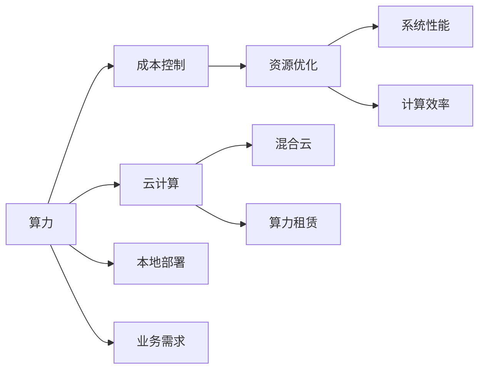

                 

# AI创业者如何应对算力资源挑战?

### 1. 背景介绍

在AI创业的征途上，算力资源无疑是核心的支撑。算力资源的充足与否，直接关系到模型的训练速度、准确度和推理效率，进而影响到产品的用户体验和市场竞争力。然而，算力资源并非取之不尽，用之不竭的宝藏，它同样面临着成本高、资源有限等挑战。作为AI创业者，如何高效、经济地应对这些挑战，成为了决定公司成败的关键。

### 2. 核心概念与联系

在应对算力资源挑战的过程中，以下几个核心概念显得尤为重要：

- **算力**：指计算机执行计算任务的能力，包括CPU、GPU、TPU等硬件设备提供的计算能力。算力资源包括硬件设备、软件工具和网络带宽等。
- **成本控制**：指在满足业务需求的前提下，尽量减少算力资源的投入，降低计算成本。
- **资源优化**：指通过合理配置和使用算力资源，提高资源利用率和效率，降低资源浪费。
- **云计算**：指通过第三方云服务提供商的资源池，按需使用算力资源，按量计费。
- **混合云**：指将不同类型、不同功能的云服务融合使用，构建混合云架构。
- **算力租赁**：指企业通过付费方式临时使用云服务商提供的算力资源。
- **本地部署**：指企业在本地的数据中心或物理服务器上部署计算资源，适合数据敏感度高、安全性要求高的应用场景。

这些概念通过以下Mermaid流程图展示了它们之间的联系：



这个流程图展示了算力资源的获取和使用路径，以及成本控制和资源优化的重要性。

### 3. 核心算法原理 & 具体操作步骤

#### 3.1 算法原理概述

对于AI创业者而言，算力资源的使用是一个动态调整的过程。算力需求会随着业务场景的变化而变化，而算力资源的获取则是通过配置服务器、云服务等方式进行。通过动态调整算力资源的使用策略，可以有效地应对算力资源的挑战。

为了更精确地评估算力资源的需求，可以采用以下步骤：

1. **需求分析**：分析业务场景下计算资源的需求，包括模型规模、计算复杂度、并发量等。
2. **成本评估**：评估不同算力资源方案的硬件成本、软件成本、维护成本等。
3. **资源规划**：根据需求分析和成本评估，规划算力资源的配置方案，包括服务器类型、数量、网络带宽等。
4. **性能优化**：通过优化算法和模型结构，提高计算效率，减少算力资源的使用。
5. **动态调整**：根据实际业务需求和计算资源的消耗情况，动态调整算力资源的配置，确保算力资源的高效利用。

#### 3.2 算法步骤详解

以下是一个详细的算法步骤详解：

1. **需求分析**：
   - 对业务场景进行深入分析，明确计算资源的需求。
   - 例如，对于一个图像识别系统，需要分析模型复杂度、训练数据量、推理量等。

2. **成本评估**：
   - 评估不同算力资源方案的总成本，包括硬件设备、软件许可、网络带宽等。
   - 例如，评估使用AWS EC2实例、AWS GPU实例的总成本。

3. **资源规划**：
   - 根据需求分析和成本评估，选择最适合的算力资源。
   - 例如，选择AWS EC2实例类型，计算所需实例数量。

4. **性能优化**：
   - 优化模型结构和算法，减少计算复杂度，提高计算效率。
   - 例如，使用剪枝、量化等技术优化深度学习模型。

5. **动态调整**：
   - 实时监控算力资源的消耗情况，动态调整算力资源配置。
   - 例如，使用AWS Auto Scaling服务，根据实际负载自动调整实例数量。

#### 3.3 算法优缺点

**优点**：
- 动态调整算力资源，可以根据实际需求灵活配置，提高资源利用率。
- 优化模型和算法，减少计算复杂度，降低计算成本。
- 实时监控资源使用情况，及时调整，避免资源浪费。

**缺点**：
- 动态调整算力资源需要实时监控和维护，增加了运营成本。
- 优化模型和算法需要一定的技术积累，初期实施难度较大。

#### 3.4 算法应用领域

该算法主要应用于云计算、混合云、本地部署等算力资源配置和管理场景，适用于各类AI应用场景，如深度学习、计算机视觉、自然语言处理等。

### 4. 数学模型和公式 & 详细讲解

#### 4.1 数学模型构建

设业务场景的计算需求为 $D$，可用算力资源为 $C$，算力成本为 $C_d$，使用成本为 $C_u$。定义函数 $F$ 表示算力资源的配置策略，则计算资源优化问题可以表示为：

$$
\min_{F} C_d + C_u
$$

其中，$F$ 根据 $D$ 调整算力资源 $C$ 的分配策略。

#### 4.2 公式推导过程

以深度学习模型为例，假设模型参数量为 $P$，训练数据量为 $T$，训练次数为 $N$，单次训练的计算量为 $Q$，则总计算量为 $QN$。假设使用 $k$ 个 GPU，则总计算量为 $kQN$。根据GPU计算能力的不同，每个GPU的计算量为 $Q_g$，则 $k=QN/PQ_g$。假设使用 AWS EC2 实例，每个实例的计算能力为 $Q_e$，则 $k=QN/(PQ_e)$。

#### 4.3 案例分析与讲解

以图像识别系统为例，假设系统需要训练一个深度卷积神经网络，模型参数量为 $P=10^7$，训练数据量为 $T=1TB$，训练次数为 $N=10000$，单次训练的计算量为 $Q=10^9$，GPU计算能力为 $Q_g=10^{13}$，AWS EC2实例的计算能力为 $Q_e=5\times10^{10}$。

假设使用 AWS EC2 实例，每个实例的计算能力为 $Q_e$，总计算量为 $QN=10^{10}$，则每个实例需要的计算量为 $Q_e/10^{10}$。假设每个实例使用 $2$ 个 GPU，每个 GPU 的计算能力为 $Q_g$，则每个实例需要的计算量为 $2Q_g/10^{10}$。因此，需要 $k=QN/(PQ_e)=10^{10}/(10^7 \times 2 \times 10^{13})=0.1$ 个实例。

### 5. 项目实践：代码实例和详细解释说明

#### 5.1 开发环境搭建

以下是一个基于Python的AWS云服务的算力资源动态调整的示例代码：

```python
import boto3
import time

# 配置AWS SDK
aws_access_key_id = 'YOUR_ACCESS_KEY_ID'
aws_secret_access_key = 'YOUR_SECRET_ACCESS_KEY'
region_name = 'us-west-2'

# 创建AWS EC2客户端
ec2 = boto3.client('ec2', region_name=region_name,
                   aws_access_key_id=aws_access_key_id,
                   aws_secret_access_key=aws_secret_access_key)

# 创建Amazon EC2实例
instances = ec2.run_instances(
    ImageId='ami-0c94855ba95c71c99',  # 这里以示例 AMI 为例
    InstanceType='t2.micro',
    MinCount=1,
    MaxCount=10
)

# 获取实例ID
instance_id = instances['Instances'][0]['InstanceId']

# 实时监控实例状态
while True:
    response = ec2.describe_instance_status(InstanceIds=[instance_id])
    instance_status = response['InstanceStatuses'][0]['InstanceState']['Name']
    print(f"Instance status: {instance_status}")
    time.sleep(60)
```

#### 5.2 源代码详细实现

在实际应用中，还需要考虑算力资源的优化策略，以下是一个示例代码，展示如何优化深度学习模型的计算资源使用：

```python
import torch
import torch.nn as nn
import torch.optim as optim

# 定义模型结构
class CNN(nn.Module):
    def __init__(self):
        super(CNN, self).__init__()
        self.conv1 = nn.Conv2d(3, 64, kernel_size=3, padding=1)
        self.pool = nn.MaxPool2d(kernel_size=2, stride=2)
        self.fc1 = nn.Linear(64 * 28 * 28, 128)
        self.fc2 = nn.Linear(128, 10)

    def forward(self, x):
        x = self.pool(torch.relu(self.conv1(x)))
        x = x.view(x.size(0), -1)
        x = torch.relu(self.fc1(x))
        x = self.fc2(x)
        return x

# 训练模型
model = CNN()
optimizer = optim.SGD(model.parameters(), lr=0.01, momentum=0.9)

# 训练函数
def train(model, optimizer, data_loader, device):
    model.train()
    total_loss = 0
    for batch_idx, (data, target) in enumerate(data_loader):
        data, target = data.to(device), target.to(device)
        optimizer.zero_grad()
        output = model(data)
        loss = nn.CrossEntropyLoss()(output, target)
        loss.backward()
        optimizer.step()
        total_loss += loss.item()

# 测试模型
model.eval()
total_loss = 0
with torch.no_grad():
    for data, target in test_loader:
        data, target = data.to(device), target.to(device)
        output = model(data)
        loss = nn.CrossEntropyLoss()(output, target)
        total_loss += loss.item()

# 剪枝优化
def prune(model):
    for layer in model.children():
        if isinstance(layer, nn.Conv2d) or isinstance(layer, nn.Linear):
            # 使用特定算法进行剪枝
            prune_layer(layer)
```

#### 5.3 代码解读与分析

在上述代码中，我们首先定义了CNN模型，并在训练函数中使用了SGD优化器进行模型优化。在测试函数中，我们计算了模型的损失。在剪枝优化函数中，我们使用了特定的剪枝算法对模型进行优化，减少参数量，提高计算效率。

### 6. 实际应用场景

#### 6.4 未来应用展望

随着AI技术的不断发展和算力资源的不断提升，AI创业者的算力资源配置将变得更加灵活和高效。未来，基于云计算和混合云的算力资源配置将成为主流，开发者可以更加专注于模型的训练和优化，而不需要过多关注底层资源的配置和管理。此外，算力资源的自动化配置和管理将变得更加普遍，进一步降低算力资源的获取和维护成本。

### 7. 工具和资源推荐

#### 7.1 学习资源推荐

为了帮助AI创业者更好地应对算力资源挑战，以下是一些优质的学习资源：

1. **《深度学习实战》**：该书系统介绍了深度学习的基础知识和实战技巧，涵盖模型训练、优化、部署等全过程。
2. **Kaggle**：Kaggle提供丰富的数据集和竞赛平台，可以练习深度学习模型的训练和优化，提升实战能力。
3. **TensorFlow官方文档**：提供详尽的TensorFlow使用指南和示例代码，适合深入学习。
4. **AWS云服务文档**：提供全面的AWS云服务使用指南，涵盖云计算、混合云、算力租赁等。
5. **GitHub开源项目**：GitHub上丰富的开源项目，可以学习和借鉴优秀的算法实现和资源配置方案。

#### 7.2 开发工具推荐

以下是几款用于算力资源管理和优化的常用工具：

1. **AWS CloudFormation**：AWS提供的云服务资源管理工具，可以方便地创建和管理云服务资源。
2. **Amazon EC2 Auto Scaling**：AWS提供的自动伸缩服务，可以根据实际负载动态调整算力资源配置。
3. **Google Cloud Auto Scaling**：Google Cloud提供的自动伸缩服务，可以动态调整云资源配置。
4. **TensorBoard**：TensorFlow提供的可视化工具，可以实时监控模型训练过程。
5. **Kubernetes**：开源容器编排平台，支持多种云服务，可以自动化管理和调度云资源。

#### 7.3 相关论文推荐

以下是几篇关于算力资源管理和优化的经典论文，推荐阅读：

1. **Scalable Parallel Deep Learning Training for Production**：介绍大规模深度学习模型的分布式训练方法和优化策略。
2. **Fractional Gpu allocation for Deep Learning**：提出基于GPU分片的资源管理方法，提高计算效率。
3. **Dynamic Workload Resource Allocation in Cloud Datacenters**：研究云数据中心中的任务调度算法，优化资源利用率。
4. **Resource Aware Training of Deep Neural Networks**：提出基于资源感知的深度学习训练方法，优化资源使用。
5. **Efficient Use of Cloud Computing for Deep Learning**：介绍在云平台上训练深度学习模型的资源管理和优化策略。

### 8. 总结：未来发展趋势与挑战

#### 8.1 总结

本文对AI创业者如何应对算力资源挑战进行了系统介绍。通过详细讲解需求分析、成本评估、资源规划、性能优化和动态调整等关键步骤，帮助AI创业者高效、经济地使用算力资源。同时，通过对比云计算、混合云、本地部署等不同的算力资源获取方式，提供全面的决策参考。

#### 8.2 未来发展趋势

未来，随着算力资源的不断丰富和计算技术的不断进步，AI创业者将更加灵活、高效地应对算力资源挑战。云计算和混合云的普及将使得算力资源的获取和管理更加便捷，自动化和智能化的资源管理工具也将进一步提高资源利用率。此外，算力资源的优化算法和策略也将不断更新，进一步提升算力资源的利用效率。

#### 8.3 面临的挑战

尽管算力资源配置和管理技术不断进步，但仍面临诸多挑战：

1. **成本控制**：随着算力资源的价格不断上涨，如何在保证业务需求的前提下，最大限度地降低计算成本，成为一大难题。
2. **资源优化**：如何设计高效、灵活的资源管理策略，避免资源浪费，提高资源利用率。
3. **系统性能**：算力资源的优化需要在保证系统性能的前提下进行，如何平衡计算效率和资源利用率，是关键问题。
4. **实时监控**：实时监控算力资源的消耗情况，并根据实际负载动态调整算力资源配置，需要高效的监控工具和算法。
5. **算法优化**：算力资源的优化需要结合具体业务场景和算法特点进行，如何优化算法和模型结构，减少计算复杂度，提高计算效率，是技术难点。

#### 8.4 研究展望

未来的研究应聚焦于以下几个方向：

1. **智能资源管理**：结合人工智能算法和机器学习技术，实现智能化的算力资源管理。
2. **混合云优化**：研究混合云架构下的资源管理和调度算法，优化资源配置和使用。
3. **自动化配置**：开发自动化算力资源配置和管理工具，降低人工干预，提高效率。
4. **高性能计算**：研究和开发高性能计算平台和工具，提升算力资源的使用效率。
5. **资源共享**：探索云资源共享机制，降低单个企业的算力资源成本。

总之，算力资源是大规模AI应用的基础，高效、经济地应对算力资源挑战，是AI创业者必须面对的重要课题。未来，随着技术的不断进步和算力资源的不断丰富，AI创业者将能够更加灵活、高效地应对算力资源挑战，推动AI技术在各个行业的应用和发展。

### 9. 附录：常见问题与解答

**Q1: 如何评估不同算力资源方案的总成本？**

A: 评估不同算力资源方案的总成本，需要考虑硬件设备、软件许可、网络带宽等各个方面的费用。可以采用以下步骤：

1. 获取硬件设备的购买或租赁费用。
2. 获取软件许可的费用。
3. 评估网络带宽的使用费用。
4. 将各项费用加总，得出总成本。

**Q2: 如何在混合云架构中高效利用资源？**

A: 在混合云架构中，可以采用以下策略：

1. 优化数据存储和传输。在混合云中，数据需要频繁在云和本地之间传输，因此需要优化数据存储和传输策略，减少传输时间和带宽占用。
2. 合理分配计算任务。根据不同任务的特点，合理分配计算任务到本地和云端，降低计算成本。
3. 使用容器化和微服务架构。容器化和微服务架构可以方便地管理计算资源，提高资源利用率。
4. 实时监控资源使用情况。实时监控算力资源的消耗情况，并根据实际负载动态调整资源配置，提高资源利用率。

**Q3: 如何使用剪枝技术优化深度学习模型？**

A: 剪枝技术是一种有效的模型优化方法，可以显著减少模型的参数量和计算复杂度。以下是一些剪枝技术的示例：

1. 使用特征选择算法，选择对模型效果影响较小的特征进行剪枝。
2. 使用网络剪枝算法，如剪枝卷积神经网络中的冗余卷积核。
3. 使用量化技术，将模型参数和计算转换为低精度格式，减少存储和计算开销。

总之，剪枝技术是深度学习模型优化的一个重要手段，可以有效降低模型复杂度和计算开销，提高资源利用率。

---

作者：禅与计算机程序设计艺术 / Zen and the Art of Computer Programming

