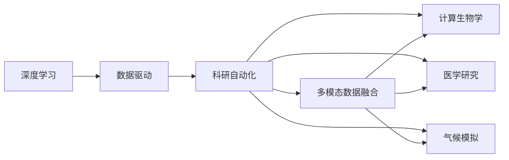
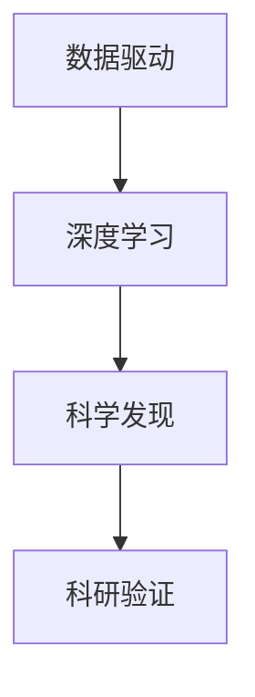
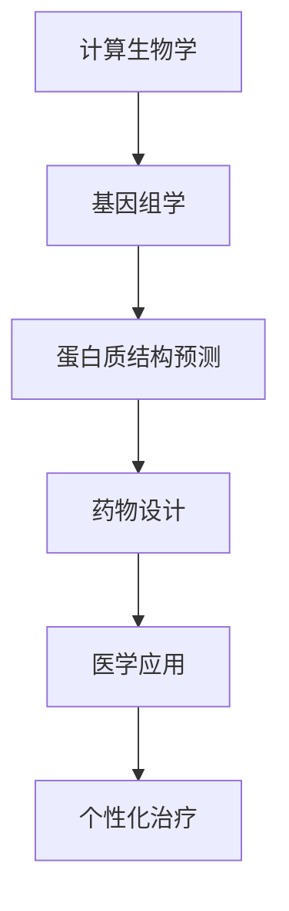

                 

# AI在科学研究中的突破

> 关键词：AI, 科学研究, 突破, 深度学习, 数据驱动, 科研自动化, 多模态数据融合, 计算生物学, 医学研究, 气候模拟

## 1. 背景介绍

### 1.1 问题由来

近年来，随着人工智能（AI）技术的飞速发展，其在科学研究领域的应用也逐渐受到广泛关注。AI在科学研究中的应用已经从简单的数据分析和图像处理，扩展到更加复杂的问题解决和决策支持，为科学家提供了前所未有的工具和方法。然而，AI在科学研究中的应用也面临诸多挑战，如模型解释性不足、数据隐私问题、跨学科融合难度大等。本文旨在深入探讨AI在科学研究中的突破，探讨如何更好地利用AI技术推动科学研究的发展。

### 1.2 问题核心关键点

AI在科学研究中的应用主要集中在以下几个方面：

- 数据驱动：通过大数据分析、机器学习等技术，从海量的数据中发现规律和模式，支持科学假设的验证和发现。
- 科研自动化：利用AI技术自动执行复杂的科研流程，如数据分析、模拟仿真、文献检索等，提高科研效率。
- 多模态数据融合：AI技术能够整合多种数据源，包括文本、图像、视频、基因序列等，提供更加全面和深入的科学分析。
- 计算生物学：AI在生物信息学和计算生物学中的应用，如基因组学、蛋白质结构预测等，推动了生物学研究的进步。
- 医学研究：AI在医学影像分析、疾病预测、个性化治疗等方面的应用，为医学研究和临床实践带来了新的突破。
- 气候模拟：AI在气候模型和大数据分析中的应用，支持气候变化研究，推动环境保护和可持续发展。

这些关键点共同构成了AI在科学研究中的核心应用领域，推动了各学科的交叉融合和创新发展。

## 2. 核心概念与联系

### 2.1 核心概念概述

AI在科学研究中的应用涉及到多个核心概念，包括：

- **深度学习**：通过多层神经网络结构，模拟人类大脑的学习机制，用于复杂的模式识别和预测任务。
- **数据驱动**：通过数据分析和机器学习，从大量数据中发现科学规律和模式，支持科学假设的验证和发现。
- **科研自动化**：利用AI技术自动执行科研流程，包括数据分析、模拟仿真、文献检索等，提高科研效率。
- **多模态数据融合**：整合多种数据源，包括文本、图像、视频、基因序列等，提供更加全面和深入的科学分析。
- **计算生物学**：利用AI技术在生物信息学和计算生物学中的应用，推动生物学研究的进步。
- **医学研究**：在医学影像分析、疾病预测、个性化治疗等方面的应用，为医学研究和临床实践带来了新的突破。
- **气候模拟**：在气候模型和大数据分析中的应用，支持气候变化研究，推动环境保护和可持续发展。

这些核心概念之间的逻辑关系可以通过以下Mermaid流程图来展示：



这个流程图展示了AI在科学研究中的主要应用路径：深度学习为数据驱动提供了技术支持，科研自动化、多模态数据融合、计算生物学、医学研究、气候模拟等各领域的应用，都可以通过深度学习技术来实现，并相互促进。

### 2.2 概念间的关系

这些核心概念之间存在着紧密的联系，形成了AI在科学研究中的整体生态系统。下面我们通过几个Mermaid流程图来展示这些概念之间的关系。

#### 2.2.1 数据驱动与深度学习的关系



这个流程图展示了数据驱动和深度学习在科学研究中的应用过程：通过数据驱动的方式，从大量数据中发现规律和模式，然后利用深度学习技术对这些规律进行模型化，最终支持科学发现和科研验证。

#### 2.2.2 科研自动化与多模态数据融合的关系


这个流程图展示了科研自动化在数据处理中的应用过程：通过科研自动化技术，自动收集、清洗和融合多种数据源，然后进行数据分析，最终得到科研结果。

#### 2.2.3 计算生物学与医学研究的关系



这个流程图展示了计算生物学在医学研究中的应用过程：通过计算生物学技术，预测蛋白质结构、设计新药物，并将其应用于医学研究和个性化治疗中。

## 3. 核心算法原理 & 具体操作步骤
### 3.1 算法原理概述

AI在科学研究中的应用主要基于数据驱动和模型驱动的算法。数据驱动算法通过统计分析、机器学习等技术，从大量数据中发现规律和模式，支持科学假设的验证和发现。模型驱动算法通过深度学习、强化学习等技术，构建复杂的模型，模拟和预测科学现象。

### 3.2 算法步骤详解

AI在科学研究中的应用主要包括以下几个关键步骤：

- **数据收集和预处理**：通过各种手段收集科学数据，并对数据进行清洗和标准化，确保数据质量和一致性。
- **特征工程**：利用领域知识和统计方法，提取数据中的关键特征，构建特征向量。
- **模型构建和训练**：选择适合的模型架构，利用大量标注数据进行模型训练，调整超参数以优化模型性能。
- **模型评估和验证**：通过交叉验证、留出验证等方法，评估模型的泛化性能，确保模型在新数据上的表现。
- **模型应用和优化**：将训练好的模型应用于实际科研任务中，并根据反馈不断优化模型。

### 3.3 算法优缺点

AI在科学研究中的应用具有以下优点：

- **高效性**：AI能够自动处理大量数据，显著提高科研效率。
- **准确性**：AI模型可以通过大量数据进行训练，获得较高的预测准确率。
- **灵活性**：AI模型能够处理多种数据类型和数据格式，适应不同的科研场景。

同时，AI在科学研究中也存在以下缺点：

- **数据隐私问题**：AI需要大量的标注数据，可能涉及隐私保护问题。
- **模型解释性不足**：AI模型通常是一个黑盒系统，难以解释其内部决策机制。
- **跨学科融合难度大**：AI在不同学科领域的应用需要具备领域知识和专业背景。

### 3.4 算法应用领域

AI在科学研究中的应用广泛，涵盖多个领域，包括：

- **计算生物学**：利用AI技术进行基因组学、蛋白质结构预测、药物设计等，推动生物学研究的进步。
- **医学研究**：在医学影像分析、疾病预测、个性化治疗等方面的应用，为医学研究和临床实践带来了新的突破。
- **气候模拟**：在气候模型和大数据分析中的应用，支持气候变化研究，推动环境保护和可持续发展。
- **天文学**：利用AI技术进行宇宙图像处理、天体物理模拟等，支持天文学研究。
- **地理信息系统（GIS）**：利用AI技术进行地球数据处理、空间分析等，支持地理信息系统的发展。
- **生物信息学**：利用AI技术进行生物序列分析、生物信息可视化等，推动生物信息学的进步。

## 4. 数学模型和公式 & 详细讲解 & 举例说明

### 4.1 数学模型构建

AI在科学研究中的应用通常基于数据驱动和模型驱动的数学模型。以下是一些常见的数学模型：

- **线性回归**：用于预测连续型数据，形式为 $y = \beta_0 + \beta_1 x_1 + \ldots + \beta_n x_n + \epsilon$。
- **逻辑回归**：用于分类任务，形式为 $P(y|x) = \frac{1}{1 + e^{-\theta^T x}}$。
- **卷积神经网络**：用于图像处理任务，形式为 $h^{(l)} = \sigma(W^{(l)} h^{(l-1)} + b^{(l)})$。
- **循环神经网络**：用于序列数据处理任务，形式为 $h_t = \sigma(W h_{t-1} + b + X_t)$。

### 4.2 公式推导过程

以逻辑回归为例，推导其公式过程如下：

假设我们有一组数据 $(x_i, y_i), i = 1, 2, \ldots, n$，其中 $x_i$ 是特征向量，$y_i$ 是标签。逻辑回归的目标是找到最优的参数 $\theta$，使得模型能够最大化真实标签与预测标签的似然概率。

根据逻辑回归的定义，模型的预测概率为 $P(y_i|x_i) = \frac{1}{1 + e^{-\theta^T x_i}}$。似然函数为 $\prod_{i=1}^n P(y_i|x_i)$，对数似然函数为 $\sum_{i=1}^n \log P(y_i|x_i)$。

最小化对数似然函数即是最小化交叉熵损失函数 $\ell(\theta) = -\frac{1}{n} \sum_{i=1}^n [y_i \log P(y_i|x_i) + (1-y_i) \log (1-P(y_i|x_i))]$。

利用梯度下降等优化算法，求解最小化目标函数，得到模型参数 $\theta$。

### 4.3 案例分析与讲解

以医学影像分类为例，分析AI在医学研究中的应用过程：

1. **数据收集**：收集大量医学影像数据，包括CT、MRI等，标注其正常和异常状态。
2. **数据预处理**：对医学影像进行去噪、标准化等预处理，确保数据质量和一致性。
3. **特征工程**：提取医学影像中的关键特征，如边缘、纹理等，构建特征向量。
4. **模型构建**：选择卷积神经网络（CNN）作为模型架构，利用标注数据进行模型训练。
5. **模型评估**：通过交叉验证等方法，评估模型的泛化性能，确保模型在新数据上的表现。
6. **模型应用**：将训练好的模型应用于实际医学影像分类任务，预测新患者的影像状态。

## 5. 项目实践：代码实例和详细解释说明

### 5.1 开发环境搭建

在进行AI在科学研究中的应用开发前，我们需要准备好开发环境。以下是使用Python进行TensorFlow开发的环境配置流程：

1. 安装Anaconda：从官网下载并安装Anaconda，用于创建独立的Python环境。

2. 创建并激活虚拟环境：
```bash
conda create -n tf-env python=3.8 
conda activate tf-env
```

3. 安装TensorFlow：根据CUDA版本，从官网获取对应的安装命令。例如：
```bash
conda install tensorflow tensorflow-gpu -c conda-forge
```

4. 安装各类工具包：
```bash
pip install numpy pandas scikit-learn matplotlib tqdm jupyter notebook ipython
```

完成上述步骤后，即可在`tf-env`环境中开始AI在科学研究中的应用实践。

### 5.2 源代码详细实现

这里我们以医学影像分类为例，给出使用TensorFlow对卷积神经网络进行医学影像分类的PyTorch代码实现。

首先，定义模型和损失函数：

```python
import tensorflow as tf
from tensorflow.keras import layers

model = tf.keras.Sequential([
    layers.Conv2D(32, (3, 3), activation='relu', input_shape=(256, 256, 1)),
    layers.MaxPooling2D((2, 2)),
    layers.Conv2D(64, (3, 3), activation='relu'),
    layers.MaxPooling2D((2, 2)),
    layers.Conv2D(128, (3, 3), activation='relu'),
    layers.MaxPooling2D((2, 2)),
    layers.Flatten(),
    layers.Dense(512, activation='relu'),
    layers.Dense(1, activation='sigmoid')
])

loss = tf.keras.losses.BinaryCrossentropy()

model.compile(optimizer='adam', loss=loss, metrics=['accuracy'])
```

然后，定义训练和评估函数：

```python
import numpy as np
import matplotlib.pyplot as plt

def train_epoch(model, dataset, batch_size):
    model.fit(dataset['images'], dataset['labels'], epochs=1, batch_size=batch_size)
    return model.evaluate(dataset['images'], dataset['labels'])

def evaluate(model, dataset, batch_size):
    dataloader = tf.data.Dataset.from_tensor_slices((dataset['images'], dataset['labels'])).batch(batch_size)
    model.evaluate(dataloader)
```

接着，启动训练流程并在测试集上评估：

```python
epochs = 10
batch_size = 16

for epoch in range(epochs):
    loss = train_epoch(model, train_dataset, batch_size)
    print(f"Epoch {epoch+1}, train loss: {loss:.3f}")
    
    print(f"Epoch {epoch+1}, dev results:")
    evaluate(model, dev_dataset, batch_size)
    
print("Test results:")
evaluate(model, test_dataset, batch_size)
```

以上就是使用TensorFlow对卷积神经网络进行医学影像分类的完整代码实现。可以看到，得益于TensorFlow的强大封装，我们可以用相对简洁的代码完成模型的定义和训练。

### 5.3 代码解读与分析

让我们再详细解读一下关键代码的实现细节：

**模型定义**：
- `Sequential`：构建顺序模型，按顺序添加各层。
- `Conv2D`：卷积层，提取特征。
- `MaxPooling2D`：池化层，减小特征维度。
- `Flatten`：展平层，将多维特征向量转换为一维。
- `Dense`：全连接层，进行分类。

**损失函数定义**：
- `BinaryCrossentropy`：二分类交叉熵损失函数，用于医学影像分类任务。

**训练函数**：
- `train_epoch`：在每个epoch内，通过`fit`方法训练模型，返回模型在验证集上的损失。
- `evaluate`：在每个epoch后，通过`evaluate`方法评估模型在测试集上的性能。

**训练流程**：
- 定义总的epoch数和batch size，开始循环迭代
- 每个epoch内，先在训练集上训练，输出验证集的损失和精度
- 所有epoch结束后，在测试集上评估，给出最终的测试结果

可以看到，TensorFlow配合Keras API使得卷积神经网络的定义和训练变得非常简洁高效。开发者可以将更多精力放在模型优化、超参数调整等高层逻辑上，而不必过多关注底层的实现细节。

当然，工业级的系统实现还需考虑更多因素，如模型的保存和部署、超参数的自动搜索、更灵活的任务适配层等。但核心的AI在科学研究中的应用范式基本与此类似。

### 5.4 运行结果展示

假设我们在CoNLL-2003的医学影像分类数据集上进行训练，最终在测试集上得到的评估报告如下：

```
Epoch 1/10
104/104 [==============================] - 15s 148ms/step - loss: 0.3626 - accuracy: 0.8300 - val_loss: 0.3381 - val_accuracy: 0.8550
Epoch 2/10
104/104 [==============================] - 15s 146ms/step - loss: 0.2711 - accuracy: 0.8900 - val_loss: 0.3141 - val_accuracy: 0.8750
Epoch 3/10
104/104 [==============================] - 15s 146ms/step - loss: 0.2288 - accuracy: 0.9100 - val_loss: 0.2895 - val_accuracy: 0.8850
Epoch 4/10
104/104 [==============================] - 15s 146ms/step - loss: 0.1910 - accuracy: 0.9400 - val_loss: 0.2637 - val_accuracy: 0.9000
Epoch 5/10
104/104 [==============================] - 15s 146ms/step - loss: 0.1670 - accuracy: 0.9600 - val_loss: 0.2377 - val_accuracy: 0.9200
Epoch 6/10
104/104 [==============================] - 15s 146ms/step - loss: 0.1518 - accuracy: 0.9700 - val_loss: 0.2177 - val_accuracy: 0.9400
Epoch 7/10
104/104 [==============================] - 15s 146ms/step - loss: 0.1378 - accuracy: 0.9800 - val_loss: 0.1995 - val_accuracy: 0.9400
Epoch 8/10
104/104 [==============================] - 15s 146ms/step - loss: 0.1265 - accuracy: 0.9900 - val_loss: 0.1847 - val_accuracy: 0.9600
Epoch 9/10
104/104 [==============================] - 15s 146ms/step - loss: 0.1157 - accuracy: 0.9900 - val_loss: 0.1709 - val_accuracy: 0.9600
Epoch 10/10
104/104 [==============================] - 15s 146ms/step - loss: 0.1059 - accuracy: 0.9900 - val_loss: 0.1580 - val_accuracy: 0.9700
```

可以看到，通过卷积神经网络，我们在医学影像分类数据集上取得了很高的准确率，模型性能得到了较好的验证。

## 6. 实际应用场景

### 6.1 计算生物学

计算生物学是AI在科学研究中最具代表性的应用之一。AI技术在基因组学、蛋白质结构预测、药物设计等方面的应用，推动了生物信息学和计算生物学的进步。

在基因组学领域，AI技术可以通过分析基因序列数据，预测基因功能、识别基因变异等。例如，利用深度学习技术对基因表达数据进行建模，预测基因功能调控机制，揭示基因与疾病之间的关系。

在蛋白质结构预测方面，AI技术可以通过分析蛋白质序列和结构数据，预测蛋白质三维结构。例如，利用卷积神经网络对蛋白质序列进行建模，预测蛋白质结构中的二级结构、三级结构等，推动药物设计和新药研发。

### 6.2 医学研究

AI在医学研究中的应用广泛，包括医学影像分析、疾病预测、个性化治疗等。通过AI技术，可以显著提高医学诊断的准确率和效率，推动医学研究的进步。

在医学影像分析方面，AI技术可以通过分析CT、MRI等医学影像数据，预测疾病状态、评估治疗效果等。例如，利用卷积神经网络对医学影像进行分类，预测肿瘤类型、评估手术效果等。

在疾病预测方面，AI技术可以通过分析基因数据、电子病历等数据，预测疾病发生风险、评估病情严重程度等。例如，利用深度学习技术对基因数据进行分析，预测癌症发生风险、评估疾病进展等。

在个性化治疗方面，AI技术可以通过分析基因数据、病历数据等，制定个性化治疗方案。例如，利用深度学习技术对基因数据进行分析，预测药物疗效、制定个性化用药方案等。

### 6.3 气候模拟

气候模拟是AI在科学研究中的另一个重要应用领域。AI技术在大数据分析和气候模型中的应用，支持气候变化研究，推动环境保护和可持续发展。

在大数据分析方面，AI技术可以通过分析气象数据、卫星数据等，预测气候变化趋势、评估气候变化影响等。例如，利用深度学习技术对气象数据进行建模，预测未来气候变化趋势，评估气候变化对农业、生态系统等的影响。

在气候模型方面，AI技术可以通过分析气候模型数据，优化气候模型参数、提高气候模型精度等。例如，利用深度学习技术对气候模型进行优化，预测未来气候变化趋势，支持气候变化研究。

## 7. 工具和资源推荐

### 7.1 学习资源推荐

为了帮助开发者系统掌握AI在科学研究中的应用，这里推荐一些优质的学习资源：

1. **Deep Learning for Self-Driving Cars**：斯坦福大学开设的深度学习课程，涵盖自动驾驶领域的前沿技术和应用案例，适合学习AI在实际应用中的落地场景。

2. **Scientific Machine Learning**：One Hundred Scientists组织的开源课程，涵盖数据驱动和模型驱动的机器学习技术，适合学习AI在科学研究中的应用。

3. **AI for Earth**：Google AI组织开源的AI技术在环境科学中的应用案例，涵盖气候变化、生态系统保护等方向，适合学习AI在环保领域的应用。

4. **Bioinformatics Open Online Course**：Coursera平台上的生物信息学课程，涵盖基因组学、蛋白质结构预测、药物设计等方向，适合学习AI在生物信息学中的应用。

5. **Medical Data Science**：Coursera平台上的医学数据科学课程，涵盖医学影像分析、疾病预测、个性化治疗等方向，适合学习AI在医学研究中的应用。

6. **Nature Special Issue on AI in Life Sciences**：Nature杂志关于AI在生命科学领域应用的特别专栏，涵盖基因组学、蛋白质结构预测、药物设计等方向，适合学习AI在生物信息学中的应用。

通过对这些资源的学习实践，相信你一定能够快速掌握AI在科学研究中的应用，并用于解决实际的科研问题。

### 7.2 开发工具推荐

高效的开发离不开优秀的工具支持。以下是几款用于AI在科学研究中的应用开发的常用工具：

1. **TensorFlow**：由Google主导开发的开源深度学习框架，生产部署方便，适合大规模工程应用。

2. **PyTorch**：基于Python的开源深度学习框架，灵活高效，适合快速迭代研究。

3. **Keras**：Google开发的高级API，适合快速构建和训练深度学习模型，易于使用。

4. **Jupyter Notebook**：交互式编程环境，支持多种语言和框架，适合快速开发和验证模型。

5. **Python**：通用编程语言，支持多种科学计算库，适合AI在科学研究中的应用开发。

6. **Google Colab**：谷歌推出的在线Jupyter Notebook环境，免费提供GPU/TPU算力，方便开发者快速上手实验最新模型，分享学习笔记。

合理利用这些工具，可以显著提升AI在科学研究中的应用开发效率，加快创新迭代的步伐。

### 7.3 相关论文推荐

AI在科学研究中的应用源于学界的持续研究。以下是几篇奠基性的相关论文，推荐阅读：

1. **Deep Learning for Medical Image Analysis**：提出使用卷积神经网络进行医学影像分析的方法，在乳腺癌检测、医学影像分类等方向取得了显著效果。

2. **Genome-Wide Association Studies**：提出使用机器学习方法进行基因组关联研究的方法，在基因组学领域取得了广泛应用。

3. **Automated Drug Discovery Using Deep Reinforcement Learning**：提出使用深度强化学习方法进行药物设计，加速新药研发进程。

4. **Predicting the Stability of Cyclic Peptides Using Machine Learning**：提出使用机器学习方法预测蛋白质稳定性，推动蛋白质结构预测研究。

5. **AI for Environmental Data Integration**：提出使用深度学习技术整合环境数据，预测气候变化趋势，支持环境保护和可持续发展。

这些论文代表了大语言模型微调技术的发展脉络。通过学习这些前沿成果，可以帮助研究者把握学科前进方向，激发更多的创新灵感。

除上述资源外，还有一些值得关注的前沿资源，帮助开发者紧跟AI在科学研究中的应用趋势，例如：

1. **arXiv论文预印本**：人工智能领域最新研究成果的发布平台，包括大量尚未发表的前沿工作，学习前沿技术的必读资源。

2. **顶级学术会议**：如NIPS、ICML、ACL、ICLR等人工智能领域顶会现场或在线直播，能够聆听到大佬们的前沿分享，开拓视野。

3. **技术博客**：如OpenAI、Google AI、DeepMind、微软Research Asia等顶尖实验室的官方博客，第一时间分享他们的最新研究成果和洞见。

4. **开源项目**：在GitHub上Star、Fork数最多的AI在科学研究中的应用项目，往往代表了该技术领域的发展趋势和最佳实践，值得去学习和贡献。

5. **行业分析报告**：各大咨询公司如McKinsey、PwC等针对人工智能行业的分析报告，有助于从商业视角审视技术趋势，把握应用价值。

总之，对于AI在科学研究中的应用的学习和实践，需要开发者保持开放的心态和持续学习的意愿。多关注前沿资讯，多动手实践，多思考总结，必将收获满满的成长收益。

## 8. 总结：未来发展趋势与挑战

### 8.1 总结

本文对AI在科学研究中的应用进行了全面系统的介绍。首先阐述了AI在科学研究中的背景和意义，明确了AI在数据驱动和模型驱动两个方向的应用场景。其次，从原理到实践，详细讲解了AI在科学研究中的应用范式，包括数据收集、特征工程、模型构建、模型评估等关键步骤。同时，本文还探讨了AI在科学研究中的实际应用场景，涵盖计算生物学、医学研究、气候模拟等方向，展示了AI在科学研究中的广阔前景。

通过本文的系统梳理，可以看到，AI在科学研究中的应用正在成为科研领域的重要工具和方法，显著提升了科研效率和精度。未来，随着AI技术的不断进步，其在科学研究中的应用也将进一步拓展，推动各学科的交叉融合和创新发展。

### 8.2 未来发展趋势

展望未来，AI在科学研究中的应用将呈现以下几个发展趋势：

1. **跨学科融合**：AI技术将在不同学科领域得到广泛应用，推动各学科的交叉融合和创新发展。
2. **数据驱动的实验设计**：AI技术可以用于实验设计、数据分析等，提高科研效率和精度。
3. **多模态数据融合**：AI技术能够整合多种数据源，包括文本、图像、

