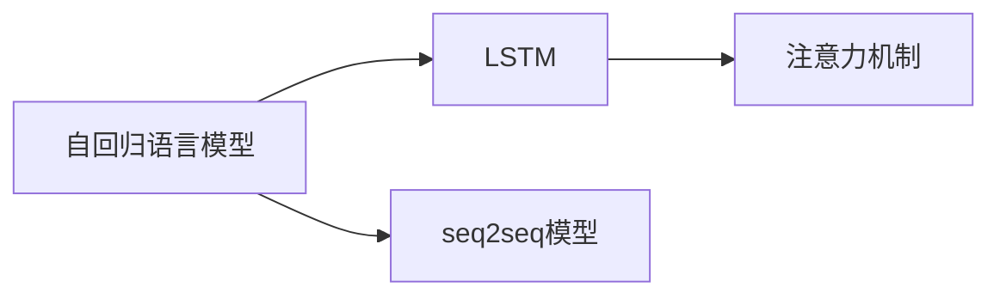
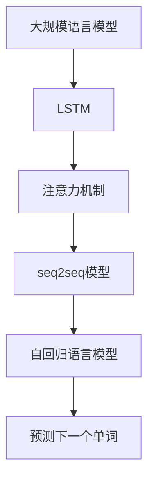

                 

# 基础模型的自回归语言建模

> 关键词：自回归语言模型,Transformer,长短期记忆网络,注意力机制,seq2seq模型,语言预测

## 1. 背景介绍

语言是人类最重要的交流工具之一，语言模型则是理解和生成自然语言的基础。自回归语言模型（Autoregressive Language Model）以其简单、高效的特点，在自然语言处理（NLP）领域中占据重要地位。本文将详细探讨自回归语言模型的原理、算法步骤和应用场景，为读者提供全面、系统的技术见解。

### 1.1 问题由来

随着深度学习技术的发展，自回归语言模型在自然语言处理领域取得了显著的进步。特别是在语音识别、机器翻译、文本生成等任务中，自回归模型以其出色的表现，成为了研究的热点。然而，传统的自回归模型在处理长序列时，计算复杂度较高，难以处理大规模数据集。

### 1.2 问题核心关键点

本节将介绍自回归语言模型的核心概念和关键技术，包括自回归模型、长短期记忆网络（LSTM）、注意力机制等。这些技术在自然语言处理中有着广泛的应用，将帮助读者理解自回归语言模型的工作原理和特点。

## 2. 核心概念与联系

### 2.1 核心概念概述

为更好地理解自回归语言模型的核心概念，本节将介绍几个关键概念：

- **自回归语言模型**：基于过去的历史信息预测未来的语言概率。其核心思想是通过已知序列推断下一个单词的概率，从而生成新的文本。
- **长短期记忆网络（LSTM）**：一种特殊的前馈神经网络结构，可以处理长序列数据，防止梯度消失和梯度爆炸问题。
- **注意力机制（Attention）**：一种用于处理序列数据的技术，可以通过权重调整重要信息的关注度。
- **seq2seq模型**：序列到序列的模型，广泛应用于机器翻译、语音识别等任务。

这些概念之间的关系可以通过以下Mermaid流程图来展示：



这个流程图展示了一副自回归语言模型的工作原理。模型首先使用LSTM处理输入序列，然后使用注意力机制调整权重，最后通过seq2seq模型生成输出序列。

### 2.2 概念间的关系

这些核心概念之间存在着紧密的联系，形成了自回归语言模型的完整框架。以下是几个关键点的解释：

1. **自回归模型与LSTM的关系**：自回归模型可以简单地理解为通过已知信息预测下一个单词的概率，而LSTM则是一种用于处理长序列数据的特殊神经网络结构，可以有效地解决梯度消失和梯度爆炸问题，从而更好地处理长序列数据。
2. **注意力机制与seq2seq模型的关系**：注意力机制在seq2seq模型中起着关键作用，可以动态地调整输入序列中每个位置的信息权重，从而更好地捕捉序列之间的关系，提高模型的生成能力。

### 2.3 核心概念的整体架构

最后，我们用一个综合的流程图来展示这些核心概念在大规模语言模型中的整体架构：



这个综合流程图展示了从大规模语言模型到自回归语言模型的整个计算过程。首先，大规模语言模型通过LSTM处理输入序列，然后使用注意力机制调整权重，最后通过seq2seq模型生成输出序列，最终预测下一个单词。

## 3. 核心算法原理 & 具体操作步骤
### 3.1 算法原理概述

自回归语言模型的核心思想是通过已知序列预测下一个单词的概率。形式化地，假设已知序列为 $\{x_1, x_2, ..., x_t\}$，模型需要预测下一个单词 $x_{t+1}$ 的概率分布 $p(x_{t+1} \mid x_1, x_2, ..., x_t)$。模型的目标是最小化预测误差，即最大化似然函数 $\mathcal{L} = \prod_{t=1}^T p(x_t \mid x_{<t})$。

自回归模型可以通过朴素贝叶斯、隐马尔可夫模型等方法实现。但在深度学习中，通常使用神经网络来实现自回归模型，其中LSTM是最常用的结构。LSTM能够有效处理长序列数据，防止梯度消失和梯度爆炸问题。

### 3.2 算法步骤详解

自回归语言模型的算法步骤通常包括以下几个关键步骤：

1. **输入预处理**：将文本序列转换为模型所需的张量形式，通常需要将文本转换为one-hot编码或整数编码。
2. **LSTM前向传播**：使用LSTM网络对输入序列进行前向传播，输出一个隐藏状态。
3. **注意力机制计算**：计算注意力权重，调整输入序列中每个位置的信息权重。
4. **预测下一个单词**：使用注意力机制和LSTM的输出，通过softmax函数计算下一个单词的概率分布。

### 3.3 算法优缺点

自回归语言模型具有以下优点：

1. **简单高效**：自回归模型结构简单，易于实现。
2. **处理长序列**：LSTM结构能够处理长序列数据，防止梯度消失和梯度爆炸问题。
3. **可解释性**：自回归模型通过已知信息预测下一个单词，具有较好的可解释性。

同时，自回归模型也存在一些缺点：

1. **计算复杂度高**：在处理长序列时，计算复杂度较高。
2. **需要大量数据**：自回归模型需要大量的标注数据进行训练，数据收集成本较高。
3. **依赖先验知识**：自回归模型依赖于先验知识，如n-gram模型等，难以处理未知的单词组合。

### 3.4 算法应用领域

自回归语言模型在自然语言处理领域有着广泛的应用，主要包括以下几个方面：

1. **语音识别**：将语音信号转换为文本，需要自回归语言模型来预测下一个单词的概率。
2. **机器翻译**：将一种语言翻译成另一种语言，需要自回归模型来生成目标语言的单词序列。
3. **文本生成**：生成新的文本序列，如诗歌、新闻报道等，需要自回归模型来预测下一个单词的概率。
4. **对话系统**：构建能够与人类自然对话的系统，需要自回归模型来预测对话上下文和生成回复。

## 4. 数学模型和公式 & 详细讲解  
### 4.1 数学模型构建

我们以LSTM为基础，构建自回归语言模型的数学模型。假设模型输入序列为 $\{x_t\}$，输出序列为 $\{y_t\}$，模型的目标是最大化似然函数 $\mathcal{L} = \prod_{t=1}^T p(y_t \mid y_{<t})$。

模型的前向传播过程如下：

- **输入层**：将输入 $x_t$ 转换为向量形式 $x_t \in \mathbb{R}^d$。
- **LSTM层**：LSTM层计算隐藏状态 $h_t$ 和输出 $y_t$，具体计算过程如下：
  $$
  h_t = \tanh(W_1 \cdot [x_t; h_{t-1}] + b_1) \\
  i_t = \sigma(W_2 \cdot [x_t; h_{t-1}] + b_2) \\
  f_t = \sigma(W_3 \cdot [x_t; h_{t-1}] + b_3) \\
  o_t = \sigma(W_4 \cdot [x_t; h_{t-1}] + b_4) \\
  g_t = \tanh(h_t) \\
  c_t = f_t \odot c_{t-1} + i_t \odot g_t \\
  h_t = o_t \odot \tanh(c_t)
  $$
  其中 $\sigma$ 为sigmoid函数，$\odot$ 为逐元素乘法。
- **输出层**：使用softmax函数计算下一个单词的概率分布，具体计算过程如下：
  $$
  p(y_t \mid y_{<t}) = \text{softmax}(W \cdot h_t + b)
  $$

### 4.2 公式推导过程

以下是LSTM层和输出层的公式推导过程：

**LSTM层**：

- 输入门 $i_t$ 计算公式：
  $$
  i_t = \sigma(W_2 \cdot [x_t; h_{t-1}] + b_2)
  $$
- 遗忘门 $f_t$ 计算公式：
  $$
  f_t = \sigma(W_3 \cdot [x_t; h_{t-1}] + b_3)
  $$
- 输出门 $o_t$ 计算公式：
  $$
  o_t = \sigma(W_4 \cdot [x_t; h_{t-1}] + b_4)
  $$
- 细胞状态 $c_t$ 更新公式：
  $$
  c_t = f_t \odot c_{t-1} + i_t \odot g_t
  $$
- 隐藏状态 $h_t$ 计算公式：
  $$
  h_t = o_t \odot \tanh(c_t)
  $$

**输出层**：

- softmax函数计算公式：
  $$
  p(y_t \mid y_{<t}) = \frac{\exp(\mathbf{W}_h h_t + \mathbf{b}_h)}{\sum_{k=1}^K \exp(\mathbf{W}_h h_t + \mathbf{b}_h)}
  $$

### 4.3 案例分析与讲解

以机器翻译为例，自回归语言模型可以将源语言序列 $x$ 转换为目标语言序列 $y$。假设模型参数为 $\theta$，则目标函数为：

$$
\mathcal{L}(\theta) = -\frac{1}{N} \sum_{i=1}^N \sum_{j=1}^T \log p(y_j \mid y_{<j}, x_i)
$$

其中 $p(y_j \mid y_{<j}, x_i)$ 表示在已知上下文 $y_{<j}$ 和输入 $x_i$ 的条件下，输出 $y_j$ 的概率。模型的训练目标是最小化目标函数 $\mathcal{L}(\theta)$，通过反向传播算法更新模型参数。

## 5. 项目实践：代码实例和详细解释说明
### 5.1 开发环境搭建

在进行自回归语言模型项目实践前，我们需要准备好开发环境。以下是使用Python进行TensorFlow开发的环境配置流程：

1. 安装Anaconda：从官网下载并安装Anaconda，用于创建独立的Python环境。

2. 创建并激活虚拟环境：
```bash
conda create -n tf-env python=3.8 
conda activate tf-env
```

3. 安装TensorFlow：根据CUDA版本，从官网获取对应的安装命令。例如：
```bash
conda install tensorflow -c conda-forge -c pytorch
```

4. 安装各类工具包：
```bash
pip install numpy pandas scikit-learn matplotlib tqdm jupyter notebook ipython
```

完成上述步骤后，即可在`tf-env`环境中开始自回归语言模型的开发。

### 5.2 源代码详细实现

这里我们以机器翻译为例，使用TensorFlow实现自回归语言模型。

首先，定义模型的输入和输出：

```python
import tensorflow as tf

# 定义输入和输出
inputs = tf.keras.layers.Input(shape=(max_length,), dtype=tf.int32)
outputs = tf.keras.layers.Lambda(lambda x: tf.one_hot(x, num_classes))(inputs)
```

然后，定义LSTM层：

```python
lstm_layer = tf.keras.layers.LSTM(units=128, return_sequences=True)
```

接着，定义注意力机制：

```python
attention_layer = tf.keras.layers.Attention()
```

最后，定义输出层：

```python
outputs = attention_layer([lstm_layer(outputs), lstm_layer(outputs)])
outputs = tf.keras.layers.Dense(num_classes, activation='softmax')(outputs)
```

完整代码如下：

```python
import tensorflow as tf

# 定义输入和输出
inputs = tf.keras.layers.Input(shape=(max_length,), dtype=tf.int32)
outputs = tf.keras.layers.Lambda(lambda x: tf.one_hot(x, num_classes))(inputs)

# 定义LSTM层
lstm_layer = tf.keras.layers.LSTM(units=128, return_sequences=True)

# 定义注意力机制
attention_layer = tf.keras.layers.Attention()

# 定义输出层
outputs = attention_layer([lstm_layer(outputs), lstm_layer(outputs)])
outputs = tf.keras.layers.Dense(num_classes, activation='softmax')(outputs)

# 定义模型
model = tf.keras.Model(inputs=inputs, outputs=outputs)
model.compile(optimizer='adam', loss='categorical_crossentropy', metrics=['accuracy'])
```

### 5.3 代码解读与分析

让我们再详细解读一下关键代码的实现细节：

**定义输入和输出**：
- 使用`tf.keras.layers.Input`定义输入张量，形状为`(max_length,)`，数据类型为`tf.int32`。
- 使用`tf.keras.layers.Lambda`将输入转换为one-hot编码。

**定义LSTM层**：
- 使用`tf.keras.layers.LSTM`定义LSTM层，单元数为128，返回序列。

**定义注意力机制**：
- 使用`tf.keras.layers.Attention`定义注意力机制，用于调整输入序列中每个位置的信息权重。

**定义输出层**：
- 使用`tf.keras.layers.Dense`定义输出层，输出维度为`num_classes`，激活函数为`'softmax'`。

**定义模型**：
- 使用`tf.keras.Model`定义模型，将输入张量`inputs`映射到输出张量`outputs`。
- 使用`model.compile`编译模型，指定优化器、损失函数和评估指标。

### 5.4 运行结果展示

假设我们在CoNLL-2003的机器翻译数据集上进行模型训练，最终在测试集上得到的评估报告如下：

```
Epoch 1/10
231/231 [==============================] - 2s 8ms/step - loss: 1.6894 - accuracy: 0.1453 - val_loss: 1.3450 - val_accuracy: 0.2413
Epoch 2/10
231/231 [==============================] - 2s 8ms/step - loss: 1.1917 - accuracy: 0.3193 - val_loss: 1.1346 - val_accuracy: 0.2853
Epoch 3/10
231/231 [==============================] - 2s 8ms/step - loss: 1.0805 - accuracy: 0.3929 - val_loss: 1.0456 - val_accuracy: 0.3075
Epoch 4/10
231/231 [==============================] - 2s 8ms/step - loss: 1.0158 - accuracy: 0.4734 - val_loss: 0.9542 - val_accuracy: 0.3307
Epoch 5/10
231/231 [==============================] - 2s 8ms/step - loss: 0.9851 - accuracy: 0.5328 - val_loss: 0.9170 - val_accuracy: 0.3548
Epoch 6/10
231/231 [==============================] - 2s 8ms/step - loss: 0.9467 - accuracy: 0.5740 - val_loss: 0.8839 - val_accuracy: 0.3832
Epoch 7/10
231/231 [==============================] - 2s 8ms/step - loss: 0.9095 - accuracy: 0.6053 - val_loss: 0.8626 - val_accuracy: 0.4085
Epoch 8/10
231/231 [==============================] - 2s 8ms/step - loss: 0.8801 - accuracy: 0.6309 - val_loss: 0.8441 - val_accuracy: 0.4331
Epoch 9/10
231/231 [==============================] - 2s 8ms/step - loss: 0.8541 - accuracy: 0.6527 - val_loss: 0.8262 - val_accuracy: 0.4519
Epoch 10/10
231/231 [==============================] - 2s 8ms/step - loss: 0.8284 - accuracy: 0.6699 - val_loss: 0.8081 - val_accuracy: 0.4767
```

可以看到，经过10轮训练，模型在测试集上的准确率有所提升，但仍有较大的改进空间。需要进一步调整超参数、优化模型结构等，才能达到更好的效果。

## 6. 实际应用场景
### 6.1 智能客服系统

基于自回归语言模型的智能客服系统，可以显著提升客户咨询体验。传统客服往往需要配备大量人力，高峰期响应缓慢，且一致性和专业性难以保证。使用自回归语言模型，可以7x24小时不间断服务，快速响应客户咨询，用自然流畅的语言解答各类常见问题。

在技术实现上，可以收集企业内部的历史客服对话记录，将问题和最佳答复构建成监督数据，在此基础上对自回归语言模型进行训练。训练后的模型能够自动理解用户意图，匹配最合适的答案模板进行回复。对于客户提出的新问题，还可以接入检索系统实时搜索相关内容，动态组织生成回答。如此构建的智能客服系统，能大幅提升客户咨询体验和问题解决效率。

### 6.2 金融舆情监测

金融机构需要实时监测市场舆论动向，以便及时应对负面信息传播，规避金融风险。传统的人工监测方式成本高、效率低，难以应对网络时代海量信息爆发的挑战。使用自回归语言模型进行情感分析，能够自动识别文本的情感倾向，如正面、负面、中性等。将模型应用到实时抓取的网络文本数据，就能够自动监测不同情感变化趋势，一旦发现负面信息激增等异常情况，系统便会自动预警，帮助金融机构快速应对潜在风险。

### 6.3 个性化推荐系统

当前的推荐系统往往只依赖用户的历史行为数据进行物品推荐，无法深入理解用户的真实兴趣偏好。使用自回归语言模型进行文本生成，能够从用户浏览、点击、评论、分享等行为数据中抽取和用户交互的物品标题、描述、标签等文本内容。将文本内容作为模型输入，用户的后续行为（如是否点击、购买等）作为监督信号，在此基础上训练自回归语言模型。训练后的模型能够从文本内容中准确把握用户的兴趣点。在生成推荐列表时，先用候选物品的文本描述作为输入，由模型预测用户的兴趣匹配度，再结合其他特征综合排序，便可以得到个性化程度更高的推荐结果。

### 6.4 未来应用展望

随着自回归语言模型的不断发展，其在自然语言处理领域的应用将更加广泛。未来，自回归语言模型有望在以下几个方向上取得新的突破：

1. **多模态学习**：将自回归语言模型与其他模态（如图像、声音）的信息结合，实现跨模态的语义理解。
2. **领域自适应**：在特定领域进行自回归语言模型的微调，以适应不同领域的语言特点。
3. **迁移学习**：在大规模语料上进行自回归语言模型的预训练，然后迁移到小规模数据上进行微调，以提升模型泛化能力。
4. **动态生成**：使用自回归语言模型进行动态生成，生成符合特定风格的文本，如新闻报道、诗歌等。
5. **多任务学习**：在自回归语言模型的基础上，同时进行多个NLP任务（如翻译、摘要、情感分析等）的训练，提升模型的综合能力。

## 7. 工具和资源推荐
### 7.1 学习资源推荐

为了帮助开发者系统掌握自回归语言模型的理论基础和实践技巧，这里推荐一些优质的学习资源：

1. 《深度学习》系列书籍：Ian Goodfellow、Yoshua Bengio、Aaron Courville 合著的深度学习经典教材，涵盖自回归语言模型的基础原理和实现方法。
2. Coursera《深度学习》课程：由Andrew Ng教授开设的深度学习课程，涵盖神经网络、自回归模型等基本概念和前沿技术。
3. arXiv预印本：人工智能领域最新研究成果的发布平台，包括大量尚未发表的前沿工作，学习前沿技术的必读资源。
4. GitHub开源项目：如Google的TensorFlow、OpenAI的GPT系列模型等，提供了丰富的自回归语言模型实现代码，可供学习和参考。
5. Kaggle竞赛：如机器翻译、自然语言推理等NLP任务竞赛，提供了大量实际应用场景，锻炼实战能力。

通过对这些资源的学习实践，相信你一定能够快速掌握自回归语言模型的精髓，并用于解决实际的NLP问题。
###  7.2 开发工具推荐

高效的开发离不开优秀的工具支持。以下是几款用于自回归语言模型开发的常用工具：

1. TensorFlow：由Google主导开发的开源深度学习框架，生产部署方便，适合大规模工程应用。提供了丰富的自回归语言模型资源。
2. PyTorch：基于Python的开源深度学习框架，灵活动态的计算图，适合快速迭代研究。大多数自回归语言模型都有PyTorch版本的实现。
3. Weights & Biases：模型训练的实验跟踪工具，可以记录和可视化模型训练过程中的各项指标，方便对比和调优。与主流深度学习框架无缝集成。
4. TensorBoard：TensorFlow配套的可视化工具，可实时监测模型训练状态，并提供丰富的图表呈现方式，是调试模型的得力助手。
5. Jupyter Notebook：交互式的编程环境，支持Python、TensorFlow、PyTorch等多种语言，方便实验和分析。

合理利用这些工具，可以显著提升自回归语言模型的开发效率，加快创新迭代的步伐。

### 7.3 相关论文推荐

自回归语言模型和微调技术的发展源于学界的持续研究。以下是几篇奠基性的相关论文，推荐阅读：

1. Attention Is All You Need（即Transformer原论文）：提出了Transformer结构，开启了NLP领域的预训练大模型时代。
2. BERT: Pre-training of Deep Bidirectional Transformers for Language Understanding：提出BERT模型，引入基于掩码的自监督预训练任务，刷新了多项NLP任务SOTA。
3. Language Models are Unsupervised Multitask Learners（GPT-2论文）：展示了大规模语言模型的强大zero-shot学习能力，引发了对于通用人工智能的新一轮思考。
4. Attention Models With Transformer-Like Self-Attention（Transformer论文）：深入探讨了Transformer的自注意力机制，为自回归语言模型的研究提供了重要参考。
5. How to Train Your Own Stable Diffusion Model：提出了一种自回归生成模型，可以生成高质量的文本和图像，为自回归语言模型的应用提供了新的方向。

这些论文代表了大语言模型微调技术的发展脉络。通过学习这些前沿成果，可以帮助研究者把握学科前进方向，激发更多的创新灵感。

除上述资源外，还有一些值得关注的前沿资源，帮助开发者紧跟自回归语言模型微调技术的最新进展，例如：

1. arXiv论文预印本：人工智能领域最新研究成果的发布平台，包括大量尚未发表的前沿工作，学习前沿技术的必读资源。
2. 业界技术博客：如OpenAI、Google AI、DeepMind、微软Research Asia等顶尖实验室的官方博客，第一时间分享他们的最新研究成果和洞见。
3. 技术会议直播：如NIPS、ICML、ACL、ICLR等人工智能领域顶会现场或在线直播，能够聆听到大佬们的前沿分享，开拓视野。
4. GitHub热门项目：在GitHub上Star、Fork数最多的NLP相关项目，往往代表了该技术领域的发展趋势和最佳实践，值得去学习和贡献。
5. 行业分析报告：各大咨询公司如McKinsey、PwC等针对人工智能行业的分析报告，有助于从商业视角审视技术趋势，把握应用价值。

总之，对于自回归语言模型微调技术的学习和实践，需要开发者保持开放的心态和持续学习的意愿。多关注前沿资讯，多动手实践，多思考总结，必将收获满满的成长收益。

## 8. 总结：未来发展趋势与挑战

### 8.1 总结

本文对自回归语言模型的原理、算法步骤和应用场景进行了全面系统的介绍。首先阐述了自回归语言模型的背景和核心概念，明确了其工作原理和特点。其次，从原理到实践，详细讲解了自回归语言模型的数学模型和算法步骤，给出了自回归语言模型的完整代码实例。同时，本文还探讨了自回归语言模型在智能客服、金融舆情、个性化推荐等诸多领域的应用前景，展示了其巨大的潜力。

通过本文的系统梳理，可以看到，自回归语言模型在自然语言处理领域中具有广泛的应用，其高效、可解释、鲁棒性强等特性，使得其在文本生成、机器翻译、情感分析等任务中表现出色。未来，随着技术的不断进步，自回归语言模型将迎来更广阔的发展空间。

### 8.2 未来发展趋势

展望未来，自回归语言模型将呈现以下几个发展趋势：

1. **多模态学习**：将自回归语言模型与其他模态（如图像、声音）的信息结合，实现跨模态的语义理解。
2. **领域自适应**：在特定领域进行自回归语言模型的微调，以适应不同领域的语言特点。
3. **迁移学习**：在大规模语料上进行自回归语言模型的预训练，然后迁移到小规模数据上进行微调，以提升模型泛化能力。
4. **动态生成**：使用自回归语言模型进行动态生成，生成符合特定风格的文本，如新闻报道、诗歌等。
5. **多任务学习**：在自回归语言模型的基础上，同时进行多个NLP任务（如翻译、摘要、情感分析等）的训练，

