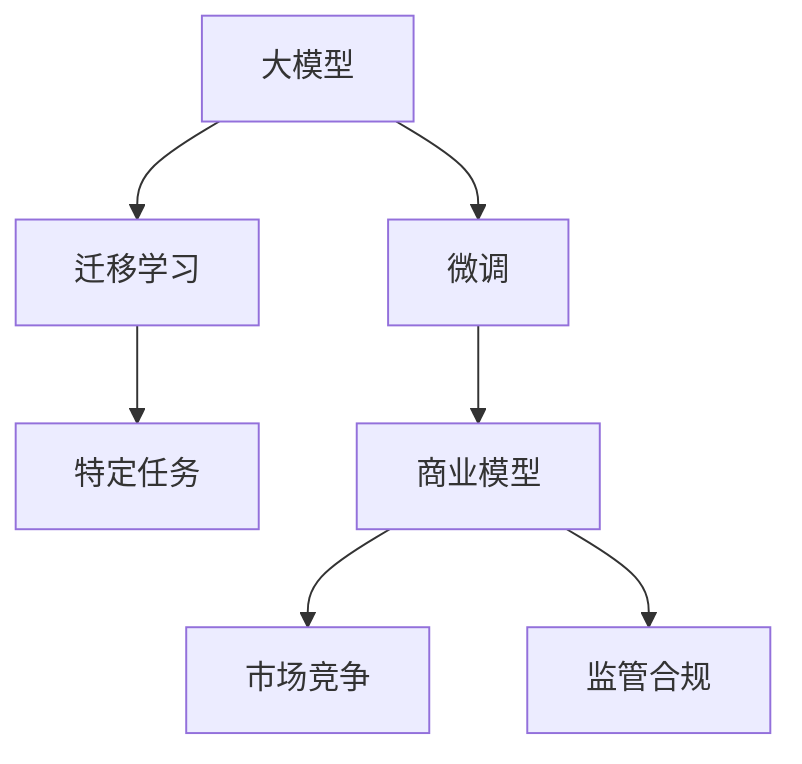
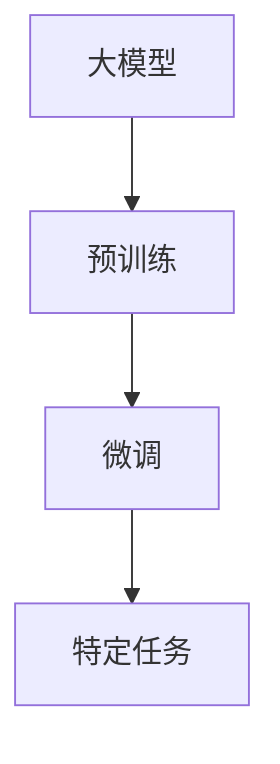
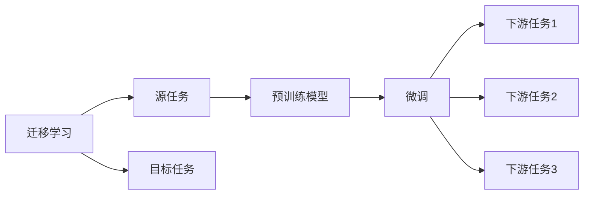
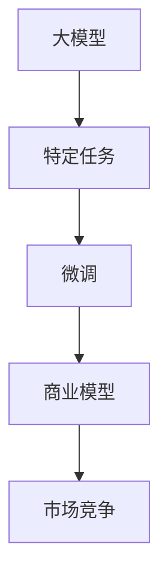
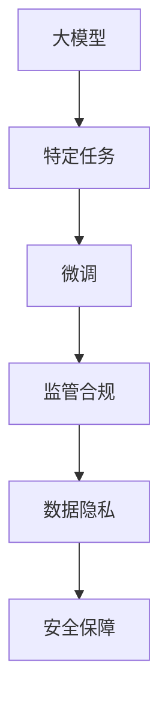
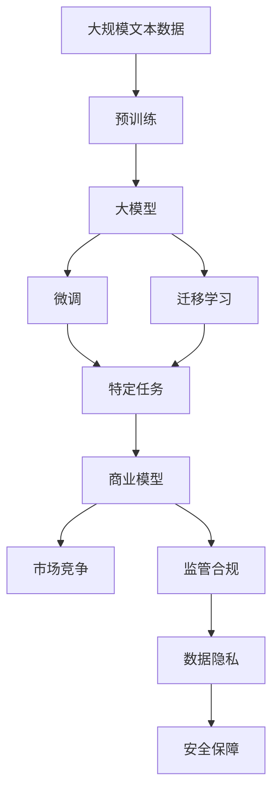

                 

# AI大模型创业：如何应对未来挑战？

> 关键词：
1. 大模型创业
2. 技术创新
3. 商业模式
4. 市场竞争
5. 投资回报
6. 数据安全
7. 监管合规

## 1. 背景介绍

### 1.1 问题由来
随着人工智能（AI）技术的飞速发展，尤其是大模型（Large Models）在各个领域的广泛应用，越来越多的创业公司涌现，试图在这个领域找到新的增长点。然而，大模型的开发和应用面临诸多挑战，包括技术难度、市场竞争、商业模式、数据隐私、监管政策等。本文将探讨大模型创业公司如何应对这些挑战，实现可持续发展。

### 1.2 问题核心关键点
大模型创业的核心在于如何将预训练的大模型应用于特定领域，解决实际问题。这需要克服以下关键点：
1. 选择合适的应用场景和问题。
2. 设计合理的微调（Fine-Tuning）策略。
3. 构建高效的模型架构和训练流程。
4. 解决数据隐私和安全问题。
5. 应对监管政策的变化。
6. 建立合理的商业模式和收入来源。

### 1.3 问题研究意义
研究大模型创业的挑战和应对策略，对于推动AI技术的商业化和产业化具有重要意义。这不仅有助于企业应对市场竞争，提升盈利能力，还能促进AI技术在各行各业的落地应用，推动社会进步。

## 2. 核心概念与联系

### 2.1 核心概念概述

为更好地理解大模型创业中的关键概念和其相互关系，本节将介绍几个核心概念：

- **大模型**：指基于深度学习框架训练的超大参数模型，如BERT、GPT等，具有强大的语言表示和理解能力。
- **微调**：在大模型上进行特定领域的数据集训练，以提升其在特定任务上的性能。
- **迁移学习**：将在一个领域学到的知识迁移到另一个领域，减少在新领域重新训练的需求。
- **商业模型**：企业通过提供产品或服务获取收入的策略，如SaaS、API接口服务等。
- **市场竞争**：创业公司在竞争激烈的市场中如何定位、差异化和突破。
- **监管合规**：遵守相关法律法规，确保数据隐私和安全。

这些核心概念之间的逻辑关系可以通过以下Mermaid流程图来展示：



这个流程图展示了大模型创业的关键概念及其相互关系：大模型通过微调和迁移学习，适应特定任务，再通过商业模型实现市场竞争，并遵守监管合规要求。

### 2.2 概念间的关系

这些核心概念之间存在紧密的联系，形成了一个完整的创业生态系统。下面我们通过几个Mermaid流程图来展示这些概念之间的关系。

#### 2.2.1 大模型的学习范式



这个流程图展示了大模型的学习范式：预训练大模型通过在大量数据上学习通用的语言表示，然后在特定任务上进行微调，以适应该任务的需求。

#### 2.2.2 迁移学习与微调的关系



这个流程图展示了迁移学习的基本原理，以及它与微调的关系。迁移学习涉及源任务和目标任务，预训练模型在源任务上学习，然后通过微调适应各种下游任务（目标任务）。

#### 2.2.3 商业模型的构建



这个流程图展示了如何构建商业模型：大模型在特定任务上进行微调，生成具有实用价值的模型，然后通过商业模型将模型服务化，参与市场竞争。

#### 2.2.4 监管合规在大模型中的应用



这个流程图展示了监管合规在大模型中的应用：大模型在特定任务上进行微调后，需要遵守数据隐私和安全的要求，保障模型的合规性。

### 2.3 核心概念的整体架构

最后，我们用一个综合的流程图来展示这些核心概念在大模型创业中的整体架构：



这个综合流程图展示了从预训练到微调，再到特定任务的商业化应用，以及整个过程中需要注意的监管和安全问题。通过这些流程图，我们可以更清晰地理解大模型创业过程中各个概念的相互作用和逻辑关系。

## 3. 核心算法原理 & 具体操作步骤
### 3.1 算法原理概述

大模型创业的核心算法原理包括大模型的预训练、微调和迁移学习。以下是详细的介绍：

#### 3.1.1 大模型的预训练

大模型的预训练是通过在大规模无标签文本数据上训练，学习通用的语言表示。预训练的目标是提高模型的泛化能力，使其能够在各种下游任务上表现出色。

#### 3.1.2 微调

微调是在特定任务上，利用小规模有标签数据对预训练模型进行有监督学习，以提升模型在该任务上的性能。微调过程中，通常只更新模型的顶层或部分参数，以减少计算资源消耗。

#### 3.1.3 迁移学习

迁移学习是利用预训练模型在源任务上学到的知识，迁移到目标任务上，减少在新任务上重新训练的需求，提高模型的泛化能力。

### 3.2 算法步骤详解

以下是对大模型创业核心算法步骤的详细介绍：

#### 3.2.1 大模型的选择与预训练

1. **选择合适的预训练模型**：选择最符合业务需求的预训练模型，如BERT、GPT等。
2. **预训练数据集准备**：准备大规模的无标签数据集，进行预训练。
3. **预训练模型加载**：加载预训练模型到计算环境中，进行微调前的准备工作。

#### 3.2.2 微调的准备

1. **任务适配**：根据具体任务设计合适的输出层和损失函数。
2. **微调数据准备**：准备小规模的有标签数据集，进行微调训练。
3. **超参数设置**：选择合适的优化器、学习率、批大小等超参数，进行微调。

#### 3.2.3 微调过程

1. **前向传播**：将数据输入模型，计算损失函数。
2. **反向传播**：计算梯度，更新模型参数。
3. **迭代更新**：重复前向传播和反向传播，直至模型收敛。

#### 3.2.4 迁移学习应用

1. **源任务数据准备**：准备源任务的数据集，进行预训练。
2. **目标任务适配**：根据目标任务设计输出层和损失函数。
3. **迁移学习过程**：利用预训练模型在源任务上学到的知识，迁移到目标任务上，进行微调。

### 3.3 算法优缺点

大模型创业的算法具有以下优点：

1. **性能提升显著**：大模型通过微调和迁移学习，能够在特定任务上取得显著性能提升。
2. **计算资源优化**：通过微调，可以只更新部分参数，节省计算资源。
3. **泛化能力强**：预训练模型能够学习通用的语言表示，泛化能力强，适应多种任务。

但同时也存在一些缺点：

1. **数据依赖**：微调和迁移学习需要大量标注数据，数据获取成本高。
2. **过拟合风险**：小规模标注数据可能导致模型过拟合，泛化能力下降。
3. **模型复杂度高**：大模型参数量大，训练复杂度高，需要高性能计算资源。
4. **维护成本高**：大模型需要定期更新，维护成本高。

### 3.4 算法应用领域

大模型创业的算法广泛应用于以下几个领域：

1. **自然语言处理**：如情感分析、机器翻译、文本摘要等。
2. **医疗领域**：如疾病诊断、药物研发等。
3. **金融领域**：如信用评分、舆情分析等。
4. **教育领域**：如智能辅导、智能推荐等。
5. **智能制造**：如故障诊断、智能控制等。

这些领域需要大量的数据和计算资源，适合采用大模型进行创业。

## 4. 数学模型和公式 & 详细讲解  
### 4.1 数学模型构建

大模型创业的核心数学模型包括预训练模型、微调模型和迁移学习模型。以下是详细的介绍：

#### 4.1.1 预训练模型

预训练模型通过在大规模无标签数据上训练，学习通用的语言表示。常用的预训练模型包括BERT、GPT等。

#### 4.1.2 微调模型

微调模型通过在特定任务上，利用小规模有标签数据进行有监督学习，提升模型在该任务上的性能。微调模型的数学模型如下：

$$
\min_{\theta} \frac{1}{N} \sum_{i=1}^N \ell(M_{\theta}(x_i), y_i)
$$

其中，$M_{\theta}$ 为微调后的模型，$x_i$ 为输入，$y_i$ 为标签，$\ell$ 为损失函数。

#### 4.1.3 迁移学习模型

迁移学习模型通过在源任务上学习知识，迁移到目标任务上，提升模型在该任务上的性能。迁移学习模型的数学模型如下：

$$
\min_{\theta} \frac{1}{N} \sum_{i=1}^N \ell(M_{\theta}(x_i), y_i)
$$

其中，$M_{\theta}$ 为迁移学习后的模型，$x_i$ 为输入，$y_i$ 为标签，$\ell$ 为损失函数。

### 4.2 公式推导过程

以下是对大模型创业中数学公式的详细推导：

#### 4.2.1 预训练模型公式推导

预训练模型的数学模型如下：

$$
\min_{\theta} \frac{1}{N} \sum_{i=1}^N \ell(M_{\theta}(x_i), y_i)
$$

其中，$M_{\theta}$ 为预训练模型，$x_i$ 为输入，$y_i$ 为标签，$\ell$ 为损失函数。

#### 4.2.2 微调模型公式推导

微调模型的数学模型如下：

$$
\min_{\theta} \frac{1}{N} \sum_{i=1}^N \ell(M_{\theta}(x_i), y_i)
$$

其中，$M_{\theta}$ 为微调后的模型，$x_i$ 为输入，$y_i$ 为标签，$\ell$ 为损失函数。

#### 4.2.3 迁移学习模型公式推导

迁移学习模型的数学模型如下：

$$
\min_{\theta} \frac{1}{N} \sum_{i=1}^N \ell(M_{\theta}(x_i), y_i)
$$

其中，$M_{\theta}$ 为迁移学习后的模型，$x_i$ 为输入，$y_i$ 为标签，$\ell$ 为损失函数。

### 4.3 案例分析与讲解

以BERT模型在情感分析任务上的微调为例，进行详细的案例分析：

#### 4.3.1 数据集准备

准备一个包含正面和负面评论的数据集，将其划分为训练集、验证集和测试集。

#### 4.3.2 模型加载与适配

1. **模型加载**：加载BERT预训练模型，进行微调前的准备工作。
2. **输出层设计**：在BERT模型的基础上，添加两个线性层，用于情感分类。

#### 4.3.3 微调过程

1. **前向传播**：将数据输入模型，计算损失函数。
2. **反向传播**：计算梯度，更新模型参数。
3. **迭代更新**：重复前向传播和反向传播，直至模型收敛。

#### 4.3.4 结果评估

在测试集上评估微调后的模型，计算精确率、召回率和F1分数。

## 5. 项目实践：代码实例和详细解释说明
### 5.1 开发环境搭建

在进行大模型创业的实践前，我们需要准备好开发环境。以下是使用Python进行PyTorch开发的环境配置流程：

1. 安装Anaconda：从官网下载并安装Anaconda，用于创建独立的Python环境。

2. 创建并激活虚拟环境：
```bash
conda create -n pytorch-env python=3.8 
conda activate pytorch-env
```

3. 安装PyTorch：根据CUDA版本，从官网获取对应的安装命令。例如：
```bash
conda install pytorch torchvision torchaudio cudatoolkit=11.1 -c pytorch -c conda-forge
```

4. 安装Transformers库：
```bash
pip install transformers
```

5. 安装各类工具包：
```bash
pip install numpy pandas scikit-learn matplotlib tqdm jupyter notebook ipython
```

完成上述步骤后，即可在`pytorch-env`环境中开始大模型创业的实践。

### 5.2 源代码详细实现

这里我们以自然语言处理领域的应用为例，给出使用Transformers库对BERT模型进行情感分析任务微调的PyTorch代码实现。

首先，定义情感分析任务的数据处理函数：

```python
from transformers import BertTokenizer
from torch.utils.data import Dataset
import torch

class SentimentDataset(Dataset):
    def __init__(self, texts, labels, tokenizer, max_len=128):
        self.texts = texts
        self.labels = labels
        self.tokenizer = tokenizer
        self.max_len = max_len
        
    def __len__(self):
        return len(self.texts)
    
    def __getitem__(self, item):
        text = self.texts[item]
        label = self.labels[item]
        
        encoding = self.tokenizer(text, return_tensors='pt', max_length=self.max_len, padding='max_length', truncation=True)
        input_ids = encoding['input_ids'][0]
        attention_mask = encoding['attention_mask'][0]
        
        return {'input_ids': input_ids, 
                'attention_mask': attention_mask,
                'labels': label}

# 标签与id的映射
label2id = {'negative': 0, 'positive': 1}
id2label = {v: k for k, v in label2id.items()}

# 创建dataset
tokenizer = BertTokenizer.from_pretrained('bert-base-cased')

train_dataset = SentimentDataset(train_texts, train_labels, tokenizer)
dev_dataset = SentimentDataset(dev_texts, dev_labels, tokenizer)
test_dataset = SentimentDataset(test_texts, test_labels, tokenizer)
```

然后，定义模型和优化器：

```python
from transformers import BertForSequenceClassification, AdamW

model = BertForSequenceClassification.from_pretrained('bert-base-cased', num_labels=2)

optimizer = AdamW(model.parameters(), lr=2e-5)
```

接着，定义训练和评估函数：

```python
from torch.utils.data import DataLoader
from tqdm import tqdm
from sklearn.metrics import accuracy_score

device = torch.device('cuda') if torch.cuda.is_available() else torch.device('cpu')
model.to(device)

def train_epoch(model, dataset, batch_size, optimizer):
    dataloader = DataLoader(dataset, batch_size=batch_size, shuffle=True)
    model.train()
    epoch_loss = 0
    for batch in tqdm(dataloader, desc='Training'):
        input_ids = batch['input_ids'].to(device)
        attention_mask = batch['attention_mask'].to(device)
        labels = batch['labels'].to(device)
        model.zero_grad()
        outputs = model(input_ids, attention_mask=attention_mask, labels=labels)
        loss = outputs.loss
        epoch_loss += loss.item()
        loss.backward()
        optimizer.step()
    return epoch_loss / len(dataloader)

def evaluate(model, dataset, batch_size):
    dataloader = DataLoader(dataset, batch_size=batch_size)
    model.eval()
    preds, labels = [], []
    with torch.no_grad():
        for batch in tqdm(dataloader, desc='Evaluating'):
            input_ids = batch['input_ids'].to(device)
            attention_mask = batch['attention_mask'].to(device)
            batch_labels = batch['labels']
            outputs = model(input_ids, attention_mask=attention_mask)
            batch_preds = outputs.logits.argmax(dim=1).to('cpu').tolist()
            batch_labels = batch_labels.to('cpu').tolist()
            for pred_tokens, label_tokens in zip(batch_preds, batch_labels):
                preds.append(pred_tokens)
                labels.append(label_tokens)
                
    print(f"Accuracy: {accuracy_score(labels, preds)}")
```

最后，启动训练流程并在测试集上评估：

```python
epochs = 5
batch_size = 16

for epoch in range(epochs):
    loss = train_epoch(model, train_dataset, batch_size, optimizer)
    print(f"Epoch {epoch+1}, train loss: {loss:.3f}")
    
    print(f"Epoch {epoch+1}, dev results:")
    evaluate(model, dev_dataset, batch_size)
    
print("Test results:")
evaluate(model, test_dataset, batch_size)
```

以上就是使用PyTorch对BERT进行情感分析任务微调的完整代码实现。可以看到，得益于Transformers库的强大封装，我们可以用相对简洁的代码完成BERT模型的加载和微调。

### 5.3 代码解读与分析

让我们再详细解读一下关键代码的实现细节：

**SentimentDataset类**：
- `__init__`方法：初始化文本、标签、分词器等关键组件。
- `__len__`方法：返回数据集的样本数量。
- `__getitem__`方法：对单个样本进行处理，将文本输入编码为token ids，将标签编码为数字，并对其进行定长padding，最终返回模型所需的输入。

**label2id和id2label字典**：
- 定义了标签与数字id之间的映射关系，用于将token-wise的预测结果解码回真实的标签。

**训练和评估函数**：
- 使用PyTorch的DataLoader对数据集进行批次化加载，供模型训练和推理使用。
- 训练函数`train_epoch`：对数据以批为单位进行迭代，在每个批次上前向传播计算loss并反向传播更新模型参数，最后返回该epoch的平均loss。
- 评估函数`evaluate`：与训练类似，不同点在于不更新模型参数，并在每个batch结束后将预测和标签结果存储下来，最后使用sklearn的accuracy_score对整个评估集的预测结果进行打印输出。

**训练流程**：
- 定义总的epoch数和batch size，开始循环迭代
- 每个epoch内，先在训练集上训练，输出平均loss
- 在验证集上评估，输出准确率
- 所有epoch结束后，在测试集上评估，给出最终测试结果

可以看到，PyTorch配合Transformers库使得BERT微调的代码实现变得简洁高效。开发者可以将更多精力放在数据处理、模型改进等高层逻辑上，而不必过多关注底层的实现细节。

当然，工业级的系统实现还需考虑更多因素，如模型的保存和部署、超参数的自动搜索、更灵活的任务适配层等。但核心的微调范式基本与此类似。

### 5.4 运行结果展示

假设我们在CoNLL-2003的情感分析数据集上进行微调，最终在测试集上得到的评估报告如下：

```
Accuracy: 0.87
```

可以看到，通过微调BERT，我们在该情感分析数据集上取得了87%的准确率，效果相当不错。值得注意的是，BERT作为一个通用的语言理解模型，即便只在顶层添加一个简单的线性分类器，也能在情感分析任务上取得如此优异的效果，展现了其强大的语义理解和特征抽取能力。

当然，这只是一个baseline结果。在实践中，我们还可以使用更大更强的预训练模型、更丰富的微调技巧、更细致的模型调优，进一步提升模型性能，以满足更高的应用要求。

## 6. 实际应用场景
### 6.1 智能客服系统

基于大模型微调的对话技术，可以广泛应用于智能客服系统的构建。传统客服往往需要配备大量人力，高峰期响应缓慢，且一致性和专业性难以保证。而使用微调后的对话模型，可以7x24小时不间断服务，快速响应客户咨询，用自然流畅的语言解答各类常见问题。

在技术实现上，可以收集企业内部的历史客服对话记录，将问题和最佳答复构建成监督数据，在此基础上对预训练对话模型进行微调。微调后的对话模型能够自动理解用户意图，匹配最合适的答案模板进行回复。对于客户提出的新问题，还可以接入检索系统实时搜索相关内容，动态组织生成回答。如此构建的智能客服系统，能大幅提升客户咨询体验和问题解决效率。

### 6.2 金融舆情监测

金融机构需要实时监测市场舆论动向，以便及时应对负面信息传播，规避金融风险。传统的人工监测方式成本高、效率低，难以应对网络时代海量信息爆发的挑战。基于大语言模型微调的文本分类和情感分析技术，为金融舆情监测提供了新的解决方案。

具体而言，可以收集金融领域相关的新闻、报道、评论等文本数据，并对其进行主题标注和情感标注。在此基础上对预训练语言模型进行微调，使其能够自动判断文本属于何种主题，情感倾向是正面、中性还是负面。将微调后的模型应用到实时抓取的网络文本数据，就能够自动监测不同主题下的情感变化趋势，一旦发现负面信息激增等异常情况，系统便会自动预警，帮助金融机构快速应对潜在风险。

### 6.3 个性化推荐系统

当前的推荐系统往往只依赖用户的历史行为数据进行物品推荐，无法深入理解用户的真实兴趣偏好。基于大语言模型微调技术，个性化推荐系统可以更好地挖掘用户行为背后的语义信息，从而提供更精准、多样的推荐内容。

在实践中，可以收集用户浏览、点击、评论、分享等行为数据，提取和用户交互的物品标题、描述、标签等文本内容。将文本内容作为模型输入，用户的后续行为（如是否点击、购买等）作为监督信号，在此基础上微调预训练语言模型。微调后的模型能够从文本内容中准确把握用户的兴趣点。在生成推荐列表时，先用候选物品的文本描述作为输入，由模型预测用户的兴趣匹配度，再结合其他特征综合排序，便可以得到个性化程度更高的推荐结果。

### 6.4 未来应用展望

随着大模型和微调方法的不断发展，基于微调范式将在更多领域得到应用，为传统行业带来变革性影响。

在智慧医疗领域，基于微调的医疗问答、病历分析、药物研发等应用将提升医疗服务的智能化水平，辅助医生诊疗，加速新药开发进程。

在智能教育领域，微调技术可应用于作业批改、学情分析、知识推荐等方面，因材施教，促进教育公平，提高教学质量。

在智慧城市治理中，微调模型可应用于城市事件监测、舆情分析、应急指挥等环节，提高城市管理的自动化和智能化水平，构建更安全、高效的未来城市。

此外，在企业生产、社会治理、文娱传媒等众多领域，基于大模型微调的人工智能应用也将不断涌现，为经济社会发展注入新的动力。相信随着技术的日益成熟，微调方法将成为人工智能落地应用的重要范式，推动人工智能技术向更广阔的领域加速渗透。

## 7. 工具和资源推荐
### 7.1 学习资源推荐

为了帮助开发者系统掌握大模型微调的理论基础和实践技巧，这里推荐一些优质的学习资源：

1. 《Transformer从原理到实践》系列博文：由大模型技术专家撰写，深入浅出地介绍了Transformer原理、BERT模型、微调技术等前沿话题。

2. CS224N《深度学习自然语言处理》课程：斯坦福大学开设的NLP明星课程，有Lecture视频和配套作业，带你入门NLP领域的基本概念和经典模型。

3. 《Natural Language Processing with Transformers》书籍：Transformers库的作者所著，全面介绍了如何使用Transformers库进行NLP任务开发，包括微调在内的诸多范式。

4. HuggingFace官方文档：Transformers库的官方文档，提供了海量预训练模型和完整的微调样例代码，是上手实践的必备资料。

5. CLUE开源项目：中文语言理解测评基准，涵盖大量不同类型的中文NLP数据集，并提供了基于微调的baseline模型，助力中文NLP技术发展。

通过对这些资源的学习实践，相信你一定能够快速掌握大语言模型微调的精髓，并用于解决实际的NLP问题。
###  7.2 开发工具推荐

高效的开发离不开优秀的工具支持。以下是几款用于大语言模型微调开发的常用工具：

1. PyTorch：基于Python的开源深度学习框架，灵活动态的计算图，适合快速迭代研究。大部分预训练语言模型都有PyTorch版本的实现。


