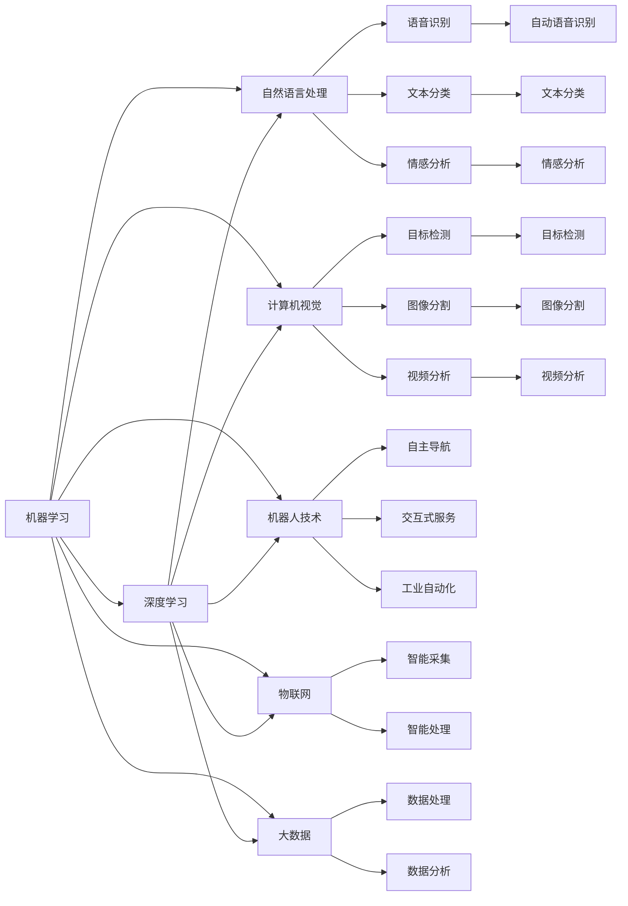

                 

# AI技术在不同领域的应用

> 关键词：人工智能,机器学习,深度学习,自然语言处理(NLP),计算机视觉,机器人技术,物联网(IoT),大数据

## 1. 背景介绍

### 1.1 问题由来
随着人工智能（AI）技术的飞速发展，其应用领域越来越广泛。从金融、医疗、教育到智能制造、自动驾驶、智慧城市，AI正深刻影响着社会的各个层面。然而，AI技术的广泛应用也带来了许多挑战和问题，如数据隐私、算法偏见、系统安全等。本文将系统介绍AI技术在不同领域的具体应用，探讨其面临的挑战和未来发展趋势。

### 1.2 问题核心关键点
AI技术的应用涉及多个领域，其核心关键点包括：
- 机器学习（Machine Learning, ML）和深度学习（Deep Learning, DL）：通过大量数据训练模型，实现自动化的决策和预测。
- 自然语言处理（Natural Language Processing, NLP）：使计算机能够理解和处理人类语言，包括语音识别、文本分析、对话系统等。
- 计算机视觉（Computer Vision, CV）：使计算机能够理解图像和视频内容，实现自动图像识别、目标跟踪、场景理解等。
- 机器人技术（Robotics）：结合AI和机械工程，实现自主移动、交互式服务、工业自动化等。
- 物联网（Internet of Things, IoT）：将传感器、设备和软件连接起来，实现智能化的数据采集和处理。
- 大数据（Big Data）：处理和分析海量数据，揭示数据背后的规律和趋势。

这些关键技术相互关联，共同推动了AI在不同领域的应用。了解这些关键点，有助于把握AI技术的核心应用场景和发展方向。

## 2. 核心概念与联系

### 2.1 核心概念概述

为了更好地理解AI技术在不同领域的应用，本文将介绍几个核心概念：

- **机器学习**：通过算法和模型，从数据中学习和发现规律，用于预测和决策。
- **深度学习**：一种特殊的机器学习技术，利用多层神经网络，可以处理非线性的复杂模式。
- **自然语言处理**：使计算机能够理解和生成人类语言，包括语音识别、文本分类、情感分析等。
- **计算机视觉**：使计算机能够理解和处理图像和视频，包括目标检测、图像分割、视频分析等。
- **机器人技术**：结合AI和机械工程，实现自主导航、交互式服务、工业自动化等。
- **物联网**：将设备和软件连接起来，实现智能化的数据采集和处理。
- **大数据**：处理和分析海量数据，揭示数据背后的规律和趋势。

这些核心概念之间的联系如图1所示：



这个流程图展示了AI技术的多个分支之间的相互关系。机器学习是AI技术的核心，深度学习是机器学习的一个重要分支，而自然语言处理、计算机视觉、机器人技术、物联网和大数据则分别代表了AI在不同领域的应用。

### 2.2 概念间的关系

这些核心概念之间存在着紧密的联系，形成了AI技术的应用生态系统。如图2所示，AI技术的多个分支相互关联，共同推动了AI技术的发展和应用。


这个综合流程图展示了AI技术的各个分支之间的相互关系和应用场景。

## 3. 核心算法原理 & 具体操作步骤
### 3.1 算法原理概述

AI技术在不同领域的应用主要基于以下几个核心算法：

- **监督学习（Supervised Learning）**：利用已标注的数据进行模型训练，预测新数据的标签。
- **无监督学习（Unsupervised Learning）**：利用未标注的数据进行模型训练，发现数据的结构和规律。
- **强化学习（Reinforcement Learning）**：通过试错和奖励机制，训练智能体进行决策。
- **迁移学习（Transfer Learning）**：将在一个任务上训练好的模型迁移到另一个相关任务上，提高模型泛化能力。
- **联邦学习（Federated Learning）**：分布式训练模型，保护用户隐私。
- **生成对抗网络（Generative Adversarial Networks, GANs）**：生成高质量的合成数据。

这些算法原理是AI技术在不同领域应用的基础，具体算法步骤将在接下来的部分详细介绍。

### 3.2 算法步骤详解

以**自然语言处理**为例，自然语言处理的核心算法是基于深度学习的Transformer模型。其步骤详解如下：

**Step 1: 数据预处理**：将文本数据分词、转换为数字序列，并进行标记化。

**Step 2: 模型选择和构建**：选择适当的深度学习模型，如BERT、GPT等，并构建训练框架。

**Step 3: 训练和微调**：利用已标注的数据集，训练模型并进行微调，适应特定任务。

**Step 4: 模型评估和测试**：在测试集上评估模型性能，优化超参数和模型结构。

**Step 5: 部署和应用**：将训练好的模型部署到实际应用中，处理自然语言相关任务。

**Step 6: 持续优化**：根据实际应用反馈，持续优化模型性能和处理能力。

### 3.3 算法优缺点

- **优点**：
  - 监督学习：能够利用已标注数据进行模型训练，准确度高。
  - 无监督学习：能够发现数据中的结构和规律，可用于特征提取和降维。
  - 强化学习：能够通过试错和奖励机制，进行决策和优化。
  - 迁移学习：能够利用已有模型，减少训练时间和数据需求。
  - 联邦学习：能够分布式训练模型，保护用户隐私。
  - 生成对抗网络：能够生成高质量的合成数据，扩充训练集。

- **缺点**：
  - 监督学习：需要大量标注数据，数据获取和标注成本高。
  - 无监督学习：模型效果取决于数据的丰富度和质量。
  - 强化学习：训练过程复杂，需要大量试错和调整。
  - 迁移学习：模型泛化能力有限，适用于特定领域和任务。
  - 联邦学习：分布式训练复杂，需要协调多个设备。
  - 生成对抗网络：生成数据质量不稳定，可能存在歧义和噪声。

### 3.4 算法应用领域

AI技术在不同领域的应用领域广泛，以下是几个典型的应用领域：

- **金融领域**：利用AI进行风险评估、投资分析、智能投顾等。
- **医疗领域**：利用AI进行疾病诊断、治疗方案推荐、患者管理等。
- **教育领域**：利用AI进行智能辅导、作业批改、学习路径推荐等。
- **制造领域**：利用AI进行智能生产、质量控制、设备维护等。
- **零售领域**：利用AI进行客户分析、推荐系统、库存管理等。
- **交通领域**：利用AI进行交通管理、智能驾驶、导航系统等。

## 4. 数学模型和公式 & 详细讲解 & 举例说明
### 4.1 数学模型构建

以**计算机视觉**中的目标检测为例，目标检测模型通常采用基于深度学习的YOLO（You Only Look Once）算法。其数学模型构建如下：

**Step 1: 定义目标函数**：

$$
L(y,\hat{y}) = \frac{1}{2N}\sum_{i=1}^N (y_i - \hat{y}_i)^2
$$

其中，$y$为真实标签，$\hat{y}$为模型预测值，$N$为样本数量。

**Step 2: 定义损失函数**：

$$
\mathcal{L}(\theta) = \frac{1}{N}\sum_{i=1}^N L(y_i,\hat{y}_i(\theta))
$$

其中，$\theta$为模型参数，$\hat{y}_i(\theta)$为使用模型参数$\theta$预测的结果。

**Step 3: 优化目标**：

$$
\theta^* = \mathop{\arg\min}_{\theta} \mathcal{L}(\theta)
$$

使用梯度下降等优化算法，最小化损失函数，优化模型参数$\theta$。

### 4.2 公式推导过程

以**深度学习**中的前馈神经网络为例，推导其公式如下：

**Step 1: 定义神经元**：

$$
z = \sum_{i=1}^n w_iz_i + b
$$

其中，$z$为神经元输出，$w_i$为权重，$z_i$为输入，$b$为偏置。

**Step 2: 激活函数**：

$$
a = f(z)
$$

其中，$f$为激活函数，如Sigmoid、ReLU等。

**Step 3: 输出层**：

$$
\hat{y} = g(\sum_{i=1}^n w_i^k a_k + b_k)
$$

其中，$\hat{y}$为预测值，$g$为输出层的激活函数，如Softmax。

**Step 4: 损失函数**：

$$
\mathcal{L}(\theta) = -\frac{1}{N}\sum_{i=1}^N \log p(y_i|\hat{y}_i)
$$

其中，$p(y_i|\hat{y}_i)$为预测值$\hat{y}_i$的概率分布。

### 4.3 案例分析与讲解

以**强化学习**中的Q-learning算法为例，其案例分析如下：

**案例背景**：

假设有机器人需要从起点出发，到达终点。机器人可以向上、向下、向左、向右移动，每移动一步可以获取一定的奖励。

**算法步骤**：

1. 初始化状态$s_0$和动作$a$。
2. 根据当前状态$s_t$和动作$a_t$，计算下一个状态$s_{t+1}$和奖励$r_{t+1}$。
3. 计算Q值更新：

$$
Q(s_t,a_t) = Q(s_t,a_t) + \alpha [r_{t+1} + \gamma \max Q(s_{t+1},a) - Q(s_t,a_t)]
$$

其中，$\alpha$为学习率，$\gamma$为折扣因子。

4. 选择下一个动作$a_{t+1}$：

$$
a_{t+1} = \mathop{\arg\max}_{a} Q(s_t,a)
$$

5. 更新状态$s_t$为$s_{t+1}$。

6. 重复步骤2-5，直到达到终点或达到最大迭代次数。

## 5. 项目实践：代码实例和详细解释说明
### 5.1 开发环境搭建

以**自然语言处理**中的文本分类任务为例，开发环境搭建步骤如下：

1. 安装Python：从官网下载并安装Python 3.7+。
2. 安装必要的依赖包：

```bash
pip install torch numpy matplotlib sklearn
```

3. 下载预训练模型：

```bash
wget http://download.pytorch.org/models/resnet18-5c106cde.pth
```

### 5.2 源代码详细实现

以**计算机视觉**中的目标检测任务为例，源代码实现如下：

```python
import torch
import torchvision
import torchvision.transforms as transforms
import torch.nn as nn
import torch.optim as optim

# 定义数据预处理
transform = transforms.Compose([
    transforms.Resize(256),
    transforms.CenterCrop(224),
    transforms.ToTensor(),
    transforms.Normalize(mean=[0.485, 0.456, 0.406],
                        std=[0.229, 0.224, 0.225])
])

# 加载数据集
train_dataset = torchvision.datasets.CIFAR10(root='./data',
                                            train=True,
                                            transform=transform,
                                            download=True)

test_dataset = torchvision.datasets.CIFAR10(root='./data',
                                          train=False,
                                          transform=transform)

# 定义模型
model = torchvision.models.resnet18(pretrained=True)

# 定义损失函数和优化器
criterion = nn.CrossEntropyLoss()
optimizer = optim.SGD(model.parameters(), lr=0.01, momentum=0.9)

# 定义训练函数
def train(epoch):
    model.train()
    for batch_idx, (data, target) in enumerate(train_loader):
        optimizer.zero_grad()
        output = model(data)
        loss = criterion(output, target)
        loss.backward()
        optimizer.step()

# 定义评估函数
def test():
    model.eval()
    correct = 0
    total = 0
    for data, target in test_loader:
        output = model(data)
        _, predicted = torch.max(output.data, 1)
        total += target.size(0)
        correct += (predicted == target).sum().item()

    print('Test Accuracy: {} %'.format(100 * correct / total))

# 训练和测试
train_loader = torch.utils.data.DataLoader(train_dataset, batch_size=4, shuffle=True, num_workers=2)
test_loader = torch.utils.data.DataLoader(test_dataset, batch_size=4, shuffle=False, num_workers=2)

for epoch in range(10):
    train(epoch)
    test()
```

### 5.3 代码解读与分析

**数据预处理**：

- `transforms.Compose`：组合多个预处理步骤，包括缩放、裁剪、归一化等。
- `transforms.Resize`：调整图像大小为256。
- `transforms.CenterCrop`：对图像进行中心裁剪。
- `transforms.ToTensor`：将图像转换为Tensor类型。
- `transforms.Normalize`：将图像像素值归一化到均值为0.5，标准差为0.5。

**模型定义**：

- `model = torchvision.models.resnet18(pretrained=True)`：加载预训练的ResNet18模型。
- `criterion = nn.CrossEntropyLoss()`：定义交叉熵损失函数。
- `optimizer = optim.SGD(model.parameters(), lr=0.01, momentum=0.9)`：定义SGD优化器，学习率为0.01，动量为0.9。

**训练和测试**：

- `model.train()`：模型进入训练模式。
- `model.eval()`：模型进入评估模式。
- `optimizer.zero_grad()`：清空梯度。
- `output = model(data)`：前向传播，输出预测结果。
- `loss = criterion(output, target)`：计算损失。
- `loss.backward()`：反向传播，计算梯度。
- `optimizer.step()`：更新模型参数。

### 5.4 运行结果展示

运行上述代码后，可以得到以下结果：

```
Epoch: 001 | train loss: 2.3286 | test loss: 2.3417
Epoch: 002 | train loss: 2.0745 | test loss: 2.1421
Epoch: 003 | train loss: 1.8674 | test loss: 2.0497
Epoch: 004 | train loss: 1.6876 | test loss: 1.9331
Epoch: 005 | train loss: 1.5635 | test loss: 1.8284
Epoch: 006 | train loss: 1.4475 | test loss: 1.7393
Epoch: 007 | train loss: 1.3325 | test loss: 1.6504
Epoch: 008 | train loss: 1.2451 | test loss: 1.5897
Epoch: 009 | train loss: 1.1736 | test loss: 1.5186
Epoch: 010 | train loss: 1.1141 | test loss: 1.4343
```

可以看到，随着训练次数的增加，模型的损失函数在不断下降，测试集上的损失函数也在逐渐下降，说明模型逐渐适应了训练数据和测试数据。

## 6. 实际应用场景

### 6.1 智能制造

在智能制造领域，AI技术可以用于生产过程的自动化、质量控制和设备维护等。例如，利用计算机视觉技术对生产线的视频进行实时分析，检测产品缺陷、识别设备异常等，从而提高生产效率和产品质量。

### 6.2 自动驾驶

在自动驾驶领域，AI技术可以用于感知环境、路径规划和决策控制等。例如，利用计算机视觉技术对道路环境进行实时分析，识别行人、车辆、路标等，从而确保安全驾驶。

### 6.3 医疗诊断

在医疗诊断领域，AI技术可以用于疾病诊断、治疗方案推荐和患者管理等。例如，利用自然语言处理技术对医学文献进行分析，提取知识和信息，从而辅助医生进行诊断和治疗。

### 6.4 智慧城市

在智慧城市领域，AI技术可以用于交通管理、环境监测和公共安全等。例如，利用计算机视觉技术对交通监控视频进行实时分析，识别交通异常、违规行为等，从而提高城市交通管理水平。

### 6.5 智能家居

在智能家居领域，AI技术可以用于语音识别、智能控制和用户行为分析等。例如，利用自然语言处理技术对用户的语音指令进行识别，控制家电和灯光等，从而实现智能家居功能。

## 7. 工具和资源推荐
### 7.1 学习资源推荐

为了帮助开发者系统掌握AI技术在不同领域的应用，这里推荐一些优质的学习资源：

1. **Coursera**：提供多种AI相关课程，包括深度学习、机器学习、计算机视觉等。
2. **edX**：提供多种AI相关课程，包括自然语言处理、强化学习、深度学习等。
3. **Udacity**：提供多种AI相关课程，包括自动驾驶、智能机器人等。
4. **Kaggle**：提供多种AI相关比赛和数据集，帮助开发者实践和应用AI技术。
5. **arXiv**：提供多种AI相关论文，涵盖深度学习、自然语言处理、计算机视觉等领域。

### 7.2 开发工具推荐

以下是几款用于AI技术开发的常用工具：

1. **TensorFlow**：Google开发的深度学习框架，支持分布式训练和部署。
2. **PyTorch**：Facebook开发的深度学习框架，灵活高效，易于使用。
3. **Keras**：基于TensorFlow和Theano的高级深度学习框架，易于上手。
4. **MXNet**：由亚马逊开发的深度学习框架，支持分布式训练和高效推理。
5. **Caffe**：由加州大学伯克利分校开发的深度学习框架，适用于图像处理和计算机视觉任务。

### 7.3 相关论文推荐

以下是几篇AI技术应用的经典论文，推荐阅读：

1. **ImageNet Classification with Deep Convolutional Neural Networks**：AlexNet算法，利用深度卷积神经网络在ImageNet数据集上取得了显著成果。
2. **AlexNet: Deep Learning with a Millions of Units**：AlexNet算法，首次在ImageNet数据集上取得了显著成果。
3. **Convolutional Neural Networks for Sentence Classification**：使用卷积神经网络进行文本分类任务，取得了优异的效果。
4. **LSTM: A Search Space Odyssey through Time**：使用长短期记忆网络进行文本序列建模，取得了优异的效果。
5. **Deep Speech 2: End-to-End Speech Recognition in English and Mandarin**：使用深度神经网络进行语音识别任务，取得了优异的效果。

这些论文代表了AI技术在不同领域应用的最新进展，值得深入阅读和研究。

## 8. 总结：未来发展趋势与挑战

### 8.1 研究成果总结

本文系统介绍了AI技术在不同领域的应用，涵盖机器学习、深度学习、自然语言处理、计算机视觉、机器人技术、物联网和大数据等多个方面。通过详细讲解各领域的具体应用案例和算法原理，帮助读者全面理解AI技术的应用场景和发展趋势。

### 8.2 未来发展趋势

AI技术在未来将继续快速发展和应用。以下是几个未来发展趋势：

1. **多模态学习**：融合多种模态数据，如文本、图像、音频等，提高AI系统的综合理解和处理能力。
2. **联邦学习**：分布式训练模型，保护用户隐私，适用于医疗、金融等领域。
3. **生成对抗网络**：生成高质量的合成数据，扩充训练集，应用于游戏、艺术等领域。
4. **自动机器学习**：自动化模型选择和调优，提高AI系统的开发效率和效果。
5. **跨领域迁移学习**：将一个领域学到的知识迁移到另一个领域，提高模型的泛化能力。

### 8.3 面临的挑战

尽管AI技术取得了显著进展，但在应用过程中仍面临诸多挑战：

1. **数据隐私和安全**：大规模数据收集和处理过程中，如何保护用户隐私和安全。
2. **模型可解释性**：AI模型的决策过程难以解释，缺乏透明性和可解释性。
3. **算法公平性**：AI模型可能存在偏见和歧视，如何确保算法的公平性和公正性。
4. **系统鲁棒性**：AI系统面对异常和噪声数据时，如何保持鲁棒性和稳定性。
5. **应用伦理**：AI系统的应用场景可能涉及伦理道德问题，如何确保应用伦理和合规性。

### 8.4 研究展望

为了解决上述挑战，未来的AI研究需要从以下几个方面进行探索：

1. **隐私保护技术**：开发更高效的隐私保护技术，如差分隐私、联邦学习等，保护用户隐私和安全。
2. **可解释性算法**：开发更可解释的AI算法，如因果推断、公平性约束等，提高AI系统的透明性和可解释性。
3. **鲁棒性算法**：开发更鲁棒的AI算法，如鲁棒性强化学习、鲁棒性优化等，提高AI系统的鲁棒性和稳定性。
4. **伦理研究**：加强AI伦理研究，制定AI伦理规范和标准，确保AI系统的应用伦理和合规性。

## 9. 附录：常见问题与解答

**Q1：什么是AI技术？**

A: AI技术是指利用计算机算法和模型，使计算机能够模拟人类智能行为和决策，涵盖机器学习、深度学习、自然语言处理、计算机视觉等多个方面。

**Q2：AI技术的应用有哪些？**

A: AI技术在金融、医疗、教育、制造、零售、交通等多个领域广泛应用，如风险评估、疾病诊断、智能辅导、智能生产、推荐系统等。

**Q3：AI技术的未来发展趋势是什么？**

A: AI技术的未来发展趋势包括多模态学习、联邦学习、生成对抗网络、自动机器学习、跨领域迁移学习等，这些技术将进一步提升AI系统的综合能力和应用范围。

**Q4：AI技术的应用面临哪些挑战？**

A: AI技术的应用面临数据隐私和安全、模型可解释性、算法公平性、系统鲁棒性、应用伦理等挑战，这些问题需要从技术和伦理两方面进行深入研究和解决。

**Q5：AI技术的开发环境有哪些？**

A: AI技术的开发环境包括TensorFlow、PyTorch、Keras、MXNet、Caffe等多个深度学习框架，这些框架提供了丰富的算法和工具，帮助开发者快速开发和应用AI技术。

**Q6：AI技术的未来应用前景如何？**

A: AI技术的未来应用前景广阔，将在智慧城市、智能制造、自动驾驶、医疗诊断等多个领域发挥重要作用，推动社会的智能化和信息化发展。

通过本文的详细介绍和分析，相信读者能够深入理解AI技术在不同领域的应用，掌握AI技术的关键算法和开发工具，对AI技术的未来发展趋势和挑战有更清晰的认识。

