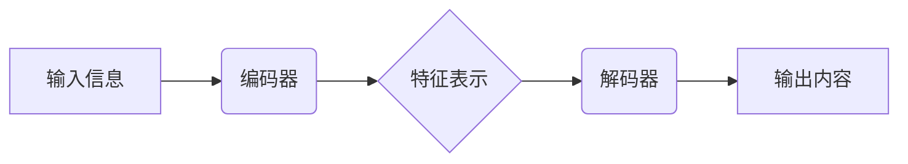

## 生成式AI的实际应用案例

> 关键词：生成式AI、Transformer模型、自然语言处理、文本生成、图像生成、代码生成、应用案例、未来趋势

## 1. 背景介绍

近年来，人工智能领域取得了令人瞩目的进展，其中生成式AI作为一类重要的应用，展现出强大的潜力，能够生成逼真、高质量的文本、图像、音频等内容。与传统的AI模型相比，生成式AI更侧重于创造性任务，能够根据输入信息生成全新的内容，而非仅仅进行分类或预测。

生成式AI的兴起与深度学习技术的进步密不可分。特别是Transformer模型的出现，为自然语言处理领域带来了革命性的变化，其强大的序列建模能力和并行计算能力，使得生成式AI模型能够处理更长、更复杂的文本序列，生成更流畅、更自然的文本内容。

## 2. 核心概念与联系

**2.1 核心概念**

* **生成式AI:** 一类能够根据输入信息生成新内容的AI模型，例如文本、图像、音频等。
* **Transformer模型:** 一种基于注意力机制的深度学习模型，能够有效处理序列数据，在自然语言处理领域取得了突破性进展。
* **编码器-解码器架构:**  生成式AI模型常用的架构，编码器负责将输入信息编码成特征表示，解码器则根据编码后的特征生成输出内容。
* **注意力机制:**  一种能够学习输入序列中不同部分之间的重要关系的机制，使得模型能够关注关键信息，生成更准确、更相关的输出。

**2.2 架构关系**



**2.3 联系**

生成式AI模型通常采用编码器-解码器架构，其中Transformer模型作为解码器，利用注意力机制学习输入信息之间的关系，生成高质量的输出内容。

## 3. 核心算法原理 & 具体操作步骤

**3.1 算法原理概述**

生成式AI模型的核心算法是基于深度学习的概率模型，其目标是学习输入信息与输出内容之间的概率分布。通过训练大量的样本数据，模型能够学习到输入信息到输出内容的映射关系，从而能够生成新的内容。

**3.2 算法步骤详解**

1. **数据预处理:** 将原始数据进行清洗、格式化和编码，使其能够被模型理解。
2. **模型构建:** 选择合适的生成式AI模型架构，例如Transformer模型，并定义模型参数。
3. **模型训练:** 使用训练数据训练模型，通过反向传播算法优化模型参数，使得模型能够生成更准确、更符合真实分布的输出内容。
4. **模型评估:** 使用测试数据评估模型的性能，例如生成文本的流畅度、图像的真实度等。
5. **模型部署:** 将训练好的模型部署到实际应用场景中，用于生成新的内容。

**3.3 算法优缺点**

* **优点:**
    * 生成高质量、逼真的内容。
    * 能够处理各种类型的数据，例如文本、图像、音频等。
    * 具有强大的创造性，能够生成全新的内容。
* **缺点:**
    * 需要大量的训练数据。
    * 训练过程耗时且耗能。
    * 容易受到训练数据中的偏差影响。

**3.4 算法应用领域**

* **自然语言处理:** 文本生成、机器翻译、对话系统、文本摘要等。
* **计算机视觉:** 图像生成、图像修复、图像风格迁移等。
* **音频处理:** 音频合成、语音识别、音乐创作等。
* **代码生成:** 自动生成代码、代码修复、代码注释等。

## 4. 数学模型和公式 & 详细讲解 & 举例说明

**4.1 数学模型构建**

生成式AI模型通常采用概率模型，例如变分自编码器（VAE）或生成对抗网络（GAN）。

* **VAE:** 将输入数据编码成低维特征表示，然后解码生成新的数据。

* **GAN:** 由生成器和判别器两部分组成，生成器试图生成逼真的数据，判别器试图区分真实数据和生成数据。两者相互竞争，最终使得生成器能够生成高质量的伪造数据。

**4.2 公式推导过程**

* **VAE:**

    * 编码器输出的特征表示为z:  z = encoder(x)
    * 解码器输入特征表示生成新的数据: x' = decoder(z)
    * 目标函数为最小化重建误差和KL散度:

    $$
    L(x, x') = D_{KL}(q(z|x) || p(z)) + D_{MSE}(x, x')
    $$

    其中，$D_{KL}$表示KL散度，$D_{MSE}$表示均方误差。

* **GAN:**

    * 生成器输出的伪造数据为G(z): G(z) = generator(z)
    * 判别器输出真实数据和伪造数据的概率: D(x) = discriminator(x)
    * 目标函数为最小化生成器损失和最大化判别器损失:

    $$
    L_G = E_{z} [log(D(G(z)))]
    $$

    $$
    L_D = E_{x} [log(D(x))] + E_{z} [log(1 - D(G(z)))]
    $$

**4.3 案例分析与讲解**

* **文本生成:** 使用Transformer模型训练一个文本生成模型，能够根据输入的文本提示生成新的文本内容。例如，输入“今天天气真好”，模型可以生成“适合出去散步”。
* **图像生成:** 使用GAN训练一个图像生成模型，能够生成逼真的图像。例如，输入一个人的描述，模型可以生成该人的图像。

## 5. 项目实践：代码实例和详细解释说明

**5.1 开发环境搭建**

* Python 3.7+
* TensorFlow/PyTorch
* CUDA/cuDNN

**5.2 源代码详细实现**

```python
# 使用TensorFlow实现文本生成模型
import tensorflow as tf

# 定义模型架构
model = tf.keras.Sequential([
    tf.keras.layers.Embedding(vocab_size, embedding_dim),
    tf.keras.layers.LSTM(units),
    tf.keras.layers.Dense(vocab_size, activation='softmax')
])

# 编译模型
model.compile(optimizer='adam', loss='sparse_categorical_crossentropy', metrics=['accuracy'])

# 训练模型
model.fit(train_data, train_labels, epochs=10)

# 生成文本
text = "今天天气"
for _ in range(10):
    predictions = model.predict(tf.expand_dims(text, 0))
    predicted_index = tf.argmax(predictions[0]).numpy()
    text += vocabulary[predicted_index]
```

**5.3 代码解读与分析**

* 该代码示例使用TensorFlow框架实现了一个简单的文本生成模型。
* 模型架构采用Embedding层将单词映射到向量空间，LSTM层学习文本序列的上下文信息，Dense层输出每个单词的概率分布。
* 模型使用Adam优化器、稀疏类别交叉熵损失函数和准确率作为评估指标进行训练。
* 训练完成后，可以使用模型生成新的文本内容。

**5.4 运行结果展示**

运行代码后，可以生成类似于以下的文本：

```
今天天气真好，适合出去散步。
```

## 6. 实际应用场景

**6.1 文本生成**

* **内容创作:** 自动生成新闻报道、广告文案、社交媒体内容等。
* **机器翻译:** 将文本从一种语言翻译成另一种语言。
* **对话系统:** 创建更自然、更流畅的对话体验。

**6.2 图像生成**

* **图像合成:** 生成逼真的图像，例如人物肖像、风景画等。
* **图像修复:** 修复损坏的图像，例如去除噪点、修复缺失部分等。
* **图像风格迁移:** 将图像转换为不同的艺术风格。

**6.3 代码生成**

* **代码自动完成:** 根据代码上下文自动生成代码片段。
* **代码生成:** 根据自然语言描述自动生成代码。
* **代码修复:** 自动修复代码中的错误。

**6.4 未来应用展望**

* **个性化内容生成:** 根据用户的喜好和需求生成个性化的内容。
* **虚拟现实和增强现实:** 生成逼真的虚拟环境和增强现实体验。
* **科学研究:** 辅助科学家进行数据分析、模型构建和实验设计。

## 7. 工具和资源推荐

**7.1 学习资源推荐**

* **书籍:**
    * 《深度学习》
    * 《生成对抗网络》
* **在线课程:**
    * Coursera: 深度学习
    * Udacity: 生成式AI
* **博客和论坛:**
    * TensorFlow博客
    * PyTorch博客
    * Reddit: r/MachineLearning

**7.2 开发工具推荐**

* **TensorFlow:** 开源深度学习框架
* **PyTorch:** 开源深度学习框架
* **HuggingFace:** 提供预训练模型和工具

**7.3 相关论文推荐**

* **Attention Is All You Need:** 提出Transformer模型
* **Generative Adversarial Nets:** 提出GAN模型
* **Variational Autoencoders for Generation:** 提出VAE模型

## 8. 总结：未来发展趋势与挑战

**8.1 研究成果总结**

生成式AI技术取得了显著进展，能够生成高质量、逼真的内容，在多个领域展现出巨大的应用潜力。

**8.2 未来发展趋势**

* **模型能力提升:** 开发更强大的生成式AI模型，能够生成更复杂、更创新的内容。
* **数据安全与隐私保护:** 解决生成式AI模型训练和应用过程中数据安全和隐私保护问题。
* **伦理与社会影响:** 关注生成式AI技术的伦理问题和社会影响，确保其安全、负责任地发展。

**8.3 面临的挑战**

* **数据获取和标注:** 生成式AI模型需要大量的训练数据，数据获取和标注成本高昂。
* **模型训练效率:** 训练大型生成式AI模型需要大量的计算资源和时间。
* **模型解释性和可控性:** 生成式AI模型的决策过程难以解释，缺乏可控性。

**8.4 研究展望**

未来研究将重点关注以下方向:

* 开发更高效、更鲁棒的生成式AI模型。
* 研究生成式AI模型的解释性和可控性。
* 探索生成式AI技术在更多领域的应用。

## 9. 附录：常见问题与解答

* **Q: 生成式AI模型容易受到训练数据中的偏差影响，如何解决这个问题？**

* **A:** 可以通过使用更全面、更均衡的训练数据，以及采用数据增强和对抗训练等技术来减轻偏差的影响。

* **Q: 生成式AI模型的训练过程耗时且耗能，如何提高训练效率？**

* **A:** 可以采用模型压缩、知识蒸馏等技术来减小模型规模，并利用分布式训练和并行计算来加速训练速度。

* **Q: 如何评估生成式AI模型的性能？**

* **A:** 可以使用多种指标来评估生成式AI模型的性能，例如生成文本的流畅度、图像的真实度、代码的正确性等。

作者：禅与计算机程序设计艺术 / Zen and the Art of Computer Programming 


