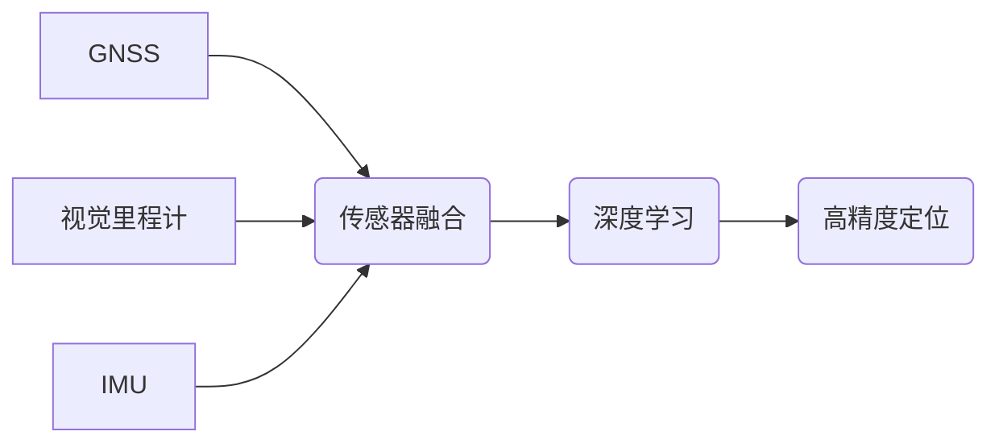

## 端到端自动驾驶的高精度定位方案

> 关键词：自动驾驶、高精度定位、传感器融合、深度学习、SLAM、GNSS、视觉里程计、IMU

## 1. 背景介绍

自动驾驶技术作为未来交通运输的重要发展方向，其核心之一便是高精度定位。准确的定位信息是自动驾驶系统感知环境、规划路径、控制车辆的关键要素。传统的GPS定位技术受环境影响较大，精度难以满足自动驾驶对厘米级定位精度的要求。因此，发展高精度定位方案成为自动驾驶技术发展的重要课题。

近年来，随着传感器技术的进步和深度学习算法的兴起，端到端自动驾驶的高精度定位方案取得了显著进展。这些方案通常结合多种传感器数据，例如摄像头、激光雷达、惯性测量单元（IMU）等，通过传感器融合和深度学习算法实现高精度定位。

## 2. 核心概念与联系

### 2.1 核心概念

* **传感器融合:** 将来自不同传感器的数据进行融合，以提高定位精度和鲁棒性。
* **深度学习:** 利用深度神经网络对传感器数据进行特征提取和建模，实现自动驾驶定位。
* **SLAM (Simultaneous Localization and Mapping):**  同时进行定位和地图构建，能够在未知环境中进行自主导航。
* **GNSS (Global Navigation Satellite System):** 全球导航卫星系统，例如GPS、北斗等，提供全局定位信息。
* **视觉里程计 (Visual Odometry):** 利用摄像头图像序列进行运动估计和地图构建，实现相对定位。
* **IMU (Inertial Measurement Unit):** 惯性测量单元，测量车辆的加速度和角速度，提供运动状态信息。

### 2.2 架构图



## 3. 核心算法原理 & 具体操作步骤

### 3.1 算法原理概述

端到端自动驾驶的高精度定位方案通常采用深度学习算法，将传感器数据作为输入，直接预测车辆的位姿信息。这些算法通常基于卷积神经网络 (CNN) 或循环神经网络 (RNN)，能够学习复杂的数据特征，实现高精度定位。

### 3.2 算法步骤详解

1. **数据采集:** 收集来自GNSS、视觉里程计、IMU等传感器的数据。
2. **数据预处理:** 对采集到的数据进行预处理，例如去除噪声、进行特征提取等。
3. **数据融合:** 将预处理后的数据进行融合，形成综合的传感器数据。
4. **深度学习模型训练:** 利用深度学习算法对融合后的数据进行训练，学习车辆位姿预测模型。
5. **位姿预测:** 将实时采集到的传感器数据输入到训练好的模型中，预测车辆的当前位姿信息。
6. **定位结果输出:** 将预测的位姿信息输出，用于自动驾驶系统的导航和控制。

### 3.3 算法优缺点

**优点:**

* 高精度定位: 深度学习算法能够学习复杂的数据特征，实现厘米级甚至毫米级的定位精度。
* 鲁棒性强: 能够融合多种传感器数据，提高定位的鲁棒性，减少环境因素的影响。
* 自动学习: 不需要人工标注数据，能够自动学习数据特征，降低开发成本。

**缺点:**

* 计算复杂度高: 深度学习模型训练和推理需要大量的计算资源。
* 数据依赖性强: 需要大量的标注数据进行训练，数据质量直接影响模型性能。
* 泛化能力有限: 模型训练数据和实际环境存在差异时，定位精度可能会下降。

### 3.4 算法应用领域

* 自动驾驶汽车
* 无人机
* 机器人导航
* 室内定位

## 4. 数学模型和公式 & 详细讲解 & 举例说明

### 4.1 数学模型构建

高精度定位方案通常采用状态空间模型来描述车辆的运动状态。状态空间模型将车辆的位姿信息表示为状态向量，例如：

$$
\mathbf{x} = \begin{bmatrix}
x \\
y \\
z \\
\theta_x \\
\theta_y \\
\theta_z
\end{bmatrix}
$$

其中：

* $x$, $y$, $z$ 表示车辆在笛卡尔坐标系中的位置坐标。
* $\theta_x$, $\theta_y$, $\theta_z$ 表示车辆的姿态角。

状态空间模型的动力学方程描述了车辆状态随时间的变化，例如：

$$
\dot{\mathbf{x}} = \mathbf{f}(\mathbf{x}, \mathbf{u}, t)
$$

其中：

* $\dot{\mathbf{x}}$ 表示状态向量的导数。
* $\mathbf{f}$ 表示状态转移函数。
* $\mathbf{u}$ 表示控制输入，例如车辆的加速度和转角速度。
* $t$ 表示时间。

### 4.2 公式推导过程

状态空间模型的推导过程通常基于车辆的运动学和动力学模型。例如，对于一个简单的二维车辆模型，其运动学方程可以表示为：

$$
\begin{aligned}
\dot{x} &= v \cos(\theta) \\
\dot{y} &= v \sin(\theta) \\
\dot{\theta} &= \omega
\end{aligned}
$$

其中：

* $v$ 表示车辆的速度。
* $\omega$ 表示车辆的角速度。

### 4.3 案例分析与讲解

假设车辆在二维平面上运动，其初始位置为 $(x_0, y_0)$, 初始姿态角为 $\theta_0$, 速度为 $v$, 角速度为 $\omega$. 

根据上述运动学方程，我们可以推导出车辆在时间 $t$ 时的状态向量：

$$
\mathbf{x}(t) = \begin{bmatrix}
x_0 + v t \cos(\theta_0) \\
y_0 + v t \sin(\theta_0) \\
\theta_0 + \omega t
\end{bmatrix}
$$

通过对状态向量进行预测，我们可以得到车辆在未来时间点的位姿信息。

## 5. 项目实践：代码实例和详细解释说明

### 5.1 开发环境搭建

* 操作系统: Ubuntu 20.04
* 编程语言: Python 3.8
* 深度学习框架: TensorFlow 2.0
* 其他依赖库: numpy, opencv-python, matplotlib

### 5.2 源代码详细实现

```python
import tensorflow as tf

# 定义神经网络模型
class LocalizationModel(tf.keras.Model):
    def __init__(self):
        super(LocalizationModel, self).__init__()
        # 定义网络结构
        self.conv1 = tf.keras.layers.Conv2D(32, (3, 3), activation='relu')
        self.conv2 = tf.keras.layers.Conv2D(64, (3, 3), activation='relu')
        self.fc1 = tf.keras.layers.Dense(128, activation='relu')
        self.fc2 = tf.keras.layers.Dense(6)  # 输出6个状态变量

    def call(self, inputs):
        # 前向传播过程
        x = self.conv1(inputs)
        x = self.conv2(x)
        x = tf.keras.layers.Flatten()(x)
        x = self.fc1(x)
        outputs = self.fc2(x)
        return outputs

# 实例化模型
model = LocalizationModel()

# 训练模型
#...

# 预测位姿
predictions = model.predict(sensor_data)
```

### 5.3 代码解读与分析

* **模型定义:** 定义了一个名为 `LocalizationModel` 的神经网络模型，包含卷积层、全连接层等。
* **前向传播:** `call` 方法定义了模型的前向传播过程，将输入数据经过一系列层进行处理，最终输出车辆的位姿信息。
* **模型训练:** 需要使用训练数据对模型进行训练，以学习车辆位姿预测模型。
* **位姿预测:** 将实时采集到的传感器数据作为输入，预测车辆的当前位姿信息。

### 5.4 运行结果展示

运行结果展示可以包括预测的位姿信息、定位轨迹等，以验证模型的性能。

## 6. 实际应用场景

### 6.1 自动驾驶汽车

高精度定位方案是自动驾驶汽车的核心技术之一，用于感知车辆周围环境、规划路径、控制车辆行驶。

### 6.2 无人机

无人机需要精确的定位信息才能完成任务，例如航拍、物探等。

### 6.3 机器人导航

机器人导航系统需要高精度定位才能在复杂环境中自主导航。

### 6.4 未来应用展望

随着自动驾驶技术的发展，高精度定位方案将在更多领域得到应用，例如智能交通、智慧城市、工业自动化等。

## 7. 工具和资源推荐

### 7.1 学习资源推荐

* **书籍:**
    * "Probabilistic Robotics" by Sebastian Thrun, Wolfram Burgard, and Dieter Fox
    * "Principles of Robot Motion: Theory, Algorithms, and Implementations" by Howie Choset et al.
* **在线课程:**
    * Coursera: "Robotics: Perception and Navigation"
    * Udacity: "Self-Driving Car Engineer Nanodegree"

### 7.2 开发工具推荐

* **ROS (Robot Operating System):** 一个用于机器人软件开发的开源平台。
* **Gazebo:** 一个用于机器人仿真和测试的开源软件。
* **OpenCV:** 一个用于计算机视觉的开源库。

### 7.3 相关论文推荐

* "End-to-End Learning for Self-Driving Cars" by Bojarski et al.
* "Deep Learning for Autonomous Driving" by Chen et al.
* "Simultaneous Localization and Mapping with Deep Learning" by Engel et al.

## 8. 总结：未来发展趋势与挑战

### 8.1 研究成果总结

端到端自动驾驶的高精度定位方案取得了显著进展，能够实现厘米级甚至毫米级的定位精度。这些方案通常结合多种传感器数据，利用深度学习算法进行位姿预测。

### 8.2 未来发展趋势

* **更鲁棒的定位算法:** 提高定位算法的鲁棒性，能够应对复杂环境和恶劣天气条件。
* **更精细的定位精度:** 进一步提高定位精度，满足更高要求的自动驾驶应用场景。
* **更低功耗的定位方案:** 开发更低功耗的定位方案，延长自动驾驶系统的续航时间。
* **多传感器融合优化:** 进一步优化多传感器融合算法，提高定位精度和可靠性。

### 8.3 面临的挑战

* **数据标注成本高:** 深度学习模型需要大量的标注数据进行训练，数据标注成本较高。
* **模型泛化能力有限:** 模型训练数据和实际环境存在差异时，定位精度可能会下降。
* **计算资源需求高:** 深度学习模型训练和推理需要大量的计算资源。

### 8.4 研究展望

未来，高精度定位方案将继续朝着更鲁棒、更精细、更低功耗的方向发展。随着人工智能技术的进步，相信高精度定位方案将在自动驾驶技术发展中发挥越来越重要的作用。

## 9. 附录：常见问题与解答

* **Q1: 什么是传感器融合?**

A1: 传感器融合是指将来自不同传感器的数据进行融合，以提高定位精度和鲁棒性。例如，将GNSS、视觉里程计、IMU等传感器数据融合在一起，可以提高定位的准确性和可靠性。

* **Q2: 深度学习模型如何训练?**

A2: 深度学习模型的训练需要使用大量的标注数据，通过反向传播算法不断调整模型参数，使其能够准确预测车辆的位姿信息。

* **Q3: 高精度定位方案有哪些应用场景?**

A3: 高精度定位方案的应用场景非常广泛，例如自动驾驶汽车、无人机、机器人导航等。

* **Q4: 高