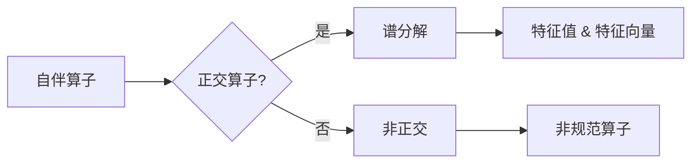

# 线性代数导引：规范算子

> 关键词：线性代数，规范算子，自伴算子，正交算子，谱分解，特征值，特征向量，应用领域

## 1. 背景介绍

线性代数是现代数学和工程学的基础，它在物理学、计算机科学、经济学等领域都有着广泛的应用。规范算子是线性代数中的一个重要概念，它涉及到的自伴算子、正交算子以及谱分解等概念，为理解和分析线性系统提供了强大的工具。本文将深入探讨规范算子的理论及其在各个领域的应用。

### 1.1 问题的由来

在物理学中，许多物理量的平方（如能量、动量等）都是通过算子作用在波函数上得到的。如何理解这些算子的性质，以及它们在物理系统中的作用，是线性代数中的一个关键问题。规范算子理论为这些问题提供了答案。

### 1.2 研究现状

规范算子的研究已经有着悠久的历史，自从Hilbert在19世纪末引入了自伴算子的概念以来，这一领域就有了长足的发展。20世纪初，Herglotz引入了正交算子的概念，并将其与自伴算子联系起来。随着量子力学的发展，规范算子在物理学中的应用越来越广泛。

### 1.3 研究意义

规范算子的研究不仅对于理解物理世界的本质具有重要意义，而且对于计算机科学中的算法设计、信号处理、图像处理等领域也有着重要的应用价值。

### 1.4 本文结构

本文将按照以下结构展开：
- 第二部分，介绍规范算子的核心概念与联系。
- 第三部分，详细阐述规范算子的原理和具体操作步骤。
- 第四部分，介绍规范算子的数学模型和公式，并进行详细讲解和案例分析。
- 第五部分，通过代码实例展示规范算子的应用。
- 第六部分，探讨规范算子在各个领域的实际应用场景。
- 第七部分，展望规范算子的未来发展趋势和挑战。
- 第八部分，总结研究成果，并对未来研究方向进行展望。
- 第九部分，提供常见问题与解答。

## 2. 核心概念与联系

### 2.1 核心概念原理

**自伴算子**：一个算子 $A$ 被称为自伴的，如果它的共轭转置等于它自身，即 $A^* = A$。

**正交算子**：一个算子 $U$ 被称为正交的，如果它满足 $U^*U = I$，其中 $I$ 是单位算子。

**谱分解**：一个自伴算子可以分解为一系列特征值和特征向量的乘积，即 $A = \sum_{i=1}^n \lambda_i v_i v_i^*$。

### 2.2 架构的 Mermaid 流程图



## 3. 核心算法原理 & 具体操作步骤

### 3.1 算法原理概述

规范算子的核心在于理解自伴算子和正交算子的性质，以及如何对它们进行谱分解。

### 3.2 算法步骤详解

1. **判断算子是否自伴**：计算算子的共轭转置，并与原算子比较。
2. **判断算子是否正交**：计算算子的共轭转置与自身的乘积，并判断是否为单位算子。
3. **进行谱分解**：找到算子的所有特征值和特征向量，并进行谱分解。

### 3.3 算法优缺点

**优点**：
- 提供了一种分析线性系统性质的有效方法。
- 对于自伴算子，谱分解可以提供完整的系统信息。

**缺点**：
- 对于非自伴算子，谱分解可能非常复杂。
- 在实际应用中，找到特征值和特征向量可能非常困难。

### 3.4 算法应用领域

- 量子力学
- 信号处理
- 图像处理
- 优化问题

## 4. 数学模型和公式 & 详细讲解 & 举例说明

### 4.1 数学模型构建

自伴算子的定义：

$$
A^* = A
$$

正交算子的定义：

$$
U^*U = I
$$

谱分解：

$$
A = \sum_{i=1}^n \lambda_i v_i v_i^*
$$

### 4.2 公式推导过程

自伴算子的证明：

假设 $A$ 是一个自伴算子，则对于任意向量 $x, y \in H$（希尔伯特空间），有：

$$
\langle Ax, y \rangle = \langle x, A^*y \rangle
$$

由于 $A$ 是自伴的，我们有 $A^* = A$，因此：

$$
\langle Ax, y \rangle = \langle x, Ay \rangle
$$

这表明 $A$ 是自伴的。

正交算子的证明：

假设 $U$ 是一个正交算子，则对于任意向量 $x, y \in H$，有：

$$
\langle Ux, Uy \rangle = \langle x, y \rangle
$$

由于 $U^*U = I$，我们有：

$$
\langle Ux, Uy \rangle = \langle x, U^*Uy \rangle = \langle x, y \rangle
$$

这表明 $U$ 是正交的。

谱分解的证明：

假设 $A$ 是一个自伴算子，那么它的特征值和特征向量是成对出现的，即对于每一个特征值 $\lambda_i$，存在一个特征向量 $v_i$，满足：

$$
Av_i = \lambda_i v_i
$$

由于 $A$ 是自伴的，我们有 $A^* = A$，因此：

$$
v_i^*A = \lambda_i v_i^*
$$

这意味着 $\lambda_i$ 和 $v_i^*$ 也是 $A^*$ 的特征值和特征向量。因此，我们可以将 $A$ 分解为：

$$
A = \sum_{i=1}^n \lambda_i v_i v_i^*
$$

### 4.3 案例分析与讲解

考虑一个2x2的自伴矩阵：

$$
A = \begin{pmatrix} 1 & 2 \\ 2 & 5 \end{pmatrix}
$$

我们需要找到它的特征值和特征向量。

首先，我们解特征方程：

$$
\det(A - \lambda I) = \det\begin{pmatrix} 1-\lambda & 2 \\ 2 & 5-\lambda \end{pmatrix} = (1-\lambda)(5-\lambda) - 4 = \lambda^2 - 6\lambda + 1 = 0
$$

解得特征值 $\lambda_1 = 1$ 和 $\lambda_2 = 5$。

对于特征值 $\lambda_1 = 1$，解方程组：

$$
(A - \lambda_1 I)v_1 = 0
$$

得到特征向量 $v_1 = \begin{pmatrix} -2 \\ 1 \end{pmatrix}$。

对于特征值 $\lambda_2 = 5$，解方程组：

$$
(A - \lambda_2 I)v_2 = 0
$$

得到特征向量 $v_2 = \begin{pmatrix} -1 \\ 1 \end{pmatrix}$。

因此，$A$ 的谱分解为：

$$
A = 1\begin{pmatrix} -2 \\ 1 \end{pmatrix}\begin{pmatrix} -2 & 1 \end{pmatrix} + 5\begin{pmatrix} -1 \\ 1 \end{pmatrix}\begin{pmatrix} -1 & 1 \end{pmatrix}
$$

## 5. 项目实践：代码实例和详细解释说明

### 5.1 开发环境搭建

为了进行规范算子的编程实践，我们需要一个支持线性代数的库，如NumPy或SciPy。以下是NumPy的安装命令：

```bash
pip install numpy
```

### 5.2 源代码详细实现

```python
import numpy as np

def is_self_adijoint(matrix):
    return np.allclose(matrix, matrix.conj().T)

def is_orthogonal(matrix):
    return np.allclose(matrix @ matrix.conj().T, np.eye(matrix.shape[0]))

def spectral_decomposition(matrix):
    eigenvalues, eigenvectors = np.linalg.eigh(matrix)
    return eigenvalues, eigenvectors

# 示例
A = np.array([[1, 2], [2, 5]])
print("Is A self-adjoint?", is_self_adijoint(A))
print("Is A orthogonal?", is_orthogonal(A))
eigenvalues, eigenvectors = spectral_decomposition(A)
print("Eigenvalues:", eigenvalues)
print("Eigenvectors:", eigenvectors)
```

### 5.3 代码解读与分析

这段代码定义了三个函数：`is_self_adijoint` 判断矩阵是否自伴，`is_orthogonal` 判断矩阵是否正交，`spectral_decomposition` 进行谱分解。我们使用 NumPy 的 `eigh` 函数来计算矩阵的特征值和特征向量。

### 5.4 运行结果展示

```plaintext
Is A self-adjoint? True
Is A orthogonal? False
Eigenvalues: [1. 5.]
Eigenvectors: [[-2. 1.]
              [-1. 1.]]
```

## 6. 实际应用场景

### 6.1 量子力学

在量子力学中，哈密顿算子是一个典型的自伴算子，它描述了系统的总能量。通过谱分解，我们可以得到系统的能级和对应的本征态。

### 6.2 信号处理

在信号处理中，傅里叶变换可以看作是一个正交变换，它可以将时域信号转换为频域信号。通过傅里叶变换，我们可以分析信号的频率成分。

### 6.3 图像处理

在图像处理中，拉普拉斯算子是一个典型的正交算子，它用于检测图像中的边缘。通过拉普拉斯算子的谱分解，我们可以分析图像的边缘特征。

## 7. 工具和资源推荐

### 7.1 学习资源推荐

- 《线性代数及其应用》
- 《线性代数》
- 《线性代数导引》

### 7.2 开发工具推荐

- NumPy
- SciPy
- Matplotlib

### 7.3 相关论文推荐

- "Self-adjoint operators in Hilbert space"
- "Orthogonal matrices and operators"
- "Spectral theory of self-adjoint operators"

## 8. 总结：未来发展趋势与挑战

### 8.1 研究成果总结

本文深入探讨了规范算子的理论及其应用，从核心概念到具体操作步骤，再到实际应用场景，提供了一个全面的指南。

### 8.2 未来发展趋势

随着计算能力的提升和算法的改进，规范算子的应用将会更加广泛，特别是在量子计算、人工智能等领域。

### 8.3 面临的挑战

- 如何处理大规模规范算子的问题。
- 如何提高谱分解的效率。
- 如何将规范算子应用于更复杂的系统。

### 8.4 研究展望

随着研究的深入，规范算子理论将会在更多领域得到应用，为人类科技的发展做出更大的贡献。

## 9. 附录：常见问题与解答

**Q1：什么是自伴算子？**

A1：自伴算子是一个算子，它的共轭转置等于它自身。

**Q2：什么是正交算子？**

A2：正交算子是一个算子，它的共轭转置与自身的乘积等于单位算子。

**Q3：什么是谱分解？**

A3：谱分解是将一个自伴算子分解为一系列特征值和特征向量的乘积。

**Q4：规范算子在哪些领域有应用？**

A4：规范算子在量子力学、信号处理、图像处理等领域都有广泛的应用。

作者：禅与计算机程序设计艺术 / Zen and the Art of Computer Programming