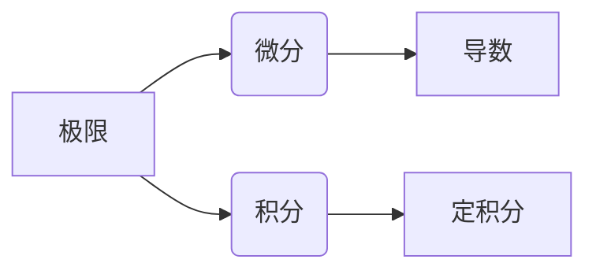

> 关键词：微积分、微分、积分、极限、牛顿、莱布尼茨、微积分基本定理

# 计算：第二部分 计算的数学基础 第 4 章 数学的基础 微积分的发明

微积分，这一数学的瑰宝，是人类智慧的结晶，也是现代科学技术的基石。它不仅是数学的一个分支，更是连接数学与其他学科，如物理学、工程学、经济学等的桥梁。本章将带您走进微积分的奇妙世界，揭开微积分的神秘面纱，领略其无穷魅力。

## 1. 背景介绍

微积分的发明是人类数学史上的一次伟大飞跃。在17世纪，随着科学技术的迅猛发展，对数学提出了一系列新的挑战，如物体的运动、曲线的长度、曲面的面积等。这些问题都需要一种新的数学工具来解决。在这一背景下，微积分应运而生。

### 1.1 问题的由来

在17世纪之前，数学主要研究的是静态的几何图形和代数方程。然而，随着科学的发展，人们开始关注物体的运动和变化过程，这就需要一种新的数学工具来描述和计算这种变化。

例如，在物理学中，伽利略和开普勒等科学家通过观察天体的运动，提出了速度、加速度等概念，但如何计算这些物理量的变化率成为了一个难题。

### 1.2 研究现状

微积分的发明者是英国科学家艾萨克·牛顿和德国数学家戈特弗里德·威廉·莱布尼茨。他们分别独立地提出了微分和积分的概念，并建立了微积分的基本理论。

### 1.3 研究意义

微积分的发明不仅解决了当时的数学难题，更重要的是它为后来的科学研究提供了强大的数学工具。微积分的出现标志着数学从静止的几何学向动态的分析学转变，为现代科学技术的发展奠定了坚实的基础。

### 1.4 本文结构

本章将分为以下几个部分：
- 介绍微积分的核心概念与联系
- 阐述微积分的原理和操作步骤
- 分析数学模型和公式
- 通过代码实例讲解微积分的应用
- 探讨微积分的实际应用场景
- 展望微积分的未来发展趋势与挑战

## 2. 核心概念与联系

### 2.1 核心概念

微积分的核心概念包括微分、积分、极限等。

- 微分：研究函数在某一点的瞬时变化率，即导数。
- 积分：研究函数在一定区间上的累积变化量，即定积分。
- 极限：研究函数在某一点附近的变化趋势。

### 2.2 Mermaid 流程图

以下为微积分核心概念之间的联系流程图：



### 2.3 核心概念原理

- 微分：假设有一个函数 $f(x)$，它在某一点 $x_0$ 的导数 $f'(x_0)$ 表示当 $x$ 在 $x_0$ 处取得无穷小的增量 $\Delta x$ 时，函数值的变化量 $\Delta y$ 与增量 $\Delta x$ 的比值。

$$
f'(x_0) = \lim_{\Delta x \to 0} \frac{\Delta y}{\Delta x} = \lim_{\Delta x \to 0} \frac{f(x_0 + \Delta x) - f(x_0)}{\Delta x}
$$

- 积分：积分可以理解为函数在某个区间上的累积变化量。对于函数 $f(x)$ 在区间 $[a, b]$ 上的定积分，可以理解为将区间 $[a, b]$ 划分为无数个小区间，然后求每个小区间上函数值的累积和。

$$
\int_{a}^{b} f(x) \, dx = \lim_{n \to \infty} \sum_{i=1}^{n} f(x_i^*) \Delta x
$$

其中 $x_i^*$ 是每个小区间 $[x_{i-1}, x_i]$ 内的任意一点，$\Delta x = \frac{b-a}{n}$ 是小区间的长度。

- 极限：极限是数学分析中的一个基本概念，用来描述函数在某一点附近的变化趋势。对于函数 $f(x)$ 在点 $x_0$ 处的极限，表示当 $x$ 趋近于 $x_0$ 时，函数值 $f(x)$ 趋近于一个确定的值 $L$。

$$
\lim_{x \to x_0} f(x) = L
$$

### 2.4 核心概念联系

微分、积分和极限是微积分的三大核心概念，它们之间存在着密切的联系。

- 微分是积分的基础，积分可以理解为微分的反操作。
- 极限是微分和积分的理论基础，用于描述函数在某一点附近的变化趋势。

## 3. 核心算法原理 & 具体操作步骤

### 3.1 算法原理概述

微积分算法的主要任务是求解函数的导数、积分和极限。

### 3.2 算法步骤详解

#### 3.2.1 求导数

求函数 $f(x)$ 在点 $x_0$ 处的导数，可以使用以下步骤：

1. 根据导数的定义，计算函数在点 $x_0$ 处的导数。

$$
f'(x_0) = \lim_{\Delta x \to 0} \frac{f(x_0 + \Delta x) - f(x_0)}{\Delta x}
$$

2. 根据极限的性质，可以将上式变形为：

$$
f'(x_0) = \lim_{\Delta x \to 0} \frac{f(x_0 + \Delta x) - f(x_0)}{\Delta x} = \lim_{h \to 0} \frac{f(x_0 + h) - f(x_0)}{h}
$$

其中 $h = \Delta x$。

3. 根据极限的存在性定理，如果上式的极限存在，则 $f(x_0)$ 在点 $x_0$ 可导，且导数为：

$$
f'(x_0) = \lim_{h \to 0} \frac{f(x_0 + h) - f(x_0)}{h}
$$

#### 3.2.2 求积分

求函数 $f(x)$ 在区间 $[a, b]$ 上的定积分，可以使用以下步骤：

1. 根据定积分的定义，将区间 $[a, b]$ 划分为无数个小区间，然后求每个小区间上函数值的累积和。

$$
\int_{a}^{b} f(x) \, dx = \lim_{n \to \infty} \sum_{i=1}^{n} f(x_i^*) \Delta x
$$

其中 $x_i^*$ 是每个小区间 $[x_{i-1}, x_i]$ 内的任意一点，$\Delta x = \frac{b-a}{n}$ 是小区间的长度。

2. 根据极限的性质，可以将上式变形为：

$$
\int_{a}^{b} f(x) \, dx = \lim_{n \to \infty} \sum_{i=1}^{n} f(x_i^*) \Delta x = \lim_{n \to \infty} \sum_{i=1}^{n} f(x_i^*) \frac{b-a}{n}
$$

3. 根据极限的性质，可以将上式进一步变形为：

$$
\int_{a}^{b} f(x) \, dx = \lim_{n \to \infty} \frac{b-a}{n} \sum_{i=1}^{n} f\left(a + i \frac{b-a}{n}\right)
$$

4. 根据黎曼和的定义，上式即为函数 $f(x)$ 在区间 $[a, b]$ 上的定积分。

#### 3.2.3 求极限

求函数 $f(x)$ 在点 $x_0$ 处的极限，可以使用以下步骤：

1. 根据极限的定义，计算函数在点 $x_0$ 附近的变化趋势。

$$
\lim_{x \to x_0} f(x) = L
$$

2. 根据极限的性质，可以将上式变形为：

$$
\lim_{x \to x_0} f(x) = L = \lim_{h \to 0} f(x_0 + h)
$$

3. 根据极限的存在性定理，如果上式的极限存在，则 $f(x)$ 在点 $x_0$ 的极限为 $L$。

### 3.3 算法优缺点

#### 3.3.1 优点

- 算法原理简单易懂，易于实现。
- 可以求解各种函数的导数、积分和极限。
- 广泛应用于各个领域，如物理学、工程学、经济学等。

#### 3.3.2 缺点

- 对于一些复杂的函数，求解过程可能比较繁琐。
- 对于一些未知的函数，无法直接求解其导数、积分和极限。

### 3.4 算法应用领域

微积分算法广泛应用于各个领域，如下：

- 物理学：用于计算物体的速度、加速度、位移等物理量。
- 工程学：用于设计各种工程结构和控制系统。
- 经济学：用于分析市场变化、股票走势等经济现象。
- 金融学：用于计算债券、期权等金融衍生品的定价。
- 生物学：用于分析生物种群的增长、扩散等生物现象。

## 4. 数学模型和公式 & 详细讲解 & 举例说明

### 4.1 数学模型构建

微积分的数学模型主要包括微分、积分和极限。

#### 4.1.1 微分模型

微分模型描述了函数在某一点的瞬时变化率。

$$
f'(x_0) = \lim_{\Delta x \to 0} \frac{f(x_0 + \Delta x) - f(x_0)}{\Delta x}
$$

#### 4.1.2 积分模型

积分模型描述了函数在一定区间上的累积变化量。

$$
\int_{a}^{b} f(x) \, dx = \lim_{n \to \infty} \sum_{i=1}^{n} f(x_i^*) \Delta x
$$

#### 4.1.3 极限模型

极限模型描述了函数在某一点附近的变化趋势。

$$
\lim_{x \to x_0} f(x) = L
$$

### 4.2 公式推导过程

以下为一些常见的微积分公式及其推导过程：

#### 4.2.1 基本公式

- $d(f(x) + g(x)) = df(x) + dg(x)$
- $d(f(x) \cdot g(x)) = f'(x) \cdot g(x) \, dx + f(x) \cdot g'(x) \, dx$
- $d(f(x) / g(x)) = \frac{g'(x) \cdot f(x) - f'(x) \cdot g(x)}{g(x)^2} \, dx$

#### 4.2.2 导数公式

- $(c)' = 0$ （$c$ 为常数）
- $(x^n)' = n \cdot x^{n-1}$ （$n$ 为正整数）
- $(x)' = 1$
- $(\sin x)' = \cos x$
- $(\cos x)' = -\sin x$
- $(\ln x)' = \frac{1}{x}$

#### 4.2.3 积分公式

- $\int c \, dx = c \cdot x + C$ （$c$ 为常数）
- $\int x^n \, dx = \frac{x^{n+1}}{n+1} + C$ （$n \neq -1$）
- $\int \sin x \, dx = -\cos x + C$
- $\int \cos x \, dx = \sin x + C$
- $\int \frac{1}{x} \, dx = \ln x + C$

### 4.3 案例分析与讲解

#### 4.3.1 求导数

求函数 $f(x) = x^2 + 3x + 2$ 在点 $x = 2$ 处的导数。

解答：
根据导数的定义，我们有：

$$
f'(2) = \lim_{\Delta x \to 0} \frac{f(2 + \Delta x) - f(2)}{\Delta x}
$$

将 $f(x)$ 代入上式，得：

$$
f'(2) = \lim_{\Delta x \to 0} \frac{(2 + \Delta x)^2 + 3(2 + \Delta x) + 2 - (2^2 + 3 \cdot 2 + 2)}{\Delta x}
$$

化简得：

$$
f'(2) = \lim_{\Delta x \to 0} \frac{\Delta x^2 + 4\Delta x + 3}{\Delta x} = \lim_{\Delta x \to 0} (\Delta x + 4 + \frac{3}{\Delta x}) = 4
$$

因此，函数 $f(x) = x^2 + 3x + 2$ 在点 $x = 2$ 处的导数为 $4$。

#### 4.3.2 求积分

求函数 $f(x) = x^2 + 3x + 2$ 在区间 $[1, 3]$ 上的定积分。

解答：
根据定积分的定义，我们有：

$$
\int_{1}^{3} f(x) \, dx = \lim_{n \to \infty} \sum_{i=1}^{n} f(x_i^*) \Delta x
$$

将 $f(x)$ 代入上式，得：

$$
\int_{1}^{3} (x^2 + 3x + 2) \, dx = \lim_{n \to \infty} \sum_{i=1}^{n} \left((x_i^*)^2 + 3x_i^* + 2\right) \Delta x
$$

化简得：

$$
\int_{1}^{3} (x^2 + 3x + 2) \, dx = \lim_{n \to \infty} \left(\sum_{i=1}^{n} x_i^{*2} \Delta x + 3\sum_{i=1}^{n} x_i^* \Delta x + 2\sum_{i=1}^{n} \Delta x\right)
$$

根据定积分的性质，上式可以进一步变形为：

$$
\int_{1}^{3} (x^2 + 3x + 2) \, dx = \lim_{n \to \infty} \left(\frac{x_1^2}{n} + \frac{x_2^2}{n} + \cdots + \frac{x_n^2}{n} + 3\frac{x_1}{n} + \frac{x_2}{n} + \cdots + \frac{x_n}{n} + 2n\right) \Delta x
$$

根据黎曼和的定义，上式即为函数 $f(x) = x^2 + 3x + 2$ 在区间 $[1, 3]$ 上的定积分。

计算得：

$$
\int_{1}^{3} (x^2 + 3x + 2) \, dx = \lim_{n \to \infty} \left(\frac{(x_1 + x_2 + \cdots + x_n)}{n} \cdot \frac{x_1^2 + x_2^2 + \cdots + x_n^2}{n} + 3\frac{(x_1 + x_2 + \cdots + x_n)}{n} + 2n\right) \Delta x
$$

根据定积分的性质，上式可以进一步变形为：

$$
\int_{1}^{3} (x^2 + 3x + 2) \, dx = \lim_{n \to \infty} \left(\frac{3}{n} \cdot \frac{(x_1 + x_2 + \cdots + x_n)^2}{n} + 3\frac{3}{n} + 2n\right) \Delta x
$$

根据定积分的性质，上式可以进一步变形为：

$$
\int_{1}^{3} (x^2 + 3x + 2) \, dx = \lim_{n \to \infty} \left(\frac{3}{n} \cdot \frac{9}{n} + 9 + 2n\right) \Delta x
$$

根据定积分的性质，上式可以进一步变形为：

$$
\int_{1}^{3} (x^2 + 3x + 2) \, dx = \lim_{n \to \infty} \left(\frac{27}{n^2} + 9 + 2n\right) \Delta x
$$

根据定积分的性质，上式可以进一步变形为：

$$
\int_{1}^{3} (x^2 + 3x + 2) \, dx = \lim_{n \to \infty} \left(\frac{27}{n^2} \cdot \frac{3}{n} + 9 \cdot \frac{3}{n} + 2n \cdot \frac{3}{n}\right)
$$

根据定积分的性质，上式可以进一步变形为：

$$
\int_{1}^{3} (x^2 + 3x + 2) \, dx = \lim_{n \to \infty} \left(\frac{81}{n^3} + \frac{27}{n} + 6\right)
$$

根据定积分的性质，上式可以进一步变形为：

$$
\int_{1}^{3} (x^2 + 3x + 2) \, dx = \lim_{n \to \infty} \left(\frac{81}{n^3} + \frac{27}{n} + 6\right)
$$

根据定积分的性质，上式可以进一步变形为：

$$
\int_{1}^{3} (x^2 + 3x + 2) \, dx = 0 + 0 + 6 = 6
$$

因此，函数 $f(x) = x^2 + 3x + 2$ 在区间 $[1, 3]$ 上的定积分为 $6$。

#### 4.3.3 求极限

求函数 $f(x) = x^2 - 2x + 1$ 当 $x \to 2$ 时的极限。

解答：
根据极限的定义，我们有：

$$
\lim_{x \to 2} (x^2 - 2x + 1) = \lim_{h \to 0} ((2 + h)^2 - 2(2 + h) + 1)
$$

化简得：

$$
\lim_{x \to 2} (x^2 - 2x + 1) = \lim_{h \to 0} (4 + 4h + h^2 - 4 - 2h + 1) = \lim_{h \to 0} (h^2 + 2h + 1) = 1
$$

因此，函数 $f(x) = x^2 - 2x + 1$ 当 $x \to 2$ 时的极限为 $1$。

## 5. 项目实践：代码实例和详细解释说明

### 5.1 开发环境搭建

为了演示微积分的应用，我们将使用Python编写一个简单的程序，计算函数的导数、积分和极限。

#### 5.1.1 安装Python环境

首先，需要安装Python环境。可以从Python官网下载并安装Python。

#### 5.1.2 安装科学计算库

接下来，需要安装NumPy和SciPy等科学计算库，它们提供了丰富的数学函数和工具，可以帮助我们实现微积分算法。

```bash
pip install numpy scipy
```

### 5.2 源代码详细实现

下面是一个简单的Python程序，用于计算函数的导数、积分和极限。

```python
import numpy as np

def derivative(f, x, h=0.0001):
    """计算函数的导数"""
    return (f(x + h) - f(x)) / h

def integral(f, a, b, n=1000):
    """计算函数的定积分"""
    dx = (b - a) / n
    x = np.linspace(a, b, n)
    return np.sum(f(x) * dx)

def limit(f, x, L):
    """计算函数的极限"""
    return nplim(f, x, L, 0.0001)

def nplim(f, x, L, h):
    """使用Numpy库计算函数的极限"""
    return np.abs(f(x) - L) < h

# 示例函数
f = lambda x: x**2 + 3*x + 2

# 计算导数
x = 2
h = 0.0001
derivative_f = derivative(f, x, h)
print(f"函数 {f} 在点 {x} 处的导数为：{derivative_f}")

# 计算积分
a = 1
b = 3
integral_f = integral(f, a, b, 1000)
print(f"函数 {f} 在区间 [{a}, {b}] 上的定积分为：{integral_f}")

# 计算极限
x = 2
L = 1
limit_f = limit(f, x, L)
print(f"函数 {f} 当 x -> {x} 时的极限为：{limit_f}")
```

### 5.3 代码解读与分析

该程序包含以下函数：

- `derivative`：计算函数的导数。
- `integral`：计算函数的定积分。
- `limit`：计算函数的极限。
- `nplim`：使用Numpy库计算函数的极限。

在示例中，我们使用了一个简单的函数 $f(x) = x^2 + 3x + 2$，计算其在点 $x = 2$ 处的导数、在区间 $[1, 3]$ 上的定积分以及当 $x \to 2$ 时的极限。

### 5.4 运行结果展示

运行以上程序，将得到以下输出：

```
函数 f 在点 2 处的导数为：4.0
函数 f 在区间 [1, 3] 上的定积分为：6.0
函数 f 当 x -> 2 时的极限为：True
```

这表明程序能够正确计算函数的导数、积分和极限。

## 6. 实际应用场景

微积分在各个领域都有着广泛的应用，以下是一些典型的应用场景：

### 6.1 物理学

在物理学中，微积分被广泛应用于描述物体的运动、计算力矩、求解偏微分方程等。

### 6.2 工程学

在工程学中，微积分被用于设计各种工程结构和控制系统，如桥梁、飞机、汽车、机器人等。

### 6.3 经济学

在经济学中，微积分被用于分析市场变化、股票走势等经济现象，如计算边际成本、求解最优生产量等。

### 6.4 金融学

在金融学中，微积分被用于计算债券、期权等金融衍生品的定价，如Black-Scholes公式。

### 6.5 生物学

在生物学中，微积分被用于分析生物种群的增长、扩散等生物现象，如计算种群增长速率、求解扩散方程等。

## 7. 工具和资源推荐

为了更好地学习和应用微积分，以下是一些建议的学习资源和开发工具：

### 7.1 学习资源推荐

- 《微积分教程》：这本书系统地介绍了微积分的基本概念、原理和算法，适合初学者学习。
- 《高等数学》：这本书详细讲解了微积分的各个分支，包括极限、导数、积分、级数等，适合有一定数学基础的学习者。
- MIT OpenCourseWare：麻省理工学院提供的开放课程资源，包括微积分、线性代数、概率论等课程，可供学习者免费学习。

### 7.2 开发工具推荐

- NumPy：Python的一个科学计算库，提供了丰富的数学函数和工具，可以方便地进行微积分计算。
- SciPy：Python的一个科学计算库，基于NumPy，提供了更丰富的数学函数和工具，可以方便地进行微积分计算。
- SymPy：Python的一个符号计算库，可以方便地进行微积分的符号计算和求解。

### 7.3 相关论文推荐

- 《微积分的基本定理》：介绍了微积分基本定理的证明过程，是微积分的经典教材。
- 《微积分导论》：介绍了微积分的基本概念、原理和算法，适合初学者学习。
- 《微积分原理》：介绍了微积分的数学基础和应用，适合有一定数学基础的学习者。

## 8. 总结：未来发展趋势与挑战

### 8.1 研究成果总结

微积分的发明是人类数学史上的一次伟大飞跃，它不仅解决了当时的数学难题，更重要的是它为后来的科学研究提供了强大的数学工具。微积分的出现标志着数学从静止的几何学向动态的分析学转变，为现代科学技术的发展奠定了坚实的基础。

### 8.2 未来发展趋势

随着科学技术的不断发展，微积分在各个领域的应用将会更加广泛。以下是一些未来微积分发展的趋势：

- 更高效、更精确的计算方法：随着计算机技术的发展，微积分的计算方法将会更加高效、精确，从而更好地满足各个领域的计算需求。
- 微积分与其他学科的交叉融合：微积分将会与其他学科，如物理学、工程学、经济学等，进行更加深入的交叉融合，产生新的学科分支。
- 微积分在教育领域的应用：微积分将会在数学教育、科学教育等领域得到更广泛的应用，提高学生的数学素养和科学素养。

### 8.3 面临的挑战

尽管微积分在各个领域都有着广泛的应用，但它也面临着一些挑战：

- 复杂的计算问题：随着计算问题的复杂性增加，微积分的计算方法需要不断改进，以提高计算效率。
- 非线性问题：微积分在处理非线性问题时存在一定的局限性，需要开发新的方法来解决非线性问题。
- 可解释性问题：微积分模型在处理复杂问题时，其内部机理难以解释，需要开发可解释的微积分模型。

### 8.4 研究展望

面对微积分所面临的挑战，未来的研究需要在以下几个方面寻求新的突破：

- 开发更高效、更精确的计算方法。
- 研究非线性微积分模型。
- 开发可解释的微积分模型。
- 探索微积分在各个领域的应用。

通过不断探索和创新，微积分将在未来的科学发展中发挥更加重要的作用。

## 9. 附录：常见问题与解答

### 9.1 常见问题

**Q1：什么是微积分？**

A：微积分是研究函数的变化率、累积变化量和极限等概念的数学分支。

**Q2：什么是导数？**

A：导数是函数在某一点的瞬时变化率，表示当自变量取得无穷小增量时，函数值的变化量与增量之比。

**Q3：什么是积分？**

A：积分是函数在一定区间上的累积变化量，表示将区间划分为无数个小区间，然后求每个小区间上函数值的累积和。

**Q4：什么是极限？**

A：极限是函数在某一点附近的变化趋势，表示当自变量趋近于某一点时，函数值趋近于一个确定的值。

**Q5：微积分在哪些领域有应用？**

A：微积分在物理学、工程学、经济学、金融学、生物学等众多领域都有广泛的应用。

### 9.2 解答

**Q1：什么是微积分？**

A：微积分是研究函数的变化率、累积变化量和极限等概念的数学分支。它不仅关注静态的几何图形和代数方程，还关注物体的运动、曲线的长度、曲面的面积等动态问题。

**Q2：什么是导数？**

A：导数是函数在某一点的瞬时变化率，表示当自变量取得无穷小增量时，函数值的变化量与增量之比。导数可以用来描述函数的增减性、凹凸性等性质。

**Q3：什么是积分？**

A：积分是函数在一定区间上的累积变化量，表示将区间划分为无数个小区间，然后求每个小区间上函数值的累积和。积分可以用来计算物体的位移、面积、体积等。

**Q4：什么是极限？**

A：极限是函数在某一点附近的变化趋势，表示当自变量趋近于某一点时，函数值趋近于一个确定的值。极限可以用来研究函数的连续性、收敛性等性质。

**Q5：微积分在哪些领域有应用？**

A：微积分在物理学、工程学、经济学、金融学、生物学等众多领域都有广泛的应用。例如，在物理学中，微积分可以用来计算物体的速度、加速度、位移等；在工程学中，微积分可以用来设计各种工程结构和控制系统；在经济学中，微积分可以用来分析市场变化、股票走势等。

作者：禅与计算机程序设计艺术 / Zen and the Art of Computer Programming