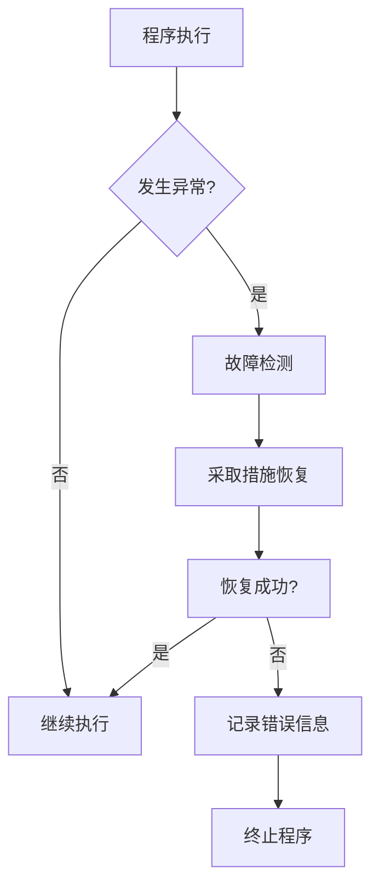

# 错误处理机制的设计原则

> 关键词：错误处理，故障检测，恢复机制，系统可靠性，设计模式，编程实践

## 1. 背景介绍

在软件工程中，错误处理是确保系统稳定性和可靠性的关键组成部分。无论是复杂的分布式系统还是简单的客户端应用程序，错误总是不可避免的。有效的错误处理机制能够帮助开发者识别、隔离和恢复系统中的故障，从而提高系统的整体性能和用户体验。本文将探讨错误处理机制的设计原则，旨在为开发者提供一套系统化的指导方针。

### 1.1 问题的由来

随着软件系统的复杂性不断增加，错误处理的重要性日益凸显。以下是一些促使我们深入探讨错误处理机制的原因：

- **系统复杂性**：现代软件系统通常包含大量的组件和依赖关系，任何一个小错误都可能导致整个系统崩溃。
- **分布式环境**：在分布式系统中，错误可能跨越多个节点传播，增加了识别和恢复的难度。
- **用户期望**：用户对软件系统的可靠性要求越来越高，错误处理机制直接影响到用户体验。
- **法律法规**：在某些行业，如金融服务和医疗保健，错误处理不当可能导致严重的法律和财务后果。

### 1.2 研究现状

当前，错误处理机制的设计已经形成了一些公认的原则和实践。这些原则包括异常处理、断路器模式、熔断机制、重试策略等。同时，也有许多工具和框架可以帮助开发者实现这些原则，例如日志记录工具、监控平台和异常处理库。

### 1.3 研究意义

研究错误处理机制的设计原则对于以下方面具有重要意义：

- **提高系统可靠性**：通过合理的错误处理机制，可以减少系统故障的发生，提高系统的整体可靠性。
- **增强用户体验**：有效的错误处理能够提供清晰的错误信息，帮助用户理解问题并采取适当的行动。
- **降低维护成本**：良好的错误处理机制可以减少系统故障后的修复时间，降低维护成本。
- **促进最佳实践**：总结和传播错误处理的设计原则有助于提高整个行业的软件工程水平。

### 1.4 本文结构

本文将按照以下结构展开：

- **第2章**：介绍错误处理的核心概念与联系。
- **第3章**：阐述错误处理机制的核心算法原理和具体操作步骤。
- **第4章**：讲解数学模型和公式，并结合实例进行分析。
- **第5章**：通过项目实践展示代码实例和详细解释。
- **第6章**：探讨错误处理机制的实际应用场景和未来展望。
- **第7章**：推荐相关的学习资源和开发工具。
- **第8章**：总结研究成果，展望未来发展趋势与挑战。
- **第9章**：提供常见问题与解答。

## 2. 核心概念与联系

### 2.1 核心概念原理

错误处理机制的核心概念包括：

- **异常**：程序执行过程中出现的错误或异常情况。
- **故障检测**：识别系统中的异常情况。
- **恢复机制**：采取措施恢复系统到正常状态。
- **可靠性**：系统在规定条件下，在规定的时间内，完成规定功能的概率。

Mermaid流程图如下：



### 2.2 核心概念联系

以上流程图展示了错误处理机制的核心概念之间的联系。程序执行过程中，如果发生异常，系统将进入故障检测阶段。如果检测到故障，系统将采取措施进行恢复。如果恢复成功，程序将继续执行；否则，系统将记录错误信息并终止程序。

## 3. 核心算法原理 & 具体操作步骤

### 3.1 算法原理概述

错误处理机制的算法原理主要包括以下步骤：

1. **异常检测**：通过代码逻辑、日志记录、监控工具等手段检测异常。
2. **异常分类**：根据异常的类型和严重程度进行分类。
3. **异常处理**：根据异常类型和分类结果，采取相应的处理措施。
4. **恢复**：在可能的情况下，尝试恢复系统到正常状态。
5. **记录**：记录错误信息和处理过程，以便后续分析和改进。

### 3.2 算法步骤详解

#### 3.2.1 异常检测

异常检测可以通过以下方式进行：

- **代码逻辑**：通过代码中的try-catch语句捕获和处理异常。
- **日志记录**：在关键代码位置记录日志信息，以便后续分析。
- **监控工具**：使用专业的监控工具实时监控系统状态，及时发现异常。

#### 3.2.2 异常分类

异常分类通常包括以下类型：

- **运行时错误**：在程序运行过程中发生的错误，如空指针异常、数组越界等。
- **资源错误**：与系统资源相关的错误，如磁盘空间不足、网络连接中断等。
- **配置错误**：与系统配置相关的错误，如配置文件格式错误、配置参数设置不当等。

#### 3.2.3 异常处理

异常处理策略包括：

- **恢复**：尝试修复错误，使系统恢复正常运行。
- **隔离**：隔离有问题的组件，防止错误扩散。
- **报告**：将错误信息报告给相关人员，以便进行进一步处理。

#### 3.2.4 恢复

恢复策略包括：

- **自动恢复**：自动尝试恢复系统到正常状态。
- **手动恢复**：由人工干预，根据错误信息进行恢复操作。

#### 3.2.5 记录

记录策略包括：

- **错误日志**：记录错误信息，包括时间、类型、原因、影响等。
- **监控日志**：记录系统运行状态，包括性能指标、资源使用情况等。

### 3.3 算法优缺点

#### 3.3.1 优点

- **提高系统可靠性**：通过异常处理和恢复机制，可以提高系统的可靠性。
- **增强用户体验**：通过提供清晰的错误信息，可以增强用户体验。
- **降低维护成本**：通过记录错误信息和监控系统状态，可以降低维护成本。

#### 3.3.2 缺点

- **复杂性**：错误处理机制的设计和实现可能比较复杂。
- **性能开销**：异常处理和恢复机制可能带来一定的性能开销。

### 3.4 算法应用领域

错误处理机制广泛应用于以下领域：

- **软件系统**：提高软件系统的可靠性和稳定性。
- **分布式系统**：确保分布式系统的可靠性和一致性。
- **网络系统**：提高网络系统的稳定性和安全性。
- **嵌入式系统**：确保嵌入式系统的可靠性和稳定性。

## 4. 数学模型和公式 & 详细讲解 & 举例说明

### 4.1 数学模型构建

在错误处理机制中，可以使用以下数学模型：

- **可靠性模型**：用于评估系统在特定条件下的可靠性。
- **故障树模型**：用于分析系统故障的原因和影响。
- **马尔可夫链模型**：用于模拟系统状态转换过程。

### 4.2 公式推导过程

以下是一些常用的数学公式：

- **可靠性公式**：

$$
R(t) = P(A_1 \cap A_2 \cap ... \cap A_n)
$$

其中 $R(t)$ 为系统在时间 $t$ 内可靠的概率，$A_1, A_2, ..., A_n$ 为影响系统可靠性的事件。

- **故障树公式**：

$$
F = O \cup (T_1 \cup T_2 \cup ... \cup T_m)
$$

其中 $F$ 为系统故障，$O$ 为基本事件，$T_1, T_2, ..., T_m$ 为导致系统故障的故障树分支。

### 4.3 案例分析与讲解

以下是一个简单的例子，说明如何使用故障树模型分析系统故障：

假设一个在线支付系统出现故障，导致用户无法完成支付。我们可以使用故障树模型分析故障原因：

- 基本事件：服务器故障、网络故障、数据库故障、应用代码故障。
- 故障树分支：
  - 服务器故障：服务器硬件故障、服务器软件故障。
  - 网络故障：网络带宽不足、网络延迟。
  - 数据库故障：数据库损坏、数据库连接失败。
  - 应用代码故障：代码逻辑错误、代码性能瓶颈。

通过分析故障树，我们可以找出导致系统故障的根本原因，并采取相应的措施进行修复。

## 5. 项目实践：代码实例和详细解释说明

### 5.1 开发环境搭建

由于错误处理机制涉及多个方面，以下将使用Python语言和常用的库来演示一个简单的错误处理示例。

### 5.2 源代码详细实现

```python
def divide(x, y):
    try:
        result = x / y
    except ZeroDivisionError:
        print("Error: Division by zero is not allowed.")
        result = None
    return result

# 测试代码
print(divide(10, 0))  # 应输出错误信息
print(divide(10, 2))  # 正常执行
```

### 5.3 代码解读与分析

以上代码演示了如何使用Python的try-except语句捕获和处理异常。当尝试执行除以零的操作时，程序会捕获`ZeroDivisionError`异常，并输出错误信息。对于其他操作，程序会正常执行。

### 5.4 运行结果展示

```plaintext
Error: Division by zero is not allowed.
5.0
```

## 6. 实际应用场景

### 6.1 软件系统

在软件系统中，错误处理机制主要用于以下场景：

- **用户输入验证**：验证用户输入是否符合要求，如输入的电子邮件地址是否合法。
- **文件操作**：处理文件读取、写入等操作中可能出现的错误。
- **网络通信**：处理网络连接失败、数据传输错误等问题。

### 6.2 分布式系统

在分布式系统中，错误处理机制主要用于以下场景：

- **服务调用**：处理服务调用失败、响应超时等问题。
- **数据同步**：处理数据同步错误、数据不一致等问题。
- **故障恢复**：处理节点故障、网络分区等问题。

### 6.3 网络系统

在网络系统中，错误处理机制主要用于以下场景：

- **连接建立**：处理连接建立失败、连接中断等问题。
- **数据传输**：处理数据传输错误、数据丢失等问题。
- **安全防护**：处理拒绝服务攻击、恶意代码入侵等问题。

### 6.4 未来应用展望

随着技术的不断发展，错误处理机制将在以下方面得到进一步的应用：

- **自动化故障恢复**：通过自动化工具和算法实现自动故障恢复。
- **预测性故障检测**：通过机器学习等技术预测潜在故障，提前采取措施。
- **智能错误处理**：通过人工智能技术实现更智能的错误处理和恢复。

## 7. 工具和资源推荐

### 7.1 学习资源推荐

- **《故障注入与测试》**：介绍如何通过故障注入技术测试系统的可靠性。
- **《软件工程》**：介绍软件工程的基本原理和方法，包括错误处理机制的设计。
- **《系统可靠性工程》**：介绍系统可靠性的基本概念和技术。

### 7.2 开发工具推荐

- **Log4j**：Java日志记录工具，可以帮助开发者记录和监控系统运行状态。
- **ELK Stack**：用于日志收集、分析和可视化的工具集。
- **Prometheus**：开源监控和告警工具，可以帮助开发者监控系统性能和健康状况。

### 7.3 相关论文推荐

- **《A survey of fault-tolerant distributed systems**》：综述了分布式系统中的故障容忍技术。
- **《Fault injection-based testing of distributed systems**》：介绍如何使用故障注入技术测试分布式系统的可靠性。
- **《A review of error handling techniques in software engineering**》：综述了软件工程中的错误处理技术。

## 8. 总结：未来发展趋势与挑战

### 8.1 研究成果总结

本文探讨了错误处理机制的设计原则，包括异常处理、故障检测、恢复机制等核心概念。通过分析算法原理和具体操作步骤，并结合实际案例进行讲解，帮助开发者理解错误处理机制的设计和应用。

### 8.2 未来发展趋势

未来，错误处理机制将朝着以下方向发展：

- **智能化**：通过人工智能和机器学习技术，实现更智能的错误检测和处理。
- **自动化**：通过自动化工具和算法，实现自动故障恢复和错误处理。
- **预测性**：通过预测性分析，提前发现潜在故障，采取措施预防。

### 8.3 面临的挑战

错误处理机制的设计和应用面临以下挑战：

- **复杂性**：随着系统复杂性的增加，错误处理机制的设计和实现越来越复杂。
- **效率**：错误处理机制可能带来额外的性能开销。
- **可维护性**：错误处理代码可能难以维护和更新。

### 8.4 研究展望

为了应对这些挑战，未来的研究可以从以下方面展开：

- **简化设计**：研究更简单、更高效的错误处理机制设计方法。
- **提高效率**：研究如何减少错误处理机制的性能开销。
- **增强可维护性**：研究如何提高错误处理代码的可维护性。

## 9. 附录：常见问题与解答

### 9.1 常见问题

**Q1：什么是异常处理？**

A1：异常处理是一种错误处理机制，它允许程序在发生错误时，从正常的程序流程中跳出，执行特定的错误处理代码。

**Q2：什么是故障检测？**

A2：故障检测是指识别系统中的异常情况，例如硬件故障、软件错误、资源不足等。

**Q3：什么是恢复机制？**

A3：恢复机制是指采取措施恢复系统到正常状态，例如重新启动服务、重启系统等。

**Q4：错误处理机制对系统可靠性有什么影响？**

A4：有效的错误处理机制可以提高系统的可靠性，减少系统故障的发生，提高系统的整体性能。

### 9.2 解答

**Q1：如何选择合适的错误处理策略？**

A1：选择合适的错误处理策略需要考虑以下因素：

- 系统的可靠性要求
- 系统的复杂程度
- 用户的期望
- 可用资源

**Q2：如何提高错误处理代码的可维护性？**

A2：提高错误处理代码的可维护性可以通过以下方法：

- 使用清晰的命名和注释
- 将错误处理逻辑封装成函数或模块
- 遵循编程规范

**Q3：如何处理分布式系统中的错误？**

A3：处理分布式系统中的错误需要考虑以下因素：

- 分布式系统的拓扑结构
- 分布式系统的通信机制
- 分布式系统的容错能力

**Q4：如何测试错误处理机制？**

A4：测试错误处理机制可以通过以下方法：

- 故障注入测试
- 压力测试
- 回归测试

作者：禅与计算机程序设计艺术 / Zen and the Art of Computer Programming