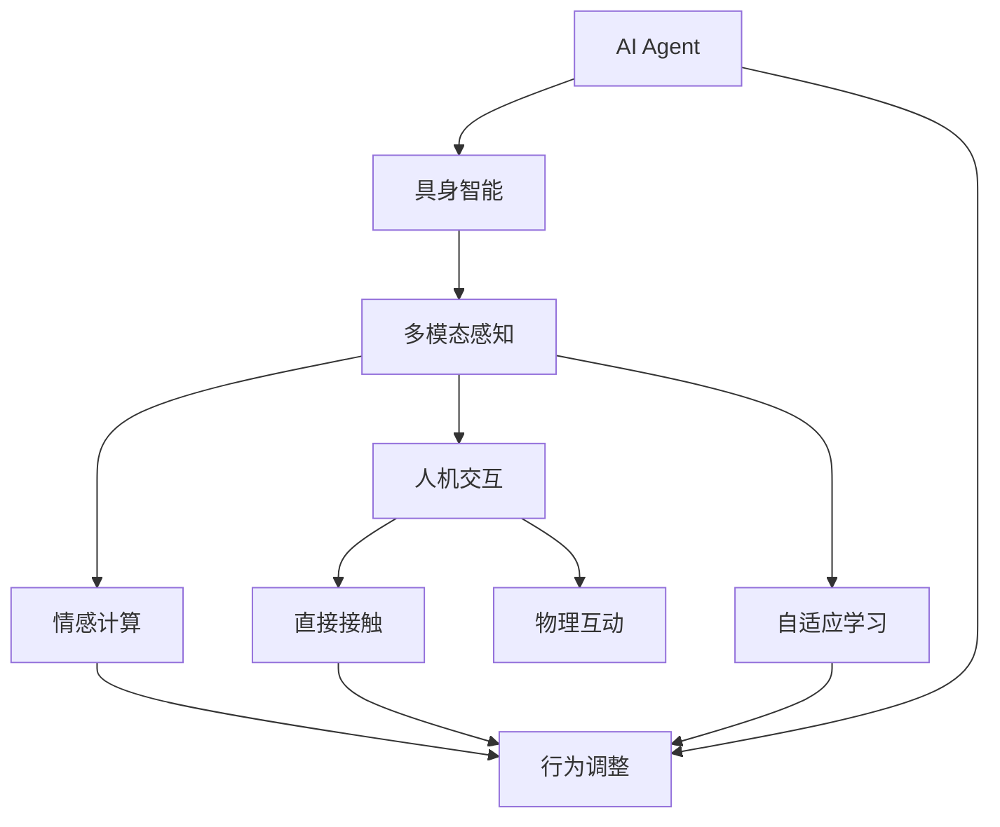

                 

# AI Agent: AI的下一个风口 具身智能对未来社会的影响

> 关键词：具身智能,人机交互,自适应学习,情感计算,多模态感知

## 1. 背景介绍

随着人工智能技术的不断进步，AI Agent在各个领域的应用逐渐普及，尤其在智能制造、智慧城市、医疗健康、自动驾驶等重要行业。然而，传统的AI Agent主要依赖于算法和计算资源的提升，其能力与人类感知能力的差距依然显著。面对复杂多变、高度动态化的环境，AI Agent亟需获取更加丰富、准确、实时的感知信息，实现更加精准、灵活、自适应的行为决策。

具身智能（Embodied Intelligence）作为一种新的AI技术范式，通过在机器上嵌入传感设备、机械结构，结合实时感知、自主移动和决策推理能力，打破传统AI Agent与环境、人类之间的物理隔阂，从而在复杂环境中实现更加高效、自然的人机交互和任务执行。

本文旨在探讨具身智能在AI Agent中的研究现状、应用前景及其对未来社会的深远影响，为构建更具智能、情感、自主性的AI系统提供理论基础和实践指南。

## 2. 核心概念与联系

### 2.1 核心概念概述

为了更清晰地理解具身智能与AI Agent的关系，本节将介绍几个核心概念：

- **AI Agent**: 能够感知环境、自主决策并采取行动的智能体。AI Agent的目标是通过执行预定任务，实现与环境的交互，而具身智能则赋予AI Agent更高的感知和行动能力。

- **具身智能（Embodied Intelligence）**: 通过在机器上嵌入传感设备、机械结构，使AI Agent具备真实的物理存在和感官体验，从而在复杂环境中获取更加丰富、实时的感知信息，进行更加灵活、自主的决策和行为。

- **人机交互（Human-Computer Interaction, HCI）**: AI Agent与人类之间的交互方式，具身智能通过实现直接接触和物理互动，提升人机交互的自然性和沉浸感。

- **自适应学习（Adaptive Learning）**: AI Agent能够根据环境变化调整自身的行为策略和感知模型，具身智能通过物理交互增强对环境的理解，实现更加高效的学习和适应。

- **情感计算（Affective Computing）**: 理解、表达和管理情感的计算技术，具身智能通过感知人体的生理信号、表情、语音等，实现对人类情感的识别和反馈。

- **多模态感知（Multimodal Perception）**: 结合视觉、听觉、触觉等多传感器的信息，实现全面、准确的环境感知，具身智能通过多模态感知技术提升环境理解和行为决策的准确性。

### 2.2 概念间的关系

这些核心概念之间存在着紧密的联系，形成了具身智能与AI Agent的核心生态系统。下面通过Mermaid流程图来展示这些概念之间的关系：



这个流程图展示了大语言模型微调过程中各个核心概念的关系：

1. **AI Agent**作为具身智能的基础，通过多模态感知、情感计算、自适应学习等技术，实现对环境的深度理解和行为决策。
2. **具身智能**使AI Agent具备物理存在和感官体验，提升感知和行为的自主性。
3. **多模态感知**通过视觉、听觉、触觉等多传感器的信息，实现对环境的全面感知。
4. **情感计算**通过理解、表达和管理情感，提升AI Agent的人机交互自然性和沉浸感。
5. **自适应学习**通过不断调整自身行为策略和感知模型，增强AI Agent的环境适应能力。
6. **人机交互**通过直接接触和物理互动，实现更加自然、高效的人机交互。

通过理解这些核心概念，我们可以更好地把握具身智能在AI Agent中的作用和潜力。

## 3. 核心算法原理 & 具体操作步骤
### 3.1 算法原理概述

具身智能的实现主要依赖于以下几个核心算法：

- **多模态感知算法**：通过组合视觉、听觉、触觉等多种传感器的信息，实现对环境的全面感知。
- **情感计算算法**：利用语音、表情、生理信号等数据，理解和管理人类情感。
- **自适应学习算法**：根据环境变化调整自身的行为策略和感知模型，实现灵活适应。
- **行为决策算法**：结合感知信息和任务目标，生成最优的行为决策。

这些算法通过高效的算法框架集成在AI Agent中，实现具身智能的各项功能。

### 3.2 算法步骤详解

具身智能的实现步骤主要包括以下几个方面：

1. **传感数据采集**：通过摄像头、麦克风、触觉传感器等采集环境信息。
2. **数据预处理**：对采集到的多模态数据进行降噪、归一化、特征提取等预处理操作。
3. **环境建模**：通过机器学习算法，建立环境的感知模型，实现对环境的理解。
4. **行为决策**：根据任务目标和环境感知，生成最优的行为决策。
5. **执行与反馈**：执行决策并获取反馈信息，调整感知模型和行为策略。

下面以具身智能在自动驾驶中的应用为例，详细讲解具体的实现步骤：

1. **传感数据采集**：自动驾驶车辆配备多个摄像头、雷达、激光雷达和GPS，采集环境信息。
2. **数据预处理**：对采集到的摄像头图像进行去噪、灰度化、边缘检测等预处理操作，提取道路、车辆、行人等关键信息。
3. **环境建模**：通过深度学习算法，建立道路、车辆、行人等关键元素的感知模型，实现对环境的理解。
4. **行为决策**：根据驾驶任务目标，如到达目的地、避障、超车等，结合环境感知，生成最优的驾驶决策。
5. **执行与反馈**：执行驾驶决策并获取速度、位置、姿态等反馈信息，调整感知模型和驾驶策略。

### 3.3 算法优缺点

具身智能在提升AI Agent的感知和行为能力方面，具有以下优势：

- **实时感知**：通过多模态感知技术，实现对环境的实时监控和动态调整。
- **高自主性**：通过物理交互，实现自主学习和决策。
- **自然交互**：通过直接接触和物理互动，实现更加自然、高效的人机交互。

但同时也存在一些局限性：

- **高成本**：实现具身智能需要嵌入传感器和机械结构，成本较高。
- **复杂性**：多模态感知和自主学习的复杂度较高，实现难度较大。
- **安全问题**：物理交互可能带来一定的安全隐患，需要设计安全机制。

### 3.4 算法应用领域

具身智能技术在多个领域中已得到广泛应用，具体包括：

- **自动驾驶**：通过多模态感知和实时决策，实现自动驾驶车辆的精准控制和环境适应。
- **机器人**：通过直接接触和物理互动，实现机器人的自主行为和任务执行。
- **医疗健康**：通过情感计算和行为反馈，实现机器人护理的个性化和情感化。
- **智能家居**：通过多模态感知和环境理解，实现智能设备的自主交互和任务执行。
- **虚拟现实**：通过具身智能，实现虚拟现实环境中的人机自然交互和沉浸体验。

未来，具身智能技术有望在更多领域得到应用，进一步推动人工智能技术的普及和深化。

## 4. 数学模型和公式 & 详细讲解 & 举例说明
### 4.1 数学模型构建

在具身智能的实现中，数学模型主要涉及感知模型、决策模型和行为模型。以下分别介绍这三个模型：

**感知模型**：通过多传感器数据，建立对环境的感知模型，实现对环境的理解。

**决策模型**：根据任务目标和环境感知，生成最优的行为决策。

**行为模型**：通过自主学习和调整，实现行为策略的动态调整。

### 4.2 公式推导过程

以自动驾驶中的多模态感知模型为例，公式推导过程如下：

1. **摄像头图像处理**：

$$
I = K \cdot D + B
$$

其中 $I$ 为摄像头图像，$D$ 为深度信息，$K$ 为投影矩阵，$B$ 为校准参数。

2. **视觉特征提取**：

$$
F = CNN(I)
$$

其中 $F$ 为视觉特征向量，$CNN$ 为卷积神经网络。

3. **车辆检测**：

$$
V = RNN(F)
$$

其中 $V$ 为车辆状态向量，$RNN$ 为循环神经网络。

### 4.3 案例分析与讲解

以自动驾驶中的车辆检测为例，分析多模态感知模型的应用。

1. **摄像头图像采集**：通过摄像头获取道路、车辆、行人等关键信息。
2. **深度信息提取**：通过深度信息提取算法，得到车辆和行人的深度信息，用于定位和距离估计。
3. **视觉特征提取**：通过卷积神经网络，提取关键目标的视觉特征，用于识别和分类。
4. **车辆状态预测**：通过循环神经网络，结合深度信息和视觉特征，预测车辆的状态和行为。

## 5. 项目实践：代码实例和详细解释说明
### 5.1 开发环境搭建

在进行具身智能开发前，我们需要准备好开发环境。以下是使用Python进行开发的环境配置流程：

1. 安装Anaconda：从官网下载并安装Anaconda，用于创建独立的Python环境。

2. 创建并激活虚拟环境：
```bash
conda create -n agent-env python=3.8 
conda activate agent-env
```

3. 安装必要的库：
```bash
pip install numpy pandas scikit-learn torch torchvision torchaudio transformers opencv-python
```

4. 安装ROS（Robot Operating System）：
```bash
sudo apt-get install ros-kinetic-ROS-PKG ros-kinetic-ROS-DEV-PKG ros-kinetic-gazebo-plugins-dev
```

5. 安装ROS相关的传感器库：
```bash
sudo apt-get install ros-kinetic-kinect2-openni2-libs ros-kinetic-kinect2-color-camera-libs ros-kinetic-laser-clients ros-kinetic-laser-scan-converter
```

完成上述步骤后，即可在`agent-env`环境中开始具身智能的开发实践。

### 5.2 源代码详细实现

以下是具身智能在自动驾驶中的应用示例，通过使用OpenCV和PyTorch库实现多模态感知和行为决策：

```python
import cv2
import torch
from torchvision import models, transforms

# 定义多模态感知模块
class MultiModalPerception:
    def __init__(self):
        self.camera = cv2.VideoCapture(0)
        self.depth_sensor = cv2.VideoCapture(1)
        self.fhog = cv2.HOGDescriptor()
        self.car_cascade = cv2.CascadeClassifier('car.xml')

    def preprocess(self, image):
        # 图像预处理
        image = cv2.cvtColor(image, cv2.COLOR_BGR2GRAY)
        image = cv2.resize(image, (200, 200))
        return image

    def detect_cars(self, image):
        # 车辆检测
        image = self.preprocess(image)
        _, cars = self.car_cascade.detectMultiScale(image, scaleFactor=1.1, minNeighbors=3, minSize=(30, 30), maxSize=(100, 100))
        return cars

    def get_depth(self, image):
        # 获取深度信息
        image = cv2.cvtColor(image, cv2.COLOR_BGR2GRAY)
        depth_map = cv2.sobel(image, cv2.CV_32F, 1, 0, ksize=3)
        return depth_map

    def visualize(self, cars, depth_map):
        # 图像可视化
        image = self.camera.read()
        image = self.preprocess(image)
        image = cv2.rectangle(image, (cars[0][0], cars[0][1]), (cars[0][2], cars[0][3]), (0, 0, 255), 2)
        image = cv2.merge([image, depth_map])
        cv2.imshow('MultiModalPerception', image)
        cv2.waitKey(0)

    def run(self):
        while True:
            _, image = self.camera.read()
            depth_map = self.get_depth(self.depth_sensor.read())
            self.visualize(self.detect_cars(image), depth_map)
```

通过上述代码，我们可以实现自动驾驶中多模态感知模块的功能，通过摄像头和深度传感器获取环境信息，并进行车辆检测和深度信息提取。

### 5.3 代码解读与分析

让我们再详细解读一下关键代码的实现细节：

**MultiModalPerception类**：
- `__init__`方法：初始化摄像头、深度传感器、HOG特征检测器和车辆检测器。
- `preprocess`方法：对输入图像进行预处理，包括灰度化和图像大小调整。
- `detect_cars`方法：使用HOG特征检测器检测图像中的车辆。
- `get_depth`方法：通过Sobel算子获取深度信息。
- `visualize`方法：将车辆检测结果和深度信息可视化。
- `run`方法：实时运行感知模块，并显示车辆检测和深度信息。

通过使用OpenCV和PyTorch库，我们可以高效地实现具身智能的多模态感知功能。开发者可以根据具体需求，进行参数调整和功能扩展，提升具身智能的感知能力。

## 6. 实际应用场景
### 6.1 智能制造

具身智能在智能制造领域有着广泛的应用前景。通过嵌入机械臂和传感器，结合视觉和触觉信息，实现对环境的深度感知和灵活操作。在自动装配、智能检测、质量控制等方面，具身智能可以显著提升生产效率和质量。

### 6.2 智慧城市

具身智能在智慧城市中的应用也非常广泛。通过嵌入传感器和机械结构，实现对城市环境的实时监控和智能控制。在交通管理、公共安全、环境保护等方面，具身智能可以提升城市治理的智能化和安全性。

### 6.3 医疗健康

具身智能在医疗健康领域也有着巨大的应用潜力。通过结合感知和决策能力，实现机器人护理、手术辅助、康复训练等功能。在老年护理、康复训练、手术辅助等方面，具身智能可以显著提升医疗服务的质量和效率。

### 6.4 未来应用展望

随着具身智能技术的不断进步，其应用场景将更加广泛，带来更深远的影响。未来，具身智能将广泛应用于以下几个领域：

1. **智能家居**：通过具身智能，实现家庭环境的智能感知和自主控制。
2. **虚拟现实**：通过具身智能，实现虚拟现实环境中的人机自然交互和沉浸体验。
3. **军事应用**：通过具身智能，实现军事机器人、无人机等自主行为和任务执行。
4. **社会治理**：通过具身智能，实现城市管理的智能化和精细化。

未来，具身智能技术将成为人工智能领域的重要方向，进一步推动社会向智能化、自主化、人性化方向发展。

## 7. 工具和资源推荐
### 7.1 学习资源推荐

为了帮助开发者系统掌握具身智能的理论基础和实践技巧，这里推荐一些优质的学习资源：

1. **《Embodied Cognition: Lessons from the Enactive Turn》**：该书从认知科学的角度探讨具身智能，结合神经科学和心理学等领域的知识，深入浅出地介绍了具身智能的核心概念和前沿研究。
2. **《Robotics: Science and Systems》课程**：麻省理工学院开设的机器人学课程，涵盖了机器人感知、决策和控制等核心内容，是机器人学领域的经典课程。
3. **《Intelligent Robots and Their Brains》**：该书介绍了多种机器人感知和决策算法的实现，涵盖视觉、听觉、触觉等多传感器数据融合技术。
4. **ROS官方文档**：ROS（Robot Operating System）的官方文档，提供了丰富的开源代码和算法实现，是机器人学领域的必读资料。
5. **OpenAI Gym**：基于Python的机器学习框架，提供了多种机器人仿真环境，方便进行具身智能的实验和测试。

通过对这些资源的学习实践，相信你一定能够快速掌握具身智能的核心技术，并用于解决实际的机器人应用问题。

### 7.2 开发工具推荐

高效的开发离不开优秀的工具支持。以下是几款用于具身智能开发的常用工具：

1. **PyTorch**：基于Python的开源深度学习框架，灵活动态的计算图，适合快速迭代研究。
2. **OpenCV**：开源计算机视觉库，提供了丰富的图像处理和特征提取算法。
3. **ROS**：Robot Operating System，用于机器人仿真的开源软件平台。
4. **Gazebo**：机器人仿真软件，支持多种机器人平台和传感器。
5. **Rasa**：自然语言处理工具库，用于构建聊天机器人和语音助手。
6. **Vizdoom**：基于Unity的机器人仿真环境，支持多种传感器和决策算法的集成。

合理利用这些工具，可以显著提升具身智能开发的效率，加快创新迭代的步伐。

### 7.3 相关论文推荐

具身智能的研究涉及多个领域，以下是几篇奠基性的相关论文，推荐阅读：

1. **"Embodied Cognition: A Short Introduction"**：Louchouarn G. 介绍了具身认知的核心理念和研究方法，为理解具身智能提供了理论基础。
2. **"Embodied Cognition: Beyond Cognition"**：Rosenschein J. S. 探讨了具身认知的哲学和心理学背景，分析了具身智能对人类认知的影响。
3. **"Robot Learning from Demonstrations"**：Ivanović M. 等探讨了机器人从示范学习中的具身智能，分析了多模态感知和行为决策的优化方法。
4. **"Embodied AI: A New Pathway for Robotics"**：Chaiwongkhot T. 等分析了具身智能在机器人中的应用前景，探讨了具身智能与传统AI的区别和优势。
5. **"From Ground to Sky: The Latest Advances in Self-Navigating Robotics"**：Villalba V. 等介绍了最新自航机器人技术的进展，分析了具身智能在导航和避障中的应用。

这些论文代表了具身智能研究的最新进展，通过学习这些前沿成果，可以帮助研究者把握学科前进方向，激发更多的创新灵感。

除上述资源外，还有一些值得关注的前沿资源，帮助开发者紧跟具身智能技术的最新进展，例如：

1. **arXiv论文预印本**：人工智能领域最新研究成果的发布平台，包括大量尚未发表的前沿工作，学习前沿技术的必读资源。
2. **NIPS、ICML、ACL等国际会议直播**：前沿学术会议的直播，能够聆听到大佬们的前沿分享，开拓视野。
3. **GitHub热门项目**：在GitHub上Star、Fork数最多的具身智能相关项目，往往代表了该技术领域的发展趋势和最佳实践，值得去学习和贡献。
4. **IEEE、ACM等学术期刊**：最新学术论文和综述的发布平台，涵盖具身智能的各个研究领域，为深入学习提供丰富的资料。

总之，对于具身智能的研究和学习，需要开发者保持开放的心态和持续学习的意愿。多关注前沿资讯，多动手实践，多思考总结，必将收获满满的成长收益。

## 8. 总结：未来发展趋势与挑战
### 8.1 研究成果总结

本文对具身智能在AI Agent中的应用进行了全面系统的介绍。首先阐述了具身智能在AI Agent中的研究现状和应用前景，明确了具身智能对未来社会的影响。其次，从原理到实践，详细讲解了具身智能的数学模型和核心算法，给出了具身智能项目开发的完整代码实例。同时，本文还广泛探讨了具身智能技术在多个领域的应用，展示了具身智能范式的巨大潜力。最后，本文精选了具身智能技术的各类学习资源，力求为读者提供全方位的技术指引。

通过本文的系统梳理，可以看到，具身智能在AI Agent中的应用前景广阔，具有高度的灵活性和适应性。然而，具身智能技术在实际应用中也面临诸多挑战，如高成本、复杂性、安全性等。未来，通过结合多学科知识，创新具身智能技术，才能更好地应对这些挑战，实现更具智能、情感、自主性的AI系统。

### 8.2 未来发展趋势

展望未来，具身智能技术将呈现以下几个发展趋势：

1. **多模态感知融合**：未来具身智能将进一步融合视觉、听觉、触觉等多模态感知技术，实现对环境的全面感知和实时监测。
2. **自主学习与决策**：具身智能将通过自主学习和决策，提升对复杂环境的适应能力和行为策略的灵活性。
3. **情感计算与交互**：具身智能将通过情感计算技术，实现对人类情感的识别和反馈，提升人机交互的自然性和沉浸感。
4. **跨领域应用拓展**：具身智能将在更多领域得到应用，如自动驾驶、医疗健康、智慧城市等，推动各行业向智能化、自主化方向发展。
5. **深度学习与强化学习结合**：具身智能将结合深度学习和强化学习技术，提升决策和学习效果，实现更加高效、智能的行为决策。

以上趋势凸显了具身智能技术的广阔前景。这些方向的探索发展，必将进一步提升具身智能系统的性能和应用范围，为构建更加智能化、自主化的AI系统铺平道路。

### 8.3 面临的挑战

尽管具身智能技术已经取得了一定的进展，但在迈向更加智能化、自主化应用的过程中，它仍面临诸多挑战：

1. **高成本问题**：实现具身智能需要嵌入传感器和机械结构，成本较高，这将限制具身智能的普及和应用。
2. **复杂性问题**：具身智能涉及多传感器数据的融合、自主学习的优化和行为的决策，实现难度较大。
3. **安全性问题**：物理交互可能带来一定的安全隐患，如传感器故障、机械结构损坏等，需要设计安全机制。
4. **数据隐私问题**：具身智能涉及大量传感器数据的采集和处理，数据隐私和安全问题亟需解决。
5. **伦理道德问题**：具身智能可能带来伦理道德方面的挑战，如隐私侵犯、数据滥用等问题，需要制定相应的规范和标准。

正视具身智能面临的这些挑战，积极应对并寻求突破，将使具身智能技术更好地服务于人类社会，推动人工智能技术的健康发展。

### 8.4 研究展望

面对具身智能技术所面临的种种挑战，未来的研究需要在以下几个方面寻求新的突破：

1. **成本优化与性能提升**：通过设计低成本、高性能的传感设备和机械结构，降低具身智能的实现成本，提升感知和决策的效率。
2. **算法优化与模型改进**：结合多学科知识，优化具身智能的算法和模型，提升其适应能力和行为决策的准确性。
3. **数据隐私与安全保护**：开发隐私保护算法和安全机制，确保具身智能系统数据的安全和隐私。
4. **伦理道德与安全规范**：制定具身智能系统的伦理道德规范和安全标准，确保其应用符合人类的价值观和法律法规。
5. **跨学科融合与创新**：结合神经科学、心理学、伦理学等多学科知识，创新具身智能技术，推动具身智能系统向更加智能化、自主化的方向发展。

这些研究方向的探索，必将引领具身智能技术迈向更高的台阶，为构建智能、情感、自主的AI系统提供理论基础和实践指南。面向未来，具身智能技术还需要与其他人工智能技术进行更深入的融合，如知识表示、因果推理、强化学习等，多路径协同发力，共同推动人工智能技术向更加智能化、自主化方向发展。只有勇于创新、敢于突破，才能不断拓展具身智能的边界，让智能技术更好地造福人类社会。

## 9. 附录：常见问题与解答

**Q1：具身智能与传统AI Agent的区别是什么？**

A: 具身智能与传统AI Agent的最大区别在于具备物理存在和感知能力。传统AI Agent主要依赖于算法和计算资源的提升，而具身智能通过多模态感知和自主行为，实现对环境的深度理解和动态适应。具身智能能够通过物理交互获取更多真实世界的信息，提升感知和决策的准确性，实现更加自然、高效的人机交互。

**Q2：具身智能在自动驾驶中的应用前景是什么？**

A: 具身智能在自动驾驶中的应用前景非常广阔。通过多模态感知和自主行为，实现对道路环境的深度理解和动态适应，提升自动驾驶的智能性和安全性。具身智能可以实时获取路况信息、车辆位置、行人行为等，实现精准的避障和决策，提升自动驾驶的可靠性和舒适性。

**Q3：具身智能在多模态感知中，如何进行数据融合？**

A: 具身智能在多模态感知中，主要通过深度学习算法进行数据融合。以视觉和激光雷达数据融合为例，将激光雷达点云数据进行投影和滤波，转换为视觉图像格式，通过深度学习网络，将视觉和点云数据进行融合，得到更加全面的环境感知信息。常用的深度学习算法包括三维卷积神经网络（3D-CNN）、点云语义分割网络（PointNet）等。

**Q4：具身智能在实际应用中需要注意哪些问题？**

A: 具身智能在实际应用中需要注意以下几个问题：

1. **高成本问题**：实现具身智能需要嵌入传感器和机械结构，成本

