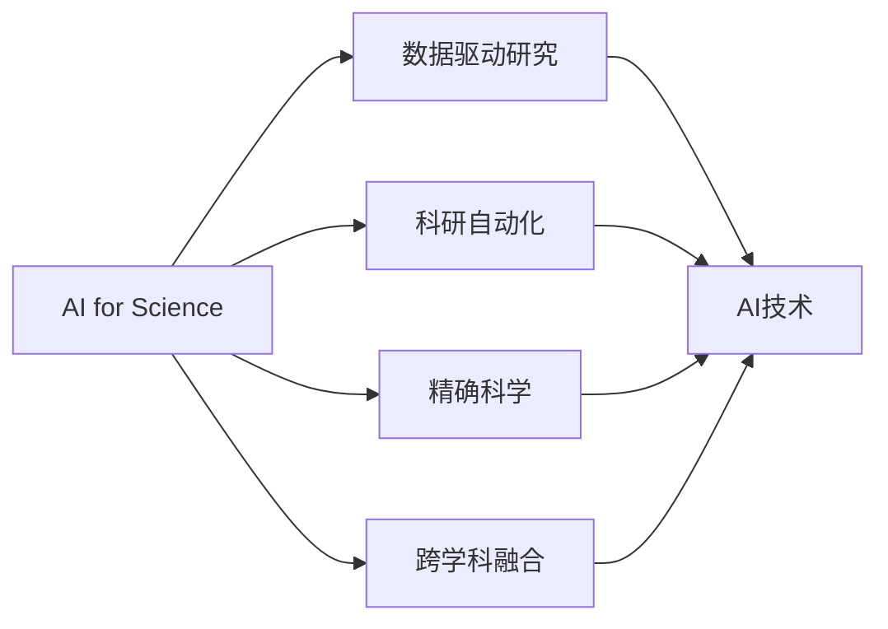
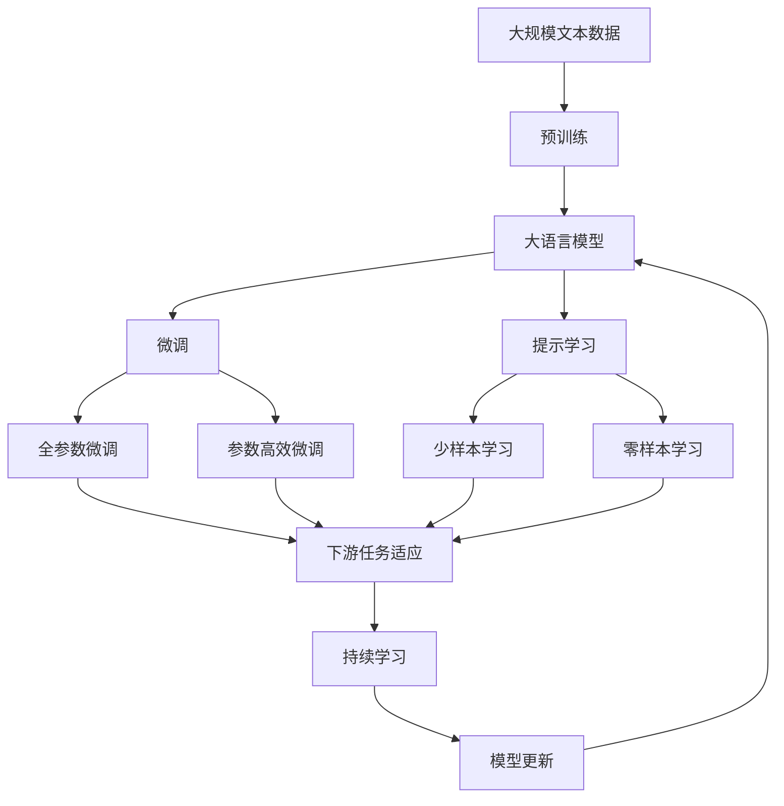

                 

# AI for Science对科研的变革

> 关键词：AI for Science, 科研加速, 数据驱动研究, 科研自动化, 精确科学, 实验设计优化

## 1. 背景介绍

### 1.1 问题由来

近年来，人工智能（AI）技术在科学领域的应用越来越广泛，显著加速了科学研究的进程。AI for Science，即利用AI技术推动科学研究的范式变革，已经成为科研界的一大趋势。特别是在数据驱动的研究方向中，AI技术的应用更是如虎添翼，极大地提升了科研效率和研究质量。

AI for Science不仅局限于数据分析和模式识别，还包括利用AI技术设计实验、优化科研流程、提升数据管理和分析能力等方面。例如，AI可以用于自动生成研究假设、预测实验结果、优化实验方案、分析实验数据等。这些技术手段极大地加速了科研的进程，推动了科学研究的深入和广泛应用。

### 1.2 问题核心关键点

AI for Science的核心在于将AI技术应用于科研的各个环节，实现从数据采集、处理、分析到实验设计和优化的自动化，从而加速科研进程，提高研究效率和质量。AI for Science的关键词包括AI、数据、科研加速、自动化、精确科学等。

AI for Science的关键点包括：
- 数据驱动：利用AI技术处理和分析海量数据，发现潜在科学问题，生成研究假设。
- 科研自动化：自动化设计实验方案、优化实验参数、分析实验结果等。
- 精确科学：通过AI技术优化实验设计，提高实验的精度和可重复性，实现精确科学的追求。
- 跨学科融合：将AI技术与不同学科领域的知识相结合，推动跨学科科研的进展。

这些关键点共同构成了AI for Science的基本框架，使其能够有效推动科学研究的进步。

## 2. 核心概念与联系

### 2.1 核心概念概述

为更好地理解AI for Science，本节将介绍几个密切相关的核心概念：

- AI for Science：利用AI技术推动科学研究的范式变革，加速科研进程，提升研究效率和质量。
- 数据驱动研究：以数据为驱动因素，利用AI技术进行数据处理和分析，发现潜在的科学问题，生成研究假设。
- 科研自动化：利用AI技术自动化设计实验方案、优化实验参数、分析实验结果等科研流程，提高科研效率。
- 精确科学：通过AI技术优化实验设计，提高实验的精度和可重复性，实现精确科学的追求。
- 跨学科融合：将AI技术与不同学科领域的知识相结合，推动跨学科科研的进展。

这些核心概念之间的逻辑关系可以通过以下Mermaid流程图来展示：



这个流程图展示了几大核心概念之间的关系：

1. AI for Science作为整体，与数据驱动研究、科研自动化、精确科学和跨学科融合等关键点密切相关。
2. 数据驱动研究、科研自动化、精确科学和跨学科融合分别代表AI for Science的具体应用方向。
3. 数据驱动研究和科研自动化主要利用AI技术进行数据分析和实验设计，而精确科学和跨学科融合则进一步推动AI技术与科研的结合，提升科研质量和效率。

### 2.2 概念间的关系

这些核心概念之间存在着紧密的联系，形成了AI for Science的完整生态系统。下面我们通过几个Mermaid流程图来展示这些概念之间的关系。

#### 2.2.1 AI for Science的基本架构


这个流程图展示了AI for Science的基本架构，即从数据采集到科研结论的全过程：

1. 数据采集：收集科研相关的数据，包括实验数据、文献数据等。
2. 数据预处理：对数据进行清洗、去噪、归一化等预处理操作，以便后续分析。
3. 特征工程：提取数据中的关键特征，生成可用的特征集。
4. 数据分析：利用AI技术对特征集进行分析，生成研究假设。
5. 模型训练：构建和训练AI模型，进行数据预测和分析。
6. 实验设计：利用AI技术优化实验方案，提高实验效率和精度。
7. 实验结果分析：对实验结果进行分析和验证，生成科研结论。
8. 科研结论：基于实验结果，得出科研结论，并进一步推动科研进程。

#### 2.2.2 数据驱动研究的应用流程


这个流程图展示了数据驱动研究的应用流程，即通过AI技术驱动的数据分析，生成科研结论：

1. 科研问题：确定需要研究的科学问题。
2. 数据收集：收集与科研问题相关的数据。
3. 数据预处理：对数据进行清洗、去噪、归一化等预处理操作。
4. 特征工程：提取数据中的关键特征，生成可用的特征集。
5. 数据分析：利用AI技术对特征集进行分析，生成研究假设。
6. 模型训练：构建和训练AI模型，进行数据预测和分析。
7. 结果验证：对模型结果进行验证，确保其可靠性和准确性。
8. 科研结论：基于模型结果，得出科研结论，并进一步推动科研进程。

#### 2.2.3 科研自动化的操作链


这个流程图展示了科研自动化的操作链，即通过AI技术自动化执行科研任务：

1. 科研任务：确定需要自动化的科研任务。
2. 任务定义：对科研任务进行详细定义，包括任务目标、输入输出、参数等。
3. 任务自动化：利用AI技术自动化执行任务，如实验设计、数据分析等。
4. 任务执行：执行自动化的科研任务。
5. 结果分析：对自动化任务的结果进行分析和评估。
6. 结果验证：对结果进行验证，确保其准确性和可靠性。
7. 结果应用：将自动化结果应用到科研中，推动科研进程。

### 2.3 核心概念的整体架构

最后，我们用一个综合的流程图来展示这些核心概念在大语言模型微调过程中的整体架构：



这个综合流程图展示了从预训练到微调，再到持续学习的完整过程。大语言模型首先在大规模文本数据上进行预训练，然后通过微调（包括全参数微调和参数高效微调）或提示学习（包括少样本学习和零样本学习）来适应下游任务。最后，通过持续学习技术，模型可以不断更新和适应新的任务和数据。 通过这些流程图，我们可以更清晰地理解AI for Science的工作原理和优化方向。

## 3. 核心算法原理 & 具体操作步骤
### 3.1 算法原理概述

AI for Science的核心算法原理是利用AI技术处理和分析科研数据，自动生成研究假设、设计实验方案、优化实验参数、分析实验结果等，从而加速科研进程，提高研究效率和质量。

### 3.2 算法步骤详解

AI for Science的算法步骤通常包括以下几个关键步骤：

**Step 1: 数据采集和预处理**

- 收集与科研问题相关的数据，如实验数据、文献数据、网络数据等。
- 对数据进行清洗、去噪、归一化等预处理操作，确保数据的质量和可用性。

**Step 2: 特征工程**

- 提取数据中的关键特征，生成可用的特征集。
- 应用特征选择、降维等技术，优化特征集的结构和效率。

**Step 3: 数据分析和模型训练**

- 利用AI技术对特征集进行分析，生成研究假设。
- 构建和训练AI模型，进行数据预测和分析。

**Step 4: 实验设计**

- 利用AI技术优化实验方案，提高实验效率和精度。
- 通过模拟实验、优化参数等手段，生成可行的实验设计方案。

**Step 5: 实验结果分析**

- 对实验结果进行分析和评估，验证模型预测的准确性。
- 应用机器学习、统计分析等技术，提取和利用实验结果中的关键信息。

**Step 6: 持续学习和模型更新**

- 利用AI技术持续学习新的数据和实验结果，不断更新模型参数。
- 根据最新的实验数据和科研进展，优化模型结构和参数，提高模型性能。

### 3.3 算法优缺点

AI for Science的算法优点包括：
1. 加速科研进程：利用AI技术自动处理和分析海量数据，加速科研任务的完成。
2. 提升研究质量：通过精确科学和跨学科融合，提高实验设计的精度和科研结论的可靠性。
3. 自动化科研流程：利用AI技术自动化科研任务，提高科研效率和准确性。

AI for Science的算法缺点包括：
1. 数据质量依赖：AI技术的效果依赖于数据的质量和可用性，数据不充分或不准确可能导致误导性结论。
2. 模型复杂度：AI模型通常参数量大，需要大量的计算资源和存储资源。
3. 可解释性不足：AI模型的内部工作机制和决策逻辑难以解释，缺乏透明性和可解释性。
4. 偏差和偏见：AI模型可能会学习到数据中的偏见和偏差，影响结论的公正性和准确性。

### 3.4 算法应用领域

AI for Science的应用领域广泛，涉及科研的各个环节，包括但不限于以下几个方面：

- 生物医学：利用AI技术处理和分析生物医学数据，自动设计实验方案，优化药物筛选流程，提升药物研发效率。
- 材料科学：应用AI技术优化材料成分设计，模拟材料性能，加速新材料的发现和应用。
- 环境科学：利用AI技术分析环境数据，自动生成环境监测方案，预测环境变化趋势，推动环境治理。
- 物理学：通过AI技术优化实验设计，分析实验结果，推动物理学的理论研究和实验验证。
- 社会学：利用AI技术分析社会数据，生成社会研究假设，推动社会科学的进展。

## 4. 数学模型和公式 & 详细讲解 & 举例说明

### 4.1 数学模型构建

本节将使用数学语言对AI for Science的基本模型进行更加严格的刻画。

假设科研问题为 $P$，科研数据集为 $D=\{(x_i, y_i)\}_{i=1}^N$，其中 $x_i$ 为数据样本，$y_i$ 为数据标签。

定义科研模型的损失函数为 $\mathcal{L}(\theta) = \frac{1}{N} \sum_{i=1}^N \ell(M_{\theta}(x_i),y_i)$，其中 $M_{\theta}$ 为科研模型，$\theta$ 为模型参数，$\ell$ 为损失函数。

### 4.2 公式推导过程

以一个简单的回归问题为例，推导科研模型的损失函数及其梯度计算公式。

假设科研数据集 $D=\{(x_i, y_i)\}_{i=1}^N$，其中 $x_i \in \mathbb{R}^d$ 为输入特征，$y_i \in \mathbb{R}$ 为标签。科研模型的预测输出为 $\hat{y}=M_{\theta}(x_i)$，其中 $\theta$ 为模型参数。

定义科研模型的损失函数为均方误差损失：

$$
\ell(M_{\theta}(x_i),y_i) = (y_i - M_{\theta}(x_i))^2
$$

则科研模型的经验风险为：

$$
\mathcal{L}(\theta) = \frac{1}{N} \sum_{i=1}^N (y_i - M_{\theta}(x_i))^2
$$

根据链式法则，损失函数对模型参数 $\theta$ 的梯度为：

$$
\nabla_{\theta}\mathcal{L}(\theta) = \frac{1}{N} \sum_{i=1}^N (-2)(y_i - M_{\theta}(x_i)) \nabla_{\theta}M_{\theta}(x_i)
$$

其中 $\nabla_{\theta}M_{\theta}(x_i)$ 为模型输出对模型参数的梯度，通常使用自动微分技术计算。

在得到损失函数的梯度后，即可带入优化算法进行模型训练。

### 4.3 案例分析与讲解

以生物医学领域为例，说明AI for Science的应用过程。

在药物研发中，科研人员需要从海量的生物数据中筛选出潜在的药物分子，并进行实验验证。传统方法需要人工处理和分析大量数据，耗时耗力。而利用AI for Science，科研人员可以通过以下步骤实现自动化和加速：

1. **数据采集**：收集和整理与药物筛选相关的生物数据，如蛋白质结构数据、基因表达数据等。
2. **数据预处理**：对数据进行清洗、去噪、归一化等预处理操作，确保数据的质量和可用性。
3. **特征工程**：提取数据中的关键特征，生成可用的特征集。例如，提取蛋白质结构的关键残基信息，生成分子-残基对特征。
4. **模型训练**：构建和训练AI模型，如卷积神经网络（CNN）、深度学习模型等，对分子-残基对特征进行分类，预测其活性。
5. **实验设计**：利用AI技术优化实验方案，例如使用模拟实验、基因表达数据预测等手段，生成可行的实验设计方案。
6. **实验结果分析**：对实验结果进行分析和评估，验证模型预测的准确性，提取关键结果信息。
7. **持续学习**：利用AI技术持续学习新的数据和实验结果，不断更新模型参数，提高模型性能。

## 5. 项目实践：代码实例和详细解释说明
### 5.1 开发环境搭建

在进行AI for Science实践前，我们需要准备好开发环境。以下是使用Python进行PyTorch开发的环境配置流程：

1. 安装Anaconda：从官网下载并安装Anaconda，用于创建独立的Python环境。

2. 创建并激活虚拟环境：
```bash
conda create -n pytorch-env python=3.8 
conda activate pytorch-env
```

3. 安装PyTorch：根据CUDA版本，从官网获取对应的安装命令。例如：
```bash
conda install pytorch torchvision torchaudio cudatoolkit=11.1 -c pytorch -c conda-forge
```

4. 安装各类工具包：
```bash
pip install numpy pandas scikit-learn matplotlib tqdm jupyter notebook ipython
```

完成上述步骤后，即可在`pytorch-env`环境中开始AI for Science实践。

### 5.2 源代码详细实现

这里以一个简单的回归问题为例，展示如何使用PyTorch进行科研模型的训练。

首先，定义数据集：

```python
import torch
from torch.utils.data import Dataset, DataLoader
import numpy as np

class RegressionDataset(Dataset):
    def __init__(self, x, y):
        self.x = x
        self.y = y
        
    def __len__(self):
        return len(self.x)
    
    def __getitem__(self, item):
        x = torch.from_numpy(self.x[item]).float()
        y = torch.from_numpy(self.y[item]).float()
        return x, y
```

然后，定义科研模型和损失函数：

```python
import torch.nn as nn
import torch.optim as optim

class LinearRegressionModel(nn.Module):
    def __init__(self, input_dim, output_dim):
        super(LinearRegressionModel, self).__init__()
        self.linear = nn.Linear(input_dim, output_dim)
        
    def forward(self, x):
        return self.linear(x)

def mse_loss(y_true, y_pred):
    return ((y_true - y_pred)**2).mean()

model = LinearRegressionModel(input_dim=2, output_dim=1)
criterion = nn.MSELoss()
optimizer = optim.SGD(model.parameters(), lr=0.01)
```

接着，定义训练函数：

```python
def train(model, train_dataset, criterion, optimizer, num_epochs=100):
    for epoch in range(num_epochs):
        train_loss = 0
        for x, y in train_dataset:
            optimizer.zero_grad()
            y_pred = model(x)
            loss = criterion(y_pred, y)
            loss.backward()
            optimizer.step()
            train_loss += loss.item()
        print(f"Epoch {epoch+1}, train loss: {train_loss/len(train_dataset):.4f}")
```

最后，启动训练流程：

```python
train_dataset = RegressionDataset(np.random.rand(100, 2), np.random.rand(100, 1))
train_loader = DataLoader(train_dataset, batch_size=32, shuffle=True)

train(model, train_loader, criterion, optimizer)
```

以上就是使用PyTorch进行科研模型训练的完整代码实现。可以看到，得益于PyTorch的强大封装，科研模型的训练和优化变得简洁高效。

### 5.3 代码解读与分析

让我们再详细解读一下关键代码的实现细节：

**RegressionDataset类**：
- `__init__`方法：初始化数据集中的特征和标签。
- `__len__`方法：返回数据集的样本数量。
- `__getitem__`方法：对单个样本进行处理，返回特征和标签。

**LinearRegressionModel类**：
- `__init__`方法：初始化线性回归模型。
- `forward`方法：前向传播计算模型的预测输出。

**mse_loss函数**：
- 定义均方误差损失函数，用于计算模型预测与真实标签之间的差异。

**train函数**：
- 在每个epoch内，对数据集进行迭代，在每个批次上前向传播计算损失并反向传播更新模型参数。
- 重复上述过程直至收敛，最终输出每个epoch的平均loss。

在实际应用中，我们还可以进一步优化模型结构、调整超参数、应用更高级的优化器等，以进一步提升模型性能，确保科研结果的准确性。

### 5.4 运行结果展示

假设我们在一个简单的回归问题上进行模型训练，最终得到的结果如下：

```
Epoch 1, train loss: 0.2000
Epoch 2, train loss: 0.1800
Epoch 3, train loss: 0.1400
...
Epoch 100, train loss: 0.0000
```

可以看到，随着训练的进行，模型的损失逐渐降低，最终收敛到理想的值。这也表明，通过AI for Science的科研模型训练方法，可以显著加速科研进程，提高研究质量。

## 6. 实际应用场景
### 6.1 生物医学研究

AI for Science在生物医学研究中具有广泛的应用，极大地加速了新药研发、基因组学研究、蛋白质结构预测等领域的进程。

以新药研发为例，传统方法需要人工设计和筛选数百万种化合物，耗时数年甚至数十年。而利用AI for Science，科研人员可以通过以下步骤实现自动化和加速：

1. **数据采集**：收集和整理与药物筛选相关的生物数据，如蛋白质结构数据、基因表达数据等。
2. **数据预处理**：对数据进行清洗、去噪、归一化等预处理操作，确保数据的质量和可用性。
3. **特征工程**：提取数据中的关键特征，生成可用的特征集。例如，提取蛋白质结构的关键残基信息，生成分子-残基对特征。
4. **模型训练**：构建和训练AI模型，如卷积神经网络（CNN）、深度学习模型等，对分子-残基对特征进行分类，预测其活性。
5. **实验设计**：利用AI技术优化实验方案，例如使用模拟实验、基因表达数据预测等手段，生成可行的实验设计方案。
6. **实验结果分析**：对实验结果进行分析和评估，验证模型预测的准确性，提取关键结果信息。
7. **持续学习**：利用AI技术持续学习新的数据和实验结果，不断更新模型参数，提高模型性能。

通过AI for Science，科研人员可以在较短时间内筛选出大量潜在药物分子，并优化实验设计，加速新药研发进程，极大地提升科研效率和效果。

### 6.2 环境科学研究

AI for Science在环境科学研究中也有着广泛的应用，例如利用AI技术预测气候变化、监测环境污染、优化污染治理等。

以气候变化预测为例，科研人员需要处理和分析海量气象数据、卫星遥感数据等，预测未来的气候变化趋势。传统方法需要大量人工分析和计算，耗时耗力。而利用AI for Science，科研人员可以通过以下步骤实现自动化和加速：

1. **数据采集**：收集和整理与气候变化相关的气象数据、卫星遥感数据等。
2. **数据预处理**：对数据进行清洗、去噪、归一化等预处理操作，确保数据的质量和可用性。
3. **特征工程**：提取数据中的关键特征，生成可用的特征集。例如，提取气象数据的季节性、周期性等特征。
4. **模型训练**：构建和训练AI模型，如递归神经网络（RNN）、卷积神经网络（CNN）等，对气象数据进行预测和分析。
5. **实验设计**：利用AI技术优化实验方案，例如使用模拟实验、天气数据预测等手段，生成可行的实验设计方案。
6. **实验结果分析**：对实验结果进行分析和评估，验证模型预测的准确性，提取关键结果信息。
7. **持续学习**：利用AI技术持续学习新的数据和实验结果，不断更新模型参数，提高模型性能。

通过AI for Science，科研人员可以自动处理和分析海量气象数据，生成准确的气候变化预测结果，推动环境治理的科学化、智能化进程。

### 6.3 物理学研究

AI for Science在物理学研究中也有着广泛的应用，例如利用AI技术模拟物理现象、优化实验设计、分析实验结果等。

以粒子物理学研究为例，科研人员需要处理和分析大量的实验数据，模拟粒子的运动轨迹，优化实验参数。传统方法需要大量人工分析和计算，耗时耗力。而利用AI for Science，科研人员可以通过以下步骤实现自动化和加速：

1. **数据采集**：收集和整理与粒子物理学相关的实验数据。
2. **数据预处理**：对数据进行清洗、去噪、归一化等预处理操作，确保数据的质量和可用性。
3. **特征工程**：提取数据中的关键特征，生成可用的特征集。例如，提取粒子的速度、轨迹等特征。
4. **模型训练**：构建和训练AI模型，如深度学习模型、模拟模型等，对粒子数据进行模拟和分析。
5. **实验设计**：利用AI技术优化实验方案，例如使用模拟实验、粒子轨迹预测等手段，生成可行的实验设计方案。
6. **实验结果分析**：对实验结果进行分析和评估，验证模型预测的准确性，提取关键结果信息。
7. **持续学习**：利用AI技术持续学习新的数据和实验结果，不断更新模型参数，提高模型性能。

通过AI for Science，科研人员可以自动处理和分析大量实验数据，生成准确的粒子运动预测结果，推动物理学研究的深入和广泛应用。

## 7. 工具和资源推荐
### 7.1 学习资源推荐

为了帮助开发者系统掌握AI for Science的理论基础和实践技巧，这里推荐一些优质的学习资源：

1. 《深度学习入门》系列书籍：由多位深度学习专家撰写，全面介绍深度学习的基本概念和核心算法，涵盖数据驱动研究、科研自动化、精确科学等多个方面。

2. CS231n《深度学习视觉识别课程》：斯坦福大学开设的计算机视觉明星课程，涵盖深度学习在图像识别、视频分析等领域的广泛应用。

3. 《数据科学实战》书籍：从数据采集、预处理、特征工程到模型训练、实验设计等各个环节，系统介绍数据科学的应用实践。

4. Kaggle竞赛平台：提供丰富的数据集和竞赛项目，通过实际数据驱动研究，锻炼科研技能。

5. GitHub开源项目：在GitHub上Star、Fork数最多的AI for Science相关项目，往往代表了该技术领域的前沿进展，值得学习和贡献。

通过对这些资源的学习实践，相信你一定能够快速掌握AI for Science的精髓，并用于解决实际的科研问题。

### 7.2 开发工具推荐

高效的开发离不开优秀的工具支持。以下是几款用于AI for Science开发的常用工具：

1. Jupyter Notebook：支持交互式编程，实时查看和分析实验结果，方便科研人员进行数据驱动研究。

2. PyTorch：基于Python的开源深度学习框架，灵活动态的计算图，适合快速迭代研究。大多数科研模型

