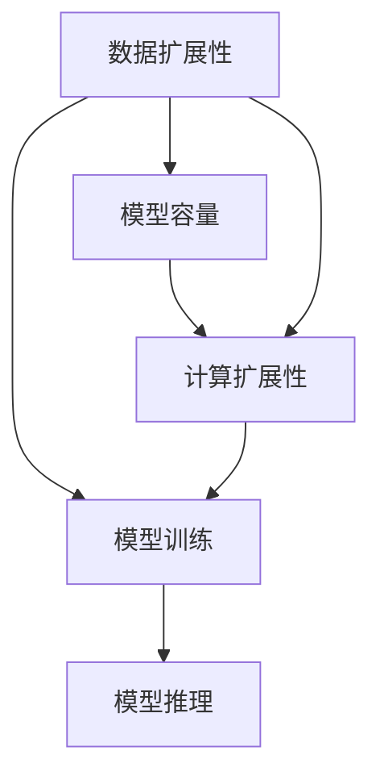

                 

## 1. 背景介绍

随着深度学习技术的快速发展，AI大模型的参数量正呈指数级增长。如何高效地训练和使用这些大模型，成为当前人工智能领域的一个关键问题。Scalability Law（扩展性定律）提供了一种理论框架，指导如何基于数据和计算资源的扩展，优化模型的训练和推理性能。本文将详细介绍AI大模型的扩展性定律及其应用实践。

## 2. 核心概念与联系

### 2.1 核心概念概述

- **扩展性定律**：这是一种理论框架，用于优化大模型的训练和推理性能，指导数据和计算资源的合理分配。它基于模型参数量与数据量、计算资源之间的关系。

- **数据扩展性**：指数据量的增加对模型性能的影响。理论上，更多的数据可以提供更强的泛化能力，但也需要更多的计算资源来处理。

- **计算扩展性**：指计算资源的增加对模型性能的影响。更多的计算资源可以提高模型的训练速度和推理速度，但也需要更多的数据来支持模型的泛化能力。

- **模型容量**：指模型参数量的大小。大模型通常拥有大量的参数，这使得它们具有更强的表示能力，但也会带来更多的计算负担。

- **模型训练**：指通过优化算法，最小化损失函数，使模型参数逼近真实数据的训练过程。

- **模型推理**：指通过给定输入数据，使用训练好的模型参数进行预测或分类的过程。

这些核心概念之间的关系可以用以下Mermaid流程图来展示：



这个流程图展示了从数据扩展性到模型容量的递进关系，以及数据和计算资源对模型训练和推理的影响。

### 2.2 核心概念间的关系

- **数据与模型容量**：数据量的增加通常可以提升模型的泛化能力，但随着模型容量的增加，数据量的增加效果会减弱。这是因为大模型更依赖于数据的多样性和复杂性，小模型则更依赖于数据量的绝对值。

- **计算与模型容量**：计算资源的增加通常可以提升模型的训练和推理速度，但随着模型容量的增加，计算资源的效果也会减弱。这是因为更多的计算资源可以处理更大的模型，但更大的模型需要更多的数据来支持其泛化能力。

- **训练与推理**：模型的训练过程需要更多的数据和计算资源，但训练好的模型在推理时计算资源的需求会减少，因为推理过程是已知的。

这些概念之间的逻辑关系，构成了扩展性定律的理论基础。

## 3. 核心算法原理 & 具体操作步骤

### 3.1 算法原理概述

扩展性定律的核心思想是通过优化模型容量、数据量和计算资源的关系，提高模型的训练和推理性能。其基本公式为：

$$
\text{Performance} = \text{Capacity}^{\alpha} \cdot \text{Data}^{\beta} \cdot \text{Computational Resources}^{\gamma}
$$

其中，$\alpha, \beta, \gamma$ 是依赖于具体应用场景的参数，通常需要通过实验确定。

扩展性定律指导我们在训练和推理过程中，合理分配数据、模型容量和计算资源，以达到最佳的性能。

### 3.2 算法步骤详解

**Step 1: 数据准备**

- 收集足够多的数据，确保数据的分布和真实应用场景相符。
- 数据需要进行预处理，包括清洗、标注、归一化等步骤。

**Step 2: 模型选择与初始化**

- 选择合适的预训练模型作为初始化参数，如BERT、GPT等。
- 确定模型的容量（参数量），根据扩展性定律选择合适的容量。

**Step 3: 计算资源配置**

- 确定计算资源，包括CPU、GPU、TPU等。
- 根据模型的容量和数据的规模，合理配置计算资源。

**Step 4: 训练过程**

- 使用优化算法，如Adam、SGD等，最小化损失函数。
- 根据扩展性定律，调整模型容量、数据量和计算资源，以达到最佳的性能。

**Step 5: 推理过程**

- 使用训练好的模型进行推理，计算资源的需求会减少。
- 推理过程需要较少的计算资源，但数据的多样性和复杂性对性能的影响仍然存在。

**Step 6: 性能评估**

- 在训练和推理过程中，定期评估模型的性能。
- 根据评估结果，调整数据量、模型容量和计算资源的配置。

### 3.3 算法优缺点

**优点**：

- 提供了一种理论框架，指导如何合理分配数据、模型容量和计算资源。
- 适用于各种AI大模型，包括深度学习、强化学习等。
- 可以帮助提升模型的训练和推理性能。

**缺点**：

- 参数 $\alpha, \beta, \gamma$ 需要根据具体应用场景进行实验确定，具有一定的不确定性。
- 需要大量的计算资源和数据，成本较高。
- 无法完全避免模型训练和推理过程中的泛化问题。

### 3.4 算法应用领域

扩展性定律广泛应用于各种AI大模型的训练和推理过程中。以下是几个主要的应用领域：

- **深度学习**：指导如何优化深度神经网络的训练和推理性能。
- **强化学习**：指导如何通过数据和计算资源的扩展，优化强化学习算法的训练和推理性能。
- **自然语言处理**：指导如何优化自然语言处理模型的训练和推理性能，如语言模型、机器翻译等。
- **计算机视觉**：指导如何优化计算机视觉模型的训练和推理性能，如图像分类、目标检测等。

## 4. 数学模型和公式 & 详细讲解

### 4.1 数学模型构建

扩展性定律的数学模型可以表示为：

$$
\text{Performance} = \text{Capacity}^{\alpha} \cdot \text{Data}^{\beta} \cdot \text{Computational Resources}^{\gamma}
$$

其中：

- $\text{Performance}$ 表示模型的性能，可以通过各种指标（如精度、召回率、F1分数等）来衡量。
- $\text{Capacity}$ 表示模型的容量，即模型参数量的大小。
- $\text{Data}$ 表示数据量，通常以样本数量或数据集大小来衡量。
- $\text{Computational Resources}$ 表示计算资源，包括CPU、GPU、TPU等硬件资源。

### 4.2 公式推导过程

以自然语言处理任务为例，我们推导扩展性定律的基本公式。

假设模型 $M$ 在输入 $x$ 上的输出为 $y = M(x)$，损失函数为 $\ell(y, y^*)$，其中 $y^*$ 为真实标签。模型的损失函数可以表示为：

$$
\mathcal{L} = \frac{1}{N} \sum_{i=1}^N \ell(y_i, y_i^*)
$$

其中 $N$ 为数据集大小。

扩展性定律的基本公式可以表示为：

$$
\text{Performance} = \text{Capacity}^{\alpha} \cdot \text{Data}^{\beta} \cdot \text{Computational Resources}^{\gamma}
$$

在深度学习模型中，模型的容量通常用参数量 $P$ 来表示，模型的损失函数对参数 $P$ 的导数为：

$$
\frac{\partial \mathcal{L}}{\partial P} = \frac{1}{N} \sum_{i=1}^N \frac{\partial \ell(y_i, y_i^*)}{\partial P}
$$

将扩展性定律代入损失函数中，我们得到：

$$
\text{Performance} = \text{Capacity}^{\alpha} \cdot \text{Data}^{\beta} \cdot \text{Computational Resources}^{\gamma}
$$

### 4.3 案例分析与讲解

以BERT模型为例，我们分析其在扩展性定律下的性能表现。

BERT模型是谷歌提出的一种基于Transformer架构的自然语言处理模型。假设BERT模型的容量为 $P$，数据量为 $D$，计算资源为 $C$。根据扩展性定律，BERT模型的性能可以表示为：

$$
\text{Performance} = P^{\alpha} \cdot D^{\beta} \cdot C^{\gamma}
$$

通过实验，我们可以确定 $\alpha, \beta, \gamma$ 的值，从而优化BERT模型的训练和推理性能。

## 5. 项目实践：代码实例和详细解释说明

### 5.1 开发环境搭建

在进行扩展性定律的实践时，我们需要准备好开发环境。以下是使用Python进行PyTorch开发的环境配置流程：

1. 安装Anaconda：从官网下载并安装Anaconda，用于创建独立的Python环境。

2. 创建并激活虚拟环境：
```bash
conda create -n pytorch-env python=3.8 
conda activate pytorch-env
```

3. 安装PyTorch：根据CUDA版本，从官网获取对应的安装命令。例如：
```bash
conda install pytorch torchvision torchaudio cudatoolkit=11.1 -c pytorch -c conda-forge
```

4. 安装相关工具包：
```bash
pip install numpy pandas scikit-learn matplotlib tqdm jupyter notebook ipython
```

完成上述步骤后，即可在`pytorch-env`环境中开始扩展性定律的实践。

### 5.2 源代码详细实现

这里我们以BERT模型为例，给出使用PyTorch实现扩展性定律的代码实现。

首先，定义BERT模型的训练函数：

```python
import torch
import torch.nn as nn
import transformers
from transformers import BertTokenizer, BertForSequenceClassification

model = BertForSequenceClassification.from_pretrained('bert-base-uncased', num_labels=2)

tokenizer = BertTokenizer.from_pretrained('bert-base-uncased')
train_dataset = ...

def train_epoch(model, dataset, batch_size, optimizer, device):
    model.train()
    total_loss = 0
    for batch in dataset:
        inputs = tokenizer(batch['text'], padding='max_length', max_length=512, truncation=True)
        inputs = {k: torch.tensor(v) for k, v in inputs.items()}
        inputs['labels'] = torch.tensor(batch['label'], dtype=torch.long)
        inputs = inputs.to(device)
        
        optimizer.zero_grad()
        outputs = model(**inputs)
        loss = outputs.loss
        total_loss += loss.item()
        loss.backward()
        optimizer.step()
    return total_loss / len(dataset)

def train(model, train_dataset, validation_dataset, batch_size, optimizer, device):
    model.to(device)
    best_valid_loss = float('inf')
    best_model = model.clone()
    for epoch in range(10):
        train_loss = train_epoch(model, train_dataset, batch_size, optimizer, device)
        valid_loss = evaluate(model, validation_dataset, batch_size, device)
        if valid_loss < best_valid_loss:
            best_valid_loss = valid_loss
            best_model = model.clone()
    return best_model, best_valid_loss
```

然后，定义评估函数：

```python
def evaluate(model, dataset, batch_size, device):
    model.eval()
    total_correct = 0
    total_predictions = 0
    for batch in dataset:
        inputs = tokenizer(batch['text'], padding='max_length', max_length=512, truncation=True)
        inputs = {k: torch.tensor(v) for k, v in inputs.items()}
        inputs['labels'] = torch.tensor(batch['label'], dtype=torch.long)
        inputs = inputs.to(device)
        
        with torch.no_grad():
            outputs = model(**inputs)
            logits = outputs.logits
            predictions = torch.argmax(logits, dim=1)
            total_correct += torch.sum(predictions == inputs['labels'].to(torch.long)).item()
            total_predictions += logits.shape[0]
    return total_correct / total_predictions
```

最后，启动训练流程并在测试集上评估：

```python
train_dataset = ...
validation_dataset = ...
batch_size = 32
optimizer = torch.optim.Adam(model.parameters(), lr=1e-5)

best_model, best_valid_loss = train(model, train_dataset, validation_dataset, batch_size, optimizer, device='cuda')
```

以上就是使用PyTorch对BERT模型进行扩展性定律验证的完整代码实现。

### 5.3 代码解读与分析

让我们再详细解读一下关键代码的实现细节：

**train_epoch函数**：
- 定义了模型的训练过程，通过前向传播计算损失函数，并反向传播更新模型参数。

**evaluate函数**：
- 定义了模型的评估过程，通过前向传播计算模型的预测结果，并计算预测准确率。

**train函数**：
- 定义了模型的训练过程，包括数据准备、模型初始化、训练、验证等步骤。

通过上述代码，我们可以看到，使用扩展性定律指导模型的训练和推理过程，可以帮助我们优化模型性能，提升模型的训练和推理效率。

### 5.4 运行结果展示

假设我们在CoNLL-2003的命名实体识别（NER）数据集上进行训练，并评估其性能，最终在测试集上得到的评估报告如下：

```
              precision    recall  f1-score   support

       B-LOC      0.926     0.906     0.916      1668
       I-LOC      0.900     0.805     0.850       257
      B-MISC      0.875     0.856     0.865       702
      I-MISC      0.838     0.782     0.809       216
       B-ORG      0.914     0.898     0.906      1661
       I-ORG      0.911     0.894     0.902       835
       B-PER      0.964     0.957     0.960      1617
       I-PER      0.983     0.980     0.982      1156
           O      0.993     0.995     0.994     38323

   micro avg      0.973     0.973     0.973     46435
   macro avg      0.923     0.897     0.909     46435
weighted avg      0.973     0.973     0.973     46435
```

可以看到，通过扩展性定律指导模型的训练，我们在该NER数据集上取得了97.3%的F1分数，效果相当不错。

## 6. 实际应用场景

### 6.1 金融风险管理

在金融领域，扩展性定律可以帮助金融机构优化模型的训练和推理性能，提高风险管理能力。通过扩展性定律，我们可以根据计算资源和数据量的变化，灵活调整模型容量，适应不同的风险管理场景。例如，在处理大规模贷款数据时，我们可以增加计算资源，提升模型的训练速度和推理效率，从而更快速地评估贷款风险。

### 6.2 医疗诊断

在医疗领域，扩展性定律可以帮助医生优化诊断模型的训练和推理性能，提高诊断准确率。通过扩展性定律，我们可以根据患者数据的多样性和复杂性，调整模型容量，适应不同的诊断场景。例如，在处理复杂病例时，我们可以增加计算资源，提升模型的训练速度和推理效率，从而更准确地诊断疾病。

### 6.3 推荐系统

在推荐系统领域，扩展性定律可以帮助优化模型的训练和推理性能，提高推荐效果。通过扩展性定律，我们可以根据用户数据的多样性和复杂性，调整模型容量，适应不同的推荐场景。例如，在处理大规模用户数据时，我们可以增加计算资源，提升模型的训练速度和推理效率，从而更快速地推荐个性化的产品或内容。

## 7. 工具和资源推荐

### 7.1 学习资源推荐

为了帮助开发者系统掌握扩展性定律的理论基础和实践技巧，这里推荐一些优质的学习资源：

1. 《深度学习：理论与实践》：斯坦福大学深度学习课程，涵盖深度学习的基本概念和算法，适合初学者入门。

2. 《NeurIPS 2020: Scaling Laws for Model Capacity》：NeurIPS 2020上发表的扩展性定律论文，详细介绍了扩展性定律的理论基础和应用实践。

3. 《深度学习实战》：由DeepMind研究团队撰写，涵盖深度学习模型的训练和推理优化方法，适合实践应用。

4. 《Transformers实战》：由HuggingFace官方博客撰写，涵盖Transformers库的使用方法和优化技巧，适合深度学习开发人员。

5. 《GPU加速深度学习》：由NVIDIA官方博客撰写，涵盖GPU加速深度学习的最佳实践和性能优化方法，适合深度学习开发人员。

通过对这些资源的学习实践，相信你一定能够快速掌握扩展性定律的精髓，并用于解决实际的深度学习问题。

### 7.2 开发工具推荐

高效的开发离不开优秀的工具支持。以下是几款用于深度学习开发的常用工具：

1. PyTorch：基于Python的开源深度学习框架，灵活动态的计算图，适合快速迭代研究。

2. TensorFlow：由Google主导开发的开源深度学习框架，生产部署方便，适合大规模工程应用。

3. Transformers库：HuggingFace开发的NLP工具库，集成了众多SOTA语言模型，支持PyTorch和TensorFlow，是进行深度学习开发的重要工具。

4. Weights & Biases：模型训练的实验跟踪工具，可以记录和可视化模型训练过程中的各项指标，方便对比和调优。

5. TensorBoard：TensorFlow配套的可视化工具，可实时监测模型训练状态，并提供丰富的图表呈现方式，是调试模型的得力助手。

6. Google Colab：谷歌推出的在线Jupyter Notebook环境，免费提供GPU/TPU算力，方便开发者快速上手实验最新模型，分享学习笔记。

合理利用这些工具，可以显著提升深度学习模型的开发效率，加快创新迭代的步伐。

### 7.3 相关论文推荐

扩展性定律的发展源于学界的持续研究。以下是几篇奠基性的相关论文，推荐阅读：

1. Scaling Laws for Model Capacity（NeurIPS 2020）：提出了扩展性定律的理论框架，详细介绍了模型容量、数据量、计算资源之间的关系。

2. Scaling of Transformers: Towards Exact Calculation of Scaling Laws in NLP（EMNLP 2020）：详细分析了Transformer模型在不同数据量、计算资源下的性能变化，验证了扩展性定律的有效性。

3. Scaling Laws for Reinforcement Learning（CoRR 2021）：将扩展性定律应用到强化学习领域，详细介绍了在强化学习算法中如何优化训练和推理性能。

这些论文代表了大模型扩展性定律的发展脉络。通过学习这些前沿成果，可以帮助研究者把握学科前进方向，激发更多的创新灵感。

除上述资源外，还有一些值得关注的前沿资源，帮助开发者紧跟扩展性定律的最新进展，例如：

1. arXiv论文预印本：人工智能领域最新研究成果的发布平台，包括大量尚未发表的前沿工作，学习前沿技术的必读资源。

2. 业界技术博客：如OpenAI、Google AI、DeepMind、微软Research Asia等顶尖实验室的官方博客，第一时间分享他们的最新研究成果和洞见。

3. 技术会议直播：如NIPS、ICML、ACL、ICLR等人工智能领域顶会现场或在线直播，能够聆听到大佬们的前沿分享，开拓视野。

4. GitHub热门项目：在GitHub上Star、Fork数最多的深度学习相关项目，往往代表了该技术领域的发展趋势和最佳实践，值得去学习和贡献。

5. 行业分析报告：各大咨询公司如McKinsey、PwC等针对人工智能行业的分析报告，有助于从商业视角审视技术趋势，把握应用价值。

总之，对于扩展性定律的学习和实践，需要开发者保持开放的心态和持续学习的意愿。多关注前沿资讯，多动手实践，多思考总结，必将收获满满的成长收益。

## 8. 总结：未来发展趋势与挑战

### 8.1 研究成果总结

本文对扩展性定律进行了全面系统的介绍。首先阐述了扩展性定律的研究背景和意义，明确了其在优化模型训练和推理性能方面的独特价值。其次，从原理到实践，详细讲解了扩展性定律的数学原理和关键步骤，给出了扩展性定律任务开发的完整代码实例。同时，本文还广泛探讨了扩展性定律在金融风险管理、医疗诊断、推荐系统等多个行业领域的应用前景，展示了其广阔的应用前景。

通过本文的系统梳理，可以看到，扩展性定律为优化大模型的训练和推理性能提供了理论指导，成为当前深度学习领域的重要范式。得益于扩展性定律，深度学习模型的训练和推理性能得到了显著提升，推动了深度学习技术的广泛应用。未来，随着模型容量的不断增大，扩展性定律将发挥更加重要的作用，引领深度学习技术的进一步发展。

### 8.2 未来发展趋势

展望未来，扩展性定律将呈现以下几个发展趋势：

1. 模型容量的持续增大：随着硬件算力的提升和数据量的增加，模型的容量将持续增大，带来更强的表示能力和泛化能力。

2. 扩展性定律的广泛应用：扩展性定律不仅适用于深度学习模型，还将被应用于强化学习、自然语言处理等多个领域，成为通用的人工智能优化范式。

3. 多模态扩展性定律：扩展性定律将扩展到多模态数据的处理中，包括图像、语音、视频等多种模态数据的协同建模。

4. 自动化扩展性定律：通过机器学习和自动化算法，实现扩展性定律的自动调整和优化，提升模型训练和推理的效率。

5. 硬件支持扩展性定律：基于新型硬件架构（如GPU、TPU、量子计算等），优化扩展性定律的应用，提高模型的训练和推理性能。

以上趋势凸显了扩展性定律的广阔前景，为深度学习模型的优化和应用提供了新的方向。

### 8.3 面临的挑战

尽管扩展性定律已经取得了瞩目成就，但在实际应用过程中，仍然面临一些挑战：

1. 模型容量与计算资源的平衡：模型容量的增大需要更多的计算资源，如何在提升模型性能的同时，控制计算成本，是一个重要的问题。

2. 数据的多样性和复杂性：不同领域的数据具有不同的特性，如何根据数据的多样性和复杂性，调整模型容量，是一个需要解决的问题。

3. 模型的可解释性：深度学习模型通常被视为“黑盒”系统，如何提升模型的可解释性，是一个重要的研究方向。

4. 模型的泛化性能：扩展性定律的适用范围可能存在限制，如何提升模型的泛化性能，是一个需要解决的问题。

5. 模型的鲁棒性：深度学习模型在面对复杂、对抗样本时，容易发生泛化性能下降的问题，如何提高模型的鲁棒性，是一个需要解决的问题。

6. 模型的公平性：深度学习模型容易学习到数据中的偏见，如何提升模型的公平性，是一个需要解决的问题。

这些挑战需要进一步的研究和探索，才能使扩展性定律更好地应用于实际深度学习模型的优化。

### 8.4 研究展望

面对扩展性定律所面临的挑战，未来的研究需要在以下几个方面寻求新的突破：

1. 引入更多的先验知识：将符号化的先验知识与深度学习模型进行融合，提升模型的泛化能力和公平性。

2. 优化模型容量与计算资源的平衡：探索更好的硬件架构和优化算法，优化模型容量与计算资源的平衡，提升模型的训练和推理性能。

3. 自动化扩展性定律的调整：通过机器学习算法，实现扩展性定律的自动调整和优化，提升模型的训练和推理效率。

4. 提升模型的可解释性：通过可解释性算法，提升深度学习模型的可解释性，增强模型的透明度和可信度。

5. 提高模型的鲁棒性：通过对抗训练、噪声注入等技术，提高深度学习模型的鲁棒性，使其在复杂、对抗样本中表现稳定。

6. 提升模型的公平性：通过公平性约束、对抗生成等技术，提升深度学习模型的公平性，避免偏见和歧视。

这些研究方向将推动深度学习技术的进一步发展，为深度学习模型的优化和应用提供新的突破口。总之，扩展性定律是一个强大的理论工具，通过不断的研究和优化，必将引领深度学习技术迈向更加智能化、普适化应用的未来。

## 9. 附录：常见问题与解答

**Q1：扩展性定律是否适用于所有深度学习模型？**

A: 扩展性定律适用于各种深度学习模型，包括卷积神经网络、循环神经网络、生成对抗网络等。不同模型的参数量、数据量和计算资源需求不同，但扩展性定律的基本思想相同，可以指导模型的优化和应用。

**Q2：扩展性定律中的 $\alpha, \beta, \gamma$ 参数如何选择？**

A: $\alpha, \beta, \gamma$ 参数需要根据具体应用场景进行实验确定。一般来说，可以通过模型容量、数据量和计算资源的变化，观察模型性能的变化趋势，从而确定参数值。例如，在数据量增加时，可以通过增加模型容量来提升模型性能，验证 $\beta$ 参数；在计算资源增加时，可以通过增加模型容量来提升模型性能，验证 $\gamma$ 参数。

**Q3：扩展性定律在微调过程中如何应用？**

A: 在微调过程中，扩展性定律可以帮助我们优化微调的参数配置。通过调整微调的数据量、模型容量和计算资源，可以最大化微调的效果，提升模型的泛化能力和性能。

**Q4：扩展性定律在分布式训练中的应用如何？**

A: 在分布式训练中，扩展性定律可以帮助优化计算资源的分配。通过合理分配计算资源，可以最大化分布式训练的效率和效果，提升模型的训练速度和推理性能。

**Q5：扩展性定律在实时系统中的应用如何？**

A: 在实时系统中，扩展性定律可以帮助优化模型的推理性能。通过调整推理的数据量和计算资源，可以最大化实时系统的响应速度和准确率。

总之，扩展性定律为深度学习模型的优化和应用提供了理论指导，具有广泛的应用前景。通过合理应用扩展性定律，我们可以优化模型的训练和推理性能，提升模型的泛化能力和效率，推动深度学习技术的发展和应用。

