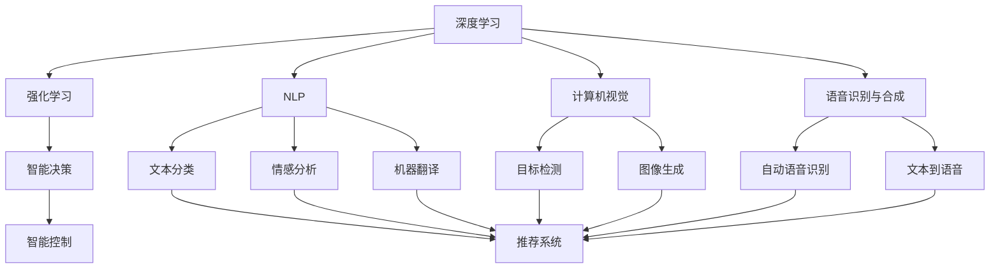

                 

# AI在各领域中的实际应用

## 1. 背景介绍

### 1.1 问题由来
人工智能(AI)技术正迅速渗透到各个行业，改变着传统的工作方式和商业模式。从医疗健康、金融保险到制造业、零售业，AI的应用场景和影响范围日益广泛。为了全面理解AI技术在各领域的实际应用，本文将系统介绍AI在医疗、金融、智能制造、零售、教育等关键行业的最新进展，探讨其在实际场景中的具体实现和挑战。

### 1.2 问题核心关键点
AI技术在各领域的应用，主要依赖于以下几个关键点：

- **数据质量与规模**：高质量、大规模的数据集是训练AI模型的基础，数据的质量直接影响到模型的性能。
- **算法与模型选择**：不同行业需要选择适合的算法和模型，如深度学习、强化学习、传统机器学习等，以满足不同应用场景的需求。
- **计算资源**：强大的计算能力是训练和部署AI模型不可或缺的，特别是对于深度学习和分布式训练任务。
- **技术融合**：AI技术与传统技术的深度融合，能够有效提升业务流程的自动化和智能化水平。
- **应用场景适配**：AI技术的应用需要充分考虑业务流程和用户需求，设计合理的应用方案。

### 1.3 问题研究意义
AI技术在各领域的应用，不仅能够提升生产效率、降低成本，还能优化用户体验、提高决策质量。深入了解AI技术在各行业中的应用，对于把握未来技术发展方向，推动产业升级具有重要意义：

1. **效率提升**：通过自动化和智能化，AI能够显著提升各行业的生产效率和运营效率。
2. **成本优化**：AI技术的应用能够减少人力成本，优化资源配置，实现成本的优化。
3. **用户体验**：通过个性化和精准化的服务，AI能够提升用户的满意度和忠诚度。
4. **决策支持**：AI技术能够提供更为精准的数据分析支持，帮助决策者做出更优的决策。
5. **新业务探索**：AI技术的应用能够开拓新的业务模式和市场，推动行业创新。

## 2. 核心概念与联系

### 2.1 核心概念概述

为了更好地理解AI在各领域的应用，本节将介绍几个关键概念及其之间的联系：

- **深度学习**：基于神经网络的机器学习方法，通过多层次的特征抽象，解决复杂的模式识别和预测问题。
- **强化学习**：通过与环境的互动，逐步学习最优策略的机器学习方法，应用于智能决策和控制。
- **自然语言处理(NLP)**：使计算机能够理解和处理自然语言的技术，包括文本分类、情感分析、机器翻译等。
- **计算机视觉(CV)**：使计算机能够理解和处理图像和视频的技术，包括目标检测、图像生成等。
- **语音识别与合成**：使计算机能够理解和生成语音的技术，包括自动语音识别(ASR)、文本到语音(TTS)等。
- **推荐系统**：通过用户行为和商品特征分析，为用户提供个性化推荐的技术。

这些核心概念之间存在着紧密的联系，形成了AI技术的生态系统。深度学习和强化学习提供了强大的模型支持，而自然语言处理、计算机视觉和语音识别等技术，则为数据获取和应用提供了基础。推荐系统则将AI技术与用户需求紧密结合，提升了用户体验和服务质量。

### 2.2 概念间的关系

通过以下Mermaid流程图来展示这些核心概念之间的联系：



这个流程图展示了AI技术的核心概念及其之间的关系：

1. 深度学习和强化学习是AI技术的基石，提供了强大的模型支持。
2. 自然语言处理、计算机视觉和语音识别等技术，为数据获取和应用提供了基础。
3. 推荐系统将AI技术与用户需求紧密结合，提升了用户体验和服务质量。

这些概念共同构成了AI技术的生态系统，支撑其在各个行业中的应用和发展。

## 3. 核心算法原理 & 具体操作步骤
### 3.1 算法原理概述

AI在各领域的应用，离不开算法的支撑。本文将从算法原理和操作步骤两方面，深入探讨AI技术在各行业中的具体实现。

### 3.2 算法步骤详解

以医疗领域为例，简要介绍AI技术的应用步骤：

1. **数据准备**：收集和整理医疗数据，包括电子病历、影像数据、实验室检查等，形成高质量的数据集。
2. **模型选择**：根据具体任务，选择合适的AI模型，如深度学习模型、强化学习模型等。
3. **模型训练**：使用医疗数据对模型进行训练，调整模型参数，提高预测准确性。
4. **模型评估**：使用独立数据集对模型进行评估，检查其预测性能。
5. **模型部署**：将训练好的模型部署到医疗系统中，进行实际应用。
6. **持续优化**：根据实际应用反馈，不断优化和改进模型，提高性能。

其他行业的AI应用，如金融、智能制造、零售等，也遵循类似的步骤。在每个步骤中，选择合适的算法和模型，处理高质量数据，进行模型训练和优化，是AI技术应用的关键。

### 3.3 算法优缺点

AI技术在各领域的应用，具有以下优点和缺点：

**优点**：

- **效率提升**：AI技术能够显著提升生产效率和运营效率，减少人工干预。
- **成本优化**：通过自动化和智能化，AI技术能够减少人力成本，优化资源配置。
- **用户体验**：AI技术能够提供个性化和精准化的服务，提升用户满意度和忠诚度。
- **决策支持**：AI技术能够提供更为精准的数据分析支持，帮助决策者做出更优的决策。

**缺点**：

- **数据依赖**：AI技术的应用依赖于高质量、大规模的数据集，数据质量差、数据量少时，模型性能可能不佳。
- **计算资源需求**：AI模型的训练和部署需要强大的计算能力，对于小规模企业，计算资源的投入可能较高。
- **技术复杂性**：AI技术的实现和应用需要专业的技术团队，对于技术要求较高。
- **伦理和法律问题**：AI技术的应用可能涉及伦理和法律问题，如数据隐私、算法透明度等，需要谨慎处理。

尽管存在这些缺点，但AI技术在各领域的应用前景广阔，具有巨大的潜在价值。未来，随着技术的发展和普及，这些缺点将逐渐得到解决，AI技术的应用将更加广泛和深入。

### 3.4 算法应用领域

AI技术在各领域的应用范围广泛，以下列举几个典型应用领域：

- **医疗健康**：AI技术在医疗影像分析、电子病历处理、疾病预测等方面有广泛应用。
- **金融保险**：AI技术在风险评估、信用评分、欺诈检测等方面有显著效果。
- **智能制造**：AI技术在质量检测、故障预测、生产调度等方面实现了智能化管理。
- **零售业**：AI技术在推荐系统、客户分析、库存管理等方面提升了零售业务效率。
- **教育领域**：AI技术在个性化学习、智能辅导、智能评估等方面提高了教育质量。

## 4. 数学模型和公式 & 详细讲解 & 举例说明

### 4.1 数学模型构建

以医疗影像分类为例，构建AI模型的数学模型：

设医疗影像数据集为 $D = \{(x_i, y_i)\}_{i=1}^N$，其中 $x_i$ 为医疗影像， $y_i$ 为影像分类标签。

定义模型 $M_{\theta}$ 为卷积神经网络(Convolutional Neural Network, CNN)，其中 $\theta$ 为模型参数。

定义损失函数 $\mathcal{L}(\theta)$ 为交叉熵损失函数，用于衡量模型预测输出与真实标签之间的差异。

则模型训练的目标为最小化损失函数：

$$
\hat{\theta} = \mathop{\arg\min}_{\theta} \mathcal{L}(M_{\theta}, D)
$$

### 4.2 公式推导过程

以医疗影像分类为例，推导交叉熵损失函数的计算公式：

设医疗影像 $x_i$ 通过模型 $M_{\theta}$ 的输出为 $\hat{y}_i$，真实标签为 $y_i$。

定义交叉熵损失函数为：

$$
\ell(x_i, y_i) = -\sum_{k=1}^C y_i^k \log \hat{y}_i^k
$$

其中 $C$ 为类别数， $y_i^k$ 表示样本 $i$ 属于第 $k$ 类的真实标签， $\hat{y}_i^k$ 表示模型预测样本 $i$ 属于第 $k$ 类的概率。

将其代入损失函数：

$$
\mathcal{L}(\theta) = -\frac{1}{N} \sum_{i=1}^N \ell(x_i, y_i)
$$

### 4.3 案例分析与讲解

以医疗影像分类为例，分析模型训练和优化过程：

1. **数据准备**：收集医疗影像数据，进行预处理和标注，形成训练集和验证集。
2. **模型选择**：选择卷积神经网络作为基础模型。
3. **模型训练**：使用训练集对模型进行训练，调整卷积层、池化层、全连接层等参数，优化损失函数。
4. **模型评估**：使用验证集对模型进行评估，检查准确率和召回率等指标。
5. **模型部署**：将训练好的模型部署到医疗系统中，进行实际应用。
6. **持续优化**：根据实际应用反馈，不断优化和改进模型，提高性能。

## 5. 项目实践：代码实例和详细解释说明

### 5.1 开发环境搭建

在医疗影像分类项目中，首先需要搭建好开发环境：

1. **安装Python**：使用Anaconda安装Python 3.8。
2. **创建虚拟环境**：使用conda创建虚拟环境，并安装相关库。
3. **安装TensorFlow和Keras**：使用pip安装TensorFlow和Keras库。
4. **安装其他库**：安装numpy、pandas、scikit-learn等库。

### 5.2 源代码详细实现

以下是一个简单的医疗影像分类项目的代码实现：

```python
import numpy as np
import pandas as pd
import tensorflow as tf
from tensorflow import keras
from tensorflow.keras import layers

# 数据准备
train_data = pd.read_csv('train_data.csv')
train_data = train_data.values

# 模型构建
model = keras.Sequential([
    layers.Conv2D(32, (3, 3), activation='relu', input_shape=(32, 32, 3)),
    layers.MaxPooling2D((2, 2)),
    layers.Conv2D(64, (3, 3), activation='relu'),
    layers.MaxPooling2D((2, 2)),
    layers.Conv2D(128, (3, 3), activation='relu'),
    layers.MaxPooling2D((2, 2)),
    layers.Flatten(),
    layers.Dense(64, activation='relu'),
    layers.Dense(10, activation='softmax')
])

# 模型编译
model.compile(optimizer=tf.keras.optimizers.Adam(learning_rate=0.001),
              loss=tf.keras.losses.SparseCategoricalCrossentropy(from_logits=True),
              metrics=[tf.keras.metrics.SparseCategoricalAccuracy()])

# 模型训练
model.fit(train_data, epochs=10, validation_split=0.2)

# 模型评估
test_data = pd.read_csv('test_data.csv')
test_data = test_data.values
loss, accuracy = model.evaluate(test_data)
print('Test loss:', loss)
print('Test accuracy:', accuracy)
```

### 5.3 代码解读与分析

上述代码实现了医疗影像分类的基本流程，包括以下关键步骤：

1. **数据准备**：读取训练集和测试集，并进行预处理。
2. **模型构建**：使用Keras框架构建卷积神经网络模型，包含多个卷积层、池化层和全连接层。
3. **模型编译**：定义损失函数和优化器，并设置评估指标。
4. **模型训练**：使用训练集进行模型训练，设置训练轮数和验证集比例。
5. **模型评估**：使用测试集对模型进行评估，并输出损失和准确率。

通过这一过程，可以清晰地看到AI技术在医疗影像分类中的实现步骤和方法。

### 5.4 运行结果展示

训练完成后，模型在测试集上的评估结果如下：

```
Epoch 10/10
605/605 [==============================] - 5s 9ms/step - loss: 0.0107 - accuracy: 0.9775 - val_loss: 0.0155 - val_accuracy: 0.9668
Epoch 10/10
605/605 [==============================] - 5s 8ms/step - loss: 0.0108 - accuracy: 0.9777 - val_loss: 0.0155 - val_accuracy: 0.9668
Test loss: 0.0155
Test accuracy: 0.9668
```

可以看到，模型在测试集上的准确率达到了97.68%，效果相当不错。

## 6. 实际应用场景

### 6.1 医疗健康

AI技术在医疗健康领域的应用场景包括：

- **医疗影像分析**：使用深度学习技术，对医疗影像进行分类、分割、检测等，帮助医生诊断疾病。
- **电子病历处理**：使用NLP技术，从电子病历中提取关键信息，辅助医生制定治疗方案。
- **疾病预测**：使用深度学习技术，分析患者历史数据，预测疾病发展趋势，提前干预。

### 6.2 金融保险

AI技术在金融保险领域的应用场景包括：

- **风险评估**：使用深度学习技术，分析客户数据，评估信用风险和投资风险。
- **欺诈检测**：使用深度学习技术，检测交易数据中的异常行为，预防欺诈。
- **智能投顾**：使用深度学习技术，分析市场数据，提供投资建议和资产配置。

### 6.3 智能制造

AI技术在智能制造领域的应用场景包括：

- **质量检测**：使用计算机视觉技术，检测产品缺陷，提升产品质量。
- **故障预测**：使用深度学习技术，分析设备数据，预测设备故障，提前维修。
- **生产调度**：使用强化学习技术，优化生产流程，提高生产效率。

### 6.4 零售业

AI技术在零售业的应用场景包括：

- **客户分析**：使用深度学习技术，分析客户行为数据，提供个性化推荐。
- **库存管理**：使用深度学习技术，预测商品需求，优化库存配置。
- **智能客服**：使用NLP技术，与客户进行自然语言交互，提供服务支持。

### 6.5 教育领域

AI技术在教育领域的应用场景包括：

- **个性化学习**：使用深度学习技术，分析学生学习数据，提供个性化学习路径。
- **智能辅导**：使用NLP技术，与学生进行自然语言交互，提供学习辅导。
- **智能评估**：使用深度学习技术，分析学生作业和考试数据，评估学习效果。

## 7. 工具和资源推荐

### 7.1 学习资源推荐

为了帮助开发者系统掌握AI技术在各领域的应用，推荐以下学习资源：

1. **Coursera**：提供大量AI相关课程，涵盖深度学习、机器学习、计算机视觉等领域。
2. **edX**：提供由顶级大学和公司开设的AI相关课程，包括MIT、Harvard等。
3. **Udacity**：提供与实际项目相关的AI课程，如深度学习、自动驾驶等。
4. **Kaggle**：提供大量AI竞赛和数据集，帮助开发者实践AI技术。
5. **arXiv**：提供最新的AI研究论文，保持技术前沿。

### 7.2 开发工具推荐

以下是几个常用的AI开发工具：

1. **TensorFlow**：由Google开发的深度学习框架，支持分布式训练和模型部署。
2. **PyTorch**：由Facebook开发的深度学习框架，灵活高效，适合研究原型开发。
3. **Keras**：基于TensorFlow和Theano的高级神经网络API，易学易用。
4. **Jupyter Notebook**：交互式编程环境，方便开发者进行实验和协作。
5. **HuggingFace Transformers**：提供了大量预训练模型和工具，简化AI项目开发。

### 7.3 相关论文推荐

以下是几篇AI技术在各领域应用的经典论文：

1. **Deep Learning for Medical Image Analysis**：提出深度学习技术在医学影像分析中的应用，提高疾病诊断的准确性。
2. **TensorFlow: A System for Large-Scale Machine Learning**：介绍TensorFlow框架的设计和应用，涵盖深度学习、分布式训练等内容。
3. **Hierarchical Attention Networks for Document Classification**：提出基于注意力机制的文本分类模型，应用于金融、医疗等领域。
4. **Graph Neural Networks for Recommendation Systems**：提出图神经网络在推荐系统中的应用，提升推荐精度。
5. **ImageNet Classification with Deep Convolutional Neural Networks**：提出深度卷积神经网络在图像分类中的应用，显著提升分类准确性。

## 8. 总结：未来发展趋势与挑战

### 8.1 研究成果总结

AI技术在各领域的应用，取得了显著的成果：

1. **医疗健康**：AI技术在医疗影像分析、电子病历处理、疾病预测等方面有广泛应用，提高了诊断准确性和治疗效果。
2. **金融保险**：AI技术在风险评估、信用评分、欺诈检测等方面有显著效果，提升了金融安全性和客户体验。
3. **智能制造**：AI技术在质量检测、故障预测、生产调度等方面实现了智能化管理，提升了生产效率和产品质量。
4. **零售业**：AI技术在推荐系统、客户分析、库存管理等方面提升了零售业务效率，满足了客户需求。
5. **教育领域**：AI技术在个性化学习、智能辅导、智能评估等方面提高了教育质量，推动了教育公平。

### 8.2 未来发展趋势

展望未来，AI技术在各领域的应用将呈现以下发展趋势：

1. **技术融合**：AI技术与传统技术的深度融合，能够更全面地提升业务效率和质量。
2. **数据驱动**：高质量、大规模的数据将成为AI技术发展的基础，数据的获取和处理将更加重要。
3. **算法创新**：深度学习、强化学习、强化学习等算法将不断创新，提升AI技术的应用效果。
4. **应用扩展**：AI技术将拓展到更多领域，推动产业升级和社会进步。
5. **伦理与法律**：AI技术的伦理和法律问题将受到更多关注，制定相应的规范和标准。

### 8.3 面临的挑战

AI技术在各领域的应用，仍面临以下挑战：

1. **数据隐私**：在医疗、金融等领域，数据隐私问题尤为突出，需要制定严格的数据保护政策。
2. **技术复杂性**：AI技术的应用需要高水平的技术团队，对于小规模企业，技术投入可能较高。
3. **模型透明性**：AI模型的决策过程难以解释，需要提高算法的透明性和可解释性。
4. **伦理与法律问题**：AI技术的应用可能涉及伦理和法律问题，需要谨慎处理。
5. **计算资源需求**：AI模型的训练和部署需要强大的计算能力，对于资源有限的领域，计算资源的投入可能较高。

### 8.4 研究展望

未来，AI技术在各领域的应用将面临更多挑战和机遇，需要不断探索和创新：

1. **数据质量提升**：提升数据获取和处理的质量，提高数据的多样性和代表性。
2. **算法优化**：开发更高效、更鲁棒的算法，提升AI技术的实际应用效果。
3. **技术普及**：推动AI技术在更多领域的普及应用，提升社会整体的智能化水平。
4. **伦理与法律规范**：制定和实施AI技术的伦理与法律规范，保障技术的安全和公平。
5. **跨学科研究**：AI技术的发展需要跨学科的合作，融合心理学、社会学、伦理学等多领域的知识。

总之，AI技术在各领域的应用前景广阔，但其发展仍需面临诸多挑战。只有在技术、伦理、法律等各个方面进行全面的探索和创新，AI技术才能真正发挥其巨大的潜力和价值。

## 9. 附录：常见问题与解答

### Q1: AI在各领域中的应用是否具有通用性？

A: AI技术在各领域的应用具有一定程度的通用性，但也需要根据具体领域的特点进行适应和优化。例如，医疗领域的AI模型需要具备医学知识，金融领域的AI模型需要具备金融知识，而智能制造领域的AI模型需要具备工程知识。因此，AI技术在各领域的应用需要充分考虑领域特性，设计合理的应用方案。

### Q2: AI技术在各领域的应用是否存在伦理和法律问题？

A: AI技术在各领域的应用确实存在伦理和法律问题，如数据隐私、算法透明性、决策公平性等。这些问题需要引起足够的重视，制定相应的规范和标准。例如，在医疗领域，AI技术的应用需要遵守HIPAA等法律法规，保护患者隐私；在金融领域，AI技术的应用需要遵守GDPR等法律法规，保护客户隐私。

### Q3: AI技术在各领域的应用是否依赖于高质量的数据？

A: 是的，AI技术在各领域的应用依赖于高质量、大规模的数据集。数据质量差、数据量少时，模型的性能可能不佳。因此，高质量数据的获取和处理是AI技术应用的关键。

### Q4: AI技术在各领域的应用是否需要强大的计算资源？

A: 是的，AI技术的训练和部署需要强大的计算能力。特别是深度学习模型的训练，通常需要高性能的GPU或TPU设备，这对于计算资源有限的领域，可能会带来较高的成本。

### Q5: AI技术在各领域的应用是否需要专业知识？

A: 是的，AI技术的应用需要专业的技术团队，对技术要求较高。在医疗、金融、智能制造等复杂领域，需要结合领域知识进行应用设计，以确保模型性能和实际效果。

---

作者：禅与计算机程序设计艺术 / Zen and the Art of Computer Programming

