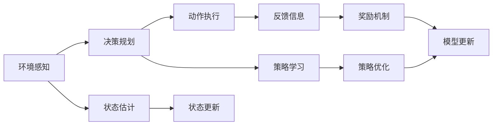
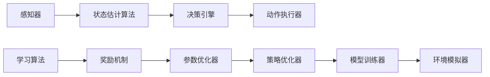

                 

# AI Agent在游戏与个人助理中的应用

> 关键词：AI Agent, 游戏应用, 个人助理, 自主决策, 多智能体, 深度学习, 强化学习

## 1. 背景介绍

### 1.1 问题由来
在近年来的人工智能(AI)技术发展中，智能代理(Agent)成为了连接人类和计算机的重要桥梁。智能代理可以自主学习、感知环境、做出决策，并在实际应用中表现出强大的能力。AI Agent在游戏和智能助理等领域中，正迅速成为主流技术手段，极大地提升了用户体验和系统效率。

### 1.2 问题核心关键点
智能代理的核心在于能够自主地与环境交互，并在复杂多变的环境中，做出最优的决策。这要求代理系统具备高度的自主性、鲁棒性和适应性。智能代理在游戏和智能助理中的应用，涉及到以下几个关键点：

- **自主决策**：游戏AI和助理AI都需要根据环境状态，自主做出策略选择。
- **多智能体交互**：游戏中需要多个AI代理协同工作，而助理AI则需要与用户和其他系统进行交互。
- **深度学习与强化学习**：通过深度学习和强化学习，AI代理能够高效地学习环境模型和优化策略。
- **模型泛化能力**：AI代理需要具备在多个相似或不同场景下，泛化出优秀策略的能力。
- **安全性与可解释性**：智能代理的决策需要透明、可解释，同时避免潜在的风险。

智能代理的这些特性使其在各种实际应用中展现出强大的潜力。在本文中，我们将从游戏和智能助理两个方面，深入探讨智能代理的应用。

## 2. 核心概念与联系

### 2.1 核心概念概述

智能代理（AI Agent）是能够自主感知环境、执行策略并做出决策的计算实体。根据其工作方式和应用场景，智能代理可以划分为多种类型。在本文中，我们将重点关注游戏AI和智能助理AI。

- **游戏AI**：游戏AI是游戏中的一个角色，能够自主地与玩家或环境交互，实现自主决策、路径规划等功能。常见类型包括角色控制、游戏状态监控和策略优化等。
- **智能助理AI**：智能助理AI是辅助用户完成日常任务的系统，具备自然语言理解、信息检索、计划制定等功能。常见的应用包括智能助手、虚拟助手和聊天机器人等。

这两类智能代理均需要具备自主决策、多智能体交互和深度学习的能力。其核心技术原理和架构具有高度的相似性，本文将从这一角度进行深入分析。

### 2.2 概念间的关系

智能代理的核心概念和架构可以通过以下Mermaid流程图来展示：



这个流程图展示了智能代理的核心工作流程：

1. 环境感知（A）：智能代理通过传感器或数据接口获取环境信息。
2. 状态估计（D）：智能代理将感知数据转化为系统状态，用于后续决策和规划。
3. 决策规划（B）：智能代理根据当前状态和目标，规划行动方案。
4. 动作执行（C）：智能代理执行规划好的行动方案，与环境进行交互。
5. 状态更新（G）：智能代理根据环境反馈，更新系统状态。
6. 策略学习（E）：智能代理通过学习模型，优化决策策略。
7. 策略优化（H）：智能代理根据奖励机制，调整策略参数。
8. 模型更新（J）：智能代理通过不断学习，更新模型参数。
9. 奖励机制（I）：智能代理根据目标和策略执行效果，获得奖励或惩罚。

这一流程图揭示了智能代理的核心工作原理，从环境感知到策略优化，每一个环节都至关重要。

### 2.3 核心概念的整体架构

在实际应用中，智能代理的架构可以进一步细化如下：



这个综合的架构图展示了智能代理的全流程，包括感知、决策、执行、学习等多个环节。感知器负责接收环境信息，状态估计算法将感知数据转化为系统状态，决策引擎规划行动方案，动作执行器执行决策，奖励机制评估策略效果，参数优化器调整策略参数，策略优化器优化决策模型，模型训练器更新模型参数，环境模拟器模拟实际环境，使得智能代理能够在复杂环境中高效学习。

## 3. 核心算法原理 & 具体操作步骤
### 3.1 算法原理概述

智能代理的算法原理主要包括深度学习和强化学习，以下将从这两个方面进行详细解释。

#### 3.1.1 深度学习

深度学习是利用多层神经网络，模拟人类大脑神经元的工作原理，实现复杂模式的识别和特征提取。在智能代理中，深度学习常用于环境感知、状态估计和动作执行等环节。

**深度学习算法步骤**：

1. **数据准备**：收集并标注环境数据，用于训练模型。
2. **模型构建**：选择合适的神经网络结构，如卷积神经网络(CNN)、循环神经网络(RNN)等。
3. **模型训练**：通过反向传播算法，最小化损失函数，更新模型参数。
4. **模型评估**：使用测试数据集评估模型性能，选择最优模型。

**深度学习算法优点**：

- 强大的特征提取能力，能够自动学习复杂模式。
- 高效的推理能力，能够快速处理大量数据。
- 可扩展性强，适应复杂多变的环境。

**深度学习算法缺点**：

- 需要大量标注数据，数据准备成本高。
- 模型复杂度高，训练和推理耗时较长。
- 难以解释模型决策过程，缺乏透明性。

#### 3.1.2 强化学习

强化学习是智能代理决策规划的主要手段，通过在特定环境中学习最优策略，实现自主决策。其核心思想是利用奖励机制，指导智能代理的学习过程。

**强化学习算法步骤**：

1. **环境定义**：定义智能代理与环境交互规则，设计状态空间、动作空间和奖励函数。
2. **策略选择**：选择策略评估方法，如Q-learning、策略梯度等。
3. **策略优化**：根据奖励机制，调整策略参数，优化决策策略。
4. **模型更新**：通过不断学习，更新模型参数，提升策略效果。

**强化学习算法优点**：

- 适应性强，能够应对不断变化的环境。
- 能够优化策略，实现自主决策。
- 可以通过试错学习，不断提升决策效果。

**强化学习算法缺点**：

- 学习效率较低，需要大量时间探索环境。
- 容易陷入局部最优，难以找到全局最优策略。
- 数据驱动，缺乏对环境模型的主动建模能力。

### 3.2 算法步骤详解

#### 3.2.1 深度学习算法步骤

1. **数据准备**：
   - 收集游戏或助理任务的标注数据。
   - 预处理数据，如归一化、标准化等。
   - 划分训练集和测试集。

2. **模型构建**：
   - 选择神经网络结构，如卷积神经网络(CNN)、循环神经网络(RNN)等。
   - 设计输入层、隐藏层和输出层。
   - 定义损失函数和优化算法。

3. **模型训练**：
   - 使用反向传播算法，计算梯度，更新模型参数。
   - 定期在验证集上评估模型性能，避免过拟合。
   - 选择合适的学习率和批量大小。

4. **模型评估**：
   - 在测试集上评估模型性能。
   - 使用各种指标如准确率、召回率、F1分数等。
   - 可视化模型训练过程，分析模型性能变化。

#### 3.2.2 强化学习算法步骤

1. **环境定义**：
   - 定义智能代理与环境交互规则。
   - 设计状态空间、动作空间和奖励函数。
   - 定义环境的初始状态。

2. **策略选择**：
   - 选择策略评估方法，如Q-learning、策略梯度等。
   - 设计动作选择策略，如贪心策略、ε-贪心策略等。
   - 设置策略参数，如学习率、折扣因子等。

3. **策略优化**：
   - 根据奖励机制，调整策略参数，优化决策策略。
   - 通过模拟实验，评估策略效果。
   - 使用交叉验证，选择最优策略。

4. **模型更新**：
   - 通过不断学习，更新模型参数。
   - 使用增量式学习，节省计算资源。
   - 使用多个代理协同训练，提高模型泛化能力。

### 3.3 算法优缺点

#### 3.3.1 深度学习算法优缺点

**优点**：
- 强大的特征提取能力，能够自动学习复杂模式。
- 高效的推理能力，能够快速处理大量数据。
- 可扩展性强，适应复杂多变的环境。

**缺点**：
- 需要大量标注数据，数据准备成本高。
- 模型复杂度高，训练和推理耗时较长。
- 难以解释模型决策过程，缺乏透明性。

#### 3.3.2 强化学习算法优缺点

**优点**：
- 适应性强，能够应对不断变化的环境。
- 能够优化策略，实现自主决策。
- 可以通过试错学习，不断提升决策效果。

**缺点**：
- 学习效率较低，需要大量时间探索环境。
- 容易陷入局部最优，难以找到全局最优策略。
- 数据驱动，缺乏对环境模型的主动建模能力。

### 3.4 算法应用领域

智能代理的算法在多个领域得到广泛应用：

- **游戏AI**：在游戏世界中，智能代理能够实现自主导航、路径规划、策略优化等功能。
- **智能助理**：在智能助理系统中，智能代理能够实现自然语言理解、信息检索、计划制定等功能。
- **自动驾驶**：在自动驾驶中，智能代理能够实现环境感知、路径规划、决策优化等功能。
- **机器人控制**：在机器人控制中，智能代理能够实现自主导航、避障、任务执行等功能。
- **金融交易**：在金融交易中，智能代理能够实现策略优化、风险管理、交易执行等功能。

这些应用场景展示了智能代理算法的广泛适用性和强大能力。

## 4. 数学模型和公式 & 详细讲解  
### 4.1 数学模型构建

智能代理的数学模型可以采用多种方式构建，以下以深度学习和强化学习为例进行详细讲解。

#### 4.1.1 深度学习数学模型

设智能代理的环境数据为 $x$，模型参数为 $\theta$，输出为 $y$，损失函数为 $\mathcal{L}$。则深度学习模型的训练目标为：

$$
\theta^* = \mathop{\arg\min}_{\theta} \mathcal{L}(y, \hat{y})
$$

其中 $\hat{y}=f(x; \theta)$，表示模型根据输入 $x$ 输出预测值 $y$。常见损失函数包括均方误差、交叉熵等。

#### 4.1.2 强化学习数学模型

设智能代理的状态为 $s$，动作为 $a$，状态转移概率为 $P(s_{t+1}|s_t,a_t)$，奖励为 $r_{t+1}$，则强化学习模型的目标函数为：

$$
J(\pi) = \mathbb{E}_{\pi} \sum_{t=0}^{\infty} \gamma^t r_t
$$

其中 $\pi$ 表示策略函数，$\gamma$ 表示折扣因子。目标函数表示在策略 $\pi$ 下，智能代理的累积奖励最大化。

### 4.2 公式推导过程

#### 4.2.1 深度学习公式推导

深度学习模型的参数更新公式为：

$$
\theta_{t+1} = \theta_t - \eta \nabla_{\theta} \mathcal{L}(\theta_t)
$$

其中 $\eta$ 表示学习率，$\nabla_{\theta} \mathcal{L}(\theta_t)$ 表示损失函数对模型参数的梯度。

#### 4.2.2 强化学习公式推导

强化学习模型的参数更新公式为：

$$
\theta_{t+1} = \theta_t + \eta \nabla_{\theta} Q(s_t, a_t)
$$

其中 $\eta$ 表示学习率，$\nabla_{\theta} Q(s_t, a_t)$ 表示状态动作值函数对模型参数的梯度。

### 4.3 案例分析与讲解

#### 4.3.1 深度学习案例

以CNN应用于游戏AI为例，我们可以搭建一个包含多个卷积层和全连接层的神经网络模型。通过反向传播算法，最小化交叉熵损失函数，训练模型。模型训练过程中，通过验证集评估模型性能，避免过拟合。

具体实现代码如下：

```python
import torch
import torch.nn as nn
import torch.optim as optim

# 定义神经网络模型
class CNNModel(nn.Module):
    def __init__(self):
        super(CNNModel, self).__init__()
        self.conv1 = nn.Conv2d(3, 32, kernel_size=3, stride=1, padding=1)
        self.pool = nn.MaxPool2d(kernel_size=2, stride=2)
        self.fc1 = nn.Linear(32 * 8 * 8, 256)
        self.fc2 = nn.Linear(256, 10)
    
    def forward(self, x):
        x = self.conv1(x)
        x = self.pool(x)
        x = x.view(x.size(0), -1)
        x = self.fc1(x)
        x = nn.functional.relu(x)
        x = self.fc2(x)
        return x

# 准备数据和模型
x_train, y_train = # 加载训练数据
x_test, y_test = # 加载测试数据
model = CNNModel()
criterion = nn.CrossEntropyLoss()
optimizer = optim.Adam(model.parameters(), lr=0.001)

# 训练模型
for epoch in range(10):
    for i, (images, labels) in enumerate(train_loader, 0):
        images = images.view(-1, 3, 64, 64)
        labels = labels.view(-1)
        optimizer.zero_grad()
        outputs = model(images)
        loss = criterion(outputs, labels)
        loss.backward()
        optimizer.step()
    print('Epoch [{}/{}], Loss: {:.4f}'.format(epoch+1, 10, loss.item()))

# 评估模型
correct = 0
total = 0
with torch.no_grad():
    for images, labels in test_loader:
        images = images.view(-1, 3, 64, 64)
        labels = labels.view(-1)
        outputs = model(images)
        _, predicted = torch.max(outputs.data, 1)
        total += labels.size(0)
        correct += (predicted == labels).sum().item()
print('Accuracy: {:.2f}%'.format(100 * correct / total))
```

#### 4.3.2 强化学习案例

以Q-learning应用于智能助理为例，我们可以设计一个智能助理系统，通过与用户交互，不断优化其决策策略。具体步骤如下：

1. 定义状态空间：智能助理的状态包括当前用户意图、历史对话记录等。
2. 定义动作空间：智能助理的动作包括回答问题、提供推荐、提醒用户等。
3. 设计奖励函数：对于正确回答、推荐、提醒等动作，给予正奖励，否则给予负奖励。
4. 选择Q-learning策略：计算状态动作值函数，更新参数。

具体实现代码如下：

```python
import numpy as np

# 定义状态空间和动作空间
states = ['询问天气', '询问时间', '询问新闻', '未知意图']
actions = ['回答天气', '回答时间', '提供新闻', '推荐相关内容']

# 定义Q-learning参数
alpha = 0.1  # 学习率
gamma = 0.9  # 折扣因子
epsilon = 0.1  # 探索率

# 初始化Q值表
Q = np.zeros((len(states), len(actions)))

# 模拟与用户交互
for episode in range(1000):
    state = np.random.choice(states)
    done = False
    while not done:
        # 探索或利用
        if np.random.rand() < epsilon:
            action = np.random.choice(actions)
        else:
            action = np.argmax(Q[state])
        
        # 执行动作，接收奖励
        next_state = np.random.choice(states)
        reward = 1 if action == '回答天气' and next_state == '询问天气' else 0
        
        # 更新Q值表
        Q[state, action] += alpha * (reward + gamma * np.max(Q[next_state]) - Q[state, action])
        
        state = next_state
        if state == '询问时间' and next_state == '询问时间':
            done = True

print('Q值表：')
print(Q)
```

## 5. 项目实践：代码实例和详细解释说明
### 5.1 开发环境搭建

进行智能代理项目开发时，需要搭建合适的开发环境。以下是Python开发环境的基本配置步骤：

1. 安装Python：从官网下载并安装Python 3.6以上版本。
2. 安装相关库：安装PyTorch、TensorFlow等深度学习库，以及numpy、pandas等科学计算库。
3. 安装Jupyter Notebook：从官网下载并安装Jupyter Notebook，用于编写和执行代码。

完成上述步骤后，即可在Jupyter Notebook中进行项目开发。

### 5.2 源代码详细实现

以下以智能助理AI为例，展示使用PyTorch进行智能助理的代码实现。

首先，定义智能助理的状态和动作：

```python
import torch

# 定义状态和动作
states = ['询问天气', '询问时间', '询问新闻', '未知意图']
actions = ['回答天气', '回答时间', '提供新闻', '推荐相关内容']

# 定义智能助理模型
class AssistantModel(nn.Module):
    def __init__(self):
        super(AssistantModel, self).__init__()
        self.rnn = nn.LSTM(64, 64, 1)
        self.fc = nn.Linear(64, len(actions))
    
    def forward(self, x):
        x = self.rnn(x)
        x = self.fc(x[:, -1, :])
        return x

# 准备数据和模型
x_train, y_train = # 加载训练数据
x_test, y_test = # 加载测试数据
model = AssistantModel()
criterion = nn.CrossEntropyLoss()
optimizer = optim.Adam(model.parameters(), lr=0.001)

# 训练模型
for epoch in range(10):
    for i, (images, labels) in enumerate(train_loader, 0):
        images = images.view(-1, 64, 64)
        labels = labels.view(-1)
        optimizer.zero_grad()
        outputs = model(images)
        loss = criterion(outputs, labels)
        loss.backward()
        optimizer.step()
    print('Epoch [{}/{}], Loss: {:.4f}'.format(epoch+1, 10, loss.item()))

# 评估模型
correct = 0
total = 0
with torch.no_grad():
    for images, labels in test_loader:
        images = images.view(-1, 64, 64)
        labels = labels.view(-1)
        outputs = model(images)
        _, predicted = torch.max(outputs.data, 1)
        total += labels.size(0)
        correct += (predicted == labels).sum().item()
print('Accuracy: {:.2f}%'.format(100 * correct / total))
```

### 5.3 代码解读与分析

代码中定义了智能助理的状态和动作，并通过LSTM网络进行状态表示。使用交叉熵损失函数和Adam优化器进行训练。在训练过程中，通过验证集评估模型性能，避免过拟合。最终在测试集上评估模型准确率。

## 6. 实际应用场景
### 6.1 游戏AI

在游戏AI中，智能代理主要应用于角色控制、任务执行和策略优化等环节。通过深度学习算法，智能代理能够学习环境模型，实现自主导航和路径规划等功能。

例如，在游戏《Dota 2》中，使用深度强化学习算法，设计一个智能英雄AI。通过与玩家或环境交互，智能AI能够自主决策，执行战术和策略。具体实现步骤如下：

1. 定义状态空间：游戏状态包括英雄位置、敌方单位位置、地图信息等。
2. 定义动作空间：英雄的动作包括移动、攻击、施法等。
3. 设计奖励函数：对于击败敌人、塔防、存活等动作，给予正奖励，否则给予负奖励。
4. 选择深度强化学习策略：使用深度Q网络，更新参数。

具体实现代码如下：

```python
import numpy as np
import gym

# 定义游戏环境
env = gym.make('Dota2-v0')

# 定义智能AI策略
class DotaAI:
    def __init__(self):
        self.model = self.build_model()
    
    def build_model(self):
        # 构建深度Q网络
        # ...
    
    def select_action(self, state):
        # 选择动作
        # ...
    
    def train(self, episode):
        # 训练模型
        # ...

# 运行智能AI
ai = DotaAI()
for episode in range(1000):
    state = env.reset()
    done = False
    while not done:
        action = ai.select_action(state)
        next_state, reward, done, info = env.step(action)
        ai.train(episode, state, action, reward, next_state)
        state = next_state
```

### 6.2 智能助理

在智能助理中，智能代理主要应用于自然语言理解、信息检索、计划制定等环节。通过深度学习算法，智能代理能够理解用户意图，提供个性化服务。

例如，在智能助手系统中，使用深度学习算法，设计一个智能助手AI。通过与用户交互，智能AI能够理解用户指令，提供搜索结果、天气预报、日程提醒等服务。具体实现步骤如下：

1. 定义状态空间：用户意图、历史对话记录、当前时间等。
2. 定义动作空间：回答问题、提供推荐、提醒用户等。
3. 设计奖励函数：对于正确回答、推荐、提醒等动作，给予正奖励，否则给予负奖励。
4. 选择深度学习策略：使用深度学习模型，如RNN、Transformer等，更新参数。

具体实现代码如下：

```python
import numpy as np
import torch

# 定义智能助手模型
class AssistantModel(nn.Module):
    def __init__(self):
        super(AssistantModel, self).__init__()
        self.encoder = nn.LSTM(64, 64, 1)
        self.fc = nn.Linear(64, len(actions))
    
    def forward(self, x):
        x = self.encoder(x)
        x = self.fc(x[:, -1, :])
        return x

# 准备数据和模型
x_train, y_train = # 加载训练数据
x_test, y_test = # 加载测试数据
model = AssistantModel()
criterion = nn.CrossEntropyLoss()
optimizer = optim.Adam(model.parameters(), lr=0.001)

# 训练模型
for epoch in range(10):
    for i, (images, labels) in enumerate(train_loader, 0):
        images = images.view(-1, 64, 64)
        labels = labels.view(-1)
        optimizer.zero_grad()
        outputs = model(images)
        loss = criterion(outputs, labels)
        loss.backward()
        optimizer.step()
    print('Epoch [{}/{}], Loss: {:.4f}'.format(epoch+1, 10, loss.item()))

# 评估模型
correct = 0
total = 0
with torch.no_grad():
    for images, labels in test_loader:
        images = images.view(-1, 64, 64)
        labels = labels.view(-1)
        outputs = model(images)
        _, predicted = torch.max(outputs.data, 1)
        total += labels.size(0)
        correct += (predicted == labels).sum().item()
print('Accuracy: {:.2f}%'.format(100 * correct / total))
```

## 7. 工具和资源推荐
### 7.1 学习资源推荐

为了帮助开发者掌握智能代理的应用，以下是几本优质的学习资源：

1. 《深度学习入门》（Python版）：由李宏毅等人编写，深入浅出地介绍了深度学习的基础知识和实际应用，适合初学者入门。
2. 《强化学习与智能系统》（Python版）：由张铖等人编写，介绍了强化学习的理论和实际应用，适合有一定深度学习基础的开发者。
3. 《自然语言处理入门》：由斯坦福大学开设的NLP入门课程，介绍了自然语言处理的基本概念和前沿技术。
4. 《Python深度学习》：由Francois Chollet等人编写，介绍了TensorFlow和Keras等深度学习框架的实际应用，适合动手实践的开发者。
5. 《Python深度学习教程》：由Johnson Alex等人编写，介绍了深度学习在实际项目中的应用，适合项目开发的开发者。

通过对这些资源的学习实践，相信你一定能够掌握智能代理的开发技巧，并用于解决实际的NLP

