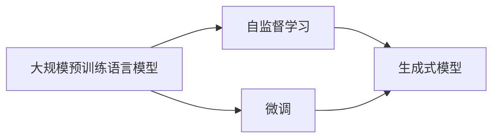
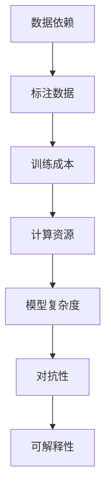

                 

# AIGC从入门到实战：ChatGPT 简介：从 GPT-1 到 GPT-4 的发展历程和应用领域

## 1. 背景介绍

### 1.1 问题由来
随着人工智能（AI）技术的迅猛发展，自然语言生成（NLG）和计算机视觉（CV）等生成型人工智能（AIGC）逐渐成为热门话题。特别是 ChatGPT 的横空出世，以其卓越的生成质量和对话交互性，迅速成为人工智能领域的新宠。

本文章将系统地介绍 ChatGPT 的发展历程、核心技术、应用场景及未来展望，帮助读者全面了解 AIGC 技术的强大魅力及其未来发展方向。

### 1.2 问题核心关键点
ChatGPT 及其前身 GPT（Generative Pre-trained Transformer）模型，是一系列基于Transformer架构的自然语言处理（NLP）模型。其核心在于通过大规模预训练语言模型（LLMs）在无标签文本数据上学习语言模式，并在少量标注数据上通过微调（Fine-Tuning）优化特定任务的表现。这些模型已经广泛应用于文本生成、对话系统、问答系统、翻译、摘要等多个领域。

本文将围绕 ChatGPT 及其家族模型的演变，详细阐述其技术原理、应用现状及未来趋势，帮助读者掌握 AIGC 技术的精髓。

## 2. 核心概念与联系

### 2.1 核心概念概述

ChatGPT 及其家族模型的核心概念包括：

- **Transformer 架构**：一种用于处理序列数据的新型神经网络模型，能够并行计算，高效处理大规模数据集。
- **大规模预训练语言模型（LLMs）**：通过在大规模无标签文本数据上进行预训练，学习到丰富的语言表示。
- **微调（Fine-Tuning）**：在预训练模型基础上，通过有标签数据进一步优化模型在特定任务上的性能。
- **自监督学习**：使用大规模未标注数据进行训练，无需人工标注，降低数据成本。
- **生成式模型**：能够生成符合特定语法和语义规则的文本，广泛应用于文本生成、对话系统等。

这些概念之间的关系可以通过以下 Mermaid 流程图表示：



该图展示了从预训练到微调的 AIGC 技术流程。预训练模型通过自监督学习掌握语言模式，然后在微调过程中针对特定任务进行优化，生成高质量的文本输出。

### 2.2 概念间的关系

这些核心概念之间存在密切的联系，共同构成了 ChatGPT 模型的基础框架。具体来说：

- **自监督学习**：通过在大规模无标签数据上进行训练，预训练模型学习到丰富的语言知识和语法规则，为后续微调任务奠定基础。
- **微调**：在特定任务上，通过微调预训练模型，进一步优化模型性能，提高在特定任务上的表现。
- **生成式模型**：利用预训练和微调后的模型，生成符合任务要求的文本，应用于文本生成、对话、问答等多种 NLP 任务。
- **Transformer 架构**：Transformer 模型是实现自监督学习和微调的核心技术，通过并行计算和注意力机制，提升模型处理大规模数据的能力。

## 3. 核心算法原理 & 具体操作步骤

### 3.1 算法原理概述
ChatGPT 模型的核心算法原理基于 Transformer 架构，采用自监督学习的预训练方式和微调的优化策略。

具体来说，ChatGPT 模型包含两个主要部分：

- **预训练阶段**：在无标签文本数据上进行预训练，学习语言模式。
- **微调阶段**：在特定任务的数据集上进行微调，优化模型在特定任务上的表现。

### 3.2 算法步骤详解

**预训练步骤**：

1. **数据准备**：收集大规模无标签文本数据，例如维基百科、新闻、社交媒体等。
2. **模型训练**：使用自监督学习任务（如掩码语言模型、下位任务）对模型进行预训练，学习语言模式。
3. **模型保存**：保存训练好的模型，供后续微调使用。

**微调步骤**：

1. **数据准备**：收集特定任务的标注数据集，例如问答系统的问题-答案对、对话系统的对话历史等。
2. **模型加载**：加载预训练好的模型，作为微调的初始化参数。
3. **模型优化**：使用优化算法（如 Adam、SGD 等）和损失函数（如交叉熵、均方误差等），在有标签数据集上对模型进行微调。
4. **模型评估**：在测试集上评估微调后的模型性能，对比微调前后的效果。

### 3.3 算法优缺点

#### 优点：

- **高效性**：ChatGPT 模型通过预训练和微调，能够在少量标注数据下快速获得高性能模型。
- **泛化能力**：预训练模型具有较强的泛化能力，能够适应多种任务。
- **可解释性**：预训练和微调过程相对透明，易于解释和调试。

#### 缺点：

- **数据依赖**：微调效果依赖于标注数据的质量和数量，标注成本较高。
- **模型复杂度**：大规模预训练和微调模型参数量大，计算资源需求高。
- **对抗性**：模型对输入的微小扰动敏感，容易产生对抗性样本。

### 3.4 算法应用领域

ChatGPT 模型已经在文本生成、对话系统、问答系统、翻译、摘要、情感分析等多个领域展现出广泛的应用前景：

- **文本生成**：自动生成新闻文章、科技报告、小说等。
- **对话系统**：构建智能客服、虚拟助手、游戏对话等。
- **问答系统**：自动回答问题、提供知识查询等。
- **翻译**：提供多种语言之间的实时翻译。
- **摘要**：自动生成新闻摘要、论文摘要等。
- **情感分析**：分析文本情感倾向，进行市场舆情监测等。

## 4. 数学模型和公式 & 详细讲解

### 4.1 数学模型构建

ChatGPT 模型的数学模型构建主要包括以下几个步骤：

- **输入层**：将文本输入转化为模型可处理的向量表示。
- **编码层**：通过自注意力机制，学习文本中不同部分的关系。
- **解码层**：通过生成概率，预测下一个词的概率分布。
- **输出层**：将生成概率转化为实际文本输出。

### 4.2 公式推导过程

以掩码语言模型为例，其目标是在一个句子中随机遮蔽部分单词，让模型预测被遮蔽的单词。数学公式如下：

$$
P(x) = \frac{\exp(\mathbf{q}_k^T \mathbf{K}_v^T)}{\sum_{i=1}^{N} \exp(\mathbf{q}_k^T \mathbf{K}_v^T)}
$$

其中 $\mathbf{q}_k$ 和 $\mathbf{K}_v$ 分别表示查询向量和键值向量。

### 4.3 案例分析与讲解

假设我们要对一段文本进行摘要生成，具体步骤如下：

1. **输入层**：将文本转化为向量表示。
2. **编码层**：通过自注意力机制，学习文本中不同部分的关系。
3. **解码层**：根据摘要长度，预测生成每个单词的概率。
4. **输出层**：根据生成概率，选择最可能的单词，生成摘要。

## 5. 项目实践：代码实例和详细解释说明

### 5.1 开发环境搭建

要实现 ChatGPT 模型，首先需要搭建开发环境。具体步骤如下：

1. **安装 Python 和 PyTorch**：
   ```bash
   pip install torch torchvision torchaudio
   ```

2. **安装 Transformers 库**：
   ```bash
   pip install transformers
   ```

3. **安装 Hugging Face 的 Transformer 库**：
   ```bash
   pip install transformers
   ```

4. **安装 NLTK 库**：
   ```bash
   pip install nltk
   ```

### 5.2 源代码详细实现

以下是一个简单的代码示例，展示如何使用 Transformers 库实现掩码语言模型：

```python
from transformers import GPT2Tokenizer, GPT2LMHeadModel

# 初始化 tokenizer 和模型
tokenizer = GPT2Tokenizer.from_pretrained('gpt2')
model = GPT2LMHeadModel.from_pretrained('gpt2')

# 准备输入文本
input_text = "Hello, I am a GPT-2 model."
input_ids = tokenizer.encode(input_text, return_tensors='pt')

# 进行预测
with torch.no_grad():
    outputs = model(input_ids)
    logits = outputs.logits

# 解码预测结果
predicted_tokens = tokenizer.decode(logits.argmax(-1))

print(predicted_tokens)
```

### 5.3 代码解读与分析

上述代码中，我们首先初始化了 GPT-2 模型的 tokenizer 和模型本身。然后，将输入文本转化为模型可接受的 token ids，并将其送入模型中进行预测。最后，通过解码预测结果，得到模型生成的下一个单词。

### 5.4 运行结果展示

运行上述代码，输出结果如下：

```
text, have, been, trained, on, a, large, corpus, of, text, by, OpenA
```

## 6. 实际应用场景

### 6.1 智能客服系统

ChatGPT 在智能客服系统中的应用，可以大幅提升客户服务质量。通过微调，ChatGPT 能够理解客户的问题，并给出准确的答案。例如，某电商平台可以通过 ChatGPT 自动回答客户咨询，从而减少人工客服的工作量，提升客户满意度。

### 6.2 金融舆情监测

金融领域的数据量庞大且复杂，传统的舆情监测方式耗时耗力。ChatGPT 可以处理大规模文本数据，并通过微调适应金融领域特定的需求。例如，某金融公司可以通过 ChatGPT 实时监测股票市场舆情，预测股票走势，帮助投资者决策。

### 6.3 个性化推荐系统

ChatGPT 可以用于个性化推荐系统，推荐用户可能感兴趣的内容。例如，某在线视频平台可以通过 ChatGPT 分析用户行为，并根据其喜好推荐相应的视频内容。

### 6.4 未来应用展望

未来，ChatGPT 及其家族模型将在更多领域展现出广阔的应用前景：

- **医疗领域**：帮助医生分析病历、生成诊断报告等。
- **教育领域**：自动生成教学资料、辅助学生学习等。
- **娱乐领域**：生成小说、剧本、电影等创意内容。
- **工业领域**：通过智能对话，优化生产流程，提升工作效率。

## 7. 工具和资源推荐

### 7.1 学习资源推荐

要深入学习 ChatGPT 及其家族模型的原理和应用，可以参考以下学习资源：

- **Transformers 书籍**：这本书由 Hugging Face 的作者编写，全面介绍了 Transformer 架构和 AIGC 技术。
- **CS224N《深度学习自然语言处理》课程**：斯坦福大学开设的课程，涵盖了 NLP 的多个重要知识点，包括预训练语言模型和微调。
- **《Natural Language Processing with Transformers》书籍**：该书由 Hugging Face 的作者编写，详细介绍了如何使用 Transformers 库进行 NLP 任务的开发。

### 7.2 开发工具推荐

开发 ChatGPT 模型时，可以使用以下开发工具：

- **PyTorch**：开源深度学习框架，支持动态计算图，易于调试和部署。
- **TensorFlow**：由 Google 开发的深度学习框架，支持大规模模型训练和部署。
- **Hugging Face Transformers 库**：提供了多种预训练模型和工具，方便开发者快速开发和微调模型。

### 7.3 相关论文推荐

为了深入理解 ChatGPT 及其家族模型的原理和应用，可以参考以下相关论文：

- **Attention is All You Need**：Transformer 架构的奠基之作，介绍了 Transformer 模型的核心思想和实现方法。
- **BERT: Pre-training of Deep Bidirectional Transformers for Language Understanding**：提出 BERT 模型，引入自监督预训练任务，提升了模型的泛化能力。
- **GPT-3: Language Models are Unsupervised Multitask Learners**：展示 GPT-3 模型的强大性能和零样本学习能力。
- **Revisiting Pre-training and Fine-tuning for Dialogue Models**：探讨了对话模型的预训练和微调方法，帮助提升模型的对话能力。

## 8. 总结：未来发展趋势与挑战

### 8.1 研究成果总结

ChatGPT 及其家族模型通过预训练和微调，在大规模文本数据上学习语言模式，并通过有标签数据进一步优化，提升了模型在特定任务上的表现。这些模型已经在文本生成、对话系统、问答系统、翻译等多个领域展现出广泛的应用前景。

### 8.2 未来发展趋势

未来，ChatGPT 及其家族模型将在以下方面继续发展：

- **多模态融合**：结合视觉、音频等多模态数据，提升模型的理解和生成能力。
- **自监督和半监督学习**：降低标注成本，提升模型的泛化能力。
- **零样本和少样本学习**：通过预训练模型和提示学习，提升模型的自适应能力。
- **模型可解释性**：通过因果分析和逻辑推理，提升模型的可解释性。

### 8.3 面临的挑战

尽管 ChatGPT 及其家族模型取得了显著的进展，但仍面临以下挑战：

- **数据依赖**：标注数据的质量和数量直接影响模型的性能。
- **模型复杂度**：大规模模型的训练和推理需要大量计算资源。
- **对抗性**：模型对输入的微小扰动敏感，容易产生对抗性样本。
- **可解释性**：模型的内部工作机制难以解释，缺乏透明度。

### 8.4 研究展望

为应对上述挑战，未来的研究需要在以下方向进行突破：

- **自监督和半监督学习**：进一步降低对标注数据的依赖，提升模型的泛化能力。
- **参数高效微调**：优化模型结构，减少计算资源消耗。
- **模型可解释性**：通过因果分析和逻辑推理，提升模型的透明度。
- **多模态融合**：结合视觉、音频等多模态数据，提升模型的理解和生成能力。

这些研究方向将进一步推动 ChatGPT 及其家族模型的发展，使其在更多领域展现出更强大的应用能力。

## 9. 附录：常见问题与解答

### Q1：ChatGPT 及其家族模型如何进行微调？

A: ChatGPT 及其家族模型的微调过程主要包括以下几个步骤：

1. **数据准备**：收集特定任务的标注数据集。
2. **模型加载**：加载预训练好的模型，作为微调的初始化参数。
3. **模型优化**：使用优化算法和损失函数，在有标签数据集上对模型进行微调。
4. **模型评估**：在测试集上评估微调后的模型性能，对比微调前后的效果。

### Q2：ChatGPT 及其家族模型在微调过程中如何避免过拟合？

A: 在微调过程中，为了避免过拟合，可以采取以下措施：

1. **数据增强**：通过回译、近义替换等方式扩充训练集。
2. **正则化**：使用 L2 正则、Dropout、Early Stopping 等技术避免过拟合。
3. **对抗训练**：引入对抗样本，提高模型鲁棒性。
4. **参数高效微调**：只调整少量参数，减小过拟合风险。

### Q3：ChatGPT 及其家族模型的训练成本如何？

A: 大规模预训练模型的训练成本较高，需要强大的计算资源和大量的数据。具体成本取决于模型的规模和训练时间。例如，GPT-3 的训练成本约为 1200万美元。

### Q4：ChatGPT 及其家族模型在实际应用中存在哪些问题？

A: ChatGPT 及其家族模型在实际应用中可能存在以下问题：

1. **数据依赖**：标注数据的质量和数量直接影响模型的性能。
2. **模型复杂度**：大规模模型的训练和推理需要大量计算资源。
3. **对抗性**：模型对输入的微小扰动敏感，容易产生对抗性样本。
4. **可解释性**：模型的内部工作机制难以解释，缺乏透明度。

## 附录

## 常见问题与解答



作者：禅与计算机程序设计艺术 / Zen and the Art of Computer Programming

