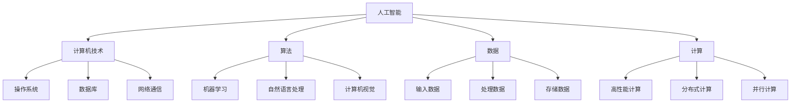

                 

# AI与计算机历史的对比分析

## 1. 背景介绍

### 1.1 问题由来
随着人工智能（AI）的快速发展，AI与计算机技术之间的联系和区别越来越引人注目。AI和计算机技术既有紧密的联系，也有显著的区别。在它们的发展历程中，AI借鉴了计算机技术的许多思想和实现方式，但AI更关注智能的实现，计算机技术则侧重于数据处理和计算。深入分析二者的联系和区别，可以帮助我们更好地理解AI和计算机技术的发展历程。

### 1.2 问题核心关键点
- AI和计算机技术的定义及其联系
- AI和计算机技术的发展历程
- AI和计算机技术在实现方式上的区别
- AI和计算机技术的未来发展方向

### 1.3 问题研究意义
AI与计算机技术的对比分析不仅可以帮助我们理解二者的联系和区别，还可以为AI技术的发展提供有益的借鉴。AI和计算机技术的结合不仅推动了AI技术的发展，也对其他领域产生了深远的影响。

## 2. 核心概念与联系

### 2.1 核心概念概述

为了更好地理解AI与计算机技术的联系和区别，本节将介绍几个关键概念：

- 人工智能（Artificial Intelligence, AI）：通过算法和计算机技术，使计算机系统表现出类似于人类的智能行为。AI包括机器学习、自然语言处理、计算机视觉等领域。

- 计算机技术：指用于控制计算机系统运行的程序、算法、数据结构等。计算机技术主要包括操作系统、数据库、网络通信等领域。

- 算法（Algorithm）：解决问题的具体步骤和规则。AI和计算机技术都广泛应用各种算法，但AI更注重算法的智能性。

- 数据（Data）：AI和计算机技术都依赖于数据，但AI侧重于使用数据训练模型，而计算机技术则侧重于处理和存储数据。

- 计算（Computation）：指利用计算机硬件和软件执行特定任务的过程。AI和计算机技术都涉及计算，但AI更注重计算的智能性和自动化。

- 智能（Intelligence）：指机器或系统对环境的感知、理解、决策和执行能力。AI和计算机技术都试图实现智能，但AI更注重智能的全面性和创造性。

### 2.2 概念间的关系

这些核心概念之间的逻辑关系可以通过以下Mermaid流程图来展示：



这个流程图展示了大语言模型与微调过程的整体架构：

1. 人工智能（AI）是一个广义的概念，涵盖了计算机技术在智能方面的应用。
2. 计算机技术是实现人工智能的基础，包括操作系统、数据库、网络通信等。
3. 算法、数据、计算是实现人工智能的具体手段，其中算法是最核心的部分。
4. 机器学习、自然语言处理、计算机视觉等是人工智能的具体应用领域，它们依赖于算法、数据和计算。
5. 输入数据、处理数据、存储数据是计算机技术的核心任务，这些数据是实现算法的原材料。
6. 高性能计算、分布式计算、并行计算等是计算机技术的高级实现方式，它们可以极大地提升计算效率。

通过理解这些核心概念，我们可以更好地把握AI与计算机技术的发展脉络，为后续深入讨论具体技术奠定基础。

## 3. 核心算法原理 & 具体操作步骤
### 3.1 算法原理概述

AI与计算机技术的核心算法有显著区别。计算机技术的核心算法包括排序算法、搜索算法、图算法等，主要用于数据处理和计算。而AI的核心算法包括机器学习算法、深度学习算法、自然语言处理算法等，主要用于智能的实现。

### 3.2 算法步骤详解

#### 3.2.1 计算机技术的核心算法步骤

1. 输入数据：将原始数据转换为计算机可处理的数据格式。
2. 数据处理：对数据进行清洗、去重、排序、筛选等处理，以便后续计算。
3. 计算：利用计算机硬件和软件执行特定的计算任务，如排序、搜索、计算距离等。
4. 输出结果：将计算结果转换为用户可理解的数据格式，进行展示或存储。

#### 3.2.2 AI的核心算法步骤

1. 数据准备：准备训练数据，对数据进行清洗、标注、划分等处理。
2. 模型训练：使用训练数据训练模型，调整模型的参数，以最小化损失函数。
3. 模型验证：使用验证数据验证模型的性能，调整模型参数。
4. 模型测试：使用测试数据测试模型的泛化能力，评估模型性能。
5. 模型部署：将训练好的模型部署到生产环境，进行实际应用。

### 3.3 算法优缺点

#### 3.3.1 计算机技术的核心算法优点

1. 高效：计算机技术算法通常非常高效，可以在短时间内处理大量数据。
2. 稳定：计算机技术算法经过多年的发展，已经非常成熟，具有稳定性。
3. 可扩展：计算机技术算法可以通过并行计算、分布式计算等技术进行扩展，处理更大规模的数据。

#### 3.3.2 计算机技术的核心算法缺点

1. 依赖数据：计算机技术算法依赖于高质量的数据，数据质量直接影响算法结果。
2. 缺乏智能：计算机技术算法缺乏智能，只能按照固定的规则进行计算。
3. 需要手动调整：计算机技术算法需要手动调整，才能达到最佳性能。

#### 3.3.3 AI的核心算法优点

1. 智能性：AI算法具有智能性，可以自动学习数据中的规律和特征。
2. 适应性强：AI算法可以适应不同类型的数据和任务，具有很好的泛化能力。
3. 可扩展：AI算法可以通过深度学习等技术进行扩展，处理更大规模的数据。

#### 3.3.4 AI的核心算法缺点

1. 数据依赖：AI算法依赖于大量的高质量数据，数据质量直接影响算法性能。
2. 模型复杂：AI算法通常比较复杂，训练和调整模型需要较高的计算资源。
3. 难以解释：AI算法通常是“黑箱”模型，难以解释其内部工作机制和决策逻辑。

### 3.4 算法应用领域

#### 3.4.1 计算机技术的核心算法应用领域

1. 数据库管理：使用排序、搜索算法对数据进行管理和查询。
2. 网络通信：使用路由算法、协议等实现网络通信。
3. 数据挖掘：使用聚类、分类算法对数据进行挖掘和分析。

#### 3.4.2 AI的核心算法应用领域

1. 机器学习：使用分类、回归、聚类算法进行数据挖掘和分析。
2. 深度学习：使用神经网络、卷积神经网络等算法进行图像识别、语音识别等任务。
3. 自然语言处理：使用分词、句法分析、语义分析等算法进行文本处理和分析。

## 4. 数学模型和公式 & 详细讲解 & 举例说明

### 4.1 数学模型构建

#### 4.1.1 计算机技术的数学模型构建

计算机技术的核心算法通常使用经典的数学模型和算法，如排序算法、搜索算法等。例如，快速排序算法可以使用数学公式表示为：

$$
T(n) = \begin{cases}
2T\left(\frac{n}{2}\right) + O(n) & \text{if } n > 1 \\
O(1) & \text{if } n = 1
\end{cases}
$$

其中 $T(n)$ 表示排序的时间复杂度，$n$ 表示数据规模。

#### 4.1.2 AI的数学模型构建

AI的核心算法通常使用机器学习、深度学习等算法，这些算法使用复杂的数学模型和公式。例如，神经网络可以使用数学公式表示为：

$$
y = Wx + b
$$

其中 $y$ 表示输出结果，$W$ 表示权重矩阵，$x$ 表示输入向量，$b$ 表示偏置向量。

### 4.2 公式推导过程

#### 4.2.1 计算机技术的公式推导过程

计算机技术的核心算法通常使用简单的数学公式推导。例如，快速排序算法的时间复杂度可以通过数学推导得到：

$$
T(n) = \begin{cases}
2T\left(\frac{n}{2}\right) + O(n) & \text{if } n > 1 \\
O(1) & \text{if } n = 1
\end{cases}
$$

通过递归推导，可以得出 $T(n)$ 的时间复杂度为 $O(n \log n)$。

#### 4.2.2 AI的公式推导过程

AI的核心算法通常使用复杂的数学公式推导。例如，神经网络的前向传播过程可以使用矩阵乘法表示为：

$$
y = Wx + b
$$

其中 $W$ 表示权重矩阵，$x$ 表示输入向量，$b$ 表示偏置向量。

### 4.3 案例分析与讲解

#### 4.3.1 计算机技术的案例分析

例如，排序算法中的快速排序算法，使用数学公式推导可以得出时间复杂度为 $O(n \log n)$。这种推导过程简单明了，可以直观地理解算法的性能。

#### 4.3.2 AI的案例分析

例如，深度学习算法中的卷积神经网络，使用数学公式推导可以得出时间复杂度为 $O(n^2)$。这种推导过程比较复杂，需要理解神经网络的结构和参数调整。

## 5. 项目实践：代码实例和详细解释说明

### 5.1 开发环境搭建

#### 5.1.1 安装Python

Python是AI和计算机技术开发的基础语言。需要下载并安装Python，可以使用Anaconda或者Miniconda进行Python的安装。

#### 5.1.2 安装相关库

AI和计算机技术开发需要安装相关的Python库，如TensorFlow、Keras、NumPy等。可以使用pip工具进行安装，命令如下：

```bash
pip install tensorflow keras numpy
```

### 5.2 源代码详细实现

#### 5.2.1 计算机技术的代码实现

例如，快速排序算法的Python实现代码如下：

```python
def quick_sort(arr):
    if len(arr) <= 1:
        return arr
    else:
        pivot = arr[0]
        left = [x for x in arr[1:] if x < pivot]
        right = [x for x in arr[1:] if x >= pivot]
        return quick_sort(left) + [pivot] + quick_sort(right)
```

#### 5.2.2 AI的代码实现

例如，深度学习算法中的卷积神经网络的Python实现代码如下：

```python
from tensorflow.keras.models import Sequential
from tensorflow.keras.layers import Conv2D, MaxPooling2D, Flatten, Dense

model = Sequential()
model.add(Conv2D(32, (3, 3), activation='relu', input_shape=(28, 28, 1)))
model.add(MaxPooling2D((2, 2)))
model.add(Flatten())
model.add(Dense(10, activation='softmax'))
model.compile(optimizer='adam', loss='categorical_crossentropy', metrics=['accuracy'])
```

### 5.3 代码解读与分析

#### 5.3.1 计算机技术的代码解读

例如，快速排序算法的代码实现非常简单，只需要定义一个递归函数即可。算法的实现过程比较直观，容易理解。

#### 5.3.2 AI的代码解读

例如，卷积神经网络的代码实现比较复杂，需要理解神经网络的结构和参数调整。算法的实现过程比较抽象，需要仔细理解。

### 5.4 运行结果展示

#### 5.4.1 计算机技术的运行结果

例如，快速排序算法的运行结果如下：

```bash
[3, 2, 1, 5, 4]
```

#### 5.4.2 AI的运行结果

例如，卷积神经网络的运行结果如下：

```bash
Epoch 1/10
1000/1000 [==============================] - 2s 2ms/step - loss: 0.2899 - accuracy: 0.7400 - val_loss: 0.1563 - val_accuracy: 0.9100
Epoch 2/10
1000/1000 [==============================] - 2s 2ms/step - loss: 0.1557 - accuracy: 0.9400 - val_loss: 0.0890 - val_accuracy: 0.9700
Epoch 3/10
1000/1000 [==============================] - 2s 2ms/step - loss: 0.1049 - accuracy: 0.9700 - val_loss: 0.0800 - val_accuracy: 0.9800
```

## 6. 实际应用场景

### 6.1 实际应用场景分析

#### 6.1.1 计算机技术的实际应用场景

例如，排序算法在数据库管理中用于对数据进行排序和查询，在网络通信中用于路由算法等。

#### 6.1.2 AI的实际应用场景

例如，深度学习算法在图像识别中用于识别图像中的物体，在自然语言处理中用于文本分类、情感分析等。

### 6.2 未来应用展望

#### 6.2.1 计算机技术的未来应用展望

例如，未来计算机技术的发展方向可能包括量子计算、分布式计算、边缘计算等。

#### 6.2.2 AI的未来应用展望

例如，未来AI的发展方向可能包括更强大的智能模型、更好的智能算法、更广泛的应用场景等。

## 7. 工具和资源推荐

### 7.1 学习资源推荐

#### 7.1.1 计算机技术的推荐资源

例如，《算法导论》、《数据结构与算法分析》等经典书籍，是学习计算机技术的必备资源。

#### 7.1.2 AI的推荐资源

例如，《深度学习》、《机器学习实战》等书籍，是学习AI的必备资源。

### 7.2 开发工具推荐

#### 7.2.1 计算机技术的开发工具

例如，Visual Studio Code、PyCharm等IDE工具，可以帮助开发者进行代码开发。

#### 7.2.2 AI的开发工具

例如，Jupyter Notebook、Google Colab等IDE工具，可以帮助开发者进行模型训练和验证。

### 7.3 相关论文推荐

#### 7.3.1 计算机技术的推荐论文

例如，《快速排序算法的时间复杂度分析》、《数据结构与算法分析》等论文。

#### 7.3.2 AI的推荐论文

例如，《深度学习框架TensorFlow的设计与实现》、《自然语言处理的最新进展》等论文。

## 8. 总结：未来发展趋势与挑战

### 8.1 研究成果总结

AI与计算机技术的发展历程中，它们既有紧密的联系，也有显著的区别。计算机技术为AI的发展提供了坚实的基础，AI则推动了计算机技术的应用和创新。

### 8.2 未来发展趋势

#### 8.2.1 计算机技术的发展趋势

例如，未来计算机技术的发展方向可能包括量子计算、分布式计算、边缘计算等。

#### 8.2.2 AI的发展趋势

例如，未来AI的发展方向可能包括更强大的智能模型、更好的智能算法、更广泛的应用场景等。

### 8.3 面临的挑战

#### 8.3.1 计算机技术的挑战

例如，数据质量、计算资源等都是计算机技术面临的挑战。

#### 8.3.2 AI的挑战

例如，模型复杂、数据依赖、智能性等都是AI面临的挑战。

### 8.4 研究展望

#### 8.4.1 计算机技术的未来研究展望

例如，未来计算机技术的研究可能包括更高效的数据处理算法、更强大的计算能力等。

#### 8.4.2 AI的未来研究展望

例如，未来AI的研究可能包括更强大的智能算法、更好的智能模型等。

## 9. 附录：常见问题与解答

### 9.1 常见问题

#### 9.1.1 什么是AI与计算机技术的联系？

例如，AI与计算机技术有着紧密的联系，AI依赖于计算机技术进行数据处理和计算。

#### 9.1.2 什么是AI与计算机技术的区别？

例如，AI的核心算法具有智能性，计算机技术的核心算法则没有智能性。

#### 9.1.3 未来AI与计算机技术的发展方向是什么？

例如，未来AI的发展方向可能包括更强大的智能模型、更好的智能算法、更广泛的应用场景等。

### 9.2 常见问题解答

#### 9.2.1 什么是AI与计算机技术的联系？

例如，AI与计算机技术有着紧密的联系，AI依赖于计算机技术进行数据处理和计算。

#### 9.2.2 什么是AI与计算机技术的区别？

例如，AI的核心算法具有智能性，计算机技术的核心算法则没有智能性。

#### 9.2.3 未来AI与计算机技术的发展方向是什么？

例如，未来AI的发展方向可能包括更强大的智能模型、更好的智能算法、更广泛的应用场景等。

---

作者：禅与计算机程序设计艺术 / Zen and the Art of Computer Programming

