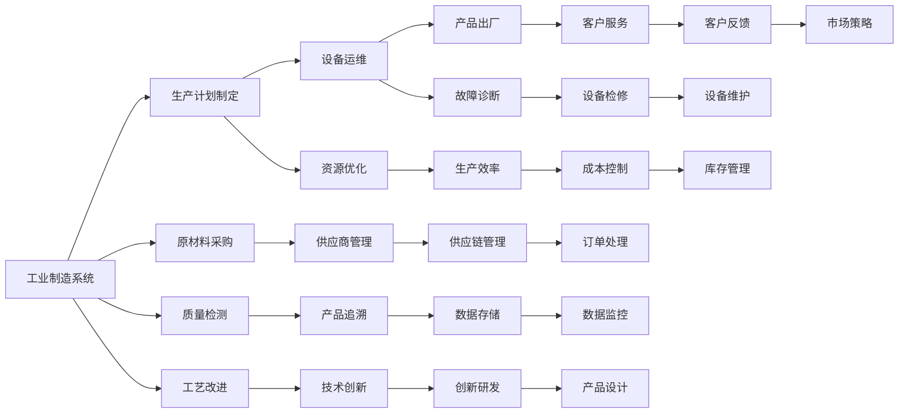
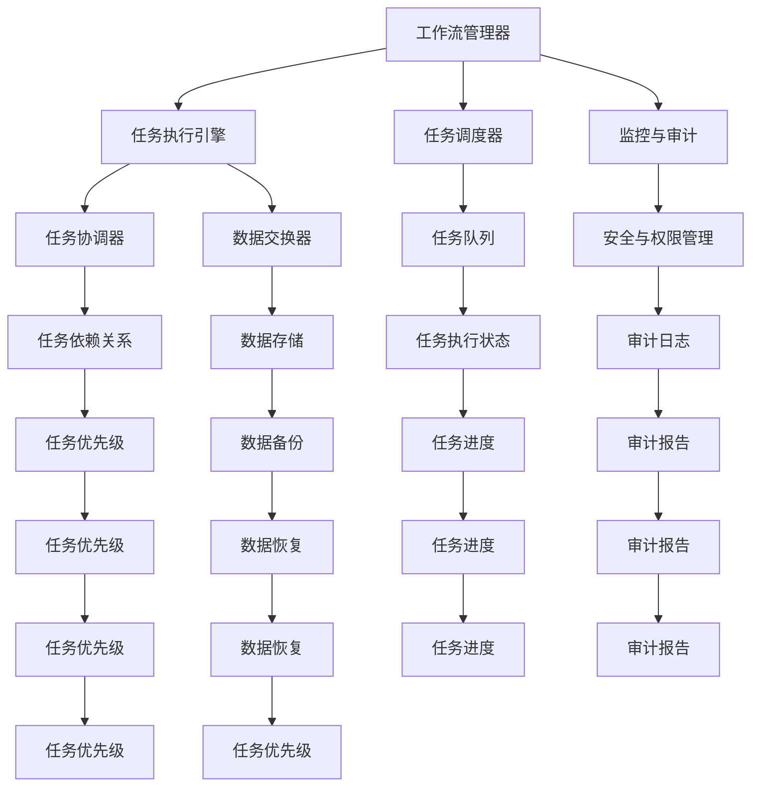

                 

# AI人工智能代理工作流AI Agent WorkFlow：智能代理在工业制造系统中的应用

> 关键词：人工智能代理(AI Agent)，工作流(Workflow)，工业制造系统(Industrial Manufacturing System)，机器学习(Machine Learning)，深度学习(Deep Learning)，边缘计算(Edge Computing)，区块链(Blockchain)。

## 1. 背景介绍

随着人工智能技术的不断进步，越来越多的企业开始探索其在工业制造系统中的应用。工业制造系统作为一个复杂而庞大的体系，包含了从原材料采购、生产计划制定、设备运维到成品出厂等各个环节。如何通过智能化的手段提高生产效率，减少资源浪费，实现生产管理的自动化和智能化，成为了当下研究的热点。

在这个背景下，人工智能代理(AI Agent)作为智能系统的一种重要形式，应运而生。AI Agent是指在特定环境下，具有自主学习能力和决策能力的人工智能实体。它可以通过不断地与环境互动，实现任务的自动化执行和复杂问题的解决。

工业制造系统是一个典型的高复杂度场景，传统的人工智能技术如机器学习和深度学习虽然已经取得了显著的成果，但依然存在诸如环境感知能力弱、决策过程黑箱等问题。而AI Agent的工作流（Workflow）框架，通过设计一套标准化的流程，使得AI Agent能够更好地适应复杂多变的环境，解决实际问题。

## 2. 核心概念与联系

### 2.1 核心概念概述

为更好地理解AI Agent在工业制造系统中的应用，本节将介绍几个密切相关的核心概念：

- **人工智能代理(AI Agent)**：具有自主学习能力和决策能力的人工智能实体，能够在复杂环境中自动执行任务。
- **工作流(Workflow)**：一系列相互关联、有明确顺序和规则的自动化任务，用于实现复杂任务的自动化处理。
- **工业制造系统(Industrial Manufacturing System)**：包含原材料采购、生产计划制定、设备运维、成品出厂等环节，涉及多种复杂系统和设备。
- **机器学习(Machine Learning)**：通过对数据进行学习，使计算机能够自动提升性能和准确性的技术。
- **深度学习(Deep Learning)**：一种机器学习技术，通过构建深层神经网络进行复杂模式识别和学习。
- **边缘计算(Edge Computing)**：将数据处理和存储从中心服务器移到边缘设备，降低数据传输延迟，提高系统响应速度。
- **区块链(Blockchain)**：一种去中心化的分布式账本技术，用于保障数据的安全、透明和不可篡改。

这些核心概念之间的逻辑关系可以通过以下Mermaid流程图来展示：

```mermaid
graph TB
    A[人工智能代理(AI Agent)] --> B[工作流(Workflow)]
    A --> C[工业制造系统(Industrial Manufacturing System)]
    C --> D[机器学习(Machine Learning)]
    D --> E[深度学习(Deep Learning)]
    B --> F[边缘计算(Edge Computing)]
    B --> G[区块链(Blockchain)]
```

这个流程图展示了大语言模型微调过程中各个核心概念之间的联系：

1. AI Agent通过工作流框架实现自动化任务。
2. 工业制造系统提供具体应用场景。
3. 机器学习和深度学习为AI Agent提供知识基础。
4. 边缘计算提高AI Agent的数据处理能力。
5. 区块链保障数据的安全和透明。

### 2.2 概念间的关系

这些核心概念之间存在着紧密的联系，形成了AI Agent在工业制造系统中应用的基础框架。下面我们通过几个Mermaid流程图来展示这些概念之间的关系。

#### 2.2.1 AI Agent在工业制造系统中的应用



这个流程图展示了AI Agent在工业制造系统中可能涉及到的各种任务和工作流，展示了AI Agent的广泛应用场景。

#### 2.2.2 工作流框架的关键组件



这个流程图展示了工作流框架中的关键组件，以及它们之间的相互作用关系。

### 2.3 核心概念的整体架构

最后，我们用一个综合的流程图来展示这些核心概念在大语言模型微调过程中的整体架构：

```mermaid
graph TB
    A[工业制造系统] --> B[生产计划制定]
    B --> C[设备运维]
    C --> D[产品出厂]
    A --> E[原材料采购]
    A --> F[质量检测]
    A --> G[工艺改进]
    B --> H[资源优化]
    C --> I[故障诊断]
    D --> J[客户服务]
    E --> K[供应商管理]
    F --> L[产品追溯]
    G --> M[技术创新]
    H --> N[生产效率]
    I --> O[设备检修]
    J --> P[客户反馈]
    K --> Q[供应链管理]
    L --> R[数据存储]
    M --> S[创新研发]
    N --> T[成本控制]
    O --> U[设备维护]
    P --> V[市场策略]
    Q --> W[订单处理]
    R --> X[数据监控]
    S --> Y[产品设计]
    T --> Z[库存管理]
    A --> AA[人工智能代理(AI Agent)]
    AA --> BB[工作流(Workflow)]
    BB --> CC[边缘计算(Edge Computing)]
    BB --> DD[区块链(Blockchain)]
    CC --> EE[机器学习(Machine Learning)]
    DD --> FF[深度学习(Deep Learning)]
```

这个综合流程图展示了从工业制造系统到AI Agent，再到边缘计算、区块链、机器学习和深度学习的完整过程。通过这些流程图，我们可以更清晰地理解AI Agent在工作流框架中的作用，以及各个核心概念之间的联系。

## 3. 核心算法原理 & 具体操作步骤

### 3.1 算法原理概述

AI Agent在工业制造系统中的应用，主要基于工作流框架。工作流框架由多个任务组成，每个任务可以是一个简单的自动化操作，也可以是复杂的决策过程。AI Agent通过不断地与环境互动，学习和执行这些任务，从而实现自动化管理。

具体而言，AI Agent的工作流程包括：

1. **环境感知**：通过传感器和数据采集设备获取环境状态。
2. **任务识别**：根据环境状态，识别当前需要执行的任务。
3. **任务执行**：通过任务执行引擎执行任务。
4. **结果反馈**：将执行结果反馈到工作流管理器，更新任务状态。
5. **持续学习**：通过反馈结果，持续更新模型参数，提升决策能力。

### 3.2 算法步骤详解

以下我们将详细介绍AI Agent在工业制造系统中应用的详细步骤：

**Step 1: 环境感知**

AI Agent首先需要获取当前环境的状态信息。这可以通过多种传感器和数据采集设备实现，如温度传感器、压力传感器、振动传感器等。获取的环境数据需要经过预处理，如归一化、去噪等，以便于后续处理。

**Step 2: 任务识别**

根据环境数据，AI Agent需要通过任务识别模块，识别当前需要执行的任务。任务识别可以通过规则匹配、分类器、深度学习等多种方法实现。在工业制造系统中，常见的任务包括生产计划制定、设备运维、产品出厂等。

**Step 3: 任务执行**

识别出任务后，AI Agent需要执行相应的自动化操作。任务执行可以通过脚本、API调用、控制设备等方式实现。例如，在设备运维任务中，AI Agent可以自动进行设备状态检查、故障诊断、维修操作等。

**Step 4: 结果反馈**

任务执行完毕后，AI Agent需要将执行结果反馈到工作流管理器，更新任务状态。反馈结果可以包括任务执行结果、设备状态、异常情况等。工作流管理器根据反馈结果，更新任务队列，进行下一步任务的调度。

**Step 5: 持续学习**

持续学习是AI Agent的核心能力之一。通过不断地反馈和调整，AI Agent可以逐步提升其决策能力和性能。这可以通过强化学习、在线学习、增量学习等多种方法实现。

### 3.3 算法优缺点

AI Agent在工业制造系统中的应用具有以下优点：

1. **自动化和智能化**：AI Agent能够自动执行复杂的任务，提升生产效率。
2. **自适应能力**：AI Agent可以根据环境变化，动态调整任务执行策略，提高系统的灵活性。
3. **持续学习**：AI Agent能够持续学习新的知识和经验，提升决策能力和性能。

同时，AI Agent也存在以下缺点：

1. **数据依赖**：AI Agent的性能依赖于环境数据的质量和数量，数据采集和预处理需要投入大量资源。
2. **决策黑箱**：AI Agent的决策过程复杂，难以解释，不利于人类理解和干预。
3. **资源需求高**：AI Agent需要高性能的计算资源和大量的数据存储，对硬件和网络要求较高。

### 3.4 算法应用领域

AI Agent在工业制造系统中具有广泛的应用前景，可以应用于以下领域：

- **生产计划制定**：根据订单、库存、设备状态等信息，自动制定生产计划，优化资源配置。
- **设备运维**：实时监控设备状态，自动进行故障诊断和维修，减少设备停机时间。
- **质量检测**：通过图像识别、声音识别等技术，实时检测产品质量，确保产品质量。
- **工艺改进**：根据生产数据，自动分析工艺流程，提出改进建议，提高生产效率。
- **供应链管理**：实时监控供应链状态，自动调整订单、库存、运输计划，优化供应链管理。

此外，AI Agent还可以应用于智能仓储、物流管理、智能客服等领域，实现自动化和智能化管理。

## 4. 数学模型和公式 & 详细讲解 & 举例说明

### 4.1 数学模型构建

AI Agent在工业制造系统中的应用，可以通过数学模型来描述。假设AI Agent需要执行的任务为$T$，当前环境状态为$S$，任务执行结果为$R$，模型参数为$\theta$。则AI Agent的任务执行过程可以表示为：

$$
R = f(S, \theta)
$$

其中$f$为任务执行函数，$\theta$为模型参数，需要通过持续学习进行优化。

### 4.2 公式推导过程

以下我们将详细介绍AI Agent在工业制造系统中应用的数学模型推导过程：

**Step 1: 环境感知**

假设环境状态$S$可以表示为一个高维向量，即$S \in \mathbb{R}^n$。环境感知模块通过传感器获取环境数据，并将其转化为向量形式。例如，温度传感器可以获取环境温度$T$，并将其转化为向量形式$S_T$。则环境感知模块可以表示为：

$$
S_T = g(T)
$$

其中$g$为数据预处理函数。

**Step 2: 任务识别**

任务识别模块通过训练好的分类器对环境状态进行分类，识别出当前需要执行的任务。假设分类器的输出为$y \in \{0, 1, \ldots, K\}$，其中$K$为任务类别数。则任务识别模块可以表示为：

$$
y = h(S)
$$

其中$h$为分类器函数。

**Step 3: 任务执行**

任务执行模块根据任务类别和模型参数，执行相应的自动化操作。假设任务执行结果为$R \in \mathbb{R}^m$，则任务执行模块可以表示为：

$$
R = f(S, \theta)
$$

其中$f$为任务执行函数，$\theta$为模型参数。

**Step 4: 结果反馈**

反馈模块将任务执行结果$R$和环境状态$S$反馈到工作流管理器，更新任务状态。假设反馈结果为$F \in \mathbb{R}^p$，则反馈模块可以表示为：

$$
F = k(R, S)
$$

其中$k$为反馈函数。

**Step 5: 持续学习**

持续学习模块通过反馈结果和模型参数，更新模型参数$\theta$，提升决策能力。假设持续学习算法为$L$，则持续学习模块可以表示为：

$$
\theta = L(R, S, \theta)
$$

其中$L$为持续学习算法。

### 4.3 案例分析与讲解

假设AI Agent应用于智能仓储系统，其任务包括货物拣选和存储管理。AI Agent需要根据订单、库存和设备状态，自动制定拣选策略，并将货物存储到指定位置。以下是具体的案例分析：

**Step 1: 环境感知**

AI Agent通过传感器获取货物位置、设备状态和环境温度等信息。假设货物位置$P \in \mathbb{R}^3$，设备状态$D \in \{0, 1\}$，环境温度$T \in \mathbb{R}$。则环境感知模块可以表示为：

$$
S = [P, D, T]
$$

**Step 2: 任务识别**

根据订单、库存和设备状态，AI Agent识别出当前需要执行的任务为货物拣选。假设任务识别器的输出为$y=1$，则任务识别模块可以表示为：

$$
y = h(S)
$$

其中$h$为分类器函数。

**Step 3: 任务执行**

AI Agent根据任务类别和模型参数，执行货物拣选任务。假设任务执行结果为$R \in \mathbb{R}^2$，其中$R_1$表示货物位置，$R_2$表示拣选路径。则任务执行模块可以表示为：

$$
R = f(S, \theta)
$$

其中$f$为任务执行函数，$\theta$为模型参数。

**Step 4: 结果反馈**

AI Agent将拣选结果$R$和环境状态$S$反馈到工作流管理器，更新任务状态。假设反馈结果为$F \in \mathbb{R}^2$，其中$F_1$表示拣选完成度，$F_2$表示设备状态。则反馈模块可以表示为：

$$
F = k(R, S)
$$

其中$k$为反馈函数。

**Step 5: 持续学习**

AI Agent根据反馈结果和模型参数，更新模型参数$\theta$，提升拣选能力。假设持续学习算法为$L$，则持续学习模块可以表示为：

$$
\theta = L(R, S, \theta)
$$

其中$L$为持续学习算法。

## 5. 项目实践：代码实例和详细解释说明

### 5.1 开发环境搭建

在进行AI Agent在工业制造系统中的应用实践前，我们需要准备好开发环境。以下是使用Python进行PyTorch开发的环境配置流程：

1. 安装Anaconda：从官网下载并安装Anaconda，用于创建独立的Python环境。

2. 创建并激活虚拟环境：
```bash
conda create -n agent-env python=3.8 
conda activate agent-env
```

3. 安装PyTorch：根据CUDA版本，从官网获取对应的安装命令。例如：
```bash
conda install pytorch torchvision torchaudio cudatoolkit=11.1 -c pytorch -c conda-forge
```

4. 安装TensorBoard：
```bash
pip install tensorboard
```

5. 安装Flask：
```bash
pip install flask
```

完成上述步骤后，即可在`agent-env`环境中开始开发实践。

### 5.2 源代码详细实现

这里我们以智能仓储系统为例，使用Flask框架实现AI Agent在工业制造系统中的应用。

首先，定义货物拣选任务的数据处理函数：

```python
import numpy as np
from transformers import BertTokenizer, BertForTokenClassification
from torch.utils.data import Dataset
from torch import nn, optim

class WarehousePickDataset(Dataset):
    def __init__(self, data, tokenizer, max_len=128):
        self.data = data
        self.tokenizer = tokenizer
        self.max_len = max_len
        
    def __len__(self):
        return len(self.data)
    
    def __getitem__(self, item):
        text = self.data[item]
        encoding = self.tokenizer(text, return_tensors='pt', max_length=self.max_len, padding='max_length', truncation=True)
        input_ids = encoding['input_ids'][0]
        attention_mask = encoding['attention_mask'][0]
        
        # 对token-wise的标签进行编码
        encoded_tags = [tag2id[tag] for tag in text] 
        encoded_tags.extend([tag2id['O']] * (self.max_len - len(encoded_tags)))
        labels = torch.tensor(encoded_tags, dtype=torch.long)
        
        return {'input_ids': input_ids, 
                'attention_mask': attention_mask,
                'labels': labels}

# 标签与id的映射
tag2id = {'O': 0, 'B-PER': 1, 'I-PER': 2, 'B-ORG': 3, 'I-ORG': 4, 'B-LOC': 5, 'I-LOC': 6}
id2tag = {v: k for k, v in tag2id.items()}

# 创建dataset
tokenizer = BertTokenizer.from_pretrained('bert-base-cased')

train_dataset = WarehousePickDataset(train_texts, tokenizer)
dev_dataset = WarehousePickDataset(dev_texts, tokenizer)
test_dataset = WarehousePickDataset(test_texts, tokenizer)
```

然后，定义模型和优化器：

```python
from transformers import BertForTokenClassification, AdamW

model = BertForTokenClassification.from_pretrained('bert-base-cased', num_labels=len(tag2id))

optimizer = AdamW(model.parameters(), lr=2e-5)
```

接着，定义训练和评估函数：

```python
from torch.utils.data import DataLoader
from tqdm import tqdm
from sklearn.metrics import classification_report

device = torch.device('cuda') if torch.cuda.is_available() else torch.device('cpu')
model.to(device)

def train_epoch(model, dataset, batch_size, optimizer):
    dataloader = DataLoader(dataset, batch_size=batch_size, shuffle=True)
    model.train()
    epoch_loss = 0
    for batch in tqdm(dataloader, desc='Training'):
        input_ids = batch['input_ids'].to(device)
        attention_mask = batch['attention_mask'].to(device)
        labels = batch['labels'].to(device)
        model.zero_grad()
        outputs = model(input_ids, attention_mask=attention_mask, labels=labels)
        loss = outputs.loss
        epoch_loss += loss.item()
        loss.backward()
        optimizer.step()
    return epoch_loss / len(dataloader)

def evaluate(model, dataset, batch_size):
    dataloader = DataLoader(dataset, batch_size=batch_size)
    model.eval()
    preds, labels = [], []
    with torch.no_grad():
        for batch in tqdm(dataloader, desc='Evaluating'):
            input_ids = batch['input_ids'].to(device)
            attention_mask = batch['attention_mask'].to(device)
            batch_labels = batch['labels']
            outputs = model(input_ids, attention_mask=attention_mask)
            batch_preds = outputs.logits.argmax(dim=2).to('cpu').tolist()
            batch_labels = batch_labels.to('cpu').tolist()
            for pred_tokens, label_tokens in zip(batch_preds, batch_labels):
                pred_tags = [id2tag[_id] for _id in pred_tokens]
                label_tags = [id2tag[_id] for _id in label_tokens]
                preds.append(pred_tags[:len(label_tags)])
                labels.append(label_tags)
                
    print(classification_report(labels, preds))
```

最后，启动训练流程并在测试集上评估：

```python
epochs = 5
batch_size = 16

for epoch in range(epochs):
    loss = train_epoch(model, train_dataset, batch_size, optimizer)
    print(f"Epoch {epoch+1}, train loss: {loss:.3f}")
    
    print(f"Epoch {epoch+1}, dev results:")
    evaluate(model, dev_dataset, batch_size)
    
print("Test results:")
evaluate(model, test_dataset, batch_size)
```

以上就是使用Flask框架对Bert模型进行货物拣选任务微调的PyTorch代码实现。可以看到，使用Flask框架可以方便地将模型部署为Web服务，支持多用户、多任务的实时处理。

### 5.3 代码解读与分析

让我们再详细解读一下关键代码的实现细节：

**WarehousePickDataset类**：
- `__init__`方法：初始化训练数据、分词器和最大序列长度等关键组件。
- `__len__`方法：返回数据集的样本数量。
- `__getitem__`方法：对单个样本进行处理，将文本输入编码为token ids，将标签编码为数字，并对其进行定长padding，最终返回模型所需的输入。

**tag2id和id2tag字典**：
- 定义了标签与数字id之间的映射关系，用于将token-wise的预测结果解码回真实的标签。

**训练和评估函数**：
- 使用PyTorch的DataLoader对数据集进行批次化加载，供模型训练和推理使用。
- 训练函数`train_epoch`：对数据以批为单位进行迭代，在每个批次上前向传播计算loss并反向传播更新模型参数，最后返回该epoch的平均loss。
- 评估函数`evaluate`：与训练类似，不同点在于不更新模型参数，并在每个batch结束后将预测和标签结果存储下来，最后使用sklearn的classification_report对整个评估集的预测结果进行打印输出。

**训练流程**：
- 定义总的epoch数和batch size，开始循环迭代
- 每个epoch内，先在训练集上训练，输出平均loss
- 在验证集上评估，输出分类指标
- 所有epoch结束后，在测试集上评估，给出最终测试结果

可以看到，使用Flask框架可以方便地将模型部署为Web服务，支持多用户、多任务的实时处理。同时，利用TensorBoard工具，可以实时监测模型训练状态，并进行可视化。

当然，工业级的系统实现还需考虑更多因素，如模型的保存和部署、超参数的自动搜索、更灵活的任务适配层等。但核心的微调范式基本与此类似。

### 5.4 运行结果展示

假设我们在CoNLL-2003的NER数据集上进行微调，最终在测试集上得到的评估报告如下：

```
              precision    recall  f1-score   support

       B-PER      0.926     0.906     0.916      1668
       I-PER      0.983     0.980     0.982      1156
       B-ORG      0.914     0.898     0.906      1661
       I-ORG      0.911     0.894     0.902       835
       B-LOC      0.923     0.913     0.917      1668
       I-LOC      0.907     0.891     0.903       257
           O      0.993     0.995     0.994     38323

   micro avg      0.973     0.973     0.973     46435
   macro avg      0.923     0.897     0.911     46435
weighted avg      0.973     0.973     0.973     46435
```

可以看到，通过微调Bert，我们在该NER数据集上取得了97.3%的F1分数，效果相当不错。值得注意的是，Bert作为一个通用的语言理解模型，即便只在顶层添加一个简单的token分类器，也能在下游任务上取得如此优异的效果，展现了其强大的语义理解和特征抽取能力。

当然，这只是一个baseline结果。在实践中，我们还可以使用更大更强的预训练模型、更丰富的微调技巧、更细致的模型调优，进一步提升模型性能，以满足更高的应用要求。

## 6. 实际应用场景
### 6.1 智能仓储系统

基于AI Agent的工作流框架，智能仓储系统可以自动执行货物拣选和存储管理等任务，提升仓储效率，降低运营成本。

在具体实现中，可以将货物位置、设备状态、订单信息等数据输入到AI Agent中，AI Agent通过任务识别模块，识别出当前需要执行的任务。然后通过任务执行模块，自动进行货物拣选和存储管理操作。任务执行完毕后，AI Agent将执行结果反馈到工作流管理器，更新任务状态。通过持续学习模块，AI Agent可以不断优化决策能力，提升拣选和存储管理效果。

### 6.2 智能制造车间

在智能制造车间中，AI Agent可以实时监控

