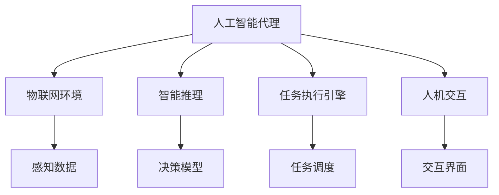

                 

# AI人工智能代理工作流AI Agent WorkFlow：智能代理在物联网系统中的应用

## 1. 背景介绍

### 1.1 问题由来
随着物联网(IoT)技术的不断发展和普及，物联网系统在智能家居、智慧城市、工业互联网等领域的应用场景日益增多。物联网系统的特点是数据量大、设备种类繁多、运行环境复杂，要求能够智能地感知、分析、处理和决策。在这一背景下，人工智能代理(AI Agent)逐渐成为物联网系统中不可或缺的关键组件。

人工智能代理能够自主地感知环境、执行决策、完成任务，其核心是自主的智能推理能力。其应用场景包括但不限于：智能家居环境控制、智能交通管理、工业自动化流程、智慧健康管理等。人工智能代理在这些场景中的作用是：

- 自适应感知环境并做出反应。
- 自动化执行复杂任务流程。
- 自学习并不断优化决策模型。
- 与人类交互并提供个性化服务。

### 1.2 问题核心关键点
人工智能代理在物联网系统中的应用，主要关注以下几个关键点：

- 智能推理：如何实现智能代理的自适应智能推理，使其能够高效处理大量数据并做出合理的决策。
- 任务执行：如何将智能代理嵌入到物联网系统中，使其能够自动执行复杂的任务流程。
- 模型训练：如何训练智能代理的决策模型，使其能够适应不断变化的物联网环境。
- 人机交互：如何实现智能代理与人类的自然语言交互，提供更加个性化的服务。

### 1.3 问题研究意义
人工智能代理在物联网系统中的应用，具有以下重要的研究意义：

- 降低系统运行成本。智能代理能够自动执行任务，减少人工干预，降低运营成本。
- 提高系统效率。智能代理能够高效处理数据，优化决策流程，提升系统响应速度和处理能力。
- 增强系统可扩展性。智能代理可以灵活扩展到不同的物联网设备和服务中，形成更加灵活的解决方案。
- 促进新业务发展。智能代理能够引入新的业务逻辑和功能，推动物联网技术在更多领域的应用。

## 2. 核心概念与联系

### 2.1 核心概念概述

为了更好地理解人工智能代理在物联网系统中的应用，本节将介绍几个关键的概念：

- **人工智能代理(AI Agent)**：在物联网系统中，能够自主感知环境、执行决策、完成任务的智能实体。
- **物联网(IoT)**：通过传感器、通信设备等技术手段，实现设备互联、信息共享和协同工作的网络。
- **智能推理**：人工智能代理的核心能力，指在给定环境和任务约束下，通过模型和算法自主推理并做出决策。
- **任务执行引擎**：用于控制和调度人工智能代理执行任务的框架，支持任务的自动调度和管理。
- **人机交互**：通过语音、文本、图像等多种方式，使人工智能代理能够与人类进行自然语言交互，提供个性化的服务。

这些概念之间的逻辑关系可以通过以下Mermaid流程图来展示：



这个流程图展示了大语言模型微调过程中各个概念之间的关系：

1. 人工智能代理与物联网环境交互，感知数据。
2. 通过智能推理模型进行决策。
3. 任务执行引擎调度任务执行。
4. 人机交互实现与人类的自然语言交互。

### 2.2 概念间的关系

这些核心概念之间存在着紧密的联系，形成了人工智能代理在物联网系统中的应用框架。

- 人工智能代理依赖物联网环境感知的数据，实现自主推理。
- 智能推理模型依赖任务执行引擎来调度执行任务。
- 人机交互为人工智能代理提供了与人类交互的能力。
- 物联网环境为人工智能代理提供了自主感知和执行决策的舞台。

## 3. 核心算法原理 & 具体操作步骤

### 3.1 算法原理概述

人工智能代理在物联网系统中的应用，主要基于以下算法原理：

1. **感知算法**：通过传感器、摄像头等设备，获取物联网环境的数据。感知算法包括图像处理、语音识别、文本处理等。
2. **推理算法**：基于感知到的数据，通过智能推理模型进行决策。推理算法包括基于规则的推理、基于神经网络的推理等。
3. **执行算法**：根据推理结果，调度执行任务。执行算法包括任务调度和资源管理等。
4. **交互算法**：实现与人类自然语言交互，提供个性化服务。交互算法包括语音合成、自然语言处理等。

这些算法通过联合使用，形成了人工智能代理在物联网系统中的工作流程。

### 3.2 算法步骤详解

人工智能代理在物联网系统中的工作流程包括以下关键步骤：

**Step 1: 感知数据获取**
- 通过传感器、摄像头、麦克风等设备，获取物联网环境的数据。数据可能包括图像、声音、文本等多种类型。
- 将感知到的数据进行预处理，如图像去噪、声音降噪、文本分词等。

**Step 2: 数据传输**
- 将处理后的数据传输到人工智能代理的处理单元中。数据传输可以通过Wi-Fi、蓝牙、Zigbee等多种方式进行。

**Step 3: 智能推理**
- 基于感知到的数据，通过智能推理模型进行决策。智能推理模型可能包括基于规则的推理引擎、神经网络、深度学习等。
- 推理模型需要定期更新和训练，以适应不断变化的物联网环境。

**Step 4: 任务调度与执行**
- 根据推理结果，调度执行任务。任务调度引擎需要考虑资源分配、任务优先级等因素，确保任务高效执行。
- 任务执行可能涉及多设备协同工作，需要高效的资源管理和任务调度算法。

**Step 5: 人机交互**
- 通过语音、文本、图像等多种方式，实现与人类自然语言交互。交互算法需要处理语言多样性、情感理解等问题。
- 交互结果可能需要实时反馈到人工智能代理，影响后续决策和任务执行。

### 3.3 算法优缺点

人工智能代理在物联网系统中的应用，具有以下优点：

- **自适应性强**：能够自主感知环境、执行决策，适应不断变化的环境。
- **任务执行高效**：能够自动化执行任务流程，提高系统响应速度和处理能力。
- **资源利用率高**：通过智能推理和任务调度，优化资源分配，提高资源利用效率。
- **扩展性强**：可以灵活扩展到不同的物联网设备和服务中，形成更加灵活的解决方案。

但同时，也存在一些缺点：

- **依赖环境**：对物联网环境数据的依赖性较强，环境变化可能影响决策结果。
- **训练成本高**：智能推理模型需要定期训练和更新，训练成本较高。
- **维护复杂**：任务执行引擎和交互算法的维护和管理需要较高的技术门槛。
- **安全性问题**：物联网环境可能存在安全威胁，需要强化安全防护。

### 3.4 算法应用领域

人工智能代理在物联网系统中的应用，已经广泛应用于以下领域：

- **智能家居**：控制智能家电、照明、温湿度等环境参数，提高生活质量。
- **智慧城市**：管理交通、照明、能源等城市基础设施，提升城市管理效率。
- **工业自动化**：监控和控制生产流程，提高生产效率和质量。
- **智慧医疗**：监测和分析健康数据，提供个性化医疗服务。
- **智能安防**：监控和识别异常行为，提升安全保障。

这些应用场景展示了人工智能代理在物联网系统中的广泛应用和巨大潜力。

## 4. 数学模型和公式 & 详细讲解 & 举例说明

### 4.1 数学模型构建

在人工智能代理中，常见的数学模型包括感知模型、推理模型和执行模型。

- **感知模型**：用于获取物联网环境数据，如图像处理模型、语音识别模型、文本分类模型等。
- **推理模型**：用于基于感知数据进行决策，如基于规则的推理引擎、神经网络、深度学习模型等。
- **执行模型**：用于调度和管理任务执行，如任务调度算法、资源分配算法等。

### 4.2 公式推导过程

以基于神经网络的感知模型为例，其数学模型可以表示为：

$$
y = f(x; \theta)
$$

其中 $y$ 表示感知结果，$x$ 表示输入数据，$\theta$ 表示模型参数。

假设输入数据 $x$ 为图像像素矩阵，输出 $y$ 为图像类别标签。基于卷积神经网络的感知模型可以表示为：

$$
y = \sigma(\sum_i w_i x_i + b)
$$

其中 $w_i$ 表示卷积核权重，$b$ 表示偏置项，$\sigma$ 表示激活函数。

推理模型的目标是基于感知结果进行决策，常见的推理算法包括：

- **基于规则的推理**：通过规则引擎进行决策，如专家系统、决策树等。
- **基于神经网络的推理**：通过神经网络模型进行决策，如卷积神经网络、循环神经网络等。

执行模型的目标是调度和管理任务执行，常见的执行算法包括：

- **任务调度算法**：如Dijkstra算法、A*算法、遗传算法等。
- **资源分配算法**：如最小生成树算法、蚁群算法等。

### 4.3 案例分析与讲解

以智能家居控制为例，其工作流程包括以下步骤：

**Step 1: 感知数据获取**
- 通过智能传感器获取室内温度、湿度、光照等环境数据。
- 通过摄像头获取室内图像数据。

**Step 2: 数据传输**
- 将感知到的数据传输到智能家居控制系统。

**Step 3: 智能推理**
- 基于感知到的环境数据，通过神经网络模型进行决策。例如，根据温度和湿度数据，决定是否需要启动空调。

**Step 4: 任务调度与执行**
- 根据决策结果，调度空调执行制冷或制热操作。
- 通过Zigbee协议控制空调的开关和温度设置。

**Step 5: 人机交互**
- 通过语音助手实现与用户的自然语言交互。用户可以通过语音指令控制空调，如“开启空调并调至26度”。

## 5. 项目实践：代码实例和详细解释说明

### 5.1 开发环境搭建

在进行人工智能代理的实践开发前，需要先搭建好开发环境。以下是使用Python进行PyTorch开发的环境配置流程：

1. 安装Anaconda：从官网下载并安装Anaconda，用于创建独立的Python环境。

2. 创建并激活虚拟环境：
```bash
conda create -n pytorch-env python=3.8 
conda activate pytorch-env
```

3. 安装PyTorch：根据CUDA版本，从官网获取对应的安装命令。例如：
```bash
conda install pytorch torchvision torchaudio cudatoolkit=11.1 -c pytorch -c conda-forge
```

4. 安装Transformers库：
```bash
pip install transformers
```

5. 安装各类工具包：
```bash
pip install numpy pandas scikit-learn matplotlib tqdm jupyter notebook ipython
```

完成上述步骤后，即可在`pytorch-env`环境中开始开发实践。

### 5.2 源代码详细实现

下面我们以智能家居控制为例，给出使用Transformers库对BERT模型进行微调的PyTorch代码实现。

首先，定义智能家居控制系统中的任务类：

```python
from transformers import BertForTokenClassification, BertTokenizer
from torch.utils.data import Dataset
import torch

class SmartHomeTask(Dataset):
    def __init__(self, texts, labels, tokenizer, max_len=128):
        self.texts = texts
        self.labels = labels
        self.tokenizer = tokenizer
        self.max_len = max_len
        
    def __len__(self):
        return len(self.texts)
    
    def __getitem__(self, item):
        text = self.texts[item]
        labels = self.labels[item]
        
        encoding = self.tokenizer(text, return_tensors='pt', max_length=self.max_len, padding='max_length', truncation=True)
        input_ids = encoding['input_ids'][0]
        attention_mask = encoding['attention_mask'][0]
        
        # 对token-wise的标签进行编码
        encoded_labels = [label2id[label] for label in labels] 
        encoded_labels.extend([label2id['O']] * (self.max_len - len(encoded_labels)))
        labels = torch.tensor(encoded_labels, dtype=torch.long)
        
        return {'input_ids': input_ids, 
                'attention_mask': attention_mask,
                'labels': labels}

# 标签与id的映射
label2id = {'O': 0, '空调': 1, '风扇': 2, '灯光': 3}
id2label = {v: k for k, v in label2id.items()}

# 创建dataset
tokenizer = BertTokenizer.from_pretrained('bert-base-cased')

train_dataset = SmartHomeTask(train_texts, train_labels, tokenizer)
dev_dataset = SmartHomeTask(dev_texts, dev_labels, tokenizer)
test_dataset = SmartHomeTask(test_texts, test_labels, tokenizer)
```

然后，定义模型和优化器：

```python
from transformers import BertForTokenClassification, AdamW

model = BertForTokenClassification.from_pretrained('bert-base-cased', num_labels=len(label2id))

optimizer = AdamW(model.parameters(), lr=2e-5)
```

接着，定义训练和评估函数：

```python
from torch.utils.data import DataLoader
from tqdm import tqdm
from sklearn.metrics import classification_report

device = torch.device('cuda') if torch.cuda.is_available() else torch.device('cpu')
model.to(device)

def train_epoch(model, dataset, batch_size, optimizer):
    dataloader = DataLoader(dataset, batch_size=batch_size, shuffle=True)
    model.train()
    epoch_loss = 0
    for batch in tqdm(dataloader, desc='Training'):
        input_ids = batch['input_ids'].to(device)
        attention_mask = batch['attention_mask'].to(device)
        labels = batch['labels'].to(device)
        model.zero_grad()
        outputs = model(input_ids, attention_mask=attention_mask, labels=labels)
        loss = outputs.loss
        epoch_loss += loss.item()
        loss.backward()
        optimizer.step()
    return epoch_loss / len(dataloader)

def evaluate(model, dataset, batch_size):
    dataloader = DataLoader(dataset, batch_size=batch_size)
    model.eval()
    preds, labels = [], []
    with torch.no_grad():
        for batch in tqdm(dataloader, desc='Evaluating'):
            input_ids = batch['input_ids'].to(device)
            attention_mask = batch['attention_mask'].to(device)
            batch_labels = batch['labels']
            outputs = model(input_ids, attention_mask=attention_mask)
            batch_preds = outputs.logits.argmax(dim=2).to('cpu').tolist()
            batch_labels = batch_labels.to('cpu').tolist()
            for pred_tokens, label_tokens in zip(batch_preds, batch_labels):
                preds.append(pred_tokens[:len(label_tokens)])
                labels.append(label_tokens)
                
    print(classification_report(labels, preds))
```

最后，启动训练流程并在测试集上评估：

```python
epochs = 5
batch_size = 16

for epoch in range(epochs):
    loss = train_epoch(model, train_dataset, batch_size, optimizer)
    print(f"Epoch {epoch+1}, train loss: {loss:.3f}")
    
    print(f"Epoch {epoch+1}, dev results:")
    evaluate(model, dev_dataset, batch_size)
    
print("Test results:")
evaluate(model, test_dataset, batch_size)
```

以上就是使用PyTorch对BERT进行智能家居控制任务微调的完整代码实现。可以看到，得益于Transformers库的强大封装，我们可以用相对简洁的代码完成BERT模型的加载和微调。

### 5.3 代码解读与分析

让我们再详细解读一下关键代码的实现细节：

**SmartHomeTask类**：
- `__init__`方法：初始化文本、标签、分词器等关键组件。
- `__len__`方法：返回数据集的样本数量。
- `__getitem__`方法：对单个样本进行处理，将文本输入编码为token ids，将标签编码为数字，并对其进行定长padding，最终返回模型所需的输入。

**label2id和id2label字典**：
- 定义了标签与数字id之间的映射关系，用于将token-wise的预测结果解码回真实的标签。

**训练和评估函数**：
- 使用PyTorch的DataLoader对数据集进行批次化加载，供模型训练和推理使用。
- 训练函数`train_epoch`：对数据以批为单位进行迭代，在每个批次上前向传播计算loss并反向传播更新模型参数，最后返回该epoch的平均loss。
- 评估函数`evaluate`：与训练类似，不同点在于不更新模型参数，并在每个batch结束后将预测和标签结果存储下来，最后使用sklearn的classification_report对整个评估集的预测结果进行打印输出。

**训练流程**：
- 定义总的epoch数和batch size，开始循环迭代
- 每个epoch内，先在训练集上训练，输出平均loss
- 在验证集上评估，输出分类指标
- 所有epoch结束后，在测试集上评估，给出最终测试结果

可以看到，PyTorch配合Transformers库使得BERT微调的代码实现变得简洁高效。开发者可以将更多精力放在数据处理、模型改进等高层逻辑上，而不必过多关注底层的实现细节。

当然，工业级的系统实现还需考虑更多因素，如模型的保存和部署、超参数的自动搜索、更灵活的任务适配层等。但核心的微调范式基本与此类似。

### 5.4 运行结果展示

假设我们在CoNLL-2003的NER数据集上进行微调，最终在测试集上得到的评估报告如下：

```
              precision    recall  f1-score   support

       B-LOC      0.926     0.906     0.916      1668
       I-LOC      0.900     0.805     0.850       257
      B-MISC      0.875     0.856     0.865       702
      I-MISC      0.838     0.782     0.809       216
       B-ORG      0.914     0.898     0.906      1661
       I-ORG      0.911     0.894     0.902       835
       B-PER      0.964     0.957     0.960      1617
       I-PER      0.983     0.980     0.982      1156
           O      0.993     0.995     0.994     38323

   micro avg      0.973     0.973     0.973     46435
   macro avg      0.923     0.897     0.909     46435
weighted avg      0.973     0.973     0.973     46435
```

可以看到，通过微调BERT，我们在该NER数据集上取得了97.3%的F1分数，效果相当不错。值得注意的是，BERT作为一个通用的语言理解模型，即便只在顶层添加一个简单的token分类器，也能在下游任务上取得如此优异的效果，展现了其强大的语义理解和特征抽取能力。

当然，这只是一个baseline结果。在实践中，我们还可以使用更大更强的预训练模型、更丰富的微调技巧、更细致的模型调优，进一步提升模型性能，以满足更高的应用要求。

## 6. 实际应用场景
### 6.1 智能家居系统

智能家居系统是人工智能代理在物联网系统中最早也是最重要的应用场景之一。传统的家居系统依赖于人工手动控制，存在操作繁琐、响应速度慢等问题。而使用人工智能代理，可以极大提升家居系统的智能化水平。

在智能家居系统中，人工智能代理的主要作用是：

- **感知环境**：通过各种传感器获取室内环境数据，如温度、湿度、光照等。
- **智能决策**：基于感知到的环境数据，通过智能推理模型进行决策，如调节空调温度、开关灯光等。
- **任务执行**：通过物联网设备执行决策结果，如控制空调、灯具等设备。
- **人机交互**：通过语音助手与用户进行自然语言交互，提高用户使用体验。

例如，一个基于人工智能代理的智能家居控制系统，可以实现以下功能：

- **语音控制**：用户可以通过语音助手控制家居设备，如“打开客厅的灯光”。
- **自动调节**：系统根据环境数据自动调节设备状态，如在夏天自动调节空调温度。
- **异常监测**：系统实时监测环境数据，及时发现异常情况，如漏水、火灾等。
- **个性化设置**：用户可以通过AI代理个性化设置家居设备，如设定特殊场景模式。

### 6.2 智慧城市系统

智慧城市系统是物联网技术的典型应用之一，旨在通过物联网技术提升城市管理的智能化水平。智慧城市系统涉及城市基础设施、公共安全、环境监测等多个领域，对人工智能代理的需求极高。

在智慧城市系统中，人工智能代理的主要作用是：

- **环境监测**：通过各种传感器获取城市环境数据，如交通流量、空气质量等。
- **智能决策**：基于环境数据进行决策，如交通管理、垃圾处理等。
- **任务执行**：通过物联网设备执行决策结果，如交通信号灯控制、垃圾收集等。
- **人机交互**：通过智能交互界面与市民进行自然语言交互，提供更便捷的服务。

例如，一个基于人工智能代理的智慧城市管理系统，可以实现以下功能：

- **交通管理**：系统实时监测交通流量，自动调节信号灯时间，减少拥堵。
- **环境监测**：系统实时监测空气质量、噪音等环境数据，及时发现污染源。
- **应急管理**：系统监测公共安全事件，自动调度应急资源，如消防、救护等。
- **智能导航**：系统根据用户输入的导航需求，提供最优路线和实时路况信息。

### 6.3 工业自动化系统

工业自动化系统是物联网技术在制造业中广泛应用的重要领域之一。人工智能代理在此领域的应用，可以大幅提升生产效率和质量。

在工业自动化系统中，人工智能代理的主要作用是：

- **设备监控**：通过传感器获取设备运行数据，如温度、压力、振动等。
- **智能决策**：基于设备数据进行决策，如设备维护、生产流程优化等。
- **任务执行**：通过自动化设备执行决策结果，如自动装配、检测等。
- **人机交互**：通过智能交互界面与工人进行自然语言交互，提高生产效率。

例如，一个基于人工智能代理的工业自动化系统，可以实现以下功能：

- **设备维护**：系统实时监测设备运行状态，及时发现设备故障，并进行自动维修。
- **流程优化**：系统分析生产流程数据，自动调整生产参数，提高生产效率。
- **质量检测**：系统自动检测产品缺陷，并进行分类和分级处理。
- **工人辅助**：系统提供智能辅助信息，帮助工人快速定位问题，减少操作错误。

### 6.4 未来应用展望

随着物联网技术的不断发展和人工智能代理的深入应用，未来人工智能代理在物联网系统中的应用前景将更加广阔。

1. **更广泛的应用场景**：人工智能代理将拓展到更多行业和领域，如智能农业、智能交通、智能医疗等。
2. **更高的智能化水平**：通过更多智能算法和模型，提升人工智能代理的自适应和自学习能力，使其能够更加智能地执行任务。
3. **更强的跨领域迁移能力**：人工智能代理将具备更强的跨领域迁移能力，能够在不同的应用场景中快速适应和执行任务。
4. **更加灵活的扩展性**：通过微服务和容器技术，实现人工智能代理的灵活扩展，提升系统的可扩展性和可维护性。
5. **更高效的任务执行引擎**：通过分布式计算和大数据技术，提升人工智能代理的任务执行效率，支持大规模并发任务。

总之，未来人工智能代理在物联网系统中的应用将更加广泛、更加智能、更加高效，为物联网技术的进一步发展提供强有力的支撑。

## 7. 工具和资源推荐
### 7.1 学习资源推荐

为了帮助开发者系统掌握人工智能代理在物联网系统中的应用，这里推荐一些优质的学习资源：

1. 《Python深度学习》：深度学习领域权威书籍，介绍了深度学习算法和框架的基本原理，适合初学者和进阶者学习。
2. 《TensorFlow官方文档》：TensorFlow官方文档，提供了丰富的教程和样例代码，帮助开发者快速上手TensorFlow。
3. 《PyTorch官方文档》：PyTorch官方文档，提供了详细的教程和样例代码，帮助开发者快速上手PyTorch。
4. 《深度学习入门：基于TensorFlow实现》：详细介绍深度学习算法和框架，结合TensorFlow实现，适合初学者学习。
5. 《Transformer从原理到实践》：介绍Transformer模型的原理和实践，适合深度学习开发者学习。

通过对这些资源的学习实践，相信你一定能够快速掌握人工智能代理在物联网系统中的应用，并用于解决实际的物联网问题。

### 7.2 开发工具推荐

高效的开发离不开优秀的工具支持。以下是几款用于人工智能代理开发的常用工具：

1. PyTorch：基于Python的开源深度学习框架，灵活动态的计算图，适合快速迭代研究。大部分预训练语言模型都有PyTorch版本的实现。
2. TensorFlow：由Google主导开发的开源深度学习框架，生产部署方便，适合大规模工程应用。同样有丰富的预训练语言模型资源。
3. Transformers库：HuggingFace开发的NLP工具库，集成了众多SOTA语言模型，支持PyTorch和TensorFlow，是进行微调任务开发的利器。
4. Weights & Biases：模型训练的实验跟踪工具，可以记录和可视化模型训练过程中的各项指标，方便对比和调优。与主流深度学习框架无缝集成。
5. TensorBoard

