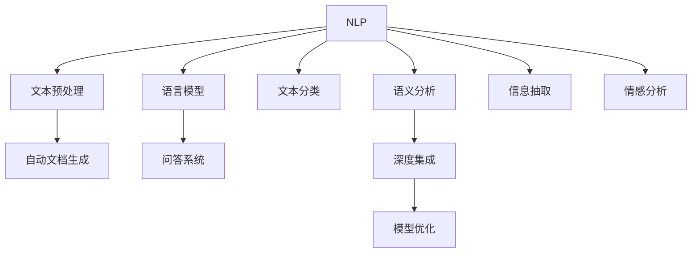
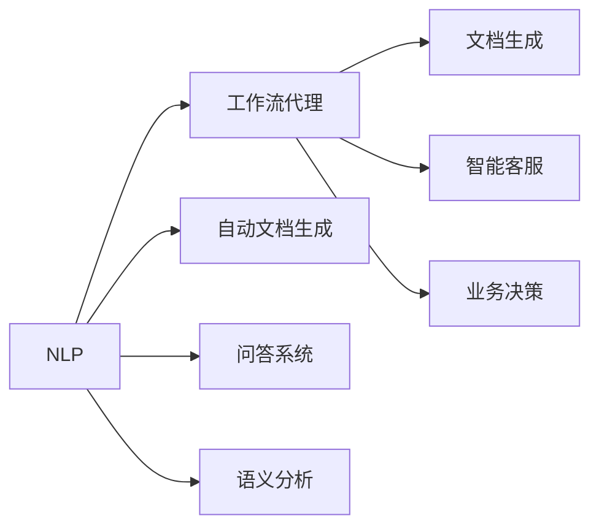
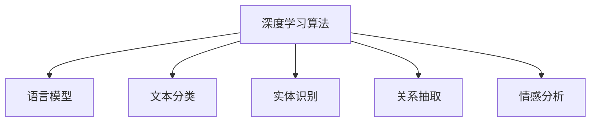
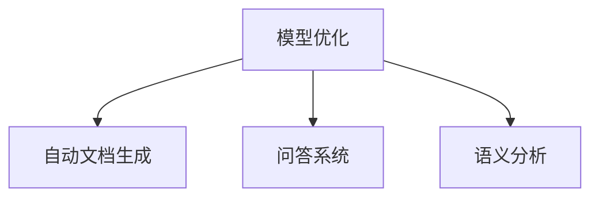
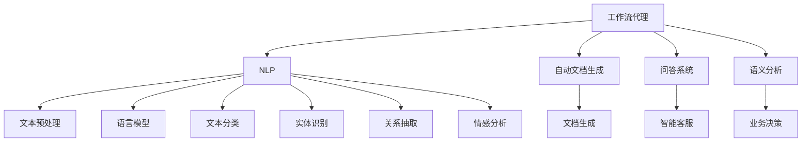

                 

# AI人工智能深度学习算法：自然语言处理在工作流代理中的运用

> 关键词：自然语言处理, 工作流代理, 深度学习算法, 自动文档生成, 问答系统, 语义分析, 深度集成, 模型优化

## 1. 背景介绍

### 1.1 问题由来
随着企业信息化建设逐步深入，信息孤岛、数据鸿沟、系统协作效率低下等问题越来越凸显。工作流代理(Workflow Agent)作为一种智能自动化技术，能够帮助企业打破信息孤岛，加速文档生成，提升协同效率，助力企业数字化转型。然而，传统的工作流代理系统往往只能处理结构化数据，对于自然语言文本的自动生成、分析和理解能力较弱，无法高效处理非结构化文本数据，导致用户体验不佳。

### 1.2 问题核心关键点
自然语言处理(Natural Language Processing, NLP)作为人工智能(AI)的重要分支，是实现工作流代理智能化的关键技术。NLP主要研究计算机如何理解、生成、分析自然语言文本。其中，自动文档生成、问答系统、语义分析等技术，能够提升工作流代理在处理非结构化文本数据时的能力。因此，NLP技术成为提升工作流代理智能化水平的关键。

### 1.3 问题研究意义
将NLP技术应用于工作流代理中，可以显著提升系统在处理非结构化文本数据时的自动化水平，提升企业的文档生成、协同效率和业务决策支持能力。NLP技术还可以帮助企业从海量非结构化文本数据中挖掘有价值的信息，辅助业务决策，提升市场竞争力。

## 2. 核心概念与联系

### 2.1 核心概念概述

为更好地理解NLP技术在工作流代理中的运用，本节将介绍几个密切相关的核心概念：

- 自然语言处理(NLP)：研究计算机如何理解、生成、分析自然语言文本的技术。NLP包括文本预处理、语言模型、文本分类、语义分析、信息抽取、情感分析等多个子领域。

- 工作流代理(Workflow Agent)：一种智能自动化技术，能够基于规则或机器学习模型，自动执行、监控、优化企业工作流中的各项任务，提升业务协作效率。

- 深度学习算法：一种基于神经网络的学习方法，能够自动学习数据特征，构建复杂模型，应用于图像识别、语音识别、文本生成等任务。

- 自动文档生成(Automatic Document Generation)：使用NLP技术自动生成各类文档文本，如报告、合同、邮件等。

- 问答系统(Question Answering)：使用NLP技术回答用户自然语言提问，如智能客服、智能助手等。

- 语义分析(Semantic Analysis)：分析文本语义，提取文本中的关键信息，如实体识别、关系抽取等。

- 深度集成(Deep Integration)：将NLP技术与工作流代理技术进行深度融合，提升系统的智能化水平。

- 模型优化(Model Optimization)：针对特定应用场景，对NLP模型进行优化，提升模型的推理速度、准确率和资源利用率。

这些核心概念之间的逻辑关系可以通过以下Mermaid流程图来展示：



这个流程图展示了大语言模型微调过程中各个核心概念之间的关系：

1. NLP技术包括文本预处理、语言模型、文本分类等多个子领域，用于处理和理解自然语言文本。
2. 自动文档生成、问答系统和语义分析等技术，是基于NLP技术的具体应用。
3. 深度集成将NLP技术与工作流代理进行深度融合，提升系统的智能化水平。
4. 模型优化是对NLP模型进行优化，提高模型的性能和应用效率。

### 2.2 概念间的关系

这些核心概念之间存在着紧密的联系，形成了工作流代理的NLP技术应用框架。下面我们通过几个Mermaid流程图来展示这些概念之间的关系。

#### 2.2.1 工作流代理的NLP应用范式



这个流程图展示了NLP技术在工作流代理中的应用范式。NLP技术用于处理和理解文本，自动文档生成、问答系统和语义分析等技术，是基于NLP技术的具体应用。

#### 2.2.2 深度学习算法在NLP中的应用



这个流程图展示了深度学习算法在NLP中的应用。深度学习算法能够自动学习数据特征，构建复杂模型，应用于语言模型、文本分类、实体识别、关系抽取和情感分析等任务。

#### 2.2.3 模型优化在NLP中的应用



这个流程图展示了模型优化在NLP中的应用。模型优化包括参数优化、模型压缩、模型裁剪等方法，用于提高自动文档生成、问答系统和语义分析等应用的性能和资源利用率。

### 2.3 核心概念的整体架构

最后，我们用一个综合的流程图来展示这些核心概念在工作流代理NLP应用中的整体架构：



这个综合流程图展示了NLP技术在工作流代理中的应用，从文本预处理到自动文档生成、问答系统、语义分析，各环节紧密结合，构建起一个完整的NLP应用系统。

## 3. 核心算法原理 & 具体操作步骤
### 3.1 算法原理概述

自然语言处理在工作流代理中的应用，主要依赖于深度学习算法。深度学习算法通过构建复杂的神经网络模型，自动学习数据特征，实现文本预处理、语言模型、文本分类、实体识别、关系抽取、情感分析等多个任务。其中，语言模型和文本分类是NLP任务的基础，自动文档生成、问答系统和语义分析等任务则是在基础之上进行的应用。

以文本分类为例，深度学习算法通过多层神经网络构建文本分类模型，将文本特征映射到分类标签。常用的深度学习算法包括卷积神经网络(CNN)、循环神经网络(RNN)、长短时记忆网络(LSTM)、Transformer等。

以Transformer模型为例，其核心思想是自注意力机制(Self-Attention)，能够高效地处理文本序列，捕捉文本中的长距离依赖关系。Transformer模型通过多头注意力机制(Multi-Head Attention)和多层次编码器(Encoder)、解码器(Decoder)，构建起深度神经网络结构，实现复杂的文本分类任务。

### 3.2 算法步骤详解

基于深度学习算法的工作流代理NLP应用，一般包括以下几个关键步骤：

**Step 1: 数据准备**
- 收集工作流代理任务相关的自然语言文本数据，如文档、邮件、聊天记录等。
- 对文本数据进行清洗、预处理，如分词、去停用词、词干提取等。
- 将文本数据标注为对应的分类标签，构建训练集、验证集和测试集。

**Step 2: 模型构建**
- 选择合适的深度学习模型，如Transformer模型。
- 设计模型的输入输出结构，如将文本数据编码为嵌入向量。
- 定义模型的损失函数，如交叉熵损失函数。
- 设计模型的优化器，如AdamW、SGD等。

**Step 3: 模型训练**
- 使用训练集数据，对模型进行前向传播和反向传播，更新模型参数。
- 在验证集上评估模型性能，调整超参数，避免过拟合。
- 在测试集上评估模型性能，得到最终的分类精度、召回率等指标。

**Step 4: 模型评估与优化**
- 对模型进行评估，计算分类精度、召回率、F1分数等指标。
- 分析模型的误差来源，设计相应的优化方法，如数据增强、模型剪枝、迁移学习等。
- 对模型进行优化，重新训练模型，提升模型的性能。

**Step 5: 应用部署**
- 将优化后的模型封装为服务接口，供工作流代理系统调用。
- 在实际业务场景中，使用优化后的模型进行文本分类、自动文档生成、问答系统、语义分析等任务。
- 定期更新模型参数，保持模型的性能和应用效率。

### 3.3 算法优缺点

基于深度学习算法的工作流代理NLP应用，具有以下优点：

1. 自动学习能力强。深度学习算法能够自动学习数据特征，构建复杂模型，实现自动化的文本分类、自动文档生成、问答系统、语义分析等任务。
2. 模型泛化性能好。深度学习模型在大规模数据上训练，能够捕捉到数据的复杂特征，具有较好的泛化性能。
3. 应用灵活性强。深度学习模型可以通过微调或迁移学习等方法，适应不同的任务需求。

同时，深度学习算法也存在一些缺点：

1. 训练成本高。深度学习模型的训练需要大量的计算资源和时间，可能存在计算资源不足的问题。
2. 模型复杂度高。深度学习模型的结构复杂，推理速度较慢，可能存在资源利用率不足的问题。
3. 可解释性差。深度学习模型的内部机制难以解释，可能存在黑盒问题。

### 3.4 算法应用领域

基于深度学习算法的工作流代理NLP应用，在多个领域得到了广泛应用，例如：

- 自动文档生成：使用NLP技术自动生成各类文档文本，如报告、合同、邮件等。
- 问答系统：使用NLP技术回答用户自然语言提问，如智能客服、智能助手等。
- 语义分析：分析文本语义，提取文本中的关键信息，如实体识别、关系抽取等。
- 情感分析：分析文本情感倾向，评估文本情感极性。
- 聊天机器人：使用NLP技术构建智能聊天机器人，提升用户互动体验。
- 信息抽取：从文本中自动抽取有价值的信息，如从新闻中抽取事件、人物、时间等信息。
- 语音识别：使用NLP技术进行语音转文本，构建语音助手等应用。

除了上述这些经典应用外，基于深度学习算法的工作流代理NLP技术还在更多场景中得到创新性应用，如智能文档审核、智能推荐系统、智能安防监控等，为各行各业带来了新的技术突破。

## 4. 数学模型和公式 & 详细讲解 & 举例说明

### 4.1 数学模型构建

在NLP任务中，常用的深度学习模型包括卷积神经网络(CNN)、循环神经网络(RNN)、长短时记忆网络(LSTM)、Transformer等。以Transformer模型为例，其核心思想是自注意力机制(Self-Attention)，能够高效地处理文本序列，捕捉文本中的长距离依赖关系。

Transformer模型的输入是文本序列 $x=\{x_1, x_2, ..., x_n\}$，输出是文本序列的嵌入向量序列 $y=\{y_1, y_2, ..., y_n\}$。其核心结构包括多头注意力机制(Multi-Head Attention)和多层次编码器(Encoder)、解码器(Decoder)。

Transformer模型的结构如下：

$$
y = M^T * (h + V * softmax(Q * K^T))
$$

其中，$M$ 是线性变换矩阵，$h$ 是输入文本的嵌入向量序列，$V$ 是线性变换矩阵，$K$ 是查询矩阵，$T$ 是转置操作，$softmax$ 是softmax函数，$Q$ 是查询矩阵，$K$ 是键矩阵，$T$ 是转置操作。

### 4.2 公式推导过程

以Transformer模型为例，推导文本分类的损失函数和梯度更新公式。

假设模型输入为文本序列 $x=\{x_1, x_2, ..., x_n\}$，对应的标签序列为 $y=\{y_1, y_2, ..., y_n\}$，其中 $y_i$ 表示文本 $x_i$ 的分类标签。

定义模型的输出为预测分类概率分布 $p(y|x) = M(y)$，其中 $M$ 是分类层的线性变换矩阵。

定义模型的损失函数为交叉熵损失函数，表示模型预测概率分布与真实标签之间的差异：

$$
\mathcal{L} = -\sum_{i=1}^N \log p(y_i|x_i)
$$

其中，$N$ 是文本序列的长度。

在模型训练过程中，使用反向传播算法更新模型参数，计算梯度更新公式为：

$$
\frac{\partial \mathcal{L}}{\partial \theta} = -\frac{1}{N} \sum_{i=1}^N \frac{\partial \log p(y_i|x_i)}{\partial \theta}
$$

其中，$\theta$ 表示模型参数，$N$ 是文本序列的长度。

在实际应用中，通过反向传播算法计算梯度，使用优化器（如AdamW、SGD等）更新模型参数。

### 4.3 案例分析与讲解

假设我们在CoNLL-2003的NER数据集上进行文本分类，使用BERT模型进行微调。

首先，定义NER任务的训练集、验证集和测试集，并将文本数据进行预处理：

```python
from transformers import BertTokenizer
from torch.utils.data import Dataset
import torch

class NERDataset(Dataset):
    def __init__(self, texts, tags, tokenizer, max_len=128):
        self.texts = texts
        self.tags = tags
        self.tokenizer = tokenizer
        self.max_len = max_len
        
    def __len__(self):
        return len(self.texts)
    
    def __getitem__(self, item):
        text = self.texts[item]
        tags = self.tags[item]
        
        encoding = self.tokenizer(text, return_tensors='pt', max_length=self.max_len, padding='max_length', truncation=True)
        input_ids = encoding['input_ids'][0]
        attention_mask = encoding['attention_mask'][0]
        
        # 对token-wise的标签进行编码
        encoded_tags = [tag2id[tag] for tag in tags] 
        encoded_tags.extend([tag2id['O']] * (self.max_len - len(encoded_tags)))
        labels = torch.tensor(encoded_tags, dtype=torch.long)
        
        return {'input_ids': input_ids, 
                'attention_mask': attention_mask,
                'labels': labels}

# 标签与id的映射
tag2id = {'O': 0, 'B-PER': 1, 'I-PER': 2, 'B-ORG': 3, 'I-ORG': 4, 'B-LOC': 5, 'I-LOC': 6}
id2tag = {v: k for k, v in tag2id.items()}

# 创建dataset
tokenizer = BertTokenizer.from_pretrained('bert-base-cased')

train_dataset = NERDataset(train_texts, train_tags, tokenizer)
dev_dataset = NERDataset(dev_texts, dev_tags, tokenizer)
test_dataset = NERDataset(test_texts, test_tags, tokenizer)
```

然后，定义BERT模型和优化器：

```python
from transformers import BertForTokenClassification, AdamW

model = BertForTokenClassification.from_pretrained('bert-base-cased', num_labels=len(tag2id))

optimizer = AdamW(model.parameters(), lr=2e-5)
```

接着，定义训练和评估函数：

```python
from torch.utils.data import DataLoader
from tqdm import tqdm
from sklearn.metrics import classification_report

device = torch.device('cuda') if torch.cuda.is_available() else torch.device('cpu')
model.to(device)

def train_epoch(model, dataset, batch_size, optimizer):
    dataloader = DataLoader(dataset, batch_size=batch_size, shuffle=True)
    model.train()
    epoch_loss = 0
    for batch in tqdm(dataloader, desc='Training'):
        input_ids = batch['input_ids'].to(device)
        attention_mask = batch['attention_mask'].to(device)
        labels = batch['labels'].to(device)
        model.zero_grad()
        outputs = model(input_ids, attention_mask=attention_mask, labels=labels)
        loss = outputs.loss
        epoch_loss += loss.item()
        loss.backward()
        optimizer.step()
    return epoch_loss / len(dataloader)

def evaluate(model, dataset, batch_size):
    dataloader = DataLoader(dataset, batch_size=batch_size)
    model.eval()
    preds, labels = [], []
    with torch.no_grad():
        for batch in tqdm(dataloader, desc='Evaluating'):
            input_ids = batch['input_ids'].to(device)
            attention_mask = batch['attention_mask'].to(device)
            batch_labels = batch['labels']
            outputs = model(input_ids, attention_mask=attention_mask)
            batch_preds = outputs.logits.argmax(dim=2).to('cpu').tolist()
            batch_labels = batch_labels.to('cpu').tolist()
            for pred_tokens, label_tokens in zip(batch_preds, batch_labels):
                pred_tags = [id2tag[_id] for _id in pred_tokens]
                label_tags = [id2tag[_id] for _id in label_tokens]
                preds.append(pred_tags[:len(label_tags)])
                labels.append(label_tags)
                
    print(classification_report(labels, preds))
```

最后，启动训练流程并在测试集上评估：

```python
epochs = 5
batch_size = 16

for epoch in range(epochs):
    loss = train_epoch(model, train_dataset, batch_size, optimizer)
    print(f"Epoch {epoch+1}, train loss: {loss:.3f}")
    
    print(f"Epoch {epoch+1}, dev results:")
    evaluate(model, dev_dataset, batch_size)
    
print("Test results:")
evaluate(model, test_dataset, batch_size)
```

以上就是使用PyTorch对BERT模型进行NER任务微调的完整代码实现。可以看到，得益于Transformer库的强大封装，我们可以用相对简洁的代码完成BERT模型的加载和微调。

## 5. 项目实践：代码实例和详细解释说明
### 5.1 开发环境搭建

在进行微调实践前，我们需要准备好开发环境。以下是使用Python进行PyTorch开发的环境配置流程：

1. 安装Anaconda：从官网下载并安装Anaconda，用于创建独立的Python环境。

2. 创建并激活虚拟环境：
```bash
conda create -n pytorch-env python=3.8 
conda activate pytorch-env
```

3. 安装PyTorch：根据CUDA版本，从官网获取对应的安装命令。例如：
```bash
conda install pytorch torchvision torchaudio cudatoolkit=11.1 -c pytorch -c conda-forge
```

4. 安装Transformers库：
```bash
pip install transformers
```

5. 安装各类工具包：
```bash
pip install numpy pandas scikit-learn matplotlib tqdm jupyter notebook ipython
```

完成上述步骤后，即可在`pytorch-env`环境中开始微调实践。

### 5.2 源代码详细实现

下面我们以命名实体识别(NER)任务为例，给出使用Transformers库对BERT模型进行微调的PyTorch代码实现。

首先，定义NER任务的数据处理函数：

```python
from transformers import BertTokenizer
from torch.utils.data import Dataset
import torch

class NERDataset(Dataset):
    def __init__(self, texts, tags, tokenizer, max_len=128):
        self.texts = texts
        self.tags = tags
        self.tokenizer = tokenizer
        self.max_len = max_len
        
    def __len__(self):
        return len(self.texts)
    
    def __getitem__(self, item):
        text = self.texts[item]
        tags = self.tags[item]
        
        encoding = self.tokenizer(text, return_tensors='pt', max_length=self.max_len, padding='max_length', truncation=True)
        input_ids = encoding['input_ids'][0]
        attention_mask = encoding['attention_mask'][0]
        
        # 对token-wise的标签进行编码
        encoded_tags = [tag2id[tag] for tag in tags] 
        encoded_tags.extend([tag2id['O']] * (self.max_len - len(encoded_tags)))
        labels = torch.tensor(encoded_tags, dtype=torch.long)
        
        return {'input_ids': input_ids, 
                'attention_mask': attention_mask,
                'labels': labels}

# 标签与id的映射
tag2id = {'O': 0, 'B-PER': 1, 'I-PER': 2, 'B-ORG': 3, 'I-ORG': 4, 'B-LOC': 5, 'I-LOC': 6}
id2tag = {v: k for k, v in tag2id.items()}

# 创建dataset
tokenizer = BertTokenizer.from_pretrained('bert-base-cased')

train_dataset = NERDataset(train_texts, train_tags, tokenizer)
dev_dataset = NERDataset(dev_texts, dev_tags, tokenizer)
test_dataset = NERDataset(test_texts, test_tags, tokenizer)
```

然后，定义模型和优化器：

```python
from transformers import BertForTokenClassification, AdamW

model = BertForTokenClassification.from_pretrained('bert-base-cased', num_labels=len(tag2id))

optimizer = AdamW(model.parameters(), lr=2e-5)
```

接着，定义训练和评估函数：

```python
from torch.utils.data import DataLoader
from tqdm import tqdm
from sklearn.metrics import classification_report

device = torch.device('cuda') if torch.cuda.is_available() else torch.device('cpu')
model.to(device)

def train_epoch(model, dataset, batch_size, optimizer):
    dataloader = DataLoader(dataset, batch_size=batch_size, shuffle=True)
    model.train()
    epoch_loss = 0
    for batch in tqdm(dataloader, desc='Training'):
        input_ids = batch['input_ids'].to(device)
        attention_mask = batch['attention_mask'].to(device)
        labels = batch['labels'].to(device)
        model.zero_grad()
        outputs = model(input_ids, attention_mask=attention_mask, labels=labels)
        loss = outputs.loss
        epoch_loss += loss.item()
        loss.backward()
        optimizer.step()
    return epoch_loss / len(dataloader)

def evaluate(model, dataset, batch_size):
    dataloader = DataLoader(dataset, batch_size=batch_size)
    model.eval()
    preds, labels = [], []
    with torch.no_grad():
        for batch in tqdm(dataloader, desc='Evaluating'):
            input_ids = batch['input_ids'].to(device)
            attention_mask = batch['attention_mask'].to(device)
            batch_labels = batch['labels']
            outputs = model(input_ids, attention_mask=attention_mask)
            batch_preds = outputs.logits.argmax(dim=2).to('cpu').tolist()
            batch_labels = batch_labels.to('cpu').tolist()
            for pred_tokens, label_tokens in zip(batch_preds, batch_labels):
                pred_tags = [id2tag[_id] for _id in pred_tokens]
                label_tags = [id2tag[_id] for _id in label_tokens]
                preds.append(pred_tags[:len(label_tags)])
                labels.append(label_tags)
                
    print(classification_report(labels, preds))
```

最后，启动训练流程并在测试集上评估：

```python
epochs = 5
batch_size = 16

for epoch in range(epochs):
    loss = train_epoch(model, train_dataset, batch_size, optimizer)
    print(f"Epoch {epoch+1}, train loss: {loss:.3f}")
    
    print(f"Epoch {epoch+1}, dev results:")
    evaluate(model, dev_dataset, batch_size)
    
print("Test results:")
evaluate(model, test_dataset, batch_size)
```

以上就是使用PyTorch对BERT模型进行NER任务微调的完整代码实现。可以看到，得益于Transformer库的强大封装，我们可以用相对简洁的代码完成BERT模型的加载和微调。

### 5.3 代码解读与分析

让我们再详细解读一下关键代码的实现细节：

**NERDataset类**：
- `__init__`方法：初始化文本、标签、分词器等关键组件。
- `__len__`方法：返回数据集的样本数量。
- `__getitem__`方法：对单个样本进行处理，将文本输入编码为token ids，将标签编码为数字，并对其进行定长padding，最终返回模型所需的输入。

**tag2id和id2tag字典**：
- 定义了标签与数字id之间的映射关系，用于将token-wise的预测结果解码回真实的标签。

**训练和评估函数**：
- 使用PyTorch的DataLoader对数据集进行批次化加载，供模型训练和推理使用。
- 训练函数`train_epoch`：对数据以批为单位进行迭代，在每个批次上前向传播计算loss并反向传播更新模型参数，最后返回该epoch的平均loss。
- 评估函数`evaluate`：与训练类似，不同点在于不更新模型参数，并在每个batch结束后将预测和标签结果存储下来，最后

