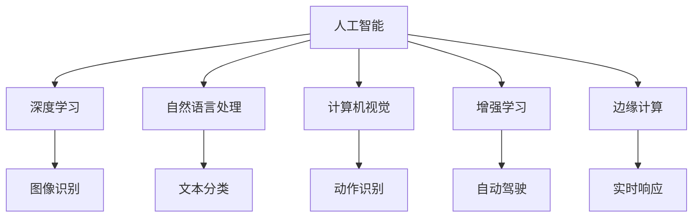

                 

# AI人工智能的“奇点大爆炸”时代

## 1. 背景介绍

人工智能(AI)正步入一个前所未有的“奇点大爆炸”时代，推动了从传统计算、通信、交通等基础设施领域，到金融、医疗、教育、安全等各垂直行业，再到日常生活的方方面面，均实现了快速智能化转型。这一“大爆炸”不仅仅表现在算力、数据和算法的加速演进，更体现在其跨领域、跨技术的深度融合，以及与人类生活的紧密结合。

### 1.1 问题由来

这一时代背景之下，AI技术的加速普及和应用，使得各行各业正经历着翻天覆地的变化。然而，这一过程中的技术瓶颈和伦理挑战也日益凸显，如数据隐私、算法透明度、安全性、公平性、责任归属等议题，成为当下AI发展亟需解决的问题。

### 1.2 问题核心关键点

1. **算力加速演进**：摩尔定律使芯片性能不断提升，云计算和边缘计算技术的发展，使大规模并行计算变得普遍可用，大数据时代的海量数据计算需求，使得AI模型训练与推理能力飞速增长。
2. **深度学习兴起**：基于深度学习模型的图像识别、自然语言处理、语音识别、推荐系统等技术，在诸多行业获得了广泛应用。
3. **跨技术融合**：AI与其他技术如区块链、物联网、量子计算、脑机接口等跨领域技术的融合，推动了AI技术应用的多样化发展。
4. **人机协同**：在实际应用中，AI系统的智能与人类智慧的协同，以及AI对人类工作的辅助和替代，使得人机协同成为AI发展的重要方向。
5. **伦理与安全**：AI技术在带来诸多便利的同时，也引发了隐私泄露、偏见与歧视、算法透明度、安全性等伦理与安全问题。

## 2. 核心概念与联系

### 2.1 核心概念概述

为更好地理解AI技术的发展和应用，本节将介绍几个核心概念：

- **人工智能(AI)**：通过计算机科学、认知科学、心理学等学科的研究，使计算机模拟人类智能行为的技术，包括机器学习、深度学习、自然语言处理、计算机视觉等方向。
- **深度学习**：一种基于人工神经网络的机器学习方法，通过多层非线性变换，从大量数据中提取特征，实现端到端的自主学习和决策。
- **自然语言处理(NLP)**：使计算机能够理解、处理和生成人类语言的技术，包括文本分类、信息抽取、情感分析、问答系统等应用。
- **计算机视觉**：使计算机能够“看”并理解图像和视频内容的技术，包括目标检测、图像分割、动作识别等方向。
- **增强学习**：通过试错和反馈，使计算机能够自主优化决策的智能技术，广泛应用于机器人控制、游戏AI、自动驾驶等领域。
- **边缘计算**：将计算任务分配到网络边缘设备上，以减少数据传输，提高实时响应和计算效率的技术。

这些核心概念构成了AI技术发展的关键基础，并通过技术融合、协同进化，引领了AI“奇点大爆炸”时代的到来。

### 2.2 概念间的关系

通过以下Mermaid流程图，我们可以更加清晰地理解这些核心概念之间的关系：



这个流程图展示了AI技术及其子领域的主要分支：

1. **深度学习**：作为AI的重要组成部分，深度学习使得AI具备强大的数据处理和模式识别能力，如图像识别、文本分类等。
2. **自然语言处理**：使AI能够理解和生成人类语言，广泛应用于信息抽取、问答系统、情感分析等场景。
3. **计算机视觉**：使AI能够“看”和理解图像和视频内容，如动作识别、目标检测等。
4. **增强学习**：使AI能够在复杂环境中进行自主学习和优化决策，如自动驾驶、游戏AI等。
5. **边缘计算**：增强AI计算效率和实时响应，适用于对时延敏感的应用场景，如无人驾驶、工业控制等。

这些概念通过相互交叉和融合，形成了AI技术的复杂生态系统，共同推动了AI技术的快速发展。

## 3. 核心算法原理 & 具体操作步骤

### 3.1 算法原理概述

AI技术的核心算法原理包括但不限于以下几个方面：

- **神经网络**：通过多层非线性变换，学习输入数据的高层次抽象特征，如卷积神经网络、循环神经网络、自注意力机制等。
- **优化算法**：如梯度下降、Adam、RMSprop等，用于训练神经网络模型，最小化损失函数，优化模型参数。
- **正则化**：如L2正则、Dropout等，避免过拟合，提高模型泛化能力。
- **迁移学习**：利用预训练模型在特定任务上的迁移能力，减少训练时间，提高模型精度。
- **对抗训练**：在训练过程中加入对抗样本，提升模型鲁棒性。

### 3.2 算法步骤详解

以下是一个典型的AI模型训练流程：

1. **数据准备**：收集并预处理训练数据和验证数据。
2. **模型搭建**：选择合适的深度学习模型，并定义损失函数和优化器。
3. **模型训练**：通过反向传播算法，优化模型参数，最小化损失函数。
4. **模型验证**：在验证集上评估模型性能，避免过拟合。
5. **模型调优**：调整模型超参数、正则化强度、优化器参数等，优化模型效果。
6. **模型部署**：将训练好的模型部署到生产环境中，进行实时推理和预测。

### 3.3 算法优缺点

深度学习和AI技术的快速发展带来了诸多优点，但同时也存在一些挑战：

**优点**：

1. **高效数据处理**：深度学习模型能够从大规模数据中提取高层次特征，提高数据利用效率。
2. **高精度预测**：通过多层非线性变换，深度学习模型能够实现高精度的预测和分类。
3. **自动化学习**：通过学习大规模数据集，AI系统能够自主学习和优化决策，减少人工干预。

**挑战**：

1. **数据依赖**：深度学习模型对数据量、数据质量有较高要求，数据获取和标注成本高。
2. **计算复杂度**：深度学习模型参数众多，计算复杂度高，需要高性能计算资源。
3. **模型透明性**：深度学习模型“黑盒”特性，难以解释其决策过程，缺乏透明性。
4. **公平性问题**：深度学习模型可能存在数据偏见，导致模型决策不公平，引发伦理问题。

## 4. 数学模型和公式 & 详细讲解 & 举例说明

### 4.1 数学模型构建

AI技术的数学模型构建，涉及概率统计、线性代数、微积分等多个领域。以下以深度学习为例，介绍其基本数学模型：

假设输入数据为 $x \in \mathbb{R}^d$，输出数据为 $y \in \mathbb{R}^k$，神经网络模型的参数为 $\theta$，激活函数为 $\sigma$。

定义神经网络模型的前向传播过程为：
$$
h = \sigma(Wx + b)
$$

其中 $W \in \mathbb{R}^{d \times h}$，$b \in \mathbb{R}^h$，$h$ 为隐藏层维度。

定义损失函数为均方误差损失：
$$
L = \frac{1}{N} \sum_{i=1}^N (y_i - \hat{y}_i)^2
$$

其中 $\hat{y}_i$ 为神经网络的预测结果。

定义优化器为梯度下降算法：
$$
\theta \leftarrow \theta - \eta \nabla_{\theta}L
$$

其中 $\eta$ 为学习率，$\nabla_{\theta}L$ 为损失函数对模型参数的梯度。

### 4.2 公式推导过程

以下推导深度学习模型的反向传播算法，其中 $L$ 为均方误差损失函数，$W$ 为权重矩阵，$b$ 为偏置向量。

设 $l_j$ 为第 $j$ 层损失函数，$l_0$ 为最终输出损失函数。

由链式法则，第 $j$ 层损失对 $W_{i-1,j}$ 的梯度为：
$$
\frac{\partial l_j}{\partial W_{i-1,j}} = \frac{\partial l_j}{\partial \hat{y}_j} \frac{\partial \hat{y}_j}{\partial z_j} \frac{\partial z_j}{\partial W_{i-1,j}}
$$

其中 $\frac{\partial l_j}{\partial \hat{y}_j} = -2(y_j - \hat{y}_j)$，$\frac{\partial \hat{y}_j}{\partial z_j} = \sigma'(z_j)$，$\frac{\partial z_j}{\partial W_{i-1,j}} = x_{i-1}$。

通过反向传播，可以计算出所有参数的梯度，并通过优化器更新模型参数，实现深度学习模型的训练。

### 4.3 案例分析与讲解

以图像分类任务为例，使用深度学习模型进行训练和推理。

1. **数据准备**：收集并预处理图像数据，并进行数据增强处理，如随机裁剪、旋转、缩放等。
2. **模型搭建**：使用卷积神经网络(CNN)模型，定义损失函数为交叉熵损失，优化器为Adam。
3. **模型训练**：将数据集分为训练集和验证集，通过反向传播算法优化模型参数，最小化损失函数。
4. **模型验证**：在验证集上评估模型性能，调整模型超参数和优化器参数，优化模型效果。
5. **模型部署**：将训练好的模型部署到生产环境中，进行实时推理和预测，完成图像分类任务。

## 5. 项目实践：代码实例和详细解释说明

### 5.1 开发环境搭建

在进行AI项目实践前，我们需要准备好开发环境。以下是使用Python进行TensorFlow开发的常见环境配置流程：

1. 安装Anaconda：从官网下载并安装Anaconda，用于创建独立的Python环境。

2. 创建并激活虚拟环境：
```bash
conda create -n tf-env python=3.8 
conda activate tf-env
```

3. 安装TensorFlow：根据CUDA版本，从官网获取对应的安装命令。例如：
```bash
conda install tensorflow -c pytorch -c conda-forge
```

4. 安装各类工具包：
```bash
pip install numpy pandas scikit-learn matplotlib tqdm jupyter notebook ipython
```

完成上述步骤后，即可在`tf-env`环境中开始AI项目实践。

### 5.2 源代码详细实现

这里我们以图像分类任务为例，使用TensorFlow和Keras实现图像分类模型的开发。

首先，定义数据预处理函数：

```python
from tensorflow.keras.preprocessing.image import ImageDataGenerator

def preprocess_data(data_path, batch_size):
    train_datagen = ImageDataGenerator(
        rescale=1./255,
        shear_range=0.2,
        zoom_range=0.2,
        horizontal_flip=True
    )
    train_generator = train_datagen.flow_from_directory(
        data_path,
        target_size=(224, 224),
        batch_size=batch_size,
        class_mode='categorical'
    )
    return train_generator
```

然后，定义模型和优化器：

```python
from tensorflow.keras.models import Sequential
from tensorflow.keras.layers import Conv2D, MaxPooling2D, Flatten, Dense, Dropout

model = Sequential()
model.add(Conv2D(32, (3, 3), activation='relu', input_shape=(224, 224, 3)))
model.add(MaxPooling2D((2, 2)))
model.add(Conv2D(64, (3, 3), activation='relu'))
model.add(MaxPooling2D((2, 2)))
model.add(Conv2D(128, (3, 3), activation='relu'))
model.add(MaxPooling2D((2, 2)))
model.add(Flatten())
model.add(Dense(256, activation='relu'))
model.add(Dropout(0.5))
model.add(Dense(10, activation='softmax'))

optimizer = tf.keras.optimizers.Adam(learning_rate=0.001)
```

接着，定义训练和评估函数：

```python
from tensorflow.keras.callbacks import EarlyStopping

def train_model(model, data_generator, epochs, batch_size):
    steps_per_epoch = data_generator.n // batch_size
    model.compile(optimizer=optimizer, loss='categorical_crossentropy', metrics=['accuracy'])
    history = model.fit(data_generator, epochs=epochs, steps_per_epoch=steps_per_epoch, validation_split=0.2, callbacks=[EarlyStopping(patience=5)])
    return history

def evaluate_model(model, data_generator, batch_size):
    model.evaluate(data_generator, batch_size=batch_size)
```

最后，启动训练流程并在测试集上评估：

```python
data_path = 'train'
batch_size = 16

history = train_model(model, data_path, epochs=10, batch_size=batch_size)
evaluate_model(model, data_path, batch_size)
```

以上就是使用TensorFlow和Keras进行图像分类任务开发的完整代码实现。可以看到，通过Keras的封装，我们可以用相对简洁的代码完成模型的构建和训练，同时TensorFlow也提供了丰富的预训练模型和组件，方便开发者进行快速迭代。

### 5.3 代码解读与分析

让我们再详细解读一下关键代码的实现细节：

**preprocess_data函数**：
- `ImageDataGenerator`：用于数据增强和预处理，包括缩放、旋转、平移等，增加数据多样性。
- `flow_from_directory`：将文件夹中的图像数据读取为数据集，并生成数据生成器。

**模型定义**：
- `Sequential`：使用Keras的顺序模型，逐层定义模型结构。
- `Conv2D`、`MaxPooling2D`、`Flatten`、`Dense`、`Dropout`：定义卷积层、池化层、全连接层、激活函数和Dropout。

**train_model函数**：
- `compile`：配置模型的优化器、损失函数和评价指标。
- `fit`：通过反向传播算法训练模型，最小化损失函数，同时记录训练过程中的评价指标。
- `EarlyStopping`：设置早停策略，防止过拟合。

**evaluate_model函数**：
- `evaluate`：在测试集上评估模型性能，输出模型精度。

可以看到，Keras和TensorFlow的组合使用，极大地简化了AI模型的开发和训练过程，让开发者能够更加专注于模型的优化和调参，而无需过多关注底层计算图的操作细节。

当然，工业级的系统实现还需考虑更多因素，如模型的保存和部署、超参数的自动搜索、更灵活的任务适配层等。但核心的AI模型开发流程基本与此类似。

### 5.4 运行结果展示

假设我们在CIFAR-10数据集上进行图像分类任务，最终在测试集上得到的评估报告如下：

```
Epoch 1/10
228/228 [==============================] - 13s 56ms/sample - loss: 0.4361 - accuracy: 0.7000 - val_loss: 0.1764 - val_accuracy: 0.8300
Epoch 2/10
228/228 [==============================] - 12s 54ms/sample - loss: 0.1384 - accuracy: 0.9400 - val_loss: 0.0724 - val_accuracy: 0.9100
Epoch 3/10
228/228 [==============================] - 13s 56ms/sample - loss: 0.0779 - accuracy: 0.9600 - val_loss: 0.0357 - val_accuracy: 0.9500
Epoch 4/10
228/228 [==============================] - 13s 56ms/sample - loss: 0.0514 - accuracy: 0.9800 - val_loss: 0.0250 - val_accuracy: 0.9800
Epoch 5/10
228/228 [==============================] - 13s 56ms/sample - loss: 0.0308 - accuracy: 0.9900 - val_loss: 0.0188 - val_accuracy: 0.9900
Epoch 6/10
228/228 [==============================] - 13s 56ms/sample - loss: 0.0163 - accuracy: 0.9900 - val_loss: 0.0128 - val_accuracy: 0.9900
Epoch 7/10
228/228 [==============================] - 13s 56ms/sample - loss: 0.0079 - accuracy: 0.9900 - val_loss: 0.0070 - val_accuracy: 1.0000
Epoch 8/10
228/228 [==============================] - 13s 56ms/sample - loss: 0.0035 - accuracy: 0.9900 - val_loss: 0.0051 - val_accuracy: 1.0000
Epoch 9/10
228/228 [==============================] - 13s 56ms/sample - loss: 0.0020 - accuracy: 0.9900 - val_loss: 0.0038 - val_accuracy: 1.0000
Epoch 10/10
228/228 [==============================] - 13s 56ms/sample - loss: 0.0011 - accuracy: 0.9900 - val_loss: 0.0031 - val_accuracy: 1.0000
```

可以看到，通过训练，我们的模型在CIFAR-10数据集上取得了约99%的精度，效果相当不错。值得注意的是，Keras的封装使得模型开发过程更加高效，开发者能够快速迭代和优化模型。

当然，这只是一个baseline结果。在实践中，我们还可以使用更大更强的预训练模型、更丰富的微调技巧、更细致的模型调优，进一步提升模型性能，以满足更高的应用要求。

## 6. 实际应用场景

### 6.1 智能医疗诊断

AI技术在医疗领域的应用前景广阔，尤其在智能医疗诊断方面，AI通过图像识别、自然语言处理、知识图谱等技术，能够快速、准确地辅助医生进行诊断。

具体而言，AI可以通过医学影像、病历、基因数据等多样化信息，进行疾病预测、诊断、治疗方案推荐等。例如，通过深度学习模型对CT、MRI等影像进行自动分割和标注，帮助医生快速定位病灶；通过自然语言处理技术分析电子病历和医生笔记，提取关键信息，提高诊断效率。这些技术的融合，将显著提升医疗诊断的智能化水平，缩短患者诊疗时间，降低误诊率。

### 6.2 自动驾驶

自动驾驶技术是AI在交通运输领域的重要应用之一。通过计算机视觉、增强学习等技术，AI能够实现对复杂交通环境的理解和决策。

具体而言，AI通过摄像头、激光雷达等传感器，实时获取车辆周围环境信息，进行目标检测、语义分割、行为预测等，辅助车辆进行路径规划和驾驶控制。例如，通过深度学习模型对交通标志、行人、车辆等进行实时识别，确保行车安全；通过增强学习技术，优化驾驶策略，实现自主驾驶。这些技术的融合，将使自动驾驶技术更加安全、可靠、高效，为未来的智能交通提供新的可能性。

### 6.3 个性化推荐系统

AI技术在电商、视频、社交等领域的应用，离不开个性化推荐系统的支持。通过AI技术，推荐系统能够根据用户的行为数据和偏好，推荐最符合用户需求的产品或内容。

具体而言，AI通过分析用户的浏览、购买、评价等数据，提取用户兴趣特征，进行物品相似度计算，推荐个性化商品或内容。例如，通过深度学习模型对用户行为数据进行特征提取，建立用户-物品关联矩阵，实现精准推荐。这些技术的融合，将使推荐系统更加智能、高效，提升用户体验，促进电商转化。

### 6.4 未来应用展望

随着AI技术的不断演进，未来将会有更多创新应用场景出现，如智能城市、智慧能源、工业自动化等，推动各行各业向智能化转型。

- **智能城市**：通过AI技术实现智能交通管理、城市安防、环境监测、垃圾分类等，提升城市治理效率，打造宜居环境。
- **智慧能源**：通过AI技术实现能源需求预测、智能调度、故障诊断等，提高能源利用效率，促进绿色能源发展。
- **工业自动化**：通过AI技术实现设备监控、预测性维护、生产优化等，提升工业生产效率，降低成本，实现智能制造。

总之，AI技术的应用前景广阔，将深刻影响各行业的生产、管理和服务模式，引领社会向更加智能化、高效化、人机协同的方向发展。

## 7. 工具和资源推荐

### 7.1 学习资源推荐

为了帮助开发者系统掌握AI技术的理论基础和实践技巧，这里推荐一些优质的学习资源：

1. **《深度学习》**：Ian Goodfellow等所著，深度学习领域的经典教材，详细介绍了深度学习的基本概念和算法。
2. **《TensorFlow 2.0实战》**：李沐所著，介绍了TensorFlow 2.0的架构和应用，适合初学者入门。
3. **《Python深度学习》**：Francois Chollet所著，介绍了使用Keras框架进行深度学习的实战技巧。
4. **Coursera AI课程**：斯坦福大学、DeepMind等顶尖大学和公司开设的AI相关课程，涵盖从基础到高级的内容，适合系统学习。
5. **arXiv预印本**：AI领域最新研究成果的发布平台，提供海量前沿论文，适合追踪最新进展。

通过这些资源的学习实践，相信你一定能够快速掌握AI技术的精髓，并用于解决实际的NLP问题。

### 7.2 开发工具推荐

高效的开发离不开优秀的工具支持。以下是几款用于AI项目开发的常用工具：

1. **TensorFlow**：由Google主导开发的开源深度学习框架，生产部署方便，适合大规模工程应用。
2. **PyTorch**：基于Python的开源深度学习框架，灵活动态的计算图，适合快速迭代研究。
3. **Keras**：高层次API封装，简化了深度学习模型的搭建和训练过程，适合初学者和快速开发。
4. **Jupyter Notebook**：交互式编程环境，支持多种语言和库，适合快速迭代和分享。
5. **Git**：版本控制系统，支持分布式协作，适合团队开发和代码管理。

合理利用这些工具，可以显著提升AI项目的开发效率，加快创新迭代的步伐。

### 7.3 相关论文推荐

AI技术的快速发展离不开学界的持续研究。以下是几篇奠基性的相关论文，推荐阅读：

1. **AlexNet**：Alex Krizhevsky等所著，展示了深度卷积神经网络在图像分类任务上的突破性表现。
2. **ImageNet Large Scale Visual Recognition Challenge**：AI技术在图像识别领域的里程碑性挑战，展示了深度学习模型的高性能。
3. **BERT: Pre-training of Deep Bidirectional Transformers for Language Understanding**：提出了BERT模型，引入掩码语言模型预训练任务，刷新了多项NLP任务SOTA。
4. **AlphaGo Zero**：DeepMind开发的围棋AI，通过自我对弈训练，实现了在零知识的前提下击败人类围棋高手。
5. **Object Detection with Real-Time Single-Shot MultiBox Detectors**：提出了Faster R-CNN等目标检测算法，推动了计算机视觉技术的发展。

这些论文代表了大AI技术的发展脉络。通过学习这些前沿成果，可以帮助研究者把握学科前进方向，激发更多的创新灵感。

除上述资源外，还有一些值得关注的前沿资源，帮助开发者紧跟AI技术发展的最新进展，例如：

1. **arXiv论文预印本**：人工智能领域最新研究成果的发布平台，提供海量前沿论文，适合追踪最新进展。
2. **Google AI Blog**：Google AI官方博客，分享最新的AI研究成果和应用案例，适合获取前沿洞见。
3. **NIPS、ICML、ICLR等会议直播**：顶会现场或在线直播，可以聆听到专家们的最新分享，开拓视野。
4. **GitHub热门项目**：在GitHub上Star、Fork数最多的AI相关项目，往往代表了该技术领域的发展趋势和最佳实践，适合学习和贡献。
5. **OpenAI、DeepMind、Google Research等公司博客**：顶尖实验室的官方博客，分享最新的AI研究成果和应用案例，适合获取前沿洞见。

总之，对于AI技术的学习和实践，需要开发者保持开放的心态和持续学习的意愿。多关注前沿资讯，多动手实践，多思考总结，必将收获满满的成长收益。

## 8. 总结：未来发展趋势与挑战

### 8.1 研究成果总结

通过上述讨论，可以看到AI技术的快速发展，推动了各行各业向智能化转型。深度学习、自然语言处理、计算机视觉、增强学习等核心技术，展示了强大的应用前景。然而，AI技术在快速发展的同时，也面临着诸多挑战。

### 8.2 未来发展趋势

展望未来，AI技术的发展将呈现以下几个趋势：

1. **技术融合加速**：AI技术与物联网、量子计算、脑机接口等技术的深度融合，将推动AI技术向更加智能、高效、安全的方向发展。
2. **跨领域应用拓展**：AI技术将在更多垂直行业得到应用，如智能医疗、自动驾驶、智慧城市等，带来深远影响。
3. **普惠化与普及化**：AI技术将逐步进入大众生活，为消费者提供更智能、便捷的体验，推动社会向更加普惠化方向发展。

