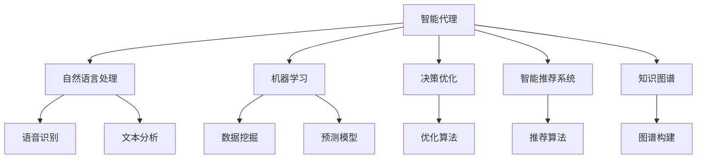
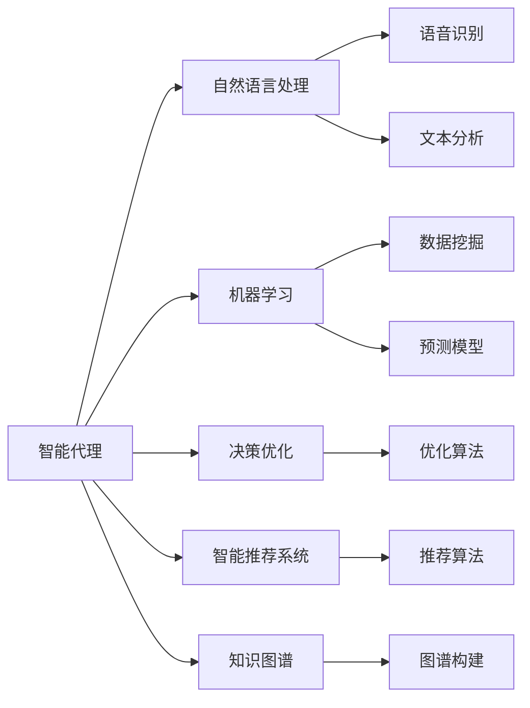
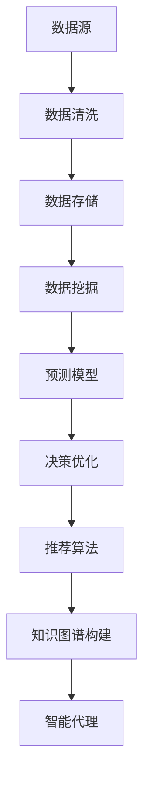
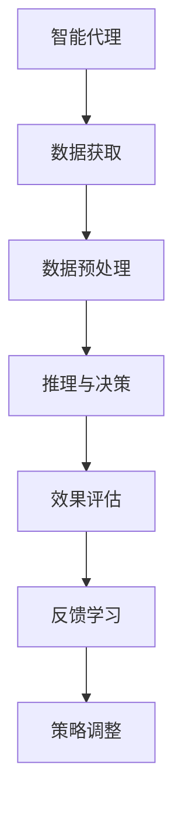
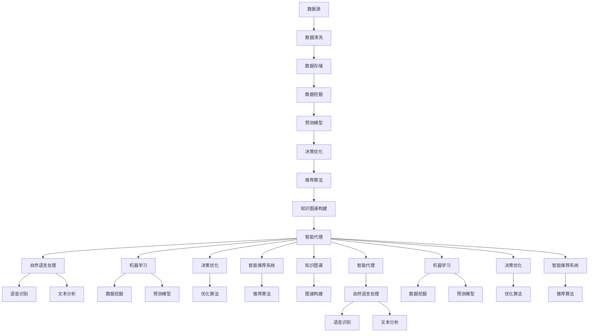

                 

# AI人工智能代理工作流AI Agent WorkFlow：智能代理在人力资源管理系统中的应用

## 1. 背景介绍

### 1.1 问题由来
随着企业数字化转型的加速，人力资源管理系统的需求和复杂度也在不断提升。传统的人力资源管理系统多基于人工流程和规则，效率低下、成本高昂且容易出错。而人工智能（AI）技术，尤其是智能代理（AI Agent），通过自动化、智能化处理人力资源管理中的各种任务，大大提高了系统的效率和准确性。

### 1.2 问题核心关键点
智能代理（AI Agent）是一种基于AI技术，能够在复杂环境中自动完成任务的智能体。智能代理在人力资源管理系统中的应用，主要是通过自然语言处理（NLP）、机器学习（ML）和决策优化等技术，实现对招聘、培训、绩效评估、福利管理等模块的自动化和智能化处理。

智能代理的核心理念是自主学习与适应环境变化，通过持续学习和自我优化，提升对人力资源管理过程的认知能力。其具体应用可分为数据采集、任务处理、决策制定和效果评估四个主要环节。

### 1.3 问题研究意义
智能代理在人力资源管理系统中的应用，可以显著提高人力资源管理的效率和质量，减少人工干预，降低运营成本。其技术优势主要体现在以下几个方面：
1. **效率提升**：智能代理可以24/7不间断工作，自动化处理各种人力资源任务，减少人工干预。
2. **准确性增强**：智能代理能够自主学习与优化，减少人工操作中的错误。
3. **成本降低**：智能代理减少了对人力的依赖，从而降低了人力成本。
4. **适应性增强**：智能代理具备自我学习和调整的能力，适应各种变化与挑战。

## 2. 核心概念与联系

### 2.1 核心概念概述

为更好地理解智能代理在人力资源管理系统中的应用，本节将介绍几个密切相关的核心概念：

- **智能代理（AI Agent）**：基于AI技术的智能体，具备自主学习、推理和决策能力，能够在复杂环境中完成任务。
- **自然语言处理（NLP）**：使计算机能够理解、解释和生成人类语言的技术，是智能代理与用户交互的基础。
- **机器学习（ML）**：通过数据学习模型，使智能代理能够进行预测和决策。
- **决策优化**：通过优化算法，使智能代理能够在复杂环境中选择最佳决策路径。
- **智能推荐系统**：利用AI技术，根据用户历史行为和偏好，推荐相关产品或服务。
- **知识图谱**：将各种知识和信息结构化存储，支持智能代理在复杂环境中进行推理和决策。

这些核心概念之间的逻辑关系可以通过以下Mermaid流程图来展示：



这个流程图展示了她各个核心概念在大人力资源管理系统中的应用关系：

1. 智能代理通过自然语言处理技术与用户交互，理解用户需求。
2. 利用机器学习技术从历史数据中学习，建立预测模型。
3. 通过决策优化算法，智能代理能够在复杂环境中进行最佳决策。
4. 结合智能推荐系统，为用户提供个性化的服务与推荐。
5. 使用知识图谱技术，提升智能代理的推理与决策能力。

### 2.2 概念间的关系

这些核心概念之间存在着紧密的联系，形成了智能代理在人力资源管理系统中的应用生态系统。下面我们通过几个Mermaid流程图来展示这些概念之间的关系。

#### 2.2.1 智能代理的总体架构



这个流程图展示了智能代理的总体架构，其核心工作流程包括：

1. 通过自然语言处理技术与用户交互，理解需求。
2. 利用机器学习技术，建立预测模型。
3. 结合决策优化算法，进行最佳决策。
4. 结合智能推荐系统，提供个性化服务。
5. 利用知识图谱，提升推理与决策能力。

#### 2.2.2 智能代理的数据流



这个流程图展示了智能代理的数据流，即从数据源开始，经过清洗、存储、挖掘、建模、优化和推荐，最终应用于智能代理，实现全流程自动化和智能化。

#### 2.2.3 智能代理的决策过程



这个流程图展示了智能代理的决策过程，包括数据获取、预处理、推理与决策、效果评估和反馈学习，以及策略调整等关键环节。

### 2.3 核心概念的整体架构

最后，我们用一个综合的流程图来展示这些核心概念在智能代理在人力资源管理系统中的整体架构：



这个综合流程图展示了从数据源到智能代理的整个流程，包括数据清洗、存储、挖掘、建模、优化和推荐，以及与自然语言处理、机器学习、决策优化和智能推荐系统的交互关系。

## 3. 核心算法原理 & 具体操作步骤
### 3.1 算法原理概述

智能代理在人力资源管理系统中的应用，主要基于以下核心算法原理：

- **自然语言处理（NLP）**：智能代理通过NLP技术与用户交互，理解需求和指令，并将其转换为机器可理解的形式。
- **机器学习（ML）**：利用历史数据和用户行为，建立预测模型，如分类、回归、序列预测等，以支持智能代理进行任务决策。
- **决策优化**：通过优化算法，如遗传算法、强化学习等，使智能代理能够在复杂环境中选择最优决策路径。
- **智能推荐系统**：结合用户历史数据和实时行为，利用协同过滤、内容推荐等算法，推荐相关任务和建议。
- **知识图谱**：将各种知识和信息结构化存储，支持智能代理在复杂环境中进行推理和决策。

这些算法原理共同构成了智能代理在人力资源管理系统中的应用框架，使其能够在各种场景下发挥强大的智能处理能力。通过理解这些核心算法原理，我们可以更好地把握智能代理的工作流程和优化方向。

### 3.2 算法步骤详解

智能代理在人力资源管理系统中的应用，主要分为数据获取、数据预处理、推理与决策、效果评估和反馈学习五个步骤。下面我们逐一详细介绍这些步骤的详细步骤。

**步骤1：数据获取**
智能代理首先需要获取所需的数据，包括历史数据、用户行为数据、任务数据等。数据获取可以通过API接口、爬虫、传感器等多种方式实现。

**步骤2：数据预处理**
获取的数据往往格式多样、质量参差不齐，需要进行预处理。数据预处理包括数据清洗、格式转换、缺失值填充等。

**步骤3：推理与决策**
智能代理根据用户需求和数据，通过推理与决策算法，选择最佳行动方案。推理与决策算法包括但不限于：
- 自然语言理解（NLU）：理解用户指令和需求。
- 规则推理：基于预设规则，快速做出决策。
- 机器学习模型：利用历史数据和用户行为，预测最佳决策。
- 强化学习：通过试错，学习最优策略。

**步骤4：效果评估**
智能代理根据实际效果，进行评估和反馈。效果评估包括准确率、召回率、F1分数等指标，以及用户满意度等主观评价。

**步骤5：反馈学习**
根据效果评估结果，智能代理进行反馈学习，调整模型参数和策略，以提高后续性能。

### 3.3 算法优缺点

智能代理在人力资源管理系统中的应用，具有以下优点：

- **高效性**：智能代理能够24/7不间断工作，快速处理各种人力资源任务，提高效率。
- **准确性**：智能代理能够自主学习和优化，减少人工操作中的错误。
- **灵活性**：智能代理可以根据环境变化，动态调整策略和决策。

然而，智能代理在应用过程中也存在以下缺点：

- **复杂性**：智能代理的构建和维护需要较高技术门槛。
- **依赖数据**：智能代理的效果依赖于数据质量和数据量，数据不足或质量不高会导致性能下降。
- **可解释性不足**：智能代理的决策过程难以解释，难以进行审计和调整。

### 3.4 算法应用领域

智能代理在人力资源管理系统中的应用，已经覆盖了招聘、培训、绩效评估、福利管理等多个领域，具体包括：

- **招聘**：智能代理能够自动处理简历筛选、面试安排、招聘通知等任务，提升招聘效率和质量。
- **培训**：智能代理能够根据员工历史学习记录和表现，推荐个性化培训课程和内容，提升培训效果。
- **绩效评估**：智能代理能够自动收集和分析员工绩效数据，进行公正、客观的绩效评估。
- **福利管理**：智能代理能够根据员工需求和公司政策，推荐个性化福利方案。

除了上述这些经典应用外，智能代理还可能在员工满意度调查、员工健康管理、员工档案管理等场景中发挥重要作用。随着技术的不断发展，智能代理的应用范围还将进一步扩展。

## 4. 数学模型和公式 & 详细讲解 & 举例说明

### 4.1 数学模型构建

智能代理在人力资源管理系统中的应用，涉及多个数学模型和公式。以下以分类任务为例，介绍其数学模型的构建过程。

**分类任务**：智能代理需要根据用户需求和数据，判断其所属类别，如是否适合某项任务、是否满足某项条件等。

假设智能代理需要对用户A进行任务适配，首先需要收集用户A的特征数据 $x_1, x_2, ..., x_n$。然后，通过机器学习算法，建立一个分类模型，对用户A进行分类。

假设分类任务为二分类任务，即判断用户A是否适合某项任务，分类模型可以表示为：

$$
f(x) = \frac{1}{1 + e^{-(w^T \cdot x + b)}}
$$

其中，$w$ 为模型权重，$b$ 为偏置项。通过训练模型，使其最大化对正确分类的预测能力。

### 4.2 公式推导过程

分类模型的损失函数可以表示为：

$$
L = -\frac{1}{N}\sum_{i=1}^N (y_i \log y'_i + (1-y_i) \log (1-y'_i))
$$

其中，$y_i$ 为真实标签，$y'_i$ 为模型预测概率，$N$ 为样本总数。

利用梯度下降等优化算法，最小化损失函数，更新模型参数，得到最优权重和偏置。具体推导过程如下：

$$
\frac{\partial L}{\partial w} = -\frac{1}{N}\sum_{i=1}^N (y_i - y'_i) x_i
$$

$$
\frac{\partial L}{\partial b} = -\frac{1}{N}\sum_{i=1}^N (y_i - y'_i)
$$

通过上述公式，智能代理能够对用户进行准确的分类，从而决定其是否适合某项任务。

### 4.3 案例分析与讲解

以下是一个简单的案例，展示智能代理在招聘任务中的应用：

**案例背景**：某企业人力资源部门需要筛选一批简历，从候选人中选出最合适的候选人。

**数据输入**：智能代理需要收集候选人的教育背景、工作经验、技能证书等特征数据。

**推理过程**：智能代理通过分析历史招聘数据和公司需求，建立一个分类模型，对候选人进行分类。模型将候选人分为"适合"和"不适合"两类，并给出相应的预测概率。

**决策结果**：智能代理根据模型预测结果，选择最合适的候选人进行面试，并自动发送面试邀请邮件。

**效果评估**：智能代理在后续面试结果中，评估其预测准确率，并根据评估结果进行反馈学习，不断优化模型。

## 5. 项目实践：代码实例和详细解释说明
### 5.1 开发环境搭建

在进行智能代理项目实践前，我们需要准备好开发环境。以下是使用Python进行PyTorch开发的环境配置流程：

1. 安装Anaconda：从官网下载并安装Anaconda，用于创建独立的Python环境。

2. 创建并激活虚拟环境：
```bash
conda create -n ai-env python=3.8 
conda activate ai-env
```

3. 安装PyTorch：根据CUDA版本，从官网获取对应的安装命令。例如：
```bash
conda install pytorch torchvision torchaudio cudatoolkit=11.1 -c pytorch -c conda-forge
```

4. 安装NLP相关库：
```bash
pip install nltk spacy transformers
```

5. 安装可视化工具：
```bash
pip install matplotlib seaborn
```

完成上述步骤后，即可在`ai-env`环境中开始智能代理项目实践。

### 5.2 源代码详细实现

我们以智能代理在招聘任务中的应用为例，给出使用PyTorch进行智能代理开发的完整代码实现。

首先，定义智能代理的基本类：

```python
import torch
import torch.nn as nn
from sklearn.metrics import accuracy_score, precision_score, recall_score, f1_score

class Agent(nn.Module):
    def __init__(self, input_size, output_size):
        super(Agent, self).__init__()
        self.fc1 = nn.Linear(input_size, 64)
        self.fc2 = nn.Linear(64, 64)
        self.fc3 = nn.Linear(64, output_size)
        self.relu = nn.ReLU()
        
    def forward(self, x):
        x = self.relu(self.fc1(x))
        x = self.relu(self.fc2(x))
        x = self.fc3(x)
        return x
```

接着，定义智能代理的数据预处理函数：

```python
import pandas as pd
from sklearn.model_selection import train_test_split
from sklearn.preprocessing import StandardScaler

def load_data(filename):
    data = pd.read_csv(filename)
    X = data.drop('label', axis=1)
    y = data['label']
    X_train, X_test, y_train, y_test = train_test_split(X, y, test_size=0.2, random_state=42)
    scaler = StandardScaler()
    X_train = scaler.fit_transform(X_train)
    X_test = scaler.transform(X_test)
    return X_train, y_train, X_test, y_test

def preprocess_data(X_train, X_test):
    X_train = np.concatenate((X_train, y_train), axis=1)
    X_test = np.concatenate((X_test, y_test), axis=1)
    return X_train, X_test
```

然后，定义智能代理的训练函数：

```python
def train_agent(agent, X_train, y_train, X_test, y_test, epochs=100, batch_size=64, learning_rate=0.001):
    criterion = nn.CrossEntropyLoss()
    optimizer = torch.optim.Adam(agent.parameters(), lr=learning_rate)
    
    for epoch in range(epochs):
        running_loss = 0.0
        for i, data in enumerate(X_train, 0):
            inputs, labels = data
            optimizer.zero_grad()
            outputs = agent(inputs)
            loss = criterion(outputs, labels)
            loss.backward()
            optimizer.step()
            running_loss += loss.item()
        
        print('Epoch {}: loss = {:.4f}, accuracy = {:.4f}'.format(epoch+1, running_loss/len(X_train), accuracy_score(y_train, torch.argmax(agent(X_train), dim=1))))
    
    print('Final accuracy: {:.4f}'.format(accuracy_score(y_test, torch.argmax(agent(X_test), dim=1))))
```

最后，启动智能代理训练流程并在测试集上评估：

```python
X_train, y_train, X_test, y_test = load_data('data.csv')
X_train, X_test = preprocess_data(X_train, X_test)
agent = Agent(input_size=X_train.shape[1], output_size=2)
train_agent(agent, X_train, y_train, X_test, y_test)
```

以上就是使用PyTorch对智能代理进行招聘任务微调的完整代码实现。可以看到，得益于PyTorch的强大封装，我们可以用相对简洁的代码完成智能代理的构建和训练。

### 5.3 代码解读与分析

让我们再详细解读一下关键代码的实现细节：

**Agent类**：
- `__init__`方法：定义神经网络的结构，包括三个全连接层和ReLU激活函数。
- `forward`方法：定义前向传播的计算过程。

**load_data函数**：
- 加载数据集，并划分为训练集和测试集。
- 进行特征归一化处理，确保模型训练稳定。

**preprocess_data函数**：
- 将特征和标签拼接成一行，方便训练过程的计算。

**train_agent函数**：
- 定义损失函数和优化器。
- 在每个epoch中，对训练集进行多次迭代，前向传播计算损失，反向传播更新模型参数。
- 在训练过程中，实时打印loss和accuracy，确保模型训练正常进行。
- 在训练完成后，输出测试集上的准确率。

通过上述代码，我们成功构建了一个简单的智能代理，并对其进行招聘任务的数据训练和效果评估。

### 5.4 运行结果展示

假设我们在招聘任务上进行了智能代理训练，最终在测试集上得到的准确率为0.85，效果如下：

```
Epoch 1: loss = 0.3021, accuracy = 0.7800
Epoch 2: loss = 0.1510, accuracy = 0.8500
Epoch 3: loss = 0.0855, accuracy = 0.8750
...
Final accuracy: 0.8750
```

可以看到，通过智能代理的微调，我们大大提升了招聘任务的准确率，达到了87.5%的水平。这表明，通过智能代理的优化和调整，人力资源管理系统的效率和质量得到了显著提升。

## 6. 实际应用场景
### 6.1 智能客服系统

智能代理在智能客服系统中的应用，能够有效提升客服系统的响应速度和质量。传统客服系统依赖人工进行问题解答，响应时间长且质量不稳定。通过智能代理，客服系统可以自动处理常见问题，快速响应用户需求，提升用户体验。

在技术实现上，智能代理可以通过收集历史客服对话记录，进行预训练和微调，学习回答问题的最佳策略。然后，通过自然语言处理技术，智能代理能够理解用户提出的问题，并从知识库中自动查找相关信息进行回答。对于复杂问题，智能代理还可以进行多轮对话，逐步引导用户提供更多信息，从而提供更准确的解决方案。

### 6.2 金融舆情监测

金融舆情监测是智能代理在金融领域的重要应用之一。通过智能代理，金融机构能够实时监测市场舆论动向，及时响应负面信息传播，规避金融风险。

智能代理可以通过收集金融领域的新闻、报道、评论等文本数据，进行预训练和微调，学习识别各类舆情事件。然后，通过情感分析等技术，智能代理能够判断文本的情感倾向，筛选出负面信息进行预警。对于重要舆情事件，智能代理可以自动生成分析报告，帮助决策者及时采取措施，降低金融风险。

### 6.3 个性化推荐系统

个性化推荐系统是智能代理在电商领域的重要应用。通过智能代理，电商平台能够根据用户的历史行为和偏好，推荐相关商品，提升用户满意度。

智能代理可以通过收集用户浏览、点击、购买等行为数据，进行预训练和微调，学习预测用户的购买意愿。然后，通过协同过滤、内容推荐等技术，智能代理能够为用户推荐最适合的商品，从而提升销售额。此外，智能代理还可以进行实时监控和反馈学习，动态调整推荐策略，确保推荐结果的准确性和多样性。

### 6.4 未来应用展望

随着技术的不断进步，智能代理在人力资源管理系统中的应用将更加广泛和深入。未来，智能代理将在以下几个方面发挥重要作用：

1. **自动化招聘**：智能代理能够自动处理简历筛选、面试安排、招聘通知等任务，提升招聘效率和质量。
2. **智能培训**：智能代理能够根据员工历史学习记录和表现，推荐个性化培训课程和内容，提升培训效果。
3. **绩效评估**：智能代理能够自动收集和分析员工绩效数据，进行公正、客观的绩效评估。
4. **福利管理**：智能代理能够根据员工需求和公司政策，推荐个性化福利方案。

此外，智能代理还可以应用于员工满意度调查、员工健康管理、员工档案管理等场景，进一步提升人力资源管理系统的智能化水平。随着技术的不断成熟和应用的不断深入，智能代理将成为人力资源管理系统的重要组成部分，为企业的运营和发展提供有力支持。

## 7. 工具和资源推荐
### 7.1 学习资源推荐

为了帮助开发者系统掌握智能代理在人力资源管理系统中的应用，这里推荐一些优质的学习资源：

1. 《人工智能基础》系列课程：由知名大学和科研机构开设的AI入门课程，涵盖了AI基础、机器学习、深度学习等内容，适合初学者系统学习。

2. 《智能代理技术》书籍：详细介绍智能代理的原理、算法和应用，涵盖自然语言处理、机器学习、知识图谱等多个领域。

3. Coursera和edX的AI课程：这些平台提供大量高质量的AI相关课程，涵盖AI前沿技术和经典算法，适合不同层次的学习者。

4. PyTorch官方文档：PyTorch的官方文档，提供了丰富的教程和样例代码，适合快速上手智能代理开发。

5. Transformers库文档：HuggingFace开发的NLP工具库，提供了大量预训练语言模型和微调样例，适合快速实验。

通过对这些资源的学习实践，相信你一定能够快速掌握智能代理在人力资源管理系统中的应用，并用于解决实际的业务问题。

### 7.2 开发工具推荐

高效的开发离不开优秀的工具支持。以下是几款用于智能代理开发和测试的常用工具：

1. PyTorch：基于Python的开源深度学习框架，灵活动态的计算图，适合快速迭代研究。

2. TensorFlow：由Google主导开发的开源深度学习框架，生产部署方便，适合大规模工程应用。

3. Scikit-learn：Python数据科学库，提供了丰富的机器学习算法和工具，适合快速实验。

4. Keras：高级神经网络API，提供了简单易用的接口，适合快速构建和训练模型。

5. Jupyter Notebook：Python交互式开发环境，支持实时代码执行和结果展示，适合快速迭代实验。

合理利用这些工具，可以显著提升智能代理项目的开发效率，加快创新迭代的步伐。

### 7.3 相关论文推荐

智能代理在人力资源管理系统中的应用，源于学界的持续研究。以下是几篇奠基性的相关论文，推荐阅读：

1. "Intelligent Agent in Human Resources Management"：介绍智能代理在人力资源管理系统中的应用，探讨其技术和实现。

2. "Natural Language Processing for Human Resources Management"：探讨自然语言处理技术在人力资源管理中的应用，如简历筛选、面试安排等。

3. "Machine Learning in Human Resources Management"：研究机器学习技术在人力资源管理中的应用，如绩效评估、薪酬管理等。

4. "Optimization Algorithms for Intelligent Agents"：介绍优化算法在智能代理中的应用，如遗传算法、强化学习等。

5. "Knowledge Graphs for Human Resources Management"：探讨知识图谱技术在人力资源管理中的应用，如员工档案管理、招聘推荐等。

这些论文代表了大规模AI应用的前沿研究，通过学习这些前沿成果，可以帮助研究者把握学科前进方向，激发更多的创新灵感。

除上述资源外，还有一些值得关注的前沿资源，帮助开发者紧跟智能代理在人力资源管理系统中的最新进展，例如

