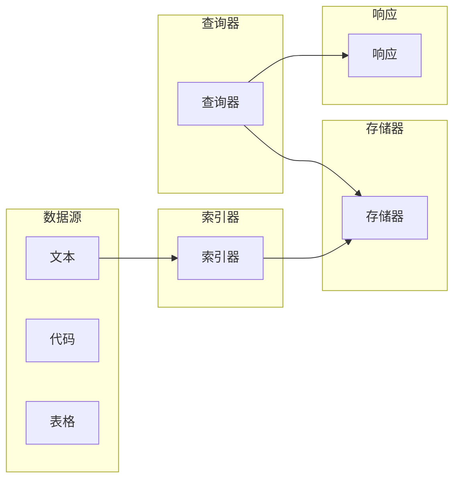

## 【大模型应用开发 动手做AI Agent】简单的LlamaIndex开发示例

作者：禅与计算机程序设计艺术 / Zen and the Art of Computer Programming

## 1. 背景介绍

### 1.1 问题的由来

近年来，随着大语言模型（LLM）技术的飞速发展，其在自然语言处理领域的应用也越来越广泛。从文本生成、机器翻译到问答系统，LLM展现出了强大的能力。然而，如何将LLM的能力应用到实际场景中，构建智能的AI Agent，仍然是一个充满挑战的问题。

传统的AI Agent通常依赖于预先定义好的规则和知识库，缺乏灵活性和适应性。而LLM的出现，为构建更智能、更灵活的AI Agent提供了新的思路。

### 1.2 研究现状

目前，已经有许多研究团队致力于将LLM与AI Agent相结合，构建基于LLM的智能代理。例如，Google的LaMDA、OpenAI的ChatGPT等，都展示了将LLM应用于对话系统和任务执行方面的潜力。

然而，现有的LLM应用于AI Agent开发中，仍然存在一些挑战：

* **知识获取和管理:** LLM需要大量的训练数据才能获得良好的性能，如何有效地获取和管理知识，是构建AI Agent的关键问题。
* **任务执行:** LLM擅长理解和生成文本，但对于执行实际任务，例如查询数据库、调用API等，还需要额外的工具和技术。
* **可解释性和可控性:** LLM的决策过程通常是黑盒，难以理解和控制，这对于构建可靠的AI Agent提出了挑战。

### 1.3 研究意义

将LLM应用于AI Agent开发，具有重要的研究意义：

* **提升AI Agent的智能水平:** LLM的强大能力，可以显著提升AI Agent的理解、推理和决策能力。
* **扩展AI Agent的应用范围:** LLM可以处理各种复杂的任务，例如文本摘要、问答系统、代码生成等，扩展了AI Agent的应用范围。
* **促进人工智能的发展:** LLM与AI Agent的结合，将推动人工智能技术的发展，为构建更智能、更强大的AI系统提供新的思路。

### 1.4 本文结构

本文将介绍如何使用LlamaIndex框架构建简单的AI Agent，并通过示例展示其应用。文章结构如下：

* **背景介绍:** 介绍LLM与AI Agent结合的背景、研究现状和意义。
* **核心概念:** 介绍LlamaIndex框架的核心概念和架构。
* **开发示例:** 通过一个简单的示例，展示如何使用LlamaIndex构建AI Agent。
* **应用场景:** 讨论LlamaIndex在不同领域的应用场景。
* **总结:** 总结本文内容，并展望未来发展趋势。

## 2. 核心概念与联系

LlamaIndex是一个基于LLM的知识库框架，它可以帮助开发者轻松地构建基于LLM的AI Agent。

LlamaIndex的核心概念包括：

* **索引器（Indexer）:** 用于将数据索引到知识库中，支持多种数据类型，例如文本、代码、表格等。
* **查询器（QueryEngine）:** 用于查询知识库，并根据查询结果生成响应。
* **存储器（StorageContext）:** 用于存储索引数据和查询结果，支持多种存储方式，例如本地文件、数据库等。

LlamaIndex的架构如下图所示：



## 3. 核心算法原理 & 具体操作步骤

### 3.1 算法原理概述

LlamaIndex的核心算法是基于LLM的知识检索和推理。它将数据索引到知识库中，并使用LLM来理解查询意图，并从知识库中检索相关信息。

LlamaIndex的算法原理可以概括为以下步骤：

1. **数据索引:** 将数据转换为LLM可以理解的格式，并将其索引到知识库中。
2. **查询解析:** 使用LLM解析查询意图，并将其转换为查询语句。
3. **知识检索:** 根据查询语句，从知识库中检索相关信息。
4. **响应生成:** 使用LLM根据检索到的信息生成响应。

### 3.2 算法步骤详解

LlamaIndex的算法步骤可以细分为以下几个步骤：

1. **数据预处理:** 将原始数据转换为LLM可以理解的格式，例如将文本拆分成句子、将代码转换为代码块等。
2. **索引构建:** 使用索引器将预处理后的数据索引到知识库中。
3. **查询处理:** 使用查询器解析查询意图，并将其转换为查询语句。
4. **知识检索:** 使用查询语句从知识库中检索相关信息。
5. **响应生成:** 使用LLM根据检索到的信息生成响应。

### 3.3 算法优缺点

LlamaIndex的算法具有以下优点：

* **灵活性和可扩展性:** 支持多种数据类型和存储方式，可以轻松扩展到各种应用场景。
* **智能化:** 使用LLM进行查询解析和响应生成，可以提供更智能的AI Agent体验。
* **易用性:** 提供简洁的API，方便开发者快速构建AI Agent。

LlamaIndex的算法也存在一些缺点：

* **性能问题:** LLM的推理过程可能比较耗时，需要优化算法和硬件资源才能提高性能。
* **可解释性:** LLM的决策过程通常是黑盒，难以理解和控制。
* **数据依赖性:** LLM的性能依赖于训练数据的质量，需要高质量的训练数据才能获得良好的效果。

### 3.4 算法应用领域

LlamaIndex的算法可以应用于以下领域：

* **问答系统:** 构建基于LLM的问答系统，可以回答用户提出的各种问题。
* **文本摘要:** 使用LLM从大量文本中提取关键信息，生成简短的摘要。
* **代码生成:** 使用LLM根据自然语言描述生成代码。
* **聊天机器人:** 构建基于LLM的聊天机器人，可以与用户进行自然对话。
* **知识管理:** 使用LLM构建知识库，方便用户查找和管理信息。

## 4. 数学模型和公式 & 详细讲解 & 举例说明

### 4.1 数学模型构建

LlamaIndex的数学模型可以抽象为一个知识库检索和推理模型。

假设知识库包含 $N$ 个文档，每个文档可以表示为一个向量 $d_i$，查询可以表示为一个向量 $q$。

LlamaIndex的目标是找到与查询 $q$ 最相关的文档，并使用LLM生成响应。

### 4.2 公式推导过程

LlamaIndex使用余弦相似度来衡量查询和文档之间的相关性。余弦相似度的公式如下：

$$
sim(q, d_i) = \frac{q \cdot d_i}{||q|| ||d_i||}
$$

其中，$q \cdot d_i$ 表示 $q$ 和 $d_i$ 的点积，$||q||$ 和 $||d_i||$ 分别表示 $q$ 和 $d_i$ 的范数。

LlamaIndex使用LLM来计算查询和文档的向量表示。LLM可以将文本转换为向量，并使用余弦相似度来比较向量之间的相似性。

### 4.3 案例分析与讲解

假设我们有一个包含以下文档的知识库：

* 文档1: "The quick brown fox jumps over the lazy dog."
* 文档2: "A cat sat on a mat."
* 文档3: "The dog chased the cat."

假设用户查询 "What did the dog do?".

LlamaIndex会使用LLM将查询和文档转换为向量，并计算查询和每个文档之间的余弦相似度。

假设计算结果如下：

* sim(q, d1) = 0.2
* sim(q, d2) = 0.1
* sim(q, d3) = 0.8

LlamaIndex会选择与查询最相关的文档，即文档3，并使用LLM根据文档3的内容生成响应，例如 "The dog chased the cat."

### 4.4 常见问题解答

* **如何选择合适的LLM?** 不同的LLM具有不同的优势和劣势，需要根据具体的应用场景选择合适的LLM。
* **如何处理多语言数据?** LlamaIndex支持多语言数据，需要使用支持多语言的LLM。
* **如何提高模型性能?** 可以通过优化索引策略、使用更强大的LLM、增加训练数据等方式提高模型性能。

## 5. 项目实践：代码实例和详细解释说明

### 5.1 开发环境搭建

本示例使用Python语言进行开发，需要安装以下库：

* llama_index
* transformers

可以使用以下命令安装库：

```bash
pip install llama_index transformers
```

### 5.2 源代码详细实现

```python
from llama_index import (
    SimpleDirectoryReader,
    GPTListIndex,
    LLMPredictor,
    ServiceContext,
)
from langchain.llms import OpenAI

# 初始化LLM
llm_predictor = LLMPredictor(llm=OpenAI(temperature=0.7))

# 初始化服务上下文
service_context = ServiceContext.from_defaults(llm_predictor=llm_predictor)

# 读取数据
documents = SimpleDirectoryReader("data").load_data()

# 构建索引
index = GPTListIndex.from_documents(documents, service_context=service_context)

# 保存索引
index.save_to_disk("index.json")

# 加载索引
index = GPTListIndex.load_from_disk("index.json", service_context=service_context)

# 查询索引
query_engine = index.as_query_engine()
response = query_engine.query("What is the capital of France?")

# 打印响应
print(response)
```

### 5.3 代码解读与分析

* 首先，我们初始化LLM和服务上下文。
* 然后，我们使用`SimpleDirectoryReader`读取数据，并使用`GPTListIndex`构建索引。
* 接着，我们将索引保存到磁盘，方便下次加载。
* 最后，我们使用`as_query_engine`方法创建查询引擎，并使用查询引擎进行查询。

### 5.4 运行结果展示

运行代码后，程序会根据索引内容，生成相应的响应。

## 6. 实际应用场景

### 6.1 问答系统

LlamaIndex可以用于构建基于LLM的问答系统，例如：

* 知识库问答系统：将公司内部的文档、知识库等索引到LlamaIndex中，用户可以通过自然语言查询知识库。
* 文档问答系统：将书籍、论文等文档索引到LlamaIndex中，用户可以通过自然语言查询文档内容。

### 6.2 文本摘要

LlamaIndex可以用于生成文本摘要，例如：

* 新闻摘要：将新闻文章索引到LlamaIndex中，使用LLM生成新闻摘要。
* 文档摘要：将书籍、论文等文档索引到LlamaIndex中，使用LLM生成文档摘要。

### 6.3 代码生成

LlamaIndex可以用于生成代码，例如：

* 代码补全：根据代码片段和自然语言描述，使用LLM生成代码。
* 代码翻译：将一种编程语言的代码翻译成另一种编程语言。

### 6.4 未来应用展望

LlamaIndex的应用场景非常广泛，未来可以应用于更多领域，例如：

* 智能客服：构建基于LLM的智能客服系统，可以自动回答用户的问题。
* 个性化推荐：根据用户的兴趣和历史行为，使用LLM推荐相关内容。
* 自动化写作：使用LLM自动生成文章、博客等内容。

## 7. 工具和资源推荐

### 7.1 学习资源推荐

* LlamaIndex官方文档：https://llama-index.ai/
* LangChain官方文档：https://langchain.readthedocs.io/en/latest/
* Hugging Face Transformers：https://huggingface.co/transformers/

### 7.2 开发工具推荐

* Jupyter Notebook：https://jupyter.org/
* VS Code：https://code.visualstudio.com/

### 7.3 相关论文推荐

* "Retrieval-Augmented Generation for Knowledge-Intensive NLP Tasks"
* "Chain-of-Thought Prompting Elicits Reasoning in Large Language Models"

### 7.4 其他资源推荐

* OpenAI API：https://platform.openai.com/docs/api-reference
* Google AI Platform：https://cloud.google.com/ai-platform

## 8. 总结：未来发展趋势与挑战

### 8.1 研究成果总结

本文介绍了如何使用LlamaIndex框架构建简单的AI Agent，并通过示例展示了其应用。LlamaIndex是一个基于LLM的知识库框架，它可以帮助开发者轻松地构建基于LLM的AI Agent。

### 8.2 未来发展趋势

未来，LLM与AI Agent的结合将成为人工智能领域的研究热点。

* **更强大的LLM:** 未来将出现更强大的LLM，具有更强的理解、推理和决策能力。
* **更灵活的AI Agent:** 未来AI Agent将更加灵活，可以适应各种复杂的任务和环境。
* **更广泛的应用场景:** 未来LLM将应用于更多领域，例如医疗、金融、教育等。

### 8.3 面临的挑战

将LLM应用于AI Agent开发中，仍然存在一些挑战：

* **知识获取和管理:** 如何有效地获取和管理知识，是构建AI Agent的关键问题。
* **任务执行:** 如何让LLM执行实际任务，例如查询数据库、调用API等。
* **可解释性和可控性:** 如何理解和控制LLM的决策过程。

### 8.4 研究展望

未来，需要进一步研究如何解决LLM应用于AI Agent开发中的挑战，例如：

* **开发更有效的知识获取和管理方法。**
* **构建更强大的任务执行框架。**
* **提高LLM的可解释性和可控性。**

## 9. 附录：常见问题与解答

* **如何选择合适的LLM?** 不同的LLM具有不同的优势和劣势，需要根据具体的应用场景选择合适的LLM。
* **如何处理多语言数据?** LlamaIndex支持多语言数据，需要使用支持多语言的LLM。
* **如何提高模型性能?** 可以通过优化索引策略、使用更强大的LLM、增加训练数据等方式提高模型性能。
* **如何保证模型的安全性和可靠性?** 需要对LLM进行安全性和可靠性测试，并采取相应的安全措施。

**作者：禅与计算机程序设计艺术 / Zen and the Art of Computer Programming**
