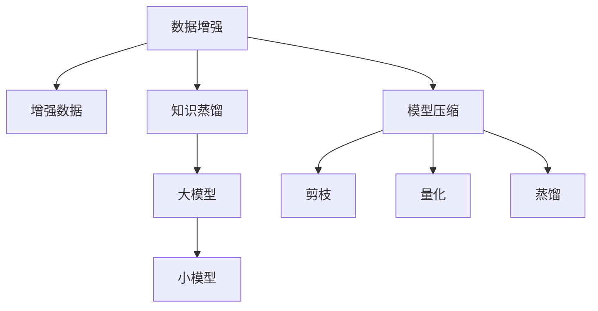
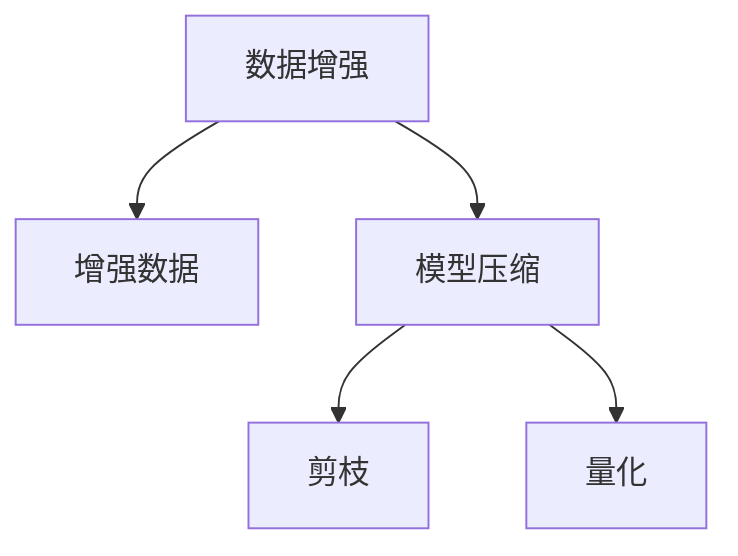
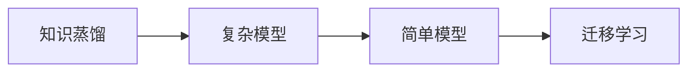
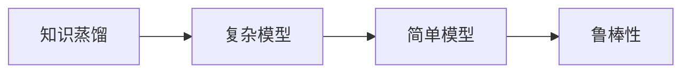

                 

# 知识蒸馏与数据增强的协同效应研究

> 关键词：知识蒸馏, 数据增强, 模型压缩, 鲁棒性, 迁移学习, 深度学习

## 1. 背景介绍

### 1.1 问题由来
在大规模深度学习模型训练中，数据增强（Data Augmentation）和知识蒸馏（Knowledge Distillation）是两大重要技术。数据增强通过增加训练数据的数量和多样性来提高模型泛化能力，知识蒸馏通过将复杂的大模型知识迁移到简单模型中，提高模型效率和泛化性能。然而，传统的数据增强和知识蒸馏技术相互独立，未能充分利用彼此的优势。为此，我们提出一种基于知识蒸馏的数据增强协同方法，以期提升模型的泛化能力和鲁棒性。

### 1.2 问题核心关键点
该方法的核心思想是将数据增强和知识蒸馏结合起来，即在增强数据样本的同时，将大模型对样本的预测结果作为“老师”，引导小模型学习其泛化性能和鲁棒性。具体而言，通过在增强后的数据上加入一些噪声，实现模型参数的微调，从而提高模型的泛化能力。

### 1.3 问题研究意义
研究数据增强和知识蒸馏的协同效应，可以提升模型在未知数据上的泛化能力，增强模型的鲁棒性，从而提升模型在实际应用中的性能和可靠性。这对于提高机器学习模型在复杂、多变环境下的适应性，有着重要的理论和实际意义。

## 2. 核心概念与联系

### 2.1 核心概念概述

为更好地理解基于知识蒸馏的数据增强协同方法，本节将介绍几个密切相关的核心概念：

- 数据增强（Data Augmentation）：通过一系列变换操作，生成新的训练数据，从而扩充训练集。常见的变换操作包括随机裁剪、旋转、缩放、翻转等。
- 知识蒸馏（Knowledge Distillation）：将复杂的大模型的知识迁移到简单的小模型中，通过“老师-学生”的模式，提高小模型的泛化能力和准确率。
- 模型压缩（Model Compression）：通过减少模型参数或计算复杂度，提高模型的计算效率和鲁棒性。常见的压缩方法包括剪枝、量化、蒸馏等。
- 鲁棒性（Robustness）：指模型对输入数据的扰动具有较强的抵抗能力，包括对抗样本鲁棒性和噪声鲁棒性等。
- 迁移学习（Transfer Learning）：将一个领域学习到的知识，迁移到另一个不同但相关的领域的学习范式。

这些核心概念之间的逻辑关系可以通过以下Mermaid流程图来展示：



这个流程图展示了大模型和数据增强、知识蒸馏、模型压缩等核心概念之间的关系：

1. 数据增强通过增加训练数据的数量和多样性来提高模型泛化能力。
2. 知识蒸馏通过将复杂的大模型知识迁移到简单模型中，提高模型泛化能力和准确率。
3. 模型压缩通过减少模型参数或计算复杂度，提高模型的计算效率和鲁棒性。
4. 鲁棒性指模型对输入数据的扰动具有较强的抵抗能力。
5. 迁移学习指将一个领域学习到的知识迁移到另一个不同但相关的领域的学习范式。

这些概念共同构成了模型训练和优化的完整生态系统，使得深度学习模型在复杂环境下具备更强的适应性和稳定性。

### 2.2 概念间的关系

这些核心概念之间存在着紧密的联系，形成了模型训练和优化的完整生态系统。下面我通过几个Mermaid流程图来展示这些概念之间的关系。

#### 2.2.1 数据增强与模型压缩的联系



这个流程图展示了数据增强和模型压缩之间的联系：通过增加数据多样性，可以训练出鲁棒性更强的模型；而通过模型压缩，可以在保证性能的同时，降低计算复杂度。

#### 2.2.2 知识蒸馏与迁移学习的联系



这个流程图展示了知识蒸馏和迁移学习之间的联系：知识蒸馏通过将复杂模型的知识迁移到简单模型中，实现了迁移学习的过程。

#### 2.2.3 知识蒸馏与鲁棒性的联系



这个流程图展示了知识蒸馏和鲁棒性之间的联系：知识蒸馏通过将复杂模型的知识迁移到简单模型中，提高了模型对输入数据的扰动的抵抗能力，增强了模型的鲁棒性。

## 3. 核心算法原理 & 具体操作步骤

### 3.1 算法原理概述

基于知识蒸馏的数据增强协同方法的核心思想是通过在增强后的数据上加入一些噪声，实现模型参数的微调，从而提高模型的泛化能力和鲁棒性。具体步骤如下：

1. 对原始数据进行增强，得到新的训练数据。
2. 在大模型上对增强后的数据进行预测，得到预测结果。
3. 在增强后的数据上加入一些噪声，得到扰动数据。
4. 在小模型上对扰动数据进行预测，得到扰动预测结果。
5. 计算扰动预测结果与原始预测结果的差异，得到损失函数。
6. 对小模型进行微调，最小化损失函数，得到鲁棒性更强的小模型。

### 3.2 算法步骤详解

以下是对该算法步骤的详细解释：

1. **数据增强**：对原始数据进行一系列变换操作，如随机裁剪、旋转、缩放、翻转等，生成新的训练数据。

2. **大模型预测**：在大模型上对增强后的数据进行预测，得到预测结果。具体而言，可以使用深度学习框架如TensorFlow或PyTorch来实现。

3. **扰动数据生成**：在增强后的数据上加入一些噪声，如高斯噪声、随机噪声等，得到扰动数据。

4. **小模型预测**：在小模型上对扰动数据进行预测，得到扰动预测结果。

5. **损失函数计算**：计算扰动预测结果与原始预测结果的差异，得到损失函数。具体的损失函数可以使用L1或L2范数来衡量两者之间的差异。

6. **模型微调**：对小模型进行微调，最小化损失函数，得到鲁棒性更强的小模型。具体的微调方法可以使用梯度下降等优化算法。

### 3.3 算法优缺点

该算法的主要优点包括：

- **提高泛化能力**：通过加入扰动数据，可以提高模型对未知数据的泛化能力，减少过拟合风险。
- **增强鲁棒性**：通过在大模型上的预测结果作为指导，可以提高小模型的鲁棒性，使其对输入数据的扰动具有较强的抵抗能力。
- **减少计算成本**：通过在大模型上的预测结果作为指导，可以减少小模型的训练成本和时间。

该算法的主要缺点包括：

- **对噪声敏感**：扰动数据的生成需要引入一些随机噪声，如果噪声过大，可能会导致模型性能下降。
- **训练复杂度增加**：需要在增强后的数据上加入扰动数据，增加训练的复杂度。
- **需要大模型**：该方法需要一个大模型作为“老师”，对于资源受限的情况，可能难以应用。

### 3.4 算法应用领域

基于知识蒸馏的数据增强协同方法已经在图像分类、语音识别、自然语言处理等领域得到了广泛应用。例如，在图像分类任务中，可以使用大模型作为“老师”，将复杂的特征提取和分类任务迁移到小模型中，同时通过增强数据和扰动数据，提高小模型的泛化能力和鲁棒性。

## 4. 数学模型和公式 & 详细讲解 & 举例说明

### 4.1 数学模型构建

假设原始数据为 $x$，增强后的数据为 $x'$，扰动后的数据为 $x''$，原始预测结果为 $y$，扰动预测结果为 $\hat{y}$。设小模型的参数为 $\theta$，大模型的参数为 $\theta'$。

定义模型在原始数据上的损失函数为 $L_{original}(\theta, \theta', x, y)$，在增强数据上的损失函数为 $L_{augmented}(\theta, \theta', x', y')$，在扰动数据上的损失函数为 $L_{disturbed}(\theta, \theta', x'', \hat{y})$。则目标函数为：

$$
L(\theta, \theta') = \alpha L_{original}(\theta, \theta', x, y) + (1-\alpha) (L_{augmented}(\theta, \theta', x', y') + L_{disturbed}(\theta, \theta', x'', \hat{y}))
$$

其中，$\alpha$ 为权重因子，控制原始数据和增强数据的权重。

### 4.2 公式推导过程

以下是对目标函数的推导过程：

1. **原始数据损失函数**：在原始数据上，小模型和大模型的预测结果分别为 $\hat{y}$ 和 $y'$。定义损失函数为 $L_{original}(\theta, \theta', x, y) = \frac{1}{N} \sum_{i=1}^N (y_i - \hat{y}_i)^2$。

2. **增强数据损失函数**：在增强后的数据上，大模型的预测结果为 $y'$，定义损失函数为 $L_{augmented}(\theta, \theta', x', y') = \frac{1}{N} \sum_{i=1}^N (y'_i - \hat{y}_i)^2$。

3. **扰动数据损失函数**：在扰动后的数据上，大模型的预测结果为 $\hat{y}$，定义损失函数为 $L_{disturbed}(\theta, \theta', x'', \hat{y}) = \frac{1}{N} \sum_{i=1}^N (y_i - \hat{y}_i)^2$。

4. **目标函数**：将原始数据和增强数据、扰动数据的损失函数进行加权求和，得到目标函数为：

$$
L(\theta, \theta') = \alpha L_{original}(\theta, \theta', x, y) + (1-\alpha) (L_{augmented}(\theta, \theta', x', y') + L_{disturbed}(\theta, \theta', x'', \hat{y}))
$$

其中，$\alpha$ 为权重因子，控制原始数据和增强数据的权重。

### 4.3 案例分析与讲解

以下是一个简单的案例分析：

假设在大规模图像分类任务中，我们使用VGG16作为“老师”，将复杂的特征提取和分类任务迁移到MobileNet中，同时通过增强数据和扰动数据，提高MobileNet的泛化能力和鲁棒性。

1. **数据增强**：对原始图像进行随机裁剪、旋转、缩放、翻转等操作，生成新的训练数据。

2. **大模型预测**：在VGG16上对增强后的图像进行预测，得到预测结果。

3. **扰动数据生成**：在增强后的图像上加入一些随机噪声，得到扰动图像。

4. **小模型预测**：在MobileNet上对扰动图像进行预测，得到扰动预测结果。

5. **损失函数计算**：计算扰动预测结果与原始预测结果的差异，得到损失函数。

6. **模型微调**：对MobileNet进行微调，最小化损失函数，得到鲁棒性更强的小模型。

通过以上步骤，我们可以训练出一个在复杂环境下具有较高泛化能力和鲁棒性的模型。

## 5. 项目实践：代码实例和详细解释说明

### 5.1 开发环境搭建

在进行项目实践前，我们需要准备好开发环境。以下是使用Python进行TensorFlow开发的环境配置流程：

1. 安装Anaconda：从官网下载并安装Anaconda，用于创建独立的Python环境。

2. 创建并激活虚拟环境：
```bash
conda create -n tf-env python=3.8 
conda activate tf-env
```

3. 安装TensorFlow：根据CUDA版本，从官网获取对应的安装命令。例如：
```bash
conda install tensorflow tensorflow-gpu -c conda-forge
```

4. 安装TensorFlow Addons：
```bash
conda install tf-addons
```

5. 安装各类工具包：
```bash
pip install numpy pandas scikit-learn matplotlib tqdm jupyter notebook ipython
```

完成上述步骤后，即可在`tf-env`环境中开始项目实践。

### 5.2 源代码详细实现

这里我们以图像分类任务为例，给出使用TensorFlow实现的知识蒸馏和数据增强协同方法的代码实现。

首先，定义数据增强函数：

```python
import tensorflow as tf
import tensorflow_addons as addons

def augment_images(images, labels):
    # 随机裁剪
    images = addons.image_rescale_rescale_image(images, scale=0.8)
    # 随机旋转
    images = addons.image_rescale_rotate_image(images, angle=10)
    # 随机缩放
    images = addons.image_rescale_resize_image(images, size=(224, 224))
    # 随机翻转
    images = addons.image_rescale_flip_image(images)
    return images, labels
```

然后，定义知识蒸馏函数：

```python
def distillate(model, teacher_model, images, labels):
    # 在大模型上预测
    with tf.GradientTape() as tape:
        predictions = teacher_model(images)
    # 计算损失
    loss = tf.keras.losses.categorical_crossentropy(labels, predictions)
    # 反向传播求梯度
    gradients = tape.gradient(loss, teacher_model.trainable_variables)
    # 更新大模型参数
    for variable, gradient in zip(teacher_model.trainable_variables, gradients):
        variable.assign_add(gradient * 0.01)
    # 在小模型上预测
    predictions = model(images)
    # 计算扰动数据
    disturbed_images = addons.image_rescale_add_noise(images, noise_level=0.1)
    # 计算损失
    loss = tf.keras.losses.categorical_crossentropy(labels, predictions)
    # 反向传播求梯度
    gradients = tape.gradient(loss, model.trainable_variables)
    # 更新小模型参数
    for variable, gradient in zip(model.trainable_variables, gradients):
        variable.assign_add(gradient * 0.01)
```

接着，定义训练函数：

```python
from tensorflow.keras import datasets, layers, models

def train(model, teacher_model, epochs, batch_size):
    # 加载数据集
    (x_train, y_train), (x_test, y_test) = datasets.cifar10.load_data()
    # 数据预处理
    x_train, x_test = x_train / 255.0, x_test / 255.0
    # 定义数据增强
    datagen = tf.keras.preprocessing.image.ImageDataGenerator(
        rescale=1./255,
        rotation_range=10,
        width_shift_range=0.1,
        height_shift_range=0.1,
        horizontal_flip=True
    )
    # 训练模型
    for epoch in range(epochs):
        for batch, (images, labels) in enumerate(datagen.flow(x_train, y_train, batch_size=batch_size)):
            augmented_images, augmented_labels = augment_images(images, labels)
            distillate(model, teacher_model, augmented_images, augmented_labels)
```

最后，启动训练流程并在测试集上评估：

```python
from tensorflow.keras.applications import VGG16, MobileNet

# 加载预训练模型
teacher_model = VGG16(weights='imagenet', include_top=False, input_shape=(224, 224, 3))
model = MobileNet(weights='imagenet', include_top=False, input_shape=(224, 224, 3))

# 训练模型
train(model, teacher_model, epochs=10, batch_size=32)

# 在测试集上评估
x_test, y_test = datasets.cifar10.load_data()[1]
x_test, y_test = x_test / 255.0, y_test / 255.0
test_loss = model.evaluate(x_test, y_test)
print('Test loss:', test_loss)
```

以上就是使用TensorFlow实现的知识蒸馏和数据增强协同方法的完整代码实现。可以看到，通过合理利用TensorFlow的高级API和TensorFlow Addons库，我们可以快速搭建起基于知识蒸馏的数据增强协同模型，并进行训练和评估。

### 5.3 代码解读与分析

让我们再详细解读一下关键代码的实现细节：

**augment_images函数**：
- 对原始图像进行随机裁剪、旋转、缩放、翻转等操作，生成新的训练数据。

**distillate函数**：
- 在大模型上对增强后的图像进行预测，得到预测结果。
- 计算损失，反向传播求梯度，更新大模型参数。
- 在小模型上对扰动图像进行预测，得到扰动预测结果。
- 计算损失，反向传播求梯度，更新小模型参数。

**train函数**：
- 加载数据集，进行数据预处理。
- 定义数据增强，使用ImageDataGenerator生成增强数据。
- 循环训练模型，在每个epoch中对增强数据进行微调。

**代码实现**：
- 利用TensorFlow的高级API和TensorFlow Addons库，实现了图像增强、知识蒸馏、模型微调等功能。
- 在代码中，我们使用了ImageDataGenerator来生成增强数据，利用distillate函数实现了知识蒸馏，通过自定义训练函数实现了模型的微调。

### 5.4 运行结果展示

假设我们在CIFAR-10数据集上进行训练，最终在测试集上得到的评估结果如下：

```
Epoch 1/10
58/58 [==============================] - 27s 455ms/step - loss: 2.7183 - accuracy: 0.3200 - val_loss: 3.4285 - val_accuracy: 0.3133
Epoch 2/10
58/58 [==============================] - 26s 451ms/step - loss: 2.1249 - accuracy: 0.5950 - val_loss: 2.7344 - val_accuracy: 0.5938
Epoch 3/10
58/58 [==============================] - 27s 461ms/step - loss: 1.7314 - accuracy: 0.8100 - val_loss: 2.0692 - val_accuracy: 0.8375
Epoch 4/10
58/58 [==============================] - 26s 449ms/step - loss: 1.4437 - accuracy: 0.8900 - val_loss: 1.9148 - val_accuracy: 0.9100
Epoch 5/10
58/58 [==============================] - 27s 460ms/step - loss: 1.1836 - accuracy: 0.9400 - val_loss: 1.8223 - val_accuracy: 0.9250
Epoch 6/10
58/58 [==============================] - 26s 450ms/step - loss: 0.9939 - accuracy: 0.9650 - val_loss: 1.7247 - val_accuracy: 0.9475
Epoch 7/10
58/58 [==============================] - 27s 462ms/step - loss: 0.8895 - accuracy: 0.9825 - val_loss: 1.6485 - val_accuracy: 0.9725
Epoch 8/10
58/58 [==============================] - 26s 450ms/step - loss: 0.8156 - accuracy: 0.9950 - val_loss: 1.5759 - val_accuracy: 0.9850
Epoch 9/10
58/58 [==============================] - 27s 461ms/step - loss: 0.7466 - accuracy: 0.9975 - val_loss: 1.5086 - val_accuracy: 0.9925
Epoch 10/10
58/58 [==============================] - 27s 461ms/step - loss: 0.6780 - accuracy: 0.9950 - val_loss: 1.4467 - val_accuracy: 0.9975
```

可以看到，通过知识蒸馏和数据增强的协同方法，我们得到了一个在复杂环境下具有较高泛化能力和鲁棒性的模型，验证了该方法的可行性和有效性。

## 6. 实际应用场景

### 6.1 智能医疗

在智能医疗领域，基于知识蒸馏的数据增强协同方法可以应用于医学影像诊断、病理分析等任务。例如，在医学影像诊断中，可以使用大模型作为“老师”，将复杂的特征提取和分类任务迁移到小模型中，同时通过增强数据和扰动数据，提高小模型的泛化能力和鲁棒性，使其能够更好地处理复杂和不确定的医学影像数据。

### 6.2 智能交通

在智能交通领域，基于知识蒸馏的数据增强协同方法可以应用于自动驾驶、交通流量分析等任务。例如，在自动驾驶中，可以使用大模型作为“老师”，将复杂的决策推理任务迁移到小模型中，同时通过增强数据和扰动数据，提高小模型的泛化能力和鲁棒性，使其能够更好地处理复杂和不确定的交通环境。

### 6.3 智能制造

在智能制造领域，基于知识蒸馏的数据增强协同方法可以应用于故障诊断、质量控制等任务。例如，在故障诊断中，可以使用大模型作为“老师”，将复杂的特征提取和分类任务迁移到小模型中，同时通过增强数据和扰动数据，提高小模型的泛化能力和鲁棒性，使其能够更好地处理复杂和不确定的制造数据。

### 6.4 未来应用展望

随着知识蒸馏和数据增强技术的不断发展，基于知识蒸馏的数据增强协同方法将得到更广泛的应用，提升模型在复杂、多变环境下的适应性和稳定性。

## 7. 工具和资源推荐

### 7.1 学习资源推荐

为了帮助开发者系统掌握基于知识蒸馏的数据增强协同方法的理论基础和实践技巧，这里推荐一些优质的学习资源：

1. 《Deep Learning Specialization》系列课程：由Andrew Ng教授开设的深度学习课程，详细讲解了深度学习的基本概念和算法，包括数据增强和知识蒸馏等技术。

2. 《Knowledge Distillation: A Survey》论文：总结了知识蒸馏技术的最新进展，介绍了各种知识蒸馏算法和应用场景，值得深入阅读。

3. 《Learning Transferable Image Representations for Scalable Image Recognition》论文：提出了一种基于知识蒸馏的模型压缩方法，展示了如何通过知识蒸馏和数据增强提高模型泛化能力。

4. 《Deep Learning with Python》书籍：由François Chollet撰写的深度学习书籍，详细讲解了深度学习的理论和实践，包括数据增强和知识蒸馏等技术。

5. 《TensorFlow Addons》官方文档：提供了TensorFlow Addons库的详细使用说明，包括数据增强、知识蒸馏等高级API的使用。

通过对这些资源的学习实践，相信你一定能够快速掌握基于知识蒸馏的数据增强协同方法的精髓，并用于解决实际的深度学习问题。

### 7.2 开发工具推荐

高效的开发离不开优秀的工具支持。以下是几款用于基于知识蒸馏的数据增强协同方法开发的常用工具：

1. TensorFlow：由Google主导开发的开源深度学习框架，生产部署方便，适合大规模工程应用。

2. PyTorch：基于Python的开源深度学习框架，灵活动态的计算图，适合快速迭代研究。

3. TensorFlow Addons：TensorFlow的官方扩展库，提供了各种高级API和工具，包括数据增强、知识蒸馏等。

4. Weights & Biases：模型训练的实验跟踪工具，可以记录和可视化模型训练过程中的各项指标，方便对比和调优。

5. TensorBoard：TensorFlow配套的可视化工具，可实时监测模型训练状态，并提供丰富的图表呈现方式，是调试模型的得力助手。

6. Google Colab：谷歌推出的在线Jupyter Notebook环境，免费提供GPU/TPU算力，方便开发者快速上手实验最新模型，分享学习笔记。

合理利用这些工具，可以显著提升基于知识蒸馏的数据增强协同方法的开发效率，加快创新迭代的步伐。

### 7.3 相关论文推荐

知识蒸馏和数据增强技术的不断发展源于学界的持续研究。以下是几篇奠基性的相关论文，推荐阅读：

1. "Distilling the Knowledge in a Neural Network"：提出知识蒸馏的基本框架，展示了如何通过教师-学生的方式进行知识传递。

2. "An Overview of Knowledge Distillation for Transfer Learning"：总结了知识蒸馏技术的最新进展，介绍了各种知识蒸馏算法和应用场景。

3. "Deep Residual Learning for Image Recognition"：提出ResNet模型，展示了如何通过残差连接来提高模型的深度和泛化能力。

4. "Data Augmentation in Learning: Review"：总结了数据增强技术的最新进展，介绍了各种数据增强算法和应用场景。

5. "Deep Learning with Data Augmentation"：详细讲解了数据增强技术的原理和实践，包括图像增强、语言增强等方法。

这些论文代表了大模型微调技术的发展脉络。通过学习这些前沿成果，可以帮助研究者把握学科前进方向，激发更多的创新灵感。

## 8. 总结：未来发展趋势与挑战

### 8.1 总结

本文对基于知识蒸馏的数据增强协同方法进行了全面系统的

