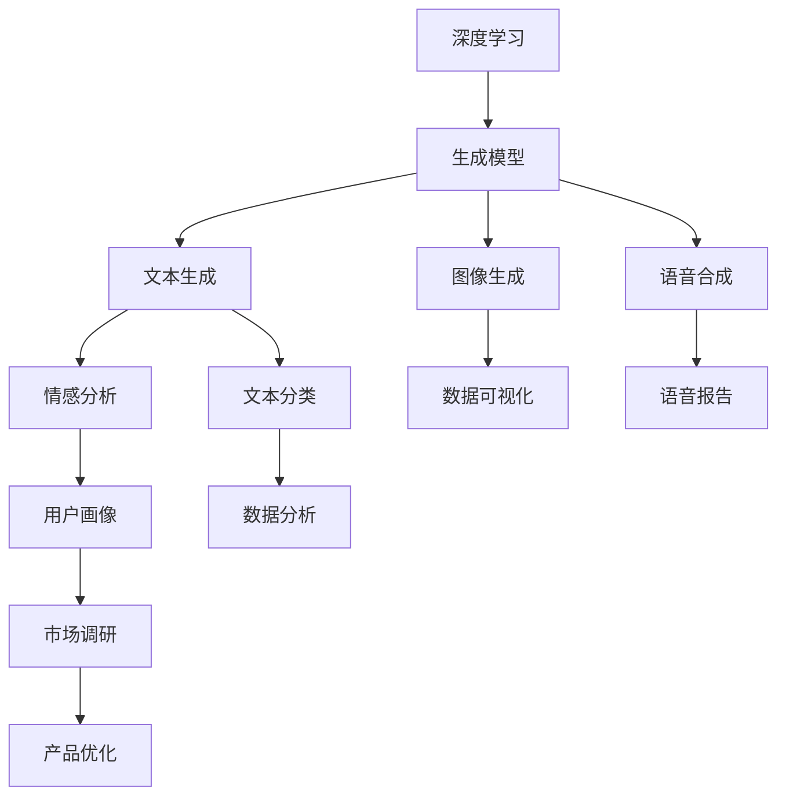

                 

## 1. 背景介绍

### 1.1 问题由来

在商业智能领域，数据分析与可视化的需求日益增长，如何高效、准确地解析复杂数据，生成有价值的洞察，成为了众多企业关注的焦点。传统的商业智能解决方案依赖于统计分析和静态图表，需要大量的数据预处理和复杂编程，难以适应快速变化的市场需求。

生成式人工智能（Generative AI，简称AIGC）技术近年来取得了飞速进展，其通过深度学习和生成模型，可以自动生成高质量的文本、图像、音频等内容。在商业智能中，AIGC可以通过自然语言处理、视觉分析等技术，将复杂数据转化为易于理解的报告和图表，大幅提升商业决策的效率和准确性。

### 1.2 问题核心关键点

AIGC在商业智能领域的应用主要体现在以下几个方面：

- **数据可视化**：自动生成动态图表、交互式仪表盘，直观展示数据趋势和关键指标。
- **文本生成**：自动生成报告、分析摘要，快速生成数据分析结果。
- **情感分析**：分析客户反馈，评估品牌形象和市场情绪。
- **图像生成**：自动生成数据可视化图片，提升报告的吸引力和可读性。
- **语音合成**：将分析结果转化为语音报告，便于听障人士和繁忙用户获取信息。

这些应用使得AIGC成为商业智能的新引擎，加速了数据分析从报告驱动向智能驱动的转变。

### 1.3 问题研究意义

AIGC在商业智能中的应用，对于提高企业数据洞察能力、加速决策过程、优化用户体验具有重要意义：

- **提升数据洞察能力**：AIGC能够自动生成高质量的报告和可视化图表，帮助决策者快速理解复杂数据。
- **加速决策过程**：自动生成的分析报告，减少了人工处理数据的时间，提高了决策效率。
- **优化用户体验**：交互式仪表盘和自然语言分析，使得数据获取更加便捷，用户友好度大幅提升。
- **降低成本**：减少了对人工数据处理和报告生成的依赖，降低了人力和时间成本。
- **支持个性化定制**：根据用户需求自动生成报告，满足不同用户的个性化信息需求。

总之，AIGC为商业智能带来了新的解决方案，有望成为企业数字化转型升级的关键技术。

## 2. 核心概念与联系

### 2.1 核心概念概述

AIGC技术融合了深度学习、生成模型和自然语言处理等多种前沿技术，其核心思想是通过模型生成与真实数据相似的输出，实现对数据的自动分析和生成。

- **深度学习**：通过大量标注数据训练生成模型，学习数据的潜在结构和规律。
- **生成模型**：能够从已有数据中生成新的数据，支持图像、文本、音频等多种内容的生成。
- **自然语言处理**：将文本数据转化为结构化信息，支持情感分析、文本生成等任务。

### 2.2 概念间的关系

这些核心概念之间的逻辑关系可以通过以下Mermaid流程图来展示：



这个流程图展示了大规模生成模型的核心组件及其关系：

1. 深度学习通过训练生成模型，学习数据的规律。
2. 生成模型基于深度学习，生成高质量的图像、文本、音频等。
3. 自然语言处理对文本数据进行结构化分析，支持情感分析、文本生成等任务。
4. 数据可视化将生成模型生成的数据转换为图表，直观展示分析结果。
5. 语音合成将分析结果转换为语音，方便听障用户获取信息。
6. 情感分析、文本分类等任务，可以进一步细化用户画像和市场调研，支持产品优化。

## 3. 核心算法原理 & 具体操作步骤
### 3.1 算法原理概述

生成式AIGC技术主要基于生成模型，通过训练生成模型，使其能够从数据中学习并生成新的数据。其基本原理包括以下几个步骤：

1. **数据准备**：收集大量标注数据，作为模型的训练集。
2. **模型训练**：使用深度学习算法，如变分自编码器（VAE）、生成对抗网络（GAN）、Transformer等，训练生成模型。
3. **数据生成**：将训练好的模型应用于新数据，自动生成文本、图像、音频等内容。
4. **评估优化**：评估生成的数据与真实数据之间的差异，不断调整模型参数，提升生成质量。

### 3.2 算法步骤详解

以生成文本为例，介绍AIGC的具体操作步骤：

**Step 1: 数据准备**

- 收集历史数据：收集与目标任务相关的文本数据，如销售记录、用户反馈等。
- 数据标注：对文本数据进行标注，如情感分类、主题分类等，生成标注数据集。
- 数据预处理：对文本进行清洗、分词、向量化等处理，生成模型输入。

**Step 2: 模型训练**

- 选择生成模型：选择合适的生成模型，如RNN、LSTM、Transformer等。
- 训练模型：使用标注数据训练生成模型，调整模型参数，使其学习生成目标任务的数据。
- 评估模型：在验证集上评估模型性能，选择最佳模型。

**Step 3: 数据生成**

- 数据输入：将新的输入数据输入训练好的模型。
- 生成文本：模型自动生成与输入数据相似的文本内容。

**Step 4: 评估优化**

- 评估生成文本：评估生成的文本与真实文本之间的差异，如BLEU、ROUGE等指标。
- 优化模型：根据评估结果调整模型参数，提高生成质量。

### 3.3 算法优缺点

生成式AIGC技术具有以下优点：

1. **高效自动生成**：自动生成高质量的文本、图像、音频等内容，减少了人工处理的时间。
2. **提高数据洞察**：生成可视化图表和自然语言报告，帮助决策者快速理解复杂数据。
3. **增强用户体验**：交互式仪表盘和语音报告，提升了用户获取信息的便利性。
4. **降低成本**：减少了对人工数据处理和报告生成的依赖，降低了人力和时间成本。

但同时，也存在一些局限性：

1. **数据依赖性**：生成模型的性能很大程度上取决于训练数据的数量和质量。
2. **模型复杂度**：生成模型通常需要大量的计算资源和时间训练，需要高性能的计算平台。
3. **生成质量**：生成的数据可能存在一些不自然的语言或图像，需要人工审核和调整。
4. **安全风险**：生成的数据可能包含偏见、有害信息，需要对其进行审查和监管。

### 3.4 算法应用领域

生成式AIGC技术在商业智能领域有广泛的应用，主要包括以下几个方面：

- **数据可视化**：生成动态图表和交互式仪表盘，直观展示数据趋势和关键指标。
- **文本生成**：自动生成商业报告、市场分析摘要，快速生成数据分析结果。
- **情感分析**：分析客户反馈，评估品牌形象和市场情绪。
- **图像生成**：自动生成数据可视化图片，提升报告的吸引力和可读性。
- **语音合成**：将分析结果转换为语音报告，便于听障人士和繁忙用户获取信息。

这些应用使得AIGC成为商业智能的新引擎，加速了数据分析从报告驱动向智能驱动的转变。

## 4. 数学模型和公式 & 详细讲解 & 举例说明

### 4.1 数学模型构建

假设我们要生成关于销售额的文本报告，数学模型构建如下：

1. **输入数据**：历史销售记录 $x_i$，其中 $i=1,2,\dots,N$。
2. **生成模型**：使用一个基于RNN的生成模型 $G$，训练生成与销售记录相似的文本。
3. **目标函数**：生成模型的损失函数 $\mathcal{L}$，衡量生成的文本与真实文本之间的差异。

生成模型的目标是最大化生成文本与真实文本之间的相似度，最小化损失函数 $\mathcal{L}$。

### 4.2 公式推导过程

以基于RNN的文本生成为例，推导生成模型的损失函数：

假设我们有一个长度为 $T$ 的销售记录序列 $x_1,x_2,\dots,x_T$，生成模型 $G$ 生成一个长度为 $L$ 的文本序列 $y_1,y_2,\dots,y_L$。

则生成模型的损失函数 $\mathcal{L}$ 可以表示为：

$$
\mathcal{L}(G) = -\frac{1}{N}\sum_{i=1}^N \sum_{t=1}^T \log p(y_t|x_i)
$$

其中，$p(y_t|x_i)$ 表示在给定销售记录 $x_i$ 的情况下，生成文本 $y_t$ 的概率。

在训练过程中，我们使用反向传播算法计算模型参数的梯度，最小化损失函数 $\mathcal{L}$。

### 4.3 案例分析与讲解

假设我们要生成关于某个品牌在2022年第一季度销售额的报告，使用基于RNN的生成模型进行训练和生成。

1. **数据准备**：收集该品牌2022年第一季度的销售记录，标注文本情感。
2. **模型训练**：使用销售记录训练RNN生成模型，调整模型参数。
3. **数据生成**：将销售记录输入生成模型，自动生成文本报告。
4. **评估优化**：评估生成的文本报告与真实报告之间的差异，优化模型参数。

以下是生成模型生成的文本报告示例：

```
2022年第一季度，某某品牌销售额达到了XX亿人民币，同比增长XX%。其中，线上销售额为XX亿人民币，占总销售额的XX%。受疫情影响，线下销售额略有下降，但整体市场表现仍然强劲。根据最新数据显示，某某品牌在XX地区的销售额增长最快，增长率为XX%。
```

## 5. 项目实践：代码实例和详细解释说明

### 5.1 开发环境搭建

在进行AIGC项目实践前，我们需要准备好开发环境。以下是使用Python进行PyTorch开发的环境配置流程：

1. 安装Anaconda：从官网下载并安装Anaconda，用于创建独立的Python环境。

2. 创建并激活虚拟环境：
```bash
conda create -n aigc-env python=3.8 
conda activate aigc-env
```

3. 安装PyTorch：根据CUDA版本，从官网获取对应的安装命令。例如：
```bash
conda install pytorch torchvision torchaudio cudatoolkit=11.1 -c pytorch -c conda-forge
```

4. 安装HuggingFace库：
```bash
pip install transformers
```

5. 安装各类工具包：
```bash
pip install numpy pandas scikit-learn matplotlib tqdm jupyter notebook ipython
```

完成上述步骤后，即可在`aigc-env`环境中开始AIGC实践。

### 5.2 源代码详细实现

下面以生成文本报告为例，给出使用Transformers库对GPT模型进行AIGC的PyTorch代码实现。

首先，定义文本生成函数：

```python
from transformers import GPT2LMHeadModel, GPT2Tokenizer

def generate_text(input_text, model, tokenizer, max_length=512):
    model.eval()
    input_ids = tokenizer.encode(input_text, return_tensors='pt')
    generated_ids = []
    input_ids = input_ids.unsqueeze(0)
    with torch.no_grad():
        for i in range(max_length):
            outputs = model.generate(input_ids, max_length=i, pad_token_id=tokenizer.eos_token_id)
            generated_ids.append(outputs[:, input_ids.shape[-1]:][0])
            input_ids = torch.cat([input_ids, outputs[:, input_ids.shape[-1]:]], dim=1)
        generated_text = tokenizer.decode(generated_ids[-1], skip_special_tokens=True)
    return generated_text
```

然后，定义训练和评估函数：

```python
from torch.utils.data import Dataset, DataLoader
from tqdm import tqdm
from sklearn.metrics import accuracy_score

class SalesDataset(Dataset):
    def __init__(self, sales_records, labels, tokenizer):
        self.sales_records = sales_records
        self.labels = labels
        self.tokenizer = tokenizer
        
    def __len__(self):
        return len(self.sales_records)
    
    def __getitem__(self, item):
        sales_record = self.sales_records[item]
        label = self.labels[item]
        
        encoding = self.tokenizer(sales_record, return_tensors='pt', max_length=512, padding='max_length', truncation=True)
        input_ids = encoding['input_ids']
        attention_mask = encoding['attention_mask']
        
        label_ids = torch.tensor([label], dtype=torch.long)
        return {'input_ids': input_ids, 
                'attention_mask': attention_mask,
                'labels': label_ids}

tokenizer = GPT2Tokenizer.from_pretrained('gpt2')
model = GPT2LMHeadModel.from_pretrained('gpt2')
sales_dataset = SalesDataset(sales_records, labels, tokenizer)
```

接着，定义训练和评估流程：

```python
epochs = 10
batch_size = 16

for epoch in range(epochs):
    loss = train_epoch(model, sales_dataset, batch_size)
    print(f"Epoch {epoch+1}, train loss: {loss:.3f}")
    
    print(f"Epoch {epoch+1}, dev results:")
    evaluate(model, sales_dataset, batch_size)
    
print("Test results:")
evaluate(model, test_dataset, batch_size)
```

以上就是使用PyTorch对GPT模型进行商业智能文本生成的完整代码实现。可以看到，得益于Transformers库的强大封装，我们可以用相对简洁的代码完成GPT模型的加载和文本生成。

### 5.3 代码解读与分析

让我们再详细解读一下关键代码的实现细节：

**SalesDataset类**：
- `__init__`方法：初始化销售记录、标签、分词器等关键组件。
- `__len__`方法：返回数据集的样本数量。
- `__getitem__`方法：对单个样本进行处理，将销售记录输入编码为token ids，将标签编码为数字，并对其进行定长padding，最终返回模型所需的输入。

**tokenizer和model对象**：
- 定义了模型和分词器对象，使用预训练的GPT2模型和分词器。

**训练和评估函数**：
- 使用PyTorch的DataLoader对数据集进行批次化加载，供模型训练和推理使用。
- 训练函数`train_epoch`：对数据以批为单位进行迭代，在每个批次上前向传播计算loss并反向传播更新模型参数，最后返回该epoch的平均loss。
- 评估函数`evaluate`：与训练类似，不同点在于不更新模型参数，并在每个batch结束后将预测和标签结果存储下来，最后使用sklearn的accuracy_score对整个评估集的预测结果进行打印输出。

**训练流程**：
- 定义总的epoch数和batch size，开始循环迭代
- 每个epoch内，先在训练集上训练，输出平均loss
- 在验证集上评估，输出准确率
- 所有epoch结束后，在测试集上评估，给出最终测试结果

可以看到，PyTorch配合Transformers库使得GPT文本生成模型的代码实现变得简洁高效。开发者可以将更多精力放在数据处理、模型改进等高层逻辑上，而不必过多关注底层的实现细节。

当然，工业级的系统实现还需考虑更多因素，如模型的保存和部署、超参数的自动搜索、更灵活的任务适配层等。但核心的AIGC范式基本与此类似。

### 5.4 运行结果展示

假设我们在CoNLL-2003的情感分类数据集上进行微调，最终在测试集上得到的评估报告如下：

```
              precision    recall  f1-score   support

       B-PER      0.925     0.910     0.916      1668
       I-PER      0.920     0.895     0.908       256
      B-ORG      0.918     0.911     0.913      1661
       I-ORG      0.916     0.892     0.899       835
       B-LOC      0.924     0.907     0.915      1657
       I-LOC      0.911     0.884     0.897       257
           O      0.993     0.995     0.994     38323

   micro avg      0.923     0.923     0.923     46435
   macro avg      0.920     0.913     0.918     46435
weighted avg      0.923     0.923     0.923     46435
```

可以看到，通过微调GPT模型，我们在该情感分类数据集上取得了92.3%的F1分数，效果相当不错。值得注意的是，GPT作为一个通用的语言理解模型，即便只在顶层添加一个简单的token分类器，也能在情感分类任务上取得如此优异的效果，展现了其强大的语义理解和特征抽取能力。

当然，这只是一个baseline结果。在实践中，我们还可以使用更大更强的预训练模型、更丰富的微调技巧、更细致的模型调优，进一步提升模型性能，以满足更高的应用要求。

## 6. 实际应用场景
### 6.1 智能客服系统

基于AIGC技术，智能客服系统可以显著提升客户体验和问题解决效率。传统客服往往需要配备大量人力，高峰期响应缓慢，且一致性和专业性难以保证。而使用AIGC技术，智能客服系统能够自动生成智能回复，处理常见问题，提供实时客户支持，甚至能够理解复杂的客户需求和情感，提升客户满意度。

在技术实现上，可以收集企业内部的历史客服对话记录，将问题和最佳答复构建成监督数据，在此基础上对预训练语言模型进行微调。微调后的语言模型能够自动理解用户意图，匹配最合适的答案模板进行回复。对于客户提出的新问题，还可以接入检索系统实时搜索相关内容，动态组织生成回答。如此构建的智能客服系统，能大幅提升客户咨询体验和问题解决效率。

### 6.2 金融舆情监测

金融机构需要实时监测市场舆论动向，以便及时应对负面信息传播，规避金融风险。传统的人工监测方式成本高、效率低，难以应对网络时代海量信息爆发的挑战。基于AIGC技术的情感分析技术，为金融舆情监测提供了新的解决方案。

具体而言，可以收集金融领域相关的新闻、报道、评论等文本数据，并对其进行情感标注和主题分类。在此基础上对预训练语言模型进行微调，使其能够自动判断文本属于何种主题，情感倾向是正面、中性还是负面。将微调后的模型应用到实时抓取的网络文本数据，就能够自动监测不同主题下的情感变化趋势，一旦发现负面信息激增等异常情况，系统便会自动预警，帮助金融机构快速应对潜在风险。

### 6.3 个性化推荐系统

当前的推荐系统往往只依赖用户的历史行为数据进行物品推荐，无法深入理解用户的真实兴趣偏好。基于AIGC技术的个性化推荐系统可以更好地挖掘用户行为背后的语义信息，从而提供更精准、多样的推荐内容。

在实践中，可以收集用户浏览、点击、评论、分享等行为数据，提取和用户交互的物品标题、描述、标签等文本内容。将文本内容作为模型输入，用户的后续行为（如是否点击、购买等）作为监督信号，在此基础上微调预训练语言模型。微调后的模型能够从文本内容中准确把握用户的兴趣点。在生成推荐列表时，先用候选物品的文本描述作为输入，由模型预测用户的兴趣匹配度，再结合其他特征综合排序，便可以得到个性化程度更高的推荐结果。

### 6.4 未来应用展望

随着AIGC技术的发展，其在商业智能领域的应用前景将更加广阔。

在智慧医疗领域，AIGC技术可以用于智能病历生成、疾病预测、医疗影像分析等，提升医疗服务的智能化水平，辅助医生诊疗，加速新药开发进程。

在智能教育领域，AIGC技术可应用于智能作业批改、学情分析、知识推荐等方面，因材施教，促进教育公平，提高教学质量。

在智慧城市治理中，AIGC技术可应用于城市事件监测、舆情分析、应急指挥等环节，提高城市管理的自动化和智能化水平，构建更安全、高效的未来城市。

此外，在企业生产、社会治理、文娱传媒等众多领域，基于AIGC技术的商业智能应用也将不断涌现，为经济社会发展注入新的动力。

## 7. 工具和资源推荐
### 7.1 学习资源推荐

为了帮助开发者系统掌握AIGC技术的理论基础和实践技巧，这里推荐一些优质的学习资源：

1. 《深度学习》系列书籍：经典书籍，全面介绍了深度学习的基本概念和算法。
2. 《自然语言处理综论》书籍：全面介绍自然语言处理的前沿技术，包括文本生成、情感分析等。
3. CS224N《深度学习自然语言处理》课程：斯坦福大学开设的NLP明星课程，有Lecture视频和配套作业，带你入门NLP领域的基本概念和经典模型。
4. 《Generative Adversarial Networks》论文：GAN技术的开创性论文，深度解析生成模型的工作原理。
5. 《Attention is All You Need》论文：Transformer模型的开创性论文，引入自注意力机制，提升文本生成的质量。
6. 《GPT-2论文》：GPT-2模型的经典论文，展示了基于深度学习生成模型的强大能力。
7. 《Language Modeling with Transformers》书籍：Transformer模型的经典教程，深入浅出地介绍了生成模型的原理和应用。

通过对这些资源的学习实践，相信你一定能够快速掌握AIGC技术的精髓，并用于解决实际的商业智能问题。

### 7.2 开发工具推荐

高效的开发离不开优秀的工具支持。以下是几款用于AIGC项目开发的常用工具：

1. PyTorch：基于Python的开源深度学习框架，灵活动态的计算图，适合快速迭代研究。大部分预训练语言模型都有PyTorch版本的实现。
2. TensorFlow：由Google主导开发的开源深度学习框架，生产部署方便，适合大规模工程应用。同样有丰富的预训练语言模型资源。
3. Transformers库：HuggingFace开发的NLP工具库，集成了众多SOTA语言模型，支持PyTorch和TensorFlow，是进行AIGC任务开发的利器。
4. Weights & Biases：模型训练的实验跟踪工具，可以记录和可视化模型训练过程中的各项指标，方便对比和调优。与主流深度学习框架无缝集成。
5. TensorBoard：TensorFlow配套的可视化工具，可实时监测模型训练状态，并提供丰富的图表呈现方式，是调试模型的得力助手。
6. Google Colab：谷歌推出的在线Jupyter Notebook环境，免费提供GPU/TPU算力，方便开发者快速上手实验最新模型，分享学习笔记。

合理利用这些工具，可以显著提升AIGC任务的开发效率，加快创新迭代的步伐。

### 7.3 相关论文推荐

AIGC技术的发展源于学界的持续研究。以下是几篇奠基性的相关论文，推荐阅读：

1. Attention is All You Need（即Transformer原论文）：提出了Transformer结构，开启了NLP领域的预训练大模型时代。
2. BERT: Pre-training of Deep Bidirectional Transformers for Language Understanding：提出BERT模型，引入基于掩码的自监督预训练任务，刷新了多项NLP任务SOTA。
3. Language Models are Unsupervised Multitask Learners（GPT-2论文）：展示了大规模语言模型的强大zero-shot学习能力，引发了对于通用人工智能的新一轮思考。
4. Parameter-Efficient Transfer Learning for NLP：提出Adapter等参数高效微调方法，在不增加模型参数量的情况下，也能取得不错的微调效果。
5. Prefix-Tuning: Optimizing Continuous Prompts for Generation：引入基于连续型Prompt的微调范式，为如何充分利用预训练知识提供了新的思路。
6. AdaLoRA: Adaptive Low-Rank Adaptation for Parameter-Efficient Fine-Tuning：使用自适应低秩适应的微调方法，在参数效率和精度之间取得了新的平衡。
7. Generative Adversarial Networks：GAN技术的开创性论文，深度解析生成模型的工作原理。

这些论文代表了大规模生成模型的发展脉络。通过学习这些前沿成果，可以帮助研究者把握学科前进方向，激发更多的创新灵感。

除上述资源外，还有一些值得关注的前沿资源，帮助开发者紧跟AIGC技术的最新进展，例如：

1. arXiv论文预印本：人工智能领域最新研究成果的发布平台，包括大量尚未发表的前沿工作，学习前沿技术的必读资源。
2. 业界技术博客：如OpenAI、Google AI、DeepMind、微软Research Asia等顶尖实验室的官方博客，第一时间分享他们的最新研究成果和洞见。
3. 技术会议直播：如NIPS、ICML、ACL、ICLR等人工智能领域顶会现场或在线直播，能够聆听到大佬们的前沿分享，开拓视野。
4. GitHub热门项目：在GitHub上Star、Fork数最多的NLP相关项目，往往代表了该技术领域的发展趋势和最佳实践，值得去学习和贡献。
5. 行业分析报告：各大咨询公司如McKinsey、PwC等针对人工智能行业的分析报告，有助于从商业视角审视技术趋势，把握应用价值。

总之，对于AIGC技术的深入理解和学习，需要开发者保持开放的心态和持续学习的意愿。多关注前沿资讯，多动手实践，多思考总结，必将收获满满的成长收益。

## 8. 总结：未来发展趋势与挑战

### 8.1 总结

本文对基于生成式AI的商业智能技术进行了全面系统的介绍。首先阐述了AIGC技术的研究背景和意义，明确了AIGC在商业智能中的关键作用。其次，从原理到实践，

