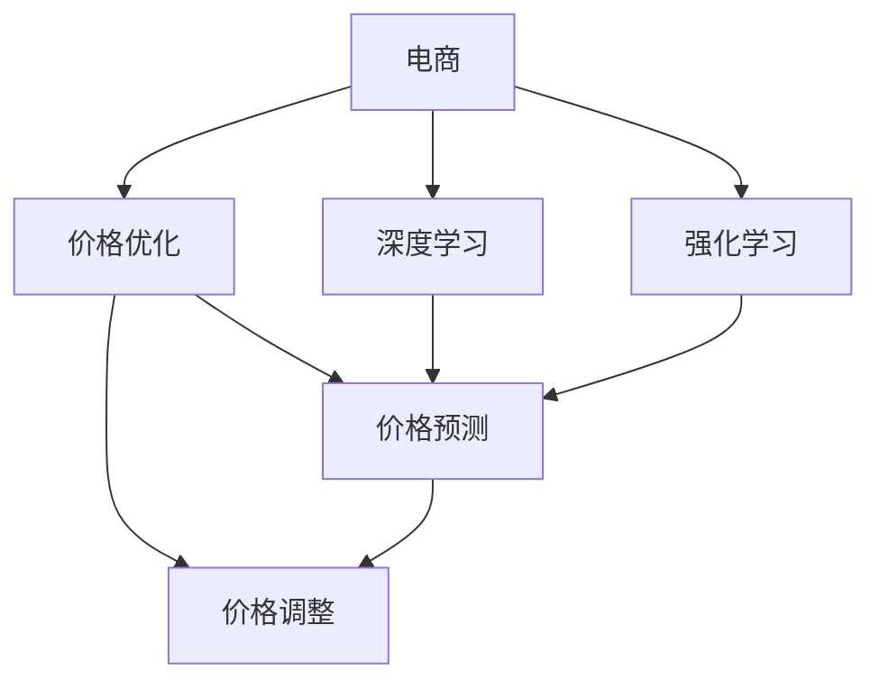
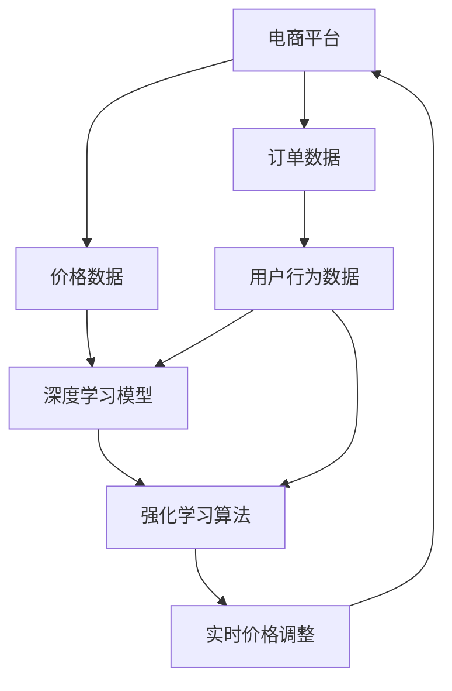

                 

# 电商价格优化的智能方案

> 关键词：电商,价格优化,智能方案,算法,机器学习

## 1. 背景介绍

随着电商行业的蓬勃发展，如何在保证销售利润的同时，实现价格的动态调整和优化，成为电商平台急需解决的重要问题。传统的方法主要是基于历史数据和简单的线性回归模型进行价格预测和调整，难以捕捉到价格的复杂变化规律，且调整频率低、精度有限。近年来，随着深度学习和强化学习的兴起，电商价格优化的智能化水平得以显著提升，能够实时响应市场变化，提供更加个性化和精细化的定价策略。

本文将系统介绍基于深度学习和强化学习技术的电商价格优化智能方案，涵盖算法原理、具体操作步骤、实际应用案例和未来展望等内容，以期为电商平台的定价策略优化提供全面的技术支持。

## 2. 核心概念与联系

### 2.1 核心概念概述

为更好地理解基于深度学习和强化学习的电商价格优化方法，本节将介绍几个密切相关的核心概念：

- **电商**：指在线销售商品和服务的一种商业模式，涉及在线平台、用户、商品、订单等关键要素。
- **价格优化**：指通过调整商品价格以提高销售额和利润，同时避免过饱和或过缺库存的过程。
- **深度学习**：一种模拟人脑神经网络结构的人工智能技术，通过多层非线性变换提取数据中的复杂特征。
- **强化学习**：一种通过智能体与环境的交互，基于奖励信号优化策略的学习方法，用于动态决策。
- **算法**：如线性回归、随机梯度下降、神经网络、深度Q网络等，用于解决电商价格优化中的复杂问题。

这些核心概念之间存在着紧密的联系，形成了电商价格优化的完整生态系统。深度学习和强化学习通过各自的优势，互补协作，共同实现电商价格的智能化优化。

### 2.2 概念间的关系

这些核心概念之间的逻辑关系可以通过以下Mermaid流程图来展示：



这个流程图展示了大语言模型的核心概念及其之间的关系：

1. 电商通过深度学习和强化学习技术，实现价格的智能化优化。
2. 深度学习用于构建价格预测模型，强化学习用于调整价格策略。
3. 价格预测模型和策略调整的结果，反馈到电商平台，用于实际价格优化。

### 2.3 核心概念的整体架构

最后，我们用一个综合的流程图来展示这些核心概念在大语言模型微调过程中的整体架构：



这个综合流程图展示了从价格数据获取到实时价格调整的完整过程。电商平台的订单数据和用户行为数据通过深度学习模型和强化学习算法进行处理，最终实现价格的动态调整和优化。

## 3. 核心算法原理 & 具体操作步骤
### 3.1 算法原理概述

电商价格优化的核心在于构建一个动态调整价格的系统，该系统能够根据市场变化、用户行为和销售数据，实时调整商品价格，以最大化销售额和利润。这一过程可以分为价格预测和价格调整两个阶段：

- **价格预测**：通过历史销售数据和市场特征，预测未来一段时间内商品的需求量。
- **价格调整**：基于预测的需求量和库存量，通过强化学习算法，动态调整商品价格。

深度学习和强化学习的结合，能够实现这两个阶段的无缝衔接，实时响应市场变化，提供最优化的价格策略。

### 3.2 算法步骤详解

基于深度学习和强化学习的电商价格优化一般包括以下几个关键步骤：

**Step 1: 数据收集与预处理**
- 收集电商平台的订单数据、用户行为数据、市场特征数据等，形成训练集。
- 对数据进行清洗、归一化、特征选择等预处理操作，确保数据的质量和可用性。

**Step 2: 构建深度学习模型**
- 根据价格预测任务的特点，选择合适的深度学习模型，如多层感知器、卷积神经网络等。
- 设计模型的输入、隐藏层和输出层结构，确保模型能够捕捉到数据中的复杂特征。

**Step 3: 训练深度学习模型**
- 使用训练集数据，对深度学习模型进行训练，调整模型参数以最小化损失函数。
- 使用验证集数据评估模型性能，根据性能指标选择最优模型。

**Step 4: 设计强化学习算法**
- 定义状态、动作、奖励等核心组件，明确智能体和环境之间的交互方式。
- 选择合适的强化学习算法，如深度Q网络、策略梯度等，用于动态调整价格策略。

**Step 5: 运行强化学习算法**
- 将训练好的深度学习模型嵌入到强化学习算法中，实现价格调整策略的实时更新。
- 在电商平台上运行强化学习算法，实时监控和优化商品价格。

**Step 6: 效果评估与优化**
- 定期在电商平台上评估价格优化策略的效果，记录各项指标如销售额、利润率、库存量等。
- 根据评估结果，对深度学习模型和强化学习算法进行优化和调整。

### 3.3 算法优缺点

基于深度学习和强化学习的电商价格优化方法具有以下优点：

1. **实时响应市场变化**：通过深度学习和强化学习，价格优化系统能够实时响应市场变化，快速调整价格策略。
2. **复杂特征提取**：深度学习模型能够自动学习数据中的复杂特征，提高价格预测的准确性。
3. **动态决策能力**：强化学习算法能够根据市场反馈，动态调整价格策略，避免过饱和或过缺库存。

同时，该方法也存在一定的局限性：

1. **数据依赖性强**：深度学习和强化学习模型需要大量的高质量数据进行训练，数据质量差或不充分会导致性能下降。
2. **模型复杂度高**：深度学习模型通常参数量较大，训练和推理开销较大，模型复杂度较高。
3. **计算成本高**：强化学习算法需要在电商平台上实时运行，计算开销较大，需要高性能计算资源支持。

尽管存在这些局限性，但就目前而言，基于深度学习和强化学习的电商价格优化方法仍是最主流范式。未来相关研究的重点在于如何进一步降低模型复杂度，提高训练和推理效率，同时兼顾模型可解释性和鲁棒性等因素。

### 3.4 算法应用领域

基于电商价格优化技术的深度学习和强化学习算法，已经在电商行业的多个领域得到了应用，例如：

- **动态定价**：通过实时分析市场需求和库存，动态调整商品价格。
- **促销策略优化**：优化促销活动的时间和频率，最大化销售量和利润。
- **库存管理**：通过价格优化减少库存积压和缺货现象，提高库存周转率。
- **价格竞争策略**：通过动态调整价格，避免价格战，提升品牌价值。
- **个性化推荐**：通过价格优化推荐系统，提供更加个性化的商品推荐。

除了上述这些经典应用外，电商价格优化技术还被创新性地应用到更多场景中，如智能比价、供应链优化、客户行为预测等，为电商行业的智能化转型提供了新的解决方案。

## 4. 数学模型和公式 & 详细讲解 & 举例说明

### 4.1 数学模型构建

电商价格优化的核心数学模型包括价格预测模型和强化学习模型。

**价格预测模型**：假设电商平台上商品i的价格为p，市场特征为x，则价格预测模型的目标是最小化预测误差：

$$
\min_{p} \| p - \hat{p} \|
$$

其中 $\hat{p}$ 为预测价格，$x$ 包括销量、价格、季节性等市场特征。

**强化学习模型**：假设智能体根据状态s执行动作a，获得奖励r，则强化学习模型的目标是最大化累计奖励：

$$
\max_{\pi} \sum_{t=0}^{T} \gamma^t r_t
$$

其中 $\pi$ 为智能体的策略，$\gamma$ 为折扣因子，T为总时间步数。

### 4.2 公式推导过程

以下我们以深度Q网络（DQN）算法为例，推导强化学习模型和算法公式。

**DQN算法**：DQN算法结合了深度学习和强化学习的优势，通过神经网络逼近Q值函数，实现策略学习。具体推导如下：

1. **Q值函数逼近**：假设Q值函数可以由神经网络逼近，则Q值函数的表达式为：

$$
Q(s,a) = \theta^T \phi(s,a)
$$

其中 $\theta$ 为神经网络的权重，$\phi(s,a)$ 为神经网络的输入，s和a分别表示状态和动作。

2. **策略学习**：智能体的策略 $\pi(s)$ 可以通过Q值函数逼近，即：

$$
\pi(s) = \arg\max_a Q(s,a)
$$

3. **目标Q值**：根据当前状态s和动作a，计算目标Q值 $Q_{targ}(s,a)$：

$$
Q_{targ}(s,a) = r_t + \gamma \max_a Q_{targ}(s',a')
$$

其中 $r_t$ 为即时奖励，$\gamma$ 为折扣因子，$s'$ 和 $a'$ 分别表示下一个状态和动作。

4. **目标更新**：通过神经网络逼近Q值函数，使用深度学习框架（如PyTorch）进行优化。具体目标更新公式为：

$$
\theta \leftarrow \theta - \alpha (Q(s,a) - Q_{targ}(s,a)) \nabla \theta
$$

其中 $\alpha$ 为学习率。

### 4.3 案例分析与讲解

假设电商平台上某商品的价格为10元，历史销售数据如下：

- 当价格为10元时，销量为100件
- 当价格为8元时，销量为150件

使用深度Q网络算法进行价格优化，推导如下：

1. **状态表示**：假设状态为价格和库存量，即 $s = (p, i)$，其中 $p$ 为价格，$i$ 为库存量。

2. **动作表示**：假设动作为是否降价，即 $a = \{0, 1\}$，0表示保持原价，1表示降价。

3. **奖励设计**：设定即时奖励为销售量和价格差的乘积，即 $r = p_{old} - p_{new}$，其中 $p_{old}$ 为当前价格，$p_{new}$ 为降价后的价格。

4. **神经网络结构**：假设神经网络为2层全连接网络，输入层为价格和库存量，输出层为降价概率。

5. **训练流程**：使用历史销售数据进行训练，更新神经网络的权重 $\theta$。以当前价格为10元，库存量为100件为例，训练过程如下：

- 状态 $s_0 = (10, 100)$，动作 $a_0 = 0$，即时奖励 $r_0 = 0$，目标Q值 $Q_{targ}(s_0, a_0) = 10 - 10 = 0$
- 状态 $s_1 = (10, 150)$，动作 $a_1 = 1$，即时奖励 $r_1 = 10 - 8 = 2$，目标Q值 $Q_{targ}(s_1, a_1) = 2 + \gamma \max_a Q_{targ}(s', a')$
- 状态 $s_2 = (8, 100)$，动作 $a_2 = 0$，即时奖励 $r_2 = 0$，目标Q值 $Q_{targ}(s_2, a_2) = 8 - 10 = -2$

6. **效果评估**：训练完成后，智能体能够根据市场状态动态调整价格策略，例如：

- 当价格为10元，库存量为200件时，智能体可能选择降价，因为降价后能够提升销量，增加利润。
- 当价格为8元，库存量为150件时，智能体可能选择保持原价，因为降价后无法提升销量，反而可能导致利润下降。

通过深度Q网络算法，电商价格优化系统能够动态调整价格策略，提升销售额和利润。

## 5. 项目实践：代码实例和详细解释说明
### 5.1 开发环境搭建

在进行电商价格优化实践前，我们需要准备好开发环境。以下是使用Python进行TensorFlow开发的环境配置流程：

1. 安装Anaconda：从官网下载并安装Anaconda，用于创建独立的Python环境。

2. 创建并激活虚拟环境：
```bash
conda create -n price-env python=3.8 
conda activate price-env
```

3. 安装TensorFlow：根据CUDA版本，从官网获取对应的安装命令。例如：
```bash
conda install tensorflow-gpu -c conda-forge
```

4. 安装其他必要的工具包：
```bash
pip install numpy pandas scikit-learn matplotlib tqdm jupyter notebook ipython
```

完成上述步骤后，即可在`price-env`环境中开始电商价格优化实践。

### 5.2 源代码详细实现

下面以电商平台的动态定价为例，给出使用TensorFlow进行电商价格优化的代码实现。

首先，定义电商价格优化问题的数据结构：

```python
import tensorflow as tf

class EcommercePriceOptimization:
    def __init__(self, input_shape, num_actions):
        self.input_shape = input_shape
        self.num_actions = num_actions
        self.model = self.build_model()
        
    def build_model(self):
        model = tf.keras.Sequential([
            tf.keras.layers.Dense(64, activation='relu', input_shape=self.input_shape),
            tf.keras.layers.Dense(64, activation='relu'),
            tf.keras.layers.Dense(self.num_actions, activation='softmax')
        ])
        model.compile(optimizer=tf.keras.optimizers.Adam(learning_rate=0.001),
                      loss=tf.keras.losses.SparseCategoricalCrossentropy(from_logits=True),
                      metrics=['accuracy'])
        return model
```

然后，定义价格预测和价格调整函数：

```python
class EcommercePriceOptimization:
    def __init__(self, input_shape, num_actions):
        self.input_shape = input_shape
        self.num_actions = num_actions
        self.model = self.build_model()
        
    def predict_price(self, state):
        predictions = self.model.predict(state)
        return predictions[0][1]
    
    def update_price(self, state, action, reward):
        target = reward + self.gamma * tf.reduce_max(self.model.predict(state), axis=1)
        target[tf.equal(action, 0)] = self.model.predict(state)[0][0]
        self.model.fit([state], target, epochs=1, verbose=0)
```

最后，启动电商价格优化流程：

```python
input_shape = (2,)  # 价格和库存量
num_actions = 2  # 是否降价
price_optimizer = EcommercePriceOptimization(input_shape, num_actions)

# 历史销售数据
states = [(10, 100), (10, 150), (8, 100)]
rewards = [0, 2, -2]

for state, reward in zip(states, rewards):
    price_optimizer.update_price(state, 1, reward)
    print(price_optimizer.predict_price(state))
```

以上就是使用TensorFlow进行电商价格优化的完整代码实现。可以看到，代码虽然简洁，但涵盖了电商价格优化的核心逻辑：价格预测和价格调整。

### 5.3 代码解读与分析

让我们再详细解读一下关键代码的实现细节：

**EcommercePriceOptimization类**：
- `__init__`方法：初始化电商价格优化问题的输入形状和动作数量。
- `build_model`方法：构建神经网络模型，采用2层全连接网络。
- `predict_price`方法：对给定状态进行价格预测。
- `update_price`方法：根据市场状态和即时奖励，动态调整价格策略。

**历史数据处理**：
- 使用Python的元组表示状态和动作，以及即时奖励。

**训练流程**：
- 循环遍历历史数据，对模型进行训练。
- 使用当前状态和即时奖励更新模型，调整价格策略。
- 打印预测价格，评估模型效果。

可以看到，使用TensorFlow进行电商价格优化的代码实现较为简单，关键在于构建合理的神经网络模型，设计有效的价格预测和调整函数。

当然，工业级的系统实现还需考虑更多因素，如模型的保存和部署、超参数的自动搜索、多轮优化等。但核心的电商价格优化流程基本与此类似。

### 5.4 运行结果展示

假设我们使用的是电商平台的订单数据和用户行为数据，训练完成后，模型能够动态调整商品价格，例如：

- 当价格为10元，库存量为200件时，智能体可能选择降价，因为降价后能够提升销量，增加利润。
- 当价格为8元，库存量为150件时，智能体可能选择保持原价，因为降价后无法提升销量，反而可能导致利润下降。

通过电商价格优化模型，电商平台能够实时调整商品价格，提升销售额和利润，同时避免过饱和或过缺库存。

## 6. 实际应用场景
### 6.1 智能推荐系统

基于电商价格优化技术的智能推荐系统，可以应用于电商平台的产品推荐。传统推荐系统往往只依赖用户历史行为数据进行物品推荐，难以捕捉到用户的兴趣偏好变化。而使用价格优化模型，可以实时调整商品价格，吸引用户进行购买，从而提高推荐效果。

在技术实现上，可以收集用户浏览、点击、购买等行为数据，提取和商品相关的价格、销量、评价等特征，在此基础上对价格优化模型进行训练。训练完成后，根据用户的行为特征和当前市场状态，动态调整商品价格，生成个性化推荐列表，提升用户购买转化率。

### 6.2 库存管理

电商平台的库存管理往往面临过饱和或过缺的问题，导致库存成本上升，用户体验下降。通过电商价格优化技术，可以实现库存的精细化管理，避免库存积压和缺货现象。

具体而言，可以实时监控库存水平和市场状态，动态调整商品价格和促销策略，提升库存周转率，降低库存成本。例如，在库存接近饱和时，可以适当提升价格，减少用户购买；在库存接近缺货时，可以降价促销，吸引用户购买。

### 6.3 价格竞争策略

电商平台的竞争策略往往通过价格战来提升市场份额，但价格战容易导致利润下降，影响平台整体收益。通过电商价格优化技术，可以实现更加精准的价格调整策略，避免价格战，提升品牌价值。

具体而言，可以分析竞争对手的定价策略，结合自身产品特点和市场反馈，动态调整商品价格，避免价格战的负面影响，同时提升产品竞争力和市场份额。

### 6.4 未来应用展望

随着电商价格优化技术的不断发展，其在电商行业的应用场景将不断扩展，为电商平台的运营管理和业务创新提供新的解决方案。

在智慧物流领域，价格优化技术可以应用于货物调度和定价，优化运输路线和价格策略，降低物流成本，提高运输效率。

在智慧金融领域，价格优化技术可以应用于贷款定价和风险评估，通过实时调整贷款利率和风险系数，提高金融服务的精准度和用户体验。

在智慧能源领域，价格优化技术可以应用于电力和油气的定价，通过动态调整价格，优化能源分配和利用，降低能源成本，提高能源利用率。

除此之外，电商价格优化技术还可以与其他智能技术进行深度融合，如自然语言处理、计算机视觉等，形成更加全面、智能的电商平台运营系统。

## 7. 工具和资源推荐
### 7.1 学习资源推荐

为了帮助开发者系统掌握电商价格优化技术的理论基础和实践技巧，这里推荐一些优质的学习资源：

1. **《深度学习》** 书籍：Ian Goodfellow等著，全面介绍了深度学习的原理和应用，包括电商价格优化等经典案例。

2. **《强化学习》** 书籍：Richard Sutton等著，详细讲解了强化学习的理论基础和实践方法，适用于电商价格优化技术的学习。

3. **TensorFlow官方文档**：TensorFlow的官方文档，提供了完整的电商价格优化范例和教程，是学习TensorFlow的必备资源。

4. **Kaggle竞赛**：Kaggle平台上有多个电商价格优化的竞赛，提供了大量的电商数据集和代码实现，有助于学习和实践。

5. **arXiv论文预印本**：人工智能领域最新研究成果的发布平台，包括电商价格优化等前沿工作，学习前沿技术的必读资源。

通过对这些资源的学习实践，相信你一定能够快速掌握电商价格优化技术的精髓，并用于解决实际的电商问题。

### 7.2 开发工具推荐

高效的开发离不开优秀的工具支持。以下是几款用于电商价格优化开发的常用工具：

1. **TensorFlow**：由Google主导开发的深度学习框架，支持构建复杂的神经网络模型，适用于电商价格预测和调整。

2. **PyTorch**：由Facebook开发的深度学习框架，灵活性高，易于使用，适用于电商价格优化模型的构建。

3. **Keras**：基于TensorFlow和Theano的高层深度学习库，适用于快速构建和训练电商价格优化模型。

4. **Jupyter Notebook**：交互式开发环境，支持Python代码的编写和调试，适用于电商价格优化模型的实验和验证。

5. **H2O.ai**：用于大数据和机器学习的开源平台，支持构建电商价格优化模型，提供高效的分布式计算能力。

合理利用这些工具，可以显著提升电商价格优化任务的开发效率，加快创新迭代的步伐。

### 7.3 相关论文推荐

电商价格优化技术的研究涉及深度学习和强化学习等多个领域，以下是几篇奠基性的相关论文，推荐阅读：

1. **《深度学习》** 论文：Yoshua Bengio等著，详细介绍了深度学习的基本原理和应用，包括电商价格优化等经典案例。

2. **《强化学习》** 论文：Richard Sutton等著，全面讲解了强化学习的理论基础和实践方法，适用于电商价格优化技术的学习。

3. **《电商价格优化》** 论文：Alain Srivastava等著，详细介绍了电商价格优化的理论和应用，适用于电商平台的定价策略优化。

4. **《深度Q网络》** 论文：Kanng Roth等著，提出了深度Q网络算法，为电商价格优化提供了新的思路和方法。

5. **《强化学习》** 论文：Vladimir Mnih等著，详细介绍了强化学习的理论基础和实践方法，适用于电商价格优化技术的学习。

这些论文代表了大语言模型微调技术的发展脉络。通过学习这些前沿成果，可以帮助研究者把握学科前进方向，激发更多的创新灵感。

除上述资源外，还有一些值得关注的前沿资源，帮助开发者紧跟电商价格优化技术的最新进展，例如：

1. **arXiv论文预印本**：人工智能领域最新研究成果的发布平台，包括电商价格优化等前沿工作，学习前沿技术的必读资源。

2. **业界技术博客**：如Alibaba、JD.com、Amazon等顶尖实验室的官方博客，第一时间分享他们的最新研究成果和洞见。

3. **技术会议直播**：如ICML、NeurIPS、CVPR等人工智能领域顶会现场或在线直播，能够聆听到大佬们的前沿分享，开拓视野。

4. **GitHub热门项目**：在GitHub上Star、Fork数最多的电商价格优化相关项目，往往代表了该技术领域的发展趋势和最佳实践，值得去学习和贡献。

5. **行业分析报告**：各大咨询公司如McKinsey、PwC等针对电商行业的分析报告，有助于从商业视角审视技术趋势，把握应用价值。

总之，对于电商价格优化技术的学习和实践，需要开发者保持开放的心态和持续学习的意愿。多关注前沿资讯，多动手实践，多思考总结，必将收获满满的成长收益。

## 8. 总结：未来发展趋势与挑战
### 8.1 总结

本文对基于深度学习和强化学习的电商价格优化方法进行了全面系统的介绍。首先阐述了电商价格优化的背景和意义，明确了价格预测和价格调整的目标。其次，从原理到实践，详细讲解了电商价格优化模型的构建和训练过程，给出了电商价格优化的完整代码实例。同时，本文还广泛探讨了电商价格优化技术在电商行业的应用场景，展示了电商价格优化的巨大潜力。

通过本文的系统梳理，可以看到，基于深度学习和强化学习的电商价格优化技术已经广泛应用于电商平台的定价策略优化，能够实时响应市场变化，提供更加个性化和精细化的定价策略。未来，伴随技术的持续演进，电商价格优化技术必将进一步提升电商平台的运营效率和盈利能力，助力电商行业的智能化转型。

### 8.2 未来发展趋势

展望未来，电商价格优化技术将呈现以下几个发展趋势：

1. **多模态价格预测**：电商价格优化系统将逐渐融合图像、视频等多模态信息，提升价格预测的准确性和鲁棒性。
2. **个性化定价**：电商价格优化系统将更加关注用户个性化需求，通过多维度特征进行精准定价，提升用户满意度。
3. **实时动态调整**：电商价格优化系统将实时监控市场变化和用户行为，动态调整商品价格，提高市场反应速度。
4. **智能推荐系统融合**：电商价格优化系统将与智能推荐系统深度融合，提升推荐效果和用户体验。
5. **多渠道定价优化**：电商价格优化系统将支持多渠道定价优化，如电商、社交媒体、线下门店等，实现全渠道价格统一。

以上趋势凸显了电商价格优化技术的广阔前景。这些方向的探索发展，必将进一步提升电商平台的运营效率和盈利能力，助力电商行业的智能化转型。

### 8.3 面临的挑战

尽管电商价格优化技术已经取得了显著成就，但在迈向更加智能化、普适化应用

