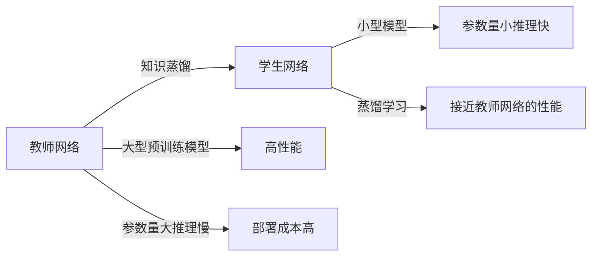

# 知识蒸馏 (Knowledge Distillation) 原理与代码实例讲解

关键词：知识蒸馏、模型压缩、深度学习、迁移学习、教师-学生网络

## 1. 背景介绍
### 1.1 问题的由来
随着深度学习的飞速发展,越来越多的大型深度神经网络被应用到各个领域。这些网络往往参数量巨大,计算复杂度高,给实际部署带来了很大挑战。如何在保持模型性能的同时,压缩模型体积,加速推理速度,成为了一个亟待解决的问题。知识蒸馏(Knowledge Distillation)作为一种模型压缩技术应运而生。

### 1.2 研究现状
自从2015年Hinton等人提出知识蒸馏的概念以来,知识蒸馏迅速成为了学术界和工业界的研究热点。各种改进的知识蒸馏算法被提出,如 FitNet、AT、NST 等。知识蒸馏在计算机视觉、自然语言处理等领域得到了广泛应用。一些标准的知识蒸馏实现也被集成到主流的深度学习框架中,如 PyTorch 和 TensorFlow。

### 1.3 研究意义
知识蒸馏可以显著压缩模型体积,加速推理速度,降低部署成本,有利于将大型模型应用到资源受限的场景中,如移动端、嵌入式设备等。同时,知识蒸馏作为一种知识迁移方法,有助于探索深度神经网络学习到的知识的本质。研究知识蒸馏对于深度学习理论和应用都有重要意义。

### 1.4 本文结构
本文将首先介绍知识蒸馏的核心概念,然后详细讲解知识蒸馏的算法原理和具体步骤,并给出数学模型和公式推导。接着通过代码实例和详细解释,展示如何实现知识蒸馏。最后讨论知识蒸馏的实际应用场景,介绍相关的工具和资源,并对知识蒸馏的未来发展趋势和挑战进行展望。

## 2. 核心概念与联系
知识蒸馏涉及到以下几个核心概念:
- Teacher Network(教师网络):通常是一个大型的预训练好的深度神经网络,性能较好但是参数量大,推理速度慢。
- Student Network(学生网络):一个小型的神经网络,参数量小,推理速度快,但是性能通常比教师网络差。
- Knowledge(知识):教师网络学习到的知识,蕴含在其网络参数和输出中。
- Distillation(蒸馏):将教师网络的知识迁移到学生网络的过程,使得小型学生网络也能达到较好的性能。

教师网络和学生网络的关系可以用下面的 Mermaid 图表示:


## 3. 核心算法原理 & 具体操作步骤
### 3.1 算法原理概述
知识蒸馏的核心思想是让学生网络去模仿教师网络的行为。具体来说,不仅要求学生网络的输出与教师网络一致,更要求学生网络的特征表示与教师网络相似。学生网络的训练目标包含两部分:一部分是常规的有标签数据的监督损失,另一部分是与教师网络输出的相似度损失。通过联合优化这两个损失,使学生网络既能匹配真实标签,又能模仿教师网络的软标签输出。

### 3.2 算法步骤详解
知识蒸馏的具体算法步骤如下:
1. 训练教师网络:在大规模数据集上训练一个大型的教师网络,使其达到较高的性能。
2. 准备无标签数据:准备一批与任务相关的无标签数据,用于蒸馏学习。
3. 教师网络的推理:使用训练好的教师网络对无标签数据进行前向推理,得到软标签输出。教师网络的输出向量通过 softmax 函数转化为概率分布,温度参数 $T$ 控制概率分布的软化程度。
4. 学生网络的训练:使用教师网络的软标签作为额外的监督信号,联合优化学生网络的监督损失和蒸馏损失。蒸馏损失通常使用 KL 散度来衡量学生网络和教师网络输出分布的差异。
5. 评估和部署:在测试集上评估学生网络的性能,如果满足要求则可以部署学生网络。

### 3.3 算法优缺点
知识蒸馏的优点包括:
- 模型压缩:可以将大型模型压缩为小型模型,减少参数量和计算量。
- 加速推理:小型学生网络的推理速度通常比教师网络快很多。
- 性能提升:学生网络可以学习到教师网络的"暗知识",有时甚至可以超越教师网络。
- 泛化能力:学生网络学到的知识更加泛化,在新数据上的表现也更好。

知识蒸馏的缺点包括:
- 需要额外的数据:知识蒸馏需要大量的无标签数据,数据的质量对结果影响较大。
- 训练时间长:需要先训练教师网络,再进行蒸馏,总的训练时间比直接训练学生网络要长。
- 对教师网络的依赖:蒸馏的效果很大程度上取决于教师网络的性能,如果教师网络不够好,蒸馏的效果也会受限。

### 3.4 算法应用领域
知识蒸馏被广泛应用于以下领域:
- 模型压缩:将大型模型(如BERT、ResNet等)压缩为小型模型,便于部署。
- 模型加速:通过蒸馏得到的小型模型,推理速度通常比原模型快很多。
- 模型集成:将多个模型集成为一个模型,避免多模型推理的开销。
- 跨模态迁移:如将视觉模型的知识迁移到文本模型,实现零样本学习。
- 联邦学习:在不共享原始数据的情况下,进行分布式的知识蒸馏。

## 4. 数学模型和公式 & 详细讲解 & 举例说明
### 4.1 数学模型构建
设教师网络为 $T$,学生网络为 $S$,训练样本为 $(x,y)$。教师网络和学生网络的输出概率分布分别为 $P_T$ 和 $P_S$:

$$
P_T(x) = \text{softmax}(\frac{z_T}{T}) \
P_S(x) = \text{softmax}(\frac{z_S}{T})
$$

其中 $z_T$ 和 $z_S$ 分别是教师网络和学生网络的 logits 输出,$T$ 是温度参数。

学生网络的训练目标为最小化以下损失函数:

$$
\mathcal{L} = \alpha \mathcal{L}_\text{CE}(y, P_S) + \beta \mathcal{L}_\text{KL}(P_T, P_S)
$$

其中 $\mathcal{L}_\text{CE}$ 是交叉熵损失, $\mathcal{L}_\text{KL}$ 是 KL 散度损失, $\alpha$ 和 $\beta$ 是两个损失的权重系数。

### 4.2 公式推导过程
交叉熵损失 $\mathcal{L}_\text{CE}$ 的定义为:

$$
\mathcal{L}_\text{CE}(y, P_S) = -\sum_{i=1}^C y_i \log(P_S(x)_i)
$$

其中 $C$ 是类别数, $y_i$ 是真实标签的 one-hot 向量表示。

KL散度损失 $\mathcal{L}_\text{KL}$ 的定义为:

$$
\mathcal{L}_\text{KL}(P_T, P_S) = \sum_{i=1}^C P_T(x)_i \log\frac{P_T(x)_i}{P_S(x)_i}
$$

将 $P_T$ 和 $P_S$ 的定义代入,可以得到:

$$
\mathcal{L}_\text{KL} = \sum_{i=1}^C \text{softmax}(\frac{z_T}{T})_i \log\frac{\text{softmax}(\frac{z_T}{T})_i}{\text{softmax}(\frac{z_S}{T})_i}
$$

通过最小化以上损失函数,可以让学生网络 $S$ 在匹配真实标签 $y$ 的同时,去模仿教师网络 $T$ 的输出分布。

### 4.3 案例分析与讲解
下面以图像分类任务为例,说明知识蒸馏的应用。

假设我们有一个在 ImageNet 上预训练好的 ResNet-101 模型作为教师网络,现在希望将其知识蒸馏到一个更小的 MobileNet 学生网络中。

首先,我们使用 ResNet-101 对一批无标签图像数据进行推理,得到软标签。然后,将这些软标签作为监督信号,与真实标签一起训练 MobileNet。

MobileNet 的训练损失包括两部分:一部分是与真实标签的交叉熵损失,另一部分是与 ResNet-101 软标签的 KL 散度损失。通过联合优化这两个损失,MobileNet 可以学习到 ResNet-101 的知识,达到更好的性能。

在训练过程中,我们可以调整温度参数 $T$ 来控制软标签的软化程度。 $T$ 越高,软标签的分布越平滑,蒸馏的效果越明显。但是 $T$ 也不能太高,否则会损失太多信息。通常 $T$ 的取值在 1 到 10 之间。

经过蒸馏学习,MobileNet 可以在参数量只有 ResNet-101 的十分之一的情况下,达到接近 ResNet-101 的性能,实现了模型的压缩和加速。

### 4.4 常见问题解答
1. 问:为什么要使用软标签,而不是硬标签?
   答:软标签包含了类别之间的相似性信息,比硬标签包含了更多的知识。使用软标签可以让学生网络学到更细粒度的知识。

2. 问:温度参数 $T$ 的作用是什么?
   答:温度参数 $T$ 可以控制软标签的软化程度。 $T$ 越大,软标签的分布越平滑,学生网络学习的难度越大,但是蒸馏的效果也越明显。

3. 问:如何选择教师网络和学生网络?
   答:教师网络一般选择大型的预训练模型,如 BERT、ResNet 等。学生网络一般是小型的模型,如 MobileNet、EfficientNet 等。教师网络和学生网络的结构不必完全一致,但是输出维度需要相同。

4. 问:知识蒸馏可以应用于哪些任务?
   答:知识蒸馏可以应用于各种学习任务,如分类、检测、分割、语言建模等。只要有预训练好的教师模型,就可以进行知识蒸馏。

## 5. 项目实践：代码实例和详细解释说明
下面给出一个使用 PyTorch 实现知识蒸馏的代码示例。

### 5.1 开发环境搭建
首先需要安装 PyTorch,可以使用以下命令:
```bash
pip install torch torchvision
```

### 5.2 源代码详细实现
```python
import torch
import torch.nn as nn
import torch.nn.functional as F

# 定义教师网络
class TeacherNet(nn.Module):
    def __init__(self):
        super(TeacherNet, self).__init__()
        self.fc1 = nn.Linear(28*28, 1200)
        self.fc2 = nn.Linear(1200, 1200)
        self.fc3 = nn.Linear(1200, 10)

    def forward(self, x):
        x = x.view(-1, 28*28)
        x = F.relu(self.fc1(x))
        x = F.dropout(x, p=0.8, training=self.training)
        x = F.relu(self.fc2(x))
        x = F.dropout(x, p=0.8, training=self.training)
        x = self.fc3(x