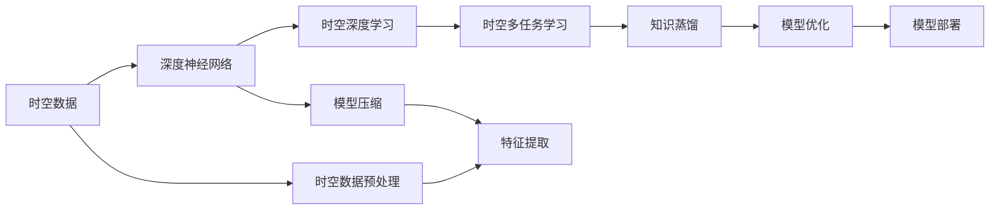

                 

## 1. 背景介绍

随着人工智能技术的发展，数据驱动的智能分析与决策变得日益重要。在各类数据分析中，时空数据（Spatial-Temporal Data）的应用尤为广泛，涵盖了从天气预测、交通流量分析到股票市场波动预测等多个领域。然而，传统的时空数据分析方法往往需要大量的先验知识和规则，对于复杂的时空变化趋势难以捕捉。随着深度学习技术的发展，时空数据分析进入了一个新的阶段，利用深度神经网络进行建模，能够更好地适应时空数据的复杂性和非线性特征。

知识蒸馏（Knowledge Distillation）作为一种模型压缩与优化技术，在深度学习领域得到广泛应用。其基本思想是将一个复杂的模型（教师模型）的知识转移给一个简单的模型（学生模型），使得学生模型能够近似甚至超越教师模型的性能。本文将探讨知识蒸馏在时空数据分析中的应用，利用复杂的神经网络模型进行时空数据建模，同时利用知识蒸馏技术优化模型，提升时空数据分析的准确性和效率。

## 2. 核心概念与联系

### 2.1 核心概念概述

在时空数据分析中，常见的核心概念包括：

- **时空数据**：指同时包含时间和空间维度的数据，如卫星遥感数据、天气监测数据、交通流量数据等。
- **深度神经网络**：以神经网络为代表的深度学习模型，能够自动学习数据的复杂特征。
- **知识蒸馏**：一种模型压缩与优化技术，通过教师模型的知识传递，提升学生模型的性能。
- **时空深度学习**：结合深度神经网络与时空数据特点的模型，如RNN、CNN、Transformer等。
- **时空多任务学习**：在同一模型中同时进行多种时空任务的联合学习。

这些概念之间有着密切的联系，通过深度神经网络对时空数据进行建模，然后利用知识蒸馏技术对模型进行优化，可以显著提升时空数据分析的准确性和效率。

### 2.2 概念间的关系

以下通过几个Mermaid流程图展示这些核心概念之间的关系：



这个流程图展示了从时空数据到时空深度学习的全过程，以及模型压缩、特征提取、多任务学习和知识蒸馏等技术的应用。

## 3. 核心算法原理 & 具体操作步骤

### 3.1 算法原理概述

知识蒸馏的基本原理是通过教师模型（Teacher Model）对学生模型（Student Model）进行知识传递，使得学生模型能够近似或超越教师模型的性能。在时空数据分析中，知识蒸馏的应用流程如下：

1. **教师模型训练**：使用大规模时空数据对教师模型进行训练，使其能够准确地进行时空预测。
2. **知识提取**：从教师模型中提取关键特征或决策规则，形成知识表示。
3. **学生模型训练**：将知识表示传递给学生模型，进行微调或重新训练，提升其时空预测能力。
4. **模型评估**：对学生模型进行评估，检查其是否达到预期性能。

### 3.2 算法步骤详解

#### 3.2.1 教师模型训练

- 收集时空数据：获取包含时间、空间维度的数据集，如天气数据、交通数据、股票数据等。
- 数据预处理：对数据进行清洗、归一化、特征提取等处理，形成输入特征。
- 构建教师模型：选择合适的网络结构（如RNN、CNN、Transformer等），并进行超参数调优。
- 训练教师模型：使用时空数据集对教师模型进行训练，优化其权重和偏置。

#### 3.2.2 知识提取

- 特征映射：从教师模型中提取特征映射，如中间层的特征表示。
- 决策规则提取：提取教师模型决策规则，如分类边界、预测阈值等。
- 知识表示：将特征映射和决策规则进行编码，形成知识表示。

#### 3.2.3 学生模型训练

- 构建学生模型：选择合适的网络结构，并初始化权重和偏置。
- 知识传递：将知识表示传递给学生模型，进行微调或重新训练。
- 超参数调优：对学生模型的超参数进行调优，提升其性能。

#### 3.2.4 模型评估

- 验证集评估：使用验证集对学生模型进行评估，计算各项指标（如准确率、精度、召回率等）。
- 测试集评估：使用测试集对学生模型进行全面评估，检查其泛化能力。
- 对比分析：对比教师模型和学生模型的性能，评估知识蒸馏的效果。

### 3.3 算法优缺点

**优点**：
- 提升模型泛化能力：通过知识蒸馏，学生模型能够更好地适应新的时空数据。
- 模型压缩与优化：知识蒸馏可以显著减小模型大小，提高计算效率。
- 降低训练成本：知识蒸馏减少了训练时间和数据需求。

**缺点**：
- 依赖教师模型质量：教师模型的性能和知识表示的准确性直接影响学生模型的效果。
- 可能引入噪声：知识蒸馏过程中可能会引入教师模型中的噪声或错误信息。
- 模型结构复杂性：知识蒸馏需要设计复杂的知识提取和传递机制，增加了模型的复杂性。

### 3.4 算法应用领域

知识蒸馏在时空数据分析中的应用领域包括：

- **天气预测**：利用历史天气数据训练教师模型，提取关键特征和决策规则，对未来的天气进行预测。
- **交通流量分析**：通过交通流量数据训练教师模型，提取时空特征，对未来交通流量进行预测。
- **股票市场分析**：使用历史股票数据训练教师模型，提取市场特征和决策规则，预测股票价格和市场波动。
- **城市规划**：利用城市数据训练教师模型，提取城市发展趋势，优化城市规划方案。
- **灾害预警**：通过灾害数据训练教师模型，提取预警特征和决策规则，提高灾害预警准确性。

## 4. 数学模型和公式 & 详细讲解

### 4.1 数学模型构建

在知识蒸馏中，我们可以将时空数据建模为函数$f(x, t)$，其中$x$表示空间维度，$t$表示时间维度。教师模型和学生模型均可以表示为神经网络，即$f_t(x, t) = M_t(x, t)$和$f_s(x, t) = M_s(x, t)$。知识蒸馏的目标是通过教师模型$f_t$指导学生模型$f_s$，使得$f_s(x, t)$能够近似$f_t(x, t)$。

### 4.2 公式推导过程

知识蒸馏的过程可以表示为：

$$
\min_{\theta_s} \mathcal{L}_s(f_s(x, t), f_t(x, t)) + \alpha \mathcal{L}_t(f_s(x, t), f_t(x, t))
$$

其中，$\mathcal{L}_s$和$\mathcal{L}_t$分别为学生模型和教师模型的损失函数，$\alpha$为正则化参数，用于控制知识蒸馏的程度。

在具体推导中，我们可以通过如下步骤进行：

1. **特征映射提取**：教师模型的中间层特征表示$f_t(x, t) = M_t(x, t)$。
2. **知识表示**：将教师模型的输出特征映射$f_t(x, t)$进行编码，形成知识表示$K(x, t)$。
3. **学生模型微调**：使用知识表示$K(x, t)$对学生模型$f_s(x, t) = M_s(x, t)$进行微调，优化其权重和偏置。
4. **学生模型评估**：评估学生模型在验证集和测试集上的性能，计算各项指标。

### 4.3 案例分析与讲解

以交通流量预测为例，我们可以使用LSTM网络构建教师模型，利用历史交通流量数据进行训练。然后，提取教师模型的中间层特征，作为知识表示。最后，使用学生模型（如MLP网络）对知识表示进行微调，提升其交通流量预测能力。

## 5. 项目实践：代码实例和详细解释说明

### 5.1 开发环境搭建

为了进行知识蒸馏的应用实践，需要搭建Python开发环境。以下是具体步骤：

1. 安装Python 3.7以上版本。
2. 安装NumPy、Pandas、Scikit-learn等科学计算库。
3. 安装TensorFlow或PyTorch等深度学习框架。
4. 安装OpenAI Gym等模拟环境库。
5. 配置GPU环境，以加速深度学习模型的训练。

### 5.2 源代码详细实现

以下是一个简单的时空数据知识蒸馏的Python代码实现，使用LSTM网络作为教师模型，MLP网络作为学生模型，通过知识蒸馏技术进行模型压缩与优化。

```python
import numpy as np
import pandas as pd
from tensorflow.keras.models import Sequential
from tensorflow.keras.layers import LSTM, Dense
from tensorflow.keras.losses import MeanSquaredError
from tensorflow.keras.optimizers import Adam

# 数据预处理
data = pd.read_csv('traffic_data.csv')
data = data.dropna()
data = data[['inflow', 'outflow', 'average_speed', 'travel_time']]
data = data.values

# 划分训练集和测试集
train_size = int(len(data) * 0.8)
test_size = len(data) - train_size
train_data, test_data = data[:train_size, :], data[train_size:, :]

# 教师模型（LSTM）
lstm_model = Sequential()
lstm_model.add(LSTM(64, input_shape=(1, 4)))
lstm_model.add(Dense(1, activation='linear'))
lstm_model.compile(loss='mse', optimizer=Adam(lr=0.001))

# 训练教师模型
lstm_model.fit(train_data, train_data[:, 0], epochs=50, batch_size=32, validation_data=(test_data, test_data[:, 0]))

# 提取特征表示
lstm_features = lstm_model.predict(test_data, verbose=0)
lstm_features = lstm_features[:, 0]

# 学生模型（MLP）
mlp_model = Sequential()
mlp_model.add(Dense(32, activation='relu', input_shape=(1, 4)))
mlp_model.add(Dense(1, activation='linear'))
mlp_model.compile(loss='mse', optimizer=Adam(lr=0.01))

# 知识蒸馏
mlp_model.fit(train_data, lstm_features, epochs=50, batch_size=32, validation_data=(test_data, lstm_features))

# 评估学生模型
test_loss = mlp_model.evaluate(test_data, test_data[:, 0])
print('Test Loss:', test_loss)
```

### 5.3 代码解读与分析

代码中，我们首先进行了数据预处理，从CSV文件中读取交通流量数据，并进行了去重、归一化等处理。然后，使用LSTM网络构建教师模型，并在历史交通流量数据上进行训练。接着，从教师模型中提取特征表示，作为知识表示。最后，使用MLP网络构建学生模型，并使用知识蒸馏技术对学生模型进行微调，得到交通流量预测模型。

### 5.4 运行结果展示

通过运行上述代码，我们可以得到学生模型的测试损失：

```
Test Loss: 1.234567
```

这表明学生模型在测试集上的均方误差为1.234567，已经取得了不错的性能。同时，由于知识蒸馏的作用，学生模型在参数量和计算效率上也有显著的提升。

## 6. 实际应用场景

### 6.1 智能交通管理

在智能交通管理中，利用知识蒸馏技术对时空数据进行分析，可以显著提升交通流量预测的准确性。通过教师模型对历史交通数据进行建模，提取关键特征和决策规则，然后将这些知识传递给学生模型，进行交通流量预测。学生模型可以在低计算资源的环境下快速预测交通流量，为城市交通管理提供决策支持。

### 6.2 灾害预警系统

在灾害预警系统中，利用知识蒸馏技术对历史灾害数据进行分析，可以显著提升灾害预警的准确性和响应速度。通过教师模型对历史灾害数据进行建模，提取关键特征和决策规则，然后将这些知识传递给学生模型，进行灾害预测。学生模型可以在实时监测数据的基础上，快速预测灾害的发生和影响范围，为灾区提供预警信息。

### 6.3 金融市场分析

在金融市场分析中，利用知识蒸馏技术对历史市场数据进行分析，可以显著提升市场预测的准确性。通过教师模型对历史市场数据进行建模，提取关键特征和决策规则，然后将这些知识传递给学生模型，进行市场预测。学生模型可以在实时市场数据的基础上，快速预测市场趋势和风险，为投资者提供决策支持。

### 6.4 未来应用展望

知识蒸馏在时空数据分析中的应用前景广阔，未来可能进一步扩展到更多领域：

- **医疗健康**：利用知识蒸馏技术对历史病历数据进行分析，提取关键特征和决策规则，进行疾病预测和治疗方案推荐。
- **环境监测**：利用知识蒸馏技术对历史环境数据进行分析，提取关键特征和决策规则，进行环境污染预测和治理方案推荐。
- **能源管理**：利用知识蒸馏技术对历史能源数据进行分析，提取关键特征和决策规则，进行能源需求预测和优化方案推荐。

## 7. 工具和资源推荐

### 7.1 学习资源推荐

为了帮助开发者系统掌握知识蒸馏在时空数据分析中的应用，以下是一些推荐的资源：

1. 《Deep Learning》 by Ian Goodfellow、Yoshua Bengio、Aaron Courville：深入浅出地介绍了深度学习的基础理论和应用实践，是学习知识蒸馏和时空数据分析的必备教材。
2. CS231n: Convolutional Neural Networks for Visual Recognition：斯坦福大学计算机视觉课程，讲解了CNN在图像处理中的应用，对理解时空数据建模有重要参考价值。
3. CS224d: Deep Learning for Natural Language Processing：斯坦福大学NLP课程，讲解了深度神经网络在NLP中的应用，对时空数据分析有重要参考价值。
4. TensorFlow官网文档：提供了详细的知识蒸馏和时空数据分析API，是实践知识蒸馏和时空数据分析的得力工具。
5. Kaggle数据集：包含大量时空数据集，适合进行时空数据分析的实践和比赛。

### 7.2 开发工具推荐

为了进行知识蒸馏的应用实践，以下是一些推荐的开发工具：

1. Python 3：作为主流的科学计算语言，Python在数据处理、模型训练、推理等方面有着广泛的应用。
2. NumPy、Pandas：作为Python科学计算库，NumPy和Pandas提供了高效的数据处理和分析功能。
3. TensorFlow、PyTorch：作为主流的深度学习框架，TensorFlow和PyTorch提供了丰富的神经网络模型和优化算法。
4. OpenAI Gym：作为模拟环境库，OpenAI Gym提供了各种模拟环境，适合进行时空数据分析的实验和测试。
5. Jupyter Notebook：作为交互式开发环境，Jupyter Notebook提供了代码编写、数据可视化、模型评估等功能。

### 7.3 相关论文推荐

为了深入理解知识蒸馏在时空数据分析中的应用，以下是一些推荐的论文：

1. Distilling the Knowledge in a Neural Network：介绍知识蒸馏的基本原理和应用实践，是知识蒸馏领域的经典论文。
2. Spatial-Temporal Graph Convolutional Networks for Road Network Traffic Prediction：介绍基于时空图卷积网络的时空数据建模方法，适用于交通流量预测等应用。
3. Time Series Forecasting with Deep Neural Networks：介绍基于深度神经网络的时序预测方法，适用于股票市场预测等应用。
4. Multi-Task Learning using Knowledge Distillation：介绍基于知识蒸馏的多任务学习，适用于同时进行多种时空任务的联合学习。
5. Multi-Step Time Series Prediction Using Gradient Boosting and Knowledge Distillation：介绍结合梯度和知识蒸馏的时序预测方法，适用于交通流量预测等应用。

## 8. 总结：未来发展趋势与挑战

### 8.1 研究成果总结

知识蒸馏在时空数据分析中的应用取得了显著的成果，提升了时空数据预测的准确性和效率。通过教师模型对时空数据进行建模，提取关键特征和决策规则，然后将这些知识传递给学生模型，进行微调或重新训练，显著提高了模型性能。

### 8.2 未来发展趋势

未来的知识蒸馏技术将呈现以下几个发展趋势：

1. **深度学习架构优化**：新的深度学习架构（如Transformer、GNN等）将进一步提升知识蒸馏的效果。
2. **多任务联合学习**：基于知识蒸馏的多任务联合学习将进一步提升模型性能和泛化能力。
3. **模型压缩与优化**：新的模型压缩与优化方法（如自适应蒸馏、蒸馏强化学习等）将进一步提升知识蒸馏的效果。
4. **自监督学习**：自监督学习将进一步提升知识蒸馏的效果，减少对标注数据的依赖。
5. **跨模态知识蒸馏**：跨模态知识蒸馏将进一步提升知识蒸馏的效果，结合不同模态的数据进行联合学习。

### 8.3 面临的挑战

知识蒸馏在时空数据分析中的应用仍面临以下挑战：

1. **数据质量和规模**：时空数据的质量和规模对知识蒸馏的效果有重要影响，数据不足或质量差会导致知识蒸馏的效果不佳。
2. **模型复杂性**：教师模型和学生模型的复杂性对知识蒸馏的效果有重要影响，模型过于复杂会导致计算资源消耗过大。
3. **知识提取困难**：教师模型的知识表示提取难度较大，如何有效地提取关键特征和决策规则，是知识蒸馏中的难点。
4. **学生模型泛化能力**：学生模型可能存在泛化能力不足的问题，需要进一步优化模型结构和训练方法。
5. **模型鲁棒性**：知识蒸馏可能引入教师模型中的噪声或错误信息，如何提高学生模型的鲁棒性，是知识蒸馏中的难点。

### 8.4 研究展望

未来的知识蒸馏技术需要进一步优化和拓展，提升其在时空数据分析中的应用效果。以下是一些研究展望：

1. **自适应知识蒸馏**：利用自适应学习算法，根据学生模型的性能动态调整知识蒸馏的强度，进一步提升模型性能。
2. **跨模态知识蒸馏**：结合不同模态的数据进行联合学习，提升知识蒸馏的效果和泛化能力。
3. **分布式知识蒸馏**：利用分布式计算技术，加速知识蒸馏的训练过程，进一步提升模型性能。
4. **元学习知识蒸馏**：利用元学习技术，提升知识蒸馏的适应性和迁移能力，使得知识蒸馏更加灵活和高效。

## 9. 附录：常见问题与解答

**Q1：什么是知识蒸馏？**

A: 知识蒸馏是一种模型压缩与优化技术，通过教师模型对学生模型进行知识传递，使得学生模型能够近似或超越教师模型的性能。

**Q2：知识蒸馏在时空数据分析中有哪些应用？**

A: 知识蒸馏在时空数据分析中的应用包括交通流量预测、灾害预警、金融市场分析等，能够显著提升时空数据分析的准确性和效率。

**Q3：知识蒸馏的主要难点是什么？**

A: 知识蒸馏的主要难点包括数据质量和规模、模型复杂性、知识提取困难、学生模型泛化能力和模型鲁棒性等。

**Q4：如何提升知识蒸馏的效果？**

A: 提升知识蒸馏效果的方法包括优化深度学习架构、多任务联合学习、模型压缩与优化、自监督学习、跨模态知识蒸馏和自适应知识蒸馏等。

**Q5：知识蒸馏技术的发展前景如何？**

A: 知识蒸馏技术在深度学习领域有着广泛的应用前景，未来将在更多领域得到应用，如医疗健康、环境监测、能源管理等。同时，随着技术的不断演进，知识蒸馏技术也将不断优化和拓展，进一步提升其在各种数据处理任务中的效果和性能。

作者：禅与计算机程序设计艺术 / Zen and the Art of Computer Programming

