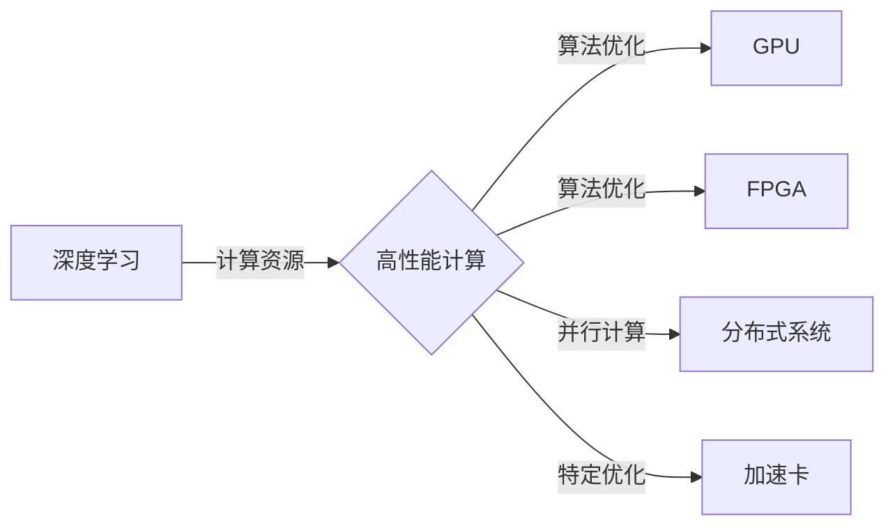

# 高性能计算在AI创新体系中的应用

> 关键词：高性能计算，AI，深度学习，计算资源，算法优化，并行计算，分布式系统，GPU，FPGA，加速卡

## 1. 背景介绍
### 1.1 问题的由来

随着人工智能技术的快速发展，深度学习在图像识别、自然语言处理、语音识别等领域取得了突破性进展。然而，深度学习模型的训练和推理过程中，对计算资源的需求也日益增长。传统的计算架构和资源难以满足大规模模型训练和复杂算法的实时处理需求，成为制约AI创新体系发展的一大瓶颈。

为了应对这一挑战，高性能计算（High-Performance Computing, HPC）技术在AI领域的应用越来越受到重视。通过采用高性能计算资源，可以显著提升AI模型训练和推理的效率，加速AI创新体系的发展。

### 1.2 研究现状

目前，高性能计算在AI领域的应用主要体现在以下几个方面：

- **GPU加速**：GPU（Graphics Processing Unit，图形处理单元）具有强大的并行计算能力，成为深度学习模型训练和推理的重要加速器。
- **FPGA加速**：FPGA（Field-Programmable Gate Array，现场可编程门阵列）具有高度的灵活性和可编程性，适用于特定场景的深度学习加速。
- **分布式系统**：通过集群计算和分布式存储，可以实现大规模数据集的并行处理，加速AI模型的训练和推理。
- **加速卡**：各类加速卡，如TPU、ASIC等，针对特定算法和场景进行优化，进一步提高计算效率。

### 1.3 研究意义

高性能计算在AI创新体系中的应用具有重要意义：

- **提升AI模型训练和推理效率**：通过采用高性能计算资源，可以显著缩短AI模型的训练和推理时间，加快AI应用开发进程。
- **降低AI应用成本**：通过优化算法和资源利用，可以降低AI应用的开发和维护成本。
- **推动AI创新**：高性能计算为AI领域提供了强大的技术支撑，有助于推动AI技术在更多领域的创新应用。

### 1.4 本文结构

本文将围绕高性能计算在AI创新体系中的应用展开，内容安排如下：

- 第2部分，介绍高性能计算在AI领域的核心概念和联系。
- 第3部分，介绍GPU、FPGA、分布式系统等高性能计算技术及其在AI领域的应用。
- 第4部分，探讨算法优化和并行计算在AI模型训练和推理中的应用。
- 第5部分，给出高性能计算在AI领域的应用实例和案例分析。
- 第6部分，展望高性能计算在AI领域的未来发展趋势。
- 第7部分，推荐高性能计算相关的学习资源、开发工具和参考文献。
- 第8部分，总结全文，展望高性能计算在AI领域的挑战和机遇。

## 2. 核心概念与联系

为了更好地理解高性能计算在AI领域的应用，本节将介绍几个核心概念及其相互之间的联系：

- **深度学习**：一种通过模拟人脑神经网络结构的算法，用于处理和提取数据特征。
- **高性能计算**：一种通过集成的计算资源和算法优化，实现高性能计算任务的技术。
- **GPU**：一种具有强大并行计算能力的图形处理单元，适用于深度学习模型训练和推理。
- **FPGA**：一种可编程的数字集成电路，适用于特定场景的深度学习加速。
- **分布式系统**：一种由多个计算机组成的系统，可以并行处理大规模数据集。
- **加速卡**：针对特定算法和场景进行优化的计算卡，如TPU、ASIC等。

它们的逻辑关系如下图所示：



可以看出，深度学习需要高性能计算资源进行模型训练和推理，而高性能计算通过GPU、FPGA、分布式系统等资源和技术，为深度学习提供了强大的技术支撑。

## 3. 核心算法原理 & 具体操作步骤
### 3.1 算法原理概述

高性能计算在AI领域的应用主要体现在以下几个方面：

- **GPU加速**：通过并行计算技术，利用GPU强大的浮点运算能力，加速深度学习模型的训练和推理。
- **FPGA加速**：针对特定算法和场景进行硬件定制，实现更高的计算效率和资源利用率。
- **分布式系统**：通过集群计算和分布式存储，实现大规模数据集的并行处理。
- **加速卡**：针对特定算法和场景进行优化，提供高效的计算能力。

### 3.2 算法步骤详解

以下是高性能计算在AI领域的几种典型应用步骤：

**步骤一：选择合适的计算平台**

根据任务需求和资源预算，选择合适的计算平台。常见的计算平台包括：

- **GPU平台**：适合大规模深度学习模型训练和推理，如NVIDIA GPU。
- **FPGA平台**：适合特定场景的深度学习加速，如Intel FPGA。
- **分布式系统平台**：适合大规模数据集的并行处理，如阿里云、华为云等云平台。

**步骤二：优化算法**

针对选择的计算平台，对深度学习算法进行优化，以提高计算效率。常见的优化方法包括：

- **并行计算**：将算法分解为多个子任务，并行计算结果。
- **流水线化**：将计算任务分解为多个阶段，逐个阶段处理，以提高效率。
- **数据并行**：将数据分片，并行处理各个数据片。

**步骤三：实现并行计算**

使用并行计算框架，如PyTorch、TensorFlow等，实现深度学习模型的并行计算。

**步骤四：测试和优化**

在测试环境中测试模型性能，根据测试结果对算法和资源进行优化。

### 3.3 算法优缺点

**GPU加速**：

优点：

- 计算能力强，适合大规模深度学习模型训练和推理。
- 开发便利，有丰富的开源框架和工具。

缺点：

- 硬件成本高，需要专门的GPU设备。
- 对程序员的编程能力要求较高。

**FPGA加速**：

优点：

- 适用于特定场景的深度学习加速，计算效率高。
- 可编程性强，可以根据需要定制硬件。

缺点：

- 开发周期长，需要一定的硬件设计经验。
- 硬件成本高。

**分布式系统**：

优点：

- 适合大规模数据集的并行处理，计算能力强。
- 资源利用率高，可以根据需要动态调整。

缺点：

- 管理复杂，需要专业的运维人员。
- 网络延迟可能会影响性能。

### 3.4 算法应用领域

高性能计算在AI领域的应用领域广泛，以下列举一些典型应用：

- **图像识别**：如人脸识别、物体识别、场景识别等。
- **自然语言处理**：如机器翻译、语音识别、文本分类等。
- **推荐系统**：如商品推荐、新闻推荐、音乐推荐等。
- **自动驾驶**：如车辆检测、车道线识别、障碍物检测等。

## 4. 数学模型和公式 & 详细讲解 & 举例说明
### 4.1 数学模型构建

深度学习模型通常由多层神经网络组成，以下是常见的一些数学模型：

- **全连接神经网络（FCN）**：

  $$h = f(W \cdot x + b)$$

  其中，$h$ 为输出，$W$ 为权重矩阵，$x$ 为输入，$b$ 为偏置向量，$f$ 为激活函数。

- **卷积神经网络（CNN）**：

  $$h = \sigma(W \cdot f(g(\cdot, \cdot) \cdot x) + b)$$

  其中，$h$ 为输出，$W$ 为权重矩阵，$x$ 为输入，$f$ 为激活函数，$g$ 为卷积操作。

- **循环神经网络（RNN）**：

  $$h_t = f(W_xh_{t-1} + W_yx_t + b)$$

  其中，$h_t$ 为第 $t$ 个时间步的输出，$W_x$ 和 $W_y$ 分别为权重矩阵，$x_t$ 为第 $t$ 个时间步的输入，$b$ 为偏置向量，$f$ 为激活函数。

### 4.2 公式推导过程

以下以全连接神经网络为例，推导其反向传播算法：

设损失函数为：

$$\mathcal{L}(h, y) = (h - y)^2$$

其中，$h$ 为输出，$y$ 为真实标签。

对 $W$ 求偏导：

$$\frac{\partial \mathcal{L}}{\partial W} = \frac{\partial}{\partial W}(h - y)^2$$

$$= 2(h - y)\frac{\partial h}{\partial W}$$

$$= 2(h - y)(\frac{\partial}{\partial W}(W \cdot x + b))$$

$$= 2(h - y)x$$

同理，对 $b$ 求偏导：

$$\frac{\partial \mathcal{L}}{\partial b} = 2(h - y)$$

根据链式法则，可得：

$$\frac{\partial \mathcal{L}}{\partial W} = 2(h - y)x$$

$$\frac{\partial \mathcal{L}}{\partial b} = 2(h - y)$$

根据梯度下降算法，可得：

$$W \leftarrow W - \alpha \frac{\partial \mathcal{L}}{\partial W}$$

$$b \leftarrow b - \alpha \frac{\partial \mathcal{L}}{\partial b}$$

其中，$\alpha$ 为学习率。

### 4.3 案例分析与讲解

以下以图像识别任务为例，演示如何使用PyTorch对CNN模型进行训练。

首先，加载预训练的CNN模型：

```python
import torch
import torch.nn as nn
import torchvision.transforms as transforms
from torchvision.datasets import CIFAR10

# 加载数据集
transform = transforms.Compose([
    transforms.ToTensor(),
    transforms.Normalize((0.5, 0.5, 0.5), (0.5, 0.5, 0.5))
])
train_dataset = CIFAR10(root='./data', train=True, download=True, transform=transform)
train_loader = torch.utils.data.DataLoader(train_dataset, batch_size=64, shuffle=True)

# 加载预训练的CNN模型
model = torchvision.models.resnet18(pretrained=True)
```

然后，定义损失函数和优化器：

```python
criterion = nn.CrossEntropyLoss()
optimizer = torch.optim.SGD(model.parameters(), lr=0.01, momentum=0.9)
```

最后，启动训练流程：

```python
for epoch in range(10):  # 训练10个epoch
    model.train()
    for images, labels in train_loader:
        optimizer.zero_grad()
        outputs = model(images)
        loss = criterion(outputs, labels)
        loss.backward()
        optimizer.step()
```

以上代码展示了使用PyTorch对预训练的CNN模型进行图像识别任务训练的完整流程。通过多个epoch的训练，模型在CIFAR-10数据集上取得了不错的识别效果。

### 4.4 常见问题解答

**Q1：如何选择合适的GPU设备？**

A: 选择GPU设备时，需要考虑以下因素：

- **计算能力**：根据任务需求选择计算能力较强的GPU，如NVIDIA Tesla、Quadro、GeForce等系列。
- **内存容量**：根据模型大小和数据量选择内存容量较大的GPU。
- **功耗和散热**：考虑GPU的功耗和散热问题，避免设备过热。
- **兼容性**：确保GPU与计算平台兼容。

**Q2：如何优化深度学习模型的性能？**

A: 优化深度学习模型的性能可以从以下几个方面入手：

- **算法优化**：优化算法结构，如使用卷积神经网络、循环神经网络等。
- **数据预处理**：对数据进行预处理，如数据增强、归一化等。
- **模型结构优化**：根据任务需求选择合适的模型结构，如减少模型层数、使用轻量级模型等。
- **并行计算**：使用GPU、FPGA等并行计算技术加速模型训练和推理。

**Q3：如何进行分布式训练？**

A: 分布式训练可以分为两种模式：数据并行和模型并行。

- **数据并行**：将数据集分片，分别在不同的GPU或服务器上进行训练，最后合并结果。
- **模型并行**：将模型的不同部分分布在不同的GPU或服务器上进行训练，最后合并结果。

**Q4：如何进行模型压缩和加速？**

A: 模型压缩和加速可以从以下几个方面入手：

- **模型剪枝**：移除模型中不必要的连接，减小模型尺寸，提高推理速度。
- **量化**：将模型的浮点数权重转换为定点数，减小模型尺寸，提高推理速度。
- **知识蒸馏**：将知识从大型模型迁移到小型模型，提高小型模型性能。

## 5. 项目实践：代码实例和详细解释说明
### 5.1 开发环境搭建

在进行高性能计算在AI领域的应用开发前，我们需要准备好开发环境。以下是使用PyTorch进行深度学习模型训练的环境配置流程：

1. 安装Anaconda：从官网下载并安装Anaconda，用于创建独立的Python环境。

2. 创建并激活虚拟环境：

```bash
conda create -n pytorch-env python=3.8
conda activate pytorch-env
```

3. 安装PyTorch：

```bash
conda install pytorch torchvision torchaudio cudatoolkit=11.1 -c pytorch -c conda-forge
```

4. 安装其他依赖库：

```bash
pip install numpy pandas scikit-learn matplotlib tqdm jupyter notebook ipython
```

完成上述步骤后，即可在`pytorch-env`环境中开始高性能计算在AI领域的应用开发。

### 5.2 源代码详细实现

以下以图像识别任务为例，展示使用PyTorch进行GPU加速的深度学习模型训练代码：

```python
import torch
import torch.nn as nn
import torchvision.transforms as transforms
from torchvision.datasets import CIFAR10

# 加载数据集
transform = transforms.Compose([
    transforms.ToTensor(),
    transforms.Normalize((0.5, 0.5, 0.5), (0.5, 0.5, 0.5))
])
train_dataset = CIFAR10(root='./data', train=True, download=True, transform=transform)
train_loader = torch.utils.data.DataLoader(train_dataset, batch_size=64, shuffle=True)

# 加载预训练的CNN模型
model = torchvision.models.resnet18(pretrained=True).to('cuda')

# 定义损失函数和优化器
criterion = nn.CrossEntropyLoss()
optimizer = torch.optim.SGD(model.parameters(), lr=0.01, momentum=0.9)

# 将模型移动到GPU
device = torch.device('cuda' if torch.cuda.is_available() else 'cpu')
model.to(device)

# 训练模型
for epoch in range(10):  # 训练10个epoch
    model.train()
    for images, labels in train_loader:
        images, labels = images.to(device), labels.to(device)
        optimizer.zero_grad()
        outputs = model(images)
        loss = criterion(outputs, labels)
        loss.backward()
        optimizer.step()
```

以上代码展示了使用PyTorch进行GPU加速的图像识别任务训练的完整流程。通过将模型和数据移动到GPU，可以显著提升模型的训练速度。

### 5.3 代码解读与分析

**加载数据集**：

```python
transform = transforms.Compose([
    transforms.ToTensor(),
    transforms.Normalize((0.5, 0.5, 0.5), (0.5, 0.5, 0.5))
])
train_dataset = CIFAR10(root='./data', train=True, download=True, transform=transform)
train_loader = torch.utils.data.DataLoader(train_dataset, batch_size=64, shuffle=True)
```

这段代码使用PyTorch的数据加载器加载CIFAR-10数据集。首先，定义了数据预处理函数`transform`，将图像转换为Tensor格式，并进行归一化处理。然后，加载CIFAR-10数据集，并将数据集划分为训练集。最后，创建数据加载器`train_loader`，用于批量加载训练数据。

**加载预训练的CNN模型**：

```python
model = torchvision.models.resnet18(pretrained=True).to('cuda')
```

这段代码加载了预训练的ResNet-18模型，并将其移动到GPU上进行计算。

**定义损失函数和优化器**：

```python
criterion = nn.CrossEntropyLoss()
optimizer = torch.optim.SGD(model.parameters(), lr=0.01, momentum=0.9)
```

这段代码定义了交叉熵损失函数和SGD优化器，用于训练模型。

**将模型移动到GPU**：

```python
device = torch.device('cuda' if torch.cuda.is_available() else 'cpu')
model.to(device)
```

这段代码检查GPU是否可用，并将模型移动到GPU上进行计算。

**训练模型**：

```python
for epoch in range(10):  # 训练10个epoch
    model.train()
    for images, labels in train_loader:
        images, labels = images.to(device), labels.to(device)
        optimizer.zero_grad()
        outputs = model(images)
        loss = criterion(outputs, labels)
        loss.backward()
        optimizer.step()
```

这段代码进行模型训练。首先，将模型设置为训练模式，然后循环遍历训练数据，将数据和标签移动到GPU，进行前向传播计算损失函数，反向传播计算梯度，并更新模型参数。

### 5.4 运行结果展示

运行以上代码，模型将在CIFAR-10数据集上进行训练。训练过程中，会打印出每个epoch的平均损失值。训练结束后，可以在测试集上评估模型的性能。

## 6. 实际应用场景
### 6.1 图像识别

图像识别是深度学习在AI领域的重要应用之一。通过使用高性能计算资源，可以显著提升图像识别任务的效率。例如，在安防监控、医疗影像分析、自动驾驶等领域，高性能计算可以加速图像识别算法的运算，提高识别准确率和效率。

### 6.2 自然语言处理

自然语言处理（Natural Language Processing, NLP）是深度学习在AI领域的另一个重要应用。通过使用高性能计算资源，可以加速NLP任务的训练和推理，例如：

- **机器翻译**：使用高性能计算资源加速机器翻译算法的运算，提高翻译准确率和速度。
- **语音识别**：使用高性能计算资源加速语音识别算法的运算，提高识别准确率和实时性。
- **文本分类**：使用高性能计算资源加速文本分类算法的运算，提高分类准确率和效率。

### 6.3 推荐系统

推荐系统是深度学习在AI领域的另一个重要应用。通过使用高性能计算资源，可以加速推荐算法的训练和推理，提高推荐准确率和效率。例如：

- **商品推荐**：使用高性能计算资源加速商品推荐算法的训练和推理，提高推荐准确率和个性化程度。
- **新闻推荐**：使用高性能计算资源加速新闻推荐算法的训练和推理，提高推荐准确率和用户体验。
- **音乐推荐**：使用高性能计算资源加速音乐推荐算法的训练和推理，提高推荐准确率和用户满意度。

### 6.4 未来应用展望

随着高性能计算技术的不断发展，其在AI领域的应用将越来越广泛。以下是一些未来应用展望：

- **个性化推荐**：利用高性能计算资源，实现更加个性化的推荐算法，为用户提供更加精准的推荐服务。
- **自动驾驶**：利用高性能计算资源，加速自动驾驶算法的训练和推理，提高自动驾驶的准确性和安全性。
- **医疗影像分析**：利用高性能计算资源，加速医疗影像分析算法的训练和推理，提高诊断准确率和效率。
- **智能客服**：利用高性能计算资源，加速智能客服算法的训练和推理，提高客服效率和用户体验。

## 7. 工具和资源推荐
### 7.1 学习资源推荐

为了帮助开发者系统掌握高性能计算在AI领域的应用，以下推荐一些优质的学习资源：

1. **《深度学习》**：由Ian Goodfellow等著，是深度学习领域的经典教材，详细介绍了深度学习的基本概念、算法和实战案例。
2. **《深度学习入门》**：由李航等著，是适合初学者的深度学习入门教材，内容通俗易懂，适合入门学习。
3. **PyTorch官方文档**：PyTorch官方文档提供了丰富的教程、API文档和示例代码，是PyTorch入门和进阶的必备资料。
4. **TensorFlow官方文档**：TensorFlow官方文档提供了丰富的教程、API文档和示例代码，是TensorFlow入门和进阶的必备资料。
5. **Hugging Face Transformers库文档**：Hugging Face Transformers库提供了丰富的预训练模型和示例代码，是使用Transformers库进行AI应用开发的必备资料。

### 7.2 开发工具推荐

以下是高性能计算在AI领域的一些常用开发工具：

1. **PyTorch**：一个开源的深度学习框架，支持GPU加速，易于使用和扩展。
2. **TensorFlow**：一个开源的深度学习框架，支持GPU加速，适用于大规模计算任务。
3. **Hugging Face Transformers库**：一个开源的NLP工具库，提供了丰富的预训练模型和示例代码。
4. **Caffe**：一个开源的深度学习框架，支持GPU加速，适用于图像识别、视觉检测等任务。
5. **MXNet**：一个开源的深度学习框架，支持GPU加速，适用于多种硬件平台。

### 7.3 相关论文推荐

以下是高性能计算在AI领域的一些相关论文：

1. **AlexNet**：提出了卷积神经网络在图像识别任务中的优势，开启了深度学习在图像识别领域的应用。
2. **VGGNet**：提出了VGGNet网络结构，进一步提升了图像识别性能。
3. **ResNet**：提出了残差网络结构，解决了深度学习中的梯度消失问题，显著提升了深度学习模型的性能。
4. **Inception**：提出了Inception网络结构，通过融合不同尺寸的卷积核，提高了模型的特征提取能力。
5. **Transformer**：提出了Transformer网络结构，实现了基于自注意力机制的序列建模，推动了NLP领域的发展。

### 7.4 其他资源推荐

以下是高性能计算在AI领域的其他资源：

1. **arXiv论文预印本**：人工智能领域最新研究成果的发布平台，包括大量尚未发表的前沿工作。
2. **Kaggle比赛**：一个开源的数据科学竞赛平台，提供了大量的数据集和比赛任务，可以锻炼数据分析和模型训练能力。
3. **GitHub热门项目**：在GitHub上Star、Fork数最多的AI相关项目，代表了AI领域的发展趋势和最佳实践。
4. **人工智能领域顶级会议**：如NeurIPS、ICML、CVPR、ICLR等，可以了解人工智能领域的最新研究成果和趋势。

## 8. 总结：未来发展趋势与挑战
### 8.1 研究成果总结

本文从背景介绍、核心概念、算法原理、应用实践、实际应用场景等方面，对高性能计算在AI创新体系中的应用进行了全面系统的介绍。通过本文的学习，读者可以了解到：

- 高性能计算是AI创新体系的重要支撑，能够显著提升AI模型训练和推理的效率。
- GPU、FPGA、分布式系统等高性能计算技术为AI领域提供了强大的技术支撑。
- 算法优化和并行计算是提升AI模型性能的关键。
- 高性能计算在图像识别、自然语言处理、推荐系统等领域有着广泛的应用。
- 高性能计算在AI领域的应用面临着诸多挑战，需要不断创新和突破。

### 8.2 未来发展趋势

随着高性能计算技术的不断发展，其在AI领域的应用将呈现以下发展趋势：

- **计算能力持续提升**：随着芯片技术和算法优化的不断进步，高性能计算的计算能力将持续提升，为AI模型的训练和推理提供更强大的支持。
- **硬件架构创新**：异构计算、专用处理器等新型硬件架构将得到进一步发展，为AI应用提供更加高效的计算资源。
- **软件平台成熟**：深度学习框架、大数据平台等软件平台将不断完善，为开发者提供更加便捷、高效的开发工具。
- **生态体系完善**：随着AI技术的普及和应用，AI领域的生态体系将不断完善，为AI应用提供更加全面的解决方案。

### 8.3 面临的挑战

高性能计算在AI领域的应用面临着诸多挑战：

- **计算资源瓶颈**：高性能计算资源仍然相对稀缺，难以满足大规模AI应用的计算需求。
- **算法优化难题**：随着模型规模的不断增大，算法优化成为提升模型性能的关键，需要不断创新和突破。
- **软件平台兼容性**：不同硬件平台的深度学习框架之间存在兼容性问题，需要统一标准，提高软件平台的兼容性。
- **数据安全和隐私**：高性能计算在AI领域的应用涉及大量数据，如何保障数据安全和隐私成为重要挑战。

### 8.4 研究展望

面对高性能计算在AI领域的挑战，未来的研究需要在以下方面寻求突破：

- **硬件技术创新**：研发更高性能的芯片、更高效的加速卡等硬件设备，为AI应用提供更加强大的计算能力。
- **算法优化研究**：开发更加高效的算法，降低计算复杂度，提高模型性能。
- **软件平台标准化**：制定统一的软件平台标准，提高不同硬件平台之间的兼容性。
- **数据安全和隐私保护**：研究数据安全和隐私保护技术，保障AI应用中的数据安全和隐私。

相信通过不断的技术创新和探索，高性能计算在AI领域的应用将取得更大的突破，为AI创新体系的发展提供更加坚实的支撑。

## 9. 附录：常见问题与解答

**Q1：高性能计算在AI领域的应用有哪些优势？**

A: 高性能计算在AI领域的应用具有以下优势：

- **提升计算效率**：通过并行计算、分布式计算等技术，可以显著提升AI模型训练和推理的效率。
- **降低开发成本**：使用高性能计算资源，可以降低AI应用的开发和维护成本。
- **加速AI创新**：高性能计算为AI领域提供了强大的技术支撑，有助于推动AI技术在更多领域的创新应用。

**Q2：如何选择合适的高性能计算平台？**

A: 选择合适的高性能计算平台需要考虑以下因素：

- **任务需求**：根据任务需求选择合适的计算平台，如GPU平台、FPGA平台等。
- **资源预算**：根据资源预算选择合适的计算平台，避免资源浪费。
- **硬件性能**：选择计算能力较强的硬件设备，如高性能GPU、高性能CPU等。
- **软件兼容性**：选择与深度学习框架等软件兼容的计算平台。

**Q3：如何优化深度学习模型的性能？**

A: 优化深度学习模型的性能可以从以下几个方面入手：

- **算法优化**：优化算法结构，如使用卷积神经网络、循环神经网络等。
- **数据预处理**：对数据进行预处理，如数据增强、归一化等。
- **模型结构优化**：根据任务需求选择合适的模型结构，如减少模型层数、使用轻量级模型等。
- **并行计算**：使用GPU、FPGA等并行计算技术加速模型训练和推理。

**Q4：如何进行分布式训练？**

A: 分布式训练可以分为两种模式：数据并行和模型并行。

- **数据并行**：将数据集分片，分别在不同的GPU或服务器上进行训练，最后合并结果。
- **模型并行**：将模型的不同部分分布在不同的GPU或服务器上进行训练，最后合并结果。

**Q5：如何进行模型压缩和加速？**

A: 模型压缩和加速可以从以下几个方面入手：

- **模型剪枝**：移除模型中不必要的连接，减小模型尺寸，提高推理速度。
- **量化**：将模型的浮点数权重转换为定点数，减小模型尺寸，提高推理速度。
- **知识蒸馏**：将知识从大型模型迁移到小型模型，提高小型模型性能。

## 9.1 人工智能发展史

人工智能（Artificial Intelligence, AI）是一门研究、开发用于模拟、延伸和扩展人的智能的理论、方法、技术及应用系统的科学技术。人工智能发展至今已有数十年的历史，以下是人工智能发展史上的几个重要阶段：

**1. 1950年代 - 1960年代：早起人工智能时代**

- 1950年，英国数学家艾伦·图灵提出“图灵测试”，标志着人工智能领域的诞生。
- 1956年，美国达特茅斯会议正式提出了人工智能的概念。
- 1956年，约翰·麦卡锡（John McCarthy）等学者提出了“人工智能”这个术语，并举办了第一届人工智能会议。

**2. 1960年代 - 1970年代：逻辑符号主义时代**

- 逻辑符号主义认为，通过逻辑推理可以模拟人类的智能。
- 1965年，约翰·麦卡锡（John McCarthy）等学者提出了逻辑编程语言LISP，为人工智能的发展奠定了基础。

**3. 1970年代 - 1980年代：知识工程时代**

- 知识工程认为，通过构建知识库和推理机可以实现智能。
- 1972年，爱德华·费根鲍姆（Edward Feigenbaum）等学者提出了专家系统，为人工智能的应用开辟了新的方向。

**4. 1980年代 - 1990年代：机器学习时代**

- 机器学习认为，通过数据驱动的方法可以实现智能。
- 1986年，迈克尔·乔丹（Michael Jordan）和罗伯特·辛顿（Robert Schapire）提出了支持向量机（SVM）算法，为机器学习的发展奠定了基础。

**5. 2000年代 - 2010年代：深度学习时代**

- 深度学习认为，通过多层神经网络可以模拟人脑的神经机制，实现智能。
- 2012年，亚历克斯·克雷格·本古里安（Alex Krizhevsky）等学者提出了AlexNet网络，为深度学习在图像识别任务中的应用开启了新的篇章。

**6. 2010年代至今：AI应用爆发时代**

- 随着深度学习技术的不断发展和应用，人工智能在图像识别、自然语言处理、语音识别等领域取得了突破性进展，应用场景不断拓展。

人工智能发展史是人类智慧和科技的结晶，它的发展历程充满了挑战和机遇。展望未来，人工智能将继续引领科技发展潮流，为人类社会创造更多价值。

## 9.2 AI伦理与安全

人工智能技术的快速发展也带来了一系列伦理和安全问题，以下是几个需要关注的关键问题：

**1. 伦理问题**

- **算法偏见**：人工智能算法可能会存在偏见，导致不公平的决策结果。
- **隐私泄露**：人工智能应用可能涉及个人隐私数据的收集和使用。
- **失业问题**：人工智能技术可能取代一些传统岗位，导致失业问题。

**2. 安全问题**

- **恶意攻击**：人工智能系统可能遭受恶意攻击，导致系统瘫痪或数据泄露。
- **自动化武器**：人工智能技术可能被用于制造自动化武器，引发新的军备竞赛。

为解决这些问题，需要从以下几个方面入手：

- **制定伦理规范**：制定人工智能伦理规范，确保人工智能技术的公平、公正、透明。
- **加强数据安全**：加强数据安全防护，保护个人隐私数据。
- **监管机制**：建立健全人工智能监管机制，防范潜在风险。

人工智能技术的伦理和安全问题是全社会共同关注的话题，需要政府、企业、学术界和公众共同努力，推动人工智能技术健康发展。

## 9.3 AI技术发展趋势

随着人工智能技术的不断发展，以下是一些未来发展趋势：

**1. 跨学科融合**：人工智能技术将与其他学科（如生物学、心理学、哲学等）深度融合，推动跨学科研究。
**2. 自主智能**：人工智能将具备更强的自主决策能力，能够完成更加复杂的任务。
**3. 智能感知**：人工智能将具备更加丰富的感知能力，能够更好地理解人类世界。
**4. 人机协同**：人工智能将更好地与人类协同工作，提高工作效率和生活质量。
**5. 可解释性**：人工智能模型的可解释性将得到提高，提高人们对于人工智能的信任度。

人工智能技术将继续引领科技发展潮流，为人类社会创造更多价值。

作者：禅与计算机程序设计艺术 / Zen and the Art of Computer Programming