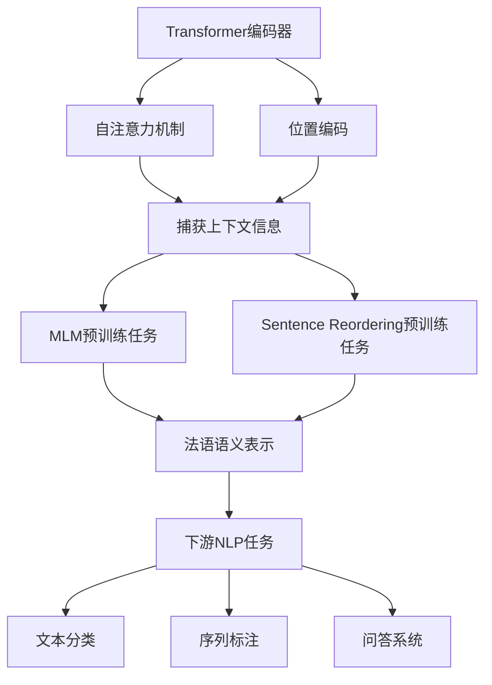

以下是关于"Transformer大模型实战 法语的FlauBERT模型"的技术博客文章正文内容：

# Transformer大模型实战 法语的FlauBERT模型

## 1. 背景介绍

### 1.1 问题的由来

随着自然语言处理(NLP)技术的不断发展,transformer模型在各种NLP任务中表现出色,尤其是大规模预训练语言模型(PLM)的出现,极大推动了NLP技术的进步。然而,大多数PLM都是基于英语训练的,对于其他语种的支持还较为薄弱。法语作为世界通用语言之一,在欧洲和非洲地区有着广泛的应用,但一直缺乏针对法语的大规模预训练语言模型。

### 1.2 研究现状

为了弥补这一空白,一些研究人员开发了针对法语的预训练语言模型,如CamemBERT、FlauBERT等。其中,FlauBERT是一个基于RoBERTa模型的法语预训练语言模型,在多项法语NLP任务上表现优异。

### 1.3 研究意义

FlauBERT模型的出现为法语NLP研究提供了强大的基础模型,可以支持下游任务如文本分类、序列标注、问答系统等。同时,FlauBERT的训练过程和模型结构也为其他语种的预训练模型开发提供了借鉴。

### 1.4 本文结构

本文将从以下几个方面对FlauBERT模型进行深入探讨:
1. 核心概念与联系
2. 核心算法原理与具体操作步骤
3. 数学模型和公式详细讲解
4. 项目实践:代码实例和详细解释
5. 实际应用场景
6. 工具和资源推荐
7. 未来发展趋势与挑战
8. 常见问题与解答

## 2. 核心概念与联系

FlauBERT模型的核心思想是基于Transformer的自注意力机制,通过大规模无监督预训练捕获法语的语义和上下文信息。预训练过程包括两个主要任务:

1. **Masked Language Modeling(MLM)**: 随机掩蔽部分输入tokens,模型需要预测被掩蔽的tokens。
2. **Sentence Reordering**: 打乱句子顺序,模型需要恢复正确的句子顺序。

预训练后的FlauBERT可用于各种下游NLP任务,通过微调(fine-tuning)的方式将预训练模型知识转移到特定任务上。

FlauBERT模型与其他transformer模型(如BERT、RoBERTa等)的核心思想类似,但针对法语语料进行了特殊优化,如子词词典、预训练语料、训练策略等方面的调整。

## 3. 核心算法原理与具体操作步骤

### 3.1 算法原理概述

FlauBERT模型的核心算法基于Transformer的自注意力机制和BERT/RoBERTa的Masked Language Modeling预训练策略。算法主要分为两个阶段:

1. **预训练(Pre-training)阶段**:
   - 使用大规模法语语料(如Wikipedia等)进行无监督预训练
   - 采用MLM和Sentence Reordering两种预训练任务
   - 通过自注意力机制捕获法语词语、句子的上下文语义信息

2. **微调(Fine-tuning)阶段**:
   - 将预训练好的FlauBERT模型应用到下游NLP任务
   - 在特定任务数据上进行有监督微调
   - 将预训练获得的语义知识转移到目标任务

### 3.2 算法步骤详解

**预训练阶段**:

1. **数据预处理**:
   - 收集大规模法语语料
   - 构建子词词典(SentencePiece)
   - 将文本切分为子词序列

2. **Masked Language Modeling**:
   - 随机掩蔽15%的输入tokens
   - 对被掩蔽的tokens进行预测
   - 最小化掩蔽tokens的预测交叉熵损失

3. **Sentence Reordering**:
   - 随机打乱句子顺序
   - 预测正确的句子顺序
   - 最小化句子顺序预测的交叉熵损失

4. **模型训练**:
   - 基于Transformer编码器结构
   - 使用自注意力机制捕获上下文
   - 联合优化MLM和Sentence Reordering两个任务的损失

**微调阶段**:

1. **加载预训练模型**:
   - 加载预训练好的FlauBERT模型权重

2. **任务特定数据准备**:
   - 收集目标NLP任务的训练数据
   - 按任务要求对数据进行预处理

3. **模型微调**:
   - 在目标任务数据上进行有监督微调
   - 根据任务类型设计不同的输出层
   - 最小化任务相关的损失函数(如交叉熵损失)

4. **模型评估**:
   - 在任务验证集上评估模型性能
   - 根据评估指标进行模型选择和调优

5. **模型部署**:
   - 将微调好的模型部署到生产环境
   - 对新的输入数据进行预测和推理

### 3.3 算法优缺点

**优点**:

- 通过大规模无监督预训练,FlauBERT能够捕获丰富的法语语义和上下文信息
- 预训练模型知识可转移到各种下游NLP任务,提高任务性能
- 自注意力机制有效捕获长距离依赖关系

**缺点**:

- 预训练过程计算量大,需要大量GPU资源
- 对训练语料的质量和多样性有较高要求
- 在某些特定领域可能需要进一步的领域自适应训练

### 3.4 算法应用领域

FlauBERT模型可广泛应用于各种法语自然语言处理任务,包括但不限于:

- 文本分类: 新闻分类、情感分析等
- 序列标注: 命名实体识别、关系抽取等
- 问答系统: 阅读理解、开放域问答等
- 文本生成: 文本续写、对话系统等
- 机器翻译: 法语-其他语言的机器翻译
- 信息抽取: 从非结构化文本中抽取结构化信息

## 4. 数学模型和公式详细讲解与举例说明

### 4.1 数学模型构建

FlauBERT模型的数学基础主要来自Transformer编码器结构和自注意力机制。我们先介绍自注意力机制的数学模型:

给定一个长度为n的输入序列$X = (x_1, x_2, ..., x_n)$,自注意力机制首先计算Query(Q)、Key(K)和Value(V)向量:

$$Q = XW^Q$$
$$K = XW^K$$
$$V = XW^V$$

其中$W^Q,W^K,W^V$是可训练的权重矩阵。

然后计算注意力分数:

$$\text{Attention}(Q, K, V) = \text{softmax}(\frac{QK^T}{\sqrt{d_k}})V$$

其中$d_k$是缩放因子,用于防止内积值过大导致梯度消失。

最后,通过注意力分数对Value向量进行加权求和,得到输出表示:

$$\text{Output} = \text{Attention}(Q, K, V)$$

在Transformer编码器中,自注意力层被堆叠多层,每层的输出作为下一层的输入,从而捕获输入序列的长程依赖关系。

### 4.2 公式推导过程

FlauBERT模型的预训练目标是最小化两个任务的损失:Masked Language Modeling(MLM)和Sentence Reordering。

**MLM损失**:

对于每个被掩蔽的token $x_i$,我们需要最小化其预测分布与真实标签之间的交叉熵损失:

$$\mathcal{L}_\text{MLM} = -\sum_{i \in \text{masked}} \log P(x_i|\mathbf{x}_\backslash i)$$

其中$\mathbf{x}_\backslash i$表示去掉$x_i$的输入序列。

**Sentence Reordering损失**:

给定一个包含m个句子的文档$\mathcal{D} = (s_1, s_2, ..., s_m)$,我们将句子顺序打乱为$\mathcal{D}' = (s'_1, s'_2, ..., s'_m)$,目标是预测正确的句子顺序。损失函数为:

$$\mathcal{L}_\text{Reordering} = -\log P(\pi|\mathcal{D}')$$

其中$\pi$是从$\mathcal{D}'$到$\mathcal{D}$的映射(排列)。

**联合预训练损失**:

将MLM损失和Sentence Reordering损失相加,得到联合预训练损失:

$$\mathcal{L} = \mathcal{L}_\text{MLM} + \mathcal{L}_\text{Reordering}$$

在预训练过程中,我们优化上述损失函数,使模型能够同时学习token级和句子级的语义表示。

### 4.3 案例分析与讲解

我们以一个法语文本分类案例来说明FlauBERT模型在实际任务中的应用。

假设我们有一个法语新闻数据集,需要将新闻文本分为"政治"、"体育"、"科技"等类别。我们可以按以下步骤使用FlauBERT模型:

1. **数据预处理**:
   - 将新闻文本切分为子词序列
   - 添加特殊tokens(如[CLS]表示分类标签)
   - 构造输入示例(input_ids, token_type_ids, attention_mask)

2. **加载FlauBERT模型**:
   - 从Hugging Face模型库中加载预训练的FlauBERT模型

3. **模型微调**:
   - 在分类数据集上微调FlauBERT模型
   - 使用[CLS]向量作为分类输入
   - 添加分类头(如全连接层+softmax)
   - 最小化分类交叉熵损失

4. **模型评估**:
   - 在测试集上评估分类准确率等指标

5. **模型预测**:
   - 对新的法语新闻文本进行分类预测

通过上述步骤,我们可以充分利用FlauBERT模型在大规模语料上学习到的语义知识,并将其转移到文本分类任务上,从而获得良好的分类性能。

### 4.4 常见问题解答

**Q: FlauBERT模型与BERT等其他transformer模型有何区别?**

A: FlauBERT模型的主要区别在于:
1. 使用法语语料进行预训练,捕获法语特有的语义和语法信息
2. 在预训练过程中加入了Sentence Reordering任务,显式建模句子级别的语义关系
3. 采用RoBERTa的训练策略,如动态掩蔽、更大的batch size等

**Q: FlauBERT模型在预训练时如何处理不常见词?**

A: FlauBERT模型使用SentencePiece算法构建子词词典,将不常见词拆分为多个子词表示。这种子词化方法可以有效缓解未登录词问题,提高模型的泛化能力。

**Q: 如何选择合适的超参数(如学习率、批量大小等)进行模型微调?**

A:超参数的选择需要根据具体任务和数据集进行大量实验和调优。一般可以从FlauBERT原论文或其他研究工作中获取一些经验值作为初始参考,然后在开发集上进行网格搜索或其他优化算法寻找最优超参数组合。

## 5. 项目实践:代码实例和详细解释说明

### 5.1 开发环境搭建

在实践FlauBERT模型之前,我们需要先搭建开发环境。以下是主要步骤:

1. **安装Python**:建议使用Python 3.6或更高版本。

2. **安装PyTorch**:FlauBERT模型基于PyTorch框架实现,需要安装PyTorch及其对应的CUDA版本(如果使用GPU加速)。

3. **安装Transformers库**:Hugging Face的Transformers库