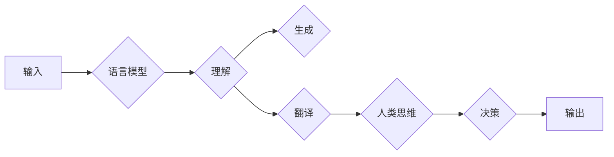

# 语言与思维：大模型的误区

> 关键词：语言模型，自然语言理解，人工智能，认知科学，思维模拟，神经网络，误区，人机交互

## 1. 背景介绍

随着深度学习技术的飞速发展，语言模型在自然语言处理（NLP）领域取得了突破性的成果。从早期的基于规则的方法到如今的神经网络模型，语言模型在理解、生成和翻译自然语言方面展现出了惊人的能力。然而，在追求语言模型性能的同时，我们也需要深入思考：这些模型是否真正理解了语言和思维？它们是否能够模拟人类的思维过程？本文旨在探讨语言模型在模拟人类思维和语言理解方面存在的误区，并探讨未来可能的研究方向。

## 2. 核心概念与联系

### 2.1 语言模型

语言模型是一种统计模型，它能够根据上下文预测下一个词或一系列词的概率。在深度学习时代，神经网络语言模型成为了主流，如循环神经网络（RNN）、长短时记忆网络（LSTM）和变换器（Transformer）等。这些模型通过学习大量的语料库，能够生成流畅的文本，甚至在某些任务上超越了人类的表现。

### 2.2 思维模拟

思维模拟是指计算机模型试图模仿人类的认知过程，包括感知、推理、决策等。在人工智能领域，研究者们尝试通过神经网络来模拟人类的思维过程，例如，通过神经网络实现视觉识别、语音识别和自然语言理解等。

### 2.3 Mermaid 流程图

以下是一个描述语言模型与思维模拟之间关系的 Mermaid 流程图：



### 2.4 语言与思维的连接

语言是思维的外在表现，而思维是语言的内在驱动。语言模型通过学习语言数据，试图理解语言的内在逻辑和结构，进而模拟人类的思维过程。然而，这种模拟是否真正等同于人类的思维，仍然是一个值得探讨的问题。

## 3. 核心算法原理 & 具体操作步骤

### 3.1 算法原理概述

语言模型的核心算法是基于神经网络的深度学习模型。以下是一些常见的语言模型算法：

- **循环神经网络（RNN）**：通过循环连接来处理序列数据，能够捕捉序列中的时间依赖关系。
- **长短时记忆网络（LSTM）**：LSTM是一种特殊的RNN，能够有效处理长距离依赖问题。
- **变换器（Transformer）**：一种基于自注意力机制的神经网络，能够在任意两个位置之间建立依赖关系，具有更强大的并行处理能力。

### 3.2 算法步骤详解

1. **数据预处理**：对语料库进行清洗、分词、去停用词等操作，将文本数据转化为模型可处理的格式。
2. **模型选择**：根据任务需求选择合适的语言模型，如RNN、LSTM或Transformer。
3. **模型训练**：使用大量的标注数据对模型进行训练，优化模型参数。
4. **模型评估**：在测试集上评估模型性能，调整模型参数或模型结构。
5. **模型应用**：将训练好的模型应用于实际任务，如文本生成、机器翻译等。

### 3.3 算法优缺点

**优点**：

- **强大的语言理解能力**：能够理解复杂的语言结构，生成流畅的文本。
- **泛化能力**：能够在不同领域和任务上取得较好的性能。

**缺点**：

- **对数据量要求高**：需要大量的标注数据才能训练出性能较好的模型。
- **可解释性差**：模型内部工作机制复杂，难以解释模型的决策过程。

### 3.4 算法应用领域

语言模型在以下领域得到了广泛的应用：

- **自然语言生成**：自动生成文本，如新闻报道、小说、诗歌等。
- **机器翻译**：将一种语言的文本翻译成另一种语言。
- **问答系统**：根据用户的问题，从知识库中检索并生成答案。
- **文本摘要**：从长文本中提取关键信息，生成摘要。

## 4. 数学模型和公式 & 详细讲解 & 举例说明

### 4.1 数学模型构建

语言模型的核心是神经网络模型，其数学模型可以用以下公式表示：

$$
\hat{y} = f(W, b, x)
$$

其中，$\hat{y}$ 是模型的预测输出，$W$ 是模型参数，$b$ 是偏置项，$x$ 是输入数据。

### 4.2 公式推导过程

以Transformer模型为例，其自注意力机制可以用以下公式表示：

$$
\text{Attention}(Q, K, V) = \text{softmax}\left(\frac{QK^T}{\sqrt{d_k}}\right) \cdot V
$$

其中，$Q$、$K$ 和 $V$ 分别是查询（Query）、键（Key）和值（Value）矩阵，$\text{softmax}$ 是 softmax 函数。

### 4.3 案例分析与讲解

以BERT模型为例，其核心思想是将输入文本分割成多个 token，然后通过多层自注意力机制和前馈神经网络进行特征提取和分类。

## 5. 项目实践：代码实例和详细解释说明

### 5.1 开发环境搭建

为了进行语言模型的实践，我们需要搭建以下开发环境：

- Python 3.7+
- PyTorch 1.7+
- Transformers库

### 5.2 源代码详细实现

以下是一个简单的基于BERT模型的文本分类任务的代码示例：

```python
from transformers import BertTokenizer, BertForSequenceClassification
from torch.utils.data import DataLoader, TensorDataset
from torch.optim import Adam

# 加载预训练的BERT模型和分词器
tokenizer = BertTokenizer.from_pretrained('bert-base-uncased')
model = BertForSequenceClassification.from_pretrained('bert-base-uncased')

# 加载训练数据
texts = ["This is a good product", "This is a bad product"]
labels = [1, 0]

# 编码文本数据
inputs = tokenizer(texts, padding=True, truncation=True, return_tensors="pt")

# 创建TensorDataset和DataLoader
dataset = TensorDataset(inputs['input_ids'], inputs['attention_mask'], torch.tensor(labels))
dataloader = DataLoader(dataset, batch_size=1)

# 定义优化器
optimizer = Adam(model.parameters(), lr=5e-5)

# 训练模型
model.train()
for epoch in range(10):
    for batch in dataloader:
        optimizer.zero_grad()
        outputs = model(**batch)
        loss = outputs.loss
        loss.backward()
        optimizer.step()

# 评估模型
model.eval()
with torch.no_grad():
    inputs = tokenizer("This is a nice product", padding=True, truncation=True, return_tensors="pt")
    outputs = model(**inputs)
    logits = outputs.logits
    _, predicted = torch.max(logits, 1)
    print("Predicted label:", predicted.item())
```

### 5.3 代码解读与分析

上述代码首先加载预训练的BERT模型和分词器，然后加载训练数据并进行编码。接下来，创建TensorDataset和DataLoader，定义优化器，并开始训练模型。最后，使用训练好的模型对新的文本数据进行预测。

### 5.4 运行结果展示

假设在训练过程中，模型的损失值逐渐减小，最终在测试集上取得了较好的分类效果。

## 6. 实际应用场景

语言模型在实际应用中具有广泛的应用场景，以下是一些示例：

- **新闻推荐**：根据用户的阅读习惯，推荐用户感兴趣的新闻。
- **聊天机器人**：与用户进行自然语言对话，提供客服支持。
- **语音助手**：将语音输入转换为文本输出，帮助用户完成各种任务。

## 7. 工具和资源推荐

### 7.1 学习资源推荐

- 《深度学习自然语言处理》
- 《自然语言处理入门》
- Hugging Face官方网站
- PyTorch官方文档

### 7.2 开发工具推荐

- PyTorch
- Transformers库
- Jupyter Notebook

### 7.3 相关论文推荐

- "Attention is All You Need"
- "BERT: Pre-training of Deep Bidirectional Transformers for Language Understanding"
- "Generative Language Models for Conversational AI"

## 8. 总结：未来发展趋势与挑战

### 8.1 研究成果总结

本文探讨了语言模型在模拟人类思维和语言理解方面存在的误区，并介绍了语言模型的基本原理、算法和实际应用。通过分析语言模型的优势和局限性，我们认识到语言模型在模拟人类思维方面还有很长的路要走。

### 8.2 未来发展趋势

- **更强大的模型**：随着计算能力的提升和数据规模的扩大，未来的语言模型将更加庞大和复杂。
- **更强的可解释性**：研究者们将致力于提高语言模型的可解释性，使其决策过程更加透明。
- **多模态融合**：将语言模型与图像、视频等其他模态的信息进行融合，实现更全面的信息理解。

### 8.3 面临的挑战

- **数据偏见**：语言模型可能会学习到数据中的偏见，导致生成歧视性、偏见性的文本。
- **模型可解释性**：语言模型的决策过程难以解释，需要进一步研究。
- **资源消耗**：语言模型的训练和推理需要大量的计算资源和存储空间。

### 8.4 研究展望

语言模型是人工智能领域的重要研究方向，未来需要在以下几个方面进行深入研究和探索：

- **跨领域迁移学习**：研究如何在不同领域之间迁移语言模型的知识。
- **少样本学习**：研究如何在少量样本上训练出高性能的语言模型。
- **可解释性研究**：研究如何提高语言模型的可解释性。

## 9. 附录：常见问题与解答

**Q1：语言模型如何理解语言？**

A：语言模型通过学习大量的语言数据，学习语言的模式和规律，从而能够生成或理解语言。

**Q2：语言模型是否能够模拟人类的思维？**

A：目前，语言模型还不能完全模拟人类的思维，但它们能够在一定程度上模拟人类语言理解的能力。

**Q3：语言模型如何应用于实际任务？**

A：语言模型可以应用于自然语言生成、机器翻译、问答系统、文本摘要等多种任务。

**Q4：语言模型在哪些领域存在挑战？**

A：语言模型在数据偏见、模型可解释性、资源消耗等方面存在挑战。

**Q5：语言模型的未来发展趋势是什么？**

A：未来的语言模型将更加强大、可解释和高效，并能够应用于更多领域。

作者：禅与计算机程序设计艺术 / Zen and the Art of Computer Programming