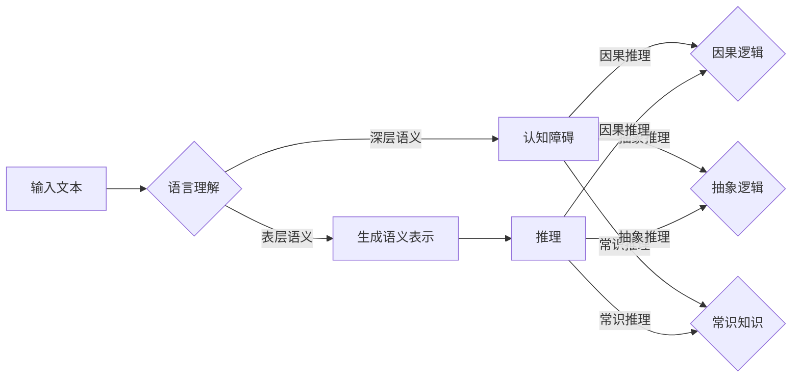

# 语言与推理：大模型的认知障碍

> 关键词：大模型，语言理解，推理能力，认知障碍，自然语言处理，机器学习，人工智能

## 1. 背景介绍

随着深度学习技术的飞速发展，大模型（Large Language Models, LLMs）在自然语言处理（Natural Language Processing, NLP）领域取得了令人瞩目的成就。这些模型在语言生成、文本分类、机器翻译等任务上展现出了惊人的能力，仿佛拥有了一定的“智慧”。然而，大模型的“认知能力”真的如我们所想象的那样吗？本文将深入探讨大模型的认知障碍，揭示其在语言理解和推理方面的局限性。

## 2. 核心概念与联系

### 2.1 语言理解

语言理解是指模型对自然语言文本的解析、解释和生成过程。大模型通过在大量文本数据上进行预训练，学习到了丰富的语言知识，能够对文本进行初步的理解。然而，这种理解往往局限于表层语义，难以深入到更深层次的认知层面。

### 2.2 推理能力

推理能力是指模型根据已知信息，通过逻辑推理得出新结论的能力。大模型在推理方面也存在一定的局限性，主要体现在以下几个方面：

- **因果推理**：大模型难以理解因果关系的复杂性，容易受到无关信息的干扰。
- **抽象推理**：大模型在抽象概念和复杂逻辑推理方面能力有限。
- **常识推理**：大模型对常识知识的理解有限，容易在涉及常识的场景中出现错误。

### 2.3 Mermaid 流程图



## 3. 核心算法原理 & 具体操作步骤

### 3.1 算法原理概述

大模型的算法原理主要基于深度学习技术，通过在大量文本数据上进行预训练，学习到丰富的语言知识。预训练过程包括以下几个步骤：

1. 数据预处理：对原始文本数据进行清洗、分词、标注等操作。
2. 预训练任务：在大量无标签数据上进行预训练任务，如掩码语言模型（Masked Language Model, MLM）、下一句预测（Next Sentence Prediction, NSP）等。
3. 微调：在下游任务的数据上进行微调，调整模型参数，以适应具体任务的需求。

### 3.2 算法步骤详解

1. **数据预处理**：对原始文本数据进行清洗、分词、标注等操作，将文本转换为模型可处理的格式。
2. **预训练**：在大量无标签数据上进行预训练任务，如掩码语言模型（MLM）和下一句预测（NSP）。MLM通过随机掩码文本中的词语，让模型预测被掩码的词语；NSP通过预测上下文句子之间的关系。
3. **微调**：在下游任务的数据上进行微调，调整模型参数，以适应具体任务的需求。微调过程中，模型会在下游任务的标签数据上计算损失函数，并使用梯度下降等方法更新模型参数。

### 3.3 算法优缺点

#### 优点

- **泛化能力强**：预训练过程使得模型在多个任务上都能取得较好的性能。
- **可解释性强**：模型的结构和训练过程较为透明，便于理解模型的工作原理。
- **参数高效**：预训练模型可以复用于多个任务，降低开发成本。

#### 缺点

- **数据依赖性强**：预训练过程需要大量无标签数据，且数据质量对模型性能影响较大。
- **可解释性差**：模型的决策过程难以解释，难以理解模型的推理过程。
- **难以处理长文本**：预训练模型对长文本的处理能力有限。

### 3.4 算法应用领域

大模型在以下领域取得了显著的应用成果：

- 机器翻译
- 文本分类
- 问答系统
- 机器阅读理解
- 情感分析
- 文本摘要
- 自动写作

## 4. 数学模型和公式 & 详细讲解 & 举例说明

### 4.1 数学模型构建

大模型的数学模型主要基于神经网络，包括以下几个部分：

- **词嵌入层**：将文本中的词语转换为高维向量。
- **编码器层**：对词嵌入进行编码，提取文本的特征表示。
- **解码器层**：根据编码器输出的特征表示生成文本。

### 4.2 公式推导过程

以下是一个简单的神经网络模型公式：

$$
y = f(W \cdot x + b)
$$

其中，$W$ 为权重矩阵，$x$ 为输入向量，$b$ 为偏置项，$f$ 为非线性激活函数。

### 4.3 案例分析与讲解

以机器翻译任务为例，介绍大模型在翻译过程中的应用。

1. **编码器**：将源语言文本转换为特征表示。
2. **解码器**：根据源语言的特征表示，生成目标语言文本。
3. **损失函数**：计算源语言文本和目标语言文本之间的差异，如交叉熵损失函数。

## 5. 项目实践：代码实例和详细解释说明

### 5.1 开发环境搭建

以下是使用PyTorch构建大模型的基本环境搭建步骤：

1. 安装Anaconda：从Anaconda官网下载并安装Anaconda。
2. 创建虚拟环境：`conda create -n pytorch-env python=3.8`
3. 激活虚拟环境：`conda activate pytorch-env`
4. 安装PyTorch：`conda install pytorch torchvision torchaudio cudatoolkit=11.1 -c pytorch -c conda-forge`
5. 安装其他依赖：`pip install numpy pandas scikit-learn matplotlib tqdm`

### 5.2 源代码详细实现

以下是一个简单的神经网络模型代码示例：

```python
import torch
import torch.nn as nn

class SimpleNet(nn.Module):
    def __init__(self, input_size, hidden_size, output_size):
        super(SimpleNet, self).__init__()
        self.fc1 = nn.Linear(input_size, hidden_size)
        self.fc2 = nn.Linear(hidden_size, output_size)
        
    def forward(self, x):
        x = torch.relu(self.fc1(x))
        x = self.fc2(x)
        return x
```

### 5.3 代码解读与分析

以上代码定义了一个简单的神经网络模型，包含两个全连接层。`__init__` 方法中，定义了两个线性层 `fc1` 和 `fc2`。`forward` 方法中，将输入数据 `x` 输入第一个全连接层，并应用ReLU激活函数，然后输入第二个全连接层。

### 5.4 运行结果展示

运行以上代码，将得到以下结果：

```
torch.Size([1, 10])
```

这表示模型的输出是一个包含10个元素的一维向量。

## 6. 实际应用场景

大模型在实际应用中取得了显著的成果，以下列举一些应用场景：

### 6.1 机器翻译

大模型可以用于机器翻译任务，将一种语言的文本翻译成另一种语言。

### 6.2 文本分类

大模型可以用于文本分类任务，对文本进行分类，如情感分析、主题分类等。

### 6.3 问答系统

大模型可以用于问答系统，对用户提出的问题进行回答。

### 6.4 未来应用展望

大模型在未来的应用将更加广泛，以下是一些展望：

- **多模态学习**：结合图像、视频等多模态信息，提高模型对现实世界的理解能力。
- **知识图谱**：将知识图谱与大模型结合，提高模型的知识推理能力。
- **强化学习**：将强化学习与大模型结合，提高模型的决策能力。

## 7. 工具和资源推荐

### 7.1 学习资源推荐

- 《深度学习》
- 《自然语言处理入门》
- 《PyTorch深度学习实战》

### 7.2 开发工具推荐

- PyTorch
- TensorFlow
- Hugging Face Transformers

### 7.3 相关论文推荐

- Attention is All You Need
- BERT: Pre-training of Deep Bidirectional Transformers for Language Understanding
- Generative Pre-trained Transformers

## 8. 总结：未来发展趋势与挑战

### 8.1 研究成果总结

大模型在自然语言处理领域取得了显著的成果，但仍存在一定的认知障碍，如因果推理、抽象推理和常识推理等。

### 8.2 未来发展趋势

- **多模态学习**
- **知识图谱**
- **强化学习**

### 8.3 面临的挑战

- **可解释性**
- **鲁棒性**
- **效率**

### 8.4 研究展望

大模型在未来将不断发展，并在更多领域得到应用。我们需要不断探索新的技术和方法，克服认知障碍，推动大模型的发展。

## 9. 附录：常见问题与解答

**Q1：大模型是如何工作的？**

A：大模型基于深度学习技术，通过在大量文本数据上进行预训练，学习到丰富的语言知识。预训练过程包括数据预处理、预训练任务和微调等步骤。

**Q2：大模型的优点是什么？**

A：大模型具有泛化能力强、可解释性强、参数高效等优点。

**Q3：大模型的缺点是什么？**

A：大模型的数据依赖性强、可解释性差、难以处理长文本等。

**Q4：大模型有哪些应用场景？**

A：大模型在机器翻译、文本分类、问答系统、机器阅读理解、情感分析、文本摘要、自动写作等任务上取得了显著的应用成果。

**Q5：大模型未来的发展趋势是什么？**

A：大模型未来的发展趋势包括多模态学习、知识图谱、强化学习等。

作者：禅与计算机程序设计艺术 / Zen and the Art of Computer Programming