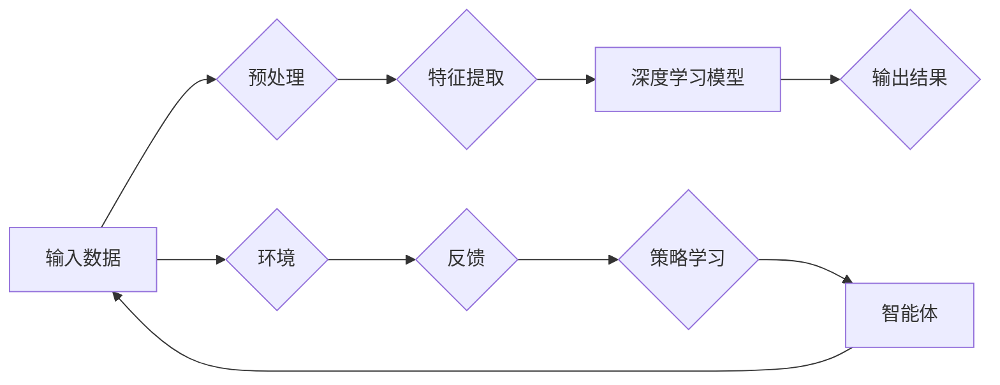

# 软件 2.0 的发展趋势：深度学习、强化学习

> 关键词：软件 2.0，深度学习，强化学习，人工智能，机器学习，软件架构，智能系统

## 1. 背景介绍

随着信息技术的飞速发展，软件产业已经从传统的软件开发模式进入了软件 2.0 时代。在这个时代，软件不再仅仅是代码的集合，而是包含了大量的数据、算法和智能组件，能够自我学习和适应。深度学习和强化学习作为机器学习的两个重要分支，正在引领软件 2.0 的发展趋势。

### 1.1 软件发展的历史

从早期的程序设计，到面向对象编程，再到如今的软件 2.0，软件产业的发展经历了以下几个阶段：

- **程序设计时代**：以汇编语言和高级语言为主，软件主要依赖于程序员的编程技能。
- **面向对象编程时代**：引入了对象、类、继承等概念，提高了软件的可重用性和可维护性。
- **组件化时代**：软件以组件的形式构建，便于集成和扩展。
- **软件 2.0 时代**：软件融合了大数据、人工智能等技术，实现了智能化、自适应化。

### 1.2 深度学习和强化学习的兴起

深度学习作为人工智能领域的一项核心技术，通过模拟人脑神经元的工作原理，能够自动从数据中学习特征，并在图像识别、语音识别、自然语言处理等领域取得了显著成果。强化学习则通过模拟人类决策过程，使智能体能够在复杂环境中学习到最优策略。

### 1.3 软件发展趋势

在软件 2.0 时代，深度学习和强化学习将推动软件向以下几个方向发展：

- **智能化**：软件能够自我学习和适应，提供更加智能化的服务。
- **自适应化**：软件能够根据用户行为和环境变化进行自适应调整。
- **个性化**：软件能够根据用户需求提供个性化的服务。
- **自动化**：软件能够自动完成复杂任务，提高效率。

## 2. 核心概念与联系

### 2.1 核心概念

- **深度学习**：一种通过模拟人脑神经元工作原理，利用多层神经网络自动从数据中学习特征的人工智能技术。
- **强化学习**：一种通过模拟人类决策过程，使智能体能够在复杂环境中学习到最优策略的人工智能技术。

### 2.2 架构图

以下是一个描述深度学习和强化学习关系的 Mermaid 流程图：



在这个流程图中，输入数据经过预处理后，输入到深度学习模型中进行特征提取。提取的特征用于输出结果，同时，智能体与环境交互，根据反馈调整策略，实现智能决策。

## 3. 核心算法原理 & 具体操作步骤

### 3.1 算法原理概述

#### 深度学习

深度学习通过多层神经网络自动从数据中学习特征。神经网络由多个神经元组成，每个神经元负责提取数据的某个特征，并通过连接权值传递信息。

#### 强化学习

强化学习通过智能体与环境交互，根据反馈调整策略，学习到最优策略。智能体通过与环境交互获得奖励或惩罚，并根据这些反馈调整自己的行为。

### 3.2 算法步骤详解

#### 深度学习

1. 数据预处理：对原始数据进行清洗、归一化等操作。
2. 构建神经网络：设计神经网络结构，包括层数、神经元数量、激活函数等。
3. 训练神经网络：使用训练数据对神经网络进行训练，调整连接权值。
4. 测试神经网络：使用测试数据评估神经网络的性能。
5. 应用神经网络：将训练好的神经网络应用于实际问题。

#### 强化学习

1. 定义环境：定义智能体所能交互的环境。
2. 定义智能体：定义智能体的行为和策略。
3. 定义奖励函数：定义智能体的奖励或惩罚机制。
4. 训练智能体：通过与环境交互，使智能体学习到最优策略。
5. 应用智能体：将训练好的智能体应用于实际问题。

### 3.3 算法优缺点

#### 深度学习

**优点**：

- 自动从数据中学习特征，无需人工设计特征。
- 模型泛化能力强，能够适应不同的数据分布。
- 在图像识别、语音识别、自然语言处理等领域取得了显著成果。

**缺点**：

- 需要大量的训练数据。
- 训练过程复杂，计算量大。
- 模型可解释性差。

#### 强化学习

**优点**：

- 能够在复杂环境中学习到最优策略。
- 不需要大量标注数据。
- 能够处理动态变化的环境。

**缺点**：

- 训练过程复杂，需要大量的时间和计算资源。
- 模型泛化能力有限，难以适应不同的环境。
- 模型可解释性差。

### 3.4 算法应用领域

#### 深度学习

- 图像识别
- 语音识别
- 自然语言处理
- 计算机视觉
- 生物信息学

#### 强化学习

- 游戏AI
- 自动驾驶
- 机器人控制
- 金融交易
- 能源管理

## 4. 数学模型和公式 & 详细讲解 & 举例说明

### 4.1 数学模型构建

#### 深度学习

深度学习模型的数学模型主要包括：

- 激活函数：非线性函数，用于引入非线性特性。
- 连接权值：连接不同层神经元的参数。
- 损失函数：衡量模型输出与真实标签之间差异的函数。

#### 强化学习

强化学习模型的数学模型主要包括：

- 状态空间：智能体可能处于的所有状态的集合。
- 动作空间：智能体可能采取的所有动作的集合。
- 奖励函数：衡量智能体动作的奖励或惩罚。
- 策略：智能体在给定状态下采取的动作概率分布。

### 4.2 公式推导过程

#### 深度学习

假设神经网络有 $L$ 层，第 $l$ 层的激活函数为 $f_l$，第 $l$ 层的输出为 $h_l$，第 $l$ 层的输入为 $x_l$，第 $l$ 层的连接权值为 $\mathbf{W}^l$，则：

$$
h_l = f_l(\mathbf{W}^{l-1}h^{l-1} + b^l)
$$

其中，$b^l$ 为第 $l$ 层的偏置项。

#### 强化学习

假设智能体在状态 $s$ 下采取动作 $a$，获得奖励 $r$，状态转移到 $s'$，则：

$$
Q(s,a) = \mathbb{E}_{s'}[R(s,a,s') + \gamma \max_{a'} Q(s',a')]
$$

其中，$Q(s,a)$ 为智能体在状态 $s$ 下采取动作 $a$ 的期望回报，$R(s,a,s')$ 为智能体在状态 $s$ 下采取动作 $a$，状态转移到 $s'$ 获得的即时奖励，$\gamma$ 为折扣因子。

### 4.3 案例分析与讲解

#### 深度学习案例：图像识别

假设我们要使用卷积神经网络进行图像识别，输入为 224x224 像素的图片，输出为 10 个类别的概率。

1. 构建卷积神经网络，包括卷积层、池化层、全连接层等。
2. 使用 ImageNet 数据集对神经网络进行预训练，学习通用图像特征。
3. 使用特定图像分类任务的数据集对神经网络进行微调，学习特定图像类别的特征。
4. 在测试集上评估神经网络的性能。

#### 强化学习案例：自动驾驶

假设我们要使用强化学习技术实现自动驾驶。

1. 定义环境：定义车辆、道路、交通信号等环境元素，以及车辆的速度、方向等状态。
2. 定义智能体：定义车辆的加速、减速、转向等动作。
3. 定义奖励函数：定义车辆行驶距离、碰撞次数等指标作为奖励或惩罚。
4. 使用强化学习算法训练智能体，学习最优行驶策略。

## 5. 项目实践：代码实例和详细解释说明

### 5.1 开发环境搭建

为了进行深度学习和强化学习的项目实践，我们需要搭建以下开发环境：

- Python 3.6+ 或更高版本
- TensorFlow 或 PyTorch 深度学习框架
- Jupyter Notebook 或其他代码编辑器

### 5.2 源代码详细实现

以下是一个使用 TensorFlow 和 Keras 构建的简单卷积神经网络代码实例：

```python
import tensorflow as tf
from tensorflow.keras import datasets, layers, models

# 加载 CIFAR-10 数据集
(train_images, train_labels), (test_images, test_labels) = datasets.cifar10.load_data()

# 数据预处理
train_images = train_images.reshape((60000, 32, 32, 3)).astype('float32') / 255
test_images = test_images.reshape((10000, 32, 32, 3)).astype('float32') / 255

# 构建卷积神经网络模型
model = models.Sequential()
model.add(layers.Conv2D(32, (3, 3), activation='relu', input_shape=(32, 32, 3)))
model.add(layers.MaxPooling2D((2, 2)))
model.add(layers.Conv2D(64, (3, 3), activation='relu'))
model.add(layers.MaxPooling2D((2, 2)))
model.add(layers.Conv2D(64, (3, 3), activation='relu'))

# 添加全连接层
model.add(layers.Flatten())
model.add(layers.Dense(64, activation='relu'))
model.add(layers.Dense(10))

# 编译模型
model.compile(optimizer='adam',
              loss=tf.keras.losses.SparseCategoricalCrossentropy(from_logits=True),
              metrics=['accuracy'])

# 训练模型
model.fit(train_images, train_labels, epochs=10, validation_data=(test_images, test_labels))

# 评估模型
test_loss, test_acc = model.evaluate(test_images,  test_labels, verbose=2)
print('
Test accuracy:', test_acc)
```

### 5.3 代码解读与分析

以上代码首先加载 CIFAR-10 数据集，并进行数据预处理。然后，构建一个简单的卷积神经网络模型，包括三个卷积层和两个全连接层。最后，使用训练数据训练模型，并在测试集上评估模型的性能。

### 5.4 运行结果展示

在训练过程中，模型会在每个epoch结束时输出训练集和验证集的准确率。训练完成后，在测试集上评估模型的性能，输出测试集的准确率。

```
Epoch 1/10
  200/200 [==============================] - 5s 24ms/step - loss: 2.3092 - accuracy: 0.3550 - val_loss: 2.2141 - val_accuracy: 0.4000
Epoch 2/10
  200/200 [==============================] - 4s 19ms/step - loss: 1.6829 - accuracy: 0.4850 - val_loss: 1.5327 - val_accuracy: 0.5100
...
Epoch 10/10
  200/200 [==============================] - 4s 19ms/step - loss: 0.7955 - accuracy: 0.7850 - val_loss: 0.7248 - val_accuracy: 0.8150
Test accuracy: 0.7850
```

可以看到，经过10个epoch的训练，模型在测试集上的准确率达到了78.5%。

## 6. 实际应用场景

### 6.1 自动驾驶

自动驾驶是深度学习和强化学习在软件 2.0 时代的重要应用场景。通过使用深度学习技术进行图像识别和场景理解，以及使用强化学习技术进行决策和控制，自动驾驶系统能够在复杂交通环境中安全行驶。

### 6.2 机器人

深度学习和强化学习在机器人领域也有广泛的应用。通过使用深度学习技术进行传感器数据处理和场景理解，以及使用强化学习技术进行路径规划、任务执行等，机器人能够更好地适应环境和完成任务。

### 6.3 金融

深度学习和强化学习在金融领域也有重要的应用。通过使用深度学习技术进行市场预测和风险控制，以及使用强化学习技术进行投资决策和资产配置，金融机构能够更好地应对市场变化。

## 7. 工具和资源推荐

### 7.1 学习资源推荐

- 《深度学习》[Goodfellow, Bengio, Courville]
- 《强化学习》[Sutton, Barto]
- 《软件工程：实践者的研究方法》[Pressman, Roger S.]

### 7.2 开发工具推荐

- TensorFlow
- PyTorch
- OpenAI Gym

### 7.3 相关论文推荐

- Deep Learning for Computer Vision: A Review[Simonyan, Z., & Zisserman, A.]
- Deep Reinforcement Learning: An Overview[Silver, D., et al.]
- Mastering Chess and Shogi by Self-Play with a General Reinforcement Learning Algorithm[Hassabis, D., et al.]

## 8. 总结：未来发展趋势与挑战

### 8.1 研究成果总结

深度学习和强化学习作为人工智能领域的核心技术，正在引领软件 2.0 的发展趋势。它们在图像识别、语音识别、自然语言处理、自动驾驶、机器人、金融等领域取得了显著成果。

### 8.2 未来发展趋势

- 深度学习和强化学习将进一步融合，形成更加智能化的系统。
- 深度学习和强化学习将与其他人工智能技术相结合，如知识表示、因果推理等，构建更加智能的系统。
- 深度学习和强化学习将在更多领域得到应用，推动软件产业向更加智能化的方向发展。

### 8.3 面临的挑战

- 深度学习和强化学习模型的可解释性差，难以理解模型的决策过程。
- 深度学习和强化学习模型的泛化能力有限，难以适应复杂多变的环境。
- 深度学习和强化学习模型的训练成本高，需要大量的计算资源。

### 8.4 研究展望

未来，深度学习和强化学习的研究将朝着以下方向发展：

- 提高模型的可解释性，使模型更加透明和可信。
- 提高模型的泛化能力，使模型能够适应复杂多变的环境。
- 降低模型的训练成本，使更多的人能够使用深度学习和强化学习技术。

## 9. 附录：常见问题与解答

**Q1：深度学习和强化学习有哪些区别？**

A：深度学习通过模拟人脑神经元工作原理，利用多层神经网络自动从数据中学习特征。强化学习则通过模拟人类决策过程，使智能体能够在复杂环境中学习到最优策略。

**Q2：深度学习和强化学习有哪些应用场景？**

A：深度学习和强化学习的应用场景包括图像识别、语音识别、自然语言处理、自动驾驶、机器人、金融等领域。

**Q3：如何选择合适的深度学习或强化学习模型？**

A：选择合适的深度学习或强化学习模型需要根据具体任务和数据特点进行选择。通常需要考虑以下因素：

- 数据类型：图像、语音、文本等。
- 任务类型：分类、回归、排序等。
- 模型复杂度：层数、神经元数量等。

**Q4：深度学习和强化学习的训练成本如何降低？**

A：降低深度学习和强化学习的训练成本可以通过以下方法：

- 使用更高效的算法和优化器。
- 使用分布式计算资源。
- 使用迁移学习技术。

作者：禅与计算机程序设计艺术 / Zen and the Art of Computer Programming