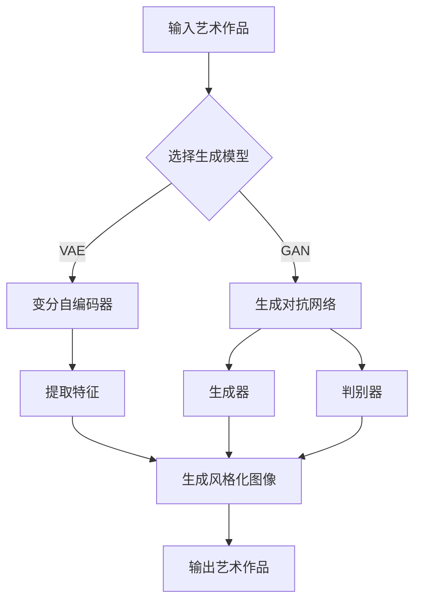

> 关键词：软件2.0，艺术创作，人工智能，生成模型，风格迁移，计算机视觉，深度学习，神经网络，文化创新

# 软件 2.0 的艺术创作：AI 生成艺术

在计算机科学的发展历程中，软件经历了从简单工具到复杂系统的转变，进入了软件2.0时代。这一时代，软件不仅是一个工具，更是创造力的延伸，是艺术创作的伙伴。随着人工智能技术的飞速发展，AI生成艺术成为了软件2.0时代的一个亮点，它不仅丰富了我们的艺术体验，也推动了文化和科技的融合。本文将深入探讨AI生成艺术的原理、应用和未来展望。

## 1. 背景介绍

### 1.1 软件2.0的兴起

软件2.0时代，软件不再仅仅是满足特定功能的工具，而是变得更加智能化、个性化、互动化和创造化。软件开始与用户建立更紧密的联系，能够根据用户的需求和反馈进行自我优化和进化。

### 1.2 艺术与科技的融合

艺术与科技的融合是软件2.0时代的一个重要趋势。计算机技术的发展为艺术创作提供了新的工具和手段，艺术家们开始探索如何利用科技创造出新的艺术形式。

### 1.3 AI生成艺术的兴起

随着深度学习的兴起，AI生成艺术成为可能。AI可以通过学习大量的艺术作品，生成新的艺术作品，甚至创造出前所未有的艺术风格。

## 2. 核心概念与联系

### 2.1 核心概念原理

AI生成艺术的核心概念包括：

- **深度学习**：一种模拟人脑神经网络结构的机器学习方法，能够从大量数据中学习到复杂的模式。
- **生成模型**：一种能够生成新数据的深度学习模型，如变分自编码器（VAE）和生成对抗网络（GAN）。
- **风格迁移**：一种将一种图像的风格应用到另一种图像上的技术。

### 2.2 架构的 Mermaid 流程图



## 3. 核心算法原理 & 具体操作步骤

### 3.1 算法原理概述

AI生成艺术的原理基于深度学习，特别是生成模型和风格迁移技术。生成模型能够学习数据的分布，生成新的数据；风格迁移技术能够将一种风格应用到另一种数据上。

### 3.2 算法步骤详解

1. **数据收集**：收集大量的艺术作品数据，用于训练生成模型。
2. **模型选择**：选择合适的生成模型，如VAE或GAN。
3. **模型训练**：使用收集到的数据训练生成模型。
4. **风格迁移**：选择目标风格和源图像，应用风格迁移技术生成风格化图像。
5. **输出结果**：输出最终的生成艺术作品。

### 3.3 算法优缺点

**优点**：

- **创造力**：AI生成艺术能够创造出全新的艺术作品，拓宽艺术创作的边界。
- **效率**：AI生成艺术能够高效地生成大量艺术作品。
- **个性化**：AI可以学习用户的喜好，生成符合个人风格的艺术作品。

**缺点**：

- **质量**：AI生成艺术的质量可能参差不齐，需要不断优化模型和算法。
- **伦理**：AI生成艺术可能引发版权、版权归属等问题。

### 3.4 算法应用领域

AI生成艺术的应用领域包括：

- **艺术创作**：生成全新的艺术作品，如画作、音乐、文学作品等。
- **广告设计**：设计更具创意的广告和视觉内容。
- **游戏开发**：生成游戏场景、角色等。
- **虚拟现实**：生成虚拟现实环境。

## 4. 数学模型和公式 & 详细讲解 & 举例说明

### 4.1 数学模型构建

VAE和GAN是两种常见的生成模型，下面分别介绍它们的数学模型。

#### 4.1.1 变分自编码器（VAE）

VAE的数学模型如下：

$$
\begin{align*}
\mathbf{q}_\phi(\mathbf{z}|\mathbf{x}) &= \frac{1}{Z} \exp\left(-\frac{1}{2}(\mathbf{z}-\mathbf{\mu}_\phi(\mathbf{x}))^\top \Sigma_\phi(\mathbf{x})^{-1}(\mathbf{z}-\mathbf{\mu}_\phi(\mathbf{x}))\right) \\
\mathbf{p}_\theta(\mathbf{x}|\mathbf{z}) &= \mathcal{N}(\mathbf{x}|\mathbf{W} \mathbf{z} + \mathbf{b}, \mathbf{\Sigma}) \\
\end{align*}
$$

其中，$\mathbf{q}_\phi(\mathbf{z}|\mathbf{x})$ 是编码器，用于将输入数据 $\mathbf{x}$ 编码为潜在空间中的向量 $\mathbf{z}$；$\mathbf{p}_\theta(\mathbf{x}|\mathbf{z})$ 是解码器，用于将潜在空间中的向量 $\mathbf{z}$ 解码为原始数据 $\mathbf{x}$。

#### 4.1.2 生成对抗网络（GAN）

GAN的数学模型如下：

$$
\begin{align*}
\mathbf{D}(\mathbf{x}) &= \frac{1}{2} \log \left(1 + \exp\left(-\mathbf{D}(\mathbf{G}(\mathbf{z})\right)\right) \\
\mathbf{D}(\mathbf{G}(\mathbf{z})) &= \frac{1}{2} \log \left(1 + \exp\left(-\mathbf{D}(\mathbf{G}(\mathbf{z})\right)\right) \\
\end{align*}
$$

其中，$\mathbf{D}$ 是判别器，用于判断输入数据是真实数据还是生成数据；$\mathbf{G}$ 是生成器，用于生成与真实数据分布相似的生成数据。

### 4.2 公式推导过程

VAE和GAN的公式推导过程较为复杂，这里不再赘述。详细的推导过程可以参考相关论文。

### 4.3 案例分析与讲解

以下是一个使用VAE生成手写字体的案例：

1. **数据收集**：收集大量手写字体数据。
2. **模型训练**：使用收集到的数据训练VAE模型。
3. **生成手写字体**：使用训练好的VAE模型生成新的手写字体。

## 5. 项目实践：代码实例和详细解释说明

### 5.1 开发环境搭建

- 安装Python和TensorFlow或PyTorch。
- 安装必要的依赖库，如NumPy、Pandas等。

### 5.2 源代码详细实现

以下是一个使用PyTorch实现VAE的简单示例：

```python
import torch
import torch.nn as nn

class VAE(nn.Module):
    def __init__(self):
        super(VAE, self).__init__()
        self.encoder = nn.Sequential(
            nn.Linear(784, 400),
            nn.ReLU(),
            nn.Linear(400, 20)
        )
        self.decoder = nn.Sequential(
            nn.Linear(20, 400),
            nn.ReLU(),
            nn.Linear(400, 784)
        )

    def forward(self, x):
        z = self.encoder(x)
        z_mean, z_log_var = torch.chunk(z, 2, dim=1)
        z = self.reparameterize(z_mean, z_log_var)
        x_hat = self.decoder(z)
        return x_hat, z_mean, z_log_var

    def reparameterize(self, mu, logvar):
        std = torch.exp(0.5 * logvar)
        eps = torch.randn_like(std)
        return mu + eps * std

# 示例使用
model = VAE()
x = torch.randn(1, 784)
x_hat, z_mean, z_log_var = model(x)
```

### 5.3 代码解读与分析

上述代码定义了一个简单的VAE模型，包括编码器、解码器和重参数化函数。编码器将输入数据编码为潜在空间中的向量，解码器将潜在空间中的向量解码为原始数据。

### 5.4 运行结果展示

运行上述代码，可以生成与输入数据分布相似的生成数据。

## 6. 实际应用场景

### 6.1 艺术创作

AI生成艺术可以用于创作新的艺术作品，如画作、音乐、文学作品等。

### 6.2 广告设计

AI生成艺术可以用于设计更具创意的广告和视觉内容。

### 6.3 游戏开发

AI生成艺术可以用于生成游戏场景、角色等。

### 6.4 虚拟现实

AI生成艺术可以用于生成虚拟现实环境。

## 7. 工具和资源推荐

### 7.1 学习资源推荐

- 《深度学习》（Goodfellow et al.）
- 《生成对抗网络》（Goodfellow et al.）
- 《PyTorch深度学习实践》

### 7.2 开发工具推荐

- TensorFlow
- PyTorch
- Keras

### 7.3 相关论文推荐

- Generative Adversarial Nets（GAN）
- Unsupervised Representation Learning with Deep Convolutional Generative Adversarial Networks（DCGAN）
- Variational Autoencoders

## 8. 总结：未来发展趋势与挑战

### 8.1 研究成果总结

AI生成艺术是软件2.0时代的一个重要应用，它结合了人工智能和艺术创作的优势，为艺术创作提供了新的可能性。

### 8.2 未来发展趋势

- **更强大的生成模型**：未来将会有更强大的生成模型出现，能够生成更加逼真和多样化的艺术作品。
- **跨模态生成**：AI生成艺术将能够跨模态生成，如将图像、音乐、文字等融合在一起。
- **个性化生成**：AI生成艺术将能够根据用户的需求和喜好生成个性化的艺术作品。

### 8.3 面临的挑战

- **算法复杂度**：生成模型的算法复杂度较高，需要更多的计算资源。
- **数据隐私**：AI生成艺术需要大量的数据，如何保护数据隐私是一个挑战。
- **伦理问题**：AI生成艺术可能会引发版权、版权归属等问题。

### 8.4 研究展望

AI生成艺术是软件2.0时代的一个重要方向，它将推动艺术和科技的融合，为人类社会带来更多的价值。

## 9. 附录：常见问题与解答

**Q1：AI生成艺术能否取代艺术家？**

A：AI生成艺术可以辅助艺术家进行创作，但无法完全取代艺术家。艺术家的创造力、情感和审美是AI无法替代的。

**Q2：AI生成艺术的版权问题如何解决？**

A：AI生成艺术的版权问题是一个复杂的法律问题，需要制定相应的法律法规进行规范。

**Q3：AI生成艺术的应用前景如何？**

A：AI生成艺术的应用前景广阔，将在艺术创作、广告设计、游戏开发等领域发挥重要作用。

作者：禅与计算机程序设计艺术 / Zen and the Art of Computer Programming