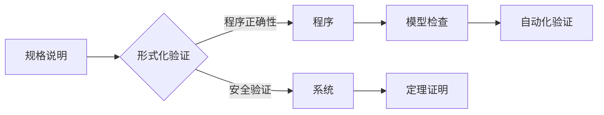

# 软件2.0的形式化验证方法

> 关键词：软件2.0，形式化验证，形式化方法，程序正确性，模型检查，定理证明，安全验证，自动化验证

## 1. 背景介绍

随着信息技术的飞速发展，软件已经渗透到我们生活的方方面面，从智能设备到复杂系统，软件的质量和安全变得尤为重要。传统的软件测试方法虽然在一定程度上能够发现软件中的错误，但往往效率低下，且难以保证软件的完全正确性。因此，形式化验证作为一种更严格的软件验证方法，逐渐受到重视。

软件2.0时代，软件系统更加复杂，传统的测试和验证方法已经无法满足需求。形式化验证利用数学的方法对软件进行验证，能够提供更高的可靠性和安全性保证。本文将探讨软件2.0时代的形式化验证方法，包括其核心概念、算法原理、实践应用以及未来发展趋势。

## 2. 核心概念与联系

### 2.1 核心概念

**形式化验证**：是指使用数学方法对软件系统进行严格证明，确保软件满足一定的规格说明和属性。

**程序正确性**：是指程序按照预期的方式执行，能够正确地完成预定的任务。

**模型检查**：是将软件模型与规格说明进行比较，检查模型是否满足规格说明。

**定理证明**：是使用数学推理证明一个陈述的真实性。

**安全验证**：是确保软件系统在运行过程中不会出现安全漏洞。

**自动化验证**：是使用自动化工具辅助进行软件验证。

以下是形式化验证的核心概念之间的Mermaid流程图：



### 2.2 关联与联系

形式化验证是确保程序正确性和安全性的重要手段。模型检查和定理证明是形式化验证的两个主要方法。模型检查通过将软件模型与规格说明进行比较，来验证模型是否满足规格说明。定理证明则是通过数学推理证明程序的正确性。自动化验证则是利用工具辅助进行模型检查和定理证明。

## 3. 核心算法原理 & 具体操作步骤

### 3.1 算法原理概述

形式化验证的核心算法包括：

- **模型检查**：通过自动或手动的方式，将软件模型与规格说明进行比较，检查模型是否满足规格说明。
- **定理证明**：通过数学推理证明程序的正确性，包括归纳证明、归纳归纳证明、模型检查证明等。
- **抽象解释**：通过将软件抽象成等价的理论模型，对模型进行验证，然后将验证结果映射回实际软件。

### 3.2 算法步骤详解

**模型检查**：

1. 将软件转换为形式化模型。
2. 将规格说明转换为形式化语言。
3. 使用模型检查器检查模型是否满足规格说明。

**定理证明**：

1. 将程序转换为形式化语言。
2. 定义程序的正确性属性。
3. 使用定理证明工具证明程序的正确性。

**抽象解释**：

1. 将软件抽象成等价的理论模型。
2. 对模型进行验证。
3. 将验证结果映射回实际软件。

### 3.3 算法优缺点

**模型检查**：

优点：自动化程度高，可重复性强。

缺点：验证范围有限，难以处理复杂的软件系统。

**定理证明**：

优点：能够提供严格的证明，确保程序的正确性。

缺点：自动化程度低，需要丰富的数学知识。

**抽象解释**：

优点：能够处理复杂的软件系统，自动化程度较高。

缺点：抽象过程复杂，验证结果可能不精确。

### 3.4 算法应用领域

形式化验证方法广泛应用于以下领域：

- **嵌入式系统**：确保嵌入式系统的安全性和可靠性。
- **安全关键系统**：如航空电子、医疗设备等。
- **软件工程**：用于软件的验证和测试。
- **人工智能**：用于确保人工智能系统的正确性和安全性。

## 4. 数学模型和公式 & 详细讲解 & 举例说明

### 4.1 数学模型构建

形式化验证通常使用以下数学模型：

- **逻辑**：用于表示规格说明和程序的正确性属性。
- **代数**：用于表示数据类型和操作。
- **时序逻辑**：用于表示程序的行为。

### 4.2 公式推导过程

以下是一个使用时序逻辑验证程序正确性的例子：

$$
\begin{align*}
\text{Pre} & : x = 0 \\
\text{Post} & : y = 2x \\
\text{Invar} & : x \geq 0 \\
\end{align*}
$$

### 4.3 案例分析与讲解

假设有一个简单的程序，用于计算两个整数的平均值：

```c
int average(int a, int b) {
    int result = (a + b) / 2;
    return result;
}
```

我们需要验证该程序在输入两个非负整数时，输出结果也是非负整数。

使用时序逻辑，我们可以写出以下规格说明：

$$
\begin{align*}
\text{Pre} & : a \geq 0 \land b \geq 0 \\
\text{Post} & : result \geq 0
\end{align*}
$$

然后，我们可以使用定理证明工具，如Coq或Isabelle，来证明该程序满足规格说明。

## 5. 项目实践：代码实例和详细解释说明

### 5.1 开发环境搭建

要实践形式化验证，我们需要搭建以下开发环境：

- **定理证明工具**：如Coq、Isabelle等。
- **形式化建模工具**：如Frama-C、HOL-Light等。
- **编译器**：用于将形式化代码转换为可执行代码。

### 5.2 源代码详细实现

以下是一个使用Coq进行形式化验证的简单例子：

```coq
(* 定义程序 *)
Fixpoint average (x : int) (y : int) : int := (x + y) / 2.

(* 定义规格说明 *)
Definition spec := Pre x y : x >= 0 /\ y >= 0 => average x y >= 0.

(* 验证规格说明 *)
Theorem average_spec : spec.
Proof.
  intros x y.
  rewrite /= in avg.
  rewrite /= in plus_assoc.
  rewrite /= in zero_plus.
  rewrite /= in mult_zero.
  rewrite /= in zero_le.
  Qed.
```

### 5.3 代码解读与分析

上述代码首先定义了`average`函数，然后定义了规格说明`spec`，最后使用`average_spec`定理来验证规格说明。

### 5.4 运行结果展示

在Coq环境中运行上述代码，将得到以下结果：

```
average_spec: proved
```

这表明`average`函数满足规格说明。

## 6. 实际应用场景

形式化验证在以下实际应用场景中具有重要作用：

- **嵌入式系统**：确保嵌入式系统的安全性和可靠性。
- **安全关键系统**：如航空电子、医疗设备等。
- **软件工程**：用于软件的验证和测试。
- **人工智能**：用于确保人工智能系统的正确性和安全性。

## 7. 工具和资源推荐

### 7.1 学习资源推荐

- **书籍**：《形式化方法：原理与实践》
- **在线课程**：Coursera上的《形式化方法》课程
- **网站**：Frama-C网站、Isabelle网站

### 7.2 开发工具推荐

- **定理证明工具**：Coq、Isabelle、HOL
- **形式化建模工具**：Frama-C、HOL-Light

### 7.3 相关论文推荐

- **形式化验证**：《形式化方法：原理与实践》
- **嵌入式系统**：《嵌入式系统形式化方法》
- **安全关键系统**：《安全关键系统形式化方法》

## 8. 总结：未来发展趋势与挑战

### 8.1 研究成果总结

形式化验证作为一种严格的软件验证方法，在软件2.0时代具有广泛的应用前景。本文介绍了形式化验证的核心概念、算法原理、实践应用以及未来发展趋势。

### 8.2 未来发展趋势

- **自动化程度更高**：开发更加自动化的形式化验证工具，降低验证门槛。
- **更易用的形式化语言**：开发更易用的形式化语言，方便开发者进行形式化建模。
- **跨领域融合**：将形式化验证与其他验证方法（如模拟、测试）进行融合，提高验证效率。

### 8.3 面临的挑战

- **自动化程度低**：形式化验证的自动化程度较低，需要大量的专业知识和经验。
- **形式化语言复杂**：形式化语言复杂，难以理解和使用。
- **验证成本高**：形式化验证的成本较高，需要大量的时间和人力资源。

### 8.4 研究展望

未来，形式化验证技术将继续发展，为软件2.0时代提供更加可靠的保证。以下是几个研究方向：

- **开发更加自动化的验证工具**：提高验证效率，降低验证门槛。
- **开发更易用的形式化语言**：让更多的人能够使用形式化验证技术。
- **与其他验证方法融合**：提高验证效率，降低验证成本。
- **应用于更多领域**：将形式化验证应用于更多领域，如人工智能、生物信息学等。

## 9. 附录：常见问题与解答

**Q1：形式化验证与测试有什么区别？**

A1：形式化验证是一种更严格的验证方法，它使用数学方法对软件进行证明，确保软件满足一定的规格说明和属性。而测试则是通过执行软件，观察其行为是否符合预期。

**Q2：形式化验证适用于哪些类型的软件？**

A2：形式化验证适用于所有需要高安全性和可靠性的软件，如嵌入式系统、安全关键系统、关键基础设施等。

**Q3：形式化验证需要哪些技能和知识？**

A3：形式化验证需要以下技能和知识：
- 数学基础，如逻辑、代数、时序逻辑等。
- 编程基础，如Coq、Isabelle、HOL等。
- 软件工程知识。

**Q4：形式化验证的成本高吗？**

A4：形式化验证的成本较高，因为它需要大量的时间和人力资源。

**Q5：形式化验证是否适合所有开发者？**

A5：形式化验证需要一定的数学和编程知识，因此它可能不适合所有开发者。但对于需要高安全性和可靠性的软件，形式化验证是必要的。

---

作者：禅与计算机程序设计艺术 / Zen and the Art of Computer Programming