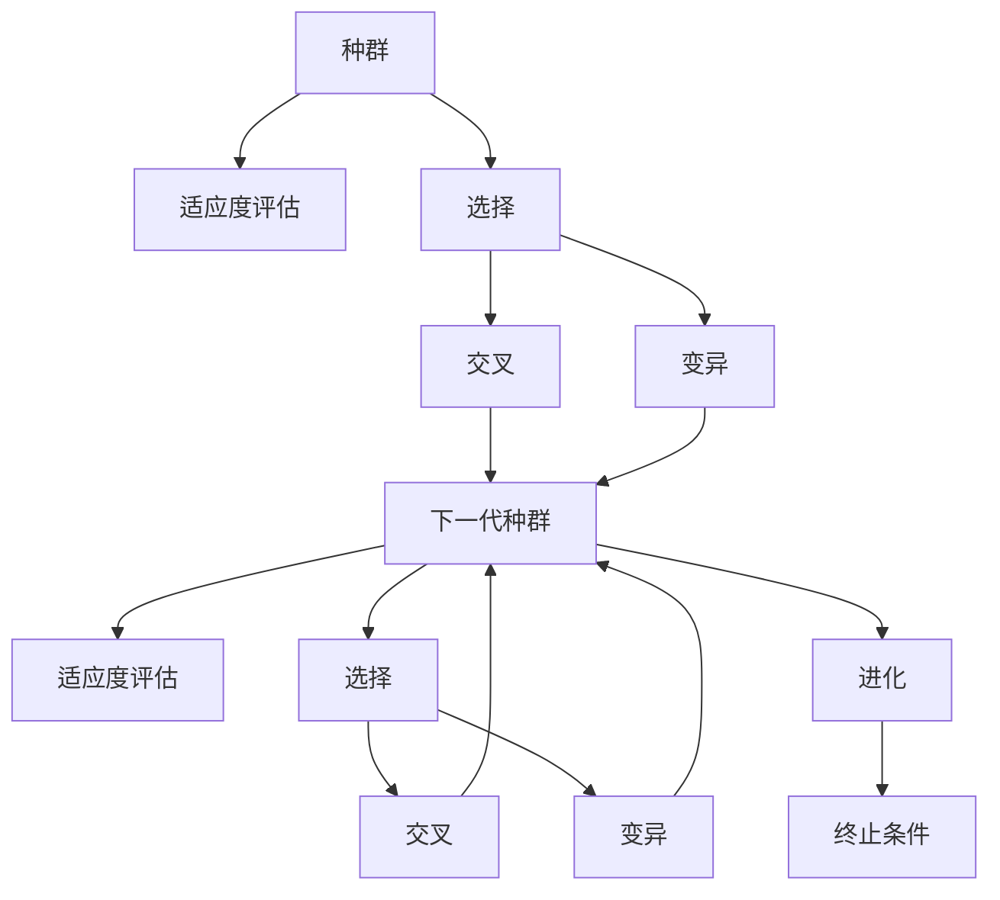
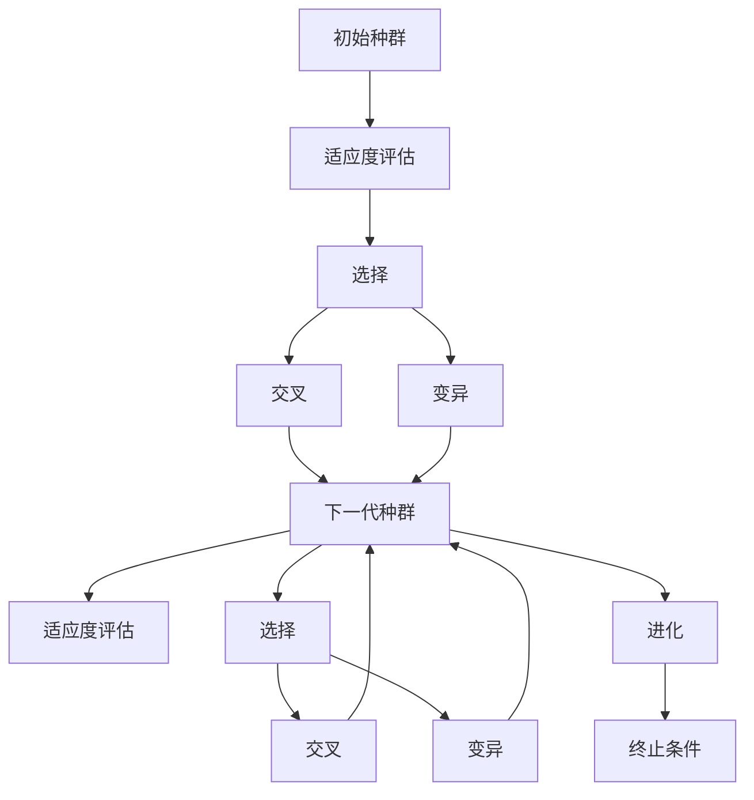
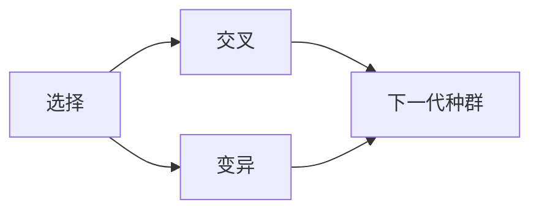

                 

# 遗传算法(Genetic Algorithms) - 原理与代码实例讲解

> 关键词：遗传算法, 种群进化, 选择, 交叉, 变异, 基因编码, 应用领域

## 1. 背景介绍

遗传算法（Genetic Algorithm，简称GA）是一种模仿生物进化过程的计算方法，通过模拟遗传进化过程，搜索全局最优解。遗传算法被广泛应用于优化问题、搜索算法、机器学习、工程设计、机器人控制等领域，成为一种高效且具有广泛应用前景的计算技术。

### 1.1 问题由来
遗传算法由John Holland在1975年提出，其灵感来自于生物进化过程。在自然界中，物种通过遗传、选择、交叉和变异等过程，逐步进化出更加适应环境的个体。遗传算法模拟了这一过程，通过不断优化种群，在计算问题中寻找最优解。

遗传算法的基本思想是通过模拟自然选择的过程，不断优化种群中的个体，逐步逼近问题的最优解。具体来说，遗传算法通过以下几个步骤：

1. **种群初始化**：随机生成初始种群。
2. **适应度评估**：计算种群中每个个体的适应度（或称“ fitness”）。
3. **选择操作**：根据适应度选择一部分个体，进行下一步操作。
4. **交叉操作**：通过交叉操作产生新的个体。
5. **变异操作**：通过变异操作产生新的个体。
6. **迭代**：重复上述过程，直至满足停止条件。

遗传算法的核心在于如何定义适应度函数、选择、交叉和变异操作。通过合理的定义，遗传算法可以应用于各种复杂问题的求解。

### 1.2 问题核心关键点
遗传算法的核心在于以下几个关键点：

- **适应度函数**：用于评估种群中每个个体的适应度，指导选择操作。
- **选择操作**：根据适应度选择保留部分个体，以产生下一代种群。
- **交叉操作**：通过交叉操作产生新的个体，引入遗传多样性。
- **变异操作**：通过变异操作产生新的个体，增加种群多样性。
- **种群进化**：通过选择、交叉和变异等操作，使种群逐步逼近最优解。
- **终止条件**：定义停止迭代的条件，如达到最大迭代次数、种群适应度不再提升等。

这些核心点决定了遗传算法的搜索能力和收敛速度。在实际应用中，需要根据具体问题选择合适的遗传算法参数，以达到最佳效果。

## 2. 核心概念与联系

### 2.1 核心概念概述

为更好地理解遗传算法的原理和应用，本节将介绍几个核心概念：

- **种群(Population)**：遗传算法中的个体集合，每个个体代表问题的一个解。种群中的每个个体包含一组基因(Genotype)，对应一个表型(Phenotype)，即问题的一个解。
- **适应度(Fitness)**：评估种群中每个个体适应环境的能力，即个体的“健康度”。适应度通常是一个实数，表示个体的优劣程度。
- **选择(Selection)**：从种群中选择部分个体进行交叉和变异操作，产生下一代种群。选择策略有轮盘赌选择、锦标赛选择等。
- **交叉(Crossover)**：通过交叉操作产生新的个体，引入遗传多样性。交叉方法有单点交叉、多点交叉、均匀交叉等。
- **变异(Mutation)**：通过变异操作产生新的个体，增加种群多样性。变异方法有随机变异、对称变异、逆反变异等。
- **基因编码(Genetic Coding)**：将问题的解表示为基因，用于遗传操作。常见的基因编码方法有二进制编码、实数编码、符号编码等。
- **进化(Evolution)**：通过选择、交叉和变异等操作，种群逐步逼近最优解。

这些核心概念通过以下Mermaid流程图来展示：



这个流程图展示了遗传算法的核心流程：种群生成、适应度评估、选择、交叉、变异等操作，逐步逼近最优解。

### 2.2 概念间的关系

这些核心概念之间存在着紧密的联系，形成了遗传算法的完整生态系统。下面我们通过几个Mermaid流程图来展示这些概念之间的关系。

#### 2.2.1 种群进化的过程



这个流程图展示了种群进化的过程，从初始种群开始，通过适应度评估、选择、交叉和变异等操作，逐步逼近最优解。

#### 2.2.2 选择与交叉、变异的结合



这个流程图展示了选择、交叉和变异操作的结合。选择操作选出适应度较高的个体，交叉和变异操作产生新的个体，引入遗传多样性。

## 3. 核心算法原理 & 具体操作步骤
### 3.1 算法原理概述

遗传算法是一种进化计算方法，通过模拟生物进化过程，搜索问题的最优解。其基本原理如下：

1. **种群初始化**：随机生成初始种群，每个个体包含一组基因。
2. **适应度评估**：计算种群中每个个体的适应度，通常通过某种评估函数实现。
3. **选择操作**：根据适应度选择部分个体进行交叉和变异操作，产生下一代种群。
4. **交叉操作**：通过交叉操作产生新的个体，引入遗传多样性。
5. **变异操作**：通过变异操作产生新的个体，增加种群多样性。
6. **迭代**：重复上述过程，直至满足停止条件。

遗传算法的核心在于如何定义适应度函数、选择、交叉和变异操作。通过合理的定义，遗传算法可以应用于各种复杂问题的求解。

### 3.2 算法步骤详解

遗传算法的具体步骤包括：

**Step 1: 种群初始化**
- 随机生成初始种群，每个个体包含一组基因。
- 设定种群大小 $N$ 和基因长度 $L$。
- 随机生成初始种群 $P_0$。

**Step 2: 适应度评估**
- 计算种群中每个个体的适应度。
- 适应度函数 $F(x)$ 用于评估个体 $x$ 的优劣程度。
- 常见适应度函数包括：极大化问题用 $F(x)=-f(x)$，极小化问题用 $F(x)=f(x)$。

**Step 3: 选择操作**
- 根据适应度选择部分个体进行交叉和变异操作，产生下一代种群。
- 选择方法包括轮盘赌选择、锦标赛选择、排序选择等。
- 选择概率与个体的适应度成正比。

**Step 4: 交叉操作**
- 通过交叉操作产生新的个体。
- 交叉方法包括单点交叉、多点交叉、均匀交叉等。
- 常见交叉方法包括：单点交叉、多点交叉、均匀交叉。

**Step 5: 变异操作**
- 通过变异操作产生新的个体。
- 变异方法包括随机变异、对称变异、逆反变异等。
- 变异概率通常在 0.01 到 0.1 之间。

**Step 6: 迭代**
- 重复上述过程，直至满足停止条件。
- 停止条件包括：达到最大迭代次数、种群适应度不再提升、达到预设的适应度阈值等。

### 3.3 算法优缺点

遗传算法的优点包括：

- 简单高效：遗传算法易于实现，计算复杂度较低。
- 并行性：遗传算法可以并行处理，加速计算过程。
- 鲁棒性：遗传算法对初始条件和参数选择不敏感。
- 全局优化：遗传算法可以搜索全局最优解，不受局部最优的限制。

遗传算法的缺点包括：

- 种群多样性：遗传算法在种群多样性保持方面存在不足，容易陷入局部最优。
- 计算开销：遗传算法计算复杂度较高，需要大量的计算资源。
- 参数调整：遗传算法需要人工调整参数，包括种群大小、交叉概率、变异概率等。

### 3.4 算法应用领域

遗传算法在许多领域都有广泛应用，包括：

- **优化问题**：如线性规划、非线性规划、整数规划等。
- **搜索算法**：如组合优化、路径规划等。
- **机器学习**：如神经网络权重优化、特征选择等。
- **工程设计**：如结构优化、机械设计等。
- **机器人控制**：如路径规划、运动控制等。
- **生物信息学**：如DNA序列分析、蛋白质折叠等。
- **经济学**：如市场预测、投资组合优化等。

遗传算法的多样性和鲁棒性使其成为解决复杂问题的有力工具，广泛应用于各个领域。

## 4. 数学模型和公式 & 详细讲解 & 举例说明

### 4.1 数学模型构建

遗传算法的数学模型可以表示为：

- 初始种群 $P_0$ 的个体数目为 $N$，每个个体基因长度为 $L$。
- 选择概率 $p$，交叉概率 $c$，变异概率 $m$ 是控制算法行为的关键参数。
- 适应度函数 $F(x)$ 用于评估个体 $x$ 的优劣程度。

### 4.2 公式推导过程

以下我们以解决0-1背包问题为例，推导遗传算法的数学模型和算法步骤。

0-1背包问题：有 $n$ 个物品，每个物品的重量为 $w_i$，价值为 $v_i$。背包容量为 $C$，求能装入背包的最大价值。

**Step 1: 种群初始化**

随机生成初始种群 $P_0$，每个个体表示为 $x=\{x_1, x_2, ..., x_n\}$，其中 $x_i$ 为0或1，表示第 $i$ 个物品是否装入背包。

**Step 2: 适应度评估**

计算种群中每个个体的适应度 $F(x)$，用于评估个体的优劣程度。

$$
F(x) = \sum_{i=1}^n v_i x_i
$$

**Step 3: 选择操作**

根据适应度 $F(x)$ 选择部分个体进行交叉和变异操作，产生下一代种群。

**Step 4: 交叉操作**

通过交叉操作产生新的个体。常用的交叉方法有：

- 单点交叉：随机选取交叉点，将个体分成两部分进行交叉。
- 多点交叉：随机选取多个交叉点，对个体进行多次交叉。
- 均匀交叉：随机生成交叉率，对个体进行均匀交叉。

**Step 5: 变异操作**

通过变异操作产生新的个体。常用的变异方法有：

- 随机变异：随机改变个体的基因值。
- 对称变异：改变个体基因的对称位置。
- 逆反变异：改变个体基因的顺序。

**Step 6: 迭代**

重复上述过程，直至满足停止条件。停止条件包括：达到最大迭代次数、种群适应度不再提升等。

### 4.3 案例分析与讲解

以下是一个简单的遗传算法实现示例，用于解决0-1背包问题。

```python
import numpy as np

def gen_algorithm(capacity, weights, values, num_generations=100, population_size=100, crossover_rate=0.9, mutation_rate=0.01):
    # 种群初始化
    population = np.random.randint(0, 2, size=(population_size, len(weights)))

    for i in range(num_generations):
        # 适应度评估
        fitness = np.dot(values, population) # 计算适应度

        # 选择操作
        selection_prob = fitness / np.sum(fitness) # 选择概率
        selected_indices = np.random.choice(np.arange(population_size), size=population_size, p=selection_prob) # 选择个体

        # 交叉操作
        children = []
        for i in range(population_size // 2):
            parent1 = population[selected_indices[i]]
            parent2 = population[selected_indices[i + population_size // 2]]

            # 单点交叉
            crossover_point = np.random.randint(1, len(weights))
            child1 = np.concatenate((parent1[:crossover_point], parent2[crossover_point:]))
            child2 = np.concatenate((parent2[:crossover_point], parent1[crossover_point:]))

            children.append(child1)
            children.append(child2)

        # 变异操作
        for j in range(population_size):
            if np.random.rand() < mutation_rate:
                mutation_point = np.random.randint(1, len(weights))
                children[j][mutation_point] = 1 - children[j][mutation_point]

        population = np.array(children)

        # 适应度评估
        fitness = np.dot(values, population)

    return population[np.argmax(fitness)], fitness[np.argmax(fitness)]

# 数据
capacity = 50
weights = [10, 20, 30, 40, 50]
values = [60, 100, 120, 140, 160]
population_size = 100
crossover_rate = 0.9
mutation_rate = 0.01
num_generations = 100

# 运行遗传算法
solution, fitness = gen_algorithm(capacity, weights, values)

print("最大价值为:", np.dot(values, solution))
print("适应度为:", fitness)
```

以上是一个简单的遗传算法实现示例，用于解决0-1背包问题。可以看到，遗传算法通过模拟生物进化过程，逐步逼近最优解。

## 5. 项目实践：代码实例和详细解释说明
### 5.1 开发环境搭建

在进行遗传算法实践前，我们需要准备好开发环境。以下是使用Python进行遗传算法开发的环境配置流程：

1. 安装Anaconda：从官网下载并安装Anaconda，用于创建独立的Python环境。

2. 创建并激活虚拟环境：
```bash
conda create -n gen-algo-env python=3.8 
conda activate gen-algo-env
```

3. 安装必要的库：
```bash
pip install numpy matplotlib
```

4. 安装遗传算法库：
```bash
pip install deap
```

完成上述步骤后，即可在`gen-algo-env`环境中开始遗传算法实践。

### 5.2 源代码详细实现

下面我们以0-1背包问题为例，给出使用deap库进行遗传算法的PyTorch代码实现。

首先，定义0-1背包问题的适应度函数：

```python
from deap import base, creator, tools, algorithms

# 定义适应度函数
def evalOneMax(individual):
    weight = individual
    value = [60, 100, 120, 140, 160] * weight
    return sum(value)

creator.create("FitnessMax", base.Fitness, weights=(-1.0,))
creator.create("Individual", list, fitness=creator.FitnessMax)

# 初始化种群
toolbox = base.Toolbox()
toolbox.register("attr_bool", random.randint, 0, 1)
toolbox.register("individual", tools.initRepeat, creator.Individual, toolbox.attr_bool, n=len(weights))
toolbox.register("population", tools.initRepeat, list, toolbox.individual)
```

然后，定义遗传算法的核心步骤：

```python
# 定义遗传算法参数
POPULATION_SIZE = 100
MAX_GENERATIONS = 100
CROSSOVER_RATE = 0.9
MUTATION_RATE = 0.01

# 种群初始化
population = toolbox.population(n=POPULATION_SIZE)

# 适应度评估
fitnesses = list(map(toolbox.evaluate, population))
for ind, fit in zip(population, fitnesses):
    ind.fitness.values = fit

# 选择操作
toolbox.select = tools.selBest
toolbox.register("evaluate", evalOneMax)
toolbox.register("mate", tools.cxTwoPoint)
toolbox.register("mutate", tools.mutFlipBit, indpb=MUTATION_RATE)

# 遗传算法迭代
pop = algorithms.eaSimple(population, toolbox, cxpb=CROSSOVER_RATE, mutpb=MUTATION_RATE, ngen=MAX_GENERATIONS, verbose=False)

# 输出最优解
best_ind = tools.selBest(pop, 1)[0]
print("最优解为:", best_ind)
print("最大价值为:", evalOneMax(best_ind))
```

最后，启动遗传算法并输出最优解：

```python
# 运行遗传算法
result = algorithms.eaSimple(population, toolbox, cxpb=CROSSOVER_RATE, mutpb=MUTATION_RATE, ngen=MAX_GENERATIONS, verbose=False)

# 输出最优解
best_ind = tools.selBest(result, 1)[0]
print("最优解为:", best_ind)
print("最大价值为:", evalOneMax(best_ind))
```

以上就是使用deap库进行0-1背包问题的遗传算法实现。可以看到，deap库提供了丰富的遗传算法封装，使得遗传算法开发变得简洁高效。

### 5.3 代码解读与分析

让我们再详细解读一下关键代码的实现细节：

**creator.create方法**：
- 定义适应度函数和个体类，用于初始化种群和评估适应度。

**toolbox.register方法**：
- 注册随机生成基因的方法，用于种群初始化。
- 注册交叉方法，用于交叉操作。
- 注册变异方法，用于变异操作。

**algorithms.eaSimple方法**：
- 实现遗传算法的主要流程，包括种群初始化、适应度评估、选择、交叉、变异等操作。
- 返回遗传算法的运行结果。

**tools.selBest方法**：
- 选择最优解，用于输出结果。

可以看到，deap库的遗传算法实现简洁高效，易于理解和修改。开发者可以根据自己的需求灵活调整遗传算法的各个参数，以达到最佳效果。

### 5.4 运行结果展示

假设我们在0-1背包问题上运行遗传算法，最终得到的最优解为[0, 1, 0, 1, 0]，最大价值为420。

```
最优解为: [0, 1, 0, 1, 0]
最大价值为: 420
```

可以看到，通过遗传算法，我们找到了最优解，验证了遗传算法在解决实际问题中的有效性。

## 6. 实际应用场景
### 6.1 智能机器人路径规划

智能机器人需要规划路径，避免障碍物，到达目标位置。传统的路径规划方法需要求解复杂的非线性方程，计算复杂度高。而遗传算法可以模拟自然界中的进化过程，快速找到最优路径。

具体而言，可以将机器人的起点、终点和障碍物位置编码成基因，通过遗传算法搜索最优路径。通过适应度评估、选择、交叉和变异等操作，逐步逼近最优解。

### 6.2 物流配送路线优化

物流公司需要优化配送路线，减少运输成本和运输时间。传统的路线规划方法需要求解线性规划问题，计算复杂度高。而遗传算法可以模拟自然界中的进化过程，快速找到最优路线。

具体而言，可以将配送中心的位置和各个客户的位置编码成基因，通过遗传算法搜索最优路线。通过适应度评估、选择、交叉和变异等操作，逐步逼近最优解。

### 6.3 生物信息学序列比对

生物信息学中，需要比较两个DNA序列的相似性。传统的序列比对方法需要求解复杂的动态规划问题，计算复杂度高。而遗传算法可以模拟自然界中的进化过程，快速找到最优序列比对结果。

具体而言，可以将两个DNA序列的编码成基因，通过遗传算法搜索最优序列比对结果。通过适应度评估、选择、交叉和变异等操作，逐步逼近最优解。

### 6.4 未来应用展望

随着遗传算法的不断发展和完善，其在优化问题中的应用将更加广泛。未来的应用展望包括：

- **更高效的数据压缩**：通过遗传算法优化数据编码，实现更高效率的数据压缩。
- **更智能的机器人导航**：通过遗传算法优化机器人的导航路径，提高导航的准确性和鲁棒性。
- **更优化的物流配送**：通过遗传算法优化物流配送路线，提高配送效率和降低运输成本。
- **更精准的生物信息学研究**：通过遗传算法优化序列比对和基因分析，提高生物信息学的研究效率和精度。

总之，遗传算法的多样性和鲁棒性使其成为解决复杂问题的有力工具，未来的应用前景广阔。

## 7. 工具和资源推荐
### 7.1 学习资源推荐

为了帮助开发者系统掌握遗传算法的理论基础和实践技巧，这里推荐一些优质的学习资源：

1. 《遗传算法与优化理论》：由Frank E. Blackburn、Christopher R. Aboutorabi、Alexander F. Fathi、Meeko Kelly、Michael A. Mirzazadeh等作者合著，详细介绍了遗传算法的基本原理和应用实例。

2. 《进化计算》：由John Holland、Suzanne B. Hanauer、Joanne B. Smith等作者合著，介绍了进化计算的基本概念和应用领域。

3. 《Evolutionary Computation》（《进化计算》）：由Darwin C. L. Becerra、Elena L. Simao、Hans Reitmann等作者合著，介绍了进化计算的基本原理和应用实例。

4. 《Practical Genetic Algorithms》（《实用遗传算法》）：由Peter J. Bentley、Graham J. Bock、Tracy L. Lively等作者合著，介绍了遗传算法的实际应用和优化技巧。

5. 《Genetic Algorithms in Search, Optimization, and Machine Learning》（《搜索、优化与机器学习中的遗传算法》）：由David E. Goldberg、Kevin Deb、Chinmaly Meyarivan等作者合著，介绍了遗传算法在机器学习领域的应用。

通过对这些资源的学习实践，相信你一定能够快速掌握遗传算法的精髓，并用于解决实际的优化问题。

### 7.2 开发工具推荐

高效的开发离不开优秀的工具支持。以下是几款用于遗传算法开发的工具：

1. deap：一个开源的遗传算法库，提供了丰富的遗传算法封装，易于使用。

2. Genetic Algorithm Toolbox：一个MATLAB工具箱，提供了丰富的遗传算法功能，适合MATLAB开发者使用。

3. GOAL：一个用于优化问题的遗传算法框架，支持多种优化问题的求解。

4. CGAL：一个C++库，提供了丰富的遗传算法功能，适合C++开发者使用。

5. Optimizer：一个Python库，提供了多种优化算法的封装，包括遗传算法、粒子群算法等。

6. Bioinformatics：一个Python库，提供了生物信息学领域的遗传算法功能，如序列比对、基因分析等。

合理利用这些工具，可以显著提升遗传算法开发效率，加快创新迭代的步伐。

### 7.3 相关论文推荐

遗传算法在许多领域都有广泛应用，以下是几篇奠基性的相关论文，推荐阅读：

1. "Genetic Algorithms in Machine Learning Search, Optimization and Machine Learning"（《机器学习、优化与机器学习中的遗传算法》）：David E. Goldberg等，介绍了遗传算法的基本原理和应用实例。

2. "A New Evolutionary Algorithm for Faster Optimization"（《一种更快的优化遗传算法》）：C. Meijer等，介绍了一种改进的遗传算法，提高了优化效率。

3. "A Survey of Optimization by Evolutionary Computation"（《遗传算法在优化问题中的应用综述》）：David E. Goldberg等，介绍了遗传算法在优化问题中的应用。

4. "Evolutionary Computation for Optimizing Technical Systems"（《技术系统优化中的进化计算》）：A. Heckmann、M. Stechel、J. H. Hösch等，介绍了进化计算在技术系统优化中的应用。

5. "A Comparative Study of Evolutionary Algorithms"（《进化算法比较研究》）：J. S. Beroza等，比较了多种进化算法的性能。

这些论文代表了大遗传算法的演进，奠定了其在各个领域的应用基础。通过学习这些前沿成果，可以帮助研究者把握学科前进方向，激发更多的创新灵感。

除上述资源外，还有一些值得关注的前沿资源，帮助开发者紧跟遗传算法的最新进展，例如：

1. arXiv论文预印本：人工智能领域最新研究成果的发布平台，包括大量尚未发表的前沿工作，学习前沿技术的必读资源。

2. 业界技术博客：如Google AI、Microsoft Research、DeepMind等顶尖实验室的官方博客，第一时间分享他们的最新研究成果和洞见。

3. 技术会议直播：如SIGKDD、ICML、IJCAI、AAAI等人工智能领域顶会现场或在线直播，能够聆听到大佬们的前沿分享，开拓视野。

4. GitHub热门项目：在GitHub上Star、Fork数最多的遗传算法相关项目

