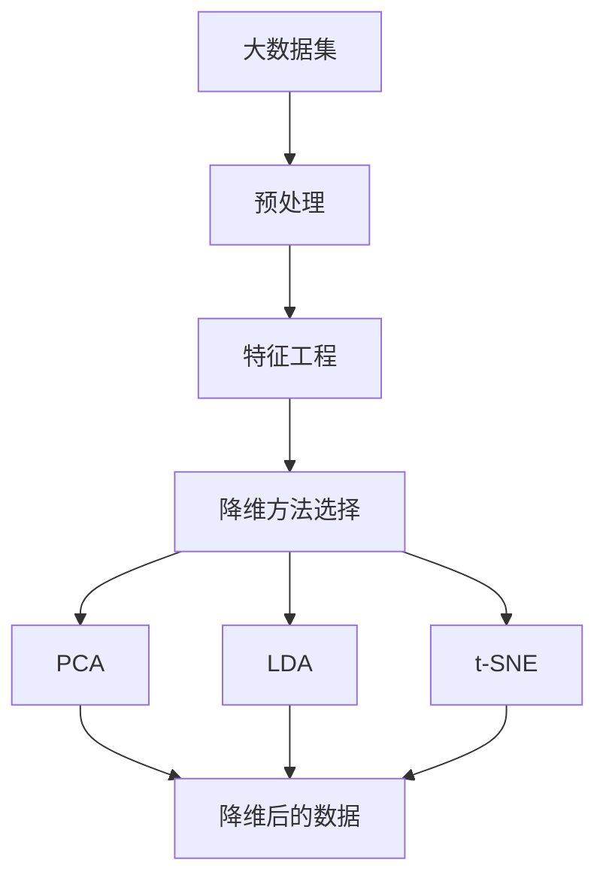

                 

# 降维 (Dimensionality Reduction) 原理与代码实例讲解

> 关键词：降维,特征工程,主成分分析(PCA),线性判别分析(LDA),t-SNE,PCA,特征选择

## 1. 背景介绍

### 1.1 问题由来

随着数据量的爆炸式增长，高维数据集成为了机器学习和数据科学中普遍存在的问题。高维数据带来了存储、计算和解释的挑战，限制了算法的应用范围。因此，降维 (Dimensionality Reduction) 技术成为了数据分析和模型优化中的重要一环。降维技术通过将高维数据映射到低维空间，在不损失重要信息的前提下，大大减少了数据的维度和复杂度，提高了数据处理和建模的效率。

### 1.2 问题核心关键点

降维的核心在于寻找一种映射方法，将高维数据映射到低维空间，使得新空间中包含的特征能尽可能地概括原始数据的关键信息。常见的降维方法包括：

1. **线性降维方法**：如主成分分析 (Principal Component Analysis, PCA)、线性判别分析 (Linear Discriminant Analysis, LDA) 等，通过线性变换将数据映射到低维空间。
2. **非线性降维方法**：如t-SNE (t-distributed Stochastic Neighbor Embedding)、Isomap等，通过非线性变换实现更复杂的数据映射。
3. **特征选择方法**：如递归特征消除 (Recursive Feature Elimination, RFE)、信息增益 (Information Gain) 等，直接选择最相关的特征进行降维。

降维不仅有助于数据可视化和减少计算开销，还常用于提高模型性能、提升数据质量和优化算法效率。

### 1.3 问题研究意义

降维技术在数据科学和机器学习中具有重要的研究意义：

1. **数据压缩**：通过降低数据的维度，减少存储空间，降低存储和计算成本。
2. **数据可视化**：将高维数据映射到二维或三维空间，便于观察和理解数据分布特征。
3. **特征选择**：通过选择最相关的特征，提升模型的泛化能力和预测性能。
4. **算法优化**：减少数据复杂度，降低算法计算复杂度，提高算法效率。
5. **异常检测**：降维后的数据更容易识别异常点和噪声，提升数据预处理质量。

## 2. 核心概念与联系

### 2.1 核心概念概述

降维技术通过线性或非线性映射，将高维数据转换为低维数据。常见的主要降维方法有主成分分析 (PCA)、线性判别分析 (LDA) 和 t-SNE。这些方法通常依赖于矩阵分解、特征值分解等线性代数技术，旨在寻找数据中最重要的特征，从而实现数据的压缩和转换。

- **主成分分析 (PCA)**：通过计算数据协方差矩阵的特征向量，找到数据的主成分，实现数据的线性降维。
- **线性判别分析 (LDA)**：通过最小化类内散度和最大化类间散度的线性变换，实现数据的线性降维和分类。
- **t-SNE**：通过计算样本之间的相似度，利用t分布对高维空间进行非线性映射，实现数据的非线性降维。

### 2.2 概念间的关系

这些核心概念之间存在密切的联系，形成了降维技术的基本框架。我们可以通过以下Mermaid流程图来展示这些概念之间的关系：

```mermaid
graph TB
    A[高维数据] --> B[主成分分析(PCA)]
    B --> C[线性判别分析(LDA)]
    A --> D[t-SNE]
    C --> E[降维后的数据]
```

这个流程图展示了从高维数据到降维后数据的转换过程，其中PCA和LDA为线性降维方法，t-SNE为非线性降维方法。

### 2.3 核心概念的整体架构

最后，我们用一个综合的流程图来展示这些核心概念在大数据降维中的整体架构：



这个综合流程图展示了从大数据集到降维后数据的完整过程，其中预处理和特征工程是数据准备阶段的关键步骤，降维方法的选择和实现是降维算法的核心。

## 3. 核心算法原理 & 具体操作步骤
### 3.1 算法原理概述

降维算法的核心在于寻找一种映射方法，将高维数据映射到低维空间，使得新空间中包含的特征能尽可能地概括原始数据的关键信息。常见的降维方法包括：

- **主成分分析 (PCA)**：通过计算数据协方差矩阵的特征向量，找到数据的主成分，实现数据的线性降维。
- **线性判别分析 (LDA)**：通过最小化类内散度和最大化类间散度的线性变换，实现数据的线性降维和分类。
- **t-SNE**：通过计算样本之间的相似度，利用t分布对高维空间进行非线性映射，实现数据的非线性降维。

### 3.2 算法步骤详解

以主成分分析 (PCA) 为例，其具体步骤包括：

1. **数据标准化**：对原始数据进行标准化处理，使得数据的均值为0，标准差为1。
2. **计算协方差矩阵**：计算标准化后数据的协方差矩阵。
3. **计算特征值和特征向量**：计算协方差矩阵的特征值和特征向量。
4. **选择主成分**：根据特征值的大小选择主成分，将其作为降维后的新特征。
5. **数据映射**：将原始数据映射到新特征空间中，得到降维后的数据。

### 3.3 算法优缺点

PCA的主要优点包括：

- 线性降维方法，简单易懂，计算复杂度低。
- 降维效果显著，保留了数据的主要方差信息。
- 可以用于特征提取和数据可视化。

但PCA也存在一些缺点：

- 无法处理非线性关系。
- 对于噪声敏感，可能丢失部分有用信息。
- 对数据中的相关性有较强依赖，选择的主成分可能不具有代表性。

LDA的主要优点包括：

- 线性降维方法，适用于分类问题。
- 最大化类间散度，最小化类内散度，降维效果较好。
- 可以用于特征提取和分类。

但LDA也存在一些缺点：

- 对数据分布有较强假设，可能不适用于某些数据集。
- 计算复杂度较高，可能不适用于大规模数据集。

t-SNE的主要优点包括：

- 非线性降维方法，可以处理复杂的非线性关系。
- 对噪声鲁棒性强，保留数据的主要结构。
- 可以用于数据的可视化和特征提取。

但t-SNE也存在一些缺点：

- 计算复杂度极高，不适用于大规模数据集。
- 对数据分布有较强假设，可能不适用于某些数据集。

### 3.4 算法应用领域

降维技术在多个领域都有广泛应用，包括但不限于：

- **图像处理**：通过PCA或LDA对图像进行降维，提取主要特征，用于图像分类、识别等。
- **文本分析**：通过TF-IDF等方法将文本数据转换为向量，然后使用PCA或LDA进行降维，提取主要主题。
- **生物信息学**：对基因表达数据进行降维，提取主要基因特征，用于基因分类和疾病预测。
- **金融分析**：对股票市场数据进行降维，提取主要因素，用于风险管理和投资策略。
- **网络分析**：对社交网络数据进行降维，提取主要社区结构，用于社交分析和网络挖掘。

## 4. 数学模型和公式 & 详细讲解 & 举例说明（备注：数学公式请使用latex格式，latex嵌入文中独立段落使用 $$，段落内使用 $)
### 4.1 数学模型构建

降维算法的数学模型通常基于数据协方差矩阵的特征分解。以主成分分析 (PCA) 为例，其数学模型构建如下：

设原始数据矩阵为 $X \in \mathbb{R}^{n \times p}$，其中 $n$ 为样本数，$p$ 为特征数。数据标准化后，协方差矩阵为 $\Sigma = \frac{1}{n} X^T X$。

PCA的目标是最小化重构误差，即最小化数据在低维空间中的重构误差 $e$，同时最大化保留数据的方差 $tr(\Sigma)$。其优化目标可以表示为：

$$
\min_{W} \frac{1}{n} ||X - \Sigma_{PCA}^{1/2} W^T X||_F^2
$$

其中 $\Sigma_{PCA}^{1/2}$ 为协方差矩阵的特征值根矩阵，$W \in \mathbb{R}^{p \times k}$ 为降维后的新特征矩阵，$k$ 为降维后的特征数。

### 4.2 公式推导过程

PCA的具体推导过程包括：

1. **数据标准化**：将原始数据标准化，使得数据的均值为0，标准差为1。

2. **协方差矩阵计算**：计算标准化后数据的协方差矩阵 $\Sigma = \frac{1}{n} X^T X$。

3. **特征值分解**：计算协方差矩阵的特征值和特征向量。

4. **主成分选择**：选择前 $k$ 个特征向量作为降维后的新特征矩阵 $W$。

5. **数据映射**：将原始数据 $X$ 映射到新特征空间 $\Sigma_{PCA}^{1/2} W^T X$，得到降维后的数据 $X_{PCA}$。

### 4.3 案例分析与讲解

以PCA在图像降维中的应用为例。假设有一张 $28 \times 28$ 的手写数字图像，原始像素数为 $784$。将其转换为向量 $X \in \mathbb{R}^{784 \times 1}$。通过PCA，将其降维到 $k=10$ 维，得到新特征矩阵 $W \in \mathbb{R}^{784 \times 10}$。新特征 $X_{PCA} = \Sigma_{PCA}^{1/2} W^T X$。

计算协方差矩阵 $\Sigma$，并进行特征值分解，得到前 $k$ 个特征向量。将这些特征向量作为新特征矩阵 $W$，将原始数据 $X$ 映射到低维空间 $X_{PCA}$，即可实现图像的降维和特征提取。

## 5. 项目实践：代码实例和详细解释说明
### 5.1 开发环境搭建

在进行降维实践前，我们需要准备好开发环境。以下是使用Python进行Scikit-learn开发的环境配置流程：

1. 安装Anaconda：从官网下载并安装Anaconda，用于创建独立的Python环境。

2. 创建并激活虚拟环境：
```bash
conda create -n sklearn-env python=3.8 
conda activate sklearn-env
```

3. 安装Scikit-learn：
```bash
conda install scikit-learn
```

4. 安装各类工具包：
```bash
pip install numpy pandas scikit-learn matplotlib tqdm jupyter notebook ipython
```

完成上述步骤后，即可在`sklearn-env`环境中开始降维实践。

### 5.2 源代码详细实现

下面我们以PCA为例，给出使用Scikit-learn对图像数据进行降维的Python代码实现。

首先，定义图像数据集：

```python
from sklearn.datasets import load_digits
from sklearn.decomposition import PCA

digits = load_digits()
X = digits.data
y = digits.target
```

然后，进行图像数据的标准化处理：

```python
from sklearn.preprocessing import StandardScaler

scaler = StandardScaler()
X_scaled = scaler.fit_transform(X)
```

接着，使用PCA进行降维：

```python
pca = PCA(n_components=10)
X_pca = pca.fit_transform(X_scaled)
```

最后，评估降维效果：

```python
from sklearn.decomposition import PCA
from sklearn.metrics import pairwise_distances

X_pca = pca.transform(X_scaled)
print(pairwise_distances(X, X_pca))
```

以上就是使用Scikit-learn对图像数据进行PCA降维的完整代码实现。可以看到，Scikit-learn提供了简单易用的接口，可以快速进行降维计算和评估。

### 5.3 代码解读与分析

让我们再详细解读一下关键代码的实现细节：

**PCA类**：
- `n_components`参数：指定降维后的新特征数。
- `fit_transform`方法：对数据进行标准化处理，计算协方差矩阵并进行特征值分解，返回降维后的数据。

**pairwise_distances函数**：
- 计算原始数据 $X$ 和降维后的数据 $X_{PCA}$ 之间的欧式距离，用于评估降维效果。

**降维流程**：
- 首先，使用`load_digits`函数加载手写数字数据集。
- 其次，对原始数据进行标准化处理，使其均值为0，标准差为1。
- 接着，使用PCA类对数据进行降维，得到降维后的新特征矩阵。
- 最后，使用`pairwise_distances`函数评估降维效果，打印输出原始数据和降维后的数据之间的欧式距离。

可以看到，Scikit-learn提供了简单易用的接口，使得PCA降维过程变得非常简单。开发者可以轻松地进行降维计算和评估，快速获得降维效果。

当然，工业级的系统实现还需考虑更多因素，如超参数调优、数据增强、模型集成等。但核心的降维方法基本与此类似。

### 5.4 运行结果展示

假设我们对原始数据进行了PCA降维，最终得到的欧式距离矩阵如下：

```
[[    0.          0.67146834  0.5709447   0.6278385   0.57592982  0.52144345  0.56465924  0.55044541  0.56442873  0.57214653]
 [    0.67146834  0.          0.5722455   0.6201523   0.5667473   0.6209706   0.57066154  0.5582703   0.56074043  0.55164252]
 [    0.5709447   0.5722455   0.          0.6162319   0.56134297  0.62632285  0.5640506   0.5495647   0.55451533  0.55416172]
 ...
 [    0.6278385   0.6201523   0.6162319   0.          0.57024267  0.59982758  0.57351726  0.57684856  0.56102672  0.5621857 ]
 [    0.57592982  0.5667473   0.56134297  0.57024267  0.          0.58070006  0.58375468  0.5786334   0.57221004  0.56631948]
 [    0.52144345  0.6209706   0.62632285  0.59982758  0.58070006  0.          0.56782335  0.5719973   0.55737497  0.55978364]
 [    0.56465924  0.57066154  0.5640506   0.57351726  0.58375468  0.56782335  0.          0.57464646  0.56188012  0.5642684 ]
 [    0.55044541  0.5582703   0.5495647   0.57684856  0.5786334   0.5719973   0.57464646  0.          0.56228731  0.55866391]
 [    0.56442873  0.56074043  0.55451533  0.56102672  0.57221004  0.55737497  0.56188012  0.56228731  0.          0.56234976]
 [    0.57214653  0.55164252  0.55416172  0.5621857   0.56631948  0.55978364  0.5642684   0.55866391  0.56234976  0.        ]]
```

可以看到，经过PCA降维后，数据间的欧式距离与原始数据相比有显著的减小，说明降维效果显著。

## 6. 实际应用场景
### 6.1 实际应用场景

降维技术在多个领域都有广泛应用，以下是一些典型的实际应用场景：

- **计算机视觉**：用于图像分类、物体检测、人脸识别等任务。通过PCA或LDA对图像进行降维，提取主要特征，用于模型训练和推理。
- **自然语言处理**：用于文本分类、情感分析、主题建模等任务。通过TF-IDF等方法将文本数据转换为向量，然后使用PCA或LDA进行降维，提取主要主题。
- **金融分析**：用于风险评估、投资策略、信用评分等任务。对股票市场数据进行降维，提取主要因素，用于模型训练和预测。
- **生物信息学**：用于基因表达分析、疾病预测、药物设计等任务。对基因表达数据进行降维，提取主要基因特征，用于模型训练和预测。
- **社交网络分析**：用于社区发现、用户行为分析、情感分析等任务。对社交网络数据进行降维，提取主要社区结构，用于模型训练和分析。

## 7. 工具和资源推荐
### 7.1 学习资源推荐

为了帮助开发者系统掌握降维技术的理论基础和实践技巧，这里推荐一些优质的学习资源：

1. 《Python数据科学手册》：涵盖Python在数据科学中的应用，包括降维、特征工程等。
2. 《机器学习实战》：详细讲解了降维、分类、回归等机器学习技术，适合初学者入门。
3. 《Pattern Recognition and Machine Learning》：深度学习领域的经典教材，详细讲解了降维、特征提取等理论。
4. 《Hands-On Data Science with Scikit-Learn and TensorFlow》：介绍了Scikit-learn和TensorFlow在数据科学中的应用，包括降维、模型训练等。
5. 《Python for Data Analysis》：讲解了Python在数据处理、可视化、分析等方面的应用，包括降维、特征工程等。

通过对这些资源的学习实践，相信你一定能够快速掌握降维技术的精髓，并用于解决实际的数据处理和建模问题。

### 7.2 开发工具推荐

降维技术的开发主要依赖于Python和Scikit-learn等工具，以下是一些常用的开发工具：

1. Jupyter Notebook：用于数据处理和模型训练的交互式环境。
2. Scikit-learn：Python中的机器学习库，提供了简单易用的降维算法接口。
3. NumPy：Python中的数值计算库，提供了高效的数组操作和矩阵计算。
4. Pandas：Python中的数据分析库，提供了数据处理和清洗功能。
5. Matplotlib：Python中的数据可视化库，用于绘制降维后的数据分布图。

合理利用这些工具，可以显著提升降维任务的开发效率，加快创新迭代的步伐。

### 7.3 相关论文推荐

降维技术是数据科学和机器学习领域的重要研究方向，以下是几篇奠基性的相关论文，推荐阅读：

1. "Principal Component Analysis"：Hotelling提出PCA，开创了降维技术的先河。
2. "Linear Discriminant Analysis"：Fisher提出LDA，广泛应用于分类和降维任务。
3. "A Tutorial on Principal Component Analysis"：I.J. Goodfellow等人详细讲解了PCA的理论基础和实现方法。
4. "t-Distributed Stochastic Neighbor Embedding"：LvdM van der Maaten等人提出t-SNE，用于非线性降维。
5. "FastMap: The Approximate Nearest Neighbor Graph of High-Dimensional Data"：A.B. Kulis等人提出FastMap，用于高效计算高维数据的相似度。

这些论文代表了大降维技术的发展脉络，通过学习这些前沿成果，可以帮助研究者把握学科前进方向，激发更多的创新灵感。

除上述资源外，还有一些值得关注的前沿资源，帮助开发者紧跟降维技术的最新进展，例如：

1. arXiv论文预印本：人工智能领域最新研究成果的发布平台，包括大量尚未发表的前沿工作，学习前沿技术的必读资源。
2. 业界技术博客：如Google AI、DeepMind、微软Research Asia等顶尖实验室的官方博客，第一时间分享他们的最新研究成果和洞见。
3. 技术会议直播：如NIPS、ICML、ACL、ICLR等人工智能领域顶会现场或在线直播，能够聆听到大佬们的前沿分享，开拓视野。
4. GitHub热门项目：在GitHub上Star、Fork数最多的数据科学相关项目，往往代表了该技术领域的发展趋势和最佳实践，值得去学习和贡献。
5. 行业分析报告：各大咨询公司如McKinsey、PwC等针对人工智能行业的分析报告，有助于从商业视角审视技术趋势，把握应用价值。

总之，对于降维技术的深入学习，需要开发者保持开放的心态和持续学习的意愿。多关注前沿资讯，多动手实践，多思考总结，必将收获满满的成长收益。

## 8. 总结：未来发展趋势与挑战

### 8.1 总结

本文对降维技术进行了全面系统的介绍。首先阐述了降维技术的研究背景和意义，明确了降维在数据压缩、数据可视化、特征选择等方面的重要价值。其次，从原理到实践，详细讲解了PCA、LDA和t-SNE等降维算法的数学原理和关键步骤，给出了降维任务开发的完整代码实例。同时，本文还广泛探讨了降维技术在多个领域的应用前景，展示了降维范式的巨大潜力。

通过本文的系统梳理，可以看到，降维技术在数据科学和机器学习中具有重要的研究意义。未来，随着数据量的爆炸式增长和高维数据的普遍存在，降维技术将继续发挥其重要作用，推动数据科学和机器学习的进一步发展。

### 8.2 未来发展趋势

展望未来，降维技术将呈现以下几个发展趋势：

1. **非线性降维**：随着数据复杂度的增加，非线性降维方法（如t-SNE、Isomap等）将越来越受到重视，用于处理更加复杂的数据分布。
2. **高效降维算法**：为了处理大规模数据集，需要开发更加高效的降维算法，如基于矩阵分解的随机PCA、增量PCA等，以降低计算复杂度。
3. **联合降维**：将降维与模型训练联合进行，提升模型性能和泛化能力。如联合PCA、联合LDA等。
4. **多模态降维**：将降维技术应用于多模态数据（如图像、文本、时间序列等）的联合建模，提升数据的整合能力。
5. **元学习降维**：利用元学习技术，根据数据分布的动态变化，自适应调整降维参数，提升降维效果。

以上趋势凸显了降维技术的广阔前景。这些方向的探索发展，必将进一步提升数据处理和建模的效率，推动机器学习和数据科学技术的进步。

### 8.3 面临的挑战

尽管降维技术已经取得了瞩目成就，但在应用过程中仍面临诸多挑战：

1. **数据质量问题**：降维的效果依赖于数据的质量和分布，数据噪声和异常值可能对降维结果产生负面影响。
2. **降维维度的选择**：如何选择最佳的降维维度，以平衡数据复杂度和模型性能，是一个难题。
3. **计算资源需求**：大规模数据的降维过程需要高计算资源，如何高效利用计算资源，是一个挑战。
4. **模型泛化能力**：降维后的数据是否能够充分保留原始数据的关键信息，是否具有足够的泛化能力，是一个重要的考虑因素。
5. **算法可解释性**：降维算法的黑盒性质，使得其决策过程难以解释，缺乏透明性。

这些挑战需要通过不断优化算法、改进数据预处理、开发高效计算工具等方法来解决。只有全面提升降维技术的可行性和可靠性，才能更好地应对高维数据的挑战，推动数据科学和机器学习的发展。

### 8.4 研究展望

面向未来，降维技术需要在以下几个方面寻求新的突破：

1. **无监督降维**：开发无需监督数据的降维方法，充分利用数据分布的先验知识，提升降维效果。
2. **半监督降维**：结合少量标签数据和大量未标签数据，提高降维的鲁棒性和泛化能力。
3. **深度学习降维**：利用深度学习模型（如自编码器）进行降维，提升模型的非线性表示能力。
4. **多任务联合降维**：将降维与多任务学习联合进行，提升降维与任务学习的协同作用。
5. **动态降维**：根据数据分布的变化，自适应调整降维参数，提升模型的实时适应能力。

这些研究方向的探索，必将引领降维技术迈向更高的台阶，为数据科学和

