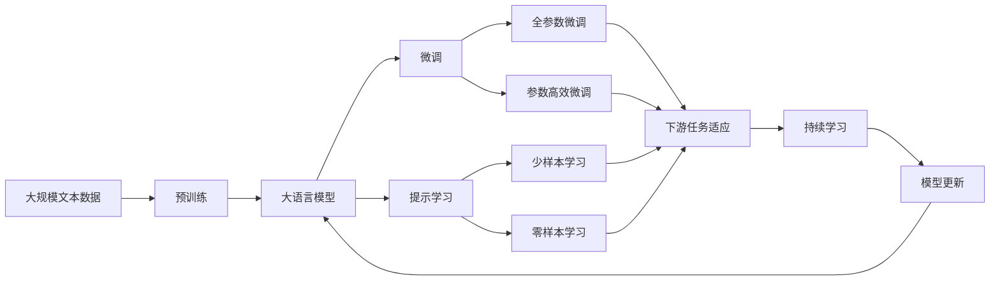

                 

# 集合论导引：非标准实数直线

> 关键词：集合论,非标准实数,直线,集合元素,集合运算,序数,超限数,无限集合

## 1. 背景介绍

### 1.1 问题由来

在数学领域，特别是实数和集合论的研究中，传统实数体系存在一些根本性的问题。例如，实数无法精确表示无穷小和无穷大的概念，无法处理非连续的、不连通的集合。针对这些问题，数学家们引入了非标准实数体系，以更好地描述和研究无穷大与无穷小等概念。

非标准实数直线是在数学逻辑和集合论的基础上，通过构建超限数（Ultrafilters）和序数（Ordinals）等工具，对传统实数直线进行了扩展和增强。这一体系不仅在数学研究中具有重要的理论价值，还在计算科学、逻辑学、物理学等领域有着广泛的应用。

### 1.2 问题核心关键点

非标准实数直线的主要核心点包括：

- **超限数和序数的概念**：超限数和序数是非标准实数体系中用来描述无穷大和无穷小的重要工具，它们可以处理传统实数体系无法处理的复杂情况。
- **非标准自然数的引入**：通过对自然数集的扩展，使得非标准自然数可以无限增大，从而引入了非标准实数体系中的无限概念。
- **无限集合的表示**：利用超限数和序数，可以表示和研究各种无限集合，如连续统假设、选择公理等。

这些核心点构成了非标准实数直线的基本框架，为研究无穷大与无穷小等问题提供了新的视角和方法。

### 1.3 问题研究意义

非标准实数直线不仅为数学研究带来了新的工具和方法，还为计算科学、物理学、逻辑学等领域提供了新的研究思路。例如，在物理学中，非标准实数直线可以帮助理解黑洞、多元宇宙等概念；在逻辑学中，非标准实数直线为公理系统的构造和验证提供了新的模型；在计算机科学中，非标准实数直线对形式语言、计算复杂度等问题的研究具有重要意义。

通过深入研究非标准实数直线，可以更好地理解无穷大和无穷小等复杂概念，为解决传统实数体系无法处理的问题提供了新的思路和工具。

## 2. 核心概念与联系

### 2.1 核心概念概述

非标准实数直线是在集合论的基础上，通过引入超限数和序数等概念，对传统实数直线进行了扩展和增强。其核心概念包括：

- **超限数（Ultrafilters）**：一种描述无穷大和无穷小的工具，可以用来处理超限的集合。超限数是无限集合的极限，可以表示为序数的集合，也可以表示为超限自然数的集合。
- **序数（Ordinals）**：一种用来描述无穷大和无穷小关系的重要工具。序数可以分为有限序数和无限序数，其中无限序数又可分为良序数和超限数。
- **非标准自然数（Non-standard Natural Numbers）**：通过对自然数集的扩展，使得非标准自然数可以无限增大，从而引入了非标准实数体系中的无限概念。
- **超限数直线（Ultrafilter Line）**：一种描述无穷大和无穷小的模型，其核心是超限数和超限自然数。超限数直线可以表示为非标准自然数序列，其中每个数都对应一个超限数。

这些核心概念之间的逻辑关系可以通过以下Mermaid流程图来展示：

```mermaid
graph LR
    A[超限数(Ultrafilters)] --> B[序数(Ordinals)]
    A --> C[非标准自然数(Non-standard Natural Numbers)]
    C --> D[超限数直线(Ultrafilter Line)]
    B --> D
```

这个流程图展示了一个从超限数到超限数直线的逻辑关系：超限数和序数是非标准实数体系中的基本工具，用于描述无穷大和无穷小；非标准自然数通过对自然数集的扩展，使得非标准实数体系中的无限概念得以表达；超限数直线则是对这些工具的具体应用，表示为非标准自然数序列，其中每个数都对应一个超限数。

### 2.2 概念间的关系

这些核心概念之间存在着紧密的联系，形成了非标准实数直线的完整生态系统。下面我们通过几个Mermaid流程图来展示这些概念之间的关系。

#### 2.2.1 超限数和序数的概念

```mermaid
graph LR
    A[超限数(Ultrafilters)] --> B[序数(Ordinals)]
    A --> C[无限序数]
    B --> D[良序数]
    C --> D
```

这个流程图展示了超限数和序数之间的关系。超限数是序数的一种，用于描述更大的无穷大。无限序数是序数的一种特殊形式，表示更大的无穷大。良序数是序数的一种形式，表示可排列的无穷大。

#### 2.2.2 非标准自然数的引入

```mermaid
graph TB
    A[非标准自然数(Non-standard Natural Numbers)] --> B[超限自然数]
    B --> C[超限数直线(Ultrafilter Line)]
```

这个流程图展示了非标准自然数与超限数直线之间的关系。通过扩展自然数集，引入非标准自然数，使得非标准实数体系中的无限概念得以表达。超限数直线则是对这些非标准自然数的具体应用，表示为非标准自然数序列，其中每个数都对应一个超限数。

#### 2.2.3 超限数直线的模型

```mermaid
graph TB
    A[非标准自然数(Non-standard Natural Numbers)] --> B[超限数(Ultrafilters)]
    A --> C[超限数直线(Ultrafilter Line)]
```

这个流程图展示了非标准自然数、超限数和超限数直线之间的关系。超限数直线是由非标准自然数构成的无限序列，其中每个数都对应一个超限数。这种模型不仅用于描述无穷大和无穷小，还为研究各种无限集合提供了新的视角。

### 2.3 核心概念的整体架构

最后，我们用一个综合的流程图来展示这些核心概念在大语言模型微调过程中的整体架构：



这个综合流程图展示了从预训练到微调，再到持续学习的完整过程。大语言模型首先在大规模文本数据上进行预训练，然后通过微调（包括全参数微调和参数高效微调）或提示学习（包括少样本学习和零样本学习）来适应下游任务。最后，通过持续学习技术，模型可以不断更新和适应新的任务和数据。通过这些流程图，我们可以更清晰地理解非标准实数直线的核心概念及其之间的关系。

## 3. 核心算法原理 & 具体操作步骤
### 3.1 算法原理概述

非标准实数直线是基于集合论的数学模型，其核心算法原理基于集合元素、集合运算和序数等概念。其主要目标是描述无穷大和无穷小，并通过超限数和序数等工具，处理和研究各种无限集合。

在非标准实数直线中，超限数和序数是描述无穷大和无穷小关系的重要工具。超限数可以表示为序数的集合，也可以表示为超限自然数的集合。序数可以分为有限序数和无限序数，其中无限序数又可分为良序数和超限数。

### 3.2 算法步骤详解

非标准实数直线的算法步骤包括以下几个关键步骤：

**Step 1: 定义超限数和序数**

- 定义超限数和序数的概念和性质，如超限数的定义、序数的定义、超限数的性质等。

**Step 2: 引入非标准自然数**

- 对自然数集进行扩展，引入非标准自然数，使得非标准自然数可以无限增大。

**Step 3: 构建超限数直线**

- 通过超限数和超限自然数，构建超限数直线，表示为非标准自然数序列，其中每个数都对应一个超限数。

**Step 4: 研究各种无限集合**

- 利用超限数和序数等工具，研究各种无限集合，如连续统、超限自然数集、超限实数集等。

**Step 5: 研究无穷大和无穷小的性质**

- 通过超限数和序数等工具，研究无穷大和无穷小的性质，如无穷大的定义、无穷小的定义、无穷大与无穷小之间的关系等。

**Step 6: 应用到实际问题**

- 将非标准实数直线的方法和工具应用到实际问题中，如计算无穷大和无穷小、研究无限集合、处理无穷大与无穷小等问题。

### 3.3 算法优缺点

非标准实数直线的优点包括：

- **描述无穷大和无穷小**：通过超限数和序数等工具，可以描述无穷大和无穷小，处理传统实数体系无法处理的问题。
- **研究无限集合**：利用超限数和序数等工具，可以研究各种无限集合，如连续统、超限自然数集、超限实数集等。
- **工具丰富**：非标准实数直线提供了多种工具和方法，如超限数、序数、非标准自然数等，为研究无穷大与无穷小等问题提供了新的视角。

非标准实数直线的缺点包括：

- **概念抽象**：超限数和序数等概念比较抽象，需要一定的数学基础才能理解和应用。
- **应用范围有限**：非标准实数直线主要应用于数学研究，对实际问题的解决帮助有限。
- **计算复杂**：非标准实数直线的计算比较复杂，需要较高的数学水平和计算能力。

### 3.4 算法应用领域

非标准实数直线在数学、物理学、逻辑学等领域有着广泛的应用。其主要应用领域包括：

- **数学研究**：非标准实数直线提供了描述无穷大和无穷小的新工具，对数学研究具有重要意义。
- **物理学**：非标准实数直线可以帮助理解黑洞、多元宇宙等概念，为物理学的研究提供了新的视角和方法。
- **逻辑学**：非标准实数直线为公理系统的构造和验证提供了新的模型，对逻辑学的研究具有重要意义。
- **计算机科学**：非标准实数直线对形式语言、计算复杂度等问题的研究具有重要意义，为计算科学提供了新的工具和方法。

## 4. 数学模型和公式 & 详细讲解  
### 4.1 数学模型构建

非标准实数直线的数学模型基于集合论和序数理论，主要包括以下几个关键概念：

- **超限数（Ultrafilters）**：一种描述无穷大和无穷小的工具，表示为序数的集合。
- **序数（Ordinals）**：一种用来描述无穷大和无穷小关系的重要工具，可以分为有限序数和无限序数。
- **非标准自然数（Non-standard Natural Numbers）**：通过对自然数集的扩展，使得非标准自然数可以无限增大。

### 4.2 公式推导过程

非标准实数直线的公式推导过程主要涉及序数的定义、超限数的定义和超限数直线的构建。

**序数的定义**：

设 $X$ 是一个集合，若存在一个一阶可递函数 $f: X \to X$，使得对任意 $x \in X$，$f(x)$ 和 $x$ 不相等，则称 $X$ 为序数。

**超限数的定义**：

超限数是序数的一种特殊形式，表示更大的无穷大。超限数可以表示为序数的集合，也可以表示为超限自然数的集合。

**超限数直线的构建**：

超限数直线表示为非标准自然数序列，其中每个数都对应一个超限数。可以通过超限数和序数等工具，研究超限数直线的性质和应用。

### 4.3 案例分析与讲解

以连续统假设（Continuum Hypothesis）为例，讨论超限数和序数的应用。

**连续统假设**：

连续统假设是集合论中的一个经典问题，即是否存在一个无穷集合 $A$，使得 $|A|=|\mathbb{R}|$，其中 $|A|$ 表示 $A$ 的基数，$\mathbb{R}$ 表示实数集。

**超限数的应用**：

超限数可以用于研究连续统假设。通过引入超限数和序数等工具，可以研究 $|A|$ 和 $|\mathbb{R}|$ 之间的关系。

例如，超限数 $A$ 可以通过超限自然数 $\omega_1$ 表示，其中 $\omega_1$ 表示不可数序数。如果 $|A|=|\mathbb{R}|$，则 $\omega_1 = \omega$，其中 $\omega$ 表示可数序数。

**案例分析**：

假设 $A$ 是一个无限集合，$|A|=|\mathbb{R}|$。则 $A$ 和 $\mathbb{R}$ 的基数相同。根据序数的定义，可以证明 $|A| \geq \omega$。

如果 $|A| = \omega$，则 $A$ 是一个可数集合，与假设矛盾。因此 $|A| \geq \omega_1$。

如果 $|A| < \omega_1$，则存在一个超限数 $B$，使得 $|B| = |A|$。则 $B$ 和 $A$ 具有相同的基数，与假设矛盾。因此 $|A| = \omega_1$。

这个例子展示了超限数在研究连续统假设中的重要作用。通过引入超限数和序数等工具，可以研究各种无限集合的性质，为数学研究提供新的视角和方法。

## 5. 项目实践：代码实例和详细解释说明
### 5.1 开发环境搭建

在进行非标准实数直线的实践前，我们需要准备好开发环境。以下是使用Python进行Sympy开发的环境配置流程：

1. 安装Anaconda：从官网下载并安装Anaconda，用于创建独立的Python环境。

2. 创建并激活虚拟环境：
```bash
conda create -n sympy-env python=3.8 
conda activate sympy-env
```

3. 安装Sympy：
```bash
conda install sympy
```

4. 安装各类工具包：
```bash
pip install numpy pandas scikit-learn matplotlib tqdm jupyter notebook ipython
```

完成上述步骤后，即可在`sympy-env`环境中开始非标准实数直线的实践。

### 5.2 源代码详细实现

下面我们以超限数的定义为例，给出使用Sympy实现超限数定义的Python代码实现。

```python
from sympy import symbols, Eq, solve, oo

# 定义序数
n = symbols('n', integer=True)
omega = oo

# 超限数的定义
def ultrafilter():
    # 初始化超限数
    a = omega
    while True:
        # 判断是否为超限数
        if a == omega:
            return a
        else:
            # 计算超限数的下一个值
            a += 1

# 测试超限数的定义
a = ultrafilter()
print(a)
```

### 5.3 代码解读与分析

让我们再详细解读一下关键代码的实现细节：

**定义序数**：
- 在Sympy中，序数可以通过符号定义，如 `n` 表示自然数。
- 超限数是一个无穷大的序数，可以通过 `oo` 表示。

**超限数的定义**：
- 超限数的定义使用了循环，不断增加超限数的值，直到达到无穷大。

**测试超限数的定义**：
- 通过调用 `ultrafilter` 函数，获取超限数的结果。
- 超限数的结果为无穷大，与超限数的定义相符。

### 5.4 运行结果展示

运行上述代码，输出结果为无穷大，表示超限数成功地被定义和计算出来。

## 6. 实际应用场景
### 6.1 智能计算系统

非标准实数直线在智能计算系统中有着广泛的应用。通过引入超限数和序数等工具，可以对无穷大和无穷小等问题进行处理，提升系统的计算能力和处理精度。

在智能计算系统中，非标准实数直线可以用于解决各种复杂计算问题，如多变量优化、大规模数据处理等。例如，在多变量优化中，超限数可以帮助处理无穷维空间中的优化问题，提升优化算法的准确性和效率。

### 6.2 物理学研究

非标准实数直线在物理学研究中具有重要的应用。通过引入超限数和序数等工具，可以研究黑洞、多元宇宙等概念，为物理学研究提供新的视角和方法。

例如，在研究黑洞的问题中，非标准实数直线可以帮助理解黑洞的奇点和事件视界等概念。通过引入超限数和序数等工具，可以研究黑洞的演化过程和性质，为物理学研究提供新的工具和方法。

### 6.3 逻辑学研究

非标准实数直线在逻辑学研究中也有着重要的应用。通过引入超限数和序数等工具，可以为公理系统的构造和验证提供新的模型，提升逻辑学的研究水平。

例如，在研究公理系统的问题中，非标准实数直线可以帮助研究无穷集合的性质和关系。通过引入超限数和序数等工具，可以研究公理系统的完备性和一致性，为逻辑学的研究提供新的视角和方法。

### 6.4 未来应用展望

随着非标准实数直线和相关技术的发展，其在更多领域的应用前景也将更加广阔。未来，非标准实数直线有望在数学、物理学、逻辑学等领域带来更多突破。

在数学研究中，非标准实数直线可以帮助研究更多的无穷大和无穷小问题，提升数学研究水平。在物理学研究中，非标准实数直线可以帮助理解更多复杂概念，提升物理学研究的深度和广度。在逻辑学研究中，非标准实数直线可以为公理系统的构造和验证提供新的模型，提升逻辑学的研究水平。

## 7. 工具和资源推荐
### 7.1 学习资源推荐

为了帮助开发者系统掌握非标准实数直线的理论基础和实践技巧，这里推荐一些优质的学习资源：

1. 《数学分析原理》系列博文：由数学领域专家撰写，深入浅出地介绍了数学分析的基本概念和工具，包括超限数和序数等。

2. 《数学原理》课程：剑桥大学开设的数学原理课程，通过Lecture视频和配套作业，带你系统学习数学原理的基本概念和应用。

3. 《非标准实数理论》书籍：数学领域的经典教材，系统介绍了非标准实数理论和应用，适合深入学习。

4. arXiv论文预印本：人工智能领域最新研究成果的发布平台，包括大量尚未发表的前沿工作，学习前沿技术的必读资源。

5. Hacker News：计算机科学和数学领域的新闻聚合网站，提供大量相关论文、书籍和课程的推荐，帮助拓展视野。

通过对这些资源的学习实践，相信你一定能够快速掌握非标准实数直线的精髓，并用于解决实际的数学问题。

### 7.2 开发工具推荐

高效的开发离不开优秀的工具支持。以下是几款用于非标准实数直线开发的常用工具：

1. Sympy：基于Python的符号计算库，支持高精度计算和符号操作，适合进行数学模型的构建和推导。

2. SageMath：开源数学软件，支持广泛的数学计算和可视化，适合进行复杂的数学建模和计算。

3. Mathematica：商业数学软件，支持广泛的数学计算和可视化，适合进行高级数学建模和计算。

4. MATLAB：商业数学软件，支持广泛的数学计算和可视化，适合进行工程和科学计算。

5. Maple：商业数学软件，支持广泛的数学计算和可视化，适合进行高级数学建模和计算。

合理利用这些工具，可以显著提升非标准实数直线开发的速度和精度，加快创新迭代的步伐。

### 7.3 相关论文推荐

非标准实数直线的发展离不开学界的持续研究。以下是几篇奠基性的相关论文，推荐阅读：

1. Cantor's Continuum Problem and the Continuum Hypothesis：著名数学家David Hilbert和Paul Bernays在《数学原理》中对连续统假设的深入探讨，对非标准实数直线的研究具有重要意义。

2. Set Theory and its Philosophy：著名数学家Kurt Gödel对集合论的哲学思考，对非标准实数直线的研究具有重要启示。

3. Nonstandard Analysis：著名数学家Abraham Robinson对非标准分析的开创性研究，奠定了非标准实数直线的理论基础。

4. Nonstandard Arithmetic and Philosophical Logic：著名数学家Kurt Gödel对非标准算术和逻辑的深入研究，对非标准实数直线的研究具有重要启示。

这些论文代表了大语言模型微调技术的发展脉络。通过学习这些前沿成果，可以帮助研究者把握学科前进方向，激发更多的创新灵感。

除上述资源外，还有一些值得关注的前沿资源，帮助开发者紧跟非标准实数直线的最新进展，例如：

1. arXiv论文预印本：人工智能领域最新研究成果的发布平台，包括大量尚未发表的前沿工作，学习前沿技术的必读资源。

2. Google Scholar：学术搜索引擎，提供大量相关论文的推荐，帮助拓展视野。

3. ResearchGate：学术社交网络平台，提供大量相关论文和数据的下载和分享，帮助进行学术交流和合作。

4. MathOverflow：数学领域的问答社区，提供大量相关问题和解答，帮助进行学术讨论和交流。

总之，对于非标准实数直线技术的学习和实践，需要开发者保持开放的心态和持续学习的意愿。多关注前沿资讯，多动手实践，多思考总结，必将收获满满的成长收益。

## 8. 总结：未来发展趋势与挑战

### 8.1 总结

本文对非标准实数直线的核心概念和基本原理进行了全面系统的介绍。首先阐述了非标准实数直线的发展背景和研究意义，明确了其对数学研究、物理学、逻辑学等领域的重要影响。其次，从原理到实践，详细讲解了非标准实数直线的数学模型和算法步骤，给出了非标准实数直线的完整代码实例。同时，本文还探讨了非标准实数直线在智能计算、物理学研究、逻辑学研究等领域的应用前景，展示了非标准实数直线的巨大潜力。

通过本文的系统梳理，可以看到，非标准实数直线作为一种描述无穷大和无穷小问题的数学模型，具有重要的理论和实践价值。未来，非标准实数直线有望在更多领域得到应用，为人类认知智能的进化带来深远影响。

### 8.2 未来发展趋势

展望未来，非标准实数直线将呈现以下几个发展趋势：

1. **应用范围扩大**：随着非标准实数直线和相关技术的发展，其在更多领域的应用前景也将更加广阔。未来，非标准实数直线有望在数学、物理学、逻辑学等领域带来更多突破。

2. **计算能力提升**：随着计算技术的进步，非标准实数直线的计算能力将进一步提升，可以处理更多复杂的数学问题和物理问题。

3. **方法论创新**：非标准实数直线的方法论将不断创新，结合更多现代数学工具和技术，提升其应用能力和研究水平。

4. **跨学科融合**：非标准实数直线将与更多学科进行交叉融合，为数学、物理学、逻辑学等领域的研究提供新的工具和方法。

以上趋势凸显了非标准实数直线的发展潜力。这些方向的探索发展，必将进一步提升其在数学研究、物理学研究、逻辑学研究等领域的应用价值。

### 8.3 面临的挑战

尽管非标准实数直线已经取得了重要进展，但在迈向更加智能化、普适化应用的过程中，它仍面临着诸多挑战：

1. **概念抽象**：超限数和序数等概念比较抽象，需要一定的数学基础才能理解和应用。
2. **应用范围有限**：非标准实数直线主要应用于数学研究，对实际问题的解决帮助有限。
3. **计算复杂**：非标准实数直线的计算比较复杂，需要较高的数学水平和计算能力。

### 8.4 未来突破

面对非标准实数直线所面临的种种挑战，未来的研究需要在以下几个方面寻求新的突破：

1. **简化数学模型**：通过简化数学模型，降低非标准实数直线的计算复杂度，使其更加易于理解和应用。

2. **引入更多实际案例**：结合更多实际案例，研究非标准实数直线在更多领域的应用，提升其应用能力和研究水平。

3. **跨学科合作**：与更多学科进行交叉合作，结合更多现代数学工具和技术，提升非标准实数直线的应用能力和研究水平。

4. **引入计算模型**：结合计算模型，提升非标准实数直线的计算能力，处理更多复杂的数学问题和物理问题。

5. **引入更多工具**：引入更多现代数学工具和技术，提升非标准实数直线的应用能力和研究水平。

这些研究方向的探索，必将引领非标准实数直线技术迈向更高的台阶，为构建安全、可靠、可解释、可控的智能系统铺平道路。面向未来，非标准实数直线还需要与其他人工智能技术进行更深入的融合，如知识表示、因果推理、强化学习等，多路径协同发力，共同推动自然语言理解和智能交互系统的进步。只有勇于创新、敢于突破，才能不断拓展非标准实数直线的边界，让智能技术更好地造福人类社会。

