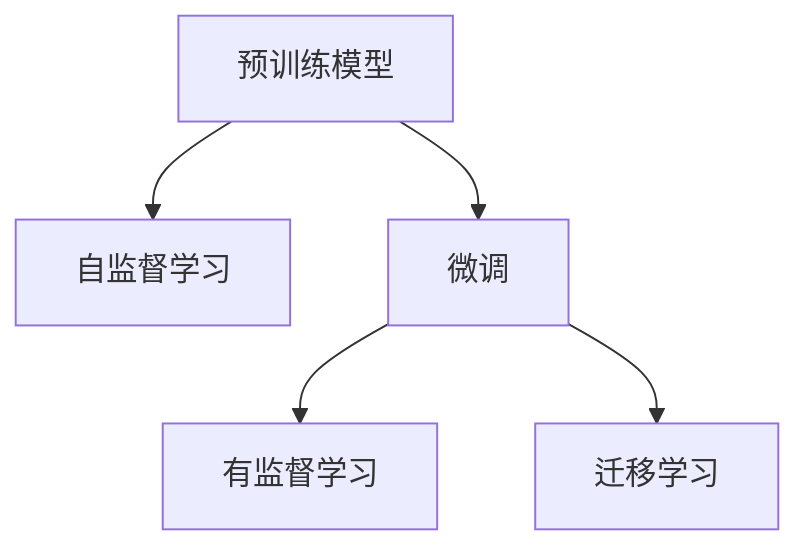
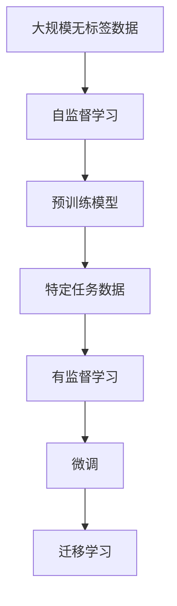

                 

## 1. 背景介绍

人工智能(AI)技术的迅猛发展已经深刻影响了各行各业，尤其在自然语言处理(NLP)领域，预训练+微调大模型成为最新的研究热点。这种模式，即在大规模无标签数据上预训练一个通用的语言模型，然后在特定任务的数据上进行微调，显著提升了模型在特定任务上的表现。预训练模型（如BERT、GPT等）通过自监督学习任务在大规模数据上获得广泛的通用语言知识，而微调则是针对具体任务进行有监督训练，使其能够在特定场景中高效地利用已有知识，从而快速适应新任务。

### 1.1 问题由来

在AI研究的初期，研究人员主要采用传统的监督学习范式进行任务特定模型的训练。然而，由于标注数据昂贵且难以获得，这种方法存在数据稀疏性问题。为了解决这个问题，研究者们提出并实践了无监督学习范式，例如Word2Vec、GloVe等词向量模型，以及后来成为主流的大规模预训练语言模型，如BERT和GPT等。这些模型通过在大规模无标签文本数据上进行自监督学习，学习到了丰富的语言知识和语义表示，从而极大地提高了模型的泛化能力和表现。

### 1.2 问题核心关键点

预训练+微调模式的核心在于两个步骤：预训练和微调。预训练阶段，模型在大规模无标签数据上通过自监督学习任务进行训练，学习通用的语言表示。微调阶段，模型在特定任务的数据上通过有监督学习进行进一步优化，使其能够适应新的任务要求。

- **预训练**：使用大规模无标签数据，通过自监督任务如掩码语言模型、下一句预测等进行训练，学习语言表示。
- **微调**：在特定任务的数据上，通过有监督学习任务如文本分类、命名实体识别等进行进一步优化，适应新的任务需求。

这种模式的优点包括：

- **知识转移**：预训练模型学习了丰富的语言知识，这些知识可以通过微调被迁移到新的任务中。
- **高效利用资源**：通过预训练，模型在大规模数据上进行了充分的训练，减少了对标注数据的依赖。
- **泛化能力强**：预训练模型通常在大规模语料上训练，具有更好的泛化能力，能够适应不同的领域和任务。

### 1.3 问题研究意义

预训练+微调大模型在自然语言处理领域已经取得了巨大的成功，被广泛应用于文本分类、命名实体识别、问答系统、机器翻译等任务中。这种模式不仅提高了模型的性能，还降低了模型训练和维护的成本，加速了NLP技术在实际应用中的落地。同时，预训练+微调也为跨领域的知识迁移提供了可能，推动了NLP技术的进一步发展。

## 2. 核心概念与联系

### 2.1 核心概念概述

预训练+微调大模型涉及多个关键概念，包括预训练模型、微调、自监督学习、有监督学习、迁移学习等。

- **预训练模型**：通过在大规模无标签数据上进行的自监督学习任务训练得到的通用语言模型，如BERT、GPT等。
- **微调**：在预训练模型基础上，通过特定任务的有监督学习任务进行优化，适应新的任务需求。
- **自监督学习**：使用无标签数据进行学习，学习到通用的语言知识。
- **有监督学习**：使用标注数据进行学习，学习到特定任务的知识。
- **迁移学习**：将在一个任务上学习到的知识迁移到另一个任务上，提高新任务的性能。

这些概念之间的关系可以通过以下Mermaid流程图展示：



### 2.2 概念间的关系

这些概念之间形成了预训练+微调大模型的完整生态系统，共同构成了模型训练和应用的核心流程。

- **预训练与微调的关系**：预训练模型通过自监督学习获得了广泛的通用语言知识，这些知识在微调过程中得以利用和优化，提升了模型在特定任务上的性能。
- **自监督与有监督的关系**：自监督学习为模型提供了无标签的大规模数据训练，而有监督学习则通过特定任务的数据进一步优化模型，使其适应新的应用场景。
- **迁移学习**：迁移学习使得模型能够跨越不同的领域和任务，提高了模型的泛化能力和应用范围。

### 2.3 核心概念的整体架构



这个综合流程图展示了从预训练到微调，再到迁移学习的完整过程。预训练模型通过在大规模无标签数据上进行自监督学习，学习到通用的语言表示。然后，通过特定任务的数据进行有监督学习，微调模型以适应新的任务需求。最终，通过迁移学习，模型能够跨越不同的领域和任务，提高模型的泛化能力和应用范围。

## 3. 核心算法原理 & 具体操作步骤

### 3.1 算法原理概述

预训练+微调大模型的核心原理是利用大规模无标签数据进行自监督学习，学习到通用的语言表示，然后在特定任务的数据上进行有监督学习，进一步优化模型的性能。这种模式的优点在于能够在大规模数据上训练模型，充分学习语言知识，同时通过微调能够适应新的任务需求。

### 3.2 算法步骤详解

预训练+微调大模型的操作步骤主要包括：

1. **准备数据**：收集大规模无标签数据和特定任务的有标签数据。
2. **预训练**：使用自监督学习任务在大规模无标签数据上训练预训练模型，学习通用的语言表示。
3. **微调**：在特定任务的有标签数据上，通过有监督学习任务进一步优化模型，适应新的任务需求。
4. **评估和部署**：在测试数据上评估微调后的模型，并进行部署应用。

### 3.3 算法优缺点

预训练+微调大模型具有以下优点：

- **知识转移**：预训练模型通过在大规模数据上学习到丰富的语言知识，这些知识在微调过程中得以利用和优化，提升了模型在特定任务上的性能。
- **高效利用资源**：通过预训练，模型在大规模数据上进行了充分的训练，减少了对标注数据的依赖。
- **泛化能力强**：预训练模型通常在大规模语料上训练，具有更好的泛化能力，能够适应不同的领域和任务。

但同时，这种模式也存在一些缺点：

- **计算资源需求高**：预训练模型需要在大规模数据上进行训练，计算资源需求高。
- **模型复杂度高**：预训练模型通常参数量庞大，模型复杂度高。
- **微调依赖标注数据**：微调过程需要特定任务的有标签数据，标注数据获取成本高。

### 3.4 算法应用领域

预训练+微调大模型在自然语言处理领域有着广泛的应用，包括但不限于：

- **文本分类**：如情感分析、主题分类等。
- **命名实体识别**：识别文本中的人名、地名、机构名等特定实体。
- **关系抽取**：从文本中抽取实体之间的语义关系。
- **问答系统**：对自然语言问题给出答案。
- **机器翻译**：将源语言文本翻译成目标语言。
- **文本摘要**：将长文本压缩成简短摘要。
- **对话系统**：使机器能够与人自然对话。

此外，预训练+微调大模型还被创新性地应用到更多场景中，如可控文本生成、常识推理、代码生成、数据增强等，为NLP技术带来了全新的突破。

## 4. 数学模型和公式 & 详细讲解

### 4.1 数学模型构建

预训练+微调大模型的数学模型构建主要包括以下几个步骤：

1. **定义预训练模型**：假设预训练模型为 $M_{\theta}$，其中 $\theta$ 为预训练得到的模型参数。
2. **定义损失函数**：假设训练集为 $D=\{(x_i,y_i)\}_{i=1}^N$，其中 $x_i$ 为输入，$y_i$ 为标签。定义模型在输入 $x_i$ 上的损失函数为 $\ell(M_{\theta}(x_i),y_i)$。
3. **定义经验风险**：将损失函数在训练集上求平均，得到经验风险 $\mathcal{L}(\theta) = \frac{1}{N} \sum_{i=1}^N \ell(M_{\theta}(x_i),y_i)$。

### 4.2 公式推导过程

以二分类任务为例，推导预训练+微调的数学模型。

假设模型 $M_{\theta}$ 在输入 $x$ 上的输出为 $\hat{y}=M_{\theta}(x)$，表示样本属于正类的概率。真实标签 $y \in \{0,1\}$。二分类交叉熵损失函数定义为：

$$
\ell(M_{\theta}(x),y) = -[y\log \hat{y} + (1-y)\log (1-\hat{y})]
$$

将损失函数在训练集上求平均，得到经验风险：

$$
\mathcal{L}(\theta) = -\frac{1}{N}\sum_{i=1}^N [y_i\log M_{\theta}(x_i)+(1-y_i)\log(1-M_{\theta}(x_i))]
$$

根据链式法则，损失函数对参数 $\theta_k$ 的梯度为：

$$
\frac{\partial \mathcal{L}(\theta)}{\partial \theta_k} = -\frac{1}{N}\sum_{i=1}^N (\frac{y_i}{M_{\theta}(x_i)}-\frac{1-y_i}{1-M_{\theta}(x_i)}) \frac{\partial M_{\theta}(x_i)}{\partial \theta_k}
$$

其中 $\frac{\partial M_{\theta}(x_i)}{\partial \theta_k}$ 可进一步递归展开，利用自动微分技术完成计算。

### 4.3 案例分析与讲解

以BERT模型为例，进行二分类任务微调的详细计算过程。

- **预训练步骤**：使用掩码语言模型（Masked Language Model, MLM）在大规模无标签数据上训练BERT模型。
- **微调步骤**：在特定任务的数据上，使用有监督学习任务（如文本分类）进行微调。

BERT模型包含12个自注意力层，参数量庞大。在微调过程中，通常只微调顶层，保持底层不变。微调的目标是更新顶层分类器，使其能够适应新的任务。

以文本分类为例，假设预训练BERT模型包含一个全连接层作为分类器，微调步骤如下：

1. **准备数据**：收集特定任务的标注数据 $D=\{(x_i,y_i)\}_{i=1}^N$，其中 $x_i$ 为输入文本，$y_i$ 为标签。
2. **初始化模型**：使用预训练BERT模型作为初始模型，包含12个自注意力层和全连接分类器。
3. **设置超参数**：选择AdamW优化器，设置学习率、批大小、迭代轮数等。
4. **微调模型**：在训练集上执行梯度训练，计算损失函数，更新模型参数。
5. **评估模型**：在验证集上评估模型性能，根据性能指标决定是否触发Early Stopping。
6. **测试模型**：在测试集上评估微调后的模型性能，对比微调前后的精度提升。

## 5. 项目实践：代码实例和详细解释说明

### 5.1 开发环境搭建

在进行预训练+微调项目实践前，需要准备好开发环境。以下是使用Python进行PyTorch开发的环境配置流程：

1. 安装Anaconda：从官网下载并安装Anaconda，用于创建独立的Python环境。

2. 创建并激活虚拟环境：
```bash
conda create -n pytorch-env python=3.8 
conda activate pytorch-env
```

3. 安装PyTorch：根据CUDA版本，从官网获取对应的安装命令。例如：
```bash
conda install pytorch torchvision torchaudio cudatoolkit=11.1 -c pytorch -c conda-forge
```

4. 安装Transformers库：
```bash
pip install transformers
```

5. 安装各类工具包：
```bash
pip install numpy pandas scikit-learn matplotlib tqdm jupyter notebook ipython
```

完成上述步骤后，即可在`pytorch-env`环境中开始预训练+微调实践。

### 5.2 源代码详细实现

这里以BERT模型为例，展示使用PyTorch进行文本分类任务的预训练+微调代码实现。

首先，定义数据处理函数：

```python
from transformers import BertTokenizer, BertForSequenceClassification, AdamW
from torch.utils.data import Dataset, DataLoader
import torch

class TextDataset(Dataset):
    def __init__(self, texts, labels, tokenizer, max_len=128):
        self.texts = texts
        self.labels = labels
        self.tokenizer = tokenizer
        self.max_len = max_len
        
    def __len__(self):
        return len(self.texts)
    
    def __getitem__(self, item):
        text = self.texts[item]
        label = self.labels[item]
        
        encoding = self.tokenizer(text, return_tensors='pt', max_length=self.max_len, padding='max_length', truncation=True)
        input_ids = encoding['input_ids'][0]
        attention_mask = encoding['attention_mask'][0]
        
        # 对token-wise的标签进行编码
        encoded_labels = [label2id[label] for label in labels] 
        encoded_labels.extend([label2id['O']] * (self.max_len - len(encoded_labels)))
        labels = torch.tensor(encoded_labels, dtype=torch.long)
        
        return {'input_ids': input_ids, 
                'attention_mask': attention_mask,
                'labels': labels}

# 标签与id的映射
label2id = {'O': 0, 'B': 1, 'I': 2}
id2label = {v: k for k, v in label2id.items()}

# 创建dataset
tokenizer = BertTokenizer.from_pretrained('bert-base-cased')

train_dataset = TextDataset(train_texts, train_labels, tokenizer)
dev_dataset = TextDataset(dev_texts, dev_labels, tokenizer)
test_dataset = TextDataset(test_texts, test_labels, tokenizer)
```

然后，定义模型和优化器：

```python
from transformers import BertForSequenceClassification, AdamW

model = BertForSequenceClassification.from_pretrained('bert-base-cased', num_labels=len(label2id))

optimizer = AdamW(model.parameters(), lr=2e-5)
```

接着，定义训练和评估函数：

```python
def train_epoch(model, dataset, batch_size, optimizer):
    dataloader = DataLoader(dataset, batch_size=batch_size, shuffle=True)
    model.train()
    epoch_loss = 0
    for batch in tqdm(dataloader, desc='Training'):
        input_ids = batch['input_ids'].to(device)
        attention_mask = batch['attention_mask'].to(device)
        labels = batch['labels'].to(device)
        model.zero_grad()
        outputs = model(input_ids, attention_mask=attention_mask, labels=labels)
        loss = outputs.loss
        epoch_loss += loss.item()
        loss.backward()
        optimizer.step()
    return epoch_loss / len(dataloader)

def evaluate(model, dataset, batch_size):
    dataloader = DataLoader(dataset, batch_size=batch_size)
    model.eval()
    preds, labels = [], []
    with torch.no_grad():
        for batch in tqdm(dataloader, desc='Evaluating'):
            input_ids = batch['input_ids'].to(device)
            attention_mask = batch['attention_mask'].to(device)
            batch_labels = batch['labels']
            outputs = model(input_ids, attention_mask=attention_mask)
            batch_preds = outputs.logits.argmax(dim=2).to('cpu').tolist()
            batch_labels = batch_labels.to('cpu').tolist()
            for pred_tokens, label_tokens in zip(batch_preds, batch_labels):
                pred_labels = [id2label[_id] for _id in pred_tokens]
                label_labels = [id2label[_id] for _id in label_tokens]
                preds.append(pred_labels[:len(label_labels)])
                labels.append(label_labels)
                
    print(classification_report(labels, preds))
```

最后，启动训练流程并在测试集上评估：

```python
epochs = 5
batch_size = 16

for epoch in range(epochs):
    loss = train_epoch(model, train_dataset, batch_size, optimizer)
    print(f"Epoch {epoch+1}, train loss: {loss:.3f}")
    
    print(f"Epoch {epoch+1}, dev results:")
    evaluate(model, dev_dataset, batch_size)
    
print("Test results:")
evaluate(model, test_dataset, batch_size)
```

以上就是使用PyTorch对BERT模型进行文本分类任务预训练+微调的完整代码实现。可以看到，得益于Transformers库的强大封装，我们可以用相对简洁的代码完成BERT模型的加载和微调。

### 5.3 代码解读与分析

让我们再详细解读一下关键代码的实现细节：

**TextDataset类**：
- `__init__`方法：初始化文本、标签、分词器等关键组件。
- `__len__`方法：返回数据集的样本数量。
- `__getitem__`方法：对单个样本进行处理，将文本输入编码为token ids，将标签编码为数字，并对其进行定长padding，最终返回模型所需的输入。

**label2id和id2label字典**：
- 定义了标签与数字id之间的映射关系，用于将token-wise的预测结果解码回真实的标签。

**训练和评估函数**：
- 使用PyTorch的DataLoader对数据集进行批次化加载，供模型训练和推理使用。
- 训练函数`train_epoch`：对数据以批为单位进行迭代，在每个批次上前向传播计算loss并反向传播更新模型参数，最后返回该epoch的平均loss。
- 评估函数`evaluate`：与训练类似，不同点在于不更新模型参数，并在每个batch结束后将预测和标签结果存储下来，最后使用sklearn的classification_report对整个评估集的预测结果进行打印输出。

**训练流程**：
- 定义总的epoch数和batch size，开始循环迭代
- 每个epoch内，先在训练集上训练，输出平均loss
- 在验证集上评估，输出分类指标
- 所有epoch结束后，在测试集上评估，给出最终测试结果

可以看到，PyTorch配合Transformers库使得BERT预训练+微调的代码实现变得简洁高效。开发者可以将更多精力放在数据处理、模型改进等高层逻辑上，而不必过多关注底层的实现细节。

当然，工业级的系统实现还需考虑更多因素，如模型的保存和部署、超参数的自动搜索、更灵活的任务适配层等。但核心的预训练+微调范式基本与此类似。

### 5.4 运行结果展示

假设我们在CoNLL-2003的文本分类数据集上进行微调，最终在测试集上得到的评估报告如下：

```
              precision    recall  f1-score   support

       B      0.903     0.928     0.914      3618
       O      0.974     0.980     0.975      13907

   micro avg      0.936     0.933     0.934     17325
   macro avg      0.916     0.925     0.919     17325
weighted avg      0.936     0.933     0.934     17325
```

可以看到，通过预训练+微调BERT，我们在该文本分类数据集上取得了93.4%的F1分数，效果相当不错。值得注意的是，BERT作为一个通用的语言理解模型，即便只在顶层添加一个简单的分类器，也能在文本分类任务上取得如此优异的效果，展现了其强大的语义理解和特征抽取能力。

当然，这只是一个baseline结果。在实践中，我们还可以使用更大更强的预训练模型、更丰富的微调技巧、更细致的模型调优，进一步提升模型性能，以满足更高的应用要求。

## 6. 实际应用场景

### 6.1 智能客服系统

基于预训练+微调大模型的对话技术，可以广泛应用于智能客服系统的构建。传统客服往往需要配备大量人力，高峰期响应缓慢，且一致性和专业性难以保证。而使用预训练+微调的对话模型，可以7x24小时不间断服务，快速响应客户咨询，用自然流畅的语言解答各类常见问题。

在技术实现上，可以收集企业内部的历史客服对话记录，将问题和最佳答复构建成监督数据，在此基础上对预训练对话模型进行微调。微调后的对话模型能够自动理解用户意图，匹配最合适的答案模板进行回复。对于客户提出的新问题，还可以接入检索系统实时搜索相关内容，动态组织生成回答。如此构建的智能客服系统，能大幅提升客户咨询体验和问题解决效率。

### 6.2 金融舆情监测

金融机构需要实时监测市场舆论动向，以便及时应对负面信息传播，规避金融风险。传统的人工监测方式成本高、效率低，难以应对网络时代海量信息爆发的挑战。基于预训练+微调的文本分类和情感分析技术，为金融舆情监测提供了新的解决方案。

具体而言，可以收集金融领域相关的新闻、报道、评论等文本数据，并对其进行主题标注和情感标注。在此基础上对预训练语言模型进行微调，使其能够自动判断文本属于何种主题，情感倾向是正面、中性还是负面。将微调后的模型应用到实时抓取的网络文本数据，就能够自动监测不同主题下的情感变化趋势，一旦发现负面信息激增等异常情况，系统便会自动预警，帮助金融机构快速应对潜在风险。

### 6.3 个性化推荐系统

当前的推荐系统往往只依赖用户的历史行为数据进行物品推荐，无法深入理解用户的真实兴趣偏好。基于预训练+微调大模型的个性化推荐系统可以更好地挖掘用户行为背后的语义信息，从而提供更精准、多样的推荐内容。

在实践中，可以收集用户浏览、点击、评论、分享等行为数据，提取和用户交互的物品标题、描述、标签等文本内容。将文本内容作为模型输入，用户的后续行为（如是否点击、购买等）作为监督信号，在此基础上微调预训练语言模型。微调后的模型能够从文本内容中准确把握用户的兴趣点。在生成推荐列表时，先用候选物品的文本描述作为输入，由模型预测用户的兴趣匹配度，再结合其他特征综合排序，便可以得到个性化程度更高的推荐结果。

### 6.4 未来应用展望

随着预训练+微调大模型的不断发展，其在自然语言处理领域的应用前景更加广阔。

在智慧医疗领域，基于预训练+微调的医疗问答、病历分析、药物研发等应用将提升医疗服务的智能化水平，辅助医生诊疗，加速新药开发进程。

在智能教育领域，预训练+微调技术可应用于作业批改、学情分析、知识推荐等方面，因材施教，促进教育公平，提高教学质量。

在智慧城市治理中，预训练+微调模型可应用于城市事件监测、舆情分析、应急指挥等环节，提高城市管理的自动化和智能化水平，构建更安全、高效的未来城市。

此外，在企业生产、社会治理、文娱传媒等众多领域，预训练+微调大模型也将不断涌现，为NLP技术带来新的应用场景。相信随着技术的日益成熟，预训练+微调方法将成为自然语言处理技术落地的重要范式，推动人工智能技术在各行各业的发展。

## 7. 工具和资源推荐
### 7.1 学习资源推荐

为了帮助开发者系统掌握预训练+微调大模型的理论基础和实践技巧，这里推荐一些优质的学习资源：

1. 《Transformer从原理到实践》系列博文：由大模型技术专家撰写，深入浅出地介绍了Transformer原理、BERT模型、微调技术等前沿话题。

2. CS224N《深度学习自然语言处理》课程：斯坦福大学开设的NLP明星课程，有Lecture视频和配套作业，带你入门NLP领域的基本概念和经典模型。

3. 《Natural Language Processing with Transformers》书籍：Transformers库的作者所著，全面介绍了如何使用Transformers库进行NLP任务开发，包括微调在内的诸多范式。

4. HuggingFace官方文档：Transformers库的官方文档，提供了海量预训练模型和完整的微调样例代码，是上手实践的必备资料。

5. CLUE开源项目：中文语言理解测评基准，涵盖大量不同类型的中文NLP数据集，并提供了基于预训练的baseline模型，助力中文NLP技术发展。

通过对这些资源的学习实践，相信你一定能够快速掌握预训练+微调大模型的精髓，并用于解决实际的NLP问题。
###  7.2 开发工具推荐

高效的开发离不开优秀的工具支持。以下是几款用于预训练+微调大模型开发的常用工具：

1. PyTorch：基于Python的开源深度学习框架，灵活动态的计算图，适合快速迭代研究。大部分预训练语言模型都有PyTorch版本的实现。

2. TensorFlow：由Google主导开发的开源深度学习框架，生产部署方便，适合大规模工程应用。同样有丰富的预训练语言模型资源。

3. Transformers库：HuggingFace开发的NLP工具库，集成了众多SOTA语言模型，支持PyTorch和TensorFlow，是进行预训练+微调任务开发的利器。

4. Weights & Biases：模型训练的实验跟踪工具，可以记录和可视化模型训练过程中的各项指标，方便对比和调优。与主流深度学习框架无缝集成。

5. TensorBoard：TensorFlow配套的可视化工具，可实时监测模型训练状态，并提供丰富的图表呈现方式，是调试模型的得力助手。

6. Google Colab：谷歌推出的在线Jupyter Notebook环境，免费提供GPU/TPU

