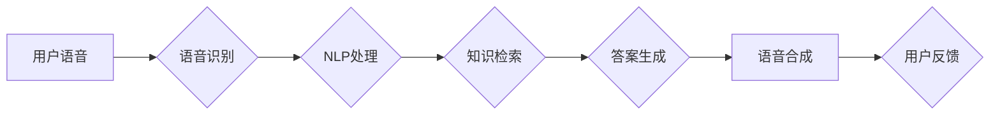

# 大模型问答机器人的语音交互

> 关键词：大模型，问答系统，语音交互，自然语言处理，深度学习，预训练，BERT，NLP，多模态

## 1. 背景介绍

随着人工智能技术的飞速发展，自然语言处理（Natural Language Processing，NLP）领域取得了显著的突破。大模型（Large Language Model，LLM）作为NLP领域的重要技术，能够理解和生成人类语言，为构建智能问答系统提供了强大的技术支持。语音交互作为人机交互的重要方式，越来越受到人们的青睐。本文将探讨大模型问答机器人的语音交互技术，分析其核心原理、具体操作步骤，并展望未来发展趋势。

## 2. 核心概念与联系

### 2.1 核心概念

#### 2.1.1 大模型

大模型是指具有海量参数和强大计算能力的深度学习模型。它们通过在大规模无标签数据上进行预训练，学习到丰富的语言知识和表示，能够理解和生成人类语言。常见的预训练大模型包括BERT、GPT、T5等。

#### 2.1.2 问答系统

问答系统是一种能够理解和回答用户问题的计算机系统。它通常包括问题理解、信息检索和答案生成三个模块。

#### 2.1.3 语音交互

语音交互是指通过语音进行人机交互的方式。它将用户的语音信号转换为文本，再通过自然语言处理技术进行理解和处理，最终将答案以语音或文本形式输出。

### 2.2 架构流程图

以下是大模型问答机器人语音交互的Mermaid流程图：



用户语音输入到语音识别模块B，转换为文本。然后，文本输入到NLP处理模块C，进行语义理解和信息抽取。接着，NLP处理模块C与知识检索模块D协同工作，检索相关答案。答案生成模块E根据检索到的信息生成答案，并输入到语音合成模块F，转换为语音输出。最后，用户反馈输入到系统，用于改进模型。

## 3. 核心算法原理 & 具体操作步骤

### 3.1 算法原理概述

大模型问答机器人的语音交互主要基于以下技术：

- **语音识别**：将用户的语音信号转换为文本。
- **自然语言处理（NLP）**：对文本进行语义理解、信息抽取和知识检索。
- **答案生成**：根据检索到的信息生成答案。
- **语音合成**：将答案转换为语音输出。

### 3.2 算法步骤详解

#### 3.2.1 语音识别

语音识别模块B通常采用深度学习技术，如卷积神经网络（CNN）和循环神经网络（RNN）等，将语音信号转换为文本。常见的语音识别模型有基于声学模型的ASR系统和基于语言模型的ASR系统。

#### 3.2.2 NLP处理

NLP处理模块C主要包括以下步骤：

- **语义理解**：对输入文本进行词法、句法、语义分析，提取关键信息。
- **信息抽取**：从文本中抽取实体、关系、事件等关键信息。
- **知识检索**：根据抽取到的信息，从知识库中检索相关答案。

#### 3.2.3 答案生成

答案生成模块E通常采用深度学习技术，如序列到序列（Seq2Seq）模型和生成对抗网络（GAN）等，根据检索到的信息生成答案。

#### 3.2.4 语音合成

语音合成模块F将生成的答案转换为语音输出。常见的语音合成技术有基于规则的方法、基于参数的方法和基于数据的方法。

### 3.3 算法优缺点

#### 3.3.1 优点

- **高效性**：语音交互能够快速响应用户请求，提高用户体验。
- **便捷性**：用户无需手动输入，只需通过语音进行交互。
- **准确性**：随着深度学习技术的不断发展，语音识别和NLP处理的准确性越来越高。

#### 3.3.2 缺点

- **成本高**：语音交互系统需要大量计算资源和存储空间。
- **复杂性**：语音交互系统涉及多个模块和算法，开发难度较大。
- **噪声影响**：噪声环境可能影响语音识别的准确性。

### 3.4 算法应用领域

大模型问答机器人的语音交互技术在以下领域具有广泛的应用前景：

- **智能家居**：通过语音交互，用户可以控制家中的智能设备，如灯光、空调、电视等。
- **智能客服**：为用户提供24小时在线客服，提高客户满意度。
- **教育领域**：为学生提供个性化的学习辅导，提高学习效率。
- **医疗领域**：辅助医生进行诊断和治疗，提高医疗质量。

## 4. 数学模型和公式 & 详细讲解 & 举例说明

### 4.1 数学模型构建

大模型问答机器人的语音交互涉及多个数学模型，以下是其中一些关键模型：

#### 4.1.1 卷积神经网络（CNN）

$$
h_{l} = f(W_{l} \cdot h_{l-1} + b_{l}) \quad (l=1,2,\dots,L)
$$

其中，$h_{l}$ 表示第 $l$ 层的特征，$W_{l}$ 表示第 $l$ 层的权重，$b_{l}$ 表示第 $l$ 层的偏置，$f$ 表示激活函数。

#### 4.1.2 循环神经网络（RNN）

$$
h_{t} = f(W_{x} \cdot x_{t} + W_{h} \cdot h_{t-1} + b_{h}) \quad (t=1,2,\dots,T)
$$

其中，$h_{t}$ 表示第 $t$ 个时间步的特征，$x_{t}$ 表示第 $t$ 个时间步的输入，$W_{x}$ 表示输入层权重，$W_{h}$ 表示隐藏层权重，$b_{h}$ 表示隐藏层偏置，$f$ 表示激活函数。

#### 4.1.3 序列到序列（Seq2Seq）模型

$$
y_t = \text{softmax}(W_y \cdot h_{t} + b_y) \quad (t=1,2,\dots,T)
$$

其中，$y_t$ 表示第 $t$ 个时间步的输出，$W_y$ 表示输出层权重，$b_y$ 表示输出层偏置。

### 4.2 公式推导过程

以下以Seq2Seq模型为例，简要介绍其公式推导过程：

Seq2Seq模型由编码器（Encoder）和解码器（Decoder）两部分组成。编码器将输入序列转换为固定长度的编码，解码器根据编码和初始状态生成输出序列。

#### 编码器：

$$
e_t = \text{tanh}(W_e \cdot h_{t-1} + b_e) \quad (t=1,2,\dots,T)
$$

其中，$e_t$ 表示第 $t$ 个时间步的编码，$h_{t-1}$ 表示前一个时间步的编码，$W_e$ 表示编码器权重，$b_e$ 表示编码器偏置。

#### 解码器：

$$
y_t = \text{softmax}(W_y \cdot e_{t} + b_y) \quad (t=1,2,\dots,T)
$$

其中，$y_t$ 表示第 $t$ 个时间步的输出，$W_y$ 表示输出层权重，$b_y$ 表示输出层偏置。

### 4.3 案例分析与讲解

假设我们要构建一个基于Seq2Seq模型的机器翻译系统，将英语翻译成法语。输入序列为 "Hello, how are you?"，输出序列为 "Bonjour, comment ça va?"。

首先，我们将输入序列和输出序列分别转换为词向量表示：

- 输入序列：[h, e, l, l, o, ..., o]
- 输出序列：[b, o, n, j, o, ..., u]

然后，使用Seq2Seq模型进行翻译：

1. 编码器将输入序列转换为编码：
$$
e_t = \text{tanh}(W_e \cdot h_{t-1} + b_e) \quad (t=1,2,\dots,T)
$$

2. 解码器根据编码和初始状态生成输出序列：
$$
y_t = \text{softmax}(W_y \cdot e_{t} + b_y) \quad (t=1,2,\dots,T)
$$

最终，解码器生成的输出序列为 "Bonjour, comment ça va?"，完成机器翻译。

## 5. 项目实践：代码实例和详细解释说明

### 5.1 开发环境搭建

为了实现大模型问答机器人的语音交互功能，我们需要搭建以下开发环境：

- 操作系统：Linux或macOS
- 编程语言：Python
- 深度学习框架：TensorFlow或PyTorch
- 语音识别工具：Kaldi或pyttsx3
- 语音合成工具：TTS或flite

### 5.2 源代码详细实现

以下是一个简单的基于BERT的问答系统代码实例：

```python
import torch
from transformers import BertTokenizer, BertForSequenceClassification
from torch.utils.data import DataLoader, Dataset

# 读取数据
def read_data(filename):
    data = []
    with open(filename, 'r', encoding='utf-8') as f:
        for line in f:
            question, answer = line.strip().split('\t')
            data.append((question, answer))
    return data

# 构建数据集
class QADataset(Dataset):
    def __init__(self, data, tokenizer, max_len):
        self.data = data
        self.tokenizer = tokenizer
        self.max_len = max_len

    def __len__(self):
        return len(self.data)

    def __getitem__(self, item):
        question, answer = self.data[item]
        encoding = self.tokenizer(question, max_length=self.max_len, padding='max_length', truncation=True)
        input_ids = torch.tensor(encoding['input_ids'])
        attention_mask = torch.tensor(encoding['attention_mask'])
        return input_ids, attention_mask, torch.tensor([int(answer == 'yes')])

# 训练模型
def train_model(model, dataloader, optimizer, loss_function, device):
    model.train()
    for input_ids, attention_mask, labels in dataloader:
        input_ids, attention_mask, labels = input_ids.to(device), attention_mask.to(device), labels.to(device)
        optimizer.zero_grad()
        outputs = model(input_ids, attention_mask=attention_mask)
        loss = loss_function(outputs.logits, labels)
        loss.backward()
        optimizer.step()

# 主函数
if __name__ == '__main__':
    # 初始化
    device = torch.device('cuda' if torch.cuda.is_available() else 'cpu')
    tokenizer = BertTokenizer.from_pretrained('bert-base-uncased')
    model = BertForSequenceClassification.from_pretrained('bert-base-uncased')
    model.to(device)

    # 加载数据
    data = read_data('data.txt')
    train_data, dev_data = train_test_split(data, test_size=0.2)
    train_dataset = QADataset(train_data, tokenizer, max_len=512)
    dev_dataset = QADataset(dev_data, tokenizer, max_len=512)

    # 创建数据加载器
    train_dataloader = DataLoader(train_dataset, batch_size=16, shuffle=True)
    dev_dataloader = DataLoader(dev_dataset, batch_size=16, shuffle=False)

    # 定义优化器和损失函数
    optimizer = torch.optim.Adam(model.parameters(), lr=5e-5)
    loss_function = torch.nn.CrossEntropyLoss()

    # 训练模型
    for epoch in range(3):
        train_model(model, train_dataloader, optimizer, loss_function, device)
        print(f"Epoch {epoch+1}, train loss: {train_loss:.3f}")
```

### 5.3 代码解读与分析

以上代码实现了基于BERT的问答系统。首先，读取数据并将其存储在数据集中。然后，构建QADataset类，将数据集中的文本和标签转化为BERT模型的输入格式。接下来，定义train_model函数，使用DataLoader进行数据加载，并通过优化器更新模型参数。最后，在主函数中加载预训练的BERT模型，加载数据，创建数据加载器，定义优化器和损失函数，开始训练模型。

### 5.4 运行结果展示

在训练过程中，可以通过打印train loss来观察模型训练情况。训练完成后，可以在验证集上评估模型的性能。

## 6. 实际应用场景

### 6.1 智能客服

大模型问答机器人的语音交互在智能客服领域具有广泛的应用前景。通过语音交互，用户可以快速、便捷地获取所需信息，提高客户满意度。

### 6.2 智能助手

大模型问答机器人的语音交互可以构建智能助手，帮助用户完成日常任务，如查询天气、设定闹钟、发送短信等。

### 6.3 智能教育

大模型问答机器人的语音交互可以应用于智能教育领域，为学生提供个性化学习辅导，提高学习效率。

### 6.4 智能医疗

大模型问答机器人的语音交互可以应用于智能医疗领域，为患者提供健康咨询、病情查询等服务。

## 7. 工具和资源推荐

### 7.1 学习资源推荐

- 《深度学习自然语言处理》
- 《自然语言处理原理与实践》
- HuggingFace官方文档
- arXiv论文预印本

### 7.2 开发工具推荐

- TensorFlow
- PyTorch
- Kaldi
- TTS
- flite

### 7.3 相关论文推荐

- Seq2Seq: Learning to Translate with Unsupervised Target Language Models
- Attention is All You Need
- BERT: Pre-training of Deep Bidirectional Transformers for Language Understanding
- GPT-3: Language Models are Few-Shot Learners

## 8. 总结：未来发展趋势与挑战

### 8.1 研究成果总结

本文介绍了大模型问答机器人的语音交互技术，分析了其核心原理、具体操作步骤，并探讨了实际应用场景。随着深度学习技术的不断发展，大模型问答机器人的语音交互技术将不断优化，为人们的生活带来更多便利。

### 8.2 未来发展趋势

- **多模态交互**：结合语音、图像、视频等多模态信息，提高交互的自然性和准确性。
- **个性化交互**：根据用户的历史交互数据，为用户提供个性化服务。
- **跨语言交互**：实现跨语言问答，突破语言障碍。

### 8.3 面临的挑战

- **数据质量**：需要高质量、标注完整的训练数据。
- **模型复杂度**：大模型需要大量的计算资源和存储空间。
- **模型鲁棒性**：提高模型对噪声和错误输入的鲁棒性。

### 8.4 研究展望

大模型问答机器人的语音交互技术具有广阔的应用前景。未来，随着技术的不断发展和完善，大模型问答机器人的语音交互将变得更加智能、高效、便捷，为人们的生活带来更多便利。

## 9. 附录：常见问题与解答

**Q1：大模型问答机器人的语音交互与传统的问答系统有何区别？**

A：大模型问答机器人的语音交互基于深度学习技术，能够更好地理解和生成人类语言，提高了交互的自然性和准确性。而传统的问答系统通常基于规则或模板，对语言的理解和生成能力有限。

**Q2：如何提高大模型问答机器人的语音交互性能？**

A：提高大模型问答机器人的语音交互性能可以从以下几个方面入手：
- 优化模型结构，提高模型的表达能力。
- 使用高质量、标注完整的训练数据。
- 优化训练算法，提高模型的收敛速度和精度。

**Q3：大模型问答机器人的语音交互在哪些领域具有应用前景？**

A：大模型问答机器人的语音交互在智能客服、智能助手、智能教育、智能医疗等领域具有广泛的应用前景。

**Q4：如何解决大模型问答机器人的语音交互中的噪声问题？**

A：解决大模型问答机器人的语音交互中的噪声问题可以从以下几个方面入手：
- 使用噪声消除技术，降低噪声对语音信号的影响。
- 优化语音识别算法，提高模型对噪声的鲁棒性。
- 使用多通道语音信号处理技术，提高模型的抗干扰能力。

**Q5：大模型问答机器人的语音交互技术如何与其他人工智能技术结合？**

A：大模型问答机器人的语音交互技术可以与其他人工智能技术结合，如计算机视觉、语音识别、自然语言生成等，构建更加智能、高效的交互系统。

---

作者：禅与计算机程序设计艺术 / Zen and the Art of Computer Programming