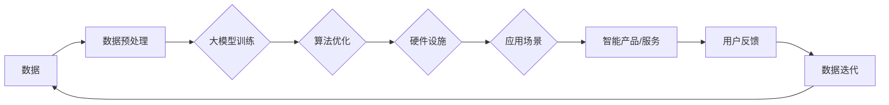

# 大模型：智能时代的商业新生态

> 关键词：大模型，人工智能，商业创新，智能生态，技术应用，未来展望

## 1. 背景介绍

随着人工智能技术的飞速发展，大模型（Large Models）已经成为推动产业变革的重要力量。大模型通过在庞大的数据集上进行训练，学会了复杂的模式识别和知识表示，从而在自然语言处理、计算机视觉、语音识别等领域取得了突破性的成果。本文将探讨大模型如何构建智能时代的商业新生态，分析其带来的机遇与挑战，并展望未来发展趋势。

## 2. 核心概念与联系

### 2.1 大模型原理与架构

大模型的核心是深度学习，它通过多层神经网络对数据进行学习，从而实现对复杂模式的识别和预测。以下是一个简化的Mermaid流程图，展示了大模型的基本原理和架构：


在这个流程中，输入数据首先经过预处理，提取特征并送入神经网络。通过多层隐藏层的非线性变换和激活函数，最终输出模型预测结果。

### 2.2 智能生态的构建

智能生态是指由大模型、算法、数据、硬件、应用场景等多个要素构成的复杂系统。以下是一个Mermaid流程图，展示了智能生态的构建过程：



在这个流程中，数据是智能生态的基础，通过数据预处理、大模型训练、算法优化、硬件设施建设、应用场景探索等环节，最终形成智能产品或服务，并收集用户反馈，不断迭代优化。

## 3. 核心算法原理 & 具体操作步骤

### 3.1 算法原理概述

大模型的算法原理主要基于深度学习和神经网络。深度学习是一种通过学习大量数据中的特征和模式来进行学习的方法。神经网络则是一种模拟人脑神经元连接的模型，通过层层提取特征，最终实现复杂模式识别。

### 3.2 算法步骤详解

大模型的算法步骤主要包括：

1. 数据收集：收集海量数据，包括文本、图像、语音等。
2. 数据预处理：对收集到的数据进行清洗、标注、规范化等处理。
3. 模型选择：选择合适的大模型架构，如Transformer、CNN等。
4. 模型训练：使用预处理后的数据进行模型训练，优化模型参数。
5. 模型评估：使用测试集评估模型性能，调整模型参数。
6. 模型部署：将训练好的模型部署到实际应用场景。

### 3.3 算法优缺点

大模型的优点包括：

- 强大的模式识别能力
- 普适性好，可应用于多个领域
- 随着数据量的增加，模型性能会逐渐提升

大模型的缺点包括：

- 计算资源消耗大
- 难以解释模型的决策过程
- 对数据质量要求高

### 3.4 算法应用领域

大模型在多个领域都有广泛应用，包括：

- 自然语言处理：机器翻译、文本摘要、情感分析等
- 计算机视觉：图像识别、目标检测、图像生成等
- 语音识别：语音转文字、语音合成等
- 机器人：人机交互、智能控制等

## 4. 数学模型和公式 & 详细讲解 & 举例说明

### 4.1 数学模型构建

大模型的数学模型主要基于深度学习和神经网络。以下是一个简化的神经网络数学模型：

$$
y = f(W \cdot x + b)
$$

其中，$y$ 为输出，$x$ 为输入，$W$ 为权重矩阵，$b$ 为偏置项，$f$ 为激活函数。

### 4.2 公式推导过程

神经网络通过多层非线性变换对数据进行学习，以下是一个简化的公式推导过程：

1. 输入层到第一层：

$$
h_1^{(1)} = f(W_1 \cdot x + b_1)
$$

2. 第一层到第二层：

$$
h_2^{(2)} = f(W_2 \cdot h_1^{(1)} + b_2)
$$

...

3. 最后一层到输出层：

$$
y = f(W_N \cdot h_{N-1}^{(N-1)} + b_N)
$$

### 4.3 案例分析与讲解

以自然语言处理中的机器翻译为例，我们可以使用Transformer模型进行翻译。Transformer模型通过编码器和解码器两个部分，将源语言和目标语言的文本序列转化为向量表示，并通过注意力机制进行翻译。

## 5. 项目实践：代码实例和详细解释说明

### 5.1 开发环境搭建

由于篇幅限制，这里不展开具体的开发环境搭建步骤。通常，开发者需要安装Python、TensorFlow或PyTorch等深度学习框架，以及相应的依赖库。

### 5.2 源代码详细实现

以下是一个简单的Transformer模型实现代码示例：

```python
import torch
import torch.nn as nn

class TransformerModel(nn.Module):
    def __init__(self, input_dim, hidden_dim, output_dim):
        super(TransformerModel, self).__init__()
        self.encoder = nn.TransformerEncoder(nn.TransformerEncoderLayer(d_model=input_dim, nhead=8), num_layers=6)
        self.decoder = nn.TransformerDecoder(nn.TransformerDecoderLayer(d_model=input_dim, nhead=8), num_layers=6)
        self.output_layer = nn.Linear(input_dim, output_dim)

    def forward(self, src, tgt):
        enc_output = self.encoder(src)
        dec_output = self.decoder(tgt, enc_output)
        output = self.output_layer(dec_output)
        return output
```

### 5.3 代码解读与分析

这段代码定义了一个简单的Transformer模型，包括编码器、解码器和输出层。编码器和解码器都使用了6个TransformerEncoderLayer和TransformerDecoderLayer，每个层都包含多头自注意力机制和前馈神经网络。输出层使用线性层将解码器的输出映射到目标语言的词汇表大小。

### 5.4 运行结果展示

由于篇幅限制，这里不展示具体的运行结果。在实际应用中，我们可以使用训练好的模型进行翻译任务，并观察其翻译效果。

## 6. 实际应用场景

大模型在多个领域都有广泛应用，以下是一些典型的应用场景：

- **智能客服**：通过自然语言处理技术，实现7x24小时不间断的客户服务，提高客户满意度。
- **智能推荐**：根据用户的兴趣和浏览历史，推荐个性化的商品、新闻、视频等，提升用户体验。
- **智能医疗**：利用图像识别技术辅助医生进行诊断，提高诊断效率和准确性。
- **智能金融**：通过分析用户行为数据，进行风险评估、欺诈检测等，保障金融安全。

## 7. 工具和资源推荐

### 7.1 学习资源推荐

- 《深度学习》
- 《深度学习入门：基于Python的理论与实现》
- 《Transformer：原理与实现》
- HuggingFace官网
- TensorFlow官网
- PyTorch官网

### 7.2 开发工具推荐

- Jupyter Notebook
- PyCharm
- Visual Studio Code
- TensorFlow
- PyTorch

### 7.3 相关论文推荐

- "Attention is All You Need"
- "BERT: Pre-training of Deep Bidirectional Transformers for Language Understanding"
- "Generative Adversarial Nets"
- "ImageNet Classification with Deep Convolutional Neural Networks"

## 8. 总结：未来发展趋势与挑战

### 8.1 研究成果总结

大模型作为人工智能领域的重要突破，已经在多个领域取得了显著的应用成果。未来，随着计算能力的提升、数据规模的扩大和算法的优化，大模型将在更多领域发挥重要作用。

### 8.2 未来发展趋势

- 大模型将向更小型、更轻量级的方向发展，以便更好地应用于移动设备和边缘计算场景。
- 大模型将与其他人工智能技术（如强化学习、知识图谱等）进行融合，构建更加智能的解决方案。
- 大模型将向多模态方向发展，实现文本、图像、语音等多种模态数据的融合处理。

### 8.3 面临的挑战

- 大模型的训练和推理对计算资源的需求巨大，需要解决计算资源的瓶颈。
- 大模型的决策过程难以解释，需要提高模型的可解释性和透明度。
- 大模型可能存在偏见和歧视，需要解决模型伦理和公平性问题。

### 8.4 研究展望

大模型作为人工智能领域的重要技术，将在未来发挥越来越重要的作用。未来，我们需要不断探索新的算法、技术和应用场景，推动大模型的发展，为人类社会创造更大的价值。

## 9. 附录：常见问题与解答

**Q1：大模型与机器学习有何区别？**

A：大模型是机器学习的一种，它通过学习大规模数据中的复杂模式，实现对任务的智能处理。与传统的机器学习模型相比，大模型具有更强的泛化能力和表达能力。

**Q2：大模型如何解决过拟合问题？**

A：大模型通常使用正则化技术、数据增强、Dropout等方法来缓解过拟合问题。

**Q3：大模型在哪些领域具有应用前景？**

A：大模型在自然语言处理、计算机视觉、语音识别、智能推荐、智能医疗、智能金融等多个领域具有广泛的应用前景。

**Q4：如何评估大模型的效果？**

A：评估大模型的效果通常使用交叉验证、准确率、召回率、F1分数等指标。

**Q5：大模型是否会取代传统的人工智能技术？**

A：大模型是人工智能领域的重要突破，但不会取代传统的人工智能技术。相反，大模型将与传统技术相互补充，共同推动人工智能技术的发展。

---

作者：禅与计算机程序设计艺术 / Zen and the Art of Computer Programming