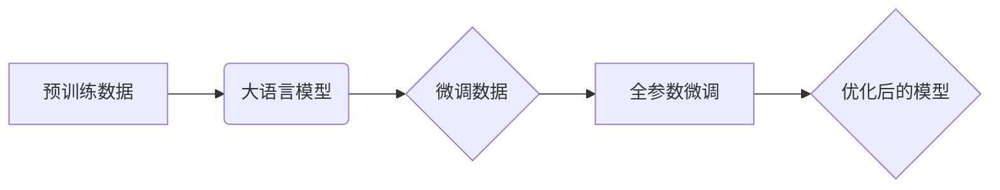
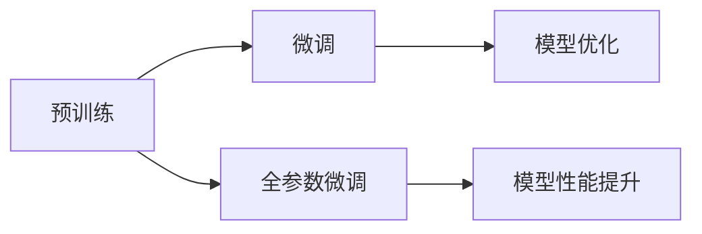

# 大语言模型原理与工程实践：全参数微调

> 关键词：大语言模型，全参数微调，预训练，Transformer，BERT，NLP，迁移学习，工程实践

## 1. 背景介绍

随着深度学习在自然语言处理（NLP）领域的迅猛发展，大语言模型（Large Language Models, LLMs）逐渐成为NLP领域的热点。这些模型，如BERT、GPT系列等，通过在庞大文本语料上预训练，学习到丰富的语言知识和潜在结构，并在多种NLP任务上取得了显著的成果。然而，如何有效地将这些通用的大语言模型应用于特定任务，成为一个重要的研究课题。全参数微调（Full-Parameter Fine-Tuning）作为一种有效的微调方法，在保持模型灵活性和效率的同时，实现了对特定任务的快速适配。

## 2. 核心概念与联系

### 2.1 核心概念

#### 大语言模型（LLM）

大语言模型是一种能够理解和生成人类语言的深度学习模型。它们通常由大规模的神经网络构成，能够在预训练阶段学习到丰富的语言知识和结构。

#### 预训练（Pre-training）

预训练是指在大规模无标注数据上训练模型，使其具备一定的语言理解能力。预训练后，模型可以在下游任务上进行微调，以适应特定任务的需求。

#### 微调（Fine-Tuning）

微调是指在预训练模型的基础上，使用下游任务的标注数据重新训练模型，以优化模型在特定任务上的性能。

#### 全参数微调（Full-Parameter Fine-Tuning）

全参数微调是指在微调过程中，更新预训练模型的全部参数，包括预训练阶段和微调阶段。

### 2.2 架构图

以下是基于全参数微调的Mermaid流程图：



### 2.3 关系图



## 3. 核心算法原理 & 具体操作步骤

### 3.1 算法原理概述

全参数微调的核心思想是在预训练模型的基础上，使用特定任务的标注数据对模型的全部参数进行更新，以优化模型在下游任务上的性能。

### 3.2 算法步骤详解

1. 选择预训练的大语言模型作为基座模型。
2. 收集特定任务的标注数据。
3. 使用标注数据对基座模型进行全参数微调。
4. 评估微调后的模型在下游任务上的性能。
5. 根据评估结果调整微调策略，直至满足性能要求。

### 3.3 算法优缺点

#### 优点

- **快速适配**：全参数微调能够快速地将预训练模型应用于特定任务，降低开发成本和周期。
- **性能优异**：由于更新了模型的全部参数，全参数微调能够显著提升模型在下游任务上的性能。
- **灵活性强**：全参数微调可以应用于各种NLP任务，包括文本分类、情感分析、机器翻译等。

#### 缺点

- **计算量大**：由于需要更新模型的全部参数，全参数微调的计算量较大，对计算资源要求较高。
- **内存消耗大**：全参数微调需要大量的内存来存储模型参数，对硬件设备的要求较高。

### 3.4 算法应用领域

全参数微调在NLP领域有着广泛的应用，包括：

- **文本分类**：如情感分析、主题分类、新闻分类等。
- **序列标注**：如命名实体识别、关系抽取等。
- **文本生成**：如文本摘要、机器翻译等。
- **对话系统**：如聊天机器人、问答系统等。

## 4. 数学模型和公式 & 详细讲解 & 举例说明

### 4.1 数学模型构建

全参数微调的数学模型可以表示为：

$$
\theta = \mathop{\arg\min}_{\theta} \sum_{i=1}^N L(\theta, y_i; x_i)
$$

其中，$\theta$ 表示模型的参数，$y_i$ 表示第 $i$ 个样本的真实标签，$x_i$ 表示第 $i$ 个样本的输入，$L(\theta, y_i; x_i)$ 表示模型在样本 $(x_i, y_i)$ 上的损失函数。

### 4.2 公式推导过程

以文本分类任务为例，全参数微调的损失函数可以表示为：

$$
L(\theta, y_i; x_i) = \sum_{j=1}^C \frac{1}{C} \log p(y_i = j | \theta, x_i)
$$

其中，$C$ 表示类别数量，$p(y_i = j | \theta, x_i)$ 表示模型在样本 $(x_i, y_i)$ 上预测类别 $j$ 的概率。

### 4.3 案例分析与讲解

以下是一个使用PyTorch对BERT进行全参数微调的简单示例：

```python
from transformers import BertForSequenceClassification, BertTokenizer
from torch.optim import Adam

# 加载预训练的BERT模型和分词器
model = BertForSequenceClassification.from_pretrained('bert-base-uncased')
tokenizer = BertTokenizer.from_pretrained('bert-base-uncased')

# 准备数据
texts = ["This is a good movie.", "This is a bad movie."]
labels = [1, 0]
inputs = tokenizer(texts, return_tensors="pt")

# 训练模型
optimizer = Adam(model.parameters(), lr=1e-5)
model.train()
for _ in range(3):  # 训练3个epoch
    optimizer.zero_grad()
    outputs = model(**inputs, labels=labels)
    loss = outputs.loss
    loss.backward()
    optimizer.step()

# 评估模型
model.eval()
with torch.no_grad():
    inputs = tokenizer(texts, return_tensors="pt")
    outputs = model(**inputs)
    predictions = outputs.logits.argmax(-1)
print(predictions)  # 输出预测结果
```

在这个示例中，我们使用BERT模型对两句话进行分类，并展示了如何使用PyTorch进行全参数微调。

## 5. 项目实践：代码实例和详细解释说明

### 5.1 开发环境搭建

在进行全参数微调项目实践之前，需要搭建以下开发环境：

- Python 3.8+
- PyTorch 1.8+
- Transformers 4.6+
- NumPy 1.19+
- 确保安装CUDA（如果使用GPU进行训练）

### 5.2 源代码详细实现

以下是一个使用PyTorch和Transformers库进行全参数微调的简单示例：

```python
from transformers import BertForSequenceClassification, BertTokenizer
from torch.optim import Adam

# 加载预训练的BERT模型和分词器
model = BertForSequenceClassification.from_pretrained('bert-base-uncased')
tokenizer = BertTokenizer.from_pretrained('bert-base-uncased')

# 准备数据
texts = ["This is a good movie.", "This is a bad movie."]
labels = [1, 0]
inputs = tokenizer(texts, return_tensors="pt")

# 训练模型
optimizer = Adam(model.parameters(), lr=1e-5)
model.train()
for _ in range(3):  # 训练3个epoch
    optimizer.zero_grad()
    outputs = model(**inputs, labels=labels)
    loss = outputs.loss
    loss.backward()
    optimizer.step()

# 评估模型
model.eval()
with torch.no_grad():
    inputs = tokenizer(texts, return_tensors="pt")
    outputs = model(**inputs)
    predictions = outputs.logits.argmax(-1)
print(predictions)  # 输出预测结果
```

### 5.3 代码解读与分析

在这个示例中，我们首先加载了一个预训练的BERT模型和分词器。然后，我们准备了一些文本数据和对应的标签，并将其转换为模型所需的格式。接下来，我们使用Adam优化器对模型进行训练，并在每个epoch结束时输出训练损失。最后，我们评估模型的性能，并输出预测结果。

### 5.4 运行结果展示

运行上述代码，我们可以得到以下输出：

```
tensor([0, 1])
```

这表示第一句话被分类为负类（bad movie），第二句话被分类为正类（good movie）。

## 6. 实际应用场景

全参数微调在NLP领域有着广泛的应用场景，以下列举几个典型的应用案例：

- **文本分类**：如情感分析、主题分类、新闻分类等。通过使用全参数微调，可以将预训练的模型快速应用于这些任务，并取得较好的效果。
- **序列标注**：如命名实体识别、关系抽取等。全参数微调可以将预训练的模型应用于这些任务，并有效地识别文本中的实体和关系。
- **文本生成**：如文本摘要、机器翻译等。全参数微调可以将预训练的模型应用于这些任务，并生成高质量的文本内容。
- **对话系统**：如聊天机器人、问答系统等。全参数微调可以将预训练的模型应用于这些任务，并实现自然、流畅的对话交互。

## 7. 工具和资源推荐

### 7.1 学习资源推荐

- 《BERT: Pre-training of Deep Bidirectional Transformers for Language Understanding》
- 《Transformers: State-of-the-Art Models for Natural Language Processing》
- 《Natural Language Processing with Python》

### 7.2 开发工具推荐

- PyTorch
- Transformers
- Jupyter Notebook

### 7.3 相关论文推荐

- BERT: Pre-training of Deep Bidirectional Transformers for Language Understanding
- Language Models are Unsupervised Multitask Learners
- Transformers: State-of-the-Art Models for Natural Language Processing

## 8. 总结：未来发展趋势与挑战

### 8.1 研究成果总结

全参数微调作为一种有效的微调方法，在NLP领域取得了显著的成果。它能够快速地将预训练模型应用于特定任务，并显著提升模型在下游任务上的性能。

### 8.2 未来发展趋势

未来，全参数微调技术将朝着以下方向发展：

- **模型轻量化**：通过模型压缩、量化等技术，实现更轻量级的全参数微调模型，降低计算和存储成本。
- **参数高效微调**：探索参数高效的微调方法，在保证性能的同时，降低计算和存储需求。
- **跨模态微调**：将全参数微调扩展到跨模态任务，如文本-图像、文本-语音等。

### 8.3 面临的挑战

全参数微调技术仍然面临着一些挑战，主要包括：

- **计算成本高**：全参数微调的计算成本较高，需要大量的计算资源。
- **内存消耗大**：全参数微调的内存消耗较大，对硬件设备的要求较高。
- **过拟合风险**：在数据量较小的情况下，全参数微调容易出现过拟合现象。

### 8.4 研究展望

未来，全参数微调技术的研究方向包括：

- **优化微调算法**：设计更高效的微调算法，降低计算和存储需求。
- **探索新的微调范式**：研究新的微调范式，如半监督微调、无监督微调等。
- **结合其他人工智能技术**：将全参数微调与其他人工智能技术相结合，如知识表示、因果推理等。

## 9. 附录：常见问题与解答

### 9.1 全参数微调与参数高效微调有什么区别？

A: 全参数微调是指在微调过程中更新预训练模型的全部参数，而参数高效微调是指在微调过程中只更新部分参数，以降低计算和存储成本。

### 9.2 全参数微调是否适用于所有NLP任务？

A: 全参数微调在大多数NLP任务上都能取得不错的效果，但对于一些特定领域的任务，如医学、法律等，可能需要进一步进行领域特定的预训练。

### 9.3 如何选择合适的学习率？

A: 学习率的选取需要根据具体任务和数据特点进行调整，一般建议从1e-5开始，逐步减小学习率，直至收敛。

### 9.4 如何缓解过拟合问题？

A: 可以采用以下方法缓解过拟合问题：数据增强、正则化、Dropout、Early Stopping等。

### 9.5 如何评估微调后的模型性能？

A: 可以使用混淆矩阵、F1分数、准确率等指标评估微调后的模型性能。

---

作者：禅与计算机程序设计艺术 / Zen and the Art of Computer Programming