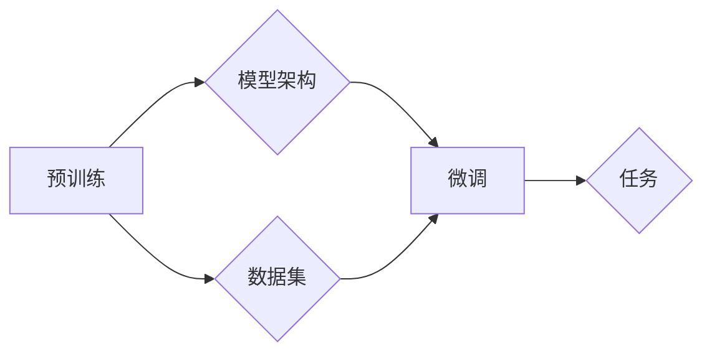

# 大语言模型应用指南：大语言模型的生态系统

> 关键词：大语言模型，生态系统，预训练，微调，应用场景，技术栈，工具，资源

## 1. 背景介绍

随着深度学习技术的飞速发展，大语言模型（Large Language Models，LLMs）已经成为自然语言处理（Natural Language Processing，NLP）领域的重要突破。这些模型通过在庞大的文本语料库上进行预训练，学会了丰富的语言知识和模式，能够在各种NLP任务上展现出惊人的性能。本文旨在为您提供一个全面的大语言模型应用指南，包括其生态系统中的关键概念、核心算法、实际应用场景以及未来发展趋势。

### 1.1 问题的由来

在传统的NLP任务中，如文本分类、命名实体识别、机器翻译等，研究者们通常需要手动设计特征工程和复杂的模型结构。这种方法的局限性在于其可解释性差、可迁移性低，且需要大量的标注数据。大语言模型的兴起，为解决这些问题提供了新的思路。

### 1.2 研究现状

目前，大语言模型的研究和应用主要集中在以下几个方面：

- **预训练**：在大量无标注文本上预训练模型，学习通用语言表示。
- **微调**：在少量标注数据上对预训练模型进行微调，使其适应特定任务。
- **应用**：将微调后的模型应用于各种NLP任务，如文本生成、问答系统、机器翻译等。

### 1.3 研究意义

大语言模型的研究和应用具有重要的意义：

- **降低开发成本**：通过预训练，可以减少对标注数据的需求，降低开发成本。
- **提升模型性能**：预训练模型能够在各种NLP任务上取得优异的性能。
- **促进技术发展**：大语言模型的研究推动了NLP技术的发展，并催生了新的研究方向。

## 2. 核心概念与联系

### 2.1 核心概念

- **预训练（Pre-training）**：在大量无标注文本上训练模型，学习通用语言表示。
- **微调（Fine-tuning）**：在少量标注数据上对预训练模型进行微调，使其适应特定任务。
- **模型架构（Model Architecture）**：如BERT、GPT、Transformer等。
- **数据集（Dataset）**：用于预训练和微调的数据集合。
- **任务（Task）**：如文本分类、命名实体识别、机器翻译等。

### 2.2 核心概念原理和架构的 Mermaid 流程图



## 3. 核心算法原理 & 具体操作步骤

### 3.1 算法原理概述

大语言模型的微调过程主要包括以下几个步骤：

1. 预训练：在大量无标注文本上训练模型，学习通用语言表示。
2. 数据准备：收集少量标注数据，并将其转换为模型可接受的格式。
3. 微调：在标注数据上对预训练模型进行微调，调整模型参数以适应特定任务。
4. 评估：在测试集上评估微调后模型的性能。
5. 部署：将微调后的模型部署到实际应用中。

### 3.2 算法步骤详解

1. **预训练**：选择合适的预训练模型架构和数据集，进行预训练过程。预训练过程通常包括以下步骤：

    - 数据预处理：将文本数据转换为模型可接受的格式，如分词、编码等。
    - 模型初始化：初始化预训练模型参数。
    - 训练过程：在无标注数据上迭代训练模型，优化模型参数。
    - 保存模型：在预训练过程中，定期保存模型参数。

2. **数据准备**：收集少量标注数据，并将其转换为模型可接受的格式。数据准备过程通常包括以下步骤：

    - 数据清洗：去除无效、重复或质量低下的数据。
    - 标注数据：对数据集进行标注，如文本分类、命名实体识别等。
    - 数据增强：通过数据增强技术扩充数据集，提高模型泛化能力。

3. **微调**：在标注数据上对预训练模型进行微调。微调过程通常包括以下步骤：

    - 模型加载：加载预训练模型参数。
    - 模型适配：根据特定任务调整模型结构，如添加新的层或修改损失函数。
    - 训练过程：在标注数据上迭代训练模型，优化模型参数。
    - 保存模型：在微调过程中，定期保存模型参数。

4. **评估**：在测试集上评估微调后模型的性能。评估过程通常包括以下步骤：

    - 数据加载：将测试数据转换为模型可接受的格式。
    - 模型推理：在测试数据上使用微调后模型进行推理。
    - 性能评估：计算模型的性能指标，如准确率、召回率、F1分数等。

5. **部署**：将微调后的模型部署到实际应用中。部署过程通常包括以下步骤：

    - 模型导出：将微调后模型参数导出为可部署的格式。
    - 部署环境：选择合适的部署环境，如云服务器、边缘设备等。
    - 服务搭建：搭建模型服务，提供API接口供应用程序调用。

### 3.3 算法优缺点

**优点**：

- **性能优异**：大语言模型在NLP任务上通常能够取得优异的性能。
- **可迁移性强**：预训练模型可以迁移到不同的任务，减少开发成本。
- **泛化能力强**：预训练模型能够学习到通用语言知识，提高模型泛化能力。

**缺点**：

- **计算量大**：预训练和微调过程需要大量的计算资源。
- **数据需求量大**：预训练和微调过程需要大量的数据。
- **可解释性差**：大语言模型的决策过程通常难以解释。

### 3.4 算法应用领域

大语言模型在以下NLP任务上具有广泛的应用：

- **文本分类**：如情感分析、主题分类、垃圾邮件检测等。
- **命名实体识别**：如人名识别、地点识别、组织机构识别等。
- **关系抽取**：如实体关系识别、事件抽取等。
- **机器翻译**：如英语到中文翻译、法语到德语翻译等。
- **文本生成**：如文本摘要、对话生成、诗歌创作等。
- **问答系统**：如自动问答、对话机器人等。

## 4. 数学模型和公式 & 详细讲解 & 举例说明

### 4.1 数学模型构建

大语言模型通常基于深度学习算法构建，如Transformer、BERT、GPT等。以下以BERT模型为例，介绍其数学模型。

**BERT模型**：

- **输入表示**：将文本输入转换为词向量表示。
- **Transformer编码器**：使用多层Transformer编码器对词向量进行编码。
- **输出层**：将编码后的词向量转换为任务所需的输出。

### 4.2 公式推导过程

BERT模型的公式推导过程涉及多个步骤，包括词嵌入、位置编码、多头注意力机制、前馈神经网络等。以下仅介绍部分关键公式：

- **词嵌入**：
  $$
  \text{word\_embedding}(W) = W \times \text{token\_ids}
  $$
  其中，$W$ 为词嵌入矩阵，$\text{token\_ids}$ 为文本的token ids。

- **位置编码**：
  $$
  \text{pos\_encoding}(P) = P \times \text{sin}(i/10000^{2j/d_{model}})
  $$
  $$
  \text{pos\_encoding}(P) = P \times \text{cos}(i/10000^{2j/d_{model}})
  $$
  其中，$P$ 为位置编码矩阵，$i$ 为位置索引，$j$ 为维度索引，$d_{model}$ 为模型维度。

- **多头注意力机制**：
  $$
  \text{Q} = \text{word\_embedding} \times W_Q
  $$
  $$
  \text{K} = \text{word\_embedding} \times W_K
  $$
  $$
  \text{V} = \text{word\_embedding} \times W_V
  $$
  $$
  \text{Attention}(Q, K, V) = \text{softmax}(\frac{QK^T}{\sqrt{d_k}})V
  $$

### 4.3 案例分析与讲解

以文本分类任务为例，介绍BERT模型的微调过程。

1. **数据准备**：收集文本数据和标签，如新闻文本和情感标签。
2. **模型加载**：加载预训练的BERT模型。
3. **模型适配**：在BERT模型的输出层添加分类器，如softmax层。
4. **训练**：在标注数据上微调模型。
5. **评估**：在测试集上评估模型性能。

## 5. 项目实践：代码实例和详细解释说明

### 5.1 开发环境搭建

以下是使用PyTorch和Transformers库进行BERT模型微调的开发环境搭建步骤：

1. 安装PyTorch：
   ```
   pip install torch torchvision torchaudio
   ```
2. 安装Transformers库：
   ```
   pip install transformers
   ```

### 5.2 源代码详细实现

以下是一个简单的BERT模型微调代码示例：

```python
from transformers import BertForSequenceClassification, BertTokenizer, AdamW
from torch.utils.data import DataLoader, Dataset

# 数据准备
class TextDataset(Dataset):
    def __init__(self, texts, labels):
        self.texts = texts
        self.labels = labels

    def __len__(self):
        return len(self.texts)

    def __getitem__(self, idx):
        return self.texts[idx], self.labels[idx]

# 模型加载
model = BertForSequenceClassification.from_pretrained('bert-base-uncased')
tokenizer = BertTokenizer.from_pretrained('bert-base-uncased')

# 训练
train_dataset = TextDataset(texts=train_texts, labels=train_labels)
dev_dataset = TextDataset(texts=dev_texts, labels=dev_labels)

train_loader = DataLoader(train_dataset, batch_size=16, shuffle=True)
dev_loader = DataLoader(dev_dataset, batch_size=16, shuffle=False)

optimizer = AdamW(model.parameters(), lr=2e-5)

for epoch in range(3):
    model.train()
    for batch in train_loader:
        inputs = tokenizer(batch[0], padding=True, truncation=True, return_tensors="pt")
        labels = torch.tensor(batch[1]).unsqueeze(0)
        outputs = model(**inputs, labels=labels)
        loss = outputs.loss
        loss.backward()
        optimizer.step()
        optimizer.zero_grad()

    model.eval()
    with torch.no_grad():
        for batch in dev_loader:
            inputs = tokenizer(batch[0], padding=True, truncation=True, return_tensors="pt")
            labels = torch.tensor(batch[1]).unsqueeze(0)
            outputs = model(**inputs, labels=labels)
            loss = outputs.loss.item()
```

### 5.3 代码解读与分析

以上代码展示了如何使用PyTorch和Transformers库对BERT模型进行微调。代码主要包括以下部分：

1. 数据准备：创建自定义数据集类，用于加载和处理文本数据和标签。
2. 模型加载：加载预训练的BERT模型和分词器。
3. 训练：使用训练数据和验证数据对模型进行训练。
4. 评估：在验证数据上评估模型性能。

### 5.4 运行结果展示

运行以上代码，您将在训练过程中看到损失函数的下降和验证集上的性能指标。

## 6. 实际应用场景

大语言模型在以下实际应用场景中具有广泛的应用：

### 6.1 智能客服

大语言模型可以应用于智能客服系统，自动回答用户提问，提供24小时在线服务。

### 6.2 文本摘要

大语言模型可以用于自动生成文本摘要，提高信息传递效率。

### 6.3 机器翻译

大语言模型可以应用于机器翻译，实现跨语言交流。

### 6.4 对话系统

大语言模型可以用于构建对话系统，如聊天机器人、智能助手等。

### 6.5 舆情分析

大语言模型可以用于舆情分析，监测网络舆情动态。

## 7. 工具和资源推荐

### 7.1 学习资源推荐

- **书籍**：
  - 《深度学习自然语言处理》
  - 《自然语言处理入门：基于Python的实现》
- **在线课程**：
  - Coursera上的NLP课程
  - fast.ai的NLP课程
- **博客**：
  - Hugging Face的Transformers库博客
  - Medium上的NLP博客

### 7.2 开发工具推荐

- **深度学习框架**：
  - PyTorch
  - TensorFlow
- **NLP工具库**：
  - Transformers
  - NLTK
- **文本预处理工具**：
  - spaCy
  - TextBlob

### 7.3 相关论文推荐

- **BERT**：
  - Devlin et al., 2019, "BERT: Pre-training of Deep Bidirectional Transformers for Language Understanding"
- **GPT-3**：
  - Brown et al., 2020, "Language Models are few-shot learners"
- **T5**：
  - Lewis et al., 2020, "T5: Text-to-Text Transfer Transformer"

## 8. 总结：未来发展趋势与挑战

### 8.1 研究成果总结

大语言模型在NLP领域取得了显著的研究成果，为各种NLP任务提供了强大的工具和平台。

### 8.2 未来发展趋势

- **模型规模将进一步扩大**：随着计算资源的不断增长，未来大语言模型的规模将进一步扩大，能够处理更复杂的任务。
- **模型可解释性将得到提高**：研究者将致力于提高大语言模型的可解释性，使其决策过程更加透明。
- **模型将更加轻量级**：为了在移动设备等资源受限的平台上部署模型，研究者将致力于开发更加轻量级的模型。

### 8.3 面临的挑战

- **计算资源消耗**：大语言模型的训练和推理过程需要大量的计算资源。
- **数据标注成本**：大规模数据集的标注需要大量的人力成本。
- **模型可解释性**：大语言模型的决策过程通常难以解释。

### 8.4 研究展望

未来，大语言模型将在NLP领域发挥更大的作用，推动NLP技术的进一步发展。

## 9. 附录：常见问题与解答

### 9.1 常见问题

1. 什么是预训练？
2. 什么是微调？
3. 如何选择预训练模型？
4. 如何选择微调任务？
5. 如何评估模型性能？

### 9.2 解答

1. **什么是预训练**？预训练是指在大量无标注文本上训练模型，学习通用语言表示。
2. **什么是微调**？微调是指在少量标注数据上对预训练模型进行微调，使其适应特定任务。
3. **如何选择预训练模型**？选择预训练模型时，需要考虑模型的性能、参数量、计算资源消耗等因素。
4. **如何选择微调任务**？选择微调任务时，需要考虑任务的特点、数据量、标注数据的质量等因素。
5. **如何评估模型性能**？评估模型性能通常使用准确率、召回率、F1分数等指标。

---

作者：禅与计算机程序设计艺术 / Zen and the Art of Computer Programming