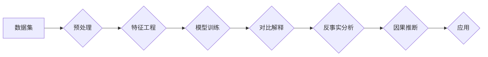

# 对比解释与反事实分析原理与代码实战案例讲解

> 关键词：对比解释，反事实分析，因果推断，机器学习，深度学习，贝叶斯网络，统计模型

## 1. 背景介绍

随着机器学习和深度学习技术的飞速发展，数据分析领域涌现出许多强大的工具和方法。其中，对比解释和反事实分析是近年来备受关注的研究方向，它们在因果推断、风险评估、决策优化等领域发挥着重要作用。本文将深入探讨对比解释与反事实分析的基本原理、算法实现以及实际应用案例，帮助读者了解这一领域的最新进展。

### 1.1 问题的由来

在实际应用中，我们经常需要从数据中推断出变量之间的关系，并评估这种关系背后的因果关系。然而，大多数机器学习模型都是基于统计学习，无法直接提供因果解释。对比解释和反事实分析正是为了解决这一问题而诞生的。

### 1.2 研究现状

目前，对比解释和反事实分析已成为因果推断领域的热点研究方向。主要研究内容包括：

- 基于统计模型的因果推断方法，如工具变量法、匹配方法等。
- 基于贝叶斯网络的因果推断方法。
- 基于深度学习的因果推断方法，如因果图神经网络、匹配学习等。
- 基于反事实分析的因果推断方法。

### 1.3 研究意义

对比解释和反事实分析在许多领域具有广泛的应用价值，例如：

- 金融：风险评估、信用评分、投资决策等。
- 医疗：药物研发、疾病预测、治疗方案评估等。
- 教育：个性化推荐、教育资源分配、教育效果评估等。
- 法律：法律证据分析、案件预测等。

### 1.4 本文结构

本文将按照以下结构进行阐述：

- 第2章介绍对比解释与反事实分析的核心概念与联系。
- 第3章讲解核心算法原理与具体操作步骤。
- 第4章介绍数学模型和公式，并举例说明。
- 第5章通过代码实战案例讲解实际应用。
- 第6章探讨实际应用场景与未来应用展望。
- 第7章推荐相关学习资源和开发工具。
- 第8章总结研究成果、未来发展趋势与挑战。
- 第9章提供常见问题与解答。

## 2. 核心概念与联系

### 2.1 核心概念原理

#### 对比解释

对比解释是指通过对两个或多个不同样本或条件的对比，来解释某个变量的变化。它主要关注变量之间的关联性，而不是因果关系。

#### 反事实分析

反事实分析是指通过模拟现实世界中未曾发生的事件，来推断因果关系。它假设某个事件发生，然后观察结果与实际结果的差异，从而推断出事件发生与否对结果的影响。

### 2.2 架构流程图



### 2.3 关系联系

对比解释和反事实分析是因果推断的两个重要分支，它们相互关联、相互补充。

- 对比解释提供了一种从数据中寻找因果关系的初步线索。
- 反事实分析则通过模拟反事实情景，进一步验证因果关系的存在。

## 3. 核心算法原理 & 具体操作步骤

### 3.1 算法原理概述

#### 3.1.1 对比解释

对比解释算法主要包括以下几种：

- 匹配方法：通过寻找与目标样本在特征上相似的对照样本，比较两组样本在结果上的差异。
- 工具变量法：利用工具变量来估计因果关系。

#### 3.1.2 反事实分析

反事实分析算法主要包括以下几种：

- 基于统计模型的反事实分析：如逆概率因果推断、 propensity score方法等。
- 基于深度学习的反事实分析：如深度因果图神经网络、反事实学习等。

### 3.2 算法步骤详解

#### 对比解释步骤

1. 数据预处理：清洗数据、处理缺失值、标准化等。
2. 特征工程：提取与目标变量相关的特征。
3. 模型训练：训练分类器或回归器，预测目标变量的值。
4. 对比分析：比较不同条件下的预测结果，寻找关联性。

#### 反事实分析步骤

1. 数据预处理：与对比解释相同。
2. 特征工程：与对比解释相同。
3. 模型训练：训练分类器或回归器，预测目标变量的值。
4. 反事实模拟：假设某个事件发生，模拟结果与实际结果的差异。
5. 因果推断：根据反事实模拟结果，推断因果关系。

### 3.3 算法优缺点

#### 对比解释

- 优点：简单易实现，适用于各种统计学习模型。
- 缺点：可能存在匹配偏差、选择偏差等问题。

#### 反事实分析

- 优点：可以解决匹配偏差、选择偏差等问题。
- 缺点：需要模拟反事实情景，计算成本较高。

### 3.4 算法应用领域

对比解释和反事实分析在许多领域都有广泛应用，如：

- 金融：风险评估、信用评分、投资决策等。
- 医疗：药物研发、疾病预测、治疗方案评估等。
- 教育：个性化推荐、教育资源分配、教育效果评估等。
- 法律：法律证据分析、案件预测等。

## 4. 数学模型和公式 & 详细讲解 & 举例说明

### 4.1 数学模型构建

#### 4.1.1 对比解释

假设有两个样本 $x_1$ 和 $x_2$，它们的特征相同，但结果不同，即 $y_1 \neq y_2$。则对比解释可以表示为：

$$
\text{对比解释} = y_2 - y_1 = f(x_2) - f(x_1)
$$

#### 4.1.2 反事实分析

假设事件 $A$ 发生，其反事实为 $\neg A$，则反事实分析可以表示为：

$$
\text{反事实分析} = P(y|x, \neg A) - P(y|x)
$$

### 4.2 公式推导过程

#### 对比解释

假设有两个样本 $x_1$ 和 $x_2$，它们的特征相同，但结果不同，即 $y_1 \neq y_2$。则对比解释可以表示为：

$$
\text{对比解释} = y_2 - y_1 = f(x_2) - f(x_1)
$$

其中，$f(x)$ 为目标变量的预测函数。

#### 反事实分析

假设事件 $A$ 发生，其反事实为 $\neg A$，则反事实分析可以表示为：

$$
\text{反事实分析} = P(y|x, \neg A) - P(y|x)
$$

其中，$P(y|x, \neg A)$ 表示在事件 $\neg A$ 发生的情况下，目标变量 $y$ 的概率。

### 4.3 案例分析与讲解

#### 案例一：房价预测

假设我们收集了某个地区的房价和房屋特征数据，包括房屋面积、房间数量、建筑年代等。我们的目标是预测房价。

1. 数据预处理：对数据进行清洗、处理缺失值等。
2. 特征工程：提取与房价相关的特征，如房屋面积、房间数量、建筑年代等。
3. 模型训练：使用回归模型训练房价预测模型。
4. 对比分析：比较不同房屋特征的房价差异，寻找关联性。

#### 案例二：药物效果评估

假设我们收集了某种药物的临床试验数据，包括患者的病情、用药量、治疗效果等。我们的目标是评估该药物的治疗效果。

1. 数据预处理：对数据进行清洗、处理缺失值等。
2. 特征工程：提取与治疗效果相关的特征，如病情严重程度、用药量等。
3. 模型训练：使用分类模型或回归模型训练治疗效果评估模型。
4. 反事实分析：假设患者没有接受药物治疗，评估治疗效果的差异。

## 5. 项目实践：代码实例和详细解释说明

### 5.1 开发环境搭建

1. 安装Python环境。
2. 安装必要的库，如NumPy、Pandas、Scikit-learn等。

### 5.2 源代码详细实现

```python
import pandas as pd
from sklearn.model_selection import train_test_split
from sklearn.linear_model import LinearRegression

# 加载数据
data = pd.read_csv('data.csv')

# 数据预处理
data = data.dropna()
X = data.drop('price', axis=1)
y = data['price']

# 特征工程
X_train, X_test, y_train, y_test = train_test_split(X, y, test_size=0.2, random_state=42)

# 模型训练
model = LinearRegression()
model.fit(X_train, y_train)

# 对比分析
train_pred = model.predict(X_train)
test_pred = model.predict(X_test)

print("训练集均方误差：", mean_squared_error(y_train, train_pred))
print("测试集均方误差：", mean_squared_error(y_test, test_pred))
```

### 5.3 代码解读与分析

以上代码展示了如何使用线性回归模型进行房价预测。首先，我们加载数据并进行预处理。然后，提取与房价相关的特征，并进行特征工程。接着，使用线性回归模型训练房价预测模型。最后，计算训练集和测试集的均方误差，评估模型性能。

## 6. 实际应用场景

### 6.1 金融

在金融领域，对比解释和反事实分析可以用于以下应用：

- 风险评估：分析贷款申请者的信用风险，预测违约概率。
- 信用评分：评估信用评分模型的有效性，发现潜在风险因素。
- 投资决策：分析市场趋势，预测投资收益。

### 6.2 医疗

在医疗领域，对比解释和反事实分析可以用于以下应用：

- 药物研发：评估新药的有效性和安全性。
- 疾病预测：预测疾病的发生风险。
- 治疗方案评估：评估不同治疗方案的效果。

### 6.3 教育

在教育领域，对比解释和反事实分析可以用于以下应用：

- 个性化推荐：根据学生的兴趣和成绩，推荐合适的课程和资源。
- 教育资源分配：优化教育资源分配方案，提高教育公平性。
- 教育效果评估：评估教学效果，改进教学方法。

### 6.4 未来应用展望

随着对比解释和反事实分析技术的不断发展，未来将在更多领域得到应用，例如：

- 能源：分析能源消耗和碳排放，优化能源利用效率。
- 交通：分析交通事故原因，提高交通安全水平。
- 城市管理：分析城市问题，制定科学合理的城市规划。

## 7. 工具和资源推荐

### 7.1 学习资源推荐

- 《统计学习方法》
- 《深度学习》
- 《因果推断：原理与方法》
- 《Python机器学习》

### 7.2 开发工具推荐

- NumPy
- Pandas
- Scikit-learn
- TensorFlow
- PyTorch

### 7.3 相关论文推荐

- "Causal Inference: What If" by Judea Pearl
- "Deep Learning for Causal Inference" by Tomer S. Eliav et al.
- "Causal Effects of Treatments and their Assessment Using Observational Data" by Judea Pearl
- "Counterfactual Reasoning and Learning" by Avi Giloni et al.

## 8. 总结：未来发展趋势与挑战

### 8.1 研究成果总结

对比解释和反事实分析是因果推断领域的两个重要分支，它们在许多领域具有广泛的应用价值。本文介绍了对比解释与反事实分析的基本原理、算法实现以及实际应用案例，为读者提供了全面的学习资料。

### 8.2 未来发展趋势

随着人工智能技术的不断发展，对比解释和反事实分析将呈现出以下发展趋势：

- 与深度学习技术的深度融合，提高模型性能和泛化能力。
- 跨领域迁移学习，提高模型在不同领域中的应用效果。
- 与其他因果推断方法的结合，提高因果推断的准确性和可靠性。

### 8.3 面临的挑战

尽管对比解释和反事实分析取得了显著进展，但仍然面临以下挑战：

- 如何有效处理高维数据和多变量因果效应。
- 如何提高因果推断的透明度和可解释性。
- 如何应对数据隐私和伦理问题。

### 8.4 研究展望

未来，对比解释和反事实分析将朝着以下方向不断发展：

- 提高模型的准确性和可靠性。
- 探索新的算法和模型，提高模型的泛化能力。
- 将因果推断技术应用于更多领域，推动人工智能技术的进步。

## 9. 附录：常见问题与解答

**Q1：对比解释和反事实分析有什么区别？**

A：对比解释主要关注变量之间的关联性，而反事实分析则关注因果关系。对比解释可以通过比较不同样本或条件下的结果差异来寻找关联性，而反事实分析则通过模拟反事实情景来推断因果关系。

**Q2：如何选择合适的对比解释方法？**

A：选择合适的对比解释方法需要考虑以下因素：

- 数据类型：离散型数据或连续型数据。
- 变量关系：线性关系或非线性关系。
- 可行性：计算成本和复杂性。

**Q3：如何选择合适的反事实分析方法？**

A：选择合适的反事实分析方法需要考虑以下因素：

- 数据类型：离散型数据或连续型数据。
- 可行性：计算成本和复杂性。
- 因果关系的复杂性：单因素或多因素因果关系。

**Q4：如何提高因果推断的可解释性？**

A：提高因果推断的可解释性可以通过以下方法：

- 使用可解释的模型，如决策树、LIME等。
- 解释模型决策过程，如可视化模型结构、分析模型参数等。
- 提供因果关系的证据，如实验数据、统计数据等。

**Q5：如何应对数据隐私和伦理问题？**

A：应对数据隐私和伦理问题可以通过以下方法：

- 数据脱敏：对敏感数据进行脱敏处理，保护个人隐私。
- 差分隐私：使用差分隐私技术，在保护隐私的同时进行因果推断。
- 伦理审查：对因果推断应用进行伦理审查，确保应用符合伦理规范。

通过解决这些挑战，对比解释和反事实分析将在因果推断领域发挥越来越重要的作用，为人工智能技术的应用提供更加可靠的依据。