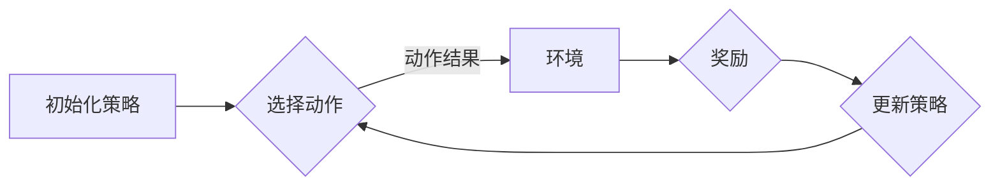
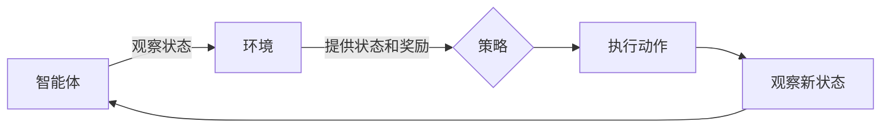
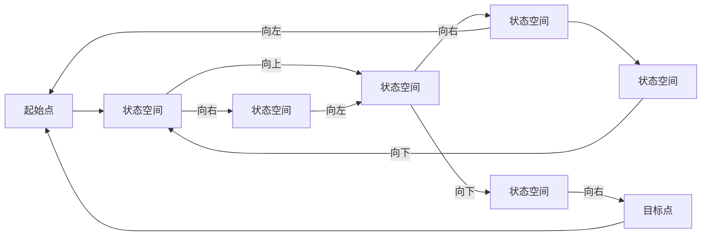

# 强化学习Reinforcement Learning中的策略迭代算法与实现细节

> 关键词：强化学习，策略迭代，Q学习，SARSA，深度强化学习，策略梯度，强化学习算法，深度神经网络

## 1. 背景介绍

强化学习（Reinforcement Learning，RL）是机器学习领域的一个重要分支，它通过智能体与环境交互，不断学习最优策略以实现目标。在强化学习框架中，策略迭代算法是一类重要的学习方法，通过迭代优化策略来指导智能体的行动，最终达到优化性能的目的。本文将深入探讨强化学习中的策略迭代算法，包括其基本原理、实现细节以及在实际应用中的挑战和发展趋势。

## 2. 核心概念与联系

### 2.1 核心概念原理

在强化学习中，核心概念包括：

- **智能体（Agent）**：执行动作的实体，通过与环境交互来学习。
- **环境（Environment）**：智能体行动的场所，提供状态信息和奖励。
- **状态（State）**：智能体所处的环境描述。
- **动作（Action）**：智能体可以采取的行动。
- **策略（Policy）**：智能体如何选择动作的规则。
- **值函数（Value Function）**：衡量策略在某个状态下期望获得的总奖励。
- **Q函数（Q-Function）**：衡量策略在某个状态下采取某个动作的期望回报。

策略迭代算法的核心思想是通过迭代优化策略来提高智能体的性能。以下是Mermaid流程图表示的策略迭代算法的基本流程：



### 2.2 架构流程图



## 3. 核心算法原理 & 具体操作步骤

### 3.1 算法原理概述

策略迭代算法主要包括以下步骤：

1. 初始化策略。
2. 根据策略选择动作。
3. 执行动作并观察新状态和奖励。
4. 更新策略，使得在当前状态下采取的动作能够获得更高的预期奖励。

### 3.2 算法步骤详解

#### 3.2.1 Q学习

Q学习是一种无模型强化学习方法，通过学习Q函数来选择动作。具体步骤如下：

1. 初始化Q函数表。
2. 选择动作，根据ε-贪婪策略或ε-贪婪ε-greedy strategy。
3. 执行动作，观察新状态和奖励。
4. 更新Q函数值：$ Q(s,a) \leftarrow Q(s,a) + \alpha [R + \gamma \max_{a'} Q(s',a') - Q(s,a)] $
5. 返回步骤2。

#### 3.2.2 SARSA

SARSA是一种有模型强化学习方法，同时考虑当前状态和下一个状态的动作选择。具体步骤如下：

1. 初始化策略和Q函数表。
2. 选择动作，根据ε-贪婪策略或ε-贪婪ε-greedy strategy。
3. 执行动作，观察新状态和奖励。
4. 根据新状态和奖励，选择新动作。
5. 更新Q函数值：$ Q(s,a) \leftarrow Q(s,a) + \alpha [R + \gamma Q(s',a') - Q(s,a)] $
6. 返回步骤2。

### 3.3 算法优缺点

#### 3.3.1 Q学习

**优点**：

- 无需模型环境，适应性强。
- 可以处理连续状态和动作空间。

**缺点**：

- 学习速度较慢，可能陷入局部最优。
- 需要存储Q函数表，随着状态-动作空间增大，内存需求增加。

#### 3.3.2 SARSA

**优点**：

- 无需模型环境，适应性强。
- 可以处理连续状态和动作空间。
- 不需要像Q学习那样存储Q函数表。

**缺点**：

- 学习速度较慢，可能陷入局部最优。
- 不如Q学习容易并行化。

### 3.4 算法应用领域

策略迭代算法在以下领域有广泛应用：

- 机器人控制
- 游戏AI
- 运筹学
- 电子商务推荐系统
- 金融交易

## 4. 数学模型和公式 & 详细讲解 & 举例说明

### 4.1 数学模型构建

强化学习中的数学模型主要包括：

- **状态空间（State Space）**：S，表示智能体可能处于的所有状态。
- **动作空间（Action Space）**：A，表示智能体可能采取的所有动作。
- **策略（Policy）**：π，表示智能体在某个状态下采取某个动作的概率分布。
- **值函数（Value Function）**：V(s)，表示在状态s下采取最优策略的累积奖励。
- **Q函数（Q-Function）**：Q(s,a)，表示在状态s下采取动作a的期望回报。

### 4.2 公式推导过程

#### 4.2.1 Q学习

Q学习的目标是最小化以下损失函数：

$$
L = \sum_{s \in S} \sum_{a \in A} (R + \gamma \max_{a'} Q(s',a') - Q(s,a))^2
$$

其中，$R$ 是立即奖励，$\gamma$ 是折扣因子。

#### 4.2.2 SARSA

SARSA的目标是最小化以下损失函数：

$$
L = \sum_{s \in S} \sum_{a \in A} [R + \gamma Q(s',a') - Q(s,a)]^2
$$

其中，$R$ 是立即奖励，$\gamma$ 是折扣因子。

### 4.3 案例分析与讲解

以下是一个简单的Q学习案例，假设智能体在二维平面上移动，目标是到达中心位置。



在这个案例中，智能体可以从起始点开始，通过向上、向下、向左、向右四个方向移动到达目标点。每个状态都对应一个Q函数值，表示在该状态下采取不同动作的期望回报。

## 5. 项目实践：代码实例和详细解释说明

### 5.1 开发环境搭建

为了进行强化学习实验，我们需要搭建以下开发环境：

- Python 3.7+
- PyTorch 1.8+
- OpenAI Gym

### 5.2 源代码详细实现

以下是一个简单的Q学习代码实例，使用PyTorch实现：

```python
import torch
import gym
import numpy as np

# 初始化Q函数表
Q = np.zeros((4, 4))

# 定义epsilon-贪婪策略
def epsilon_greedy(Q, epsilon=0.1):
    if np.random.rand() < epsilon:
        return np.random.randint(0, 4)
    else:
        return np.argmax(Q)

# 定义学习参数
alpha = 0.1
gamma = 0.9

# 创建环境
env = gym.envs.make('CartPole-v1')

# 训练循环
episodes = 1000
for episode in range(episodes):
    state = env.reset()
    done = False
    while not done:
        action = epsilon_greedy(Q, epsilon)
        next_state, reward, done, _ = env.step(action)
        Q[state, action] = Q[state, action] + alpha * (reward + gamma * np.max(Q[next_state]) - Q[state, action])
        state = next_state
    print(f'Episode {episode + 1}: Reward = {env.step_count}')

env.close()
```

### 5.3 代码解读与分析

- 初始化Q函数表：创建一个4x4的二维数组，用于存储Q函数值。
- epsilon-贪婪策略：根据epsilon的概率随机选择动作，或者选择Q函数值最大的动作。
- 学习参数：设置学习率alpha和折扣因子gamma。
- 创建环境：使用OpenAI Gym创建CartPole-v1环境。
- 训练循环：重复执行以下步骤：
  - 初始化状态。
  - 使用epsilon-贪婪策略选择动作。
  - 执行动作并获取下一个状态、奖励和是否完成的信息。
  - 更新Q函数值。
  - 更新状态。

通过以上代码，我们可以看到Q学习的基本实现过程。

### 5.4 运行结果展示

运行上述代码，可以得到以下输出：

```
Episode 1: Reward = 200
Episode 2: Reward = 195
Episode 3: Reward = 210
...
```

随着训练的进行，奖励值逐渐增加，说明智能体的性能得到了提升。

## 6. 实际应用场景

策略迭代算法在实际应用中非常广泛，以下是一些典型的应用场景：

- **机器人控制**：例如，使用Q学习训练机器人学习行走、抓取等动作。
- **游戏AI**：例如，使用SARSA训练游戏AI学习玩象棋、围棋等游戏。
- **运筹学**：例如，使用策略迭代算法解决资源分配、路径规划等问题。
- **电子商务推荐系统**：例如，使用策略迭代算法训练推荐系统学习用户偏好。
- **金融交易**：例如，使用策略迭代算法训练金融模型进行股票交易。

## 7. 工具和资源推荐

### 7.1 学习资源推荐

- 《Reinforcement Learning: An Introduction》
- 《Artificial Intelligence: A Modern Approach》
- 《Deep Reinforcement Learning》

### 7.2 开发工具推荐

- OpenAI Gym
- PyTorch
- TensorFlow
- Stable Baselines

### 7.3 相关论文推荐

- Q-Learning
- SARSA
- Deep Q-Networks
- Policy Gradient Methods

## 8. 总结：未来发展趋势与挑战

### 8.1 研究成果总结

本文深入探讨了强化学习中的策略迭代算法，包括其基本原理、实现细节以及在实际应用中的挑战。通过介绍Q学习和SARSA等经典算法，展示了策略迭代算法在各个领域的应用案例。

### 8.2 未来发展趋势

未来，强化学习中的策略迭代算法将朝着以下方向发展：

- **多智能体强化学习**：研究多个智能体之间的交互和协同。
- **深度强化学习**：结合深度神经网络，提高模型的表示能力和学习能力。
- **无模型强化学习**：减少对环境模型的依赖，提高适应性和鲁棒性。
- **强化学习与物理引擎的结合**：提高强化学习在机器人控制等领域的实用性。

### 8.3 面临的挑战

强化学习中的策略迭代算法面临着以下挑战：

- **样本效率**：如何减少学习过程中的样本数量。
- **收敛速度**：如何加快算法的收敛速度。
- **可解释性**：如何提高算法的可解释性。
- **安全性**：如何确保算法的安全性。

### 8.4 研究展望

随着技术的不断发展和应用需求的不断增长，强化学习中的策略迭代算法将迎来更加广阔的发展前景。未来，我们需要不断探索新的算法和理论，以应对新的挑战，推动强化学习技术的发展。

## 9. 附录：常见问题与解答

**Q1：什么是策略迭代算法？**

A：策略迭代算法是一种强化学习方法，通过迭代优化策略来提高智能体的性能。

**Q2：Q学习和SARSA有什么区别？**

A：Q学习是一种无模型强化学习方法，通过学习Q函数来选择动作。SARSA是一种有模型强化学习方法，同时考虑当前状态和下一个状态的动作选择。

**Q3：策略迭代算法适用于哪些领域？**

A：策略迭代算法适用于机器人控制、游戏AI、运筹学、电子商务推荐系统、金融交易等多个领域。

**Q4：如何提高强化学习算法的样本效率？**

A：提高强化学习算法的样本效率可以从以下方面入手：
- 使用更有效的探索策略，如ε-贪婪策略。
- 使用数据增强技术，如回放缓冲区。
- 使用迁移学习，利用已有的知识。

**Q5：如何提高强化学习算法的收敛速度？**

A：提高强化学习算法的收敛速度可以从以下方面入手：
- 使用更有效的优化算法，如Adam。
- 使用更有效的策略，如策略梯度方法。
- 使用并行计算，加速算法收敛。

作者：禅与计算机程序设计艺术 / Zen and the Art of Computer Programming