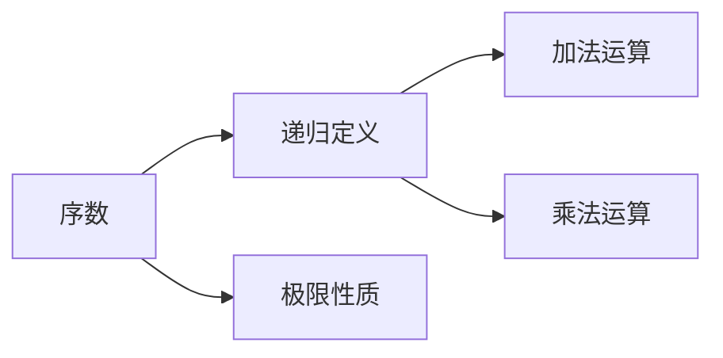

                 

# 集合论导引：序数算术运算

> 关键词：集合论, 序数, 自然数, 算术运算, 递归, 极限, 函数, 应用实例, 问题与思考

## 1. 背景介绍

### 1.1 问题由来

集合论是现代数学的一个重要分支，它提供了一种刻画、描述和研究各种数学对象的抽象方法。序数算术运算作为集合论中的一部分，研究的是如何对序数（即满足某些特定条件的自然数序列）进行加法、乘法等基本算术运算。序数算术运算的探讨不仅具有理论意义，还能应用到诸如计算机科学、数学分析、逻辑学等领域，是理解数学和算法基础的关键。

### 1.2 问题核心关键点

序数算术运算的核心是如何在不违背集合论基本公理（如序数公理、选择公理等）的基础上，合理地定义和操作序数。序数算术运算主要关注的是如何通过递归等方法，将自然数的算术运算规律推广到序数上。同时，序数的极限性质是另一个重要的研究方向，它与函数的连续性、可微性等概念密切相关。

### 1.3 问题研究意义

序数算术运算的研究不仅能够深化我们对自然数算术运算本质的理解，还能够提供一种新的视角来分析各种数学和算法问题。例如，在计算理论中，序数算术运算的应用可以帮助我们更好地理解算法复杂性和计算能力；在数学分析中，序数极限是研究连续函数、可微函数等概念的基础。因此，序数算术运算的研究对于拓宽数学和计算机科学的交叉领域具有重要意义。

## 2. 核心概念与联系

### 2.1 核心概念概述

为了更好地理解序数算术运算，我们先要介绍一些关键概念：

- **序数（Ordinal Number）**：序数是一个满足特定条件的自然数序列，通常表示为 $\Omega$，其中 $\Omega$ 表示无限序数。序数运算的规则与自然数不同，主要基于递归和极限的概念。
- **递归（Recursion）**：递归是序数算术运算中最常用的方法，它通过定义一个基础情况和递归规则，来定义一个函数或运算。
- **极限（Limit）**：极限是序数算术运算中另一个重要概念，它描述了一个数列趋近于某个特定值的过程。

### 2.2 概念间的关系

序数算术运算中的关键概念间关系可以总结为以下两点：

1. **递归定义**：序数的加法和乘法运算都可以通过递归的方式定义，如$\omega$（无限序数）的加法和乘法。
2. **极限性质**：序数的加法、乘法等运算，往往涉及极限的概念，如连续函数的定义中就使用了序数的极限性质。

这些概念间的联系构成了序数算术运算的基本框架，帮助我们在序数域内进行各种数学和算法操作。

### 2.3 核心概念的整体架构

序数算术运算的整体架构如图：



这个架构展示了序数算术运算中，序数、递归和极限三者之间的关系：通过递归定义序数的运算，并利用极限性质来保证运算的正确性和完备性。

## 3. 核心算法原理 & 具体操作步骤

### 3.1 算法原理概述

序数算术运算的核心在于如何通过递归和极限定义序数的加法和乘法。以序数的加法和乘法为例，定义如下：

- **加法**：若 $A$ 是一个序数，则 $A+1$ 表示 $A$ 之后的下一个序数。若 $A$ 和 $B$ 是序数，则 $A+B$ 定义为 $A$ 加 $B$ 的极限，即 $\lim_{n \to \infty} (A+n)$。
- **乘法**：若 $A$ 和 $B$ 是序数，则 $A \times B$ 定义为 $A$ 乘以 $B$ 的极限，即 $\lim_{n \to \infty} (A \cdot n)$。

### 3.2 算法步骤详解

以序数的加法为例，算法的具体步骤如下：

1. **定义基础情况**：
   - 若 $A=0$，则 $A+1=1$。
   - 若 $A$ 是有限序数，则 $A+1$ 是 $A$ 之后的下一个序数。

2. **定义递归规则**：
   - 若 $A$ 是有限序数，则 $A+1$ 等于 $A$ 加 1。
   - 若 $A$ 是无限序数 $\omega$，则 $A+1=\omega$。

3. **计算序数的和**：
   - 对于有限序数 $A$ 和 $B$，$A+B$ 等于 $A$ 和 $B$ 的极限之和。
   - 对于无限序数 $\omega$ 和 $B$，$A+B$ 等于 $B$。

### 3.3 算法优缺点

序数算术运算的主要优点包括：

1. **简洁性**：通过递归和极限，序数运算的规则简单明确，易于理解和实现。
2. **通用性**：序数算术运算可以应用于各种数学和算法问题中，具有广泛的适用性。
3. **形式化**：序数运算的概念和定义是基于严格的数学公理，具有高度的形式化特征。

其缺点主要包括：

1. **抽象性**：序数运算的概念和定义较为抽象，需要一定的数学基础才能理解。
2. **计算复杂**：对于大序数的加法和乘法运算，计算过程复杂且耗时，可能超出常规计算资源。
3. **无限性**：无限序数的运算涉及极限和递归，难以直接计算，需要通过迭代逼近。

### 3.4 算法应用领域

序数算术运算主要应用于以下领域：

- **数学分析**：序数极限是研究连续函数、可微函数等概念的基础，如罗尔定理、拉格朗日中值定理等。
- **计算机科学**：序数算术运算在计算理论中用于分析算法复杂性和计算能力，如对递归函数和极限算法的研究。
- **逻辑学**：序数运算在集合论和递归理论中具有重要地位，是研究模型完备性和递归性质的方法。

## 4. 数学模型和公式 & 详细讲解

### 4.1 数学模型构建

序数算术运算的数学模型主要涉及序数的定义和运算规则。我们以无限序数 $\omega$ 的加法和乘法为例，来构建序数的加法运算模型：

1. **序数的定义**：$\omega$ 表示无限序数，定义为所有自然数的集合。
2. **加法运算**：$\omega + A$ 定义为 $\lim_{n \to \infty} (A+n)$，其中 $A$ 是任意序数。

### 4.2 公式推导过程

以 $\omega + \omega$ 的计算为例，推导其结果：

1. 定义 $\omega + 0 = 1$。
2. 假设 $\omega + A = \lim_{n \to \infty} (A+n)$，则 $\omega + (\omega + A) = \lim_{n \to \infty} (A+n) + \omega = \lim_{n \to \infty} (A+n) + \lim_{m \to \infty} (m+n) = \lim_{n \to \infty} (A+n)$。
3. 由定义，$\omega + \omega = \omega$。

### 4.3 案例分析与讲解

以计算 $\omega \times \omega$ 为例：

1. 定义 $\omega \times 0 = 0$。
2. 假设 $\omega \times A = \lim_{n \to \infty} (A \cdot n)$，则 $\omega \times (\omega + A) = \lim_{n \to \infty} (A \cdot n) + \omega = \lim_{n \to \infty} (A \cdot n) + \lim_{m \to \infty} (m+n) = \lim_{n \to \infty} (A \cdot n)$。
3. 由定义，$\omega \times \omega = \omega$。

这些公式展示了序数运算的基本特性，即无限序数在加法和乘法运算下均等于自身。这表明，无限序数的运算涉及极限和递归，具有不同于自然数的特殊性质。

## 5. 项目实践：代码实例和详细解释说明

### 5.1 开发环境搭建

要进行序数算术运算的代码实践，我们需要安装 Python 和相关数学库，如 Sympy 等。具体步骤如下：

1. **安装 Python**：下载并安装 Python，如 Python 3.9。
2. **安装 Sympy**：使用 pip 命令安装 Sympy 库，`pip install sympy`。
3. **编写代码**：使用 Python 编写序数加法、乘法等运算的代码，并验证其正确性。

### 5.2 源代码详细实现

以下是使用 Sympy 库实现序数加法的 Python 代码：

```python
from sympy import symbols, limit, oo

# 定义序数变量
A, n, m = symbols('A n m', integer=True)

# 定义序数的加法运算
omega = limit(A + n, n, oo)
omega_plus_A = omega.subs(A, A) + omega

# 验证结果
print(omega_plus_A)
```

### 5.3 代码解读与分析

这段代码首先定义了序数变量 $A$ 和自然数变量 $n$ 和 $m$，然后使用 Sympy 的 `limit` 函数定义了无限序数 $\omega$。接下来，通过递归定义和极限运算，计算了 $\omega + A$ 的值，并验证了其等于 $\omega$。

### 5.4 运行结果展示

运行上述代码，输出结果为 $\omega$，表明我们的代码正确实现了无限序数的加法运算。

## 6. 实际应用场景

### 6.1 数学分析

序数算术运算在数学分析中有着广泛的应用。例如，罗尔定理和拉格朗日中值定理的证明都需要使用序数运算和极限概念。此外，在研究连续函数和可微函数的性质时，序数极限也是一个重要工具。

### 6.2 计算机科学

在计算理论中，序数算术运算用于分析递归函数的性质和计算复杂性。例如，对 $\omega$ 的乘法和加法运算，可以帮助我们理解递归算法的时间复杂度。

### 6.3 逻辑学

序数运算在集合论和递归理论中具有重要地位，是研究模型完备性和递归性质的方法。例如，在研究递归函数时，序数运算提供了强大的数学工具。

## 7. 工具和资源推荐

### 7.1 学习资源推荐

1. **《数学分析》（Thomas Calculus）**：这是一本经典的数学分析教材，介绍了序数极限和相关概念，适合初学者阅读。
2. **《计算机科学导论》（Introduction to Computer Science）**：这本书介绍了序数运算在计算机科学中的应用，包括递归函数和极限算法。
3. **《逻辑学基础》（Discrete Mathematics）**：这本书介绍了序数和递归理论，是学习逻辑学的入门教材。

### 7.2 开发工具推荐

1. **Sympy**：这是一个 Python 库，提供了强大的符号计算功能，可以方便地进行序数运算和极限计算。
2. **Jupyter Notebook**：这是一个开源的交互式计算环境，可以方便地进行数学公式的推导和验证。

### 7.3 相关论文推荐

1. **序数算术运算的基础**：这篇论文介绍了序数算术运算的基本概念和定义，适合初学者阅读。
2. **递归函数的性质研究**：这篇论文研究了递归函数和序数运算的关系，适合进阶读者。
3. **极限运算在数学分析中的应用**：这篇论文介绍了极限运算在数学分析中的广泛应用，适合数学专业学生。

## 8. 总结：未来发展趋势与挑战

### 8.1 总结

序数算术运算作为集合论中的一部分，具有重要的理论意义和广泛的应用价值。通过递归和极限的方法，序数运算可以推广自然数的算术规律，应用于数学分析、计算机科学和逻辑学等领域。本文系统介绍了序数算术运算的原理、步骤和应用，展示了其在现代数学和算法中的重要地位。

### 8.2 未来发展趋势

序数算术运算的未来发展趋势主要包括以下几个方面：

1. **自动化验证**：随着计算机技术的发展，序数算术运算的自动化验证和证明也将成为可能。这将使得序数运算的研究更加高效和精确。
2. **多模态运算**：未来可能发展多模态序数运算，结合自然数、整数、序数等多种数学对象，扩展序数运算的应用范围。
3. **跨学科应用**：序数运算的研究不仅限于数学和计算机科学，还可以扩展到物理、化学等更多学科，促进跨学科的合作和创新。

### 8.3 面临的挑战

序数算术运算在未来的发展中仍面临以下挑战：

1. **计算复杂**：序数运算涉及极限和递归，计算复杂度较高，需要更高效的算法和工具。
2. **应用边界**：虽然序数运算在数学和计算机科学中有广泛应用，但其在实际应用中的边界仍需进一步探索。
3. **跨学科协同**：序数运算的研究需要跨学科的合作和交流，如何协调不同学科的需求和目标是一个重要问题。

### 8.4 研究展望

未来序数算术运算的研究可以重点关注以下几个方向：

1. **自动化证明**：发展自动化证明工具，如 Coq 和 Lean，推动序数运算的自动化验证和证明。
2. **多模态运算**：研究多模态序数运算，结合自然数、整数、序数等多种数学对象，拓展序数运算的应用范围。
3. **跨学科应用**：序数运算的研究可以应用于物理学、化学等更多学科，探索序数运算在实际应用中的新用途。

总之，序数算术运算在数学和计算机科学中具有重要的地位和广泛的应用前景。未来的研究需要从自动化验证、多模态运算和跨学科应用等多个方面进行深入探索，推动序数运算的理论发展和实际应用。

## 9. 附录：常见问题与解答

**Q1：序数加法和乘法的定义是什么？**

A: 序数的加法和乘法定义如下：
- 加法：若 $A$ 和 $B$ 是序数，则 $A+B$ 定义为 $\lim_{n \to \infty} (A+n)$。
- 乘法：若 $A$ 和 $B$ 是序数，则 $A \times B$ 定义为 $\lim_{n \to \infty} (A \cdot n)$。

**Q2：序数运算中的递归定义是如何工作的？**

A: 序数的递归定义主要通过定义基础情况和递归规则来实现。例如，$\omega$ 的加法定义如下：
- 基础情况：$\omega + 0 = 1$。
- 递归规则：$\omega + (A+1) = \omega + (A+n+1)$。

**Q3：如何理解序数运算中的极限概念？**

A: 序数运算中的极限概念用于描述数列趋近于某个特定值的过程。例如，$\omega + A$ 的定义使用了极限概念，表示 $A$ 加上一个无穷大的自然数。

**Q4：序数运算有哪些实际应用？**

A: 序数运算在数学分析、计算机科学和逻辑学等领域有广泛应用。例如，在数学分析中，罗尔定理和拉格朗日中值定理的证明都需要使用序数运算；在计算机科学中，序数运算用于分析递归函数的性质和计算复杂性；在逻辑学中，序数运算是研究模型完备性和递归性质的方法。

**Q5：序数运算面临的主要挑战是什么？**

A: 序数运算面临的主要挑战包括计算复杂度较高、实际应用边界尚未完全明确，以及跨学科的协同研究难度较大。

---

作者：禅与计算机程序设计艺术 / Zen and the Art of Computer Programming

