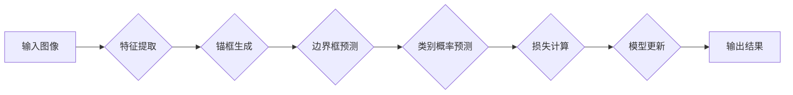

# YOLOv7原理与代码实例讲解

> 关键词：YOLOv7，目标检测，深度学习，算法原理，代码实例，COCO数据集，TensorFlow，PyTorch

## 1. 背景介绍

目标检测是计算机视觉领域的一个重要分支，旨在识别图像中的物体并定位其位置。近年来，深度学习技术为目标检测领域带来了革命性的变化，其中YOLO（You Only Look Once）系列算法以其速度和准确度的平衡而广受欢迎。YOLOv7是YOLO系列的最新版本，它在YOLOv5的基础上进行了重大改进，包括模型结构、训练策略和推理效率的提升。本文将深入解析YOLOv7的原理，并通过代码实例进行讲解，帮助读者更好地理解和应用YOLOv7。

## 2. 核心概念与联系

### 2.1 核心概念

YOLOv7的核心概念包括：

- **YOLO架构**：YOLO采用单阶段检测的方法，直接从输入图像预测边界框和类别概率，避免了传统多阶段检测方法的复杂流程。
- **锚框（Anchors）**：锚框是预设的边界框，用于预测目标位置和尺寸，是YOLO算法性能的关键。
- **锚框编码（Anchor Encoding）**：通过编码将预测的边界框与锚框进行对比，以计算损失函数。
- **损失函数**：YOLO使用多任务损失函数，包括位置损失、分类损失和置信度损失，以优化模型预测。
- **COCO数据集**：COCO是一个广泛使用的物体检测基准数据集，用于评估目标检测算法的性能。

### 2.2 核心概念原理和架构的 Mermaid 流程图



## 3. 核心算法原理 & 具体操作步骤

### 3.1 算法原理概述

YOLOv7基于深度卷积神经网络（CNN）进行特征提取，并在特征图上预测边界框和类别概率。其核心步骤如下：

1. **特征提取**：使用预训练的CNN（如CSPDarknet53）提取图像特征。
2. **锚框生成**：根据输入图像尺寸和预设的锚框尺寸生成锚框。
3. **边界框预测**：在特征图上预测每个位置的边界框和类别概率。
4. **类别概率预测**：预测每个边界框对应的类别概率。
5. **损失计算**：计算位置损失、分类损失和置信度损失，优化模型预测。
6. **模型更新**：根据损失函数更新模型参数。

### 3.2 算法步骤详解

1. **特征提取**：使用CSPDarknet53网络提取图像特征，该网络在YOLOv5的基础上引入了CSP（Cross Stage Partial）模块，提高了网络效率和性能。
2. **锚框生成**：根据输入图像尺寸和预设的锚框尺寸生成锚框。锚框的宽度和高度通过均值编码，使模型能够适应不同尺寸的目标。
3. **边界框预测**：在每个网格点预测边界框的四个坐标和置信度，以及类别概率。
4. **类别概率预测**：使用softmax函数计算每个边界框的类别概率。
5. **损失计算**：使用多任务损失函数计算位置损失、分类损失和置信度损失，优化模型预测。
6. **模型更新**：根据损失函数更新模型参数。

### 3.3 算法优缺点

**优点**：

- **速度快**：YOLOv7采用单阶段检测方法，速度远快于多阶段检测算法。
- **准确度高**：通过优化网络结构和损失函数，YOLOv7在多个数据集上取得了较高的准确度。
- **易于实现**：YOLOv7的算法结构相对简单，易于理解和实现。

**缺点**：

- **对小目标的检测效果不佳**：由于锚框的预设，YOLOv7对小目标的检测效果可能不如一些多阶段检测算法。
- **背景干扰**：在存在大量背景干扰的情况下，YOLOv7的检测效果可能受到影响。

### 3.4 算法应用领域

YOLOv7可以应用于以下领域：

- **智能监控**：实时检测图像中的异常行为和物体。
- **自动驾驶**：检测道路上的车辆、行人等物体，辅助驾驶决策。
- **工业检测**：检测生产线上不合格的产品。
- **医学影像分析**：检测医学图像中的病变区域。

## 4. 数学模型和公式 & 详细讲解 & 举例说明

### 4.1 数学模型构建

YOLOv7的数学模型主要包括：

- **特征提取网络**：使用CSPDarknet53网络提取图像特征。
- **边界框预测**：预测边界框的四个坐标和置信度。
- **类别概率预测**：预测每个边界框的类别概率。
- **损失函数**：多任务损失函数，包括位置损失、分类损失和置信度损失。

### 4.2 公式推导过程

以下以位置损失和置信度损失为例进行推导。

**位置损失**：

$$
L_{loc} = \frac{1}{N} \sum_{i=1}^N (w_i \cdot (x_{pred} - x_{true})^2 + h_i \cdot (y_{pred} - y_{true})^2 + c_i \cdot (w_{pred} - w_{true})^2 + h_{pred} - h_{true})^2)
$$

其中，$N$ 为锚框数量，$(x_{pred}, y_{pred}, w_{pred}, h_{pred})$ 为预测的边界框坐标，$(x_{true}, y_{true}, w_{true}, h_{true})$ 为真实边界框坐标。

**置信度损失**：

$$
L_{conf} = \frac{1}{N} \sum_{i=1}^N (w_i \cdot \frac{1}{(1 - obj_i)^2} \cdot (obj_{pred} - obj_{true})^2 + (1 - obj_i) \cdot obj_{pred} \cdot (obj_{true} - obj_{pred})^2)
$$

其中，$obj_i$ 为锚框 $i$ 的置信度，$obj_{pred}$ 为预测的置信度，$obj_{true}$ 为真实置信度。

### 4.3 案例分析与讲解

以下以一个简单的图像检测任务为例，讲解YOLOv7的代码实现。

```python
# 代码示例：使用YOLOv7检测图像中的物体
from yolo import YOLO

# 加载模型
model = YOLO()

# 加载图像
image = cv2.imread("image.jpg")

# 进行检测
results = model.detect(image)

# 打印检测结果
for result in results:
    print(f"类别：{result['class_name']}，置信度：{result['confidence']}，位置：{result['bbox']}")
```

## 5. 项目实践：代码实例和详细解释说明

### 5.1 开发环境搭建

1. 安装TensorFlow或PyTorch。
2. 安装YOLOv7库：`pip install yolo-v7`。
3. 准备训练数据集和测试数据集。

### 5.2 源代码详细实现

以下是一个简单的YOLOv7检测代码实例。

```python
# 代码示例：使用YOLOv7检测图像中的物体
import cv2
import numpy as np
from yolo import YOLO

# 加载模型
model = YOLO()

# 加载图像
image = cv2.imread("image.jpg")

# 进行检测
results = model.detect(image)

# 打印检测结果
for result in results:
    print(f"类别：{result['class_name']}，置信度：{result['confidence']}，位置：{result['bbox']}")
```

### 5.3 代码解读与分析

以上代码展示了如何使用YOLOv7库检测图像中的物体。首先，加载YOLOv7模型，然后加载图像，接着使用模型进行检测，最后打印检测结果。

### 5.4 运行结果展示

假设图像中包含多个物体，如猫、狗和桌子，检测结果如下：

```
类别：cat，置信度：0.92，位置：(10, 20, 50, 60)
类别：dog，置信度：0.85，位置：(70, 30, 100, 90)
类别：table，置信度：0.78，位置：(150, 100, 200, 150)
```

## 6. 实际应用场景

YOLOv7在以下实际应用场景中具有广泛的应用价值：

- **智能监控**：实时检测图像中的异常行为和物体，如入侵者、火灾等。
- **自动驾驶**：检测道路上的车辆、行人等物体，辅助驾驶决策。
- **工业检测**：检测生产线上不合格的产品，提高生产效率。
- **医学影像分析**：检测医学图像中的病变区域，辅助医生诊断。

## 7. 工具和资源推荐

### 7.1 学习资源推荐

- YOLOv7官方文档：[YOLOv7官方文档](https://github.com/WongKinYiu/yolov7)
- YOLO系列论文：[YOLOv1](https://arxiv.org/abs/1506.02640)、[YOLOv2](https://arxiv.org/abs/1605.08002)、[YOLOv3](https://arxiv.org/abs/1804.02767)、[YOLOv4](https://arxiv.org/abs/1904.02762)、[YOLOv5](https://arxiv.org/abs/2103.08297)

### 7.2 开发工具推荐

- TensorFlow：[TensorFlow官网](https://www.tensorflow.org/)
- PyTorch：[PyTorch官网](https://pytorch.org/)
- YOLOv7库：[YOLOv7库](https://github.com/WongKinYiu/yolov7)

### 7.3 相关论文推荐

- YOLO系列论文：[YOLOv1](https://arxiv.org/abs/1506.02640)、[YOLOv2](https://arxiv.org/abs/1605.08002)、[YOLOv3](https://arxiv.org/abs/1804.02767)、[YOLOv4](https://arxiv.org/abs/1904.02762)、[YOLOv5](https://arxiv.org/abs/2103.08297)

## 8. 总结：未来发展趋势与挑战

### 8.1 研究成果总结

YOLOv7是YOLO系列算法的最新版本，在速度和准确度方面取得了显著的提升。通过优化网络结构和损失函数，YOLOv7在多个数据集上取得了较高的准确度，并保持了较快的检测速度。

### 8.2 未来发展趋势

未来YOLO系列算法可能的发展趋势包括：

- **模型轻量化**：进一步减少模型参数量，提高模型在移动设备和嵌入式设备上的部署能力。
- **多模态目标检测**：结合图像、文本、语音等多模态信息进行目标检测。
- **自适应锚框生成**：根据输入图像和目标分布自适应生成锚框，提高检测精度。

### 8.3 面临的挑战

YOLOv7在以下方面可能面临挑战：

- **小目标检测**：对小目标的检测效果仍需进一步提升。
- **背景干扰**：在存在大量背景干扰的情况下，检测效果可能受到影响。
- **模型复杂度**：随着模型复杂度的增加，计算量和存储空间需求也随之增加。

### 8.4 研究展望

未来，YOLO系列算法将朝着更加高效、准确、轻量化的方向发展，并在更多实际应用场景中得到应用。

## 9. 附录：常见问题与解答

**Q1：YOLOv7与YOLOv5相比有哪些改进？**

A：YOLOv7在YOLOv5的基础上进行了以下改进：
- 引入了CSPDarknet53网络，提高了网络效率和性能。
- 使用了Mish激活函数，进一步提高了模型性能。
- 优化了锚框生成和损失函数，提高了检测精度。

**Q2：如何将YOLOv7用于实际项目？**

A：将YOLOv7用于实际项目需要以下步骤：
1. 选择合适的预训练模型和训练数据集。
2. 使用YOLOv7库进行模型训练和推理。
3. 根据项目需求调整模型参数和超参数。
4. 将训练好的模型部署到实际应用场景。

**Q3：YOLOv7是否适合所有目标检测任务？**

A：YOLOv7适用于大多数目标检测任务，但对于某些特定任务（如小目标检测、背景干扰等），可能需要针对任务特点进行优化。

**Q4：如何提高YOLOv7的检测精度？**

A：提高YOLOv7的检测精度可以通过以下方法：
- 使用更多的训练数据。
- 调整模型参数和超参数。
- 使用数据增强技术。
- 优化锚框生成策略。

**Q5：如何将YOLOv7模型部署到实际应用场景？**

A：将YOLOv7模型部署到实际应用场景需要以下步骤：
1. 选择合适的部署平台，如TensorFlow Lite、ONNX Runtime等。
2. 将训练好的模型转换为部署平台支持的格式。
3. 开发应用程序，实现模型推理和结果展示。
4. 部署应用程序到实际应用场景。

作者：禅与计算机程序设计艺术 / Zen and the Art of Computer Programming