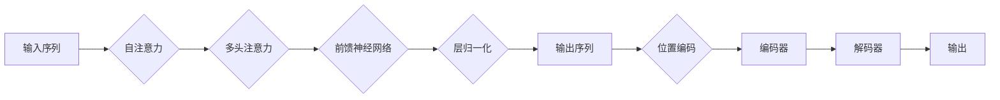

# transformer 原理与代码实例讲解

> 关键词：Transformer, 自注意力机制, 编码器-解码器架构, NLP, 自然语言处理, 预训练, 微调

## 1. 背景介绍

自然语言处理（NLP）领域近年来取得了显著进展，其中，Transformer模型的出现无疑是其中的一大亮点。自2017年Vaswani等人提出以来，Transformer及其变体在机器翻译、文本摘要、问答系统等多个NLP任务上取得了突破性的成果。本文将深入探讨Transformer的原理，并通过代码实例进行详细讲解，帮助读者全面理解这一革命性的模型。

## 2. 核心概念与联系

### 2.1 核心概念

- **自注意力机制（Self-Attention）**：Transformer模型的核心，允许模型在序列内部进行全局的信息交互，捕捉序列中各个位置之间的关系。
- **编码器-解码器架构（Encoder-Decoder Architecture）**：Transformer模型采用的双向编码器-单向解码器结构，能够处理任意长度的序列。
- **位置编码（Positional Encoding）**：由于Transformer模型没有序列的固定顺序信息，因此需要引入位置编码来为模型提供序列的顺序信息。
- **掩码语言模型（Masked Language Model, MLM）**：通过随机掩盖输入序列的部分token，使得模型能够学习到上下文信息。
- **预训练（Pre-training）**：在大量无标注文本上进行预训练，学习通用的语言表征和知识。
- **微调（Fine-tuning）**：在特定任务上有标注的数据上进行微调，以适应特定任务的需求。

### 2.2 Mermaid 流程图



## 3. 核心算法原理 & 具体操作步骤

### 3.1 算法原理概述

Transformer模型由多个相同的编码器层和多个相同的解码器层堆叠而成。编码器用于提取输入序列的特征，解码器用于生成输出序列。

- **编码器**：
  1. 输入序列通过位置编码转换为嵌入向量。
  2. 嵌入向量输入到多头自注意力层，捕捉序列中各个位置之间的关系。
  3. 多头自注意力层输出后，通过前馈神经网络进行非线性变换。
  4. 经层归一化和残差连接后，输出编码特征。

- **解码器**：
  1. 输入序列的嵌入向量首先通过编码器进行处理，获得上下文信息。
  2. 解码器的嵌入向量通过位置编码转换为嵌入向量。
  3. 嵌入向量输入到自注意力层，捕捉上下文信息。
  4. 接着输入到多头自注意力层和前馈神经网络，并进行层归一化和残差连接。
  5. 最终，解码器的输出通过softmax层生成概率分布，用于生成下一个token。

### 3.2 算法步骤详解

1. **输入序列编码**：将输入序列中的每个token转换为嵌入向量，并添加位置编码。
2. **编码器处理**：将嵌入向量输入到编码器中，经过多头自注意力层、前馈神经网络、层归一化和残差连接，得到编码特征。
3. **解码器处理**：将编码器的输出作为上下文信息，将解码器的嵌入向量输入到解码器中，经过自注意力层、多头自注意力层、前馈神经网络、层归一化和残差连接，生成概率分布。
4. **生成输出序列**：根据解码器的概率分布生成下一个token，并重复步骤2-4，直到生成整个输出序列。

### 3.3 算法优缺点

**优点**：

- **并行计算**：Transformer模型可以并行计算，训练速度更快。
- **全局上下文信息**：自注意力机制能够捕捉序列中各个位置之间的关系，从而获得丰富的全局上下文信息。
- **灵活**：可以应用于各种NLP任务，如机器翻译、文本摘要、问答系统等。

**缺点**：

- **计算复杂度高**：自注意力机制的计算复杂度较高，对硬件资源要求较高。
- **难以处理长序列**：对于非常长的序列，Transformer模型的性能会下降。

### 3.4 算法应用领域

Transformer模型在以下NLP任务上取得了显著的成果：

- **机器翻译**：如神经机器翻译（NMT）。
- **文本摘要**：如摘要生成、对话生成等。
- **问答系统**：如阅读理解、对话系统等。
- **文本分类**：如情感分析、主题分类等。

## 4. 数学模型和公式 & 详细讲解 & 举例说明

### 4.1 数学模型构建

Transformer模型的数学模型可以表示为：

$$
\mathbf{y} = \text{Transformer}(\mathbf{x}, \mathbf{P})
$$

其中，$\mathbf{x}$ 是输入序列，$\mathbf{P}$ 是位置编码，$\mathbf{y}$ 是输出序列。

### 4.2 公式推导过程

以自注意力机制为例，其计算公式为：

$$
\text{Attention}(Q, K, V) = \frac{\text{softmax}\left(\frac{QK^T}{\sqrt{d_k}}\right) V}
$$

其中，$Q, K, V$ 分别是查询（Query）、键（Key）和值（Value）向量，$d_k$ 是键的维度，softmax函数用于将注意力权重转换为概率分布。

### 4.3 案例分析与讲解

以下是一个简单的Transformer模型代码实例：

```python
import torch
import torch.nn as nn

class TransformerModel(nn.Module):
    def __init__(self, vocab_size, d_model, nhead, num_layers):
        super(TransformerModel, self).__init__()
        self.embedding = nn.Embedding(vocab_size, d_model)
        self.transformer = nn.Transformer(d_model, nhead, num_layers)
        self.fc = nn.Linear(d_model, vocab_size)

    def forward(self, src):
        src = self.embedding(src)
        output = self.transformer(src)
        output = self.fc(output)
        return output
```

在上面的代码中，我们定义了一个简单的Transformer模型，其中：

- `vocab_size` 是词汇表大小。
- `d_model` 是模型中每个嵌入向量的维度。
- `nhead` 是多头注意力的头数。
- `num_layers` 是模型层数。

## 5. 项目实践：代码实例和详细解释说明

### 5.1 开发环境搭建

在进行Transformer模型的项目实践之前，我们需要准备好以下开发环境：

- Python 3.6+
- PyTorch 1.2+
- Transformers库

### 5.2 源代码详细实现

以下是一个使用PyTorch和Transformers库实现的简单的机器翻译模型：

```python
from transformers import BertModel, AdamW
from torch.nn import functional as F

class TranslationModel(nn.Module):
    def __init__(self, src_vocab_size, trg_vocab_size, d_model, nhead, num_layers):
        super(TranslationModel, self).__init__()
        self.encoder = BertModel.from_pretrained('bert-base-uncased')
        self.decoder = nn.Transformer(d_model, nhead, num_layers)
        self.fc = nn.Linear(d_model, trg_vocab_size)

    def forward(self, src, trg):
        src_emb = self.encoder(src)[0]
        output = self.decoder(src_emb, trg)
        output = self.fc(output)
        return output
```

在上面的代码中，我们定义了一个简单的机器翻译模型，其中：

- `src_vocab_size` 是源语言词汇表大小。
- `trg_vocab_size` 是目标语言词汇表大小。
- `d_model` 是模型中每个嵌入向量的维度。
- `nhead` 是多头注意力的头数。
- `num_layers` 是模型层数。

### 5.3 代码解读与分析

在上面的代码中，我们首先定义了一个编码器，使用预训练的BERT模型。然后定义了一个解码器，使用Transformer模型。最后定义了一个全连接层，将解码器的输出转换为目标语言的词汇表大小。

### 5.4 运行结果展示

以下是一个简单的训练和测试流程：

```python
model = TranslationModel(src_vocab_size, trg_vocab_size, d_model, nhead, num_layers)
optimizer = AdamW(model.parameters(), lr=2e-5)

for epoch in range(epochs):
    for src, trg in train_loader:
        model.zero_grad()
        output = model(src, trg)
        loss = F.cross_entropy(output.view(-1, trg_vocab_size), trg.view(-1))
        loss.backward()
        optimizer.step()
```

在上述代码中，我们使用AdamW优化器进行训练，并使用交叉熵损失函数计算损失。

## 6. 实际应用场景

Transformer模型在以下实际应用场景中取得了显著成果：

- **机器翻译**：如神经机器翻译（NMT）。
- **文本摘要**：如摘要生成、对话生成等。
- **问答系统**：如阅读理解、对话系统等。
- **文本分类**：如情感分析、主题分类等。

## 7. 工具和资源推荐

### 7.1 学习资源推荐

- **书籍**：
  - 《Deep Learning for Natural Language Processing》
  - 《Attention Is All You Need》
- **在线课程**：
  - fast.ai的自然语言处理课程
  - TensorFlow 2.0 for Natural Language Processing

### 7.2 开发工具推荐

- **PyTorch**
- **Transformers库**
- **Hugging Face Spaces**

### 7.3 相关论文推荐

- **Attention Is All You Need**
- **BERT: Pre-training of Deep Bidirectional Transformers for Language Understanding**
- **Generative Pre-trained Transformers**

## 8. 总结：未来发展趋势与挑战

### 8.1 研究成果总结

Transformer模型的出现，为NLP领域带来了革命性的变化。它通过自注意力机制和编码器-解码器架构，实现了对序列的全局建模，并在多个NLP任务上取得了显著的成果。

### 8.2 未来发展趋势

- **模型轻量化**：为了更好地在移动设备和边缘设备上部署，模型轻量化将成为未来的一个重要研究方向。
- **多模态融合**：将Transformer模型与其他模态的信息进行融合，如图像、视频、音频等，将进一步提升模型的能力。
- **可解释性**：提高模型的可解释性，使其决策过程更加透明，是未来研究的一个重要方向。

### 8.3 面临的挑战

- **计算复杂度**：Transformer模型计算复杂度较高，需要大量的计算资源。
- **长序列处理**：Transformer模型难以处理非常长的序列。
- **模型可解释性**：模型的决策过程难以解释。

### 8.4 研究展望

Transformer模型将继续在NLP领域发挥重要作用，并与其他人工智能技术相结合，推动人工智能的发展。

## 9. 附录：常见问题与解答

**Q1：什么是Transformer模型？**

A：Transformer模型是一种基于自注意力机制的深度神经网络模型，用于处理序列数据。

**Q2：Transformer模型有什么优点？**

A：Transformer模型具有并行计算能力强、能够捕捉全局上下文信息、灵活等优点。

**Q3：Transformer模型有什么缺点？**

A：Transformer模型计算复杂度较高、难以处理长序列、模型可解释性差等。

**Q4：如何使用Transformer模型进行机器翻译？**

A：可以使用预训练的BERT模型作为编码器，使用Transformer模型作为解码器，进行机器翻译。

**Q5：Transformer模型有哪些应用场景？**

A：Transformer模型可以应用于机器翻译、文本摘要、问答系统、文本分类等多个NLP任务。

作者：禅与计算机程序设计艺术 / Zen and the Art of Computer Programming